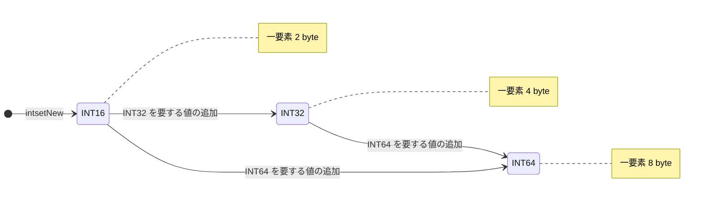

# 第10章 intset 整数集合

> **本章で読むソース**
>
> - [`src/intset.h`](https://github.com/valkey-io/valkey/blob/9.1.0/src/intset.h)
> - [`src/intset.c`](https://github.com/valkey-io/valkey/blob/9.1.0/src/intset.c)

## この章の狙い

intset は、要素がすべて整数からなる集合を、ソート済みの連続した配列として保持するデータ構造である。
本章では、intset がどのようなメモリレイアウトを取り、要素の存在判定と挿入位置の決定をどのように行うかをコードから読み解く。
あわせて、必要になるまで小さい整数幅で値を持ち、収まらない値が来たときだけ全体を広い幅へ昇格させる仕組みと、ソート済み配列を二分探索する仕組みという、二つの最適化を機構のレベルで説明する。

## 前提

特になし。
`zmalloc` / `zrealloc` によるメモリ確保が背景にあるが、本章を読むだけなら知らなくても差し支えない。

## intset の構造とレイアウト

intset の役割は、整数だけからなる集合を省メモリで保持することである。
構造体の定義は次のとおりで、ヘッダはわずか8バイト（`uint32_t` が二つ）に収まる。

[`src/intset.h` L35-L39](https://github.com/valkey-io/valkey/blob/9.1.0/src/intset.h#L35-L39)

```c
typedef struct intset {
    uint32_t encoding;
    uint32_t length;
    int8_t contents[];
} intset;
```

`encoding` は各要素を何バイトで持つかを表す。
`length` は要素数である。
`contents[]` はフレキシブル配列メンバで、要素本体はヘッダの直後に隙間なく並ぶ。
`contents` の型は `int8_t` だが、実際の各要素の幅は `encoding` が決める。
取り出すときは `encoding` に応じて2バイト、4バイト、8バイトのいずれかの整数として読み直す。

その幅の候補は次の三つである。
それぞれ `int16_t` / `int32_t` / `int64_t` のサイズ（2 / 4 / 8）に等しい。

[`src/intset.c` L39-L43](https://github.com/valkey-io/valkey/blob/9.1.0/src/intset.c#L39-L43)

```c
/* Note that these encodings are ordered, so:
 * INTSET_ENC_INT16 < INTSET_ENC_INT32 < INTSET_ENC_INT64. */
#define INTSET_ENC_INT16 (sizeof(int16_t))
#define INTSET_ENC_INT32 (sizeof(int32_t))
#define INTSET_ENC_INT64 (sizeof(int64_t))
```

冒頭コメントが述べるとおり、三つのエンコーディングは値の大小として順序づけられている。
この順序が、後で見る昇格の判定をそのまま数値の比較で書けるようにしている。

`contents` の中身はつねに昇順にソートされている。
たとえば INT16 で `{5, 17, 32}` を持つ intset は、ヘッダのあとに2バイトずつ三つの整数が並ぶ。

```text
encoding = 2 (INT16)   length = 3
+----------+----------+--------+--------+--------+
| encoding | length   | 5(i16) |17(i16) |32(i16) |
|  4 byte  |  4 byte  | 2 byte | 2 byte | 2 byte |
+----------+----------+--------+--------+--------+
                      ^ contents[] はここから連続
```

各要素の値は、位置とエンコーディングから直接アドレスを計算して読み書きする。
`_intsetGet` は、設定中のエンコーディングで `pos` 番目の要素を取り出す。

[`src/intset.c` L76-L95](https://github.com/valkey-io/valkey/blob/9.1.0/src/intset.c#L76-L95)

```c
/* Return the value at pos, using the configured encoding. */
static int64_t _intsetGet(intset *is, int pos) {
    return _intsetGetEncoded(is, pos, intrev32ifbe(is->encoding));
}

/* Set the value at pos, using the configured encoding. */
static void _intsetSet(intset *is, int pos, int64_t value) {
    uint32_t encoding = intrev32ifbe(is->encoding);

    if (encoding == INTSET_ENC_INT64) {
        ((int64_t *)is->contents)[pos] = value;
        memrev64ifbe(((int64_t *)is->contents) + pos);
    } else if (encoding == INTSET_ENC_INT32) {
        ((int32_t *)is->contents)[pos] = value;
        memrev32ifbe(((int32_t *)is->contents) + pos);
    } else {
        ((int16_t *)is->contents)[pos] = value;
        memrev16ifbe(((int16_t *)is->contents) + pos);
    }
}
```

`contents` をエンコーディングに対応するポインタ型へキャストし、`pos` で添字を取れば、それだけで要素のアドレスが定まる。
連続配列なので、要素ごとのポインタや長さ情報を持つ必要がない。
これが intset の省メモリの土台である。

`intrev32ifbe` や `memrev16ifbe` は、ビッグエンディアン環境でのバイト順反転を行うマクロである。
intset はディスク上の表現（RDB）でリトルエンディアンに固定されているため、読み書きのたびに環境に応じてバイト順を直す。
本章の論点ではないので、以後は値そのものの流れに注目する。

外部に値を取り出す `intsetGet` は、範囲チェックを加えて `_intsetGet` を呼ぶだけである。

[`src/intset.c` L278-L286](https://github.com/valkey-io/valkey/blob/9.1.0/src/intset.c#L278-L286)

```c
/* Get the value at the given position. When this position is
 * out of range the function returns 0, when in range it returns 1. */
uint8_t intsetGet(intset *is, uint32_t pos, int64_t *value) {
    if (pos < intrev32ifbe(is->length)) {
        *value = _intsetGet(is, pos);
        return 1;
    }
    return 0;
}
```

## 二分探索による存在判定と挿入位置の決定

intset の要素はつねに昇順に並ぶ。
この不変条件があるおかげで、ある値が集合に含まれるかどうかを O(log n) の二分探索で判定できる。
存在判定を担うのが `intsetSearch` である。

[`src/intset.c` L113-L156](https://github.com/valkey-io/valkey/blob/9.1.0/src/intset.c#L113-L156)

```c
/* Search for the position of "value". Return 1 when the value was found and
 * sets "pos" to the position of the value within the intset. Return 0 when
 * the value is not present in the intset and sets "pos" to the position
 * where "value" can be inserted. */
static uint8_t intsetSearch(intset *is, int64_t value, uint32_t *pos) {
    int min = 0, max = intrev32ifbe(is->length) - 1, mid = -1;
    int64_t cur = -1;

    /* The value can never be found when the set is empty */
    if (intrev32ifbe(is->length) == 0) {
        if (pos) *pos = 0;
        return 0;
    } else {
        /* Check for the case where we know we cannot find the value,
         * but do know the insert position. */
        if (value > _intsetGet(is, max)) {
            if (pos) *pos = intrev32ifbe(is->length);
            return 0;
        } else if (value < _intsetGet(is, 0)) {
            if (pos) *pos = 0;
            return 0;
        }
    }

    while (max >= min) {
        mid = ((unsigned int)min + (unsigned int)max) >> 1;
        cur = _intsetGet(is, mid);
        if (value > cur) {
            min = mid + 1;
        } else if (value < cur) {
            max = mid - 1;
        } else {
            break;
        }
    }

    if (value == cur) {
        if (pos) *pos = mid;
        return 1;
    } else {
        if (pos) *pos = min;
        return 0;
    }
}
```

この関数の返り値は、値が見つかったかどうかである。
`pos` には別の意味も載せる。
見つかったときは、その値がある位置を `pos` に書く。
見つからなかったときは、その値を挿入すべき位置を `pos` に書く。
一回の探索で「あるか」と「どこに入れるか」の両方が決まるため、挿入処理は探索結果をそのまま使える。

冒頭には、二分探索に入る前の早期判定が二つある。
末尾要素より大きい値なら、入る場所は配列の末尾（`length`）であり、探索は不要だと即座に分かる。
先頭要素より小さい値なら、入る場所は先頭（`0`）である。
集合への追加は末尾への追加が多いため、この末尾チェックは典型的な挿入で二分探索のループ自体を省く効果がある。

ループ本体は素直な二分探索である。
`mid` の計算で `min` と `max` を `unsigned int` にキャストしてから足しているのは、加算が `int` の最大値を超えてオーバーフローするのを避けるためである。
一致する値が見つかればループを抜けて発見を返し、範囲が尽きれば最後の `min` を挿入位置として返す。

存在判定の公開関数 `intsetFind` は、この `intsetSearch` を `pos` なしで呼ぶ。
ただしその前に、探す値のエンコーディングが集合の現在のエンコーディングに収まるかを確かめる。
収まらないほど大きい（または小さい）値は、そもそも集合に存在しえないので、探索する前に「なし」と判定できる。

## エンコーディング昇格による省メモリ

intset のもう一つの工夫は、必要になるまで要素を小さい整数幅で持ち続ける点にある。
新しい値が来たとき、その値を表すのに必要な最小のエンコーディングを `_intsetValueEncoding` が返す。

[`src/intset.c` L45-L53](https://github.com/valkey-io/valkey/blob/9.1.0/src/intset.c#L45-L53)

```c
/* Return the required encoding for the provided value. */
static uint8_t _intsetValueEncoding(int64_t v) {
    if (v < INT32_MIN || v > INT32_MAX)
        return INTSET_ENC_INT64;
    else if (v < INT16_MIN || v > INT16_MAX)
        return INTSET_ENC_INT32;
    else
        return INTSET_ENC_INT16;
}
```

新しく作られた intset のエンコーディングは INT16 である（`intsetNew` が `INTSET_ENC_INT16` で初期化する）。
INT16 の範囲に収まる値だけを入れているあいだは、一要素あたり2バイトで済む。
INT32 や INT64 を要する値が一つも来なければ、集合全体が最小の幅を保つ。

エンコーディングは一方向にのみ昇格し、いちど広げた幅を縮めることはない。
状態遷移で示すと次のようになる。



挿入の入口である `intsetAdd` は、まず追加する値の必要エンコーディングと現在のエンコーディングを比べる。

[`src/intset.c` L204-L232](https://github.com/valkey-io/valkey/blob/9.1.0/src/intset.c#L204-L232)

```c
/* Insert an integer in the intset */
intset *intsetAdd(intset *is, int64_t value, uint8_t *success) {
    uint8_t valenc = _intsetValueEncoding(value);
    uint32_t pos;
    if (success) *success = 1;

    /* Upgrade encoding if necessary. If we need to upgrade, we know that
     * this value should be either appended (if > 0) or prepended (if < 0),
     * because it lies outside the range of existing values. */
    if (valenc > intrev32ifbe(is->encoding)) {
        /* This always succeeds, so we don't need to curry *success. */
        return intsetUpgradeAndAdd(is, value);
    } else {
        /* Abort if the value is already present in the set.
         * This call will populate "pos" with the right position to insert
         * the value when it cannot be found. */
        if (intsetSearch(is, value, &pos)) {
            if (success) *success = 0;
            return is;
        }

        is = intsetResize(is, intrev32ifbe(is->length) + 1);
        if (pos < intrev32ifbe(is->length)) intsetMoveTail(is, pos, pos + 1);
    }

    _intsetSet(is, pos, value);
    is->length = intrev32ifbe(intrev32ifbe(is->length) + 1);
    return is;
}
```

エンコーディングは大小として順序づけられているので、判定は `valenc > is->encoding` という一回の比較で書ける。
必要な幅のほうが大きければ昇格へ進み、そうでなければ現在の幅のまま挿入する。

昇格へ進む場合、その値が既存のどの値より範囲の外にあることが確定している。
INT16 の集合に INT32 を要する値が来たということは、その値が INT16 の表せる最大値より大きいか、最小値より小さいかのどちらかである。
だから挿入位置は末尾か先頭に決まり、二分探索による位置決定も、重複チェックもいらない。
昇格を行うのが `intsetUpgradeAndAdd` である。

[`src/intset.c` L158-L181](https://github.com/valkey-io/valkey/blob/9.1.0/src/intset.c#L158-L181)

```c
/* Upgrades the intset to a larger encoding and inserts the given integer. */
static intset *intsetUpgradeAndAdd(intset *is, int64_t value) {
    uint8_t curenc = intrev32ifbe(is->encoding);
    uint8_t newenc = _intsetValueEncoding(value);
    int length = intrev32ifbe(is->length);
    int prepend = value < 0 ? 1 : 0;

    /* First set new encoding and resize */
    is->encoding = intrev32ifbe(newenc);
    is = intsetResize(is, intrev32ifbe(is->length) + 1);

    /* Upgrade back-to-front so we don't overwrite values.
     * Note that the "prepend" variable is used to make sure we have an empty
     * space at either the beginning or the end of the intset. */
    while (length--) _intsetSet(is, length + prepend, _intsetGetEncoded(is, length, curenc));

    /* Set the value at the beginning or the end. */
    if (prepend)
        _intsetSet(is, 0, value);
    else
        _intsetSet(is, intrev32ifbe(is->length), value);
    is->length = intrev32ifbe(intrev32ifbe(is->length) + 1);
    return is;
}
```

処理の流れは次のとおりである。
まずエンコーディングを新しい幅に書き換え、要素一つ分を加えた大きさへ `intsetResize` で拡張する。
次に、既存の各要素を古い幅で読み、新しい幅で書き直す。
このとき末尾から先頭へ向かって（`while (length--)`）処理する点が要である。
新しい幅は古い幅より広いので、各要素は前より後ろのアドレスへ移る。
先頭から処理すると、まだ移していない後ろの要素を上書きしてしまう。
末尾から処理すれば、書き込み先はつねに未処理の領域の外側にあり、上書きが起きない。

`prepend` は、追加する値が負か正かで、空ける一マスを先頭側にするか末尾側にするかを切り替える変数である。
追加値が負なら集合の最小値より小さいので先頭（位置0）に置き、既存要素は一つずつ後ろへずらした位置（`length + prepend`）へ書き直す。
追加値が正なら集合の最大値より大きいので末尾に置く。
昇格と移し替えと挿入を一度の走査でまとめて行うため、追加の `memmove` を要しない。

次の図は、INT16 で `{5, 17, 32}` を持つ集合に、INT32 を要する `80000` を追加したときの昇格の様子である。

```text
昇格前（encoding = INT16, length = 3）
+----------+----------+--------+--------+--------+
| encoding | length=3 | 5(i16) |17(i16) |32(i16) |
+----------+----------+--------+--------+--------+

昇格後（encoding = INT32, length = 4）
+----------+----------+----------+----------+----------+-----------+
| encoding | length=4 |  5(i32)  | 17(i32)  | 32(i32)  | 80000(i32)|
+----------+----------+----------+----------+----------+-----------+
  各要素が 2 byte 幅から 4 byte 幅へ広がり、80000 は末尾に追加された
```

昇格しない通常の挿入では、二分探索で得た位置 `pos` に値を入れる。
`pos` が末尾より手前なら、その位置以降の要素を `intsetMoveTail` が `memmove` で一つ後ろへずらして隙間を作る。
連続配列の中間への挿入なので、ずらす要素数に比例したコストがかかる。
これは連続配列がもたらす省メモリと引き換えのコストである。
末尾への追加（`pos` が `length` に等しい場合）なら、ずらす要素がないのでこのコストは生じない。

## まとめ

- intset は、整数だけの集合を、ソート済みの連続配列として保持する。ヘッダは `encoding` と `length` の8バイトのみで、要素は隙間なく並ぶ。
- 各要素の幅は `encoding` が決める。INT16 / INT32 / INT64 の三段階があり、新規の集合は最小の INT16 から始まる。
- 収まらない値が来たときだけ `intsetUpgradeAndAdd` が全体を広い幅へ昇格する。必要になるまで小さい幅を保つため省メモリである。昇格時は既存要素を末尾から書き直して上書きを避ける。
- ソート済みなので `intsetSearch` が O(log n) の二分探索で存在判定と挿入位置の決定を一度に行う。末尾と先頭への早期判定で典型的な追加ではループを省く。
- 連続配列ゆえに省メモリだが、中間への挿入や削除では `intsetMoveTail` の `memmove` で要素数に比例したコストがかかる。

## 関連する章

- intset は、全要素が整数で小さいときのセット型のエンコーディングとして使われる。セット型がいつ intset を選び、いつ別のエンコーディングへ切り替えるかは [第17章 セット型](../part03-objects-types/17-t-set.md) で扱う。
