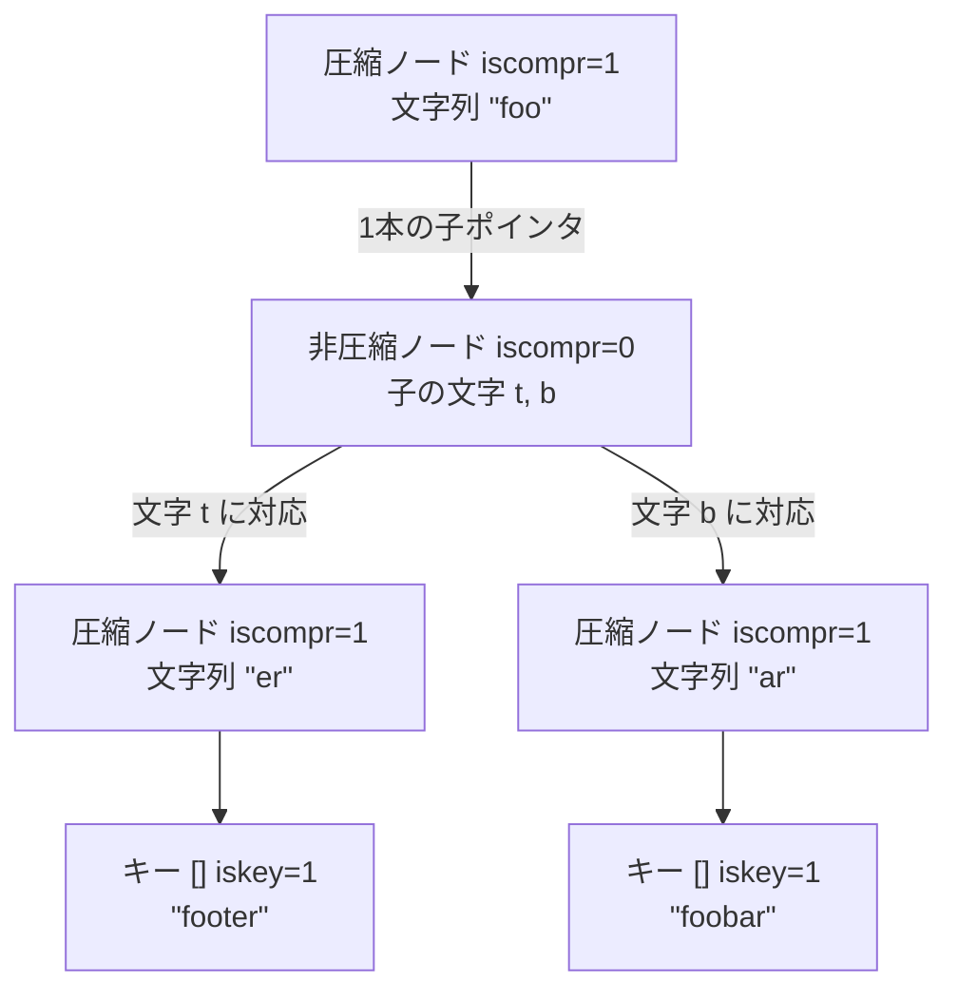

# 第11章 rax 基数木

> **本章で読むソース**
>
> - [`src/rax.h`](https://github.com/valkey-io/valkey/blob/9.1.0/src/rax.h)
> - [`src/rax.c`](https://github.com/valkey-io/valkey/blob/9.1.0/src/rax.c)

## この章の狙い

`rax` は、キーの共通プレフィックスを圧縮して格納する順序付きの木である。
本章では、`raxNode` がビットフィールドと可変長データで圧縮ノードと非圧縮ノードを表し分ける仕組みを読む。
枝分かれのない連続した文字を1ノードにまとめるプレフィックス圧縮が、なぜメモリと探索段数を減らすのか、そして挿入時にこの圧縮をほどく「ノード分割」がどう走るのかを、実コードと冒頭コメントの図に沿って確認する。
最後に、キーを辞書順に走査する `raxIterator` の前進処理を追う。

## 前提

第4章「[文字列 SDS](04-sds.md)」を先に読んでおくと、可変長のバイト列を一塊のメモリに詰めるレイアウトの感覚が共有できる。
ただし本章は SDS の知識がなくても読める。

## rax は何を解くのか

`rax` は基数木（radix tree、圧縮された trie）の実装である。
trie はキーを1文字ずつたどって葉に到達する木であり、共通のプレフィックスを持つキーは木の上部を共有する。
素朴な trie は1文字ごとに1ノードを割り当てるため、長いキーでは枝分かれのない一本道のノードが大量に並ぶ。
基数木はこの一本道を1つのノードに圧縮し、メモリとたどる段数の両方を抑える。

`rax` は順序付きの構造でもある。
各ノードの子は文字の昇順に並ぶため、木全体を辞書順に走査できる。
ストリーム型はこの2つの性質を使う。
エントリ ID（ミリ秒タイムスタンプとシーケンス番号からなる128ビット値）をビッグエンディアンのバイト列にしてキーにすると、ID の数値順がそのままバイト列の辞書順に一致し、`rax` の順序付き走査が時系列の走査になる。
ストリームのほか、コンシューマグループの管理、クラスタのチャネル管理などでも `rax` が使われる（本章末の「関連する章」を参照）。

木全体を表す `rax` 構造体は小さい。

[`src/rax.h` L133-L138](https://github.com/valkey-io/valkey/blob/9.1.0/src/rax.h#L133-L138)

```c
typedef struct rax {
    raxNode *head;     /* Pointer to root node of tree */
    uint64_t numele;   /* Number of keys in the tree */
    uint64_t numnodes; /* Number of rax nodes in the tree */
    size_t alloc_size; /* Total allocation size of the tree in bytes */
} rax;
```

`head` が根ノードを指し、`numele` に格納したキー数、`numnodes` にノード総数を持つ。
木の実体はすべて `raxNode` 側にあり、`rax` はその入り口と統計値を保持するだけである。
`raxNew` は要素を持たない根ノードを1つ作って木を初期化する。

[`src/rax.c` L189-L202](https://github.com/valkey-io/valkey/blob/9.1.0/src/rax.c#L189-L202)

```c
rax *raxNew(void) {
    rax *rax = rax_malloc(sizeof(*rax));
    if (rax == NULL) return NULL;
    rax->numele = 0;
    rax->numnodes = 1;
    rax->head = raxNewNode(0, 0);
    rax->alloc_size = rax_ptr_alloc_size(rax) + rax_ptr_alloc_size(rax->head);
    if (rax->head == NULL) {
        rax_free(rax);
        return NULL;
    } else {
        return rax;
    }
}
```

## ノードの構造とプレフィックス圧縮

`rax.c` の冒頭には、木の表現と圧縮の効果を示す図のコメントが置かれている。
まず圧縮をかけない素朴な表現を見る。
文字列 `"foo"`、`"foobar"`、`"footer"` を挿入した後の木で、キーを表すノードは `[]`、そうでないノードは `()` で書かれている。

[`src/rax.h` L41-L55](https://github.com/valkey-io/valkey/blob/9.1.0/src/rax.h#L41-L55)

```text
 * This is the vanilla representation:
 *
 *              (f) ""
 *                \
 *                (o) "f"
 *                  \
 *                  (o) "fo"
 *                    \
 *                  [t   b] "foo"
 *                  /     \
 *         "foot" (e)     (a) "foob"
 *                /         \
 *      "foote" (r)         (r) "fooba"
 *              /             \
 *    "footer" []             [] "foobar"
```

`"f"` から `"foo"` までは枝分かれがなく、1文字ずつのノードが一本道で続く。
この一本道を1つのノードにまとめたのがプレフィックス圧縮である。
同じ木は次のように圧縮される。

[`src/rax.h` L57-L70](https://github.com/valkey-io/valkey/blob/9.1.0/src/rax.h#L57-L70)

```text
 * However, this implementation implements a very common optimization where
 * successive nodes having a single child are "compressed" into the node
 * itself as a string of characters, each representing a next-level child,
 * and only the link to the node representing the last character node is
 * provided inside the representation. So the above representation is turned
 * into:
 *
 *                  ["foo"] ""
 *                     |
 *                  [t   b] "foo"
 *                  /     \
 *        "foot" ("er")    ("ar") "foob"
 *                 /          \
 *       "footer" []          [] "foobar"
```

`"f"`、`"fo"`、`"foo"` の3ノードが `["foo"]` という1ノードに畳まれている。
このノードは `"foo"` という連続した文字列を内部に持ち、唯一の子（`t` と `b` で枝分かれするノード）への1本のポインタだけを持つ。
これが圧縮ノードである。
一方、`t` と `b` の2つの子を持つノードは枝分かれがあるため圧縮できない。
これが非圧縮ノードである。

この2種類のノードはどちらも `raxNode` という1つの構造体で表される。
先頭のビットフィールドが種別とサイズを符号化する。

[`src/rax.h` L98-L102](https://github.com/valkey-io/valkey/blob/9.1.0/src/rax.h#L98-L102)

```c
typedef struct raxNode {
    uint32_t iskey : 1;   /* Does this node contain a key? */
    uint32_t isnull : 1;  /* Associated value is NULL (don't store it). */
    uint32_t iscompr : 1; /* Node is compressed. */
    uint32_t size : 29;   /* Number of children, or compressed string len. */
```

`iskey` は、このノードがキーの終端であるかを表す。
`isnull` は、キーに対応する値が `NULL`（値ポインタを格納しない）であるかを表す。
`iscompr` がノードの種別を区別し、`size` は2つの意味を兼ねる。
非圧縮ノードでは `size` は子の数を、圧縮ノードでは内部に持つ文字列の長さを表す。
4つのフィールドを32ビットに詰めることで、ノードのヘッダは4バイトに収まる。

実際の文字とポインタは、ヘッダの直後の `data[]`（柔軟配列メンバ）に種別ごとのレイアウトで並ぶ。
構造体のコメントがそのレイアウトを示す。

[`src/rax.h` L103-L131](https://github.com/valkey-io/valkey/blob/9.1.0/src/rax.h#L103-L131)

```c
    /* Data layout is as follows:
     *
     * If node is not compressed we have 'size' bytes, one for each children
     * character, and 'size' raxNode pointers, point to each child node.
     * Note how the character is not stored in the children but in the
     * edge of the parents:
     *
     * [header iscompr=0][abc][a-ptr][b-ptr][c-ptr](value-ptr?)
     *
     * if node is compressed (iscompr bit is 1) the node has 1 children.
     * In that case the 'size' bytes of the string stored immediately at
     * the start of the data section, represent a sequence of successive
     * nodes linked one after the other, for which only the last one in
     * the sequence is actually represented as a node, and pointed to by
     * the current compressed node.
     *
     * [header iscompr=1][xyz][z-ptr](value-ptr?)
     *
     * Both compressed and not compressed nodes can represent a key
     * with associated data in the radix tree at any level (not just terminal
     * nodes).
     *
     * If the node has an associated key (iskey=1) and is not NULL
     * (isnull=0), then after the raxNode pointers pointing to the
     * children, an additional value pointer is present (as you can see
     * in the representation above as "value-ptr" field).
     */
    unsigned char data[];
} raxNode;
```

非圧縮ノードは、`size` 個の文字を並べ、その後に同じ数の子ポインタを並べる。
i 番目の文字に対応する子が i 番目のポインタである。
ここで重要なのは、文字が子ノードの中ではなく親ノードの側（辺）に置かれることである。
圧縮ノードは、内部に持つ文字列の長さぶんの文字を並べ、その後に子ポインタを1本だけ持つ。
この1本は文字列の最後の文字に対応するノードを指す。
`iskey` が立ち、かつ `isnull` でない場合は、子ポインタ群の後ろに値ポインタが続く。

文字を親側に置くこのレイアウトが、メモリを節約する核である。
n 個の子それぞれに1バイトの文字と1本のポインタを持たせるだけでよく、子ノード自身は自分がどの文字に対応するかを覚えない。
圧縮ノードに至っては、連続する k 文字をまとめてもポインタは1本で済む。
素朴な trie なら k 個のノードと k 本のポインタが必要なところを、1ノードと k バイトの文字列に畳める。

次の図は、ここまでの2種類のノードを1つの基数木として示したものである。



## 探索：raxLowWalk

探索も挿入も削除も、まず木をどこまでたどれるかを求める `raxLowWalk` から始まる。
この関数はキー `s` を先頭からたどり、たどれなくなった位置（停止ノード、消費した文字数、圧縮ノード内での停止位置）を呼び出し側に返す。

[`src/rax.c` L443-L485](https://github.com/valkey-io/valkey/blob/9.1.0/src/rax.c#L443-L485)

```c
static inline size_t
raxLowWalk(rax *rax, unsigned char *s, size_t len, raxNode **stopnode, raxNode ***plink, int *splitpos, raxStack *ts) {
    raxNode *h = rax->head;
    raxNode **parentlink = &rax->head;

    size_t i = 0; /* Position in the string. */
    size_t j = 0; /* Position in the node children (or bytes if compressed).*/
    while (h->size && i < len) {
        debugnode("Lookup current node", h);
        unsigned char *v = h->data;

        if (h->iscompr) {
            for (j = 0; j < h->size && i < len; j++, i++) {
                if (v[j] != s[i]) break;
            }
            if (j != h->size) break;
        } else {
            // ... (中略) ...
            for (j = 0; j < h->size; j++) {
                if (v[j] == s[i]) break;
            }
            if (j == h->size) break;
            i++;
        }

        if (ts) raxStackPush(ts, h); /* Save stack of parent nodes. */
        raxNode **children = raxNodeFirstChildPtr(h);
        if (h->iscompr) j = 0; /* Compressed node only child is at index 0. */
        memcpy(&h, children + j, sizeof(h));
        parentlink = children + j;
        j = 0; /* If the new node is non compressed and we do not
                  iterate again (since i == len) set the split
                  position to 0 to signal this node represents
                  the searched key. */
    }
    debugnode("Lookup stop node is", h);
    if (stopnode) *stopnode = h;
    if (plink) *plink = parentlink;
    if (splitpos && h->iscompr) *splitpos = j;
    return i;
}
```

処理はノードの種別で分かれる。
圧縮ノードでは、内部の文字列とキーを先頭から1文字ずつ突き合わせる。
途中で1文字でも食い違えば、その位置 `j` を記録してループを抜ける。
この `j` が、後述する挿入時の分割位置になる。
非圧縮ノードでは、`size` 個の文字を線形に走査して一致する子を探す。

非圧縮ノードの走査が、二分探索ではなく線形走査である点にコメントが付いている。

[`src/rax.c` L460-L465](https://github.com/valkey-io/valkey/blob/9.1.0/src/rax.c#L460-L465)

```c
            /* Even when h->size is large, linear scan provides good
             * performances compared to other approaches that are in theory
             * more sounding, like performing a binary search. */
            for (j = 0; j < h->size; j++) {
                if (v[j] == s[i]) break;
            }
```

子の文字は1バイトずつ連続して並ぶため、線形走査はキャッシュに乗った連続メモリを順になめるだけで済む。
分岐の少ない単純なループは、二分探索の理論的な少ない比較回数を実際の速度で上回りやすい、というのがこのコメントの趣旨である。

`raxFind` は `raxLowWalk` の薄いラッパーである。

[`src/rax.c` L909-L918](https://github.com/valkey-io/valkey/blob/9.1.0/src/rax.c#L909-L918)

```c
int raxFind(rax *rax, unsigned char *s, size_t len, void **value) {
    raxNode *h;

    debugf("### Lookup: %.*s\n", (int)len, s);
    int splitpos = 0;
    size_t i = raxLowWalk(rax, s, len, &h, NULL, &splitpos, NULL);
    if (i != len || (h->iscompr && splitpos != 0) || !h->iskey) return 0;
    if (value != NULL) *value = raxGetData(h);
    return 1;
}
```

キーが見つかったと言えるのは、3つの条件がそろうときだけである。
キー全体を消費しきった（`i == len`）こと、圧縮ノードの途中で止まっていない（`splitpos` が0）こと、止まったノードがキーの終端である（`iskey`）ことである。
圧縮ノードの途中で止まった場合、たとえば `"foo"` を持つ圧縮ノードに対して `"fo"` を探した場合は、文字列としては一致していてもキーとしては存在しないため、見つからないと判定される。

## 挿入とノード分割

挿入は `raxGenericInsert` が担う。
まず `raxLowWalk` でたどれるところまで進む。

[`src/rax.c` L494-L503](https://github.com/valkey-io/valkey/blob/9.1.0/src/rax.c#L494-L503)

```c
int raxGenericInsert(rax *rax, unsigned char *s, size_t len, void *data, void **old, int overwrite) {
    size_t i;
    int j = 0; /* Split position. If raxLowWalk() stops in a compressed
                  node, the index 'j' represents the char we stopped within the
                  compressed node, that is, the position where to split the
                  node for insertion. */
    raxNode *h, **parentlink;

    debugf("### Insert %.*s with value %p\n", (int)len, s, data);
    i = raxLowWalk(rax, s, len, &h, &parentlink, &j, NULL);
```

最も単純なのは、キー全体をたどりきって、しかも圧縮ノードの途中で止まっていない場合である。
このときは既存のノードがそのままキーを表せるので、必要なら値ポインタ用の領域を足し、`iskey` を立てるだけでよい。

[`src/rax.c` L510-L539](https://github.com/valkey-io/valkey/blob/9.1.0/src/rax.c#L510-L539)

```c
    if (i == len && (!h->iscompr || j == 0 /* not in the middle if j is 0 */)) {
        debugf("### Insert: node representing key exists\n");
        /* Make space for the value pointer if needed. */
        if (!h->iskey || (h->isnull && overwrite)) {
            size_t oldalloc = rax_ptr_alloc_size(h);
            h = raxReallocForData(h, data);
            if (h) {
                memcpy(parentlink, &h, sizeof(h));
                rax->alloc_size = rax->alloc_size - oldalloc + rax_ptr_alloc_size(h);
            }
        }
        // ... (中略) ...

        /* Update the existing key if there is already one. */
        if (h->iskey) {
            if (old) *old = raxGetData(h);
            if (overwrite) raxSetData(h, data);
            errno = 0;
            return 0; /* Element already exists. */
        }

        /* Otherwise set the node as a key. Note that raxSetData()
         * will set h->iskey. */
        raxSetData(h, data);
        rax->numele++;
        return 1; /* Element inserted. */
    }
```

問題は、圧縮ノードの途中で止まった場合である。
圧縮ノードは「枝分かれのない一本道」という前提で文字列を畳んでいる。
その途中に新しいキーが分岐を作るなら、畳んだ文字列をほどいて分岐点を作り直さなければならない。
これがノード分割である。

冒頭コメントは、`"foo"` を持つ木に `"first"` を加える例で分割を図示している。

[`src/rax.h` L73-L89](https://github.com/valkey-io/valkey/blob/9.1.0/src/rax.h#L73-L89)

```text
 * For instance if a key "first" is added in the above radix tree, a
 * "node splitting" operation is needed, since the "foo" prefix is no longer
 * composed of nodes having a single child one after the other. This is the
 * above tree and the resulting node splitting after this event happens:
 *
 *
 *                    (f) ""
 *                    /
 *                 (i o) "f"
 *                 /   \
 *    "firs"  ("rst")  (o) "fo"
 *              /        \
 *    "first" []       [t   b] "foo"
 *                     /     \
 *           "foot" ("er")    ("ar") "foob"
 *                    /          \
 *          "footer" []          [] "foobar"
```

`["foo"]` の先頭 `f` まではキーと一致するが、次の文字で `i` と `o` に分岐する。
そのため `["foo"]` は、共通部分の `(f)`、分岐用の非圧縮ノード `(i o)`、残りの `(o)` という3つのノードに割り直されている。

`rax.c` 側のコメントは、圧縮ノード `"ANNIBALE"` を例にとり、分割が起こりうる場合を5通りに整理している。
この設計コメントが分割アルゴリズムの仕様書になっている。

[`src/rax.c` L591-L635](https://github.com/valkey-io/valkey/blob/9.1.0/src/rax.c#L591-L635)

```text
     * The final algorithm for insertion covering all the above cases is as
     * follows.
     *
     * ============================= ALGO 1 =============================
     *
     * For the above cases 1 to 4, that is, all cases where we stopped in
     * the middle of a compressed node for a character mismatch, do:
     *
     * Let $SPLITPOS be the zero-based index at which, in the
     * compressed node array of characters, we found the mismatching
     * character. For example if the node contains "ANNIBALE" and we add
     * "ANNIENTARE" the $SPLITPOS is 4, that is, the index at which the
     * mismatching character is found.
     *
     * 1. Save the current compressed node $NEXT pointer (the pointer to the
     *    child element, that is always present in compressed nodes).
     *
     * 2. Create "split node" having as child the non common letter
     *    at the compressed node. The other non common letter (at the key)
     *    will be added later as we continue the normal insertion algorithm
     *    at step "6".
     *
     * 3a. IF $SPLITPOS == 0:
     *     Replace the old node with the split node, by copying the auxiliary
     *     data if any. Fix parent's reference. Free old node eventually
     *     (we still need its data for the next steps of the algorithm).
     *
     * 3b. IF $SPLITPOS != 0:
     *     Trim the compressed node (reallocating it as well) in order to
     *     contain $splitpos characters. Change child pointer in order to link
     *     to the split node. If new compressed node len is just 1, set
     *     iscompr to 0 (layout is the same). Fix parent's reference.
     *
     * 4a. IF the postfix len (the length of the remaining string of the
     *     original compressed node after the split character) is non zero,
     *     create a "postfix node". If the postfix node has just one character
     *     set iscompr to 0, otherwise iscompr to 1. Set the postfix node
     *     child pointer to $NEXT.
     *
     * 4b. IF the postfix len is zero, just use $NEXT as postfix pointer.
     *
     * 5. Set child[0] of split node to postfix node.
     *
     * 6. Set the split node as the current node, set current index at child[1]
     *    and continue insertion algorithm as usually.
```

実装はこのアルゴリズムをそのままなぞる。
分割位置 `j`（`$SPLITPOS`）の前後で、ノードは最大3つに割れる。
分割点の手前の共通文字列を持つ「trimmed ノード」、分岐点になる「split ノード」、分割点の後ろの残り文字列を持つ「postfix ノード」である。
コードでは、まず元の圧縮ノードの子ポインタ（`$NEXT`）を退避し、分割位置と後置文字列の長さを求める。

[`src/rax.c` L672-L686](https://github.com/valkey-io/valkey/blob/9.1.0/src/rax.c#L672-L686)

```c
        /* 1: Save next pointer. */
        raxNode **childfield = raxNodeLastChildPtr(h);
        raxNode *next;
        memcpy(&next, childfield, sizeof(next));
        // ... (中略) ...

        /* Set the length of the additional nodes we will need. */
        size_t trimmedlen = j;
        size_t postfixlen = h->size - j - 1;
        int split_node_is_key = !trimmedlen && h->iskey && !h->isnull;
        size_t nodesize;
```

分割位置が0でなければ、手前の `j` 文字を trimmed ノードに移し、その唯一の子を split ノードに付け替える。
trimmed ノードの長さが1なら圧縮の必要がないので `iscompr` を0にする。

[`src/rax.c` L723-L740](https://github.com/valkey-io/valkey/blob/9.1.0/src/rax.c#L723-L740)

```c
        } else {
            /* 3b: Trim the compressed node. */
            trimmed->size = j;
            memcpy(trimmed->data, h->data, j);
            trimmed->iscompr = j > 1 ? 1 : 0;
            trimmed->iskey = h->iskey;
            trimmed->isnull = h->isnull;
            if (h->iskey && !h->isnull) {
                void *ndata = raxGetData(h);
                raxSetData(trimmed, ndata);
            }
            raxNode **cp = raxNodeLastChildPtr(trimmed);
            memcpy(cp, &splitnode, sizeof(splitnode));
            memcpy(parentlink, &trimmed, sizeof(trimmed));
            parentlink = cp; /* Set parentlink to splitnode parent. */
            rax->numnodes++;
            rax->alloc_size += rax_ptr_alloc_size(trimmed);
        }
```

分割点の後ろに文字が残るなら、その残りを postfix ノードに移し、退避しておいた元の子ポインタ `next` をその子にする。
残りがなければ、postfix ノードを作らずに `next` をそのまま使う。

[`src/rax.c` L744-L758](https://github.com/valkey-io/valkey/blob/9.1.0/src/rax.c#L744-L758)

```c
        if (postfixlen) {
            /* 4a: create a postfix node. */
            postfix->iskey = 0;
            postfix->isnull = 0;
            postfix->size = postfixlen;
            postfix->iscompr = postfixlen > 1;
            memcpy(postfix->data, h->data + j + 1, postfixlen);
            raxNode **cp = raxNodeLastChildPtr(postfix);
            memcpy(cp, &next, sizeof(next));
            rax->numnodes++;
            rax->alloc_size += rax_ptr_alloc_size(postfix);
        } else {
            /* 4b: just use next as postfix node. */
            postfix = next;
        }
```

最後に split ノードの最初の子を postfix ノードに向け、split ノードを「現在のノード」に据えて通常の挿入処理に戻る。
これで分岐用の非圧縮ノードができたので、新しいキー側の文字はこのノードの新しい子として普通に追加される。

[`src/rax.c` L760-L769](https://github.com/valkey-io/valkey/blob/9.1.0/src/rax.c#L760-L769)

```c
        /* 5: Set splitnode first child as the postfix node. */
        raxNode **splitchild = raxNodeLastChildPtr(splitnode);
        memcpy(splitchild, &postfix, sizeof(postfix));

        /* 6. Continue insertion: this will cause the splitnode to
         * get a new child (the non common character at the currently
         * inserted key). */
        rax->alloc_size -= rax_ptr_alloc_size(h);
        rax_free(h);
        h = splitnode;
```

分割はプレフィックス圧縮の代償である。
圧縮によって平常時のノード数とポインタ数を抑える代わりに、分岐が新しく生まれる挿入のときだけ、その箇所に限ってノードを割り直す。
コメントが冒頭で「この最適化は実装を少し複雑にする」と断っているのは、この分割と、削除時に一本道へ戻ったノードを圧縮し直す逆操作のことである。

## 順序付き反復：raxIterator

`rax` のもう1つの性質は辞書順の走査である。
反復の状態は `raxIterator` に収まる。

[`src/rax.h` L176-L187](https://github.com/valkey-io/valkey/blob/9.1.0/src/rax.h#L176-L187)

```c
typedef struct raxIterator {
    int flags;
    rax *rt;            /* Radix tree we are iterating. */
    unsigned char *key; /* The current string. */
    void *data;         /* Data associated to this key. */
    size_t key_len;     /* Current key length. */
    size_t key_max;     /* Max key len the current key buffer can hold. */
    unsigned char key_static_string[RAX_ITER_STATIC_LEN];
    raxNode *node;           /* Current node. Only for unsafe iteration. */
    raxStack stack;          /* Stack used for unsafe iteration. */
    raxNodeCallback node_cb; /* Optional node callback. Normally set to NULL. */
} raxIterator;
```

`key` には現在位置までにたどった文字列を組み立てる。
`raxNode` は親へのポインタを持たないため、上位ノードへ戻るための経路は `stack` に積む。
短いキーや浅い木では、ヒープ確保を避けるために `key_static_string`（128バイト）と固定長のスタック領域をそのまま使う。

`raxStart` は反復子を初期化する。
初期状態は `RAX_ITER_EOF` であり、`raxSeek` で開始位置を定めてから走査する。

[`src/rax.c` L1250-L1259](https://github.com/valkey-io/valkey/blob/9.1.0/src/rax.c#L1250-L1259)

```c
void raxStart(raxIterator *it, rax *rt) {
    it->flags = RAX_ITER_EOF; /* No crash if the iterator is not seeked. */
    it->rt = rt;
    it->key_len = 0;
    it->key = it->key_static_string;
    it->key_max = RAX_ITER_STATIC_LEN;
    it->data = NULL;
    it->node_cb = NULL;
    raxStackInit(&it->stack);
}
```

前進1歩は `raxIteratorNextStep` が担う。
基本方針は深さ優先で、各ノードでは常に最初の子（文字が最小の子）へ降りる。

[`src/rax.c` L1319-L1340](https://github.com/valkey-io/valkey/blob/9.1.0/src/rax.c#L1319-L1340)

```c
    while (1) {
        int children = it->node->iscompr ? 1 : it->node->size;
        if (!noup && children) {
            debugf("GO DEEPER\n");
            /* Seek the lexicographically smaller key in this subtree, which
             * is the first one found always going towards the first child
             * of every successive node. */
            if (!raxStackPush(&it->stack, it->node)) return 0;
            raxNode **cp = raxNodeFirstChildPtr(it->node);
            if (!raxIteratorAddChars(it, it->node->data, it->node->iscompr ? it->node->size : 1)) return 0;
            memcpy(&it->node, cp, sizeof(it->node));
            // ... (中略) ...
            if (it->node->iskey) {
                it->data = raxGetData(it->node);
                return 1;
            }
        } else {
```

子へ降りるとき、その辺の文字を `key` に積む。
圧縮ノードなら内部文字列ぜんぶを、非圧縮ノードなら選んだ1文字を積む。
降りた先がキーの終端なら、そこで1歩を終える。
木は子を文字の昇順に並べるので、最初の子をたどり続けると現在位置から見て辞書順に最小のキーに着く。

子をすべて見終わったノードでは、親へ戻りながら次に大きい子を探す。

[`src/rax.c` L1358-L1394](https://github.com/valkey-io/valkey/blob/9.1.0/src/rax.c#L1358-L1394)

```c
                unsigned char prevchild = it->key[it->key_len - 1];
                if (!noup) {
                    it->node = raxStackPop(&it->stack);
                } else {
                    noup = 0;
                }
                /* Adjust the current key to represent the node we are
                 * at. */
                int todel = it->node->iscompr ? it->node->size : 1;
                raxIteratorDelChars(it, todel);

                /* Try visiting the next child if there was at least one
                 * additional child. */
                if (!it->node->iscompr && it->node->size > (old_noup ? 0 : 1)) {
                    raxNode **cp = raxNodeFirstChildPtr(it->node);
                    int i = 0;
                    while (i < it->node->size) {
                        debugf("SCAN NEXT %c\n", it->node->data[i]);
                        if (it->node->data[i] > prevchild) break;
                        i++;
                        cp++;
                    }
                    if (i != it->node->size) {
                        debugf("SCAN found a new node\n");
                        raxIteratorAddChars(it, it->node->data + i, 1);
                        // ... (中略) ...
                        if (it->node->iskey) {
                            it->data = raxGetData(it->node);
                            return 1;
                        }
                        break;
                    }
                }
```

親へ戻るときは、降りるときに積んだ文字を `key` から取り除く。
そして直前に降りた子の文字（`prevchild`）より大きい最小の子を探し、見つかればそちらへ降り直す。
この「最小の子へ降り、行き止まりなら親へ戻って次に大きい子へ進む」を繰り返すことで、キーが辞書順に1つずつ現れる。
根まで戻っても次の子がなければ `RAX_ITER_EOF` を立てて終わる。

公開関数の `raxNext` は、この1歩を呼んで EOF と OOM を呼び出し側に伝えるだけである。

[`src/rax.c` L1653-L1663](https://github.com/valkey-io/valkey/blob/9.1.0/src/rax.c#L1653-L1663)

```c
int raxNext(raxIterator *it) {
    if (!raxIteratorNextStep(it, 0)) {
        errno = ENOMEM;
        return 0;
    }
    if (it->flags & RAX_ITER_EOF) {
        errno = 0;
        return 0;
    }
    return 1;
}
```

ストリームはこの辞書順の走査をエントリ ID の時系列走査として使う。
128ビットの ID をビッグエンディアンのバイト列でキーにすると、`raxNext` が古い ID から新しい ID へ順に返すため、範囲取得や `XRANGE` の走査がそのまま実現する（詳細は第20章を参照）。

## まとめ

- `rax` は基数木（圧縮 trie）であり、共通プレフィックスを圧縮して格納する順序付きの木である。
- `raxNode` は `iskey` / `isnull` / `iscompr` / `size` の4つを32ビットのビットフィールドに詰め、文字とポインタを後続の `data[]` にレイアウトする。文字は子ノードではなく親の辺に置く。
- プレフィックス圧縮は、枝分かれのない連続文字を1つの圧縮ノードに畳み、ノード数とポインタ数を減らす。これがメモリと探索段数を抑える核である。
- 圧縮ノードの途中に分岐が生まれる挿入では、trimmed と split と postfix の最大3ノードへ割り直すノード分割が走る。これは圧縮の代償であり、分岐が生まれた箇所に限って起こる。
- `raxIterator` は深さ優先で最小の子から順にたどり、行き止まりでは親へ戻って次に大きい子へ進むことで、キーを辞書順に走査する。

## 関連する章

- 第4章「[文字列 SDS](04-sds.md)」：可変長バイト列を一塊のメモリに詰めるレイアウトの基礎。
- 第20章「[ストリーム型 t_stream](../part03-objects-types/20-t-stream.md)」：エントリ ID やコンシューマグループの管理に `rax` を使う。本章の順序付き走査が時系列の走査になる仕組みを扱う。
- 第39章「[クラスタ](../part07-replication-cluster/39-cluster.md)」：クラスタの内部管理にも `rax` が使われる。
