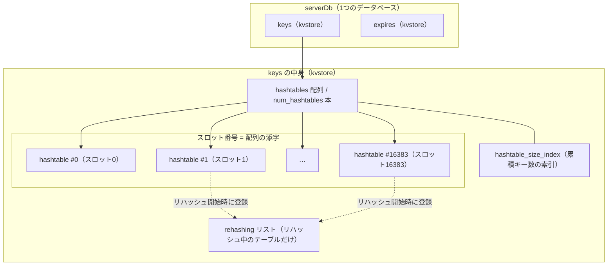

# 第13章 kvstore キー空間抽象

> **本章で読むソース**
>
> - [`src/kvstore.h`](https://github.com/valkey-io/valkey/blob/9.1.0/src/kvstore.h)
> - [`src/kvstore.c`](https://github.com/valkey-io/valkey/blob/9.1.0/src/kvstore.c)
> - [`src/server.h`](https://github.com/valkey-io/valkey/blob/9.1.0/src/server.h)
> - [`src/server.c`](https://github.com/valkey-io/valkey/blob/9.1.0/src/server.c)

## この章の狙い

データベースが保持するキーは、内部では単一の `hashtable` ではなく `kvstore` という抽象に格納される。
本章では、`kvstore` が複数の `hashtable` を配列で束ねて1つの論理的なキー空間として見せる仕組みを読む。
あわせて、この配列構造がもたらす2つの最適化、すなわちスロット単位でのキー分割と、リハッシュ対象だけを時間予算内で進める仕組みを、実装に踏み込んで理解する。

## 前提

- [第7章 hashtable](../part01-data-structures/07-hashtable.md)：`kvstore` の各要素は `hashtable` であり、その内部のインクリメンタルリハッシュを前提とする。
- [第12章 zmalloc](./12-zmalloc.md)：`kvstore` 自身の確保とメモリ会計に使う。

## kvstore とは何か

`kvstore` は、`hashtable` の配列を1つのキー空間として扱うための抽象である。
ファイル冒頭のコメントが、この役割を端的に述べている。

[`src/kvstore.c` L1-L10](https://github.com/valkey-io/valkey/blob/9.1.0/src/kvstore.c#L1-L10)

```c
/*
 * Index-based KV store implementation
 * This file implements a KV store comprised of an array of hash tables (see hashtable.c)
 * The purpose of this KV store is to have easy access to all keys that belong
 * in the same hash table (i.e. are in the same hashtable-index)
 *
 * For example, when the server is running in cluster mode, we use kvstore to save
 * all keys that map to the same hash-slot in a separate hash table within the kvstore
 * struct.
 * This enables us to easily access all keys that map to a specific hash-slot.
// ... (中略) ...
```

ここで述べられている設計の要点は2つある。
1つは、キー空間を複数の `hashtable` に分け、配列の添字（コメントの言う hashtable-index）で各テーブルを指すこと。
もう1つは、同じ添字に属するキーをまとめて扱えることである。
クラスタ動作時にはこの添字をハッシュスロットに対応させ、特定スロットのキーだけをまとめて列挙できるようにする。

構造体の定義を見ると、この配列がそのまま中心に置かれている。

[`src/kvstore.c` L55-L73](https://github.com/valkey-io/valkey/blob/9.1.0/src/kvstore.c#L55-L73)

```c
struct _kvstore {
    int flags;
    hashtableType *dtype;
    hashtable **hashtables;
    int num_hashtables;
    int num_hashtables_bits;
    list *rehashing;                          /* List of hash tables in this kvstore that are currently rehashing. */
    int resize_cursor;                        /* Cron job uses this cursor to gradually resize hash tables (only used if num_hashtables > 1). */
    int allocated_hashtables;                 /* The number of allocated hashtables. */
    int non_empty_hashtables;                 /* The number of non-empty hashtables. */
    unsigned long long key_count;             /* Total number of keys in this kvstore. */
    unsigned long long bucket_count;          /* Total number of buckets in this kvstore across hash tables. */
    unsigned long long *hashtable_size_index; /* Binary indexed tree (BIT) that describes cumulative key frequencies up until
                                               * given hashtable-index. */
    // ... (中略) ...
};
```

`hashtables` が `hashtable` へのポインタの配列であり、`num_hashtables` がその長さである。
`rehashing` はリハッシュ中のテーブルだけを並べたリストで、後述する2つ目の最適化の土台になる。
`non_empty_hashtables` は空でないテーブルの本数を保持し、`hashtable_size_index` は各テーブルまでの累積キー数を表す索引である。
これらの補助フィールドは、テーブルを配列に分けたことで生じる「全テーブルを走査しないと答えが出ない」問題を、走査せずに答えるために置かれている。

### serverDb のキー空間が kvstore で実装される

データベースを表す `serverDb` は、キー本体と有効期限を、それぞれ独立した `kvstore` として持つ。

[`src/server.h` L901-L904](https://github.com/valkey-io/valkey/blob/9.1.0/src/server.h#L901-L904)

```c
typedef struct serverDb {
    kvstore *keys;                        /* The keyspace for this DB */
    kvstore *expires;                     /* Timeout of keys with a timeout set */
    kvstore *keys_with_volatile_items;    /* Keys with volatile items */
```

`keys` がキーから値オブジェクトへの対応を持つキー空間であり、`expires` が有効期限を設定したキーの集合である。
データベースから見た「キー空間」はこの `kvstore` であって、個々の `hashtable` ではない。
キーの探索や追加はすべて `kvstore` のAPIを通り、`kvstore` が内部で適切な `hashtable` に振り分ける。
有効期限の詳しい扱いは[第31章](../part05-database/31-expire.md)で読む。

## スロット分割

`kvstore` が何本の `hashtable` を持つかは、生成時のビット数で決まる。
`kvstoreCreate` の引数 `num_hashtables_bits` は、テーブル本数の2を底とする対数である。

[`src/kvstore.h` L17-L22](https://github.com/valkey-io/valkey/blob/9.1.0/src/kvstore.h#L17-L22)

```c
#define KVSTORE_ALLOCATE_HASHTABLES_ON_DEMAND (1 << 0)
#define KVSTORE_FREE_EMPTY_HASHTABLES (1 << 1)

#define KVSTORE_INDEX_NOT_FOUND (-1)

kvstore *kvstoreCreate(hashtableType *type, int num_hashtables_bits, int flags);
```

`kvstoreCreate` は、このビット数から本数を計算して配列を確保する。

[`src/kvstore.c` L286-L313](https://github.com/valkey-io/valkey/blob/9.1.0/src/kvstore.c#L286-L313)

```c
kvstore *kvstoreCreate(hashtableType *type, int num_hashtables_bits, int flags) {
    /* We can't support more than 2^16 hashtables because we want to save 48 bits
     * for the hashtable cursor, see kvstoreScan */
    assert(num_hashtables_bits <= 16);
    // ... (中略) ...
    kvs->num_hashtables_bits = num_hashtables_bits;
    kvs->num_hashtables = 1 << kvs->num_hashtables_bits;
    kvs->hashtables = zcalloc(sizeof(hashtable *) * kvs->num_hashtables);
    kvs->importing = hashtableCreate(&intHashtableType);
    kvs->rehashing = listCreate();
    kvs->hashtable_size_index = kvs->num_hashtables > 1 ? zcalloc(sizeof(unsigned long long) * (kvs->num_hashtables + 1)) : NULL;
    if (!(kvs->flags & KVSTORE_ALLOCATE_HASHTABLES_ON_DEMAND)) {
        for (int i = 0; i < kvs->num_hashtables; i++) createHashtableIfNeeded(kvs, i);
    }

    return kvs;
}
```

`num_hashtables` は `1 << num_hashtables_bits` で求まる。
`num_hashtables_bits` が0なら本数は1で、配列は単一のテーブルとして振る舞う。
本数が複数のときだけ `hashtable_size_index`（累積キー数の索引）を確保している点に注意したい。
本数が1なら、累積キー数はそのテーブルのサイズそのものであり、索引を持つ必要がないからである。

このビット数を決めているのが、データベースを生成する `createDatabase` である。

[`src/server.c` L2850-L2861](https://github.com/valkey-io/valkey/blob/9.1.0/src/server.c#L2850-L2861)

```c
serverDb *createDatabase(int id) {
    int slot_count_bits = 0;
    int flags = KVSTORE_ALLOCATE_HASHTABLES_ON_DEMAND;
    if (server.cluster_enabled) {
        flags |= KVSTORE_FREE_EMPTY_HASHTABLES;
        slot_count_bits = CLUSTER_SLOT_MASK_BITS;
    }

    serverDb *db = zmalloc(sizeof(serverDb));
    db->keys = kvstoreCreate(&kvstoreKeysHashtableType, slot_count_bits, flags);
    db->expires = kvstoreCreate(&kvstoreExpiresHashtableType, slot_count_bits, flags);
    db->keys_with_volatile_items = kvstoreCreate(&kvstoreExpiresHashtableType, slot_count_bits, flags);
```

非クラスタ時は `slot_count_bits` が0のままで、キー空間は1本の `hashtable` になる。
クラスタが有効なときは `CLUSTER_SLOT_MASK_BITS` をビット数に渡す。
この定数はスロットの総数を決める。

[`src/cluster.h` L9-L10](https://github.com/valkey-io/valkey/blob/9.1.0/src/cluster.h#L9-L10)

```c
#define CLUSTER_SLOT_MASK_BITS 14                   /* Number of bits used for slot id. */
#define CLUSTER_SLOTS (1 << CLUSTER_SLOT_MASK_BITS) /* Total number of slots in cluster mode, which is 16384. */
```

ビット数が14なので、本数は `1 << 14`、すなわち16384本になる。
クラスタ時のキー空間は、スロット番号を添字とする16384本の `hashtable` に分かれる。
あるスロットのキーをすべて列挙したいとき、そのスロットに対応する1本のテーブルだけを走査すればよい。
スロット単位での移動も、対応するテーブルをまとめて扱えるため効率がよい。
この分割が、スロット移行を支える土台になる。
スロット移行そのものは[第40章](../part07-replication-cluster/40-slot-migration.md)で読む。

クラスタ時には `flags` に `KVSTORE_FREE_EMPTY_HASHTABLES` が加わる点も押さえておきたい。
16384本のテーブルのうち、キーが1つもないスロットのテーブルは確保しないか、空になれば解放する。
`KVSTORE_ALLOCATE_HASHTABLES_ON_DEMAND` は、初期化時に全テーブルを確保せず、必要になったときに作る指定である。
これにより、16384本ぶんの空テーブルがメモリを占有することを避けている。

### 添字を指定したキー操作

`kvstore` のキー操作APIは、いずれも添字 `didx` を第2引数に取る。
呼び出し側がスロット番号から添字を決め、`kvstore` がその添字のテーブルへ処理を委譲する。

[`src/kvstore.c` L881-L898](https://github.com/valkey-io/valkey/blob/9.1.0/src/kvstore.c#L881-L898)

```c
bool kvstoreHashtableFind(kvstore *kvs, int didx, void *key, void **found) {
    hashtable *ht = kvstoreGetHashtable(kvs, didx);
    if (!ht) return false;
    return hashtableFind(ht, key, found);
}

void **kvstoreHashtableFindRef(kvstore *kvs, int didx, const void *key) {
    hashtable *ht = kvstoreGetHashtable(kvs, didx);
    if (!ht) return NULL;
    return hashtableFindRef(ht, key);
}

bool kvstoreHashtableAdd(kvstore *kvs, int didx, void *entry) {
    hashtable *ht = createHashtableIfNeeded(kvs, didx);
    bool ret = hashtableAdd(ht, entry);
    if (ret) cumulativeKeyCountAdd(kvs, didx, 1);
    return ret;
}
```

`kvstoreHashtableFind` は、添字のテーブルを `kvstoreGetHashtable` で取り出して探索する。
テーブルがまだ確保されていなければ `NULL` であり、その場合は見つからなかったものとして扱う。
`kvstoreHashtableAdd` は `createHashtableIfNeeded` でテーブルを必要に応じて作ってから追加する。
追加が成功したときだけ `cumulativeKeyCountAdd` を呼び、累積キー数の索引と空でないテーブル数を更新している。

テーブルの遅延確保は `createHashtableIfNeeded` が担う。

[`src/kvstore.c` L189-L204](https://github.com/valkey-io/valkey/blob/9.1.0/src/kvstore.c#L189-L204)

```c
/* Create the hashtable if it does not exist and return it. */
static hashtable *createHashtableIfNeeded(kvstore *kvs, int didx) {
    hashtable *ht = kvstoreGetHashtable(kvs, didx);
    if (ht) return ht;

    kvs->hashtables[didx] = hashtableCreate(kvs->dtype);
    kvstoreHashtableMetadata *metadata = (kvstoreHashtableMetadata *)hashtableMetadata(kvs->hashtables[didx]);
    metadata->kvs = kvs;
    // ... (中略) ...
    kvs->allocated_hashtables++;
    return kvs->hashtables[didx];
}
```

配列の該当要素が `NULL` なら、そこで初めて `hashtableCreate` を呼んでテーブルを作る。
作ったテーブルのメタデータに `kvs` への逆参照を記録している点が重要である。
この逆参照によって、`hashtable` 側のリハッシュ開始や完了を、所属する `kvstore` に通知できるようになる。

## まとめてリハッシュ

2つ目の最適化は、リハッシュ対象の管理にある。
各 `hashtable` は、テーブルが拡張または縮小するとリハッシュを始める（[第7章](../part01-data-structures/07-hashtable.md)）。
クラスタ時には最大16384本のテーブルがあり、その全部を毎回見て回るとリハッシュ対象を探すだけで本数に比例した時間がかかる。
`kvstore` は、リハッシュ中のテーブルだけを `rehashing` リストにつないで管理することで、この走査を避ける。

リストへの出し入れは、`hashtable` からのコールバックで行われる。

[`src/kvstore.c` L232-L260](https://github.com/valkey-io/valkey/blob/9.1.0/src/kvstore.c#L232-L260)

```c
void kvstoreHashtableRehashingStarted(hashtable *ht) {
    kvstoreHashtableMetadata *metadata = (kvstoreHashtableMetadata *)hashtableMetadata(ht);
    kvstore *kvs = metadata->kvs;
    listAddNodeTail(kvs->rehashing, ht);
    metadata->rehashing_node = listLast(kvs->rehashing);
    // ... (中略) ...
}
// ... (中略) ...
void kvstoreHashtableRehashingCompleted(hashtable *ht) {
    kvstoreHashtableMetadata *metadata = (kvstoreHashtableMetadata *)hashtableMetadata(ht);
    kvstore *kvs = metadata->kvs;
    if (metadata->rehashing_node) {
        listDelNode(kvs->rehashing, metadata->rehashing_node);
        metadata->rehashing_node = NULL;
    }
    // ... (中略) ...
}
```

テーブルがリハッシュを始めると `kvstoreHashtableRehashingStarted` が呼ばれ、そのテーブルを `rehashing` リストの末尾につなぐ。
このときリストノードへのポインタをメタデータに控えておく。
リハッシュが完了すると `kvstoreHashtableRehashingCompleted` が呼ばれ、控えておいたノードを使ってリストから外す。
ノードを直接持っているため、リストを線形に探さずに削除できる。
このコールバックは、先ほどメタデータに記録した `kvs` への逆参照をたどって、テーブルから `kvstore` へ通知している。

リハッシュを少しずつ進める入口が `kvstoreIncrementallyRehash` である。

[`src/kvstore.c` L736-L754](https://github.com/valkey-io/valkey/blob/9.1.0/src/kvstore.c#L736-L754)

```c
uint64_t kvstoreIncrementallyRehash(kvstore *kvs, uint64_t threshold_us) {
    if (listLength(kvs->rehashing) == 0) return 0;

    /* Our goal is to rehash as many hash tables as we can before reaching threshold_us,
     * after each hash table completes rehashing, it removes itself from the list. */
    listNode *node;
    monotime timer;
    uint64_t elapsed_us = 0;
    elapsedStart(&timer);
    while ((node = listFirst(kvs->rehashing))) {
        hashtableRehashMicroseconds(listNodeValue(node), threshold_us - elapsed_us);

        elapsed_us = elapsedUs(timer);
        if (elapsed_us >= threshold_us) {
            break; /* Reached the time limit. */
        }
    }
    return elapsed_us;
}
```

最初にリストが空なら、リハッシュ対象がないものとしてすぐ戻る。
ここで全テーブルを走査しないことが効いている。
対象があるときは、リストの先頭から順にテーブルを取り出し、`hashtableRehashMicroseconds` で残り時間ぶんだけリハッシュを進める。
1つのテーブルがリハッシュを完了すると、自分自身をリストから外す（先ほどのコールバック）。
そのため `listFirst` が指す先頭が次々と入れ替わり、`threshold_us` の予算を使い切るまで複数のテーブルをまとめて進められる。

この関数を呼ぶのは、バックグラウンドで定期実行される `databasesCron` である。

[`src/server.c` L1318-L1334](https://github.com/valkey-io/valkey/blob/9.1.0/src/server.c#L1318-L1334)

```c
        /* Rehash */
        if (server.activerehashing) {
            uint64_t elapsed_us = 0;
            uint64_t threshold_us = 1 * 1000000 / server.hz / 100;
            for (j = 0; j < dbs_per_call; j++) {
                serverDb *db = server.db[rehash_db % server.dbnum];
                if (db != NULL) {
                    elapsed_us += kvstoreIncrementallyRehash(db->keys, threshold_us - elapsed_us);
                    if (elapsed_us >= threshold_us) break;
                    elapsed_us += kvstoreIncrementallyRehash(db->expires, threshold_us - elapsed_us);
                    if (elapsed_us >= threshold_us) break;
                    elapsed_us += kvstoreIncrementallyRehash(db->keys_with_volatile_items, threshold_us - elapsed_us);
                    if (elapsed_us >= threshold_us) break;
                }
                rehash_db++;
            }
        }
```

`threshold_us` は周期 `hz` から算出した1回ぶんの時間予算であり、各 `kvstore` に残り予算を渡しながら順に進める。
予算を超えたら途中で打ち切る。
クライアントの読み書きでもインクリメンタルリハッシュは進むが、サーバが暇なときはテーブルが拡張用と縮小用の2枚を抱えたままになりやすい。
この定期処理は、その停滞を時間予算の範囲で解消するために置かれている。

## カーソルによる横断

キー空間全体を少しずつ走査する仕組みが `kvstoreScan` である。
`SCAN` コマンドがデータベース全体を走査する土台がこれにあたる。
配列に分かれたテーブルを1本のカーソルで横断するため、カーソルの中にテーブルの添字を埋め込む。

[`src/kvstore.c` L415-L427](https://github.com/valkey-io/valkey/blob/9.1.0/src/kvstore.c#L415-L427)

```c
unsigned long long kvstoreScan(kvstore *kvs,
                               unsigned long long cursor,
                               int first_idx,
                               int last_idx,
                               kvstoreScanFunction scan_cb,
                               kvstoreScanShouldSkipHashtable *skip_cb,
                               void *privdata) {
    unsigned long long next_cursor = 0;
    /* During hash table traversal, 48 upper bits in the cursor are used for positioning in the HT.
     * Following lower bits are used for the hashtable index number, ranging from 0 to 2^num_hashtables_bits-1.
     * Hashtable index is always 0 at the start of iteration and can be incremented only if there are
     * multiple hashtables. */
    int didx = getAndClearHashtableIndexFromCursor(kvs, &cursor);
```

カーソルは1つの符号なし整数だが、役割で2つの領域に分かれている。
上位の48ビットがテーブル内の位置を表し、下位の `num_hashtables_bits` ビットがテーブルの添字を表す。
`kvstoreCreate` がビット数を16以下に制限していたのは、この48ビットを位置のために残すためである。

カーソルの分解と組み立ては、添字の埋め込みと取り出しに分かれている。

[`src/kvstore.c` L135-L147](https://github.com/valkey-io/valkey/blob/9.1.0/src/kvstore.c#L135-L147)

```c
static void addHashtableIndexToCursor(kvstore *kvs, int didx, unsigned long long *cursor) {
    if (kvs->num_hashtables == 1) return;
    /* didx can be KVSTORE_INDEX_NOT_FOUND when iteration is over and there are no more hashtables to visit. */
    if (didx == KVSTORE_INDEX_NOT_FOUND) return;
    *cursor = (*cursor << kvs->num_hashtables_bits) | didx;
}

static int getAndClearHashtableIndexFromCursor(kvstore *kvs, unsigned long long *cursor) {
    if (kvs->num_hashtables == 1) return 0;
    int didx = (int)(*cursor & (kvs->num_hashtables - 1));
    *cursor = *cursor >> kvs->num_hashtables_bits;
    return didx;
}
```

走査の入口で `getAndClearHashtableIndexFromCursor` が下位ビットから添字を取り出し、残りを位置として使う。
本数が1のときは添字は常に0で、カーソル全体が位置になる。
1本のテーブルを走査し終えてカーソルが0に戻ると、次の空でないテーブルへ進む。

[`src/kvstore.c` L450-L467](https://github.com/valkey-io/valkey/blob/9.1.0/src/kvstore.c#L450-L467)

```c
    /* scanning done for the current hash table or if the scanning wasn't possible, move to the next hashtable index. */
    if (next_cursor == 0 || skip) {
        if (first_idx >= 0 && didx >= last_idx) {
            /* Range exhausted; no need to look up the next hashtable. */
            return 0;
        }
        int nextdidx = kvstoreGetNextNonEmptyHashtableIndex(kvs, didx);
        // ... (中略) ...
        didx = nextdidx;
    }
    if (didx == KVSTORE_INDEX_NOT_FOUND) {
        return 0;
    }
    addHashtableIndexToCursor(kvs, didx, &next_cursor);
    return next_cursor;
```

次に進むテーブルは `kvstoreGetNextNonEmptyHashtableIndex` で求める。
空のテーブルを飛ばして、次に中身のあるテーブルの添字を返す関数である。
クラスタ時には大半のスロットが空になりうるが、累積キー数の索引を使って空でないテーブルへ直接ジャンプするため、空テーブルを1本ずつたどる必要がない。
進む先がなくなったら添字は `KVSTORE_INDEX_NOT_FOUND` になり、`addHashtableIndexToCursor` がそれを埋め込まずに0を返す。
0は走査の完了を表し、これは1本のテーブルだけを使っていたときと同じ約束である。

`SCAN` を含むデータベース全体の走査と、その安全性の扱いは[第30章](../part05-database/30-database.md)で読む。

## 図



非クラスタ時は本数が1で、配列は単一の `hashtable` になる。
クラスタ時はスロット番号を添字とする16384本に分かれ、`rehashing` リストと累積キー数の索引が複数テーブルの管理を支える。

## まとめ

- `kvstore` は `hashtable` の配列を1つのキー空間として見せる抽象であり、`serverDb` の `keys` と `expires` がこれで実装される。
- 配列の本数は `kvstoreCreate` の `num_hashtables_bits` で決まる。非クラスタ時は1本、クラスタ時は `CLUSTER_SLOT_MASK_BITS`（14）から16384本になり、スロット番号が配列の添字になる。
- スロット分割により、特定スロットのキーの列挙やスロット単位の移動を、対応する1本のテーブルだけで行える。
- リハッシュ中のテーブルだけを `rehashing` リストで管理し、`kvstoreIncrementallyRehash` が時間予算内に先頭から順に進める。全テーブルを走査せずにリハッシュ対象を見つけられる。
- `kvstoreScan` はカーソルの下位ビットにテーブルの添字を、上位48ビットにテーブル内の位置を埋め込み、空でないテーブルへジャンプしながらキー空間全体を横断する。

## 関連する章

- [第7章 hashtable](../part01-data-structures/07-hashtable.md)：`kvstore` の各要素であり、インクリメンタルリハッシュの本体。
- [第30章 データベース](../part05-database/30-database.md)：`kvstore` 上のキー探索と `SCAN` によるキー空間の走査。
- [第31章 有効期限](../part05-database/31-expire.md)：`expires` の `kvstore` の使われ方。
- [第40章 スロット移行](../part07-replication-cluster/40-slot-migration.md)：スロット単位のテーブルを移動させる仕組み。
