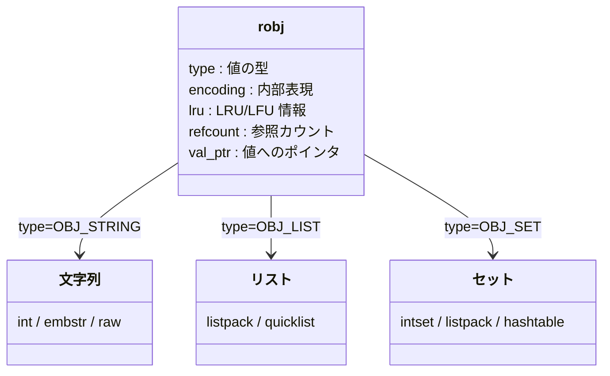

# 第14章 robj とエンコーディング

> **本章で読むソース**
>
> - [`src/server.h`](https://github.com/valkey-io/valkey/blob/9.1.0/src/server.h)
> - [`src/object.c`](https://github.com/valkey-io/valkey/blob/9.1.0/src/object.c)

## この章の狙い

Valkey が扱う値は、文字列であれリストであれ、すべて `robj` という共通の構造で包まれている。
本章では `robj` の構造（型とエンコーディングの分離）を読み、同じ型でも複数の内部表現を持ち分ける設計を理解する。
あわせて、文字列の embstr/raw と共有整数オブジェクトという2つのメモリ最適化を、コードに即して機構レベルで押さえる。

## 前提

- [第4章 SDS](../part01-data-structures/04-sds.md)：`robj` の文字列値は SDS で保持される。
- [第12章 zmalloc](../part02-memory-keyspace/12-zmalloc.md)：オブジェクトの確保は `zmalloc_usable` を通る。
- [第13章 kvstore](../part02-memory-keyspace/13-kvstore.md)：キー空間に格納される値が `robj` である。

## すべての値を包む robj

Valkey のキー空間に入る値は、型を問わず単一の構造体に包まれる。
その本体が `serverObject` であり、`robj` という別名で参照される。

[`src/server.h` L820-L831](https://github.com/valkey-io/valkey/blob/9.1.0/src/server.h#L820-L831)

```c
struct serverObject {
    unsigned type : 4;
    unsigned encoding : 4;
    unsigned lru : LRULFU_BITS;
    unsigned hasexpire : 1;
    unsigned hasembkey : 1;
    unsigned hasembval : 1;
    unsigned refcount : OBJ_REFCOUNT_BITS;
    void *val_ptr; /* Not always present. Use objectGetVal(obj) and
                    * objectSetVal(obj, val) instead. */
};
static_assert(sizeof(struct serverObject) <= 8 + sizeof(void *), "unexpected size - verify struct is packed correctly");
```

固定部はビットフィールドに詰め込まれ、ポインタ1個分を足して16バイトに収まる（`static_assert` がこの上限を保証している）。
各フィールドの役割は次の通りである。

- **type**：値の論理的な型。文字列、リスト、セット、ハッシュ、ソート済みセット、ストリーム、モジュール型のいずれか。
- **encoding**：その型を内部でどう表現しているか。同じ型でも複数の表現を取りうる（後述）。
- **lru**：メモリ退避の判断に使う、最終アクセス時刻（LRU）またはアクセス頻度（LFU）の記録。`LRULFU_BITS` は24ビットである。
- **hasexpire / hasembkey / hasembval**：有効期限、キー、値を構造体の直後に埋め込んでいるかを示すフラグ。
- **refcount**：参照カウント。複数の参照で共有するためのカウンタである。
- **val_ptr**：値本体へのポインタ。値を埋め込むとき（`hasembval == 1`）は使われない。

型を表す定数は `OBJ_*` として定義されている。

[`src/server.h` L737-L756](https://github.com/valkey-io/valkey/blob/9.1.0/src/server.h#L737-L756)

```c
#define OBJ_STRING 0 /* String object. */
#define OBJ_LIST 1   /* List object. */
#define OBJ_SET 2    /* Set object. */
#define OBJ_ZSET 3   /* Sorted set object. */
#define OBJ_HASH 4   /* Hash object. */
// ... (中略) ...
#define OBJ_MODULE 5   /* Module object. */
#define OBJ_STREAM 6   /* Stream object. */
#define OBJ_TYPE_MAX 7 /* Maximum number of object types */
```

`robj` を生成する基本経路は `createObject` である。
型と値ポインタを受け取り、`refcount` を1、`encoding` を `OBJ_ENCODING_RAW` に初期化する。

[`src/object.c` L110-L113](https://github.com/valkey-io/valkey/blob/9.1.0/src/object.c#L110-L113)

```c
/* Creates an object of the specified type. The value is never embedded. */
robj *createObject(int type, void *val) {
    return createUnembeddedObjectWithKeyAndExpire(type, val, NULL, EXPIRY_NONE);
}
```

## 型とエンコーディングの分離

`type` が論理的な型を表すのに対して、`encoding` はその型の物理的な表現を表す。
両者を分けることで、同じ型でも要素数やサイズに応じて内部表現を入れ替えられる。
エンコーディングの定数は `OBJ_ENCODING_*` として並ぶ。

[`src/server.h` L766-L777](https://github.com/valkey-io/valkey/blob/9.1.0/src/server.h#L766-L777)

```c
#define OBJ_ENCODING_RAW 0        /* Raw representation */
#define OBJ_ENCODING_INT 1        /* Encoded as integer */
#define OBJ_ENCODING_HASHTABLE 2  /* Encoded as a hashtable */
#define OBJ_ENCODING_ZIPMAP 3     /* No longer used: old hash encoding. */
#define OBJ_ENCODING_LINKEDLIST 4 /* No longer used: old list encoding. */
#define OBJ_ENCODING_ZIPLIST 5    /* No longer used: old list/hash/zset encoding. */
#define OBJ_ENCODING_INTSET 6     /* Encoded as intset */
#define OBJ_ENCODING_SKIPLIST 7   /* Encoded as skiplist */
#define OBJ_ENCODING_EMBSTR 8     /* Embedded sds string encoding */
#define OBJ_ENCODING_QUICKLIST 9  /* Encoded as linked list of listpacks */
#define OBJ_ENCODING_STREAM 10    /* Encoded as a radix tree of listpacks */
#define OBJ_ENCODING_LISTPACK 11  /* Encoded as a listpack */
```

設計の指針は単純である。
要素が少なくサイズが小さいときはコンパクトな表現を使い、大きくなったら検索や更新が速い汎用の表現に切り替える。
コンパクトな表現は1つの連続したメモリ領域に値を詰めるため省メモリで、CPU キャッシュにも乗りやすい。
汎用の表現はポインタとハッシュ表や木構造を持ち、要素数が増えても操作の計算量が悪化しない。

型ごとの代表的なエンコーディングは次の通りである。
切り替えの閾値や各表現の詳細は、それぞれの型の章に譲る。

- **文字列**（`OBJ_STRING`）：`int`（整数）、`embstr`（短い文字列）、`raw`（長い文字列）。本章で扱う。
- **リスト**（`OBJ_LIST`）：`listpack`（小）、`quicklist`（大）。[第16章](16-t-list.md)。
- **セット**（`OBJ_SET`）：`intset`（整数のみ）、`listpack`（小）、`hashtable`（大）。[第17章](17-t-set.md)。
- **ハッシュ**（`OBJ_HASH`）：`listpack`（小）、`hashtable`（大）。[第18章](18-t-hash.md)。
- **ソート済みセット**（`OBJ_ZSET`）：`listpack`（小）、`skiplist`（大）。[第19章](19-t-zset.md)。
- **ストリーム**（`OBJ_STREAM`）：`stream`（rax と listpack の組み合わせ）。[第20章](20-t-stream.md)。

`ZIPMAP`、`LINKEDLIST`、`ZIPLIST` の3つは過去のエンコーディングであり、コメントが示す通り現在は使われない。
RDB の互換読み込みのために定数だけが残っている。

OBJECT ENCODING コマンドが返す文字列名は、この `encoding` 値を `strEncoding` で対応づけたものである。

[`src/object.c` L1171-L1184](https://github.com/valkey-io/valkey/blob/9.1.0/src/object.c#L1171-L1184)

```c
char *strEncoding(int encoding) {
    switch (encoding) {
    case OBJ_ENCODING_RAW: return "raw";
    case OBJ_ENCODING_INT: return "int";
    case OBJ_ENCODING_HASHTABLE: return "hashtable";
    case OBJ_ENCODING_QUICKLIST: return "quicklist";
    case OBJ_ENCODING_LISTPACK: return "listpack";
    case OBJ_ENCODING_INTSET: return "intset";
    case OBJ_ENCODING_SKIPLIST: return "skiplist";
    case OBJ_ENCODING_EMBSTR: return "embstr";
    case OBJ_ENCODING_STREAM: return "stream";
    default: return "unknown";
    }
}
```



## 文字列の embstr と raw

文字列の値は SDS で保持される。
ここで `robj` と SDS をどう配置するかに、最初のメモリ最適化が入る。

短い文字列では、`robj` と SDS を別々に確保すると確保が2回走り、`robj` から SDS へのポインタ参照でキャッシュミスも起きやすい。
そこで Valkey は、短い文字列を `robj` の直後に埋め込み、1回の確保で済ませる。
これが `embstr` エンコーディングである。

埋め込むかどうかは `shouldEmbedStringObject` が判定する。

[`src/object.c` L229-L241](https://github.com/valkey-io/valkey/blob/9.1.0/src/object.c#L229-L241)

```c
static bool shouldEmbedStringObject(size_t val_len, const_sds key, long long expire) {
    /* When to embed? Embed when the sum is up to 128 bytes. (2 cache lines on most systems) */
    if (val_len > sdsTypeMaxSize(SDS_TYPE_8)) return false;

    size_t size = sizeof(robj) - sizeof(void *); /* reusing 'ptr' memory when embedding */
    if (key) {
        size_t key_len = sdslen(key);
        size += sdsReqSize(key_len, sdsReqType(key_len)) + 1; /* 1 byte for prefixed sds hdr size */
    }
    size += (expire != EXPIRY_NONE) * sizeof(long long);
    size += sdsReqSize(val_len, SDS_TYPE_8);
    return size <= 128;
}
```

判定の基準は、埋め込んだ場合に確保する領域の合計が128バイト（多くの環境で2キャッシュライン分）に収まるかどうかである。
合計には `robj` の固定部、必要なら有効期限とキー、そして値の SDS が含まれる。
合計が128バイトを超えると埋め込みをやめ、`robj` と SDS を別々に確保する `raw` エンコーディングになる。

この判定を使い分けるのが `createStringObject` である。
短ければ `embstr`、長ければ `raw` を選ぶ。

[`src/object.c` L243-L249](https://github.com/valkey-io/valkey/blob/9.1.0/src/object.c#L243-L249)

```c
/* Create a string object with EMBSTR encoding if it is small, otherwise RAW encoding */
robj *createStringObject(const char *ptr, size_t len) {
    if (shouldEmbedStringObject(len, NULL, EXPIRY_NONE))
        return createEmbeddedStringObject(ptr, len);
    else
        return createRawStringObject(ptr, len);
}
```

`raw` 側の `createRawStringObject` は、まず SDS を確保し、その後 `createObject` で `robj` を確保する。
確保が2回に分かれる。

[`src/object.c` L137-L141](https://github.com/valkey-io/valkey/blob/9.1.0/src/object.c#L137-L141)

```c
/* Create a string object with encoding OBJ_ENCODING_RAW, that is a plain
 * string object where o->ptr points to a proper sds string. */
robj *createRawStringObject(const char *ptr, size_t len) {
    return createObject(OBJ_STRING, sdsnewlen(ptr, len));
}
```

`embstr` 側は `createEmbeddedStringObjectWithKeyAndExpire` が、`robj` と SDS をまとめて確保できる大きさの領域を1回だけ確保し、`robj` の直後に SDS を書き込む。
このとき `val_ptr` のポインタ領域は値の埋め込みに転用され（`size = sizeof(robj) - sizeof(void *)` がそれを表す）、`encoding` には `OBJ_ENCODING_EMBSTR` が設定される。

[`src/object.c` L180-L187](https://github.com/valkey-io/valkey/blob/9.1.0/src/object.c#L180-L187)

```c
    o->type = OBJ_STRING;
    o->encoding = OBJ_ENCODING_EMBSTR;
    o->refcount = 1;
    o->lru = 0;
    o->hasexpire = (expire != EXPIRY_NONE);
    o->hasembkey = has_embkey;
    o->hasembval = 1;
```

両者のメモリレイアウトの違いを並べると、確保回数の差がはっきりする。

```text
raw（確保2回、ポインタ参照あり）

  robj 本体                          SDS 本体
  +----------------------------+     +-------------------+
  | type/encoding/.../val_ptr -|---> | sds header | "..." |
  +----------------------------+     +-------------------+


embstr（確保1回、連続配置）

  +----------------------------+-------------------+
  | type/encoding/...(no ptr)  | sds header | "..." |
  +----------------------------+-------------------+
   ^                            ^
   robj 本体                    直後に SDS を埋め込み
```

`embstr` が速く省メモリなのは、確保が1回で済み、`robj` と SDS が連続するためアクセス時のキャッシュミスが減るからである。
反面、埋め込んだ SDS はその領域に固定されるため、追記などで伸ばすときは作り直しになる。
そのため `embstr` は読み取り専用の短い文字列に向く表現として位置づけられる。

## 共有整数オブジェクト

2つ目の最適化は、小さな整数の `robj` を1組だけ作って使い回すことである。
整数値はカウンタやインデックスとして頻出するため、毎回 `robj` を確保していては確保と解放のコストがかさむ。

Valkey は起動時に、0以上 `OBJ_SHARED_INTEGERS` 未満の整数について、共有の `robj` をあらかじめ作っておく。
既定値は10000であり、0から9999までが対象になる。

[`src/server.h` L146](https://github.com/valkey-io/valkey/blob/9.1.0/src/server.h#L146)

```c
#define OBJ_SHARED_INTEGERS 10000
```

生成は起動時の `createSharedObjects` で行われる。
各値を `OBJ_ENCODING_INT` の `robj` として作り、`makeObjectShared` で共有状態にする。

[`src/server.c` L2231-L2234](https://github.com/valkey-io/valkey/blob/9.1.0/src/server.c#L2231-L2234)

```c
    for (j = 0; j < OBJ_SHARED_INTEGERS; j++) {
        shared.integers[j] = makeObjectShared(createObject(OBJ_STRING, (void *)(long)j));
        shared.integers[j]->encoding = OBJ_ENCODING_INT;
    }
```

整数値そのものは `val_ptr` のビットに直接格納される（`(void *)(long)j`）。
`OBJ_ENCODING_INT` では `val_ptr` をポインタではなく整数として解釈するため、値のための別領域は要らない。

整数を文字列オブジェクトとして必要としたときに共有 `robj` を返すのが `createStringObjectFromLongLongWithOptions` である。
値が共有範囲に収まり、かつ共有を許す呼び出しであれば、確保せずに既存の `robj` を返す。

[`src/object.c` L407-L424](https://github.com/valkey-io/valkey/blob/9.1.0/src/object.c#L407-L424)

```c
robj *createStringObjectFromLongLongWithOptions(long long value, int flag) {
    robj *o;

    if (value >= 0 && value < OBJ_SHARED_INTEGERS && flag == LL2STROBJ_AUTO) {
        o = shared.integers[value];
    } else {
        if ((value >= LONG_MIN && value <= LONG_MAX) && flag != LL2STROBJ_NO_INT_ENC) {
            o = createObject(OBJ_STRING, NULL);
            o->encoding = OBJ_ENCODING_INT;
            o->val_ptr = (void *)((long)value);
        } else {
            char buf[LONG_STR_SIZE];
            int len = ll2string(buf, sizeof(buf), value);
            o = createStringObject(buf, len);
        }
    }
    return o;
}
```

文字列が整数として表せるかを実際に確かめて `int` 化するのが `tryObjectEncoding` である。
`SET key 123` のように受け取った文字列を、内部で整数表現に切り替える経路がここにある。

[`src/object.c` L886-L901](https://github.com/valkey-io/valkey/blob/9.1.0/src/object.c#L886-L901)

```c
    /* Check if we can represent this string as a long integer.
     * Note that we are sure that a string larger than 20 chars is not
     * representable as a 32 nor 64 bit integer. */
    len = sdslen(s);
    if (len <= 20 && string2l(s, len, &value)) {
        /* This object is encodable as a long. */
        if (o->encoding == OBJ_ENCODING_RAW) {
            sdsfree(objectGetVal(o));
            o->encoding = OBJ_ENCODING_INT;
            o->val_ptr = (void *)value;
            return o;
        } else if (o->encoding == OBJ_ENCODING_EMBSTR) {
            decrRefCount(o);
            return createStringObjectFromLongLongForValue(value);
        }
    }
```

文字列が `long` の整数として読めれば、SDS を解放して `OBJ_ENCODING_INT` に切り替え、値を `val_ptr` に格納する。
これで SDS の確保が消え、`robj` だけが残る。
整数として表せないときは、短ければ `embstr` への切り替えを試み（同関数の後半）、どれにも当てはまらなければ `raw` のままにする。

ここで `createStringObjectFromLongLongForValue` が使われている点に注意が要る。
これは共有整数を返さない経路であり、キー空間の値として整数を作るときは共有 `robj` を避ける。
共有オブジェクトを書き換え可能な値として置くと、LRU/LFU 情報の更新などで取り違えが起きるためである（`tryObjectEncoding` の冒頭でも、参照カウントが1より大きい共有状態のオブジェクトはエンコードしないと定めている）。

## 参照カウントによる共有と解放

`robj` は参照カウントで寿命を管理する。
参照を増やすときは `incrRefCount`、減らすときは `decrRefCount` を呼ぶ。

[`src/object.c` L615-L646](https://github.com/valkey-io/valkey/blob/9.1.0/src/object.c#L615-L646)

```c
void incrRefCount(robj *o) {
    if (o->refcount < OBJ_FIRST_SPECIAL_REFCOUNT) {
        o->refcount++;
    } else {
        if (o->refcount == OBJ_SHARED_REFCOUNT) {
            /* Nothing to do: this refcount is immutable. */
        } else if (o->refcount == OBJ_STATIC_REFCOUNT) {
            serverPanic("You tried to retain an object allocated in the stack");
        }
    }
}

void decrRefCount(robj *o) {
    if (o->refcount == 1) {
        if (objectGetVal(o) != NULL) {
            switch (o->type) {
            case OBJ_STRING: freeStringObject(o); break;
            // ... (中略) ...
            default: serverPanic("Unknown object type"); break;
            }
        }
        zfree(o);
    } else {
        if (o->refcount <= 0) serverPanic("decrRefCount against refcount <= 0");
        if (o->refcount != OBJ_SHARED_REFCOUNT) o->refcount--;
    }
}
```

`decrRefCount` はカウントが1のときに、型に応じた解放処理を呼んでから `robj` 自体を解放する。
カウントが1より大きければ1つ減らすだけである。

共有整数のような使い回すオブジェクトには、特別な参照カウント値が割り当てられる。
`makeObjectShared` は `refcount` を `OBJ_SHARED_REFCOUNT` に設定する。

[`src/object.c` L131-L135](https://github.com/valkey-io/valkey/blob/9.1.0/src/object.c#L131-L135)

```c
robj *makeObjectShared(robj *o) {
    serverAssert(o->refcount == 1);
    o->refcount = OBJ_SHARED_REFCOUNT;
    return o;
}
```

`OBJ_SHARED_REFCOUNT` は参照カウントの最大値であり、`incrRefCount` も `decrRefCount` もこの値には触れない。
そのため共有整数は何度参照しても解放されず、カウンタの増減という書き込み自体が発生しない。

[`src/server.h` L779-L780](https://github.com/valkey-io/valkey/blob/9.1.0/src/server.h#L779-L780)

```c
#define OBJ_REFCOUNT_BITS 29
#define OBJ_SHARED_REFCOUNT ((1 << OBJ_REFCOUNT_BITS) - 1) /* Global object never destroyed. */
```

このカウンタ不変の性質には、もう一つの利点がある。
`makeObjectShared` のコメントが述べる通り、カウンタを書き換えないため、共有整数は複数のスレッドからミューテックスなしで安全に読める。
小さな整数の確保と参照カウント操作をまとめて省くことで、頻出する整数値の扱いが軽くなる。

## OBJECT ENCODING コマンドで内部表現を見る

ここまでの型とエンコーディングは、`OBJECT ENCODING` コマンドで外から確認できる。
このサブコマンドは、キーを引いて得た `robj` の `encoding` を `strEncoding` で名前に変換し、返す。

[`src/object.c` L1719-L1721](https://github.com/valkey-io/valkey/blob/9.1.0/src/object.c#L1719-L1721)

```c
    } else if (!strcasecmp(objectGetVal(c->argv[1]), "encoding") && c->argc == 3) {
        if ((o = objectCommandLookupOrReply(c, c->argv[2], shared.null[c->resp])) == NULL) return;
        addReplyBulkCString(c, strEncoding(o->encoding));
```

キーの取得には `objectCommandLookup` が使われる。
これは `LOOKUP_NOTOUCH` フラグ付きで値を引くため、内部表現を覗くだけで LRU/LFU 情報を更新しない。

[`src/object.c` L1686-L1688](https://github.com/valkey-io/valkey/blob/9.1.0/src/object.c#L1686-L1688)

```c
robj *objectCommandLookup(client *c, robj *key) {
    return lookupKeyReadWithFlags(c->db, key, LOOKUP_NOTOUCH | LOOKUP_NONOTIFY);
}
```

`OBJECT REFCOUNT` も同じ経路でキーを引き、`refcount` をそのまま返す。
共有整数を格納したキーに対しては、`OBJ_SHARED_REFCOUNT` の大きな値が返る。
これが、その値が共有オブジェクトであることの目印になる。

## まとめ

- Valkey の値はすべて `robj`（`serverObject`）に包まれ、`type`（論理的な型）と `encoding`（内部表現）を分けて持つ。固定部はビットフィールドに詰めて16バイトに収まる。
- 同じ型でも、小さいときはコンパクトな表現、大きいときは汎用の表現に切り替える。コンパクトな表現は省メモリでキャッシュにも乗りやすい。
- 文字列の `embstr` は `robj` と SDS を1回の確保にまとめ、`raw` は2回に分ける。境界は埋め込み時の合計が128バイト（2キャッシュライン）に収まるかで決まる。
- 0から9999までの小さな整数は起動時に共有 `robj` として作られ、確保と参照カウント操作を省く。`tryObjectEncoding` が文字列を `int` 化する。
- 参照カウントで寿命を管理し、共有オブジェクトには不変の `OBJ_SHARED_REFCOUNT` を割り当てて解放もカウンタ書き換えも起こさない。
- `OBJECT ENCODING` と `OBJECT REFCOUNT` で、内部表現と共有状態を外から確認できる。

## 関連する章

- [第15章 文字列型](15-t-string.md)：`int`/`embstr`/`raw` の使い分けとコマンド実装。
- [第16章 リスト型](16-t-list.md)：`listpack` と `quicklist`、切り替えの閾値。
- [第17章 セット型](17-t-set.md)：`intset`/`listpack`/`hashtable`。
- [第18章 ハッシュ型](18-t-hash.md) / [第19章 ソート済みセット型](19-t-zset.md) / [第20章 ストリーム型](20-t-stream.md)：各型のエンコーディング詳細。
