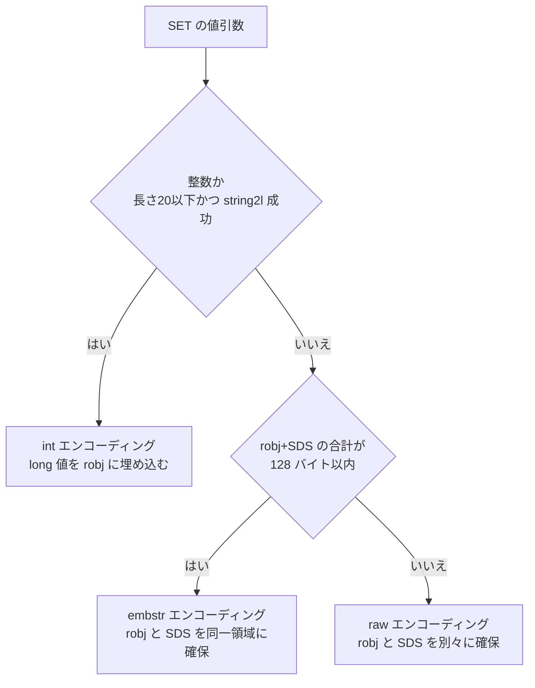

# 第15章 文字列型

> **本章で読むソース**
>
> - [`src/t_string.c`](https://github.com/valkey-io/valkey/blob/9.1.0/src/t_string.c)
> - [`src/object.c`](https://github.com/valkey-io/valkey/blob/9.1.0/src/object.c)

## この章の狙い

文字列型は Valkey でもっとも基本的な値であり、そのコマンド実装はオブジェクトのエンコーディングと密接に結びついている。
本章では、`SET` と `GET` がどのようにエンコーディングを選び、`INCR` が整数エンコーディングをどう使って再確保なしに加算するか、そして `APPEND` と `SETRANGE` がどのように文字列を伸長するかを、実コードに沿って読む。
読み終えると、同じ「文字列」でも内部表現が三通りあること、そのどれが選ばれるかをコマンドごとに説明できるようになる。

## 前提

robj とエンコーディングの基礎は [第14章 オブジェクトとエンコーディング](14-object-encoding.md) で扱う。
文字列の実体である SDS は [第4章 SDS](../part01-data-structures/04-sds.md) で扱う。
本章で `EX` や `PX` などの有効期限フラグそのものには立ち入らない。
有効期限の設定と失効は [第31章 有効期限](../part05-database/31-expire.md) で扱う。

## 文字列型の三つのエンコーディング

文字列型の値は `int`、`embstr`、`raw` の三つのエンコーディングのいずれかで保持される。
`raw` は robj とは別に確保した SDS を指す表現、`embstr` は robj と SDS を一つの確保領域にまとめた表現、`int` は SDS を持たず `long` 値を robj のポインタ欄に直接埋め込む表現である。
定数の値は次のとおり定義されている。

[`src/server.h` L766-L774](https://github.com/valkey-io/valkey/blob/9.1.0/src/server.h#L766-L774)

```c
#define OBJ_ENCODING_RAW 0        /* Raw representation */
#define OBJ_ENCODING_INT 1        /* Encoded as integer */
// ... (中略) ...
#define OBJ_ENCODING_EMBSTR 8     /* Embedded sds string encoding */
```

どのエンコーディングを生むかは、値を robj に変換する段で決まる。
`SET` 系のコマンドは値の引数を `tryObjectEncoding` に通し、ここで三択が確定する。
入口となる `tryObjectEncodingEx` は、まず対象が SDS を持つ表現（`raw` または `embstr`）であることと、共有されていないこと（`refcount` が 1 であること）を確認する。

[`src/object.c` L865-L901](https://github.com/valkey-io/valkey/blob/9.1.0/src/object.c#L865-L901)

```c
robj *tryObjectEncodingEx(robj *o, int try_trim) {
    long value;
    sds s = objectGetVal(o);
    size_t len;
    // ... (中略) ...
    if (!sdsEncodedObject(o)) return o;
    if (o->refcount > 1) return o;

    /* Check if we can represent this string as a long integer.
     * Note that we are sure that a string larger than 20 chars is not
     * representable as a 32 nor 64 bit integer. */
    len = sdslen(s);
    if (len <= 20 && string2l(s, len, &value)) {
        /* This object is encodable as a long. */
        if (o->encoding == OBJ_ENCODING_RAW) {
            sdsfree(objectGetVal(o));
            o->encoding = OBJ_ENCODING_INT;
            o->val_ptr = (void *)value;
            return o;
        } else if (o->encoding == OBJ_ENCODING_EMBSTR) {
            decrRefCount(o);
            return createStringObjectFromLongLongForValue(value);
        }
    }
    // ... (中略、embstr 化へ続く) ...
```

最初の分岐は整数化である。
文字列の長さが 20 文字以下で、かつ `string2l` が `long` への変換に成功したとき、その値は `int` エンコーディングへ変換される。
20 文字という上限は、64 ビット整数の十進表現がそれを超えないことに由来する判定の足切りである。
`raw` だった場合は SDS を解放して同じ robj を `int` に書き換え、`embstr` だった場合は robj ごと作り直す。

整数として表現できなければ、次の分岐で `embstr` 化を試みる。

[`src/object.c` L903-L920](https://github.com/valkey-io/valkey/blob/9.1.0/src/object.c#L903-L920)

```c
    /* If the string is small and is still RAW encoded,
     * try the EMBSTR encoding which is more efficient.
     * In this representation the object and the SDS string are allocated
     * in the same chunk of memory to save space and cache misses. */
    if (shouldEmbedStringObject(len, NULL, EXPIRY_NONE)) {
        if (o->encoding == OBJ_ENCODING_EMBSTR) return o;
        robj *emb = createEmbeddedStringObject(s, sdslen(s));
        decrRefCount(o);
        return emb;
    }

    /* We can't encode the object...
     * Do the last try, and at least optimize the SDS string inside */
    if (try_trim) trimStringObjectIfNeeded(o, 0);

    /* Return the original object. */
    return o;
}
```

`embstr` にするか `raw` のままにするかは `shouldEmbedStringObject` が決める。
この判定は、固定の文字数ではなく robj と SDS を合わせた総バイト数で行われる。

[`src/object.c` L229-L241](https://github.com/valkey-io/valkey/blob/9.1.0/src/object.c#L229-L241)

```c
static bool shouldEmbedStringObject(size_t val_len, const_sds key, long long expire) {
    /* When to embed? Embed when the sum is up to 128 bytes. (2 cache lines on most systems) */
    if (val_len > sdsTypeMaxSize(SDS_TYPE_8)) return false;

    size_t size = sizeof(robj) - sizeof(void *); /* reusing 'ptr' memory when embedding */
    if (key) {
        size_t key_len = sdslen(key);
        size += sdsReqSize(key_len, sdsReqType(key_len)) + 1; /* 1 byte for prefixed sds hdr size */
    }
    size += (expire != EXPIRY_NONE) * sizeof(long long);
    size += sdsReqSize(val_len, SDS_TYPE_8);
    return size <= 128;
}
```

robj 本体、SDS ヘッダ、値のバイト列を足した合計が 128 バイト以内なら `embstr`、超えれば `raw` を選ぶ。
コメントが述べるとおり、128 バイトは多くの環境でキャッシュライン 2 本に収まる大きさである。
`embstr` は確保が一回で済み、robj と文字列が連続して並ぶため、参照時のキャッシュミスが起きにくい。
小さい文字列をこの形に寄せることが省メモリと参照局所性の両取りにつながる。

`createStringObject` も同じ `shouldEmbedStringObject` を使う。
こちらは整数化を試みず、サイズだけを見て `embstr` か `raw` を選ぶ入口である。

[`src/object.c` L243-L249](https://github.com/valkey-io/valkey/blob/9.1.0/src/object.c#L243-L249)

```c
/* Create a string object with EMBSTR encoding if it is small, otherwise RAW encoding */
robj *createStringObject(const char *ptr, size_t len) {
    if (shouldEmbedStringObject(len, NULL, EXPIRY_NONE))
        return createEmbeddedStringObject(ptr, len);
    else
        return createRawStringObject(ptr, len);
}
```

エンコーディング選択の全体像を図にすると次のようになる。



## SET の本体とフラグ処理

`SET` の入口は `setCommand` である。
拡張引数（`NX`、`XX`、`GET`、`EX` などの有効期限、`KEEPTTL`、`IFEQ`）を `parseExtendedCommandArgumentsOrReply` で解釈し、値の引数を `tryObjectEncoding` に通してから共通実装へ渡す。

[`src/t_string.c` L251-L265](https://github.com/valkey-io/valkey/blob/9.1.0/src/t_string.c#L251-L265)

```c
void setCommand(client *c) {
    robj *expire = NULL;
    robj *comparison = NULL;
    int unit = UNIT_SECONDS;
    int flags = ARGS_NO_FLAGS;

    if (parseExtendedCommandArgumentsOrReply(c, COMMAND_SET, 3, c->argc, &flags, &unit, NULL, &expire, &comparison) != C_OK) {
        return;
    }

    if (!c->flag.argv_borrowed) {
        c->argv[2] = tryObjectEncoding(c->argv[2]);
    }
    setGenericCommand(c, flags, c->argv[1], c->argv[2], expire, unit, NULL, NULL, comparison);
}
```

ここで `c->argv[2]`（値の引数）がエンコーディングを確定させる。
このため、たとえば `SET n 12345` のように数値文字列を渡すと、データベースに入る値はすでに `int` エンコーディングになっている。
`SETNX`、`SETEX`、`PSETEX`、`GETSET` も同じ `setGenericCommand` を呼ぶ薄いラッパーであり、渡すフラグと既定の応答が違うだけである。

共通実装の `setGenericCommand` は、フラグに応じて書き込みの可否を判定する。
条件を満たさないときは応答だけ返して何も書き込まない。

[`src/t_string.c` L98-L125](https://github.com/valkey-io/valkey/blob/9.1.0/src/t_string.c#L98-L125)

```c
    robj *existing_value = lookupKeyWrite(c->db, key);
    found = existing_value != NULL;

    /* Handle the IFEQ conditional check */
    if (flags & ARGS_SET_IFEQ && found) {
        if (!(flags & ARGS_SET_GET) && checkType(c, existing_value, OBJ_STRING)) {
            goto cleanup;
        }

        if (compareStringObjects(existing_value, comparison) != 0) {
            if (!(flags & ARGS_SET_GET)) {
                addReply(c, abort_reply ? abort_reply : shared.null[c->resp]);
            }
            goto cleanup;
        }
    } else if (flags & ARGS_SET_IFEQ && !found) {
        // ... (中略) ...
    }

    if ((flags & ARGS_SET_NX && found) || (flags & ARGS_SET_XX && !found)) {
        if (!(flags & ARGS_SET_GET)) {
            addReply(c, abort_reply ? abort_reply : shared.null[c->resp]);
        }
        goto cleanup;
    }
```

`lookupKeyWrite` で既存値の有無を調べ、`found` に反映する。
`NX` は既存値があれば中止、`XX` は既存値がなければ中止する。
`IFEQ` は既存値と比較値が等しいときだけ書き込む。
これらの条件を通過した後で、実際の書き込みは `setKey` が行う。
有効期限が指定されていれば、その直後に `setExpire` で TTL を付与する（処理の詳細は [第31章 有効期限](../part05-database/31-expire.md) を参照）。

## GET の読み出し

`GET` は読み取り専用で、値をそのまま応答に積むだけである。
本体は `getGenericCommand` にまとまっている。

[`src/t_string.c` L302-L318](https://github.com/valkey-io/valkey/blob/9.1.0/src/t_string.c#L302-L318)

```c
int getGenericCommand(client *c) {
    robj *o;

    if ((o = lookupKeyReadOrReply(c, c->argv[1], shared.null[c->resp])) == NULL)
        return C_OK;

    if (checkType(c, o, OBJ_STRING)) {
        return C_ERR;
    }

    addReplyBulk(c, o);
    return C_OK;
}

void getCommand(client *c) {
    getGenericCommand(c);
}
```

`lookupKeyReadOrReply` でキーを引き、見つからなければ nil を返す。
型が文字列でなければ `checkType` がエラーを返す。
値があれば `addReplyBulk` で応答に積む。
このとき `int` エンコーディングであっても、`addReplyBulk` は応答出力の段で値を十進文字列へ整形するため、復号した文字列を別途作る必要はない。

クライアントが整数エンコーディングの値を文字列として扱う必要がある場面では `getDecodedObject` を使う。
これは `int` を一時的な文字列 robj に開き、`raw` や `embstr` ならそのまま参照を増やして返す。

[`src/object.c` L928-L944](https://github.com/valkey-io/valkey/blob/9.1.0/src/object.c#L928-L944)

```c
robj *getDecodedObject(robj *o) {
    robj *dec;

    if (sdsEncodedObject(o)) {
        incrRefCount(o);
        return o;
    }
    if (o->type == OBJ_STRING && o->encoding == OBJ_ENCODING_INT) {
        char buf[32];

        ll2string(buf, 32, (long)objectGetVal(o));
        dec = createStringObject(buf, strlen(buf));
        return dec;
    } else {
        serverPanic("Unknown encoding type");
    }
}
```

## INCR と DECR の整数加算

`INCR` 系のコマンドは文字列型の最適化がもっともよく現れる箇所である。
本体は `incrDecrCommand` にまとまっており、`INCR` は `+1`、`DECR` は `-1`、`INCRBY` と `DECRBY` は引数の値を渡して呼ぶ。

[`src/t_string.c` L697-L729](https://github.com/valkey-io/valkey/blob/9.1.0/src/t_string.c#L697-L729)

```c
void incrDecrCommand(client *c, long long incr) {
    long long value, oldvalue;
    robj *o, *new;

    o = lookupKeyWrite(c->db, c->argv[1]);
    if (checkType(c, o, OBJ_STRING)) return;
    if (getLongLongFromObjectOrReply(c, o, &value, NULL) != C_OK) return;

    oldvalue = value;
    if ((incr < 0 && oldvalue < 0 && incr < (LLONG_MIN - oldvalue)) ||
        (incr > 0 && oldvalue > 0 && incr > (LLONG_MAX - oldvalue))) {
        addReplyError(c, "increment or decrement would overflow");
        return;
    }
    value += incr;

    if (o && o->refcount == 1 && o->encoding == OBJ_ENCODING_INT &&
        value >= LONG_MIN && value <= LONG_MAX) {
        new = o;
        objectSetVal(o, (void *)((long)value));
    } else {
        new = createStringObjectFromLongLongForValue(value);
        if (o) {
            dbReplaceValue(c->db, c->argv[1], &new);
        } else {
            dbAdd(c->db, c->argv[1], &new);
        }
    }
    signalModifiedKey(c, c->db, c->argv[1]);
    notifyKeyspaceEvent(NOTIFY_STRING, "incrby", c->argv[1], c->db->id);
    server.dirty++;
    addReplyLongLong(c, value);
}
```

`getLongLongFromObjectOrReply` で現在値を `long long` に取り出す。
`int` エンコーディングなら埋め込まれた `long` をそのまま読むだけで、文字列の解析は走らない。
加算の前にオーバーフローを符号付きで検査し、安全なら `value += incr` を計算する。

最適化の核は、続く分岐にある。
既存の robj が単独所有（`refcount == 1`）で、エンコーディングが `int` で、加算結果が `long` の範囲に収まるとき、新しいオブジェクトを作らずに同じ robj のポインタ欄を `objectSetVal(o, (void *)((long)value))` で書き換える。
このとき確保も解放も起きない。
`int` エンコーディングは値を robj 内の `long` として持つため、整数の更新はポインタ大の一語を上書きするだけで完結する。
これが `INCR` を高頻度のカウンタに使っても安価である理由である。

条件を満たさない場合は `createStringObjectFromLongLongForValue` で新しい値オブジェクトを作り、既存キーなら `dbReplaceValue`、新規キーなら `dbAdd` で差し替える。
このとき値ごとに共有整数は使わない。
共有整数は `OBJ_SHARED_INTEGERS`（10000）未満の小さな非負整数についてあらかじめ用意された読み取り専用のオブジェクトであり、`createStringObjectFromLongLong` 系がキー空間の外で再利用する。

[`src/object.c` L407-L424](https://github.com/valkey-io/valkey/blob/9.1.0/src/object.c#L407-L424)

```c
robj *createStringObjectFromLongLongWithOptions(long long value, int flag) {
    robj *o;

    if (value >= 0 && value < OBJ_SHARED_INTEGERS && flag == LL2STROBJ_AUTO) {
        o = shared.integers[value];
    } else {
        if ((value >= LONG_MIN && value <= LONG_MAX) && flag != LL2STROBJ_NO_INT_ENC) {
            o = createObject(OBJ_STRING, NULL);
            o->encoding = OBJ_ENCODING_INT;
            o->val_ptr = (void *)((long)value);
        } else {
            char buf[LONG_STR_SIZE];
            int len = ll2string(buf, sizeof(buf), value);
            o = createStringObject(buf, len);
        }
    }
    return o;
}
```

`INCR` の値生成が `LL2STROBJ_NO_SHARED` を渡すのは、キー空間に入る値を共有オブジェクトにしないためである。
共有整数は `refcount` が特別な値に固定されており、`INCR` のような in-place 更新の対象にできない。
値として持つ整数を非共有の `int` オブジェクトにしておくことで、次回以降の `INCR` が再び単独所有の高速経路に乗れる。

なお `INCRBYFLOAT` だけは別実装で、浮動小数の精度差がレプリカ間で揺れないように、結果を `SET` コマンドへ書き換えて伝播する。
整数の `int` エンコーディング最適化はここには関与しない。

## APPEND と SETRANGE による伸長

`APPEND` は既存の文字列の末尾に追記する。
キーが存在しなければ新規作成、存在すれば `raw` に変換してから SDS を伸長する。

[`src/t_string.c` L813-L827](https://github.com/valkey-io/valkey/blob/9.1.0/src/t_string.c#L813-L827)

```c
    } else {
        /* Key exists, check type */
        if (checkType(c, o, OBJ_STRING))
            return;

        /* "append" is an argument, so always an sds */
        append = c->argv[2];
        if (checkStringLength(c, stringObjectLen(o), sdslen(objectGetVal(append))) != C_OK)
            return;

        /* Append the value */
        o = dbUnshareStringValue(c->db, c->argv[1], o);
        objectSetVal(o, sdscatlen(objectGetVal(o), objectGetVal(append), sdslen(objectGetVal(append))));
        totlen = sdslen(objectGetVal(o));
    }
```

`checkStringLength` で伸長後の長さが上限（`proto-max-bulk-len`）を超えないか検査する。
そのうえで `dbUnshareStringValue` を呼ぶ。
この関数は、対象が単独所有でかつ `raw` ならそのまま返し、そうでなければ復号した独立コピーを作って `raw` として置き換える。

[`src/db.c` L583-L592](https://github.com/valkey-io/valkey/blob/9.1.0/src/db.c#L583-L592)

```c
robj *dbUnshareStringValue(serverDb *db, robj *key, robj *o) {
    serverAssert(o->type == OBJ_STRING);
    if (o->refcount != 1 || o->encoding != OBJ_ENCODING_RAW) {
        robj *decoded = getDecodedObject(o);
        o = createRawStringObject(objectGetVal(decoded), sdslen(objectGetVal(decoded)));
        decrRefCount(decoded);
        dbReplaceValue(db, key, &o);
    }
    return o;
}
```

`raw` へ揃えるのは、追記が SDS を書き換える操作だからである。
`int` は SDS を持たず、`embstr` は robj と同じ領域に固定長で焼き込まれているため、どちらもその場では伸ばせない。
`raw` にしたうえで `sdscatlen` が末尾へ連結する。
SDS は確保済みの余白があれば再確保なしで書き、余白が足りなければ伸長する（SDS の確保戦略は [第4章 SDS](../part01-data-structures/04-sds.md) を参照）。

`SETRANGE` は指定したバイト位置から上書きする。
キーがなければゼロ埋めした文字列を新規に作り、あれば `dbUnshareStringValue` で `raw` 化してから伸ばす。

[`src/t_string.c` L477-L486](https://github.com/valkey-io/valkey/blob/9.1.0/src/t_string.c#L477-L486)

```c
        /* Create a copy when the object is shared or encoded. */
        o = dbUnshareStringValue(c->db, c->argv[1], o);
    }

    objectSetVal(o, sdsgrowzero(objectGetVal(o), offset + sdslen(value)));
    memcpy((char *)objectGetVal(o) + offset, value, sdslen(value));
    signalModifiedKey(c, c->db, c->argv[1]);
    notifyKeyspaceEvent(NOTIFY_STRING, "setrange", c->argv[1], c->db->id);
    server.dirty++;
    addReplyLongLong(c, sdslen(objectGetVal(o)));
```

`sdsgrowzero` が必要な長さまで `\0` で伸ばし、`memcpy` が `offset` の位置へ値を書き込む。
書き込む範囲が既存の長さに収まるなら、`sdsgrowzero` は何もせず `memcpy` だけが走る。
`APPEND` も `SETRANGE` も、いったん `raw` にした文字列を確保済みバッファの上で書き換えるため、追記のたびに新しいオブジェクトを作る必要がない。

## GETRANGE のバイト範囲取り出し

`GETRANGE` は文字列の部分列を返す。
読み取り専用なので元の値は変えない。

[`src/t_string.c` L489-L528](https://github.com/valkey-io/valkey/blob/9.1.0/src/t_string.c#L489-L528)

```c
void getrangeCommand(client *c) {
    robj *o;
    long long start, end;
    char *str, llbuf[32];
    size_t strlen;
    // ... (中略、start/end の取得と型チェック) ...
    if (o->encoding == OBJ_ENCODING_INT) {
        str = llbuf;
        strlen = ll2string(llbuf, sizeof(llbuf), (long)objectGetVal(o));
    } else {
        str = objectGetVal(o);
        strlen = sdslen(str);
    }

    /* Convert negative indexes */
    if (start < 0 && end < 0 && start > end) {
        addReply(c, shared.emptybulk);
        return;
    }
    if (start < 0) start = strlen + start;
    if (end < 0) end = strlen + end;
    if (start < 0) start = 0;
    if (end < 0) end = 0;
    if ((unsigned long long)end >= strlen) end = strlen - 1;
    // ... (中略) ...
        addReplyBulkCBuffer(c, (char *)str + start, end - start + 1);
}
```

値が `int` エンコーディングのときは、`ll2string` でスタック上の一時バッファ `llbuf` に十進表現を起こし、そのバイト列を範囲の対象にする。
`raw` や `embstr` なら SDS をそのまま見る。
範囲はバイト単位で、負のインデックスは末尾からの位置として `strlen` を足して補正する。
`end` が長さを超える場合は末尾に丸める。
最終的に `addReplyBulkCBuffer` が `start` から `end` までのバイト列を応答に積む。

## まとめ

- 文字列型の値は `int`、`embstr`、`raw` の三エンコーディングで保持される。`int` は SDS を持たず `long` を robj に埋め込み、`embstr` は robj と SDS を同一領域に、`raw` は別領域に確保する。
- `SET` 系は値引数を `tryObjectEncoding` に通し、長さ20以下で `long` に変換できれば `int`、robj と SDS の合計が 128 バイト以内なら `embstr`、それ以外は `raw` を選ぶ。
- `GET` は値をそのまま応答に積むだけの読み取り専用で、`int` 値も出力段で整形されるため復号を要しない。
- `INCR` は既存値が単独所有の `int` で結果が `long` 範囲なら、確保も解放もせず robj 内の `long` を上書きする。これが高頻度カウンタを安価にする。
- `APPEND` と `SETRANGE` は `dbUnshareStringValue` で値を `raw` に揃えてから SDS を伸長し、確保済みバッファの上で書き換える。
- `GETRANGE` はバイト単位の部分列取り出しで、`int` 値だけは一時バッファに十進展開してから範囲を切り出す。

## 関連する章

- [第14章 オブジェクトとエンコーディング](14-object-encoding.md)
- [第4章 SDS](../part01-data-structures/04-sds.md)
- [第31章 有効期限](../part05-database/31-expire.md)
