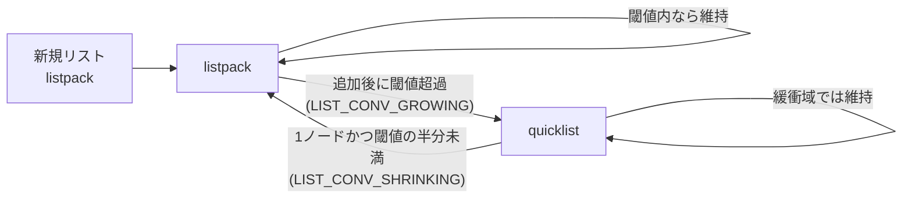

# 第16章 リスト型

> **本章で読むソース**
>
> - [`src/t_list.c`](https://github.com/valkey-io/valkey/blob/9.1.0/src/t_list.c)
> - [`src/object.c`](https://github.com/valkey-io/valkey/blob/9.1.0/src/object.c)（リストオブジェクトの生成）
> - [`src/quicklist.c`](https://github.com/valkey-io/valkey/blob/9.1.0/src/quicklist.c)（変換閾値の計算、深入りしない）

## この章の狙い

Valkey のリスト型は、両端への追加と取り出しを高速に行う順序付きの値の列である。
要素数が少ないうちは1本の listpack にまとめて省メモリに保ち、大きくなると quicklist へ切り替えて更新コストを抑える。
本章では、この2つのエンコーディングを切り替える閾値の判定、両端操作を担う `LPUSH` と `LPOP` の処理、そしてエンコーディングの違いを呼び出し側から隠す抽象イテレータの設計を、実コードで追う。

## 前提

- [第8章 listpack](../part01-data-structures/08-listpack.md)：小さいリストの実体となる、要素を密に詰めた1本のバイト列。
- [第9章 quicklist](../part01-data-structures/09-quicklist.md)：大きいリストの実体となる、listpack をノードに連ねた双方向連結リスト。
- [第14章 オブジェクトとエンコーディング](14-object-encoding.md)：`robj` とエンコーディングの一般的な枠組み。

## 2つのエンコーディング

リスト型は内部表現として2つのエンコーディングを持つ。
小さいリストは `OBJ_ENCODING_LISTPACK`、大きいリストは `OBJ_ENCODING_QUICKLIST` である。
新しく作られるリストは必ず listpack から始まる。

[`src/object.c` L488-L493](https://github.com/valkey-io/valkey/blob/9.1.0/src/object.c#L488-L493)

```c
robj *createListListpackObject(void) {
    unsigned char *lp = lpNew(0);
    robj *o = createObject(OBJ_LIST, lp);
    o->encoding = OBJ_ENCODING_LISTPACK;
    return o;
}
```

listpack は要素を1本の連続したバイト列に詰めるため、要素数が少ないうちはポインタやノードのオーバーヘッドがなく省メモリで済む。
一方で要素数が増えると、中間への挿入や削除でバイト列全体の移動が必要になり、コストが要素数に対して線形に膨らむ。
quicklist は listpack を複数のノードに分割した双方向連結リストであり、更新の影響を1ノード内に閉じ込めることでこのコストを抑える。
そこでリスト型は、要素数とサイズが一定の閾値を超えた時点で listpack から quicklist へ表現を切り替える。

この切り替えの判定は `listTypeTryConversion` 系の関数が担う。
入口は `listTypeTryConversionRaw` で、現在のエンコーディングと変換の方向に応じて、listpack 用と quicklist 用の判定へ振り分ける。

[`src/t_list.c` L126-L137](https://github.com/valkey-io/valkey/blob/9.1.0/src/t_list.c#L126-L137)

```c
static void
listTypeTryConversionRaw(robj *o, list_conv_type lct, robj **argv, int start, int end, beforeConvertCB fn, void *data) {
    if (o->encoding == OBJ_ENCODING_QUICKLIST) {
        if (lct == LIST_CONV_GROWING) return; /* Growing has nothing to do with quicklist */
        listTypeTryConvertQuicklist(o, lct == LIST_CONV_SHRINKING, fn, data);
    } else if (o->encoding == OBJ_ENCODING_LISTPACK) {
        if (lct == LIST_CONV_SHRINKING) return; /* Shrinking has nothing to do with listpack */
        listTypeTryConvertListpack(o, argv, start, end, fn, data);
    } else {
        serverPanic("Unknown list encoding");
    }
}
```

`list_conv_type` は変換のきっかけを表す。
要素を追加する側からは `LIST_CONV_GROWING`、削除する側からは `LIST_CONV_SHRINKING` が渡される。
listpack は追加でしか quicklist へ成長しないため、縮小の文脈では何もせずに戻る。
quicklist は削除でしか listpack へ戻らないため、成長の文脈では何もせずに戻る。
この振り分けにより、各操作は自分が起こしうる方向の変換だけを判定すればよい。

## listpack から quicklist への変換閾値

成長方向の判定を担うのが `listTypeTryConvertListpack` である。
追加しようとしている要素の合計バイト数と個数をあらかじめ見積もり、追加後の listpack が閾値を超えるなら quicklist へ移す。

[`src/t_list.c` L56-L70](https://github.com/valkey-io/valkey/blob/9.1.0/src/t_list.c#L56-L70)

```c
    if (quicklistNodeExceedsLimit(server.list_max_listpack_size, lpBytes(objectGetVal(o)) + add_bytes,
                                  lpLength(objectGetVal(o)) + add_length)) {
        /* Invoke callback before conversion. */
        if (fn) fn(data);

        quicklist *ql = quicklistNew(server.list_max_listpack_size, server.list_compress_depth);

        /* Append listpack to quicklist if it's not empty, otherwise release it. */
        if (lpLength(objectGetVal(o)))
            quicklistAppendListpack(ql, objectGetVal(o));
        else
            lpFree(objectGetVal(o));
        objectSetVal(o, ql);
        o->encoding = OBJ_ENCODING_QUICKLIST;
    }
```

閾値の基準は設定値 `server.list_max_listpack_size` である。
これは設定名 `list-max-listpack-size`（旧名 `list-max-ziplist-size`）で与えられ、既定値は `-2` である。
基準の意味は値の符号で変わる。
正の値なら要素の「個数」の上限を表し、負の値なら listpack の「バイトサイズ」の上限を表す。

負の値からサイズ上限への対応は `quicklistNodeLimit` が計算する。

[`src/quicklist.c` L446-L456](https://github.com/valkey-io/valkey/blob/9.1.0/src/quicklist.c#L446-L456)

```c
void quicklistNodeLimit(int fill, size_t *size, unsigned int *count) {
    *size = SIZE_MAX;
    *count = UINT_MAX;

    if (fill >= 0) {
        /* Ensure that one node have at least one entry */
        *count = (fill == 0) ? 1 : fill;
    } else {
        *size = quicklistNodeNegFillLimit(fill);
    }
}
```

負の `fill` は `-1` から `-5` までが、それぞれ 4KB、8KB、16KB、32KB、64KB のサイズ上限に対応する。
既定値の `-2` は8KBである。
つまり既定の Valkey では、リストの内容が8KBに収まるあいだは listpack のまま保たれ、これを超えると quicklist へ切り替わる。

ここで重要なのは、この閾値の計算が quicklist の単一ノードの上限と同じ関数で行われる点である。
listpack のリストは、quicklist に変換されたとき先頭の1ノードへちょうど収まる大きさに保たれている。
変換はその1ノードを抱える quicklist を新しく作り、既存の listpack をそのノードとして引き渡すだけで済む。

## quicklist から listpack への変換とヒステリシス

縮小方向の判定を担うのが `listTypeTryConvertQuicklist` である。
要素の削除でリストが小さくなったとき、quicklist を listpack へ戻すかどうかを判定する。
ただし戻す条件は、成長時の閾値とは対称ではない。

[`src/t_list.c` L89-L98](https://github.com/valkey-io/valkey/blob/9.1.0/src/t_list.c#L89-L98)

```c
    /* A quicklist can be converted to listpack only if it has only one packed node. */
    if (ql->len != 1 || ql->head->container != QUICKLIST_NODE_CONTAINER_PACKED) return;

    /* Check the length or size of the quicklist is below the limit. */
    quicklistNodeLimit(server.list_max_listpack_size, &sz_limit, &count_limit);
    if (shrinking) {
        sz_limit /= 2;
        count_limit /= 2;
    }
    if (ql->head->sz > sz_limit || ql->count > count_limit) return;
```

まず、ノードが1つだけで、しかもそのノードが通常の listpack を抱えるパック済みノードでなければ戻さない。
そのうえで、縮小がきっかけのときは閾値を半分に絞る。
成長は閾値そのもので quicklist へ移り、縮小は閾値の半分まで小さくならないと listpack へ戻らない。

この非対称性は、変換が繰り返し起きるのを防ぐためにある。
閾値ちょうどの大きさのリストに対して追加と削除を交互に行うと、もし境界が同じなら毎回エンコーディングが切り替わってしまう。
変換は表現を作り直す重い操作なので、戻す側の境界を下げて2つの境界のあいだに緩衝域を設ける。
この緩衝域があることで、境界付近で要素数が小刻みに上下しても変換は起きない。



## LPUSH と RPUSH

両端への追加コマンドは `LPUSH` と `RPUSH` で、どちらも `pushGenericCommand` を方向違いで呼ぶ。

[`src/t_list.c` L464-L490](https://github.com/valkey-io/valkey/blob/9.1.0/src/t_list.c#L464-L490)

```c
void pushGenericCommand(client *c, int where, int xx) {
    int j;

    robj *lobj = lookupKeyWrite(c->db, c->argv[1]);
    if (checkType(c, lobj, OBJ_LIST)) return;
    if (!lobj) {
        if (xx) {
            addReply(c, shared.czero);
            return;
        }

        lobj = createListListpackObject();
        dbAdd(c->db, c->argv[1], &lobj);
    }

    listTypeTryConversionAppend(lobj, c->argv, 2, c->argc - 1, NULL, NULL);
    for (j = 2; j < c->argc; j++) {
        listTypePush(lobj, c->argv[j], where);
        server.dirty++;
    }

    signalModifiedKey(c, c->db, c->argv[1]);
    char *event = (where == LIST_HEAD) ? "lpush" : "rpush";
    notifyKeyspaceEvent(NOTIFY_LIST, event, c->argv[1], c->db->id);

    addReplyLongLong(c, listTypeLength(lobj));
}
```

処理は次の順に進む。
キーが無ければ listpack のリストを新しく作る（`XX` 付きの `LPUSHX` でキーが無いときは何もしない）。
要素を実際に詰める前に `listTypeTryConversionAppend` を呼び、これから追加する全要素のサイズを織り込んで変換の要否を判定する。
判定を追加の前に置くのは、変換が起きる場合に既存の要素を一度だけ移し替えれば済むようにするためである。
変換を終えてから、引数の各要素を `listTypePush` で順に追加する。
最後にキー更新の通知を出し、追加後のリスト長を返す。

実際の追加を行う `listTypePush` は、エンコーディングごとに処理を分ける。

[`src/t_list.c` L156-L179](https://github.com/valkey-io/valkey/blob/9.1.0/src/t_list.c#L156-L179)

```c
void listTypePush(robj *subject, robj *value, int where) {
    if (subject->encoding == OBJ_ENCODING_QUICKLIST) {
        int pos = (where == LIST_HEAD) ? QUICKLIST_HEAD : QUICKLIST_TAIL;
        if (value->encoding == OBJ_ENCODING_INT) {
            char buf[32];
            ll2string(buf, 32, (long)objectGetVal(value));
            quicklistPush(objectGetVal(subject), buf, strlen(buf), pos);
        } else {
            quicklistPush(objectGetVal(subject), objectGetVal(value), sdslen(objectGetVal(value)), pos);
        }
    } else if (subject->encoding == OBJ_ENCODING_LISTPACK) {
        unsigned char *new_val = NULL;
        if (value->encoding == OBJ_ENCODING_INT) {
            new_val = (where == LIST_HEAD) ? lpPrependInteger(objectGetVal(subject), (long)objectGetVal(value))
                                           : lpAppendInteger(objectGetVal(subject), (long)objectGetVal(value));
        } else {
            new_val = (where == LIST_HEAD) ? lpPrepend(objectGetVal(subject), objectGetVal(value), sdslen(objectGetVal(value)))
                                           : lpAppend(objectGetVal(subject), objectGetVal(value), sdslen(objectGetVal(value)));
        }
        objectSetVal(subject, new_val);
    } else {
        serverPanic("Unknown list encoding");
    }
}
```

`where` は先頭か末尾かを指す。
quicklist なら `quicklistPush` が対応する端のノードへ追加し、listpack なら `lpPrepend` か `lpAppend` が対応する端へ追加する。
値が整数として保持されている場合は、専用の整数用関数で詰めることで、文字列化を避けてコンパクトに格納する。
両端いずれの追加も、対象が端のノードか listpack の端であるため、要素数によらず短い時間で済む。

## LPOP と RPOP

両端からの取り出しは `LPOP` と `RPOP` で、`popGenericCommand` が処理する。
1要素を取り出す既定の動作では、`listTypePop` で値を取り出し、`listElementsRemoved` で後始末を行う。

実際の取り出しを行う `listTypePop` も、エンコーディングごとに端の要素を取り出して削除する。

[`src/t_list.c` L185-L210](https://github.com/valkey-io/valkey/blob/9.1.0/src/t_list.c#L185-L210)

```c
robj *listTypePop(robj *subject, int where) {
    robj *value = NULL;

    if (subject->encoding == OBJ_ENCODING_QUICKLIST) {
        long long vlong;
        int ql_where = where == LIST_HEAD ? QUICKLIST_HEAD : QUICKLIST_TAIL;
        if (quicklistPopCustom(objectGetVal(subject), ql_where, (unsigned char **)&value, NULL, &vlong, listPopSaver)) {
            if (!value) value = createStringObjectFromLongLong(vlong);
        }
    } else if (subject->encoding == OBJ_ENCODING_LISTPACK) {
        unsigned char *p;
        unsigned char *vstr;
        int64_t vlen;
        unsigned char intbuf[LP_INTBUF_SIZE];

        p = (where == LIST_HEAD) ? lpFirst(objectGetVal(subject)) : lpLast(objectGetVal(subject));
        if (p) {
            vstr = lpGet(p, &vlen, intbuf);
            value = createStringObject((char *)vstr, vlen);
            objectSetVal(subject, lpDelete(objectGetVal(subject), p, NULL));
        }
    } else {
        serverPanic("Unknown list encoding");
    }
    return value;
}
```

listpack なら `lpFirst` か `lpLast` で端の要素を得て、`lpDelete` でその要素を取り除く。
quicklist なら `quicklistPopCustom` が端のノードから取り出す。
取り出しの後始末を担う `listElementsRemoved` は、リストが空になっていればキーごと削除し、空でなければ `listTypeTryConversion` を縮小方向で呼ぶ。
取り出しは追加と対になっており、ここで縮小方向の変換判定が起きることで、要素が減って閾値の半分を下回った quicklist が listpack へ戻る。

## 抽象イテレータ

`LPUSH` と `LPOP` のように端だけを触る操作はエンコーディングごとに直接書けるが、`LRANGE` や `LINSERT`、`LREM` のように途中の要素をたどる操作では、毎回エンコーディングを分岐するのは煩雑である。
そこでリスト型は、走査を `listTypeIterator` という抽象イテレータにまとめ、エンコーディングの違いを呼び出し側から隠す。

イテレータの状態は、listpack 用と quicklist 用の位置を両方抱える構造体で表す。

[`src/server.h` L2752-L2767](https://github.com/valkey-io/valkey/blob/9.1.0/src/server.h#L2752-L2767)

```c
/* Structure to hold list iteration abstraction. */
typedef struct {
    robj *subject;
    unsigned char encoding;
    unsigned char direction; /* Iteration direction */

    unsigned char *lpi;  /* listpack iterator */
    quicklistIter *iter; /* quicklist iterator */
} listTypeIterator;

/* Structure for an entry while iterating over a list. */
typedef struct {
    listTypeIterator *li;
    unsigned char *lpe;   /* Entry in listpack */
    quicklistEntry entry; /* Entry in quicklist */
} listTypeEntry;
```

初期化のとき、対象のエンコーディングをイテレータに記録し、それに応じた下位イテレータを用意する。

[`src/t_list.c` L223-L240](https://github.com/valkey-io/valkey/blob/9.1.0/src/t_list.c#L223-L240)

```c
listTypeIterator *listTypeInitIterator(robj *subject, long index, unsigned char direction) {
    listTypeIterator *li = zmalloc(sizeof(listTypeIterator));
    li->subject = subject;
    li->encoding = subject->encoding;
    li->direction = direction;
    li->iter = NULL;
    /* LIST_HEAD means start at TAIL and move *towards* head.
     * LIST_TAIL means start at HEAD and move *towards* tail. */
    if (li->encoding == OBJ_ENCODING_QUICKLIST) {
        int iter_direction = direction == LIST_HEAD ? AL_START_TAIL : AL_START_HEAD;
        li->iter = quicklistGetIteratorAtIdx(objectGetVal(li->subject), iter_direction, index);
    } else if (li->encoding == OBJ_ENCODING_LISTPACK) {
        li->lpi = lpSeek(objectGetVal(subject), index);
    } else {
        serverPanic("Unknown list encoding");
    }
    return li;
}
```

走査の本体である `listTypeNext` は、記録したエンコーディングを見て、quicklist なら `quicklistNext`、listpack なら `lpNext` か `lpPrev` で位置を1つ進める。

[`src/t_list.c` L269-L287](https://github.com/valkey-io/valkey/blob/9.1.0/src/t_list.c#L269-L287)

```c
int listTypeNext(listTypeIterator *li, listTypeEntry *entry) {
    /* Protect from converting when iterating */
    serverAssert(li->subject->encoding == li->encoding);

    entry->li = li;
    if (li->encoding == OBJ_ENCODING_QUICKLIST) {
        return quicklistNext(li->iter, &entry->entry);
    } else if (li->encoding == OBJ_ENCODING_LISTPACK) {
        entry->lpe = li->lpi;
        if (entry->lpe != NULL) {
            li->lpi =
                (li->direction == LIST_TAIL) ? lpNext(objectGetVal(li->subject), li->lpi) : lpPrev(objectGetVal(li->subject), li->lpi);
            return 1;
        }
    } else {
        serverPanic("Unknown list encoding");
    }
    return 0;
}
```

呼び出し側は `listTypeInitIterator` で始め、`listTypeNext` で要素を1つずつ取り、`listTypeGetValue` で値を読み、`listTypeReleaseIterator` で後始末をする。
この間、エンコーディングが listpack か quicklist かを意識する必要はない。
冒頭の `serverAssert` は、初期化時に記録したエンコーディングが走査中も変わっていないことを確かめる。
走査の途中でエンコーディングが変換されると、抱えている下位イテレータが指す先が無効になるため、変換と走査が重ならないことを前提に置いている。

この抽象化によって、`LINSERT` や `LREM` や `LPOS` といった途中要素をたどるコマンドは、エンコーディングごとの分岐を持たずに同じイテレータの上で書ける。

## LRANGE

範囲取得の `LRANGE` は `addListRangeReply` を経て応答を組み立てる。
ここではイテレータでなく、応答生成を速くするためにエンコーディング別の専用関数へ直接振り分ける。

[`src/t_list.c` L723-L729](https://github.com/valkey-io/valkey/blob/9.1.0/src/t_list.c#L723-L729)

```c
    int from = reverse ? end : start;
    if (o->encoding == OBJ_ENCODING_QUICKLIST)
        addListQuicklistRangeReply(c, o, from, rangelen, reverse);
    else if (o->encoding == OBJ_ENCODING_LISTPACK)
        addListListpackRangeReply(c, o, from, rangelen, reverse);
    else
        serverPanic("Unknown list encoding");
```

`addListQuicklistRangeReply` と `addListListpackRangeReply` は、それぞれの下位構造を直接たどって応答バッファへ要素を書き出す。
2つに分けてあるのは、ループの中身を小さく保ってインライン展開を効かせ、要素ごとの処理を速くするためである（その意図はソースのコメントに記されている）。
範囲の起点を求める際、負のインデックスはリスト長を足して正規化し、範囲が空なら早期に空配列を返す。

## ブロッキング版コマンド

`BLPOP` や `BRPOP`、`BLMOVE` といったブロッキング版のコマンドも本ファイルにある。
これらは対象のリストに要素があれば通常の取り出しと同じように振る舞い、要素が無いときにクライアントを待たせる点だけが異なる。

[`src/t_list.c` L1217-L1223](https://github.com/valkey-io/valkey/blob/9.1.0/src/t_list.c#L1217-L1223)

```c
    if (c->flag.deny_blocking) {
        addReplyNullArray(c);
        return;
    }

    /* If the keys do not exist we must block */
    blockForKeys(c, BLOCKED_LIST, keys, numkeys, timeout, 0);
```

要素が見つからなかった場合、ブロッキングが許される文脈なら `blockForKeys` でクライアントを待ち状態に入れる。
待たされたクライアントを、別のクライアントの `LPUSH` が起こす仕組みについては第47章で扱う。

## まとめ

- リスト型は listpack と quicklist の2つのエンコーディングを持ち、新規リストは必ず listpack から始まる。
- 要素を追加したとき、追加後の大きさが `list-max-listpack-size`（既定 `-2`、8KB相当）を超えると listpack から quicklist へ変換される。判定は追加の前に行う。
- quicklist から listpack へ戻すときは閾値を半分に絞り、境界付近での変換の往復を防ぐ緩衝域を設ける。
- `LPUSH` と `LPOP` は両端のノードだけを触るため、要素数によらず短い時間で済む。整数値は専用関数でコンパクトに格納する。
- `listTypeIterator` がエンコーディングの違いを隠し、途中要素をたどるコマンドを共通のコードで書けるようにする。
- ブロッキング版コマンドは、要素が無いとき `blockForKeys` でクライアントを待たせる。

## 関連する章

- [第8章 listpack](../part01-data-structures/08-listpack.md)：小さいリストの実体。
- [第9章 quicklist](../part01-data-structures/09-quicklist.md)：大きいリストの実体と、ノードの分割や圧縮の仕組み。
- [第14章 オブジェクトとエンコーディング](14-object-encoding.md)：エンコーディングの一般的な枠組み。
- [第47章 ブロッキング操作](../part08-features/47-blocking.md)：`BLPOP` などが待ち状態のクライアントを起こす仕組み。
