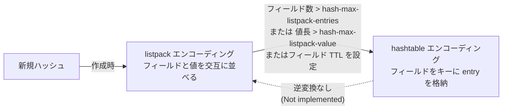
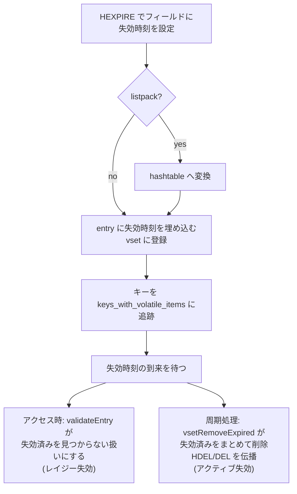

# 第18章 ハッシュ型とフィールド TTL

> **本章で読むソース**
>
> - [`src/t_hash.c`](https://github.com/valkey-io/valkey/blob/9.1.0/src/t_hash.c)
> - [`src/entry.c`](https://github.com/valkey-io/valkey/blob/9.1.0/src/entry.c)（フィールドと値と失効時刻を1つにまとめた `entry`）
> - [`src/server.c`](https://github.com/valkey-io/valkey/blob/9.1.0/src/server.c)（ハッシュテーブル型の定義）
> - [`src/db.c`](https://github.com/valkey-io/valkey/blob/9.1.0/src/db.c)（フィールドのアクティブ失効）

## この章の狙い

Valkey のハッシュ型は、1つのキーの下にフィールドと値の対を多数ぶら下げる連想配列である。
フィールド数が少ないうちは1本の listpack にフィールドと値を交互に並べて省メモリに保ち、大きくなると hashtable へ切り替えて参照と更新を定数時間に近づける。
本章では、この2エンコーディングを切り替える閾値の判定、`HSET` と `HGET` と `HDEL` の処理、そしてフィールド単位の有効期限を実現する `HEXPIRE` 系のしくみを、実コードで追う。
フィールド TTL の実装はバージョンによって構造が異なる。
9.1.0 では、失効時刻を `entry` に埋め込み、失効間近のフィールドだけを別構造の `vset` で追う設計を採る。

## 前提

- [第8章 listpack](../part01-data-structures/08-listpack.md)：小さいハッシュの実体となる、要素を密に詰めた1本のバイト列。
- [第7章 hashtable](../part01-data-structures/07-hashtable.md)：大きいハッシュの実体となる、Valkey 独自のオープンアドレス法ハッシュテーブル。
- [第14章 オブジェクトとエンコーディング](14-object-encoding.md)：`robj` とエンコーディングの一般的な枠組み。

## 2つのエンコーディング

ハッシュ型は内部表現として2つのエンコーディングを持つ。
小さいハッシュは `OBJ_ENCODING_LISTPACK`、大きいハッシュは `OBJ_ENCODING_HASHTABLE` である。
新しく作られるハッシュは必ず listpack から始まる。

listpack エンコーディングでは、フィールドと値を1本のバイト列に交互に並べる。
`hashTypeGetFromListpack` がこの並びを前提に値を探す。
フィールドを `lpFind` で見つけ、その次の要素を `lpNext` でたどると、対応する値に届く。

[`src/t_hash.c` L198-L220](https://github.com/valkey-io/valkey/blob/9.1.0/src/t_hash.c#L198-L220)

```c
int hashTypeGetFromListpack(robj *o, sds field, unsigned char **vstr, unsigned int *vlen, long long *vll) {
    unsigned char *zl, *fptr = NULL, *vptr = NULL;

    serverAssert(o->encoding == OBJ_ENCODING_LISTPACK);

    zl = objectGetVal(o);
    fptr = lpFirst(zl);
    if (fptr != NULL) {
        fptr = lpFind(zl, fptr, (unsigned char *)field, sdslen(field), 1);
        if (fptr != NULL) {
            /* Grab pointer to the value (fptr points to the field) */
            vptr = lpNext(zl, fptr);
            serverAssert(vptr != NULL);
        }
    }
    // ... (中略) ...
}
```

`lpFind` の最後の引数 `1` は、要素を1つおきに飛ばして比較することを指示する。
フィールドと値が交互に並ぶので、フィールドだけを比較対象にするためにこの指定が要る。
この並びは省メモリだが、フィールドの検索が要素数に対して線形になる。
そのため、フィールド数が増えたハッシュは hashtable へ切り替える。

hashtable エンコーディングでは、フィールドをキーとするハッシュテーブルに、フィールドと値の対を表す `entry` を格納する。
`hashTypeGetValue` は両エンコーディングの違いを吸収し、listpack なら `hashTypeGetFromListpack`、hashtable なら `hashtableFind` で値を取り出す。

[`src/t_hash.c` L234-L257](https://github.com/valkey-io/valkey/blob/9.1.0/src/t_hash.c#L234-L257)

```c
int hashTypeGetValue(robj *o, sds field, unsigned char **vstr, unsigned int *vlen, long long *vll, mstime_t *expiry) {
    if (o->encoding == OBJ_ENCODING_LISTPACK) {
        *vstr = NULL;
        if (hashTypeGetFromListpack(o, field, vstr, vlen, vll) == 0) {
            if (expiry) *expiry = EXPIRY_NONE;
            return C_OK;
        }
    } else if (o->encoding == OBJ_ENCODING_HASHTABLE) {
        void *entry = NULL;
        hashtableFind(objectGetVal(o), field, &entry);
        if (entry) {
            size_t len = 0;
            char *value = entryGetValue(entry, &len);
            serverAssert(value != NULL);
            *vstr = (unsigned char *)value;
            *vlen = len;
            if (expiry) *expiry = entryGetExpiry(entry);
            return C_OK;
        }
    } else {
        serverPanic("Unknown hash encoding");
    }
    return C_ERR;
}
```

listpack 経路では失効時刻として常に `EXPIRY_NONE` を返す。
listpack のフィールドは有効期限を持てないからである。
hashtable 経路では、`entry` に埋め込まれた失効時刻を呼び出し側へ渡せる。
この非対称が、後で見るフィールド TTL の入口になる。

## 変換の閾値

listpack から hashtable への切り替えは、フィールド数と値の長さがそれぞれ閾値を超えたときに起きる。
閾値は2つの設定で決まる。

```text
hash-max-listpack-entries  既定 512   フィールド数の上限
hash-max-listpack-value    既定 64    フィールドと値それぞれのバイト長の上限
```

これらは [`src/config.c` L3465-L3471](https://github.com/valkey-io/valkey/blob/9.1.0/src/config.c#L3465-L3471) で登録される。
旧名の `hash-max-ziplist-entries` と `hash-max-ziplist-value` も別名として受け付ける。

変換の判定は `hashTypeTryConversion` が担う。
コマンドが値を書き込む前に呼ばれ、引数の範囲を見て、listpack のままでよいか hashtable へ移すべきかを決める。

[`src/t_hash.c` L168-L194](https://github.com/valkey-io/valkey/blob/9.1.0/src/t_hash.c#L168-L194)

```c
void hashTypeTryConversion(robj *o, robj **argv, int start, int end) {
    int i;
    size_t sum = 0;

    if (o->encoding != OBJ_ENCODING_LISTPACK) return;

    /* We guess that most of the values in the input are unique, so
     * if there are enough arguments we create a pre-sized hash, which
     * might over allocate memory if there are duplicates. */
    size_t new_fields = (end - start + 1) / 2;
    if (new_fields > server.hash_max_listpack_entries) {
        hashTypeConvert(o, OBJ_ENCODING_HASHTABLE);
        hashtableExpand(objectGetVal(o), new_fields);
        return;
    }

    for (i = start; i <= end; i++) {
        if (!sdsEncodedObject(argv[i])) continue;
        size_t len = sdslen(objectGetVal(argv[i]));
        if (len > server.hash_max_listpack_value) {
            hashTypeConvert(o, OBJ_ENCODING_HASHTABLE);
            return;
        }
        sum += len;
    }
    if (!lpSafeToAdd(objectGetVal(o), sum)) hashTypeConvert(o, OBJ_ENCODING_HASHTABLE);
}
```

判定には3つの分岐がある。
第1に、これから加わるフィールド数が `hash_max_listpack_entries` を超えるなら、まとめて hashtable へ移し、想定サイズだけ事前に確保する。
第2に、いずれかの引数の長さが `hash_max_listpack_value` を超えるなら、その時点で hashtable へ移す。
第3に、追加後のバイト数が listpack の安全な上限を超える (`lpSafeToAdd` が偽) なら hashtable へ移す。

ここに最適化の核の1つがある。
小さいハッシュを listpack に保つのは、フィールド数が少ないうちはハッシュテーブルのバケットやポインタのオーバーヘッドが相対的に大きく、1本のバイト列に密に詰めたほうが省メモリだからである。
変換は片方向で、`hashTypeConvert` は hashtable から listpack への逆変換を実装しない (`serverPanic("Not implemented")`)。
一度大きくなったハッシュは縮んでも listpack には戻らない。

[`src/t_hash.c` L806-L814](https://github.com/valkey-io/valkey/blob/9.1.0/src/t_hash.c#L806-L814)

```c
void hashTypeConvert(robj *o, int enc) {
    if (o->encoding == OBJ_ENCODING_LISTPACK) {
        hashTypeConvertListpack(o, enc);
    } else if (o->encoding == OBJ_ENCODING_HASHTABLE) {
        serverPanic("Not implemented");
    } else {
        serverPanic("Unknown hash encoding");
    }
}
```

実際の移し替えは `hashTypeConvertListpack` が行う。
listpack を先頭からたどり、フィールドと値の対ごとに `entry` を作って新しいハッシュテーブルへ加える。
失効時刻を持たない通常の変換なので、`entryCreate` には `EXPIRY_NONE` を渡す。



このうち、フィールド TTL を設定したときの矢印は次の節で詳しく見る。
listpack のフィールドは有効期限を持てないため、TTL を設定する瞬間に必ず hashtable へ移る。

## HSET と HGET と HDEL

書き込みの入口は `hsetCommand` である。
まず `hashTypeTryConversion` で必要なら hashtable へ移し、続いてフィールドと値の対ごとに `hashTypeSet` を呼ぶ。

[`src/t_hash.c` L1272-L1313](https://github.com/valkey-io/valkey/blob/9.1.0/src/t_hash.c#L1272-L1313)

```c
void hsetCommand(client *c) {
    int i, created = 0;
    robj *o;

    if ((c->argc % 2) == 1) {
        addReplyErrorArity(c);
        return;
    }

    if ((o = hashTypeLookupWriteOrCreate(c, c->argv[1])) == NULL) return;
    hashTypeTryConversion(o, c->argv, 2, c->argc - 1);
    bool has_volatile_fields = hashTypeHasVolatileFields(o);
    int expired_overwritten = 0;
    for (i = 2; i < c->argc; i += 2) {
        bool expired = false;
        created += !hashTypeSet(o, objectGetVal(c->argv[i]), objectGetVal(c->argv[i + 1]), EXPIRY_NONE, HASH_SET_COPY, &expired);
        // ... (中略) ...
    }
    // ... (中略) ...
    notifyKeyspaceEvent(NOTIFY_HASH, "hset", c->argv[1], c->db->id);
    server.dirty += (c->argc - 2) / 2;
    // ... (中略) ...
}
```

`hashTypeSet` がエンコーディングの違いを吸収する。
listpack なら、既存フィールドがあれば `lpReplace` で値を差し替え、なければ `lpAppend` をフィールドと値の順で2回呼んで末尾に追加する。
追加の結果フィールド数が `hash_max_listpack_entries` を超えたら、その場で hashtable へ移す。

[`src/t_hash.c` L379-L405](https://github.com/valkey-io/valkey/blob/9.1.0/src/t_hash.c#L379-L405)

```c
    if (o->encoding == OBJ_ENCODING_LISTPACK) {
        unsigned char *zl, *fptr, *vptr;

        zl = objectGetVal(o);
        fptr = lpFirst(zl);
        if (fptr != NULL) {
            fptr = lpFind(zl, fptr, (unsigned char *)field, sdslen(field), 1);
            if (fptr != NULL) {
                /* Grab pointer to the value (fptr points to the field) */
                vptr = lpNext(zl, fptr);
                serverAssert(vptr != NULL);
                update = 1;

                /* Replace value */
                zl = lpReplace(zl, &vptr, (unsigned char *)value, sdslen(value));
            }
        }

        if (!update) {
            /* Push new field/value pair onto the tail of the listpack */
            zl = lpAppend(zl, (unsigned char *)field, sdslen(field));
            zl = lpAppend(zl, (unsigned char *)value, sdslen(value));
        }
        objectSetVal(o, zl);

        /* Check if the listpack needs to be converted to a hash table */
        if (hashTypeLength(o) > server.hash_max_listpack_entries) hashTypeConvert(o, OBJ_ENCODING_HASHTABLE);
```

hashtable なら、フィールドの挿入位置を `hashtableFindPositionForInsert` で求め、新規なら `entryCreate` で `entry` を作って挿入し、既存なら `entryUpdate` で値を差し替える。
このとき一時的に失効を無視する設定にしてから書き込む。
失効済みのフィールドが残っていても、新しい値で上書きできるようにするためである。

読み出しの入口 `hgetCommand` は短い。
`addHashFieldToReply` を通じて `hashTypeGetValue` を呼ぶだけである。

[`src/t_hash.c` L1096-L1101](https://github.com/valkey-io/valkey/blob/9.1.0/src/t_hash.c#L1096-L1101)

```c
void hgetCommand(client *c) {
    robj *o;

    if ((o = lookupKeyReadOrReply(c, c->argv[1], shared.null[c->resp])) == NULL || checkType(c, o, OBJ_HASH)) return;
    addHashFieldToReply(c, o, objectGetVal(c->argv[2]));
}
```

`HGETALL` `HKEYS` `HVALS` はいずれも `genericHgetallCommand` を共有し、`hashTypeNext` でハッシュを走査する。
このイテレータも listpack なら2要素ずつ進み、hashtable なら `hashtableNext` で `entry` をたどるという形で、エンコーディングの違いを内側に閉じ込めている。

削除は `hdelCommand` である。
指定されたフィールドを `hashTypeDelete` で順に消し、ハッシュが空になったらキーごと消す。

[`src/t_hash.c` L1122-L1153](https://github.com/valkey-io/valkey/blob/9.1.0/src/t_hash.c#L1122-L1153)

```c
void hdelCommand(client *c) {
    robj *o;
    int j, deleted = 0;
    bool keyremoved = false;

    if ((o = lookupKeyWriteOrReply(c, c->argv[1], shared.czero)) == NULL || checkType(c, o, OBJ_HASH)) return;

    bool hash_volatile_items = hashTypeHasVolatileFields(o);
    if (o->encoding == OBJ_ENCODING_HASHTABLE) hashtablePauseAutoShrink(objectGetVal(o));
    for (j = 2; j < c->argc; j++) {
        if (hashTypeDelete(o, objectGetVal(c->argv[j]))) {
            deleted++;
            if (hashTypeLength(o) == 0) {
                if (hash_volatile_items) dbUntrackKeyWithVolatileItems(c->db, o);
                dbDelete(c->db, c->argv[1]); /* Please note that this will also remove the tracking from the kvstore */
                keyremoved = true;
                break;
            }
        }
    }
    // ... (中略) ...
}
```

削除中はハッシュテーブルの自動縮小を `hashtablePauseAutoShrink` で止める。
複数フィールドをまとめて消す間に何度も縮小判定が走るのを避けるためである。
`dbUntrackKeyWithVolatileItems` と `hashTypeHasVolatileFields` という見慣れない呼び出しが混ざっているが、これはフィールド TTL の管理に関わる。
次の節で扱う。

## フィールド TTL の設計

`HEXPIRE` 系のコマンドは、フィールド単位で有効期限を設定する。
キー全体ではなく、ハッシュの中の特定フィールドだけを時刻が来たら消す。
この機能を支えるために、9.1.0 は3つの構造を組み合わせる。
失効時刻を埋め込んだ `entry`、失効間近のフィールドだけを追う `vset`、そして失効フィールドを持つキーだけを集めたデータベース側の追跡用 kvstore である。

### 失効時刻を埋め込んだ entry

hashtable エンコーディングのフィールドは、`entry` という1つの確保領域にまとめられる。
`entry` はフィールドの sds と値の sds、そして任意の失効時刻を、できるだけ詰めて1つのブロックに収める。

[`src/entry.h` L16-L21](https://github.com/valkey-io/valkey/blob/9.1.0/src/entry.h#L16-L21)

```c
/*
 * An "entry" is a field/value sds pair, with an optional expiration time.  The
 * entry is used as part of the HASH datatype, and supports hash field expiration.
 */

typedef struct _entry entry;
```

失効時刻 (`mstime_t`) は、設定されているときだけ `entry` の先頭に置かれる。
設定されていなければその領域は確保しない。
失効時刻の有無は、フィールド sds の予備ビット (aux ビット) で判定する。

[`src/entry.c` L126-L130](https://github.com/valkey-io/valkey/blob/9.1.0/src/entry.c#L126-L130)

```c
/* Returns true in case the entry has expiration timestamp.
 * Returns false otherwise. */
bool entryHasExpiry(const entry *entry) {
    return sdsGetAuxBit(entryGetField(entry), FIELD_SDS_AUX_BIT_ENTRY_HAS_EXPIRY);
}
```

ここに省メモリの工夫がある。
失効時刻を別のテーブルに持たせるのではなく `entry` に埋め込むので、フィールドを引けば失効時刻も同時に届く。
そして TTL を持たないフィールドは8バイトの時刻領域を一切払わない。
ハッシュのフィールドの大半が TTL を持たない使い方でも、無駄なメモリを増やさずに済む。

`entry` が失効済みかどうかは `entryIsExpired` が判定する。
失効時刻がなければ失効していないとみなし、あれば現在時刻と比べる。

[`src/entry.c` L231-L235](https://github.com/valkey-io/valkey/blob/9.1.0/src/entry.c#L231-L235)

```c
bool entryIsExpired(entry *entry) {
    mstime_t entry_expiry = entryGetExpiry(entry);
    if (entry_expiry == EXPIRY_NONE) return false;
    return timestampIsExpired(entry_expiry);
}
```

### 失効間近のフィールドを追う vset

失効時刻を `entry` に埋め込むだけでは、どのフィールドがもうすぐ失効するのかをまとめて知ることができない。
全フィールドを走査せずに失効間近のものを見つけるため、`vset` (volatile set) という補助構造を使う。
`vset` は失効時刻を意識した半順序の集合で、失効が近いフィールドを効率よく取り出せるように作られている。

[`src/vset.h` L11-L19](https://github.com/valkey-io/valkey/blob/9.1.0/src/vset.h#L11-L19)

```c
/*
 *-----------------------------------------------------------------------------
 * Volatile Set - Adaptive, Expiry-aware Set Structure
 *-----------------------------------------------------------------------------
 *
 * The `vset` is a dynamic, memory-efficient container for managing
 * entries with expiry semantics. It is designed to efficiently track entries
 * that expire at varying times and scales to large sets by adapting its internal
 * representation as it grows or shrinks.
```

`vset` の置き場所が巧妙である。
ハッシュ型の hashtable は、テーブル本体とは別に固定長のメタデータ領域を持てる。
ハッシュ型はこのメタデータに `vset` を埋め込む。
メタデータの大きさは、`vset` 1つ分のポインタを収める `sizeof(void *)` と宣言されている。

[`src/server.c` L666-L687](https://github.com/valkey-io/valkey/blob/9.1.0/src/server.c#L666-L687)

```c
size_t hashHashtableTypeMetadataSize(void) {
    return sizeof(void *);
}

extern bool hashHashtableTypeValidate(hashtable *ht, void *entry);

hashtableType hashHashtableType = {
    .hashFunction = dictSdsHash,
    .entryGetKey = hashHashtableTypeGetKey,
    .keyCompare = hashtableSdsKeyCompare,
    .entryDestructor = hashHashtableTypeDestructor,
    .getMetadataSize = hashHashtableTypeMetadataSize,
};

hashtableType hashWithVolatileItemsHashtableType = {
    .hashFunction = dictSdsHash,
    .entryGetKey = hashHashtableTypeGetKey,
    .keyCompare = hashtableSdsKeyCompare,
    .entryDestructor = hashHashtableTypeDestructor,
    .getMetadataSize = hashHashtableTypeMetadataSize,
    .validateEntry = hashHashtableTypeValidate,
};
```

ここに2つのハッシュテーブル型がある。
両者の違いは `validateEntry` コールバックの有無だけである。
`hashWithVolatileItemsHashtableType` は失効を検査する `validateEntry` を持ち、`hashHashtableType` は持たない。
失効するフィールドが1つもないハッシュには検査なしの型を使い、検査の関数呼び出しを丸ごと省く。
ハッシュが初めて失効フィールドを得たとき、`hashTypeGetOrcreateVolatileSet` が `vset` を初期化し、型を検査ありに切り替える。

[`src/t_hash.c` L83-L102](https://github.com/valkey-io/valkey/blob/9.1.0/src/t_hash.c#L83-L102)

```c
static inline void hashTypeIgnoreTTL(robj *o, bool ignore) {
    if (o->encoding == OBJ_ENCODING_HASHTABLE) {
        /* prevent placing access function if not needed */
        if (!ignore && hashTypeGetVolatileSet(o) == NULL) {
            ignore = true;
        }
        hashtableSetType(objectGetVal(o), ignore ? &hashHashtableType : &hashWithVolatileItemsHashtableType);
    }
}

static vset *hashTypeGetOrcreateVolatileSet(robj *o) {
    serverAssert(o->encoding == OBJ_ENCODING_HASHTABLE);
    vset *set = (vset *)hashtableMetadata(objectGetVal(o));
    if (!vsetIsValid(set)) {
        vsetInit(set);
        /* serves mainly for optimization. Use type which supports access function only when needed. */
        hashTypeIgnoreTTL(o, false);
    }
    return set;
}
```

### HEXPIRE による失効時刻の設定

`HEXPIRE` `HPEXPIRE` `HEXPIREAT` `HPEXPIREAT` は、いずれも `hexpireGenericCommand` を共有する。
秒かミリ秒か、相対時刻か絶対時刻かの違いだけを引数で渡し分ける。

[`src/t_hash.c` L1977-L1991](https://github.com/valkey-io/valkey/blob/9.1.0/src/t_hash.c#L1977-L1991)

```c
void hexpireCommand(client *c) {
    hexpireGenericCommand(c, commandTimeSnapshot(), UNIT_SECONDS);
}

void hexpireatCommand(client *c) {
    hexpireGenericCommand(c, 0, UNIT_SECONDS);
}

void hpexpireCommand(client *c) {
    hexpireGenericCommand(c, commandTimeSnapshot(), UNIT_MILLISECONDS);
}

void hpexpireatCommand(client *c) {
    hexpireGenericCommand(c, 0, UNIT_MILLISECONDS);
}
```

`hexpireGenericCommand` はフィールドごとに `hashTypeSetExpire` を呼び、結果を集計する。
フィールドが既に過去時刻で失効するなら、その場で消して `HDEL` として伝播するためにコマンドベクタを組み直す。

`hashTypeSetExpire` がフィールド TTL の中心である。
listpack エンコーディングのハッシュは失効時刻を持てないので、TTL を設定する前に hashtable へ移す。
ただし、`XX` や `GT` のように既存の失効時刻を前提とする条件付き指定では、listpack を無限の TTL とみなして条件を満たさないと判断し、変換せずに戻る。

[`src/t_hash.c` L476-L497](https://github.com/valkey-io/valkey/blob/9.1.0/src/t_hash.c#L476-L497)

```c
    if (o->encoding == OBJ_ENCODING_LISTPACK) {
        unsigned char *vstr;
        unsigned int vlen;
        long long vll;
        /* We do not want to convert to listpack for no good reason.
         * So we first check if the item exists.*/
        if (hashTypeGetFromListpack(o, field, &vstr, &vlen, &vll) < 0) {
            return EXPIRATION_MODIFICATION_NOT_EXIST;
        }
        // ... (中略) ...
        if (flag & EXPIRE_XX || flag & EXPIRE_GT) {
            return EXPIRATION_MODIFICATION_FAILED_CONDITION;
        } else if (time_is_expired) {
            serverAssert(hashTypeDelete(o, field));
            return EXPIRATION_MODIFICATION_EXPIRE_ASAP;
        } else {
            hashTypeConvert(o, OBJ_ENCODING_HASHTABLE);
        }
    }
```

hashtable に移ってからは、`NX` `XX` `GT` `LT` の条件を確かめたうえで、`entrySetExpiry` で失効時刻を書き込み、`hashTypeTrackUpdateEntry` で `vset` の登録を更新する。

[`src/t_hash.c` L542-L548](https://github.com/valkey-io/valkey/blob/9.1.0/src/t_hash.c#L542-L548)

```c
        if (time_is_expired) {
            serverAssert(hashTypeDelete(o, field));
            return EXPIRATION_MODIFICATION_EXPIRE_ASAP;
        }
        *entry_ref = entrySetExpiry(current_entry, expiry);
        hashTypeTrackUpdateEntry(o, current_entry, *entry_ref, current_expire, expiry);
        return EXPIRATION_MODIFICATION_SUCCESSFUL;
```

## フィールドの失効

失効時刻を設定したフィールドは、時刻が来ても即座には消えない。
Valkey はキー全体の有効期限と同じく、フィールドにもレイジー失効とアクティブ失効の2系統を持つ。

### レイジー失効

レイジー失効は、フィールドにアクセスしたついでに失効済みを取り除くしくみである。
先に見たとおり、`hgetCommand` は `hashTypeGetValue` を経て `hashtableFind` を呼ぶ。
このとき、失効フィールドを持つハッシュは `hashWithVolatileItemsHashtableType` 型なので、ハッシュテーブルは要素を返す前に `validateEntry` を呼ぶ。

[`src/hashtable.c` L393-L396](https://github.com/valkey-io/valkey/blob/9.1.0/src/hashtable.c#L393-L396)

```c
static inline bool validateElementIfNeeded(hashtable *ht, void *elem) {
    if (ht->type->validateEntry == NULL) return true;
    return ht->type->validateEntry(ht, elem);
}
```

ハッシュ型が登録する検査関数 `hashHashtableTypeValidate` は、`entry` が失効済みなら偽を返す。

[`src/t_hash.c` L150-L159](https://github.com/valkey-io/valkey/blob/9.1.0/src/t_hash.c#L150-L159)

```c
bool hashHashtableTypeValidate(hashtable *ht, void *entryptr) {
    UNUSED(ht);
    entry *entry = entryptr;
    expirationPolicy policy = getExpirationPolicyWithFlags(0);
    if (policy == POLICY_IGNORE_EXPIRE) return true;

    if (!entryIsExpired(entry)) return true;

    return false;
}
```

検査が偽を返すと、`hashtableFind` はそのフィールドを見つからなかったものとして扱う。
失効したフィールドへの `HGET` は、フィールドが存在しないのと同じく `nil` を返す。
このとき `entry` 自体はまだ物理的にハッシュテーブルに残っている。
レイジー失効は「見えなくする」だけで、実際の解放は後で行う。

### アクティブ失効

レイジー失効だけでは、二度とアクセスされないフィールドが領域を占有し続ける。
これを片付けるのがアクティブ失効である。
データベースは、失効フィールドを持つキーだけを別の kvstore `keys_with_volatile_items` に集めて追跡する。

[`src/db.c` L525-L531](https://github.com/valkey-io/valkey/blob/9.1.0/src/db.c#L525-L531)

```c
/* Add a key with volatile items to the tracking kvstore. */
void dbTrackKeyWithVolatileItems(serverDb *db, robj *o) {
    if (o->type == OBJ_HASH && hashTypeHasVolatileFields(o)) {
        int dict_index = getKVStoreIndexForKey(objectGetKey(o));
        kvstoreHashtableAdd(db->keys_with_volatile_items, dict_index, o);
    }
}
```

前の節で `hsetCommand` や `hdelCommand` に現れた `dbUpdateObjectWithVolatileItemsTracking` は、書き込みの前後で失効フィールドの有無が変わったときに、この追跡へキーを出し入れする呼び出しである。
追跡対象を失効フィールドを持つキーだけに絞ることで、アクティブ失効はキー空間全体を走査せずに済む。

アクティブ失効の周期処理は、キー全体の有効期限を処理する `activeExpireCycle` の機構をそのまま使う。
失効フィールドを持つキーごとに `dbReclaimExpiredFields` を呼び、失効済みフィールドをまとめて削除する。

[`src/db.c` L2060-L2074](https://github.com/valkey-io/valkey/blob/9.1.0/src/db.c#L2060-L2074)

```c
size_t dbReclaimExpiredFields(robj *o, serverDb *db, mstime_t now, unsigned long max_entries, int didx) {
    size_t total_expired = 0;
    bool deleteKey = false;

    while (max_entries > 0) {
        /* Process in batches to avoid large stack allocations. */
        unsigned long batch_size = max_entries > EXPIRE_BULK_LIMIT ? EXPIRE_BULK_LIMIT : max_entries;
        robj *entries[EXPIRE_BULK_LIMIT];
        size_t expired = hashTypeDeleteExpiredFields(o, now, batch_size, entries);
        if (expired == 0) break;

        /* Clean up volatile set if no more volatile fields remain */
        if (!hashTypeHasVolatileFields(o)) {
            dbUntrackKeyWithVolatileItems(db, o);
        }
```

実際に失効フィールドを抜き出すのは `hashTypeDeleteExpiredFields` で、ここで `vset` が効く。
全フィールドを走査するのではなく、`vsetRemoveExpired` が `vset` の半順序を使って失効が近いフィールドから当たり、現在時刻より前のものだけを最大 `max_count` 個まで削除する。

[`src/t_hash.c` L2399-L2419](https://github.com/valkey-io/valkey/blob/9.1.0/src/t_hash.c#L2399-L2419)

```c
size_t hashTypeDeleteExpiredFields(robj *o, mstime_t now, unsigned long max_fields, robj **out_entries) {
    serverAssert(o->encoding == OBJ_ENCODING_HASHTABLE);

    vset *vset = hashTypeGetVolatileSet(o);
    if (!vset) {
        return 0;
    }

    serverAssert(!vsetIsEmpty(vset));
    /* skip TTL checks temporarily (to allow hashtable pops) */
    hashTypeIgnoreTTL(o, true);
    expiryContext ctx = {.key = o, .fields = out_entries, .n_fields = 0};
    size_t expired = vsetRemoveExpired(vset, entryGetExpiryVsetFunc, hashTypeExpireEntry, now, max_fields, &ctx);
    serverAssert(ctx.n_fields <= max_fields);
    if (vsetIsEmpty(vset)) {
        hashTypeFreeVolatileSet(o);
    } else {
        hashTypeIgnoreTTL(o, false);
    }
    return expired;
}
```

削除したフィールドが全部なくなって `vset` が空になれば、`vset` を解放し、ハッシュテーブルの型を検査なしの `hashHashtableType` へ戻す。
失効フィールドがなくなったハッシュは、再びアクセスのたびの失効検査を払わずに済む。

`dbReclaimExpiredFields` は削除したフィールドを `HDEL` コマンドとしてレプリカと AOF へ伝播する。
失効の判断をプライマリだけが行い、その結果を `HDEL` として配ることで、レプリカでも同じフィールドが同じタイミングで消える。
ハッシュが空になれば、続けてキー自体を `DEL` として削除し伝播する。



なお、フィールド単位ではなくキー単位の有効期限のしくみ、すなわち `EXPIRE` や `activeExpireCycle` の本体は、[第31章 有効期限](../part05-database/31-expire.md)で扱う。

## まとめ

- ハッシュ型は小さいうちは listpack でフィールドと値を交互に並べて省メモリに保ち、フィールド数が `hash-max-listpack-entries` を、値長が `hash-max-listpack-value` を超えると hashtable へ移る。変換は `hashTypeTryConversion` が判定し、逆変換は実装しない。
- `HSET` `HGET` `HDEL` はいずれも `hashTypeSet` `hashTypeGetValue` `hashTypeDelete` を介してエンコーディングの違いを吸収する。
- フィールド TTL の失効時刻は `entry` に埋め込み、TTL を持たないフィールドは時刻領域を一切払わない。失効時刻を持つフィールドだけを `vset` で追い、`vset` はハッシュテーブルのメタデータに収める。
- 失効フィールドを持つハッシュは検査付きのハッシュテーブル型に切り替わり、アクセスのたびに失効済みを見つからない扱いにする (レイジー失効)。
- データベースは失効フィールドを持つキーを `keys_with_volatile_items` で追跡し、周期処理が `vsetRemoveExpired` で失効済みをまとめて削除し、`HDEL` と `DEL` をレプリカと AOF へ伝播する (アクティブ失効)。

## 関連する章

- [第7章 hashtable](../part01-data-structures/07-hashtable.md)：大きいハッシュの実体と、メタデータや `validateEntry` のしくみ。
- [第8章 listpack](../part01-data-structures/08-listpack.md)：小さいハッシュの実体となるバイト列。
- [第19章 ソート済みセット型](19-t-zset.md)：listpack と専用構造の2エンコーディングを持つもう1つの型。
- [第31章 有効期限](../part05-database/31-expire.md)：キー単位の有効期限と `activeExpireCycle` の本体。
