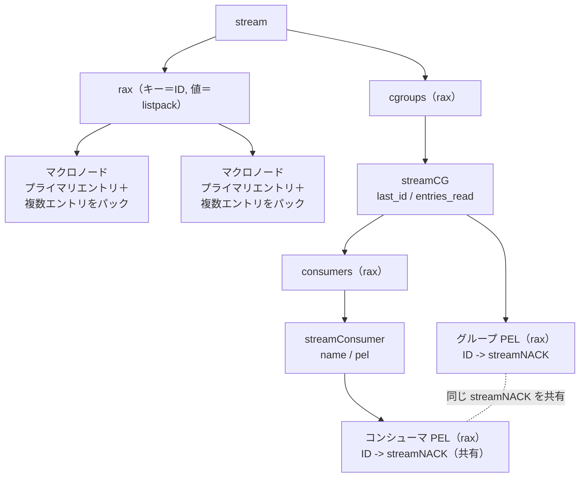

# 第20章 ストリーム型

> **本章で読むソース**
>
> - [`src/stream.h`](https://github.com/valkey-io/valkey/blob/9.1.0/src/stream.h)
> - [`src/t_stream.c`](https://github.com/valkey-io/valkey/blob/9.1.0/src/t_stream.c)

## この章の狙い

ストリーム型は、エントリを追記し続けるログとして振る舞うデータ型である。
本章では、エントリ ID をキーとして rax で索引し、各ノードの値に複数エントリを listpack でまとめて格納する内部表現を読み解く。
共通フィールドと ID の差分を省いて格納する圧縮の機構を実コードで追い、省メモリと走査効率がどこから生まれるかを確かめる。
あわせて、コンシューマグループが未確認エントリ（PEL）をどう管理するかを `streamCG` と `streamNACK` の構造から説明する。

## 前提

- rax の構造と走査は[第11章「rax」](../part01-data-structures/11-rax.md)で扱う。本章は rax をキー索引として使う。
- listpack の内部レイアウトと要素アクセスは[第8章「listpack」](../part01-data-structures/08-listpack.md)で扱う。本章は listpack をエントリの格納先として使う。
- オブジェクトのエンコーディングと `robj` は[第14章「オブジェクトとエンコーディング」](14-object-encoding.md)を参照する。

## ストリームの構造

ストリーム型の実体は `stream` 構造体である。

[`src/stream.h` L16-L24](https://github.com/valkey-io/valkey/blob/9.1.0/src/stream.h#L16-L24)

```c
typedef struct stream {
    rax *cgroups;                  /* Consumer groups dictionary: name -> streamCG */
    rax *rax;                      /* The radix tree holding the stream. */
    uint64_t length;               /* Current number of elements inside this stream. */
    streamID last_id;              /* Zero if there are yet no items. */
    streamID first_id;             /* The first non-tombstone entry, zero if empty. */
    streamID max_deleted_entry_id; /* The maximal ID that was deleted. */
    uint64_t entries_added;        /* All time count of elements added. */
} stream;
```

中心は `rax` フィールドである。
ストリームの全エントリはこの一本の rax に収まる。
rax のキーはエントリ ID であり、値はそのキー以降のエントリをまとめた listpack のポインタである。
`last_id` は最後に採番した ID を保持し、新しいエントリの ID 採番と単調増加の検査に使う。
`cgroups` はコンシューマグループ名から `streamCG` を引くための別の rax で、グループを使うまでは `NULL` のままにして未使用時のメモリを節約する。

`stream` の生成は `streamNew` が行う。

[`src/t_stream.c` L73-L86](https://github.com/valkey-io/valkey/blob/9.1.0/src/t_stream.c#L73-L86)

```c
stream *streamNew(void) {
    stream *s = zmalloc(sizeof(*s));
    s->rax = raxNew();
    s->length = 0;
    s->first_id.ms = 0;
    s->first_id.seq = 0;
    s->last_id.ms = 0;
    s->last_id.seq = 0;
    s->max_deleted_entry_id.seq = 0;
    s->max_deleted_entry_id.ms = 0;
    s->entries_added = 0;
    s->cgroups = NULL; /* Created on demand to save memory when not used. */
    return s;
}
```

エントリ ID は `streamID` で表す。

[`src/stream.h` L11-L14](https://github.com/valkey-io/valkey/blob/9.1.0/src/stream.h#L11-L14)

```c
typedef struct streamID {
    uint64_t ms;  /* Unix time in milliseconds. */
    uint64_t seq; /* Sequence number. */
} streamID;
```

ID はミリ秒単位の時刻 `ms` と連番 `seq` の組で、合わせて128ビットの数になる。
`XADD` で ID を省略すると、`streamNextID` が現在時刻と前回の ID から次の ID を決める。

[`src/t_stream.c` L145-L154](https://github.com/valkey-io/valkey/blob/9.1.0/src/t_stream.c#L145-L154)

```c
void streamNextID(streamID *last_id, streamID *new_id) {
    uint64_t ms = commandTimeSnapshot();
    if (ms > last_id->ms) {
        new_id->ms = ms;
        new_id->seq = 0;
    } else {
        *new_id = *last_id;
        streamIncrID(new_id);
    }
}
```

現在時刻が前回より進んでいればその時刻を使い、連番を0から始める。
進んでいなければ前回の ID の連番を一つ増やす。
時刻が同じミリ秒に複数のエントリが入っても、連番で区別できる。
クロックが巻き戻った場合でも前回の時刻より戻ることはなく、ID は常に単調増加する。

ID を rax のキーにするとき、`ms` と `seq` をそれぞれビッグエンディアンに変換して128ビットの連続したバイト列にする。

[`src/t_stream.c` L358-L363](https://github.com/valkey-io/valkey/blob/9.1.0/src/t_stream.c#L358-L363)

```c
void streamEncodeID(void *buf, streamID *id) {
    uint64_t e[2];
    e[0] = htonu64(id->ms);
    e[1] = htonu64(id->seq);
    memcpy(buf, e, sizeof(e));
}
```

ビッグエンディアンにすると、上位バイトが先に並ぶ。
そのため、バイト列の辞書順比較が ID の数値順の比較に一致する。
rax はキーをバイト列として辞書順に並べるので、この符号化によってエントリは ID 昇順に索引される。

## パッキングと差分エンコード

ストリームの省メモリの核は、複数エントリを一つの listpack にまとめ、共通部分を省いて格納することにある。
rax のノードを ID ごとに一つずつ作るのではなく、ある ID をキーとするノードの値に、その ID から始まる連続したエントリ群をパックする。
このノード単位のまとまりを、コード中では「マクロノード」と呼ぶ。

新しいエントリの追加は `streamAppendItem` が担う。
まず rax の末尾ノード（最後のマクロノード）を引いて、その listpack に追記できるか、新しいノードに切り替えるかを判定する。

[`src/t_stream.c` L529-L548](https://github.com/valkey-io/valkey/blob/9.1.0/src/t_stream.c#L529-L548)

```c
    if (lp != NULL) {
        int new_node = 0;
        size_t node_max_bytes = server.stream_node_max_bytes;
        if (node_max_bytes == 0 || node_max_bytes > STREAM_LISTPACK_MAX_SIZE) node_max_bytes = STREAM_LISTPACK_MAX_SIZE;
        if (lp_bytes + totelelen >= node_max_bytes) {
            new_node = 1;
        } else if (server.stream_node_max_entries) {
            unsigned char *lp_ele = lpFirst(lp);
            /* Count both live entries and deleted ones. */
            int64_t count = lpGetInteger(lp_ele) + lpGetInteger(lpNext(lp, lp_ele));
            if (count >= server.stream_node_max_entries) new_node = 1;
        }

        if (new_node) {
            /* Shrink extra pre-allocated memory */
            lp = lpShrinkToFit(lp);
            if (ri.data != lp) raxInsert(s->rax, ri.key, ri.key_len, lp, NULL);
            lp = NULL;
        }
    }
```

末尾ノードのバイト数が `stream_node_max_bytes` を超えるか、エントリ数が `stream_node_max_entries` に達すると、新しいマクロノードに切り替える。
切り替えのときは `lpShrinkToFit` で確保しすぎたメモリを切り詰めてから rax に書き戻す。

新しいマクロノードを作る場合、listpack の先頭に「プライマリエントリ」を置く。
これは、後続のエントリを圧縮するための参照に使う共通の枠組みである。

[`src/t_stream.c` L551-L577](https://github.com/valkey-io/valkey/blob/9.1.0/src/t_stream.c#L551-L577)

```c
    if (lp == NULL) {
        primary_id = id;
        streamEncodeID(rax_key, &id);
        /* Create the listpack having the primary entry ID and fields.
         * Pre-allocate some bytes when creating listpack to avoid realloc on
         * every XADD. Since listpack.c uses malloc_size, it'll grow in steps,
         * and won't realloc on every XADD.
         * When listpack reaches max number of entries, we'll shrink the
         * allocation to fit the data. */
        size_t prealloc = STREAM_LISTPACK_MAX_PRE_ALLOCATE;
        if (server.stream_node_max_bytes > 0 && server.stream_node_max_bytes < prealloc) {
            prealloc = server.stream_node_max_bytes;
        }
        lp = lpNew(prealloc);
        lp = lpAppendInteger(lp, 1); /* One item, the one we are adding. */
        lp = lpAppendInteger(lp, 0); /* Zero deleted so far. */
        lp = lpAppendInteger(lp, numfields);
        for (int64_t i = 0; i < numfields; i++) {
            sds field = objectGetVal(argv[i * 2]);
            lp = lpAppend(lp, (unsigned char *)field, sdslen(field));
        }
        lp = lpAppendInteger(lp, 0); /* primary entry zero terminator. */
        raxInsert(s->rax, (unsigned char *)&rax_key, sizeof(rax_key), lp, NULL);
        /* The first entry we insert, has obviously the same fields of the
         * primary entry. */
        flags |= STREAM_ITEM_FLAG_SAMEFIELDS;
    } else {
```

プライマリエントリには、有効エントリ数（`count`）、削除済みエントリ数（`deleted`）、フィールド数、そして最初に追加するエントリのフィールド名が並ぶ。
このノードのキーになった ID は、プライマリエントリの ID でもある。
最初のエントリのフィールド名がそのままプライマリエントリの参照になるので、最初のエントリは必ず共通フィールドを持つ扱いになり、`STREAM_ITEM_FLAG_SAMEFIELDS` が立つ。

既存のマクロノードに追記する場合は、追加するエントリのフィールド名がプライマリエントリと一致するかを確かめる。

[`src/t_stream.c` L591-L609](https://github.com/valkey-io/valkey/blob/9.1.0/src/t_stream.c#L591-L609)

```c
        /* Check if the entry we are adding, have the same fields
         * as the primary entry. */
        int64_t primary_fields_count = lpGetInteger(lp_ele);
        lp_ele = lpNext(lp, lp_ele);
        if (numfields == primary_fields_count) {
            int64_t i;
            for (i = 0; i < primary_fields_count; i++) {
                sds field = objectGetVal(argv[i * 2]);
                int64_t e_len;
                unsigned char buf[LP_INTBUF_SIZE];
                unsigned char *e = lpGet(lp_ele, &e_len, buf);
                /* Stop if there is a mismatch. */
                if (sdslen(field) != (size_t)e_len || memcmp(e, field, e_len) != 0) break;
                lp_ele = lpNext(lp, lp_ele);
            }
            /* All fields are the same! We can compress the field names
             * setting a single bit in the flags. */
            if (i == primary_fields_count) flags |= STREAM_ITEM_FLAG_SAMEFIELDS;
        }
```

フィールド数が一致し、すべてのフィールド名が一致したときだけ `STREAM_ITEM_FLAG_SAMEFIELDS` を立てる。
このフラグは、エントリ本体からフィールド名を丸ごと省くための合図になる。

エントリ本体を listpack に追記する箇所が、差分エンコードの中心である。

[`src/t_stream.c` L634-L642](https://github.com/valkey-io/valkey/blob/9.1.0/src/t_stream.c#L634-L642)

```c
    lp = lpAppendInteger(lp, flags);
    lp = lpAppendInteger(lp, id.ms - primary_id.ms);
    lp = lpAppendInteger(lp, id.seq - primary_id.seq);
    if (!(flags & STREAM_ITEM_FLAG_SAMEFIELDS)) lp = lpAppendInteger(lp, numfields);
    for (int64_t i = 0; i < numfields; i++) {
        sds field = objectGetVal(argv[i * 2]), value = objectGetVal(argv[i * 2 + 1]);
        if (!(flags & STREAM_ITEM_FLAG_SAMEFIELDS)) lp = lpAppend(lp, (unsigned char *)field, sdslen(field));
        lp = lpAppend(lp, (unsigned char *)value, sdslen(value));
    }
```

ID はそのまま格納せず、プライマリエントリの ID との差分（`id.ms - primary_id.ms` と `id.seq - primary_id.seq`）として格納する。
同じマクロノードのエントリは時刻が近いので、差分は小さな整数になりやすい。
listpack は小さな整数をコンパクトに符号化するので、ID のための領域が縮む。
さらに `STREAM_ITEM_FLAG_SAMEFIELDS` が立っているときは、フィールド数とフィールド名を一切書かず、値だけを並べる。
フィールド名が共通する典型的な時系列データでは、二つ目以降のエントリからフィールド名が消える。

末尾には `lp-count` を置く。

[`src/t_stream.c` L643-L651](https://github.com/valkey-io/valkey/blob/9.1.0/src/t_stream.c#L643-L651)

```c
    /* Compute and store the lp-count field. */
    int64_t lp_count = numfields;
    lp_count += 3; /* Add the 3 fixed fields flags + ms-diff + seq-diff. */
    if (!(flags & STREAM_ITEM_FLAG_SAMEFIELDS)) {
        /* If the item is not compressed, it also has the fields other than
         * the values, and an additional num-fields field. */
        lp_count += numfields + 1;
    }
    lp = lpAppendInteger(lp, lp_count);
```

`lp-count` はそのエントリが listpack 上で何個の要素から成るかを表す。
逆方向の走査では、listpack の末尾からこの数だけ戻ればエントリの先頭（`flags` 要素）に着く。
この一つの整数があるおかげで、可変長のエントリを後ろから前へ正しくたどれる。

エントリ本体のレイアウトを図にすると次のようになる。

```text
通常のエントリ:
+-----+--------+----------+-------+-------+-/-+-------+-------+--------+
|flags|entry-id|num-fields|field-1|value-1|...|field-N|value-N|lp-count|
+-----+--------+----------+-------+-------+-/-+-------+-------+--------+

SAMEFIELDS フラグが立つエントリ（フィールド名と num-fields を省く）:
+-----+--------+-------+-/-+-------+--------+
|flags|entry-id|value-1|...|value-N|lp-count|
+-----+--------+-------+-/-+-------+--------+
```

`entry-id` はプライマリエントリとの ms 差と seq 差の二要素である。

### 速くて省メモリな理由

ストリームは、ID ごとに rax のノードを一つ作るのではなく、近い ID のエントリを一つの listpack にまとめる。
これによって rax のノード数とポインタの数が大幅に減り、索引のメモリ消費とキャッシュミスが抑えられる。
さらに、まとめた listpack の中では ID を差分として、共通フィールドのフィールド名を省いて格納する。
時系列データのように ID が連続しフィールド構成が一定の場合、エントリ一個あたりの実バイト数は ID の差分と値だけに近づく。

## ID と範囲走査

エントリの読み出しは、rax と listpack の二段構造を隠す `streamIterator` を通して行う。
範囲走査の起点は `streamIteratorStart` で、開始 ID から目的のマクロノードへ rax をシークする。

[`src/t_stream.c` L1060-L1071](https://github.com/valkey-io/valkey/blob/9.1.0/src/t_stream.c#L1060-L1071)

```c
    /* Seek the correct node in the radix tree. */
    raxStart(&si->ri, s->rax);
    if (!rev) {
        if (start && (start->ms || start->seq)) {
            uint64_t start_key[2];
            start_key[0] = htonu64(start->ms);
            start_key[1] = htonu64(start->seq);
            raxSeek(&si->ri, "<=", (unsigned char *)start_key, sizeof(start_key));
            if (raxEOF(&si->ri)) raxSeek(&si->ri, "^", NULL, 0);
        } else {
            raxSeek(&si->ri, "^", NULL, 0);
        }
    } else {
```

開始 ID に対しては `<=` でシークする。
目的のエントリは、その ID 以下をキーに持つマクロノードの listpack の中にあるからである。
ノードのキーはそのノードに入る最小の ID（プライマリエントリの ID）なので、開始 ID 以下で最大のキーを選べば取りこぼさない。

ノードを決めたあと、`streamIteratorGetID` が listpack を一エントリずつ進めて、差分から ID を復元する。

[`src/t_stream.c` L1160-L1180](https://github.com/valkey-io/valkey/blob/9.1.0/src/t_stream.c#L1160-L1180)

```c
            /* Get the flags entry. */
            si->lp_flags = si->lp_ele;
            int64_t flags = lpGetInteger(si->lp_ele);
            si->lp_ele = lpNext(si->lp, si->lp_ele); /* Seek ID. */

            /* Get the ID: it is encoded as difference between the primary
             * ID and this entry ID. */
            *id = si->primary_id;
            id->ms += lpGetInteger(si->lp_ele);
            si->lp_ele = lpNext(si->lp, si->lp_ele);
            id->seq += lpGetInteger(si->lp_ele);
            si->lp_ele = lpNext(si->lp, si->lp_ele);

            /* The number of entries is here or not depending on the
             * flags. */
            if (flags & STREAM_ITEM_FLAG_SAMEFIELDS) {
                *numfields = si->primary_fields_count;
            } else {
                *numfields = lpGetInteger(si->lp_ele);
                si->lp_ele = lpNext(si->lp, si->lp_ele);
            }
```

復元は、プライマリエントリの ID に格納された差分を足すだけである。
`SAMEFIELDS` が立つエントリでは、フィールド数をプライマリエントリの値から取り、本体にはフィールド名が無いものとして扱う。
フィールドと値の取り出しは `streamIteratorGetField` が行い、`SAMEFIELDS` のときはフィールド名をプライマリエントリ側から、値だけを本体側から読む。

[`src/t_stream.c` L1235-L1244](https://github.com/valkey-io/valkey/blob/9.1.0/src/t_stream.c#L1235-L1244)

```c
    if (si->entry_flags & STREAM_ITEM_FLAG_SAMEFIELDS) {
        *fieldptr = lpGet(si->primary_fields_ptr, fieldlen, si->field_buf);
        si->primary_fields_ptr = lpNext(si->lp, si->primary_fields_ptr);
    } else {
        *fieldptr = lpGet(si->lp_ele, fieldlen, si->field_buf);
        si->lp_ele = lpNext(si->lp, si->lp_ele);
    }
    *valueptr = lpGet(si->lp_ele, valuelen, si->value_buf);
    si->lp_ele = lpNext(si->lp, si->lp_ele);
}
```

`XADD` はこの追記機構を、`XRANGE` と `XREVRANGE` は範囲走査を、`XREAD` は最後に読んだ ID より後ろのエントリ取得を、それぞれこのイテレータの上に実装している。
`XRANGE` の本体 `xrangeGenericCommand` は、開始 ID と終了 ID を解析したあと `streamReplyWithRange` を呼ぶだけである。

[`src/t_stream.c` L2133-L2143](https://github.com/valkey-io/valkey/blob/9.1.0/src/t_stream.c#L2133-L2143)

```c
    /* Return the specified range to the user. */
    if ((o = lookupKeyReadOrReply(c, c->argv[1], shared.emptyarray)) == NULL || checkType(c, o, OBJ_STREAM)) return;

    s = objectGetVal(o);

    if (count == 0) {
        addReplyNullArray(c);
    } else {
        if (count == -1) count = 0;
        streamReplyWithRange(c, s, &startid, &endid, count, rev, NULL, NULL, 0, NULL);
    }
```

## コンシューマグループ

コンシューマグループは、一つのストリームを複数のコンシューマで分担して読むための仕組みである。
グループは `streamCG` で表す。

[`src/stream.h` L55-L73](https://github.com/valkey-io/valkey/blob/9.1.0/src/stream.h#L55-L73)

```c
typedef struct streamCG {
    streamID last_id;       /* Last delivered (not acknowledged) ID for this
                               group. Consumers that will just ask for more
                               messages will served with IDs > than this. */
    long long entries_read; /* In a perfect world (CG starts at 0-0, no dels, no
                               XGROUP SETID, ...), this is the total number of
                               group reads. In the real world, the reasoning behind
                               this value is detailed at the top comment of
                               streamEstimateDistanceFromFirstEverEntry(). */
    rax *pel;               /* Pending entries list. This is a radix tree that
                               has every message delivered to consumers (without
                               the NOACK option) that was yet not acknowledged
                               as processed. The key of the radix tree is the
                               ID as a 64 bit big endian number, while the
                               associated value is a streamNACK structure.*/
    rax *consumers;         /* A radix tree representing the consumers by name
                               and their associated representation in the form
                               of streamConsumer structures. */
} streamCG;
```

`last_id` はグループに対して最後に配信した ID である。
コンシューマが新しいメッセージ（`>` の ID）を求めると、この ID より大きいエントリが配信される。
`pel`（Pending Entries List）は、配信済みでまだ確認応答されていないメッセージの rax である。
キーはビッグエンディアンの ID、値は `streamNACK` で、誰にいつ何回配信したかを保持する。
`consumers` はグループ内のコンシューマを名前で引く rax である。

コンシューマは `streamConsumer` で表し、自分に配信された未確認メッセージの PEL を別に持つ。

[`src/stream.h` L76-L89](https://github.com/valkey-io/valkey/blob/9.1.0/src/stream.h#L76-L89)

```c
typedef struct streamConsumer {
    mstime_t seen_time;   /* Last time this consumer tried to perform an action (attempted reading/claiming). */
    mstime_t active_time; /* Last time this consumer was active (successful reading/claiming). */
    sds name;             /* Consumer name. This is how the consumer
                             will be identified in the consumer group
                             protocol. Case sensitive. */
    rax *pel;             /* Consumer specific pending entries list: all
                             the pending messages delivered to this
                             consumer not yet acknowledged. Keys are
                             big endian message IDs, while values are
                             the same streamNACK structure referenced
                             in the "pel" of the consumer group structure
                             itself, so the value is shared. */
} streamConsumer;
```

コンシューマの `pel` の値は、グループの `pel` と同じ `streamNACK` を指す。
同じ未確認メッセージをグループ側とコンシューマ側の二つの rax から引けるようにしつつ、実体は一つに共有する。

未確認メッセージ一件は `streamNACK` で表す。

[`src/stream.h` L92-L97](https://github.com/valkey-io/valkey/blob/9.1.0/src/stream.h#L92-L97)

```c
typedef struct streamNACK {
    mstime_t delivery_time;   /* Last time this message was delivered. */
    uint64_t delivery_count;  /* Number of times this message was delivered.*/
    streamConsumer *consumer; /* The consumer this message was delivered to
                                 in the last delivery. */
} streamNACK;
```

`delivery_time` は最後に配信した時刻、`delivery_count` は配信回数、`consumer` は最後に配信したコンシューマである。
処理が滞ったメッセージを別のコンシューマに引き取らせる `XCLAIM` は、この配信時刻と回数を手がかりにする。

グループは `XGROUP CREATE` で作る。
`streamCreateCG` がグループ名から `streamCG` を新設し、その時点の `last_id` と空の PEL、空のコンシューマ集合で初期化する。

[`src/t_stream.c` L2489-L2500](https://github.com/valkey-io/valkey/blob/9.1.0/src/t_stream.c#L2489-L2500)

```c
streamCG *streamCreateCG(stream *s, char *name, size_t namelen, streamID *id, long long entries_read) {
    if (s->cgroups == NULL) s->cgroups = raxNew();
    if (raxFind(s->cgroups, (unsigned char *)name, namelen, NULL)) return NULL;

    streamCG *cg = zmalloc(sizeof(*cg));
    cg->pel = raxNew();
    cg->consumers = raxNew();
    cg->last_id = *id;
    cg->entries_read = entries_read;
    raxInsert(s->cgroups, (unsigned char *)name, namelen, cg, NULL);
    return cg;
}
```

### 配信と未確認エントリ

`XREADGROUP` で新しいメッセージを読むと、配信したエントリが PEL に登録される。
この処理は `streamReplyWithRange` の中で行われる。

[`src/t_stream.c` L1745-L1774](https://github.com/valkey-io/valkey/blob/9.1.0/src/t_stream.c#L1745-L1774)

```c
        if (group && !noack) {
            unsigned char buf[sizeof(streamID)];
            streamEncodeID(buf, &id);

            /* Try to add a new NACK. Most of the time this will work and
             * will not require extra lookups. We'll fix the problem later
             * if we find that there is already a entry for this ID. */
            streamNACK *nack = streamCreateNACK(consumer);
            int group_inserted = raxTryInsert(group->pel, buf, sizeof(buf), nack, NULL);
            int consumer_inserted = raxTryInsert(consumer->pel, buf, sizeof(buf), nack, NULL);

            /* Now we can check if the entry was already busy, and
             * in that case reassign the entry to the new consumer,
             * or update it if the consumer is the same as before. */
            if (group_inserted == 0) {
                streamFreeNACK(nack);
                void *result;
                int found = raxFind(group->pel, buf, sizeof(buf), &result);
                serverAssert(found);
                nack = result;
                raxRemove(nack->consumer->pel, buf, sizeof(buf), NULL);
                /* Update the consumer and NACK metadata. */
                nack->consumer = consumer;
                nack->delivery_time = commandTimeSnapshot();
                nack->delivery_count = 1;
                /* Add the entry in the new consumer local PEL. */
                raxInsert(consumer->pel, buf, sizeof(buf), nack, NULL);
            } else if (group_inserted == 1 && consumer_inserted == 0) {
                serverPanic("NACK half-created. Should not be possible.");
            }
```

新しい `streamNACK` を作り、グループの PEL とコンシューマの PEL の両方に同じポインタで `raxTryInsert` する。
通常はどちらにも新規挿入され、追加の探索は要らない。
グループ側にすでに同じ ID があった場合（`group_inserted == 0`）は、`XGROUP SETID` などで配信位置が巻き戻されて再配信になった場合である。
このときは作った NACK を捨て、既存の NACK を別のコンシューマの PEL から外して、新しいコンシューマに付け替える。

配信に先立って、グループの `last_id` を進めるのも `streamReplyWithRange` である。

[`src/t_stream.c` L1698-L1711](https://github.com/valkey-io/valkey/blob/9.1.0/src/t_stream.c#L1698-L1711)

```c
    while (streamIteratorGetID(&si, &id, &numfields)) {
        /* Update the group last_id if needed. */
        if (group && streamCompareID(&id, &group->last_id) > 0) {
            if (group->entries_read != SCG_INVALID_ENTRIES_READ &&
                streamCompareID(&group->last_id, &s->first_id) >= 0 &&
                !streamRangeHasTombstones(s, &group->last_id, NULL)) {
                /* A valid counter and no tombstones in the group's last-delivered-id and the stream's last-generated-id,
                 * we can increment the read counter to keep tracking the group's progress. */
                group->entries_read++;
            } else if (s->entries_added) {
                /* The group's counter may be invalid, so we try to obtain it. */
                group->entries_read = streamEstimateDistanceFromFirstEverEntry(s, &id);
            }
            group->last_id = id;
```

配信した ID がグループの `last_id` を超えるたびに `last_id` を更新する。
これによって、次に `>` で読むコンシューマには、まだ誰にも配信していないエントリだけが渡る。

`XREADGROUP` の起点で `>` 以外の ID（多くは `0`）を指定すると、新しいメッセージではなく自分の未確認履歴を読む。
このとき読み出しは PEL だけを見る別経路に分岐する。

[`src/t_stream.c` L1685-L1692](https://github.com/valkey-io/valkey/blob/9.1.0/src/t_stream.c#L1685-L1692)

```c
    /* If the client is asking for some history, we serve it using a
     * different function, so that we return entries *solely* from its
     * own PEL. This ensures each consumer will always and only see
     * the history of messages delivered to it and not yet confirmed
     * as delivered. */
    if (group && (flags & STREAM_RWR_HISTORY)) {
        return streamReplyWithRangeFromConsumerPEL(c, s, start, end, count, consumer);
    }
```

履歴の読み出しは自分の PEL のキー（未確認メッセージの ID）を列挙し、その ID で本体を引き直す。
各コンシューマは自分に配信されて未確認のメッセージだけを履歴として見る。

### 確認応答による削除

`XACK` は、処理を終えたメッセージを PEL から取り除く。

[`src/t_stream.c` L2844-L2861](https://github.com/valkey-io/valkey/blob/9.1.0/src/t_stream.c#L2844-L2861)

```c
    int acknowledged = 0;
    for (int j = 3; j < c->argc; j++) {
        unsigned char buf[sizeof(streamID)];
        streamEncodeID(buf, &ids[j - 3]);

        /* Lookup the ID in the group PEL: it will have a reference to the
         * NACK structure that will have a reference to the consumer, so that
         * we are able to remove the entry from both PELs. */
        void *result;
        if (raxFind(group->pel, buf, sizeof(buf), &result)) {
            streamNACK *nack = result;
            raxRemove(group->pel, buf, sizeof(buf), NULL);
            raxRemove(nack->consumer->pel, buf, sizeof(buf), NULL);
            streamFreeNACK(nack);
            acknowledged++;
            server.dirty++;
        }
    }
```

ID をグループの PEL で引くと `streamNACK` が得られ、そこから配信先コンシューマもたどれる。
そのため、グループ側とコンシューマ側の二つの PEL から同じエントリを外し、共有していた `streamNACK` を一度だけ解放できる。
確認応答されたメッセージは、どちらの PEL からも消える。

### ストリームとコンシューマグループの関係

ここまでの構造を図にまとめる。



未確認メッセージは、グループの PEL とコンシューマの PEL の二つから引けて、実体の `streamNACK` は共有される。
`XACK` はこの二つの参照を同時に外す。

## まとめ

- ストリームの本体は一本の rax で、キーはエントリ ID をビッグエンディアン128ビットにした値、値は複数エントリをまとめた listpack（マクロノード）である。
- マクロノードの先頭にプライマリエントリを置き、後続エントリの ID はプライマリ ID との差分で、共通フィールドは `SAMEFIELDS` フラグで省いて格納する。これがストリームの省メモリの核である。
- `streamIterator` が rax と listpack の二段構造を隠し、差分から ID を復元しながら範囲を走査する。`XADD`、`XRANGE`、`XREAD` はこの上に立つ。
- コンシューマグループは `streamCG`（`last_id` と PEL）、`streamConsumer`、`streamNACK` で構成され、配信済み未確認メッセージを PEL で管理する。
- グループ PEL とコンシューマ PEL は同じ `streamNACK` を共有し、`XACK` は両方から同時に外す。

## 関連する章

- [第8章「listpack」](../part01-data-structures/08-listpack.md)：マクロノードの中身を成すコンパクトな格納形式。
- [第11章「rax」](../part01-data-structures/11-rax.md)：ストリーム本体とコンシューマグループの索引に使う基数木。
- [第14章「オブジェクトとエンコーディング」](14-object-encoding.md)：ストリームを包む `robj` とエンコーディングの扱い。
