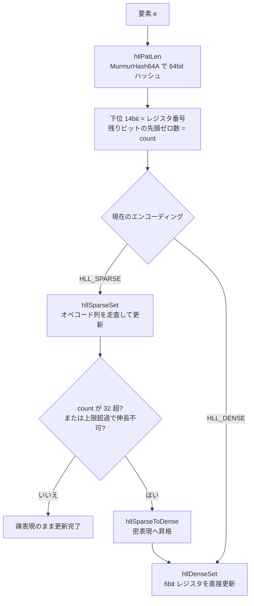

# 第21章 HyperLogLog

> **本章で読むソース**
>
> - [`src/hyperloglog.c`](https://github.com/valkey-io/valkey/blob/9.1.0/src/hyperloglog.c)

## この章の狙い

膨大な要素のユニーク数（基数）を、要素そのものを保持せずにわずかなメモリで推定する仕組みを理解する。
レジスタ群への振り分け、疎表現と密表現の使い分け、推定の計算、そして `PFADD`/`PFCOUNT`/`PFMERGE` がそれらをどう駆動するかを、実コードに沿って読み解く。

## 前提

文字列オブジェクトの格納形式とエンコーディングは[第15章](../part03-objects-types/15-t-string.md)を先に読むとよい。
HyperLogLog はそこで扱う通常の文字列オブジェクトとして格納されるため、専用の型を持たない。

## HyperLogLog が解く問題

ある集合に何種類の要素が現れたかを数えたい。
素朴にやるなら全要素を集合に入れて重複を除くが、要素数に比例したメモリが必要になる。
**HyperLogLog**は要素を一切保持せず、ハッシュ値の統計的な性質だけから基数を確率的に推定する。
このため、何億もの要素を数えても消費メモリは固定で、誤差は数パーセントに収まる。

実装の方針は、ファイルの冒頭コメントに簡潔にまとめられている。

[`src/hyperloglog.c` L54-L65](https://github.com/valkey-io/valkey/blob/9.1.0/src/hyperloglog.c#L54-L65)

```c
/* The HyperLogLog implementation is based on the following ideas:
 *
 * * The use of a 64 bit hash function as proposed in [1], in order to estimate
 *   cardinalities larger than 10^9, at the cost of just 1 additional bit per
 *   register.
 * * The use of 16384 6-bit registers for a great level of accuracy, using
 *   a total of 12k per key.
 * * The use of the string data type. No new type is introduced.
 * * No attempt is made to compress the data structure as in [1]. Also the
 *   algorithm used is the original HyperLogLog Algorithm as in [2], with
 *   the only difference that a 64 bit hash function is used, so no correction
 *   is performed for values near 2^32 as in [1].
```

コメントによれば、レジスタは16384個、各6ビットで、密に持っても1キーあたり12KB に収まる。
64ビットハッシュを使うことで10億を超える基数も扱え、新しい型は導入せず文字列型に載せる。

## ハッシュからレジスタと先頭ゼロ数へ

推定の素材は、要素のハッシュ値だけである。
`hllPatLen` は要素を64ビットハッシュにかけ、ハッシュの下位ビットでレジスタ番号を、残りのビットで先頭ゼロの並びの長さを求める。

[`src/hyperloglog.c` L493-L513](https://github.com/valkey-io/valkey/blob/9.1.0/src/hyperloglog.c#L493-L513)

```c
int hllPatLen(unsigned char *ele, size_t elesize, long *regp) {
    uint64_t hash, index;
    int count;
    /* ... (中略：先頭ゼロ数の数え方の説明) ... */
    hash = MurmurHash64A(ele, elesize, 0xadc83b19ULL);
    index = hash & HLL_P_MASK;      /* Register index. */
    hash >>= HLL_P;                 /* Remove bits used to address the register. */
    hash |= ((uint64_t)1 << HLL_Q); /* Make sure count will be <= Q+1. */
    count = 1;                      /* Initialized to 1 since we count the "00000...1" pattern. */
    count += builtin_ctzll(hash);
    *regp = (int)index;
    return count;
}
```

レジスタ番号は `hash & HLL_P_MASK` で求める。
`HLL_P` は14、`HLL_P_MASK` は `HLL_REGISTERS - 1` すなわち下位14ビットのマスクなので、ハッシュ下位14ビットがそのまま16384個のレジスタのどれかを指す。

[`src/hyperloglog.c` L211-L217](https://github.com/valkey-io/valkey/blob/9.1.0/src/hyperloglog.c#L211-L217)

```c
#define HLL_P 14                       /* The greater is P, the smaller the error. */
#define HLL_Q (64 - HLL_P)             /* The number of bits of the hash value used for \
                                          determining the number of leading zeros. */
#define HLL_REGISTERS (1 << HLL_P)     /* With P=14, 16384 registers. */
#define HLL_P_MASK (HLL_REGISTERS - 1) /* Mask to index register. */
#define HLL_BITS 6                     /* Enough to count up to 63 leading zeroes. */
#define HLL_REGISTER_MAX ((1 << HLL_BITS) - 1)
```

残りの50ビット（`HLL_Q` ビット）について、最下位から続くゼロの個数に1を足した値を数える。
コメントによれば、末尾の「1」を含めて数えるため最小値は1であり、`builtin_ctzll`（末尾ゼロのカウント）で求めた値に1を加える。
`hash |= ((uint64_t)1 << HLL_Q)` で番兵ビットを立てているのは、上位ビットがすべてゼロでも数え過ぎないようにし、結果を `HLL_Q + 1` 以下に収めるためである。

各レジスタには、そのレジスタに割り当たった要素群が出した先頭ゼロ数の最大値だけを記録する。
直感的には、先頭ゼロが多い値ほど出現が稀なので、稀な値が観測されたレジスタほど多くの異なる要素を見たと考えられる。
基数の推定は、全レジスタの値の調和平均から行う。

## 文字列に載せるヘッダ

HyperLogLog は専用の型を持たず、16バイトのヘッダに続けてレジスタ列を並べた文字列として格納される。

[`src/hyperloglog.c` L199-L209](https://github.com/valkey-io/valkey/blob/9.1.0/src/hyperloglog.c#L199-L209)

```c
struct hllhdr {
    char magic[4];       /* "HYLL" */
    uint8_t encoding;    /* HLL_DENSE or HLL_SPARSE. */
    uint8_t notused[3];  /* Reserved for future use, must be zero. */
    uint8_t card[8];     /* Cached cardinality, little endian. */
    uint8_t registers[]; /* Data bytes. */
};

/* The cached cardinality MSB is used to signal validity of the cached value. */
#define HLL_INVALIDATE_CACHE(hdr) (hdr)->card[7] |= (1 << 7)
#define HLL_VALID_CACHE(hdr) (((hdr)->card[7] & (1 << 7)) == 0)
```

先頭4バイトは識別子の `"HYLL"` で、`encoding` が `HLL_DENSE` か `HLL_SPARSE` のどちらの表現かを示す。
`card` はリトルエンディアンで格納したキャッシュ済み基数で、その役割は本章末で扱う。
`registers` 以降に表現本体が続く。

`isHLLObjectOrReply` は、キーが文字列であること、ヘッダ長を満たすこと、識別子が `"HYLL"` であること、エンコーディング値が妥当であること、密表現なら長さが厳密に `HLL_DENSE_SIZE` であることを確認する。
HyperLogLog はあくまで文字列なので、利用者が任意の文字列を書き込める。
不正な内容で誤動作しないように、コマンドの入口で形式を検査する。

## 密表現：固定6ビットのレジスタ列

**密表現**は16384個のレジスタを6ビットずつ詰めた配列である。
6ビット境界はバイト境界と一致しないため、レジスタの読み書きは隣り合う2バイトをまたぐビット演算になる。
この処理は基数推定で全レジスタを走査する際の最内ループに当たるため、分岐を避けたマクロとして書かれている。

[`src/hyperloglog.c` L376-L400](https://github.com/valkey-io/valkey/blob/9.1.0/src/hyperloglog.c#L376-L400)

```c
#define HLL_DENSE_GET_REGISTER(target, p, regnum)                 \
    do {                                                          \
        uint8_t *_p = (uint8_t *)p;                               \
        unsigned long _byte = regnum * HLL_BITS / 8;              \
        unsigned long _fb = regnum * HLL_BITS & 7;                \
        unsigned long _fb8 = 8 - _fb;                             \
        unsigned long b0 = _p[_byte];                             \
        unsigned long b1 = _p[_byte + 1];                         \
        target = ((b0 >> _fb) | (b1 << _fb8)) & HLL_REGISTER_MAX; \
    } while (0)

#define HLL_DENSE_SET_REGISTER(p, regnum, val)         \
    do {                                               \
        uint8_t *_p = (uint8_t *)p;                    \
        unsigned long _byte = (regnum) * HLL_BITS / 8; \
        unsigned long _fb = (regnum) * HLL_BITS & 7;   \
        unsigned long _fb8 = 8 - _fb;                  \
        unsigned long _v = (val);                      \
        _p[_byte] &= ~(HLL_REGISTER_MAX << _fb);       \
        _p[_byte] |= _v << _fb;                        \
        _p[_byte + 1] &= ~(HLL_REGISTER_MAX >> _fb8);  \
        _p[_byte + 1] |= _v >> _fb8;                   \
    } while (0)
```

`_byte` が対象レジスタの始まるバイト、`_fb` がそのバイト内のビット位置である。
取得では2バイトを連結して6ビットを切り出し、設定では対象6ビットをいったんクリアしてから値を書き込む。
最後のレジスタを操作すると配列外の1バイトに触れるが、SDS 文字列は末尾に暗黙のヌル終端を持つためそのバイトは必ず存在し、境界チェックの分岐を省ける。

要素の追加は `hllDenseSet` が担う。
現在値より大きい先頭ゼロ数を観測したときだけレジスタを更新し、更新したかどうかを返す。

[`src/hyperloglog.c` L527-L537](https://github.com/valkey-io/valkey/blob/9.1.0/src/hyperloglog.c#L527-L537)

```c
int hllDenseSet(uint8_t *registers, long index, uint8_t count) {
    uint8_t oldcount;

    HLL_DENSE_GET_REGISTER(oldcount, registers, index);
    if (count > oldcount) {
        HLL_DENSE_SET_REGISTER(registers, index, count);
        return 1;
    } else {
        return 0;
    }
}
```

レジスタが最大値だけを保つこの更新規則によって、同じ要素を何度追加しても結果は変わらず、追加の順序にも依存しない。

## 疎表現：ゼロが続く区間を畳む

基数が小さいうちは、ほとんどのレジスタがゼロのままである。
16384個を6ビットずつ固定で持つと、値を入れていないレジスタにも常に12KB を費やす。
**疎表現**は、連続するゼロや同じ値の連続をランレングス符号でまとめ、非ゼロのレジスタだけを表現することでメモリを節約する。

符号は3種類のオペコードからなる。

[`src/hyperloglog.c` L117-L146](https://github.com/valkey-io/valkey/blob/9.1.0/src/hyperloglog.c#L117-L146)

```c
 * Sparse representation
 * ===
 *
 * The sparse representation encodes registers using a run length
 * encoding composed of three opcodes, two using one byte, and one using
 * of two bytes. The opcodes are called ZERO, XZERO and VAL.
 *
 * ZERO opcode is represented as 00xxxxxx. The 6-bit integer represented
 * by the six bits 'xxxxxx', plus 1, means that there are N registers set
 * to 0. This opcode can represent from 1 to 64 contiguous registers set
 * to the value of 0.
 *
 * XZERO opcode is represented by two bytes 01xxxxxx yyyyyyyy. The 14-bit
 * integer represented by the bits 'xxxxxx' as most significant bits and
 * 'yyyyyyyy' as least significant bits, plus 1, means that there are N
 * registers set to 0. This opcode can represent from 0 to 16384 contiguous
 * registers set to the value of 0.
 *
 * VAL opcode is represented as 1vvvvvxx. It contains a 5-bit integer
 * representing the value of a register, and a 2-bit integer representing
 * the number of contiguous registers set to that value 'vvvvv'.
 * To obtain the value and run length, the integers vvvvv and xx must be
 * incremented by one. This opcode can represent values from 1 to 32,
 * repeated from 1 to 4 times.
```

コメントによれば、`ZERO` は1バイトで最大64個、`XZERO` は2バイトで最大16384個の連続するゼロを表す。
`VAL` は1バイトで、1から32までの値が1から4回連続する区間を表す。
空の HyperLogLog は `XZERO:16384` というたった2バイトのオペコードで表現できる。

`createHLLObject` は、新規キーをこの疎表現で作る。
全レジスタ分のゼロを `XZERO` オペコードで埋め、エンコーディングを `HLL_SPARSE` に設定する。

[`src/hyperloglog.c` L1603-L1631](https://github.com/valkey-io/valkey/blob/9.1.0/src/hyperloglog.c#L1603-L1631)

```c
robj *createHLLObject(void) {
    /* ... (中略) ... */
    /* Populate the sparse representation with as many XZERO opcodes as
     * needed to represent all the registers. */
    aux = HLL_REGISTERS;
    s = sdsnewlen(NULL, sparselen);
    p = (uint8_t *)s + HLL_HDR_SIZE;
    while (aux) {
        int xzero = HLL_SPARSE_XZERO_MAX_LEN;
        if (xzero > aux) xzero = aux;
        HLL_SPARSE_XZERO_SET(p, xzero);
        p += 2;
        aux -= xzero;
    }
    /* ... (中略) ... */
    o = createObject(OBJ_STRING, s);
    hdr = objectGetVal(o);
    memcpy(hdr->magic, "HYLL", 4);
    hdr->encoding = HLL_SPARSE;
    return o;
}
```

疎表現への要素追加は `hllSparseSet` が担う。
オペコード列を先頭から走査し、対象レジスタを含むオペコードを見つけて、その場でゼロ区間を分割したり `VAL` を書き換えたりする。
この更新ではオペコードが増えて文字列が伸びることがあるため、必要に応じて文字列領域を広げる。
最悪のケースでは `XZERO` が `XZERO`-`VAL`-`XZERO` の3オペコードに分裂し、最大3バイト伸びる。

[`src/hyperloglog.c` L709-L725](https://github.com/valkey-io/valkey/blob/9.1.0/src/hyperloglog.c#L709-L725)

```c
    /* When updating a sparse representation, sometimes we may need to enlarge the
     * buffer for up to 3 bytes in the worst case (XZERO split into XZERO-VAL-XZERO),
     * and the following code does the enlarge job.
     * Actually, we use a greedy strategy, enlarge more than 3 bytes to avoid the need
     * for future reallocates on incremental growth. But we do not allocate more than
     * 'server.hll_sparse_max_bytes' bytes for the sparse representation.
     * If the available size of hyperloglog sds string is not enough for the increment
     * we need, we promote the hyperloglog to dense representation in 'step 3'.
     */
    if (sdsalloc(objectGetVal(o)) < server.hll_sparse_max_bytes && sdsavail(objectGetVal(o)) < 3) {
        size_t newlen = sdslen(objectGetVal(o)) + 3;
        newlen +=
            min(newlen,
                300); /* Greediness: double 'newlen' if it is smaller than 300, or add 300 to it when it exceeds 300 */
        if (newlen > server.hll_sparse_max_bytes) newlen = server.hll_sparse_max_bytes;
        objectSetVal(o, sdsResize(objectGetVal(o), newlen, 1));
    }
```

伸長は3バイトずつではなく、貪欲に多めに確保する。
増分のたびに再確保するのを避ける狙いだが、`server.hll_sparse_max_bytes` を超えては確保しない。
この上限は `hll-sparse-max-bytes` 設定で与えられ、既定値は3000バイトである。

## 疎から密への昇格

疎表現は省メモリだが、走査と分割を伴うため密表現よりアクセスが遅い。
基数が増えると非ゼロのレジスタが増え、オペコード列が膨らんで疎表現の利点が消える。
そこで、ある条件を満たすと疎表現を密表現へ**昇格**させる。

昇格の引き金は2つある。
ひとつは、`VAL` オペコードが表せる32を超える値を書き込もうとしたとき。
もうひとつは、文字列が `hll-sparse-max-bytes` を超えて伸びようとしたときである。
`hllSparseSet` は前者を入口で検査し、`promote` ラベルへ飛ぶ。

[`src/hyperloglog.c` L705-L707](https://github.com/valkey-io/valkey/blob/9.1.0/src/hyperloglog.c#L705-L707)

```c
    /* If the count is too big to be representable by the sparse representation
     * switch to dense representation. */
    if (count > HLL_SPARSE_VAL_MAX_VALUE) goto promote;
```

[`src/hyperloglog.c` L937-L951](https://github.com/valkey-io/valkey/blob/9.1.0/src/hyperloglog.c#L937-L951)

```c
promote:                                         /* Promote to dense representation. */
    if (hllSparseToDense(o) == C_ERR) return -1; /* Corrupted HLL. */
    hdr = objectGetVal(o);

    /* We need to call hllDenseAdd() to perform the operation after the
     * conversion. However the result must be 1, since if we need to
     * convert from sparse to dense a register requires to be updated.
     *
     * Note that this in turn means that PFADD will make sure the command
     * is propagated to replicas / AOF, so if there is a sparse -> dense
     * conversion, it will be performed in all the replicas as well. */
    int dense_retval = hllDenseSet(hdr->registers, index, count);
    serverAssert(dense_retval == 1);
    return dense_retval;
```

実際の変換は `hllSparseToDense` が行う。
密表現サイズのゼロ埋め文字列を作り、ヘッダの識別子とキャッシュをコピーしてエンコーディングを `HLL_DENSE` に変える。
そのうえで疎表現のオペコードを順に読み、`VAL` の区間だけを密表現のレジスタに書き戻す。

[`src/hyperloglog.c` L628-L669](https://github.com/valkey-io/valkey/blob/9.1.0/src/hyperloglog.c#L628-L669)

```c
    /* Create a string of the right size filled with zero bytes.
     * Note that the cached cardinality is set to 0 as a side effect
     * that is exactly the cardinality of an empty HLL. */
    dense = sdsnewlen(NULL, HLL_DENSE_SIZE);
    hdr = (struct hllhdr *)dense;
    *hdr = *oldhdr; /* This will copy the magic and cached cardinality. */
    hdr->encoding = HLL_DENSE;

    /* Now read the sparse representation and set non-zero registers
     * accordingly. */
    p += HLL_HDR_SIZE;
    while (p < end) {
        if (HLL_SPARSE_IS_ZERO(p)) {
            runlen = HLL_SPARSE_ZERO_LEN(p);
            /* ... (中略：オーバーフロー検査) ... */
            idx += runlen;
            p++;
        } else if (HLL_SPARSE_IS_XZERO(p)) {
            runlen = HLL_SPARSE_XZERO_LEN(p);
            /* ... (中略) ... */
            idx += runlen;
            p += 2;
        } else {
            runlen = HLL_SPARSE_VAL_LEN(p);
            regval = HLL_SPARSE_VAL_VALUE(p);
            /* ... (中略) ... */
            while (runlen--) {
                HLL_DENSE_SET_REGISTER(hdr->registers, idx, regval);
                idx++;
            }
            p++;
        }
    }
```

昇格は一方向で、密表現から疎表現へ戻る経路はない。
基数の小さいうちだけ疎表現で省メモリを取り、大きくなったら密表現で一定のメモリと速いアクセスに切り替える。
この閾値による切り替えが、HyperLogLog の省メモリと速度の両立を支える中心的な工夫である。



## 基数の推定

基数の推定は `hllCount` が行う。
まずレジスタ値のヒストグラムを作り、値ごとの個数を数える。
密表現なら `hllDenseRegHisto`、疎表現なら `hllSparseRegHisto` がこのヒストグラムを埋める。
ヒストグラムさえ得られれば、そこから先の推定式は表現に依存しない共通処理である。

[`src/hyperloglog.c` L1082-L1116](https://github.com/valkey-io/valkey/blob/9.1.0/src/hyperloglog.c#L1082-L1116)

```c
uint64_t hllCount(struct hllhdr *hdr, int *invalid) {
    double m = HLL_REGISTERS;
    double E;
    int j;
    /* ... (中略) ... */
    int reghisto[64] = {0};

    /* Compute register histogram */
    if (hdr->encoding == HLL_DENSE) {
        hllDenseRegHisto(hdr->registers, reghisto);
    } else if (hdr->encoding == HLL_SPARSE) {
        hllSparseRegHisto(hdr->registers, sdslen((sds)hdr) - HLL_HDR_SIZE, invalid, reghisto);
    } else if (hdr->encoding == HLL_RAW) {
        hllRawRegHisto(hdr->registers, reghisto);
    } else {
        serverPanic("Unknown HyperLogLog encoding in hllCount()");
    }

    /* Estimate cardinality from register histogram. See:
     * "New cardinality estimation algorithms for HyperLogLog sketches"
     * Otmar Ertl, arXiv:1702.01284 */
    double z = m * hllTau((m - reghisto[HLL_Q + 1]) / (double)m);
    for (j = HLL_Q; j >= 1; --j) {
        z += reghisto[j];
        z *= 0.5;
    }
    z += m * hllSigma(reghisto[0] / (double)m);
    E = llroundl(HLL_ALPHA_INF * m * m / z);

    return (uint64_t)E;
}
```

推定式はレジスタ数 `m` の二乗に比例し、レジスタ値の調和平均に相当する `z` で割る形をとる。
コメントによれば、この計算は Otmar Ertl による改良アルゴリズム（arXiv:1702.01284）に基づき、`hllTau` と `hllSigma` という補助関数で低基数側と高基数側の偏りを補正する。
これらの補正の理論的な根拠はそのまま引用元の論文に委ねられている。
ここで押さえるべきは、要素を保持せずレジスタのヒストグラムだけから基数を一つの数値に落とす点である。

## キャッシュされた基数

基数の推定は16384個のレジスタすべてを走査するため、軽い処理ではない。
ヘッダの `card` フィールドは、直近に計算した基数をキャッシュして再計算を避けるためにある。

`PFADD` の典型的な呼び出しでは、追加した要素がどのレジスタの最大値も更新しないことが多い。
そのような場合に基数は変わらないので、キャッシュをそのまま使える。
更新が起きたときだけ `HLL_INVALIDATE_CACHE` でキャッシュ済み基数の最上位ビットを立て、無効を記録する。

[`src/hyperloglog.c` L1688-L1696](https://github.com/valkey-io/valkey/blob/9.1.0/src/hyperloglog.c#L1688-L1696)

```c
    hdr = objectGetVal(o);
    if (updated) {
        HLL_INVALIDATE_CACHE(hdr);
        signalModifiedKey(c, c->db, c->argv[1]);
        notifyKeyspaceEvent(NOTIFY_STRING, "pfadd", c->argv[1], c->db->id);
        server.dirty += updated;
    }
    addReply(c, updated ? shared.cone : shared.czero);
```

単一キーに対する `PFCOUNT` は、まずキャッシュの有効性を確認する。
有効ならリトルエンディアンで格納された値を読み出して返し、レジスタ走査を完全に省く。
無効なら `hllCount` で計算し直し、結果をキャッシュへ書き戻して最上位ビットをクリアする。

[`src/hyperloglog.c` L1756-L1789](https://github.com/valkey-io/valkey/blob/9.1.0/src/hyperloglog.c#L1756-L1789)

```c
        /* Check if the cached cardinality is valid. */
        hdr = objectGetVal(o);
        if (HLL_VALID_CACHE(hdr)) {
            /* Just return the cached value. */
            card = (uint64_t)hdr->card[0];
            /* ... (中略：8 バイトをリトルエンディアンで復元) ... */
            card |= (uint64_t)hdr->card[7] << 56;
        } else {
            int invalid = 0;
            /* Recompute it and update the cached value. */
            card = hllCount(hdr, &invalid);
            /* ... (中略：invalid なら INVALIDOBJ を返す) ... */
            hdr->card[0] = card & 0xff;
            /* ... (中略：8 バイトをリトルエンディアンで書き戻し) ... */
            hdr->card[7] = (card >> 56) & 0xff;
            /* This is considered a read-only command even if the cached value
             * may be modified and given that the HLL is a string
             * we need to propagate the change. */
            signalModifiedKey(c, c->db, c->argv[1]);
            server.dirty++;
        }
        addReplyLongLong(c, card);
```

キャッシュへの書き戻しは値の中身を変えるため、`PFCOUNT` は読み取り専用コマンドでありながらキーの変更を通知し、伝播の対象にする。

## 複数キーの和集合とマージ

`PFCOUNT` に複数のキーを渡すと、それらの和集合の基数を返す。
各レジスタについて全 HyperLogLog の最大値をとった一時的な HyperLogLog を組み立て、その基数を数える。
このとき一時領域は1レジスタ1バイトの `HLL_RAW` という内部専用エンコーディングで持ち、6ビット詰めの読み書きを省いて高速化する。

[`src/hyperloglog.c` L1708-L1733](https://github.com/valkey-io/valkey/blob/9.1.0/src/hyperloglog.c#L1708-L1733)

```c
    if (c->argc > 2) {
        uint8_t max[HLL_HDR_SIZE + HLL_REGISTERS], *registers;
        int j;

        /* Compute an HLL with M[i] = MAX(M[i]_j). */
        memset(max, 0, sizeof(max));
        hdr = (struct hllhdr *)max;
        hdr->encoding = HLL_RAW; /* Special internal-only encoding. */
        registers = max + HLL_HDR_SIZE;
        for (j = 1; j < c->argc; j++) {
            /* Check type and size. */
            robj *o = lookupKeyRead(c->db, c->argv[j]);
            if (o == NULL) continue; /* Assume empty HLL for non existing var.*/
            if (isHLLObjectOrReply(c, o) != C_OK) return;

            /* Merge with this HLL with our 'max' HLL by setting max[i]
             * to MAX(max[i],hll[i]). */
            if (hllMerge(registers, o) == C_ERR) {
                addReplyError(c, invalid_hll_err);
                return;
            }
        }

        /* Compute cardinality of the resulting set. */
        addReplyLongLong(c, hllCount(hdr, NULL));
        return;
    }
```

`PFMERGE` は和集合を一時領域ではなく宛先キーへ書き出す点が違う。
入力のレジスタごとに最大値をとり、入力のどれかが密表現なら宛先も密表現にしてから結果を書き込む。
レジスタ値の最大をとる演算は要素の重複に影響されないので、同じ要素を含む HyperLogLog をマージしても和集合の基数として正しく数えられる。

## まとめ

- HyperLogLog は要素を保持せず、ハッシュ値の先頭ゼロ数の最大値をレジスタに記録し、その調和平均から基数を確率的に推定する。1キーあたり最大12KB で誤差は数パーセントに収まる。
- 専用の型は導入せず、識別子 `"HYLL"` で始まる16バイトヘッダ付きの文字列オブジェクトとして格納する。
- 基数が小さいうちは疎表現でゼロ区間と値区間をランレングス符号にまとめ、非ゼロのレジスタだけを持つ。`createHLLObject` は空の HyperLogLog を `XZERO:16384` の2バイトで作る。
- `VAL` で表せない値が出るか、`hll-sparse-max-bytes`（既定3000バイト）を超えると `hllSparseToDense` で密表現へ一方向に昇格する。閾値による切り替えが省メモリと速度を両立させる。
- ヘッダの `card` に基数をキャッシュし、最上位ビットで有効性を管理する。`PFADD` が更新を起こしたときだけ無効化し、`PFCOUNT` はキャッシュが有効なら全レジスタ走査を省く。
- `PFCOUNT` の複数キーと `PFMERGE` はレジスタごとの最大値をとって和集合を表す。複数キーの集計では1バイト1レジスタの `HLL_RAW` エンコーディングを使ってビット詰めの手間を省く。

## 関連する章

- [第15章 文字列](../part03-objects-types/15-t-string.md)：HyperLogLog を載せる文字列オブジェクトの格納形式。
- [第14章 オブジェクトとエンコーディング](../part03-objects-types/14-object-encoding.md)：`robj` とエンコーディングの全体像。
- [第22章 ビット操作とGEO](../part03-objects-types/22-bitops-geo.md)：同じく文字列に載るビット指向の機能。
