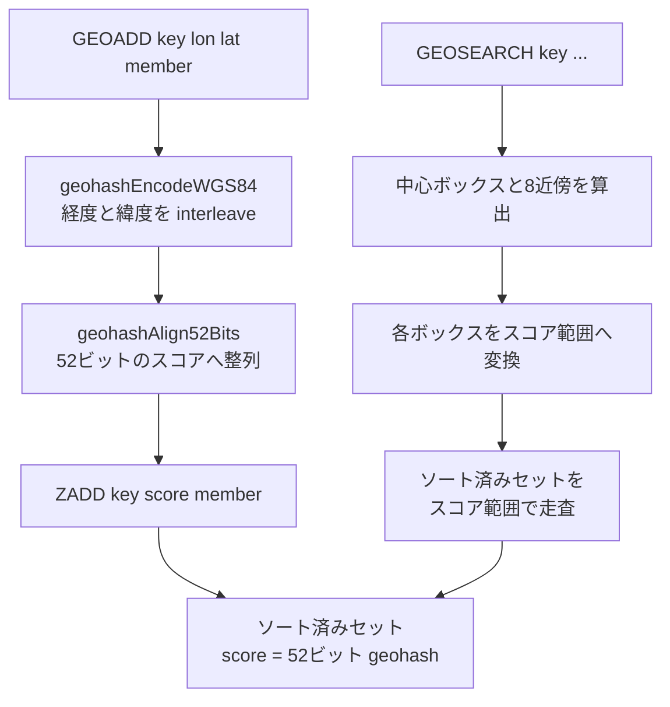

# 第22章 ビットマップと地理空間

> **本章で読むソース**
>
> - [`src/bitops.c`](https://github.com/valkey-io/valkey/blob/9.1.0/src/bitops.c)
> - [`src/geo.c`](https://github.com/valkey-io/valkey/blob/9.1.0/src/geo.c)
> - [`src/geohash.c`](https://github.com/valkey-io/valkey/blob/9.1.0/src/geohash.c)
> - [`src/geohash_helper.c`](https://github.com/valkey-io/valkey/blob/9.1.0/src/geohash_helper.c)

## この章の狙い

ビットマップと地理空間（GEO）は、どちらも独立した値の型を持たない。
ビットマップは文字列のバイト列をビット配列として読み替えた操作群であり、GEO はソート済みセットの上に座標を符号化して載せた機能である。
本章では、この二つがそれぞれ文字列とソート済みセットへどう帰着するかをコードで追い、`BITCOUNT` のワード単位 popcount と、座標を 52 ビット geohash に符号化して範囲検索をスコア走査に変える仕組みという、二つの高速化の核を機構レベルで読む。

## 前提

- 文字列値と SDS の扱いは [第15章 t_string](../part03-objects-types/15-t-string.md) を前提とする。
- ソート済みセットの内部表現（listpack と skiplist、スコア範囲走査）は [第19章 t_zset](../part03-objects-types/19-t-zset.md) を前提とする。

## ビットマップは文字列のバイト列である

ビットマップ専用の `robj` 型は存在しない。
`SETBIT` や `GETBIT` が触るのは `OBJ_STRING` のバイト列であり、ビット番号 0 を先頭バイトの最上位ビットとみなして、左から右へ通し番号を振る。
この約束は `setUnsignedBitfield` のコメントに明記されている。

[`src/bitops.c` L352-L371](https://github.com/valkey-io/valkey/blob/9.1.0/src/bitops.c#L352-L371)

```c
/* The following set.*Bitfield and get.*Bitfield functions implement setting
 * and getting arbitrary size (up to 64 bits) signed and unsigned integers
 * at arbitrary positions into a bitmap.
 *
 * The representation considers the bitmap as having the bit number 0 to be
 * the most significant bit of the first byte, and so forth, so for example
 * setting a 5 bits unsigned integer to value 23 at offset 7 into a bitmap
 * previously set to all zeroes, will produce the following representation:
 *
 * +--------+--------+
 * |00000001|01110000|
 * +--------+--------+
 *
 * When offsets and integer sizes are aligned to bytes boundaries, this is the
 * same as big endian, however when such alignment does not exist, its important
 * to also understand how the bits inside a byte are ordered.
 *
 * Note that this format follows the same convention as SETBIT and related
 * commands.
 */
```

ビット番号からバイト位置とバイト内ビット位置への変換は、すべてこの約束に従う。
バイト位置は `offset >> 3`、バイト内で立てるビットは `7 - (offset & 0x7)` である。
最上位ビットを番号 0 とするため、バイト内オフセットを 7 から引いて反転させている。

### SETBIT が文字列を伸ばしてビットを書く

`setbitCommand` は、まず書き込み先のビットオフセットを引数から取り、対象キーの文字列を必要なバイト数まで確保してから、目的のビットだけを書き換える。
文字列の確保と零埋めを担うのが `lookupStringForBitCommand` である。

[`src/bitops.c` L638-L655](https://github.com/valkey-io/valkey/blob/9.1.0/src/bitops.c#L638-L655)

```c
robj *lookupStringForBitCommand(client *c, uint64_t maxbit, int *dirty) {
    size_t byte = maxbit >> 3;
    robj *o = lookupKeyWrite(c->db, c->argv[1]);
    if (checkType(c, o, OBJ_STRING)) return NULL;
    if (dirty) *dirty = 0;

    if (o == NULL) {
        o = createObject(OBJ_STRING, sdsnewlen(NULL, byte + 1));
        dbAdd(c->db, c->argv[1], &o);
        if (dirty) *dirty = 1;
    } else {
        o = dbUnshareStringValue(c->db, c->argv[1], o);
        size_t oldlen = sdslen(objectGetVal(o));
        objectSetVal(o, sdsgrowzero(objectGetVal(o), byte + 1));
        if (dirty && oldlen != sdslen(objectGetVal(o))) *dirty = 1;
    }
    return o;
}
```

キーが存在しなければ `maxbit` を含めるのに必要な `byte + 1` バイトを零で確保し、存在すれば `sdsgrowzero` で同じ長さまで伸ばして零埋めする。
これでアドレス可能になったバイトに対して、`setbitCommand` 本体が目的のビットを立てるか落とすかを行う。

[`src/bitops.c` L710-L731](https://github.com/valkey-io/valkey/blob/9.1.0/src/bitops.c#L710-L731)

```c
    /* Get current values */
    byte = bitoffset >> 3;
    byteval = ((uint8_t *)objectGetVal(o))[byte];
    bit = 7 - (bitoffset & 0x7);
    bitval = byteval & (1 << bit);

    /* Either it is newly created, changed length, or the bit changes before and after.
     * Note that the bitval here is actually a decimal number.
     * So we need to use `!!` to convert it to 0 or 1 for comparison. */
    if (dirty || (!!bitval != on)) {
        /* Update byte with new bit value. */
        byteval &= ~(1 << bit);
        byteval |= ((on & 0x1) << bit);
        ((uint8_t *)objectGetVal(o))[byte] = byteval;
        signalModifiedKey(c, c->db, c->argv[1]);
        notifyKeyspaceEvent(NOTIFY_STRING, "setbit", c->argv[1], c->db->id);
        server.dirty++;
    }

    /* Return original value. */
    addReply(c, bitval ? shared.cone : shared.czero);
```

対象バイトを読み、目的のビットを一度落としてから新しい値で立て直す。
変更が起きたとき（新規作成、長さ変化、ビット値の反転のいずれか）にだけキー変更を通知し、戻り値には変更前のビット値を返す。
通知のイベント名が `NOTIFY_STRING` の `"setbit"` である点が、ビットマップが文字列型の一機能であることを示している。

`GETBIT` は読み取りだけなので文字列を伸ばさない。
対象バイトが文字列長の内側にあればそのビットを返し、外側なら 0 を返す（[`src/bitops.c` L745-L753](https://github.com/valkey-io/valkey/blob/9.1.0/src/bitops.c#L745-L753)）。

## BITCOUNT とワード単位の popcount

`BITCOUNT` は指定範囲に立っているビットの総数を返す。
素朴に書けば 1 バイトずつ表引きして加算すればよいが、Valkey は語（ワード）単位でまとめて数える経路を持つ。
ここが本章の一つめの高速化の核である。

入口の `bitcountCommand` は範囲指定（`BYTE`／`BIT`）を解釈してバイト境界の `start`／`end` を決め、`serverPopcount` に範囲を丸ごと渡す。

[`src/bitops.c` L1024-L1037](https://github.com/valkey-io/valkey/blob/9.1.0/src/bitops.c#L1024-L1037)

```c
    } else {
        long bytes = (long)(end - start + 1);
        long long count = serverPopcount(p + start, bytes);
        if (first_byte_neg_mask != 0 || last_byte_neg_mask != 0) {
            unsigned char firstlast[2] = {0, 0};
            /* We may count bits of first byte and last byte which are out of
             * range. So we need to subtract them. Here we use a trick. We set
             * bits in the range to zero. So these bit will not be excluded. */
            if (first_byte_neg_mask != 0) firstlast[0] = p[start] & first_byte_neg_mask;
            if (last_byte_neg_mask != 0) firstlast[1] = p[end] & last_byte_neg_mask;
            count -= serverPopcount(firstlast, 2);
        }
        addReplyLongLong(c, count);
    }
```

`BIT` 単位の範囲指定では、端のバイトに範囲外のビットが混じる。
そこで端の 2 バイトについて範囲外側のビットだけを取り出して数え直し、本体の集計から引く。
バイト単位でまとめて数える経路を保ったまま端だけ補正する作りで、本体の高速経路を端の処理が崩さない。

集計の実体は `serverPopcount` で、入力長と CPU 機能に応じて実装を選ぶ。

[`src/bitops.c` L241-L256](https://github.com/valkey-io/valkey/blob/9.1.0/src/bitops.c#L241-L256)

```c
long long serverPopcount(void *s, long count) {
#if HAVE_X86_SIMD
    /* If length of s >= 256 bits and the CPU supports AVX2,
     * we prefer to use the SIMD version */
    if (count >= 32 && __builtin_cpu_supports("avx2")) {
        return popcountAVX2(s, count);
    }
#endif
#ifdef __aarch64__
    if (count >= 16) {
        return popcountNEON(s, count);
    }
#endif

    return popcountScalar(s, count);
}
```

入力が 32 バイト以上で AVX2 が使えれば SIMD 版、ARM64 で 16 バイト以上なら NEON 版、それ以外は移植性のあるスカラ版を選ぶ。
短い入力や対応命令のない環境では、命令選択の分岐を増やさずスカラ版に落ちる。

スカラ版 `popcountScalar` が、語単位 popcount の本体である。

[`src/bitops.c` L141-L191](https://github.com/valkey-io/valkey/blob/9.1.0/src/bitops.c#L141-L191)

```c
long long popcountScalar(void *s, long count) {
    long long bits = 0;
    unsigned char *p = s;
    uint32_t *p4;

    /* Count initial bytes not aligned to 32 bit. */
    while ((unsigned long)p & 3 && count) {
        bits += bitsinbyte[*p++];
        count--;
    }

    /* Count bits 28 bytes at a time */
    p4 = (uint32_t *)p;
    while (count >= 28) {
        uint32_t aux1, aux2, aux3, aux4, aux5, aux6, aux7;
        // ... (中略：aux1〜aux7 に 4 バイトずつ読み込む) ...
        aux1 = aux1 - ((aux1 >> 1) & 0x55555555);
        aux1 = (aux1 & 0x33333333) + ((aux1 >> 2) & 0x33333333);
        // ... (中略：aux2〜aux7 も同じ並列ビットカウント) ...
        bits += ((((aux1 + (aux1 >> 4)) & 0x0F0F0F0F) + ((aux2 + (aux2 >> 4)) & 0x0F0F0F0F) +
                  // ... (中略) ...
                  ((aux7 + (aux7 >> 4)) & 0x0F0F0F0F)) *
                 0x01010101) >>
                24;
    }
    /* Count the remaining bytes. */
    p = (unsigned char *)p4;
    while (count--) bits += bitsinbyte[*p++];
    return bits;
}
```

要点は三段ある。
まず先頭の非整列バイトを表 `bitsinbyte`（[`src/bitops.c` L45-L52](https://github.com/valkey-io/valkey/blob/9.1.0/src/bitops.c#L45-L52)）で 1 バイトずつ数え、ポインタを 4 バイト境界に揃える。
次に 28 バイト（32 ビット語を 7 個）をまとめて処理し、各語に対して分割統治のビットカウントを適用する。
最後に残りのバイトを再び表引きで数える。

語ごとの処理は、`aux - ((aux >> 1) & 0x55555555)` で隣り合う 2 ビットの和を、続く行で 4 ビットと 8 ビットの和を求める、いわゆる分割統治の popcount である。
各語の 8 ビットごとの部分和をまとめたうえで `* 0x01010101 >> 24` を掛け、4 つのバイト和を一度に足し上げて 1 語分のビット数を得る。
これがバイトごとの表引きより速いのは、1 バイト 1 回の表参照とメモリ読み込みに代えて、レジスタ上のシフトとマスクだけで 4 バイト分を同時に数えるからである。
7 語をひとまとめにする展開で、ループ制御の回数も入力長の 1/28 に減る。

SIMD 版（`popcountAVX2`、`popcountNEON`）はこの考え方をベクトル幅に広げ、32 バイトや 64 バイトを 1 反復で数える（[`src/bitops.c` L58-L137](https://github.com/valkey-io/valkey/blob/9.1.0/src/bitops.c#L58-L137)）。

## BITOP のワード単位ブール演算

`BITOP` は複数の文字列をビット配列とみなし、`AND`／`OR`／`XOR`／`NOT` を要素ごとに適用して結果を別キーへ書き込む。
`bitopCommand` も popcount と同じく、語単位でまとめて処理する高速経路を持つ。

[`src/bitops.c` L834-L856](https://github.com/valkey-io/valkey/blob/9.1.0/src/bitops.c#L834-L856)

```c
#ifndef USE_ALIGNED_ACCESS
        if (minlen >= sizeof(unsigned long) * 4 && numkeys <= 16) {
            unsigned long *lp[16];
            unsigned long *lres = (unsigned long *)res;

            memcpy(lp, src, sizeof(unsigned long *) * numkeys);
            memcpy(res, src[0], minlen);

            /* Different branches per different operations for speed (sorry). */
            if (op == BITOP_AND) {
                while (minlen >= sizeof(unsigned long) * 4) {
                    for (i = 1; i < numkeys; i++) {
                        lres[0] &= lp[i][0];
                        lres[1] &= lp[i][1];
                        lres[2] &= lp[i][2];
                        lres[3] &= lp[i][3];
                        lp[i] += 4;
                    }
                    lres += 4;
                    j += sizeof(unsigned long) * 4;
                    minlen -= sizeof(unsigned long) * 4;
                }
            } else if (op == BITOP_OR) {
```

すべての入力が `unsigned long` の 4 倍以上の長さを持ち、キー数が 16 以下のとき、`unsigned long` を 4 個ずつ（64 ビット環境なら 32 バイト分）まとめて演算する。
演算の種類ごとにループを分けてあり（コメントの `sorry` はそのための重複を断っている）、分岐をループ内から追い出して 1 回の反復で 4 語を処理する。
高速経路で処理しきれなかった残りのバイトは、後続の 1 バイトずつのループが受け持つ（[`src/bitops.c` L896-L920](https://github.com/valkey-io/valkey/blob/9.1.0/src/bitops.c#L896-L920)）。
このバイトループには `AND` の結果が 0、`OR` の結果が `0xff` になった時点で残りのキーを読み飛ばす早期打ち切りもある。

なお ARM など非整列アクセスを許さない環境では、`USE_ALIGNED_ACCESS` によって高速経路を丸ごと無効化し、バイトループだけで処理する。

`BITFIELD` は一つの文字列に対して、符号付きと符号なしの任意ビット幅（最大 64 ビット）の整数を任意位置で読み書きする。
ビットの読み書きは前述の `setUnsignedBitfield`／`getUnsignedBitfield` が担い、`bitfieldGeneric` が複数の `GET`／`SET`／`INCRBY` を一括処理する（[`src/bitops.c` L1208-L1423](https://github.com/valkey-io/valkey/blob/9.1.0/src/bitops.c#L1208-L1423)）。

## 地理空間はソート済みセットの上に載る

GEO も専用の型を持たない。
座標を 1 個の数値スコアに符号化し、メンバ名をその要素として ソート済みセットに格納する。
鍵となるのは符号化の仕方である。
経度と緯度をそれぞれ整数化し、両者のビットを 1 つおきに交互配置（interleave）して 52 ビットの geohash を作る。
こうすると地理的に近い 2 点はスコア上でも近い値を取り、範囲検索をソート済みセットのスコア範囲走査に帰着できる。
これが本章の二つめの高速化の核である。



### interleave による 52 ビット geohash

符号化の本体は `geohashEncode` である。
経度と緯度をそれぞれ範囲内の比率に直し、`step` ビットの固定小数点整数にしてから `interleave64` で交互配置する。

[`src/geohash.c` L119-L149](https://github.com/valkey-io/valkey/blob/9.1.0/src/geohash.c#L119-L149)

```c
int geohashEncode(const GeoHashRange *long_range,
                  const GeoHashRange *lat_range,
                  double longitude,
                  double latitude,
                  uint8_t step,
                  GeoHashBits *hash) {
    // ... (中略：引数と範囲の検査) ...
    double lat_offset = (latitude - lat_range->min) / (lat_range->max - lat_range->min);
    double long_offset = (longitude - long_range->min) / (long_range->max - long_range->min);

    /* convert to fixed point based on the step size */
    lat_offset *= (1ULL << step);
    long_offset *= (1ULL << step);
    hash->bits = interleave64(lat_offset, long_offset);
    return 1;
}
```

GEO が使う `step` は `GEO_STEP_MAX`、すなわち 26 である（[`src/geohash.h` L46](https://github.com/valkey-io/valkey/blob/9.1.0/src/geohash.h#L46)）。
経度と緯度をそれぞれ 26 ビットに量子化し、交互に並べて 52 ビットにする。
緯度の範囲が `±85.05112878` に切られているのは、ウェブメルカトル図法で世界を正方形に収めるための定数である（[`src/geohash.h` L49-L52](https://github.com/valkey-io/valkey/blob/9.1.0/src/geohash.h#L49-L52)）。

交互配置の `interleave64` は、ビットを 2 のべきずつ広げていくビット技法で実装されている。

[`src/geohash.c` L52-L76](https://github.com/valkey-io/valkey/blob/9.1.0/src/geohash.c#L52-L76)

```c
static inline uint64_t interleave64(uint32_t xlo, uint32_t ylo) {
    static const uint64_t B[] = {0x5555555555555555ULL, 0x3333333333333333ULL, 0x0F0F0F0F0F0F0F0FULL,
                                 0x00FF00FF00FF00FFULL, 0x0000FFFF0000FFFFULL};
    static const unsigned int S[] = {1, 2, 4, 8, 16};

    uint64_t x = xlo;
    uint64_t y = ylo;

    x = (x | (x << S[4])) & B[4];
    y = (y | (y << S[4])) & B[4];
    // ... (中略：S[3], S[2], S[1] と同じ展開) ...
    x = (x | (x << S[0])) & B[0];
    y = (y | (y << S[0])) & B[0];

    return x | (y << 1);
}
```

`x | (x << S)` でビット群を倍の幅へ複製し、`& B` で不要なビットを落とす段を、シフト幅 16、8、4、2、1 と繰り返す。
これを終えると `x` のビットは偶数位置、`y` のビットは奇数位置に並ぶ。
最後の `x | (y << 1)` で両者を 1 ビットずらして重ね、交互配置が完成する。
1 ビットずつ移すループに比べ、段数が入力幅の対数で収まる。

交互配置の効果を、緯度と経度を 4 ビットずつに簡略化した例で示す。

```text
緯度 (lat) のビット :  a3 a2 a1 a0
経度 (lon) のビット :  b3 b2 b1 b0

interleave 後（偶数位置に lat、奇数位置に lon）:
  bit:  7  6  5  4  3  2  1  0
        a3 b3 a2 b2 a1 b1 a0 b0

先頭ビット (a3 b3) は南北と東西を半分に割る最上位の区画を表し、
下位ビットほど細かい区画を表す。上位ビットを共有する 2 点は
同じ大区画に属し、スコアの差も小さい。
```

上位ビットが大きな区画、下位ビットが細かい区画に対応するため、上位ビットを共有する点どうしは同じ広い区画に属し、スコアも近くなる。
復号は `deinterleave64` が逆の操作で経度と緯度を取り出し、`geohashDecode` が区画の境界から座標を再構成する（[`src/geohash.c` L161-L188](https://github.com/valkey-io/valkey/blob/9.1.0/src/geohash.c#L161-L188)）。

### GEOADD は ZADD に委譲する

`geoaddCommand` は、座標をスコアに直してから `ZADD` の引数列を組み立て、`zaddCommand` を呼ぶだけである。

[`src/geo.c` L486-L513](https://github.com/valkey-io/valkey/blob/9.1.0/src/geo.c#L486-L513)

```c
    /* Create the argument vector to call ZADD in order to add all
     * the score,value pairs to the requested zset, where score is actually
     * an encoded version of lat,long. */
    for (i = 0; i < elements; i++) {
        double xy[2];

        if (extractLongLatOrReply(c, (c->argv + longidx) + (i * 3), xy) == C_ERR) {
            // ... (中略：エラー処理) ...
        }

        /* Turn the coordinates into the score of the element. */
        GeoHashBits hash;
        geohashEncodeWGS84(xy[0], xy[1], GEO_STEP_MAX, &hash);
        GeoHashFix52Bits bits = geohashAlign52Bits(hash);
        robj *score = createStringObjectFromLongLongWithSds(bits);
        robj *val = c->argv[longidx + i * 3 + 2];
        argv[longidx + i * 2] = score;
        argv[longidx + 1 + i * 2] = val;
        incrRefCount(val);
    }

    /* Finally call ZADD that will do the work for us. */
    replaceClientCommandVector(c, argc, argv);
    zaddCommand(c);
```

各座標を `geohashEncodeWGS84` で符号化し、`geohashAlign52Bits` で 52 ビットへ左詰めしてスコアにする。
`step` が 26 未満の場合に上位へ寄せる整列が `geohashAlign52Bits` の役割で、`52 - step*2` ビットだけ左シフトする（[`src/geohash_helper.c` L276-L280](https://github.com/valkey-io/valkey/blob/9.1.0/src/geohash_helper.c#L276-L280)）。
あとはクライアントのコマンド列を `ZADD` のものに差し替えて `zaddCommand` を呼ぶため、メンバの追加と更新、エンコーディング切替はすべてソート済みセットの実装が処理する。

## GEOSEARCH を zset のスコア範囲走査に帰着する

範囲検索は、検索領域を覆う geohash の区画を求め、各区画を 52 ビットスコアの連続区間に変換して、ソート済みセットをその区間で走査する。
区画 1 つに対応するスコア範囲を計算するのが `scoresOfGeoHashBox` である。

[`src/geo.c` L338-L362](https://github.com/valkey-io/valkey/blob/9.1.0/src/geo.c#L338-L362)

```c
void scoresOfGeoHashBox(GeoHashBits hash, GeoHashFix52Bits *min, GeoHashFix52Bits *max) {
    /* We want to compute the sorted set scores that will include all the
     * elements inside the specified Geohash 'hash', which has as many
     * bits as specified by hash.step * 2.
     *
     * So if step is, for example, 3, and the hash value in binary
     * is 101010, since our score is 52 bits we want every element which
     * is in binary: 101010?????????????????????????????????????????????
     * Where ? can be 0 or 1.
     *
     * To get the min score we just use the initial hash value left
     * shifted enough to get the 52 bit value. Later we increment the
     * 6 bit prefix (see the hash.bits++ statement), and get the new
     * prefix: 101011, which we align again to 52 bits to get the maximum
     * value (which is excluded from the search). So we get everything
     * between the two following scores (represented in binary):
     *
     * 1010100000000000000000000000000000000000000000000000 (included)
     * and
     * 1010110000000000000000000000000000000000000000000000 (excluded).
     */
    *min = geohashAlign52Bits(hash);
    hash.bits++;
    *max = geohashAlign52Bits(hash);
}
```

ある区画は上位ビットだけが固定され、下位ビットは任意である。
区画の geohash を 52 ビットへ整列したものが範囲の下限、prefix を 1 増やして整列したものが上限（除外）になる。
区画に属する全要素は、この `[min, max)` の連続区間に収まる。
交互配置のおかげで「地理的な区画」が「スコアの連続区間」へそのまま対応するのが、この帰着が成り立つ理由である。

スコア範囲が決まれば、あとはソート済みセットを走査するだけである。
`geoGetPointsInRange` が listpack と skiplist の両エンコーディングを範囲走査する。

[`src/geo.c` L272-L307](https://github.com/valkey-io/valkey/blob/9.1.0/src/geo.c#L272-L307)

```c
int geoGetPointsInRange(robj *zobj, double min, double max, GeoShape *shape, geoArray *ga, unsigned long limit) {
    /* minex 0 = include min in range; maxex 1 = exclude max in range */
    /* That's: min <= val < max */
    zrangespec range = {.min = min, .max = max, .minex = 0, .maxex = 1};
    size_t origincount = ga->used;
    if (zobj->encoding == OBJ_ENCODING_LISTPACK) {
        unsigned char *zl = objectGetVal(zobj);
        // ... (中略：listpack の走査準備) ...
        if ((eptr = zzlFirstInRange(zl, &range)) == NULL) {
            /* Nothing exists starting at our min.  No results. */
            return 0;
        }
        sptr = lpNext(zl, eptr);
        while (eptr) {
            double xy[2];
            double distance = 0;
            score = zzlGetScore(sptr);

            /* If we fell out of range, break. */
            if (!zslValueLteMax(score, &range)) break;

            vstr = lpGetValue(eptr, &vlen, &vlong);
            if (geoWithinShape(shape, score, xy, &distance) == C_OK) {
                /* Append the new element. */
                char *member = (vstr == NULL) ? sdsfromlonglong(vlong) : sdsnewlen(vstr, vlen);
                geoArrayAppend(ga, xy, distance, score, member);
            }
            if (ga->used && limit && ga->used >= limit) break;
            zzlNext(zl, &eptr, &sptr);
        }
    // ... (中略：skiplist 側も同じ構造で zslNthInRange から走査) ...
```

`zzlFirstInRange`／`zslNthInRange` で範囲の先頭要素を求め、スコアが上限を超えたら走査を打ち切る。
区画に入っている要素でも、検索形状（円や矩形、多角形）の外に出るものは `geoWithinShape` の正確な距離判定で落とす。
geohash の区画はあくまで矩形の近似で、要求された半径や矩形と完全には一致しないため、最後にこの精密判定で絞り込む。

### 中心とその8近傍を覆う

検索領域が区画の境界をまたぐと、中心の区画だけでは領域全体を覆えない。
そこで中心の geohash に加えて、東西南北と斜め 4 方向の合計 8 近傍を求めて走査する。
近傍は `geohashNeighbors` が、交互配置されたビット上で経度と緯度それぞれを 1 区画ぶん増減して計算する（[`src/geohash.c` L257-L290](https://github.com/valkey-io/valkey/blob/9.1.0/src/geohash.c#L257-L290)）。

検索半径から区画の細かさ（step）を見積もるのが `geohashEstimateStepsByRadius` である。

[`src/geohash_helper.c` L64-L85](https://github.com/valkey-io/valkey/blob/9.1.0/src/geohash_helper.c#L64-L85)

```c
uint8_t geohashEstimateStepsByRadius(double range_meters, double lat) {
    if (range_meters == 0) return 26;
    int step = 1;
    while (range_meters < MERCATOR_MAX) {
        range_meters *= 2;
        step++;
    }
    step -= 2; /* Make sure range is included in most of the base cases. */

    /* Wider range towards the poles... Note: it is possible to do better
     * than this approximation by computing the distance between meridians
     * at this latitude, but this does the trick for now. */
    if (lat > 66 || lat < -66) {
        step--;
        if (lat > 80 || lat < -80) step--;
    }
    // ... (中略：1〜26 に収める) ...
    return step;
}
```

半径が大きいほど step を小さくして区画を粗く取り、9 個の区画で領域を覆えるようにする。
高緯度ほど経度方向の弧長が縮むため、極に近いところでは step をさらに下げて区画を広げる。
これらをまとめて、中心区画と 8 近傍、不要な区画の除外までを `geohashCalculateAreasByShapeWGS84` が組み立て（[`src/geohash_helper.c` L169-L274](https://github.com/valkey-io/valkey/blob/9.1.0/src/geohash_helper.c#L169-L274)）、`georadiusGeneric` がその結果を `membersOfAllNeighbors` に渡して 9 区画を走査する。

[`src/geo.c` L745-L751](https://github.com/valkey-io/valkey/blob/9.1.0/src/geo.c#L745-L751)

```c
    /* Get all neighbor geohash boxes for our radius search */
    GeoHashRadius georadius = geohashCalculateAreasByShapeWGS84(&shape);

    /* Search the zset for all matching points */
    geoArray ga;
    geoArrayInit(&ga);
    membersOfAllNeighbors(zobj, &georadius, &shape, &ga, any ? count : 0);
```

`membersOfAllNeighbors` は 9 区画それぞれを `scoresOfGeoHashBox` でスコア範囲に変え、`geoGetPointsInRange` で走査する（[`src/geo.c` L375-L428](https://github.com/valkey-io/valkey/blob/9.1.0/src/geo.c#L375-L428)）。
半径が極端に大きいと隣接区画が一致して重複するため、直前と同じ区画は読み飛ばす。
集めた候補点は距離でソートされ、`COUNT` や `ASC`／`DESC` の指定に従って返される。

GEO の各コマンドが ソート済みセットの上にどう載るかは、[第19章 t_zset](../part03-objects-types/19-t-zset.md) のスコア範囲走査を前提に読むと全体像がつかめる。

## まとめ

- ビットマップは独立した型ではなく、文字列のバイト列をビット配列として読み替えた操作群である。ビット番号 0 を先頭バイトの最上位ビットとし、`SETBIT` は `lookupStringForBitCommand` で文字列を零埋めしながら伸ばして目的ビットを書く。
- `BITCOUNT` は語単位の popcount で高速化する。`popcountScalar` は 32 ビット語を 7 個ずつ分割統治のビットカウントで処理し、AVX2／NEON 版は同じ考え方をベクトル幅へ広げる。
- `BITOP` も `unsigned long` 4 個ずつまとめて演算する高速経路を持ち、`BITFIELD` は任意ビット幅の整数を任意位置で読み書きする。
- 地理空間はソート済みセットの上に載る。経度と緯度を 26 ビットずつ量子化し、`interleave64` で交互配置して 52 ビット geohash を作り、それをスコアにする。地理的に近い点はスコアも近くなる。
- `GEOADD` は座標をスコアに直して `ZADD` に委譲する。`GEOSEARCH` は検索領域を中心区画と 8 近傍に分け、各区画を `scoresOfGeoHashBox` でスコア範囲に変えて、ソート済みセットのスコア範囲走査に帰着させる。区画は矩形の近似なので、最後に `geoWithinShape` の精密な距離判定で絞り込む。

## 関連する章

- [第15章 t_string](../part03-objects-types/15-t-string.md)：ビットマップの土台となる文字列値と SDS の扱い。
- [第19章 t_zset](../part03-objects-types/19-t-zset.md)：GEO の土台となるソート済みセットと、スコア範囲走査の実装。
- [第14章 オブジェクトエンコーディング](../part03-objects-types/14-object-encoding.md)：`robj` の型とエンコーディングの全体像。
