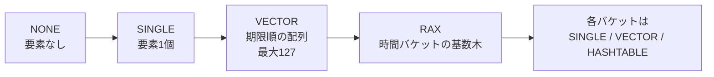
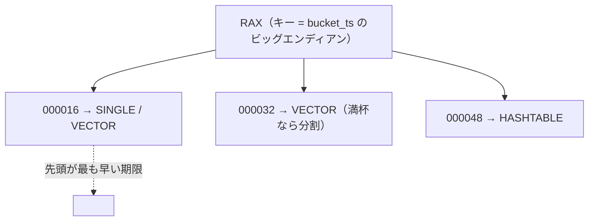

# 第23章 ボラタイルセット vset

> **本章で読むソース**
>
> - [`src/vset.h`](https://github.com/valkey-io/valkey/blob/9.1.0/src/vset.h)
> - [`src/vset.c`](https://github.com/valkey-io/valkey/blob/9.1.0/src/vset.c)
> - [`src/vector.c`](https://github.com/valkey-io/valkey/blob/9.1.0/src/vector.c)
> - [`src/t_hash.c`](https://github.com/valkey-io/valkey/blob/9.1.0/src/t_hash.c)（利用側）

## この章の狙い

`vset`（ボラタイルセット）は、有効期限を持つ要素を「期限が近い順に取り出しやすい形」で保持する内部データ構造である。
ハッシュのフィールド単位の有効期限（`HEXPIRE` 系コマンド）を支える索引として使われている。
本章では、要素数に応じて内部表現を切り替える仕組みと、期限切れ要素を低コストで回収する仕組みを、コードに即して読む。

## 前提

`vset` は内部で `rax` と `hashtable` を使い分け、`robj`（ハッシュ）の値が指すハッシュテーブルのメタデータ領域に格納される。
先に次の章を読んでおくと理解しやすい。

- [第14章 オブジェクトとエンコーディング](14-object-encoding.md)
- [第7章 hashtable](../part01-data-structures/07-hashtable.md)
- [第11章 rax](../part01-data-structures/11-rax.md)

## `vset` が解く問題

ハッシュの各フィールドに有効期限を付けられるようになると、サーバは「いま期限切れになったフィールドはどれか」を繰り返し問い合わせる必要が生じる。
フィールドをただ並べただけの集合に対してこれを行うと、毎回すべてのフィールドの期限を走査することになる。
`vset` は、要素を有効期限でゆるく整列した状態に保ち、最も早く切れる要素群を先頭から取り出せるようにすることで、この走査の費用を抑える。

`vset.h` の冒頭は、この構造の役割をこう説明している。

[`src/vset.h` L11-L24](https://github.com/valkey-io/valkey/blob/9.1.0/src/vset.h#L11-L24)

```c
/*
 *-----------------------------------------------------------------------------
 * Volatile Set - Adaptive, Expiry-aware Set Structure
 *-----------------------------------------------------------------------------
 *
 * The `vset` is a dynamic, memory-efficient container for managing
 * entries with expiry semantics. It is designed to efficiently track entries
 * that expire at varying times and scales to large sets by adapting its internal
 * representation as it grows or shrinks.
```

`vset` 自体はコマンドを持たない。
利用側はハッシュ型の実装である `t_hash.c` で、有効期限付きフィールドを追跡する索引として `vset` を生成する。

[`src/t_hash.c` L111-L120](https://github.com/valkey-io/valkey/blob/9.1.0/src/t_hash.c#L111-L120)

```c
void hashTypeTrackEntry(robj *o, entry *entry) {
    vset *set;
    if (hashTypeHasVolatileFields(o)) {
        set = hashTypeGetVolatileSet(o);
    } else {
        set = hashTypeGetOrcreateVolatileSet(o);
    }
    bool added = vsetAddEntry(set, entryGetExpiryVsetFunc, entry);
    serverAssert(added);
}
```

`vsetAddEntry` には、要素そのものとあわせて、要素から有効期限を取り出す関数 `getExpiry` が渡される。
`vset` は要素の中身を解釈せず、この関数が返す期限値だけを見て要素を配置する。
ハッシュの場合、`getExpiry` はフィールドのエントリから期限を読む `entryGetExpiryVsetFunc` である。

[`src/t_hash.c` L55-L58](https://github.com/valkey-io/valkey/blob/9.1.0/src/t_hash.c#L55-L58)

```c
// A vsetGetExpiryFunc
static mstime_t entryGetExpiryVsetFunc(const void *e) {
    return entryGetExpiry((const entry *)e);
}
```

`vset` は要素のコピーを持たず、ポインタだけを保持する。
要素の実体や有効期限の値はすべて呼び出し側が管理する。

## 単一ポインタが指す四つの表現

`vset` 型は、実体としてはひとつのポインタである。
このポインタが、要素数に応じて四種類のバケットのいずれかを指す。
種別はポインタの下位3ビットにタグとして埋め込まれる。

[`src/vset.c` L727-L735](https://github.com/valkey-io/valkey/blob/9.1.0/src/vset.c#L727-L735)

```c
#define VSET_NONE_BUCKET_PTR ((void *)(uintptr_t) - 1)
#define VSET_BUCKET_NONE -1      // matching the NULL case
#define VSET_BUCKET_SINGLE 0x1UL // xx1 (assuming sds)
#define VSET_BUCKET_VECTOR 0x2UL // 010
#define VSET_BUCKET_HT 0x4UL     // 100
#define VSET_BUCKET_RAX 0x6UL    // 110

#define VSET_TAG_MASK 0x7UL
#define VSET_PTR_MASK (~VSET_TAG_MASK)
```

要素のポインタはすべて最下位ビットが立っている（奇数アドレス）ことが前提になっている。
そのため `SINGLE`（要素ひとつ）は、要素のポインタをそのまま `vset` として持てる。
タグを使うことで、別途バケット種別を記録するフィールドを設けずに済み、要素が少ないあいだの記憶領域を最小に抑えている。

種別の判定は、最下位ビットが立っていれば `SINGLE`、そうでなければ下位3ビットをそのまま種別として読む。

[`src/vset.c` L778-L792](https://github.com/valkey-io/valkey/blob/9.1.0/src/vset.c#L778-L792)

```c
/* Determine bucket type */
static inline int vsetBucketType(vsetBucket *b) {
    assert(b);
    if (b == VSET_NONE_BUCKET_PTR) return VSET_BUCKET_NONE;

    uintptr_t bits = (uintptr_t)b;
    if (bits & 0x1)
        return VSET_BUCKET_SINGLE;
    return bits & VSET_TAG_MASK;
}

/* Access raw pointer */
static inline void *vsetBucketRawPtr(vsetBucket *b) {
    return (void *)((uintptr_t)b & VSET_PTR_MASK);
}
```

四つの表現の役割は次のとおりである。

- **NONE**：要素なし。`vsetInit` はこの状態から始める。
- **SINGLE**：要素ひとつ。要素のポインタをそのまま指す。
- **VECTOR**：有効期限で昇順整列したポインタの配列。要素数の上限は127。
- **RAX**：複数の時間バケットを束ねる基数木。各バケットがさらに `SINGLE` / `VECTOR` / `HASHTABLE` のいずれかになる。



## 表現の昇格

`vsetAddEntry` は現在のバケット種別を見て、要素を追加しながら必要なら表現を昇格させる。

[`src/vset.c` L1740-L1794](https://github.com/valkey-io/valkey/blob/9.1.0/src/vset.c#L1740-L1794)

```c
bool vsetAddEntry(vset *set, vsetGetExpiryFunc getExpiry, void *entry) {
    long long expiry = getExpiry(entry);
    vsetBucket *expiry_buckets = *set;
    assert(expiry_buckets);
    int bucket_type = vsetBucketType(expiry_buckets);
    switch (bucket_type) {
    case VSET_BUCKET_NONE:
        expiry_buckets = insertToBucket_NONE(getExpiry, expiry_buckets, entry, expiry);
        break;
    case VSET_BUCKET_SINGLE:
        expiry_buckets = insertToBucket_SINGLE(getExpiry, expiry_buckets, entry, expiry);
        break;
    case VSET_BUCKET_VECTOR: {
        // ... (中略：VECTOR が満杯なら RAX へ移行、そうでなければ整列挿入) ...
    }
    case VSET_BUCKET_RAX:
        expiry_buckets = insertToBucket_RAX(getExpiry, expiry_buckets, entry, expiry);
        break;
    default:
        panic("Cannot insert to bucket which is not single, vector or rax");
    }
    /* update the set */
    *set = expiry_buckets;
    return true;
}
```

最初の要素は `NONE` を `SINGLE` に変える。
`insertToBucket_NONE` は単に要素のポインタを返すだけで、追加の確保を伴わない。

[`src/vset.c` L1174-L1179](https://github.com/valkey-io/valkey/blob/9.1.0/src/vset.c#L1174-L1179)

```c
static inline vsetBucket *insertToBucket_NONE(vsetGetExpiryFunc getExpiry, vsetBucket *bucket, void *entry, long long expiry) {
    UNUSED(getExpiry);
    UNUSED(expiry);
    UNUSED(bucket);
    return vsetBucketFromSingle(entry);
}
```

二つめの要素が来ると `SINGLE` は `VECTOR` に昇格する。
このとき、既存の要素と新しい要素を有効期限の昇順で並べて配列に入れる。

[`src/vset.c` L1181-L1195](https://github.com/valkey-io/valkey/blob/9.1.0/src/vset.c#L1181-L1195)

```c
static inline vsetBucket *insertToBucket_SINGLE(vsetGetExpiryFunc getExpiry, vsetBucket *bucket, void *entry, long long expiry) {
    /* Upgrade to vector */
    pVector *pv = pvNew(2);
    void *curr_entry = vsetBucketSingle(bucket);
    long long curr_expiry = getExpiry(curr_entry);
    if (curr_expiry < expiry) {
        pv = pvPush(pv, curr_entry);
        pv = pvPush(pv, entry);
    } else {
        pv = pvPush(pv, entry);
        pv = pvPush(pv, curr_entry);
    }
    bucket = vsetBucketFromVector(pv);
    return bucket;
}
```

`VECTOR` は整列を保ったまま要素を増やす。
挿入位置は二分探索 `findInsertPosition` で求める。

[`src/vset.c` L915-L929](https://github.com/valkey-io/valkey/blob/9.1.0/src/vset.c#L915-L929)

```c
static inline uint32_t findInsertPosition(vsetGetExpiryFunc getExpiry, vsetBucket *bucket, long long expiry) {
    pVector *pv = vsetBucketVector(bucket);
    uint32_t left = 0;
    uint32_t right = pvLen(pv);
    while (left < right) {
        uint32_t mid = (left + right) / 2;
        int res = EXPIRE_COMPARE(expiry, getExpiry(pv->data[mid]));
        if (res <= 0)
            right = mid;
        else
            left = mid + 1;
    }

    return left; // Final position to insert the element
}
```

`VECTOR` の要素数が上限の127に達すると、`vset` は `RAX` へ移行する。
ここで二つの場合に分かれる。
全要素が同じ大きな時間窓に収まるなら、配列をまるごとひとつのバケットとして基数木に登録する。
そうでないなら、各要素を時間バケットごとに振り分け直す。

[`src/vset.c` L1752-L1784](https://github.com/valkey-io/valkey/blob/9.1.0/src/vset.c#L1752-L1784)

```c
    case VSET_BUCKET_VECTOR: {
        pVector *vec = vsetBucketVector(expiry_buckets);
        uint32_t len = pvLen(vec);
        /* in case the vector is full, we need to turn into RAX */
        if (len == VOLATILESET_VECTOR_BUCKET_MAX_SIZE) {
            rax *r = raxNew();
            long long min_expiry = getExpiry(pvGet(vec, 0));
            long long max_expiry = getExpiry(pvGet(vec, len - 1));
            if (get_max_bucket_ts(min_expiry) == get_max_bucket_ts(max_expiry)) {
                // ... (中略：配列をまるごと1バケットとして登録) ...
            } else {
                /* We need to migrate entries to the new set of buckets since we do not know all entries are in the same bucket */
                expiry_buckets = vsetBucketFromRax(r);
                for (uint32_t i = 0; i < len; i++) {
                    void *moved_entry = pvGet(vec, i);
                    expiry_buckets = insertToBucket_RAX(getExpiry, expiry_buckets, moved_entry, getExpiry(moved_entry));
                }
                // ... (中略) ...
            }
        } else {
            uint32_t pos = findInsertPosition(getExpiry, expiry_buckets, expiry);
            expiry_buckets = insertToBucket_VECTOR(getExpiry, expiry_buckets, entry, expiry, pos);
        }
        break;
    }
```

## 時間バケットと基数木

`RAX` 表現の各バケットは、ひとつの時間窓に対応する。
窓の粒度は16ミリ秒から8192ミリ秒のあいだで決まる。

[`src/vset.c` L722-L725](https://github.com/valkey-io/valkey/blob/9.1.0/src/vset.c#L722-L725)

```c
#define VOLATILESET_BUCKET_INTERVAL_MAX (1LL << 13LL) // 2^13 = 8192 milliseconds
#define VOLATILESET_BUCKET_INTERVAL_MIN (1LL << 4LL)  // 2^4 = 16 milliseconds

#define VOLATILESET_VECTOR_BUCKET_MAX_SIZE 127
```

バケットを区別するキーは、窓の終端を表すタイムスタンプ `bucket_ts` である。
有効期限を16ミリ秒境界に切り上げて、そのバケットの終端を求める。

[`src/vset.c` L877-L883](https://github.com/valkey-io/valkey/blob/9.1.0/src/vset.c#L877-L883)

```c
static inline long long get_bucket_ts(long long expiry) {
    return (expiry & ~(VOLATILESET_BUCKET_INTERVAL_MIN - 1LL)) + VOLATILESET_BUCKET_INTERVAL_MIN;
}

static inline long long get_max_bucket_ts(long long expiry) {
    return (expiry & ~(VOLATILESET_BUCKET_INTERVAL_MAX - 1LL)) + VOLATILESET_BUCKET_INTERVAL_MAX;
}
```

`bucket_ts` を8バイトのビッグエンディアンに直して基数木のキーにする。
ビッグエンディアンにすると、キーのバイト列としての辞書順が、時刻としての昇順と一致する。
基数木はキーをこの順で保持するので、最も早く切れるバケットは常に木の先頭にある。

[`src/vset.c` L885-L890](https://github.com/valkey-io/valkey/blob/9.1.0/src/vset.c#L885-L890)

```c
static inline size_t encodeExpiryKey(long long expiry, unsigned char *key) {
    long long be_ts = htonu64(expiry);
    size_t size = sizeof(be_ts);
    memcpy(key, &be_ts, size);
    return size;
}
```



`RAX` のなかでも、ひとつのバケットは要素数に応じて `SINGLE` から `VECTOR`、さらに `HASHTABLE` へと昇格する。
`insertToBucket_RAX` は、まず該当する時間窓のバケットを `findBucket` で探し、その種別ごとに挿入を振り分ける。

[`src/vset.c` L1233-L1283](https://github.com/valkey-io/valkey/blob/9.1.0/src/vset.c#L1233-L1283)

```c
static inline vsetBucket *insertToBucket_RAX(vsetGetExpiryFunc getExpiry, vsetBucket *target, void *entry, long long expiry) {
    // ... (中略：findBucket で時間窓のバケットを取得) ...
    int type = vsetBucketType(bucket);
    if (type == VSET_BUCKET_NONE) {
        /* No bucket: create single-entry bucket */
        // ... (中略) ...
    } else if (type == VSET_BUCKET_SINGLE) {
        /* Upgrade to vector */
        // ... (中略) ...
    } else if (type == VSET_BUCKET_VECTOR) {
        pVector *pv = vsetBucketVector(bucket);
        if (pvLen(pv) == VOLATILESET_VECTOR_BUCKET_MAX_SIZE) {
            /* Try to split the bucket. If not possible switch to hashtable encoding. */
            if (!splitBucketIfPossible(target, getExpiry, bucket, bucket_ts, node)) {
                // ... (中略：分割できなければ HASHTABLE へ) ...
            } else {
                /* we split the bucket. go and find again a bucket to place the entry since there can be new options now. */
                return insertToBucket_RAX(getExpiry, target, entry, expiry);
            }
        }
        // ... (中略：満杯でなければ整列挿入) ...
    } else if (vsetBucketType(bucket) == VSET_BUCKET_HT) {
        bucket = insertToBucket_HASHTABLE(getExpiry, bucket, entry, expiry);
    }
    // ... (中略) ...
}
```

## 満杯バケットの分割

`RAX` のなかの `VECTOR` バケットが127要素で満杯になると、`splitBucketIfPossible` がより細かい時間窓へ分け直そうとする。
分割は、要素が複数の細かい窓にまたがっている場合にのみ成り立つ。
すべての要素が同じ細かい窓に収まってしまうと、分割しても要素を分けられないので失敗する。

[`src/vset.c` L1119-L1167](https://github.com/valkey-io/valkey/blob/9.1.0/src/vset.c#L1119-L1167)

```c
static bool splitBucketIfPossible(vsetBucket *parent, vsetGetExpiryFunc getExpiry, vsetBucket *bucket, long long bucket_ts, raxNode *node) {
    /* We can only split vector encoded buckets */
    if (vsetBucketType(bucket) != VSET_BUCKET_VECTOR) {
        return false;
    }
    // ... (中略：分割の前に配列を期限で整列) ...
    vsetSetExpiryGetter(getExpiry);
    pvSort(pv, vsetCompareEntries);
    vsetUnsetExpiryGetter();

    long long max_bucket_ts = get_bucket_ts(getExpiry(pv->data[pvLen(pv) - 1]));
    long long min_bucket_ts = get_bucket_ts(getExpiry(pv->data[0]));

    if (max_bucket_ts < bucket_ts) {
        /* In case the bucket is already spanning over a larger window than needed, just place the bucket in a new place */
        // ... (中略：窓を細かい位置へ付け替える) ...
    } else if (min_bucket_ts != max_bucket_ts) {
        /* lets split the bucket. we know we can do it. */
        uint32_t split_index = findSplitPosition(getExpiry, bucket, &target_bucket_ts);
        // ... (中略：split_index で二つの配列に割る) ...
    } else {
        /* We cannot split the bucket. just return false */
        return false;
    }
    // ... (中略) ...
    return true;
}
```

分割点 `findSplitPosition` は、整列済み配列を真ん中から両側へ探って、`bucket_ts` がはじめて変わる隣り合う要素の境目を返す。
中央付近を起点にするのは、二つの配列がなるべく同じ大きさになる位置を選ぶためである。

[`src/vset.c` L974-L1010](https://github.com/valkey-io/valkey/blob/9.1.0/src/vset.c#L974-L1010)

```c
static uint32_t findSplitPosition(vsetGetExpiryFunc getExpiry, vsetBucket *bucket, long long *split_ts_out) {
    pVector *pv = vsetBucketVector(bucket);
    if (!pv || pv->len < 2) return pv ? pv->len : 0;

    int mid = pv->len / 2;
    int offset = 0;

    while (1) {
        int left = mid - offset;
        int right = mid + offset;
        // ... (中略：左右両方向に get_bucket_ts の境目を探す) ...
        offset++;
        if (mid - offset < 1 && mid + offset >= pv->len) break; // searched entire vector
    }

    return pv->len; // no split found
}
```

分割が成り立たないとき、つまり127要素がすべて同じ16ミリ秒窓に集まっているときは、`VECTOR` を `HASHTABLE` に変える。
配列のままでは挿入のたびに二分探索や要素移動がかかるが、ハッシュテーブルなら期限の偏りに関係なく挿入と削除を平均一定時間で行える。
ここでは期限による順序づけをあきらめる代わりに、密集した同一窓の要素を効率よくさばくことを選んでいる。

[`src/vset.c` L1197-L1222](https://github.com/valkey-io/valkey/blob/9.1.0/src/vset.c#L1197-L1222)

```c
static inline vsetBucket *insertToBucket_VECTOR(vsetGetExpiryFunc getExpiry, vsetBucket *bucket, void *entry, long long expiry, int pos) {
    UNUSED(getExpiry);
    UNUSED(expiry);
    pVector *pv = vsetBucketVector(bucket);
    /* limit of the number of elements in a vector. */
    if (pvLen(pv) >= VOLATILESET_VECTOR_BUCKET_MAX_SIZE) {
        //  Upgrade to hashtable
        hashtable *ht = hashtableCreate(&pointerHashtableType);
        for (uint32_t i = 0; i < pvLen(pv); i++) {
            hashtableAdd(ht, pvGet(pv, i));
        }
        pvFree(pv);
        /* Add the new entry as well */
        hashtableAdd(ht, entry);

        return vsetBucketFromHashtable(ht);
    } else {
        // ... (中略：満杯でなければ pos へ挿入、または末尾へ push) ...
    }
    return vsetBucketFromNone();
}
```

## 期限切れの取り出し

`vset` の本来の目的は、期限切れの要素を安く取り出すことにある。
利用側は `vsetRemoveExpired` を呼び、現在時刻 `now` 以前に切れた要素を最大 `max_count` 個まで取り除く。

[`src/vset.c` L2074-L2097](https://github.com/valkey-io/valkey/blob/9.1.0/src/vset.c#L2074-L2097)

```c
size_t vsetRemoveExpired(vset *set, vsetGetExpiryFunc getExpiry, vsetExpiryFunc expiryFunc, mstime_t now, size_t max_count, void *ctx) {
    vsetBucket *bucket = *set;
    int bucket_type = vsetBucketType(bucket);
    switch (bucket_type) {
    case VSET_BUCKET_NONE:
        return vsetBucketRemoveExpired_NONE(set, getExpiry, expiryFunc, now, max_count, ctx);
        break;
    case VSET_BUCKET_RAX:
        return vsetBucketRemoveExpired_RAX(set, getExpiry, expiryFunc, now, max_count, ctx);
        break;
    case VSET_BUCKET_SINGLE:
        return vsetBucketRemoveExpired_SINGLE(set, getExpiry, expiryFunc, now, max_count, ctx);
        break;
    case VSET_BUCKET_VECTOR:
        return vsetBucketRemoveExpired_VECTOR(set, getExpiry, expiryFunc, now, max_count, ctx);
        break;
    case VSET_BUCKET_HT:
        return vsetBucketRemoveExpired_HASHTABLE(set, getExpiry, expiryFunc, now, max_count, ctx);
        break;
    default:
        panic("Unknown volatile set bucket type in vsetPopExpired");
    }
    return 0;
}
```

`VECTOR` の場合、配列は期限の昇順なので、先頭から `now` を超える要素に当たった時点で走査を止められる。
それ以降の要素はまだ切れていないことが整列によって保証される。

[`src/vset.c` L1473-L1491](https://github.com/valkey-io/valkey/blob/9.1.0/src/vset.c#L1473-L1491)

```c
static inline size_t vsetBucketRemoveExpired_VECTOR(vsetBucket **bucket, vsetGetExpiryFunc getExpiry, vsetExpiryFunc expiryFunc, mstime_t now, size_t max_count, void *ctx) {
    pVector *pv = vsetBucketVector(*bucket);
    uint32_t len = min(pvLen(pv), max_count);
    uint32_t i = 0;
    for (; i < len; i++) {
        void *entry = pvGet(pv, i);
        /* break as soon as the expiryFunc stops us OR we reached an entry which is not expired */
        if (getExpiry(entry) > now)
            break;
        if (expiryFunc) expiryFunc(entry, ctx);
    }
    /* If no expiry occurred, no need to split. */
    if (i > 0) {
        pVector *new_pv = pvSplit(&pv, i);
        *bucket = (new_pv ? vsetBucketFromVector(new_pv) : vsetBucketFromNone());
        pvFree(pv);
    }
    return i;
}
```

`RAX` の場合は、基数木の先頭バケットから順に処理する。
先頭は最も早く切れるバケットなので、その `bucket_ts` が `now` を超えていれば、それ以降のバケットも切れていないと判断して全体を打ち切れる。
バケット内の `SINGLE` / `VECTOR` / `HASHTABLE` には、それぞれの取り出し関数へ委譲する。

[`src/vset.c` L1517-L1568](https://github.com/valkey-io/valkey/blob/9.1.0/src/vset.c#L1517-L1568)

```c
static inline size_t vsetBucketRemoveExpired_RAX(vsetBucket **bucket, vsetGetExpiryFunc getExpiry, vsetExpiryFunc expiryFunc, mstime_t now, size_t max_count, void *ctx) {
    UNUSED(getExpiry);
    rax *buckets = vsetBucketRax(*bucket);
    size_t count = 0;
    while (count < max_count && raxSize(buckets) > 0) {
        // ... (中略：先頭バケットを取得) ...
        long long time_bucket_ts = decodeExpiryKey(it.key);
        // ... (中略) ...
        if (time_bucket_ts > now)
            break;
        switch (time_bucket_type) {
        case VSET_BUCKET_SINGLE:
            count += vsetBucketRemoveExpired_SINGLE(&time_bucket, vsetGetExpiryZero, expiryFunc, now, max_count - count, ctx);
            break;
        case VSET_BUCKET_VECTOR:
            count += vsetBucketRemoveExpired_VECTOR(&time_bucket, vsetGetExpiryZero, expiryFunc, now, max_count - count, ctx);
            break;
        case VSET_BUCKET_HT:
            count += vsetBucketRemoveExpired_HASHTABLE(&time_bucket, vsetGetExpiryZero, expiryFunc, now, max_count - count, ctx);
            break;
        // ... (中略) ...
        }
        // ... (中略：空になったバケットを基数木から外す) ...
    }
    // ... (中略：全バケットが消えたら基数木を解放) ...
    return count;
}
```

ハッシュのアクティブな期限切れ処理は、この `vsetRemoveExpired` を呼び出す。
取り出された各フィールドに対し `hashTypeExpireEntry` を適用してフィールドを削除する。

[`src/t_hash.c` L2399-L2419](https://github.com/valkey-io/valkey/blob/9.1.0/src/t_hash.c#L2399-L2419)

```c
size_t hashTypeDeleteExpiredFields(robj *o, mstime_t now, unsigned long max_fields, robj **out_entries) {
    serverAssert(o->encoding == OBJ_ENCODING_HASHTABLE);

    vset *vset = hashTypeGetVolatileSet(o);
    if (!vset) {
        return 0;
    }

    serverAssert(!vsetIsEmpty(vset));
    /* skip TTL checks temporarily (to allow hashtable pops) */
    hashTypeIgnoreTTL(o, true);
    expiryContext ctx = {.key = o, .fields = out_entries, .n_fields = 0};
    size_t expired = vsetRemoveExpired(vset, entryGetExpiryVsetFunc, hashTypeExpireEntry, now, max_fields, &ctx);
    // ... (中略) ...
    return expired;
}
```

## 最早期限の見積もり

サーバは、どのハッシュをいつ調べに行くかを決めるために、各 `vset` のおおよその最早期限を問い合わせる。
`vsetEstimatedEarliestExpiry` がこれを返す。

[`src/vset.c` L2121-L2151](https://github.com/valkey-io/valkey/blob/9.1.0/src/vset.c#L2121-L2151)

```c
long long vsetEstimatedEarliestExpiry(vset *set, vsetGetExpiryFunc getExpiry) {
    int set_type = vsetBucketType(*set);
    void *entry = NULL;
    long long expiry;
    switch (set_type) {
    case VSET_BUCKET_NONE:
        return -1;
        break;
    case VSET_BUCKET_RAX: {
        rax *r = vsetBucketRax(*set);
        raxIterator it;
        raxStart(&it, r);
        expiry = decodeExpiryKey(it.key);
        raxStop(&it);
        break;
    }
    case VSET_BUCKET_SINGLE: {
        entry = vsetBucketSingle(*set);
        expiry = getExpiry(entry);
        break;
    }
    case VSET_BUCKET_VECTOR: {
        entry = pvGet(vsetBucketVector(*set), 0);
        expiry = getExpiry(entry);
        break;
    }
    default:
        panic("Unsupported vset encoding type. Only supported types are single, vector or rax");
    }
    return expiry;
}
```

`RAX` の場合に返すのは、最初のバケットのキー、すなわち窓の終端タイムスタンプである。
これは窓内の要素の本当の最小期限ではなく、その窓に属する要素群の期限の上限にあたる。
`vset.h` はこの値が「真の最小ではないかもしれない」と明記している。

[`src/vset.h` L52-L54](https://github.com/valkey-io/valkey/blob/9.1.0/src/vset.h#L52-L54)

```c
 *     long long vsetEstimatedEarliestExpiry(vset *set, vsetGetExpiryFunc getExpiry) - will return an estimation to the lowest expiry time of
 *     the entries which currently exists in the set. Because of the semi-sorted ordering this implementation is using, the returned value MIGHT not be the 'real' minimum
 *     but rather some value which is the maximum among a group of entries which are all close or equal to the 'real' minimum.
```

完全な整列を保たず、窓の粒度でゆるく並べるだけにとどめることで、挿入と削除の費用を抑えている。
最早期限が窓の幅だけ多めに見積もられても、その窓が来た時点で実際の期限を確認すればよいので、見積もりの粗さは正しさを損なわない。

## ポインタタグと省メモリ

`vset` の省メモリの核は、要素が少ないあいだは別構造を確保しないことにある。
要素がゼロのときはタグ付きの番兵ポインタひとつ、要素がひとつのときは要素ポインタそのものを `vset` として持つ。
配列や基数木を確保するのは、要素が二つ以上、あるいは128個以上に増えてからである。

`VECTOR` 表現の配列 `pVector` も、長さと確保サイズをヘッダの中にビットフィールドで詰めて持つ。

[`src/vset.c` L217-L227](https://github.com/valkey-io/valkey/blob/9.1.0/src/vset.c#L217-L227)

```c
#define PV_CARD_BITS 30
#define PV_ALLOC_BITS 34

/* Custom vector structure with embedded allocation and length counters */
typedef struct {
    uint64_t len : PV_CARD_BITS;    /* Number of elements (cardinality) */
    uint64_t alloc : PV_ALLOC_BITS; /* Allocated memory (zmalloc_size of the current vector allocation) */
    void *data[];                   /* Flexible array member */
} pVector;
```

この `pVector` は `vset.c` 内に定義された専用の配列であり、`vector.h` / `vector.c` の汎用動的配列 `vector` とは別物である。
汎用の `vector` は項目サイズを実行時に持つ素朴な可変長配列で、`vset` の索引そのものには使われていない。

[`src/vector.h` L7-L13](https://github.com/valkey-io/valkey/blob/9.1.0/src/vector.h#L7-L13)

```c
/* a generic dynamic array implementation */
typedef struct vector {
    void *data;       // Pointer to the actual array data
    uint32_t alloc;   // Number of allocated items
    uint32_t len;     // Current number of used items
    size_t item_size; // Size of each element in bytes
} vector;
```

## まとめ

- `vset`（ボラタイルセット）は、有効期限を持つ要素を期限の近い順に取り出しやすく保つ内部索引であり、ハッシュのフィールド単位の有効期限を支える。
- `vset` 型はタグ付きの単一ポインタで、要素数に応じて `NONE` → `SINGLE` → `VECTOR`（最大127）→ `RAX` と表現を切り替える。
- `RAX` は時間窓ごとのバケットをビッグエンディアンのタイムスタンプをキーに並べ、最も早く切れるバケットを常に先頭に置く。窓内のバケットは `SINGLE` / `VECTOR` / `HASHTABLE` に昇格する。
- 期限切れの取り出しは、整列と窓順を利用して、`now` を超えた時点で走査を打ち切る。同一窓に密集した要素は `HASHTABLE` でさばく。
- 最早期限は窓の粒度でゆるく見積もる。完全整列を避けることで挿入と削除を安く保ち、見積もりの粗さは実期限の再確認で補う。
- 要素が少ないあいだは追加構造を確保せず、ポインタタグと番兵だけで表すことで記憶領域を最小に抑える。

## 関連する章

- [第14章 オブジェクトとエンコーディング](14-object-encoding.md)：`vset` を保持するハッシュテーブルを値に持つ `robj`（ハッシュ）。
- [第7章 hashtable](../part01-data-structures/07-hashtable.md)：密集バケットで使う `HASHTABLE` 表現の実体。
- [第11章 rax](../part01-data-structures/11-rax.md)：時間バケットを束ねる `RAX` 表現の実体。
- [第31章 有効期限](../part05-database/31-expire.md)：キー単位の有効期限の扱い。
