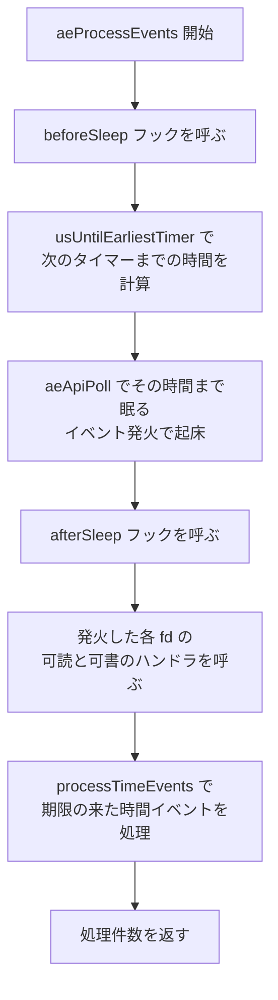

# 第24章 イベントループ ae

> **本章で読むソース**
>
> - [`src/ae.h`](https://github.com/valkey-io/valkey/blob/9.1.0/src/ae.h)
> - [`src/ae.c`](https://github.com/valkey-io/valkey/blob/9.1.0/src/ae.c)
> - [`src/ae_epoll.c`](https://github.com/valkey-io/valkey/blob/9.1.0/src/ae_epoll.c)

## この章の狙い

Valkey のサーバ本体は、ひとつのスレッドで多数のクライアントを同時に捌く。
その心臓部が `ae`（async event）と呼ばれるイベントループである。
本章では、ソケットが読めるか書けるかを監視する「ファイルイベント」と、`serverCron` のような周期処理を担う「時間イベント」を、`ae` がどう1本のループにまとめて処理するかを読む。
あわせて、`ae` の速さを支えるふたつの仕組み、多重化バックエンドの抽象と `beforeSleep` フックを、機構のレベルで説明する。

## 前提

特になし。
本章で `serverCron` やクライアント処理の呼び出し関係に触れるが、`ae` 単体で読み切れるように構成する。

## ae の役割

`ae` は**リアクタ**である。
リアクタとは、複数のI/O源をひとつの待ち合わせ点でまとめて監視し、準備の整った源にだけハンドラを呼び出す構造を指す。
Valkey はこのリアクタを単一スレッドで回し、多数のクライアント接続を多重化する。
接続ごとにスレッドを割り当てる代わりに、すべての接続のソケットを1箇所で監視し、データが届いたものだけを順に処理する。

`ae` が扱うイベントは2種類ある。
**ファイルイベント**は、ファイルディスクリプタ（主にソケット）が読める状態や書ける状態になったときに発火するイベントである。
**時間イベント**は、指定した時刻に達したときに発火するイベントで、`serverCron` による有効期限切れキーの回収やメモリ統計の更新などの周期処理を駆動する。

イベントループの状態は `aeEventLoop` 構造体に集約される。

[`src/ae.h` L103-L118](https://github.com/valkey-io/valkey/blob/9.1.0/src/ae.h#L103-L118)

```c
/* State of an event based program */
typedef struct aeEventLoop {
    int maxfd;   /* highest file descriptor currently registered */
    int setsize; /* max number of file descriptors tracked */
    long long timeEventNextId;
    aeFileEvent *events; /* Registered events */
    aeFiredEvent *fired; /* Fired events */
    aeTimeEvent *timeEventHead;
    int stop;
    void *apidata; /* This is used for polling API specific data */
    aeBeforeSleepProc *beforesleep;
    aeAfterSleepProc *aftersleep;
    aeCustomPollProc *custompoll;
    pthread_mutex_t poll_mutex;
    int flags;
} aeEventLoop;
```

`events` は登録済みファイルイベントの配列で、ファイルディスクリプタ番号 `fd` をそのまま添字に使う。
`fired` は1回のポーリングで発火したイベントを受け取る配列、`timeEventHead` は時間イベントの連結リストの先頭である。
`apidata` には、後述する多重化バックエンドが自分専用のデータ（epoll であれば epoll インスタンスの記述子など）を隠す。

ファイルイベント1件は次の構造で表す。

[`src/ae.h` L76-L82](https://github.com/valkey-io/valkey/blob/9.1.0/src/ae.h#L76-L82)

```c
/* File event structure */
typedef struct aeFileEvent {
    int mask; /* one of AE_(READABLE|WRITABLE|BARRIER) */
    aeFileProc *rfileProc;
    aeFileProc *wfileProc;
    void *clientData;
} aeFileEvent;
```

`mask` は、このファイルディスクリプタについて何を監視するかを表すビット集合である。
`AE_READABLE`（可読）と `AE_WRITABLE`（可書）が基本で、`rfileProc` が可読時、`wfileProc` が可書時に呼ばれるハンドラを指す。
監視対象のビットは次のように定義されている。

[`src/ae.h` L42-L49](https://github.com/valkey-io/valkey/blob/9.1.0/src/ae.h#L42-L49)

```c
#define AE_NONE 0     /* No events registered. */
#define AE_READABLE 1 /* Fire when descriptor is readable. */
#define AE_WRITABLE 2 /* Fire when descriptor is writable. */
#define AE_BARRIER 4  /* With WRITABLE, never fire the event if the      \
                         READABLE event already fired in the same event  \
                         loop iteration. Useful when you want to persist \
                         things to disk before sending replies, and want \
                         to do that in a group fashion. */
```

`AE_BARRIER` は可書ハンドラの発火順序を反転させるためのフラグで、本章後半の `beforeSleep` の議論で再び現れる。

ファイルイベントの登録は `aeCreateFileEvent` が担う。

[`src/ae.c` L185-L207](https://github.com/valkey-io/valkey/blob/9.1.0/src/ae.c#L185-L207)

```c
int aeCreateFileEvent(aeEventLoop *eventLoop, int fd, int mask, aeFileProc *proc, void *clientData) {
    AE_LOCK(eventLoop);
    int ret = AE_ERR;

    if (fd >= eventLoop->setsize) {
        errno = ERANGE;
        goto done;
    }
    aeFileEvent *fe = &eventLoop->events[fd];

    if (aeApiAddEvent(eventLoop, fd, mask) == -1) goto done;
    fe->mask |= mask;
    if (mask & AE_READABLE) fe->rfileProc = proc;
    if (mask & AE_WRITABLE) fe->wfileProc = proc;
    fe->clientData = clientData;
    if (fd > eventLoop->maxfd) eventLoop->maxfd = fd;

    ret = AE_OK;

done:
    AE_UNLOCK(eventLoop);
    return ret;
}
```

`fd` を配列の添字として `events[fd]` を取り出し、`mask` とハンドラを書き込む。
`aeApiAddEvent` で多重化バックエンドにも同じ監視を登録する点が要で、`ae` 側の配列と OS 側の監視リストを一致させる。
新規接続を受け付ける `accept` ハンドラやクライアントの読み取りハンドラは、すべてこの関数を通じて登録される。

## メインループ aeMain

サーバが起動を終えると、制御は `aeMain` に渡り、停止指示が出るまで戻らない。

[`src/ae.c` L540-L545](https://github.com/valkey-io/valkey/blob/9.1.0/src/ae.c#L540-L545)

```c
void aeMain(aeEventLoop *eventLoop) {
    eventLoop->stop = 0;
    while (!eventLoop->stop) {
        aeProcessEvents(eventLoop, AE_ALL_EVENTS | AE_CALL_BEFORE_SLEEP | AE_CALL_AFTER_SLEEP);
    }
}
```

ループ本体は1行しかない。
`stop` が立つまで `aeProcessEvents` を呼び続けるだけである。
渡しているフラグは、ファイルイベントと時間イベントの両方を処理し（`AE_ALL_EVENTS`）、ポーリング前後のフックを呼ぶ（`AE_CALL_BEFORE_SLEEP`、`AE_CALL_AFTER_SLEEP`）ことを意味する。
サーバが処理する仕事の一回転は、すべて `aeProcessEvents` の1回の呼び出しに収まっている。

`server.c` の `main` 末尾で `aeMain(server.el)` が呼ばれ、ここで初めてサーバはイベント駆動の常態に入る。

## 多重化バックエンドの抽象

`ae` の速さを支える1点目は、OS が提供する多重化機構を薄い共通インターフェースの背後に隠したことである。
多数のソケットを1スレッドで監視するには、「このうちどれが今読めるか」をカーネルにまとめて尋ねる仕組みが要る。
Linux の epoll、BSD 系の kqueue、Solaris 系の evport、そして移植性のための POSIX の select が、それぞれこの役割を果たす。
`ae` はこれらを `aeApiPoll` をはじめとする数個の関数に抽象化し、コンパイル時にひとつだけを選ぶ。

選択はプリプロセッサで行われる。

[`src/ae.c` L50-L64](https://github.com/valkey-io/valkey/blob/9.1.0/src/ae.c#L50-L64)

```c
/* Include the best multiplexing layer supported by this system.
 * The following should be ordered by performances, descending. */
#ifdef HAVE_EVPORT
#include "ae_evport.c"
#else
#ifdef HAVE_EPOLL
#include "ae_epoll.c"
#else
#ifdef HAVE_KQUEUE
#include "ae_kqueue.c"
#else
#include "ae_select.c"
#endif
#endif
#endif
```

コメントが述べるとおり、`#include` の順序は性能の降順である。
evport が使えればそれを、なければ epoll、kqueue、最後に select という優先順位で、ビルド時にソースファイルごと取り込む。
取り込まれた `.c` が `aeApiCreate`、`aeApiAddEvent`、`aeApiPoll` などの静的関数を定義し、`ae.c` の本体はその名前を呼ぶだけで実装の差を意識しない。
バックエンドの切り替えに分岐や関数ポインタを介さず、選ばれた1実装が直接インライン展開されるため、抽象化の代償が実行時にほとんど残らない。
`ae_kqueue.c` と `ae_select.c` も同じ関数群を提供しており、本章では Linux で標準となる `ae_epoll.c` を読む。

epoll 版の `aeApiPoll` は、`epoll_wait` の薄いラッパである。

[`src/ae_epoll.c` L110-L136](https://github.com/valkey-io/valkey/blob/9.1.0/src/ae_epoll.c#L110-L136)

```c
static int aeApiPoll(aeEventLoop *eventLoop, struct timeval *tvp) {
    aeApiState *state = eventLoop->apidata;
    int retval, numevents = 0;

    retval = epoll_wait(state->epfd, state->events, eventLoop->setsize,
                        tvp ? (tvp->tv_sec * 1000 + (tvp->tv_usec + 999) / 1000) : -1);
    if (retval > 0) {
        int j;

        numevents = retval;
        for (j = 0; j < numevents; j++) {
            int mask = 0;
            struct epoll_event *e = state->events + j;

            if (e->events & EPOLLIN) mask |= AE_READABLE;
            if (e->events & EPOLLOUT) mask |= AE_WRITABLE;
            if (e->events & EPOLLERR) mask |= AE_WRITABLE | AE_READABLE;
            if (e->events & EPOLLHUP) mask |= AE_WRITABLE | AE_READABLE;
            eventLoop->fired[j].fd = e->data.fd;
            eventLoop->fired[j].mask = mask;
        }
    } else if (retval == -1 && errno != EINTR) {
        panic("aeApiPoll: epoll_wait, %s", strerror(errno));
    }

    return numevents;
}
```

`epoll_wait` は、監視中のファイルディスクリプタのうち準備が整ったものだけを `state->events` に詰めて返す。
監視対象が何万あっても、戻ってくるのは発火した分だけなので、ループ1回あたりの仕事量は「暇な接続」の数に比例しない。
`aeApiPoll` は epoll の `EPOLLIN` や `EPOLLOUT` を `ae` 共通の `AE_READABLE` や `AE_WRITABLE` へ翻訳し、発火したものを `fired` 配列に並べ、件数を返す。
この変換のおかげで、上位の `aeProcessEvents` は epoll という具体名を知らずに済む。

監視の登録側 `aeApiAddEvent` も対称的に薄い。

[`src/ae_epoll.c` L74-L88](https://github.com/valkey-io/valkey/blob/9.1.0/src/ae_epoll.c#L74-L88)

```c
static int aeApiAddEvent(aeEventLoop *eventLoop, int fd, int mask) {
    aeApiState *state = eventLoop->apidata;
    struct epoll_event ee = {0}; /* avoid valgrind warning */
    /* If the fd was already monitored for some event, we need a MOD
     * operation. Otherwise we need an ADD operation. */
    int op = eventLoop->events[fd].mask == AE_NONE ? EPOLL_CTL_ADD : EPOLL_CTL_MOD;

    ee.events = 0;
    mask |= eventLoop->events[fd].mask; /* Merge old events */
    if (mask & AE_READABLE) ee.events |= EPOLLIN;
    if (mask & AE_WRITABLE) ee.events |= EPOLLOUT;
    ee.data.fd = fd;
    if (epoll_ctl(state->epfd, op, fd, &ee) == -1) return -1;
    return 0;
}
```

既にそのファイルディスクリプタが何か監視されていれば `EPOLL_CTL_MOD`、未登録なら `EPOLL_CTL_ADD` を選び、`ae` の `mask` を epoll のイベントビットへ翻訳して `epoll_ctl` に渡す。
`aeCreateFileEvent` が呼ぶのはこの関数で、`ae` 側の `events[fd].mask` と OS 側の監視状態が常に揃うようになっている。

## aeProcessEvents の一回転

サーバの仕事の一回転を担う `aeProcessEvents` を読む。
処理はおおよそ次の順に進む。
次のタイマーまでの待ち時間を計算し、その時間を上限に `aeApiPoll` で眠り、起きたら発火したファイルイベントのハンドラを呼び、最後に時間イベントを処理する。



まず、待ち時間の計算からポーリングまでを見る。

[`src/ae.c` L426-L450](https://github.com/valkey-io/valkey/blob/9.1.0/src/ae.c#L426-L450)

```c
        if (eventLoop->beforesleep != NULL && (flags & AE_CALL_BEFORE_SLEEP)) eventLoop->beforesleep(eventLoop);

        if (eventLoop->custompoll != NULL) {
            numevents = eventLoop->custompoll(eventLoop);
        } else {
            // ... (中略) ...
            if ((flags & AE_DONT_WAIT) || (eventLoop->flags & AE_DONT_WAIT)) {
                tv.tv_sec = tv.tv_usec = 0;
                tvp = &tv;
            } else if (flags & AE_TIME_EVENTS) {
                usUntilTimer = usUntilEarliestTimer(eventLoop);
                if (usUntilTimer >= 0) {
                    tv.tv_sec = usUntilTimer / 1000000;
                    tv.tv_usec = usUntilTimer % 1000000;
                    tvp = &tv;
                }
            }
            /* Call the multiplexing API, will return only on timeout or when
             * some event fires. */
            numevents = aeApiPoll(eventLoop, tvp);
        }
```

ポーリングに入る直前で `beforesleep` フックが呼ばれる（後述）。
続いて待ち時間 `tvp` を決める。
`usUntilEarliestTimer` が次に発火すべき時間イベントまでの残り時間を返し、それを `aeApiPoll` のタイムアウトに使う。
こうすると、ファイルイベントが何も来なくても、次のタイマーの時刻ちょうどに `aeApiPoll` が目を覚ます。
待ち時間が無限ではなくタイマーで上限を持つため、`serverCron` のような周期処理は時間どおりに走る。

次のタイマーまでの時間を求める `usUntilEarliestTimer` は、時間イベントのリストを総なめする。

[`src/ae.c` L305-L317](https://github.com/valkey-io/valkey/blob/9.1.0/src/ae.c#L305-L317)

```c
static int64_t usUntilEarliestTimer(aeEventLoop *eventLoop) {
    aeTimeEvent *te = eventLoop->timeEventHead;
    if (te == NULL) return -1;

    aeTimeEvent *earliest = NULL;
    while (te) {
        if ((!earliest || te->when < earliest->when) && te->id != AE_DELETED_EVENT_ID) earliest = te;
        te = te->next;
    }

    monotime now = getMonotonicUs();
    return (now >= earliest->when) ? 0 : earliest->when - now;
}
```

時間イベントは時刻順に並んでいないため、最も近いものを探すのは線形走査になる。
ソースのコメントも、これが O(N) であり、ソート挿入やスキップリストで速くできると認めたうえで、現状では不要だと述べている。
Valkey が常時抱える時間イベントはごく少数（`serverCron` とクライアント保守のタイマー程度）なので、N が小さく、最適化の手間に見合わないという判断である。

`aeApiPoll` が戻ると、発火したファイルイベントを順に処理する。

[`src/ae.c` L460-L510](https://github.com/valkey-io/valkey/blob/9.1.0/src/ae.c#L460-L510)

```c
        for (j = 0; j < numevents; j++) {
            int fd = eventLoop->fired[j].fd;
            aeFileEvent *fe = &eventLoop->events[fd];
            int mask = eventLoop->fired[j].mask;
            int fired = 0; /* Number of events fired for current fd. */

            // ... (中略) ...
            int invert = fe->mask & AE_BARRIER;

            /* Note the "fe->mask & mask & ..." code: maybe an already
             * processed event removed an element that fired and we still
             * didn't processed, so we check if the event is still valid.
             *
             * Fire the readable event if the call sequence is not
             * inverted. */
            if (!invert && fe->mask & mask & AE_READABLE) {
                fe->rfileProc(eventLoop, fd, fe->clientData, mask);
                fired++;
                fe = &eventLoop->events[fd]; /* Refresh in case of resize. */
            }

            /* Fire the writable event. */
            if (fe->mask & mask & AE_WRITABLE) {
                if (!fired || fe->wfileProc != fe->rfileProc) {
                    fe->wfileProc(eventLoop, fd, fe->clientData, mask);
                    fired++;
                }
            }

            /* If we have to invert the call, fire the readable event now
             * after the writable one. */
            if (invert) {
                fe = &eventLoop->events[fd]; /* Refresh in case of resize. */
                if ((fe->mask & mask & AE_READABLE) && (!fired || fe->wfileProc != fe->rfileProc)) {
                    fe->rfileProc(eventLoop, fd, fe->clientData, mask);
                    fired++;
                }
            }

            processed++;
        }
```

`fired` 配列から発火したファイルディスクリプタを取り出し、対応する `aeFileEvent` のハンドラを呼ぶ。
通常は可読を先に、可書を後に処理する。
クエリを読んだ直後に応答を書ける場合があり、その順なら同じ一回転で読みと書きを済ませられるからである。
ただし `AE_BARRIER` が立っていると順序を反転し、可書を先に処理する。
これは応答を返す前にディスクへの永続化を済ませたい場合に使う仕掛けで、後述の `beforeSleep` と組み合わさる。

ファイルイベントを片付けたら、最後に時間イベントを処理する。

[`src/ae.c` L512-L516](https://github.com/valkey-io/valkey/blob/9.1.0/src/ae.c#L512-L516)

```c
    /* Check time events */
    if (flags & AE_TIME_EVENTS) processed += processTimeEvents(eventLoop);

    return processed; /* return the number of processed file/time events */
}
```

`processTimeEvents` は時間イベントのリストを走査し、発火時刻 `when` が現在時刻を過ぎたものについて `timeProc` を呼ぶ。

[`src/ae.c` L365-L379](https://github.com/valkey-io/valkey/blob/9.1.0/src/ae.c#L365-L379)

```c
        if (te->when <= now) {
            long long retval;

            id = te->id;
            te->refcount++;
            retval = te->timeProc(eventLoop, id, te->clientData);
            te->refcount--;
            processed++;
            now = getMonotonicUs();
            if (retval != AE_NOMORE) {
                te->when = now + (monotime)retval * 1000;
            } else {
                te->id = AE_DELETED_EVENT_ID;
            }
        }
```

`timeProc` の戻り値が周期処理の鍵である。
`AE_NOMORE` 以外を返すと、その値（ミリ秒）だけ先へ次回発火時刻 `when` を更新し、イベントを生かしたままにする。
`serverCron` はこの戻り値で自分を再スケジュールし続けるため、ループが回るたびに周期的に呼ばれる。
`AE_NOMORE` を返したイベントは `AE_DELETED_EVENT_ID` を立てて、次の走査で回収される。

`serverCron` 自身は `server.c` で `aeCreateTimeEvent` により登録され、有効期限切れキーの回収やメモリ統計の更新といった背景処理を少しずつ進める。
その中身は本書の各章で扱う。

## beforeSleep が「眠る直前」にまとめる仕事

`ae` の速さを支える2点目は、ポーリングで眠る直前にフックを差し込んだことである。
`aeProcessEvents` の冒頭で、`aeApiPoll` に入る直前に `beforesleep` が呼ばれることを先に見た。
このフックの狙いは、一回転のあいだに溜まった細かな出力を、眠る前にまとめて吐き出すことにある。

なぜそれが効くのかは、クライアントへの応答の流れで見るとわかる。
コマンドを処理したハンドラは、応答をすぐソケットへ書き込むのではなく、クライアントごとの出力バッファに積むだけにしておく。
そして一回転の終わりにポーリングへ戻る直前、`beforeSleep` がバッファの溜まったクライアントをまとめて走査し、可能な分を一度に書き出す。
書き込みのたびにシステムコールを呼ぶのではなく、回転ごとに1回へ束ねるため、システムコールの回数と、その都度かかる文脈切り替えの費用を減らせる。
AOF のフラッシュのように、複数の操作を1回のディスク書き込みにまとめたい処理も、同じ「眠る直前」のタイミングに置かれる。

フックは `server.c` の起動時に `aeSetBeforeSleepProc` で登録される。
登録口にあたる関数は次のとおりで、`aeEventLoop` のフィールドに関数ポインタを差すだけである。

[`src/ae.c` L551-L557](https://github.com/valkey-io/valkey/blob/9.1.0/src/ae.c#L551-L557)

```c
void aeSetBeforeSleepProc(aeEventLoop *eventLoop, aeBeforeSleepProc *beforesleep) {
    eventLoop->beforesleep = beforesleep;
}

void aeSetAfterSleepProc(aeEventLoop *eventLoop, aeAfterSleepProc *aftersleep) {
    eventLoop->aftersleep = aftersleep;
}
```

`afterSleep` は対になるフックで、ポーリングから目覚めてファイルイベントを処理する直前に呼ばれる。
眠っていたあいだに進んだ時刻を取り込むなど、起床直後に一度だけ要る後始末をここで行う。

ここで第1節の `AE_BARRIER` が生きてくる。
応答を返す前にディスクへ確実に書き終えたい場合、可読（クエリ受信）を先に処理して応答をバッファに積み、可書（応答送信）は `beforeSleep` での永続化が済むまで遅らせたい。
`AE_BARRIER` は同じ一回転での可書ハンドラの発火を抑え、永続化を挟んでから応答を送る順序を作るためのフラグである。
`beforeSleep` でまとめてフラッシュする設計と、このフラグが噛み合っている。

応答バッファの中身や `beforeSleep` が呼ぶ個別処理は、ネットワーク層とコマンド実行の章で扱う。

## まとめ

- `ae` は単一スレッドのリアクタで、ソケットが読めるか書けるかを表すファイルイベントと、`serverCron` などの周期処理を駆動する時間イベントを、`aeProcessEvents` の1回転にまとめて処理する。
- メインループ `aeMain` は `stop` が立つまで `aeProcessEvents` を呼び続けるだけの構造で、サーバの一回転がこの1呼び出しに収まる。
- 多重化バックエンド（epoll、kqueue、evport、select）は `aeApiPoll` などの共通関数に抽象化され、コンパイル時に最速のものをソースごと取り込む。実行時の分岐がなく、多数の接続を1スレッドでスケーラブルに監視できる。
- `aeProcessEvents` の一回転は、次のタイマーまでの時間を計算し、その時間を上限に `aeApiPoll` で眠り、発火したファイルイベントのハンドラを呼び、時間イベントを処理する順に進む。
- ポーリングで眠る直前に呼ばれる `beforeSleep` は、溜まった応答の書き出しや AOF フラッシュをまとめて行い、システムコールの回数を回転ごとに束ねる。`AE_BARRIER` は永続化を挟んでから応答を送る順序を作るために働く。

## 関連する章

- 第25章「ネットワーク」: ファイルイベントのハンドラが行うソケットの読み書きと応答バッファの実装を読む。
- 第27章「コマンド実行」: 可読ハンドラから始まるコマンドのパースと実行、応答のバッファリングを読む。
- 第28章「I/O スレッド」: 単一スレッドのイベントループから読み書きを切り出して並列化する仕組みを読む。
