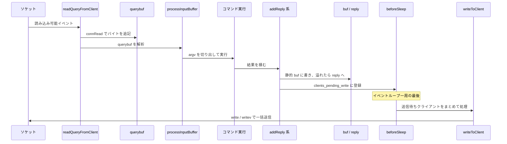

# 第25章 ネットワークとクライアント

> **本章で読むソース**
>
> - [`src/networking.c`](https://github.com/valkey-io/valkey/blob/9.1.0/src/networking.c)
> - [`src/server.h`](https://github.com/valkey-io/valkey/blob/9.1.0/src/server.h)
> - [`src/connection.h`](https://github.com/valkey-io/valkey/blob/9.1.0/src/connection.h)

## この章の狙い

Valkey は接続してきたクライアントごとに `struct client` を一つ持ち、そこに受信途中のバイト列も送信待ちの応答も集約する。
本章では、ソケットから読んだバイトが `struct client` のどこに溜まり、応答がどのバッファを経てソケットへ書き戻されるかを追う。
あわせて、応答書き込みを `write(2)` 一回にまとめる仕組みと、応答を読まない遅いクライアントからサーバのメモリを守る仕組みという、ネットワーク層の二つの工夫をコードで確認する。

## 前提

- [第24章 イベントループ](24-event-loop.md)：本章の `readQueryFromClient` はソケットの読み込み可能イベントから、`handleClientsWithPendingWrites` は `beforeSleep` から呼ばれる。イベントループの全体像を先に押さえておくとよい。

## クライアントの表現

Valkey は接続ごとに `client` 構造体を一つ確保し、その接続にまつわる状態をすべてここに集める。
受信途中のバイト列、解析済みの引数、送信待ちの応答、各種フラグが同じ構造体に並ぶ。

[`src/server.h` L1307-L1346](https://github.com/valkey-io/valkey/blob/9.1.0/src/server.h#L1307-L1346)

```c
typedef struct client {
    /* Basic client information and connection. */
    uint64_t id; /* Client incremental unique ID. */
    connection *conn;
    /* Input buffer and command parsing fields */
    sds querybuf;        /* Buffer we use to accumulate client queries. */
    size_t qb_pos;       /* The position we have read in querybuf. */
    robj **argv;         /* Arguments of current command. */
    int argc;            /* Num of arguments of current command. */
    // ... (中略) ...
    /* Output buffer and reply handling */
    long duration;
    char *buf;                           /* Output buffer */
    size_t buf_usable_size;              /* Usable size of buffer. */
    list *reply;                         /* List of reply objects to send to the client. */
    // ... (中略) ...
    unsigned long long reply_bytes;      /* Tot bytes of objects in reply list. */
    listNode clients_pending_write_node; /* list node in clients_pending_write or in clients_pending_io_write list */
    size_t bufpos;
```

本章で追うメンバは次の四つである。

- **`querybuf`**：ソケットから読んだバイト列をためる受信バッファ。型は **SDS**（第4章）で、`qb_pos` がそのうち解析済みの位置を指す。
- **`argv` / `argc`**：`querybuf` から切り出した現在のコマンドの引数配列とその個数。各要素は `robj`（第14章）である。
- **`buf` / `bufpos`**：固定長の応答バッファ（静的バッファ）と、その書き込み位置。`buf_usable_size` が実際の確保サイズである。
- **`reply` / `reply_bytes`**：静的バッファに収まりきらなかった応答をつなぐ連結リストと、その合計バイト数。

`conn` は接続の抽象である。
`src/connection.h` の `struct connection` は、ファイルディスクリプタ `fd` と読み書きのコールバック、そして `type` への関数ポインタ表を持つ。

[`src/connection.h` L159-L171](https://github.com/valkey-io/valkey/blob/9.1.0/src/connection.h#L159-L171)

```c
struct connection {
    ConnectionType *type;
    ConnectionState state;
    int last_errno;
    int fd;
    short int flags;
    short int refs;
    unsigned short int iovcnt;
    void *private_data;
    ConnectionCallbackFunc conn_handler;
    ConnectionCallbackFunc write_handler;
    ConnectionCallbackFunc read_handler;
};
```

`type` を介して読み書きが間接呼び出しになっているため、平文のソケットでも TLS でも `client` 側のコードは同じ `connRead` / `connWrite` を呼べばよい。
本章ではこの抽象には深入りせず、`conn` から読み書きできるという事実だけを使う。

### クライアントの生成

クライアントは `createClient` で作られる。
接続の読み込みハンドラに `readQueryFromClient` を据え、固定長の応答バッファを `PROTO_REPLY_CHUNK_BYTES`（16 KB）で確保し、各メンバを初期状態に揃える。

[`src/networking.c` L285-L313](https://github.com/valkey-io/valkey/blob/9.1.0/src/networking.c#L285-L313)

```c
client *createClient(connection *conn) {
    client *c = zmalloc(sizeof(client));

    /* passing NULL as conn it is possible to create a non connected client.
     * This is useful since all the commands needs to be executed
     * in the context of a client. When commands are executed in other
     * contexts (for instance a Lua script) we need a non connected client. */
    if (conn) {
        connSetReadHandler(conn, readQueryFromClient);
        connSetPrivateData(conn, c);
        conn->flags |= CONN_FLAG_ALLOW_ACCEPT_OFFLOAD;
    }
    c->buf = zmalloc_usable(PROTO_REPLY_CHUNK_BYTES, &c->buf_usable_size);
    selectDb(c, 0);
    // ... (中略) ...
```

コメントが述べるとおり、`conn` に `NULL` を渡すと接続を持たないクライアントを作れる。
Lua スクリプトや AOF ロードのように、ソケットはないがコマンド実行の文脈が要る場面で使う仕掛けである。
`reply` リストはここで `listCreate` され、`querybuf` は最初は `NULL` で、最初の読み込み時に確保される。

## 受信：querybuf へ読み、コマンドを切り出す

接続が読み込み可能になると、イベントループは読み込みハンドラ `readQueryFromClient` を呼ぶ。
この関数は、ソケットからバイトを読む処理と、読んだバイトからコマンドを切り出す処理の二つを順に呼ぶ。

[`src/networking.c` L4284-L4305](https://github.com/valkey-io/valkey/blob/9.1.0/src/networking.c#L4284-L4305)

```c
void readQueryFromClient(connection *conn) {
    client *c = connGetPrivateData(conn);
    /* Check if we can send the client to be handled by the IO-thread */
    if (postponeClientRead(c)) return;

    if (c->io_write_state != CLIENT_IDLE || c->io_read_state != CLIENT_IDLE) return;

    bool repeat = false;
    int iter = 0;
    do {
        bool full_read = readToQueryBuf(c);
        if (handleReadResult(c) == C_OK) {
            if (processInputBuffer(c) == C_ERR) return;
            trimCommandQueue(c);
        }
        repeat = (c->flag.primary &&
                  !c->flag.close_asap &&
                  ++iter < REPL_MAX_READS_PER_IO_EVENT &&
                  full_read);
        beforeNextClient(c);
    } while (repeat);
}
```

冒頭の `postponeClientRead` は、読み込みを I/O スレッドへ回せる場合に肩代わりさせるための分岐である。
I/O スレッドへの委譲は第28章で扱う。
ここでは、メインスレッドが自分で読む経路を追う。

実際にソケットから読むのは `readToQueryBuf` である。
読み込み長 `readlen` を `PROTO_IOBUF_LEN`（16 KB）に取り、`querybuf` の末尾に余裕を作ってから `connRead` を一度呼ぶ。

[`src/networking.c` L4253-L4267](https://github.com/valkey-io/valkey/blob/9.1.0/src/networking.c#L4253-L4267)

```c
    } else {
        c->querybuf = sdsMakeRoomFor(c->querybuf, readlen);

        /* Read as much as possible from the socket to save read(2) system calls. */
        readlen = sdsavail(c->querybuf);
    }
    if (use_thread_shared_qb) serverAssert(c->querybuf == thread_shared_qb);

    c->nread = connRead(c->conn, c->querybuf + qblen, readlen);
    if (c->nread <= 0) {
        return false;
    }

    sdsIncrLen(c->querybuf, c->nread);
    qblen = sdslen(c->querybuf);
```

コメントが示すとおり、`readlen` をいったん `sdsavail`（確保済みの空き全体）まで広げてから読むことで、ソケットに届いているぶんを一回の `read(2)` でまとめて取り込み、システムコールを減らす。
読み込んだバイト数 `c->nread` を `querybuf` の長さに加え、これで受信バッファに新しいバイト列が積まれた。

読んだ内容を処理するのは `processInputBuffer` である。
`querybuf` のうち未処理の領域（`qb_pos` から末尾まで）が残っている間ループし、コマンドを一つ切り出しては実行へ渡す。

[`src/networking.c` L4146-L4189](https://github.com/valkey-io/valkey/blob/9.1.0/src/networking.c#L4146-L4189)

```c
int processInputBuffer(client *c) {
    /* Parse the query buffer and/or execute already parsed commands. */
    while ((c->querybuf && c->qb_pos < sdslen(c->querybuf)) ||
           c->cmd_queue.off < c->cmd_queue.len) {
        if (!canParseCommand(c)) {
            break;
        }
        // ... (中略) ...
        /* If commands are queued up, pop from the queue first */
        if (!consumeCommandQueue(c)) {
            parseInputBuffer(c);
            prepareCommandQueue(c);
        }
        // ... (中略) ...
        if (c->argc == 0) {
            /* No command to process - continue parsing the query buf. */
            continue;
        }
        // ... (中略) ...
        /* We are finally ready to execute the command. */
        if (processCommandAndResetClient(c) == C_ERR) {
            /* If the client is no longer valid, we avoid exiting this
             * loop and trimming the client buffer later. So we return
             * ASAP in that case. */
            return C_ERR;
        }
    }

    return C_OK;
}
```

`parseInputBuffer` が `querybuf` を読み進めて `argv` / `argc` に引数を組み立て、`processCommandAndResetClient` がそのコマンドを実行する。
1回のソケット読み込みに複数のコマンドが含まれていれば、ループのなかで順に処理する。
バイト列を **RESP** として解釈する具体的な処理は第26章、組み上がったコマンドの実行は第27章で扱う。
本章の関心は、受信したバイトが `querybuf` に積まれ、`argv` に切り出されてから実行へ渡るという流れである。

## 応答：静的バッファに書き、溢れたらリストへ

コマンドの実装は、結果を `addReply` 系の関数でクライアントに積む。
これらの関数は応答を即座にソケットへ書かない。
いったんクライアントの応答バッファに溜め、書き戻しはイベントループのスリープ直前にまとめて行う。

応答を文字列として実際に積む下層が `_addReplyToBufferOrList` である。
名前のとおり、まず固定長の静的バッファ `buf` に書こうとし、入りきらなかったぶんだけを `reply` リストへ回す。

[`src/networking.c` L754-L760](https://github.com/valkey-io/valkey/blob/9.1.0/src/networking.c#L754-L760)

```c
    size_t reply_len = _addReplyToBuffer(c, s, len);
    if (len > reply_len) {
        /* Content spilled to reply list. Clear c->last_header to prevent
         * reuse of stale pointer and avoid double-tracking. */
        c->last_header = NULL;
        _addReplyProtoToList(c, c->reply, s + reply_len, len - reply_len);
    }
```

静的バッファへの書き込みを担う `_addReplyPayloadToBuffer` は、`buf` の残り容量と書き込み長の小さいほうだけを `memcpy` し、書けたバイト数を返す。
すでに `reply` リストに要素がある場合は静的バッファへの追記をやめ、0 を返してリスト側へ回す。
これは、応答の順序が壊れないようにするためである。

[`src/networking.c` L596-L616](https://github.com/valkey-io/valkey/blob/9.1.0/src/networking.c#L596-L616)

```c
static size_t _addReplyPayloadToBuffer(client *c, const void *payload, size_t len, uint8_t payload_type) {
    /* If the debug enforcing to use the reply list is enabled.*/
    if (server.debug_client_enforce_reply_list) return 0;
    /* If there already are entries in the reply list, we cannot
     * add anything more to the static buffer. */
    if (listLength(c->reply) > 0) return 0;

    size_t available = c->buf_usable_size - c->bufpos;
    size_t reply_len = min(available, len);
    if (c->flag.buf_encoded) {
        // ... (中略) ...
    }
    if (!reply_len) return 0;

    memcpy(c->buf + c->bufpos, payload, reply_len);
    c->bufpos += reply_len;
    /* We update the buffer peak after appending the reply to the buffer */
    if (c->buf_peak < (size_t)c->bufpos) c->buf_peak = (size_t)c->bufpos;
    return reply_len;
}
```

溢れたぶんを受け取る `reply` リストは、`clientReplyBlock` というブロックの連結リストである。
各ブロックは可変長配列 `buf[]` を末尾に持ち、`size`（容量）と `used`（使用量）でどこまで埋まっているかを管理する。

[`src/server.h` L864-L869](https://github.com/valkey-io/valkey/blob/9.1.0/src/server.h#L864-L869)

```c
typedef struct clientReplyBlock {
    size_t size, used;
    payloadHeader *last_header; /* points to a last header in an encoded buffer */
    ClientReplyBlockFlags flag;
    char buf[];
} clientReplyBlock;
```

`_addReplyToBufferOrList` を呼ぶ前段にあたるのが、`addReply` のような公開関数である。
`addReply` は `robj` を受け取り、その文字列表現を下層に渡す。
整数エンコードされた `robj` はその場で文字列へ変換してから積む。

[`src/networking.c` L786-L801](https://github.com/valkey-io/valkey/blob/9.1.0/src/networking.c#L786-L801)

```c
void addReply(client *c, robj *obj) {
    if (prepareClientToWrite(c) != C_OK) return;

    if (sdsEncodedObject(obj)) {
        _addReplyToBufferOrList(c, objectGetVal(obj), sdslen(objectGetVal(obj)));
    } else if (obj->encoding == OBJ_ENCODING_INT) {
        /* For integer encoded strings we just convert it into a string
         * using our optimized function, and attach the resulting string
         * to the output buffer. */
        char buf[32];
        size_t len = ll2string(buf, sizeof(buf), (long)objectGetVal(obj));
        _addReplyToBufferOrList(c, buf, len);
    } else {
        serverPanic("Wrong obj->encoding in addReply()");
    }
}
```

冒頭の `prepareClientToWrite` が、このクライアントに応答を書いてよいかを判定し、書いてよければ送信待ちのキューに登録する。

[`src/networking.c` L405-L423](https://github.com/valkey-io/valkey/blob/9.1.0/src/networking.c#L405-L423)

```c
void putClientInPendingWriteQueue(client *c) {
    /* Schedule the client to write the output buffers to the socket only
     * if not already done and, for replicas, if the replica can actually receive
     * writes at this stage. */
    if (!c->flag.pending_write &&
        // ... (中略) ...
        clusterSlotMigrationShouldInstallWriteHandler(c)) {
        /* Here instead of installing the write handler, we just flag the
         * client and put it into a list of clients that have something
         * to write to the socket. This way before re-entering the event
         * loop, we can try to directly write to the client sockets avoiding
         * a system call. We'll only really install the write handler if
         * we'll not be able to write the whole reply at once. */
        c->flag.pending_write = 1;
        listLinkNodeHead(server.clients_pending_write, &c->clients_pending_write_node);
    }
}
```

注目すべきは、ここで書き込みハンドラをすぐには登録しないことである。
クライアントに `pending_write` の印を付け、`server.clients_pending_write` リストへつなぐだけにとどめる。
コメントが述べるとおり、この狙いは、イベントループに戻る前に直接ソケットへ書き出してシステムコールを省くことにある。
一度で書ききれなかったときに限り、本当の書き込みハンドラを登録する。

### 最適化その1：スリープ直前にまとめて書く

応答を即座に書かずキューに溜めた効果が出るのが、イベントループの `beforeSleep` から呼ばれる `handleClientsWithPendingWrites` である。
この関数は、送信待ちリストにつながったクライアントを一巡し、それぞれの応答バッファをまとめてソケットへ書く。

[`src/networking.c` L3271-L3315](https://github.com/valkey-io/valkey/blob/9.1.0/src/networking.c#L3271-L3315)

```c
int handleClientsWithPendingWrites(void) {
    int processed = 0;
    int pending_writes = listLength(server.clients_pending_write);
    if (pending_writes == 0) return processed; /* Return ASAP if there are no clients. */

    listIter li;
    listNode *ln;
    listRewind(server.clients_pending_write, &li);
    while ((ln = listNext(&li))) {
        client *c = listNodeValue(ln);
        // ... (中略) ...
        c->flag.pending_write = 0;
        listUnlinkNode(server.clients_pending_write, ln);

        if (!clientHasPendingReplies(c)) continue;

        /* If we can send the client to the I/O thread, let it handle the write. */
        if (trySendWriteToIOThreads(c) == C_OK) continue;
        // ... (中略) ...
        /* Try to write buffers to the client socket. */
        if (writeToClient(c) == C_ERR) continue;

        /* If after the synchronous writes above we still have data to
         * output to the client, we need to install the writable handler. */
        if (clientHasPendingReplies(c)) {
            installClientWriteHandler(c);
        }
    }
    return processed;
}
```

各クライアントについて `writeToClient` を呼んで応答をソケットへ書く。
このとき静的バッファ `buf` と `reply` リストの両方に内容があれば、`_writeToClient` は `writevToClient` を選び、`writev(2)` で複数の領域を一度のシステムコールで送る。

[`src/networking.c` L2818-L2834](https://github.com/valkey-io/valkey/blob/9.1.0/src/networking.c#L2818-L2834)

```c
int _writeToClient(client *c) {
    listNode *lastblock;
    size_t bufpos;

    if (inMainThread()) {
        /* In the main thread, access bufpos and lastblock directly */
        lastblock = listLast(c->reply);
        bufpos = (size_t)c->bufpos;
    } else {
        // ... (中略) ...
    }

    /* If the reply list is not empty or buffer is encoded,
     * use writev to save system calls and TCP packets */
    if (lastblock || c->flag.buf_encoded) return writevToClient(c);
```

ここに、ネットワーク層の一つめの工夫がある。
コマンドを処理するたびに `write(2)` を呼ぶのではなく、応答をいったんクライアントごとのバッファに溜め、イベントループが一周を終えてスリープに入る直前にまとめて書く。
これにより、一つのイベントループ周回で複数のコマンドを処理したクライアントへの応答が、原則として一回の書き込みシステムコールに集約される。
書ききれなかったぶんがあるクライアントだけが書き込みハンドラを登録され、ソケットが書き込み可能になったときに残りを送る。



## 最適化その2：出力バッファ上限で遅いクライアントを切る

応答をクライアントごとのバッファに溜める設計には、裏返しの危険がある。
クライアントが応答をなかなか読まないと、`reply` リストが際限なく伸び、サーバのメモリを食いつぶしかねない。
これを防ぐのが出力バッファ上限である。

クライアントが現在使っている出力バッファの量は `getClientOutputBufferMemoryUsage` が計算する。
通常のクライアントでは、`reply` リストのバイト数 `reply_bytes` に、リストノードとブロックの構造体ぶんのオーバーヘッドを足したものになる。

[`src/networking.c` L6042-L6051](https://github.com/valkey-io/valkey/blob/9.1.0/src/networking.c#L6042-L6051)

```c
    size_t list_item_size = sizeof(listNode) + sizeof(clientReplyBlock);
    size_t usage = c->reply_bytes + (list_item_size * listLength(c->reply));
    if (isDeferredReplyEnabled(c)) {
        usage += c->deferred_reply_bytes +
                 (list_item_size * listLength(c->deferred_reply));
    }

    usage += atomic_load_explicit(&c->io_tracked_reply_len, memory_order_relaxed);

    return usage;
```

この使用量を上限と突き合わせるのが `checkClientOutputBufferLimits` である。
クライアントの種別（通常、レプリカ、Pub/Sub）ごとにハード上限とソフト上限を引き、使用量がそれを超えたかを判定する。

[`src/networking.c` L6141-L6168](https://github.com/valkey-io/valkey/blob/9.1.0/src/networking.c#L6141-L6168)

```c
    size_t hard_limit_bytes = server.client_obuf_limits[class].hard_limit_bytes;
    size_t soft_limit_bytes = server.client_obuf_limits[class].soft_limit_bytes;
    // ... (中略) ...
    if (server.client_obuf_limits[class].hard_limit_bytes && used_mem >= hard_limit_bytes) hard = 1;
    if (server.client_obuf_limits[class].soft_limit_bytes && used_mem >= soft_limit_bytes) soft = 1;

    /* We need to check if the soft limit is reached continuously for the
     * specified amount of seconds. */
    if (soft) {
        if (c->obuf_soft_limit_reached_time == 0) {
            c->obuf_soft_limit_reached_time = server.unixtime;
            soft = 0; /* First time we see the soft limit reached */
        } else {
            time_t elapsed = server.unixtime - c->obuf_soft_limit_reached_time;

            if (elapsed <= server.client_obuf_limits[class].soft_limit_seconds) {
                soft = 0; /* The client still did not reached the max number of
                             seconds for the soft limit to be considered
                             reached. */
            }
        }
    } else {
        c->obuf_soft_limit_reached_time = 0;
    }
    return soft || hard;
```

判定には二段ある。
ハード上限はバイト数を一度でも超えれば即アウトとする。
ソフト上限は、超えた状態が指定秒数（`soft_limit_seconds`）だけ続いて初めて違反とみなす。
瞬間的にバッファが膨らんだだけのクライアントを巻き込まないための猶予である。

種別ごとの既定値は次のとおりで、通常クライアントは上限なし（0 は無効を意味する）、レプリカと Pub/Sub には上限が設定されている。

[`src/config.c` L186-L190](https://github.com/valkey-io/valkey/blob/9.1.0/src/config.c#L186-L190)

```c
clientBufferLimitsConfig clientBufferLimitsDefaults[CLIENT_TYPE_OBUF_COUNT] = {
    {0, 0, 0},                                 /* normal */
    {1024 * 1024 * 256, 1024 * 1024 * 64, 60}, /* replica */
    {1024 * 1024 * 32, 1024 * 1024 * 8, 60}    /* pubsub */
};
```

上限に達したクライアントを切るのが `closeClientOnOutputBufferLimitReached` である。
`checkClientOutputBufferLimits` が真を返したら、クライアントを閉じてログを残す。

[`src/networking.c` L6192-L6208](https://github.com/valkey-io/valkey/blob/9.1.0/src/networking.c#L6192-L6208)

```c
    if (checkClientOutputBufferLimits(c)) {
        sds client = catClientInfoString(sdsempty(), c, server.hide_user_data_from_log);
        /* Remove RDB connection protection on COB overrun */

        if (async || c->flag.protected_rdb_channel) {
            c->flag.protected_rdb_channel = 0;
            freeClientAsync(c);
            serverLog(LL_WARNING, "Client %s scheduled to be closed ASAP for overcoming of output buffer limits.",
                      client);
        } else {
            freeClient(c);
            serverLog(LL_WARNING, "Client %s closed for overcoming of output buffer limits.", client);
        }
        sdsfree(client);
        server.stat_client_outbuf_limit_disconnections++;
        return 1;
    }
```

`async` が真のときは、いますぐ解放するのではなく `freeClientAsync` で「あとで閉じる」印を付ける。
これは、この関数が応答をバッファへ積む途中（`_addReplyPayloadToList` のなか）から呼ばれることがあり、その文脈でクライアントをいきなり解放すると、いま使っているデータを足元から崩すことになるためである。
一方、後述の `clientsCron` から呼ぶときは `async` を 0 にし、その場で同期的に閉じる。

ここに二つめの工夫がある。
応答をクライアントごとに溜める設計と引き換えに、応答を読まない遅いクライアントがメモリを無制限に消費する経路ができる。
出力バッファ上限は、その経路に種別ごとのしきい値とソフト上限の猶予を設け、違反したクライアントを切り離すことでサーバ全体のメモリを守る。

## クライアントのライフサイクル

クライアントは `createClient` で生まれ、`freeClient` で解放される。
`freeClient` は、受信バッファ、応答バッファ、応答リスト、引数配列といった、`createClient` で確保した資源を順に片付ける。

[`src/networking.c` L2160-L2186](https://github.com/valkey-io/valkey/blob/9.1.0/src/networking.c#L2160-L2186)

```c
    /* Free the query buffer */
    if (c->querybuf && c->querybuf == thread_shared_qb) {
        sdsclear(c->querybuf);
    } else {
        sdsfree(c->querybuf);
    }
    c->querybuf = NULL;
    // ... (中略) ...
    /* Free data structures. */
    releaseReplyReferences(c);
    listRelease(c->reply);
    c->reply = NULL;
    zfree_with_size(c->buf, c->buf_usable_size);
    c->buf = NULL;
    listRelease(c->deferred_reply);

    freeClientArgv(c);
    freeClientOriginalArgv(c);
    discardCommandQueue(c);
```

`querybuf` がスレッド共有バッファ `thread_shared_qb` を指している場合は解放せずクリアするだけにとどめる点に注意する。
このバッファは複数のクライアントが順番に使い回す受信用の共有領域であり、特定のクライアントの解放で道連れにしてはならない。

接続中のクライアントを定期的に世話するのが `clientsCron` である。
サーバの周期タスクから呼ばれ、クライアントを少しずつ巡回しては、タイムアウト処理、受信バッファと送信バッファの縮小、出力バッファ上限の確認を行う。

[`src/server.c` L1204-L1221](https://github.com/valkey-io/valkey/blob/9.1.0/src/server.c#L1204-L1221)

```c
        /* The following functions do different service checks on the client.
         * The protocol is that they return non-zero if the client was
         * terminated. */
        if (clientsCronHandleTimeout(c, now)) continue;
        if (clientsCronResizeQueryBuffer(c)) continue;
        if (clientsCronResizeOutputBuffer(c, now)) continue;
        if (clientsCronTrackExpensiveClients(c, curr_peak_mem_usage_slot)) continue;
        // ... (中略) ...
        if (closeClientOnOutputBufferLimitReached(c, 0)) continue;
```

各チェック関数は、クライアントを終了させた場合に非0を返す約束になっており、その場合はそのクライアントの残りの処理を飛ばす。
末尾の `closeClientOnOutputBufferLimitReached(c, 0)` が、前節の出力バッファ上限を周期的に確認する経路である。
`async` を 0 で渡しているので、上限違反のクライアントはここで同期的に閉じられる。

タイムアウト判定そのものは `clientsCronHandleTimeout` にある。
最後の対話からの経過時間が設定値 `maxidletime` を超えた通常クライアントを閉じる。
レプリカ、Pub/Sub、ブロック中のクライアントは対象外である。

[`src/timeout.c` L53-L74](https://github.com/valkey-io/valkey/blob/9.1.0/src/timeout.c#L53-L74)

```c
int clientsCronHandleTimeout(client *c, mstime_t now_ms) {
    time_t now = now_ms / 1000;

    if (server.maxidletime &&
        /* This handles the idle clients connection timeout if set. */
        !c->flag.replica &&   /* No timeout for replicas and monitors */
        !mustObeyClient(c) && /* No timeout for primaries and AOF */
        !c->flag.blocked &&   /* No timeout for BLPOP */
        !c->flag.pubsub &&    /* No timeout for Pub/Sub clients */
        (now - c->last_interaction > server.maxidletime)) {
        serverLog(LL_VERBOSE, "Closing idle client");
        freeClient(c);
        return 1;
    }
    // ... (中略) ...
    return 0;
}
```

## まとめ

- Valkey は接続ごとに `struct client` を一つ持ち、受信バッファ `querybuf`、引数 `argv` / `argc`、応答バッファ `buf` と `reply` リスト、各種フラグをそこに集約する。
- 受信側は `readQueryFromClient` が `connRead` で `querybuf` にバイトを積み、`processInputBuffer` がコマンドを切り出して実行へ渡す。一回の `read(2)` でソケットの空き全体を読み、システムコールを減らす。
- 応答側は `addReply` 系がまず固定長の静的バッファ `buf` に書き、溢れたぶんだけ `reply` リストへ回す。書き戻しはコマンドごとではなく、`beforeSleep` の `handleClientsWithPendingWrites` でまとめて行い、書き込みシステムコールを集約する。これがネットワーク層の一つめの工夫である。
- 応答を溜める設計の裏返しとして、`checkClientOutputBufferLimits` が種別ごとのハード上限とソフト上限（猶予秒数つき）で出力バッファの肥大を監視し、違反したクライアントを切ってサーバのメモリを守る。これが二つめの工夫である。
- クライアントは `createClient` で生まれ `freeClient` で解放され、`clientsCron` が周期的にタイムアウト処理、バッファ縮小、出力バッファ上限の確認を行う。

## 関連する章

- [第24章 イベントループ](24-event-loop.md)：本章の読み書きハンドラと `handleClientsWithPendingWrites` を駆動する基盤。
- [第26章 RESP プロトコル](26-resp-protocol.md)：`processInputBuffer` が呼ぶ `querybuf` の解析と RESP の文法。
- [第27章 コマンド実行](27-command-execution.md)：切り出した `argv` を実行する `processCommandAndResetClient` の先。
- [第28章 I/O スレッド](28-io-threads.md)：`postponeClientRead` と `trySendWriteToIOThreads` による読み書きのスレッド委譲。
