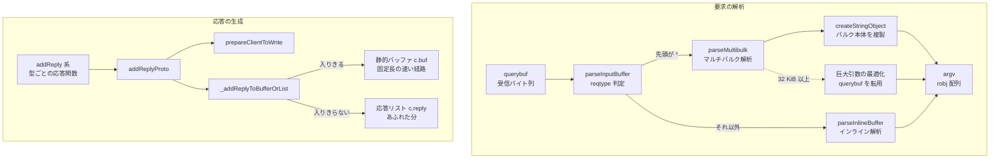

# 第26章 RESP プロトコルと応答生成

> **本章で読むソース**
>
> - [`src/networking.c`](https://github.com/valkey-io/valkey/blob/9.1.0/src/networking.c)
> - [`src/resp_parser.c`](https://github.com/valkey-io/valkey/blob/9.1.0/src/resp_parser.c)
> - [`src/resp_parser.h`](https://github.com/valkey-io/valkey/blob/9.1.0/src/resp_parser.h)
> - [`src/server.c`](https://github.com/valkey-io/valkey/blob/9.1.0/src/server.c)

## この章の狙い

Valkey がクライアントとやり取りするワイヤ形式 RESP を、要求の解析側と応答の生成側の両面から読む。
クライアントから届いたバイト列がどのようにコマンドの引数配列へ展開され、コマンドが返した値がどのようなバイト列として組み立てられるかを、実コードの流れで理解する。
あわせて、応答生成にしかけられた省メモリと省コピーの工夫、そして RESP2 と RESP3 の違いと `HELLO` による切替を読む。

## 前提

- 受信したバイト列がクライアントの `querybuf` に積まれるまでの経路は[第25章 ネットワーキング](25-networking.md)で扱う。本章は `querybuf` の中身を解析する地点から始める。
- 解析後のコマンド検索と実行は[第27章 コマンド実行](27-command-execution.md)で扱う。本章は `argv` を組み立てる地点で止める。

## RESP のワイヤ形式

**RESP**（REdis Serialization Protocol）は、先頭1バイトで値の型を表す行指向のテキストプロトコルである。
各要素は型を示す1バイトのプレフィックスで始まり、`\r\n`（CRLF）で終わる。
このプレフィックスの一覧は、応答パーサのディスパッチ部を読むのがもっとも早い。

[`src/resp_parser.c` L207-L227](https://github.com/valkey-io/valkey/blob/9.1.0/src/resp_parser.c#L207-L227)

```c
/* Parse a reply pointed to by parser->curr_location. */
int parseReply(ReplyParser *parser, void *p_ctx) {
    switch (parser->curr_location[0]) {
    case '$': return parseBulk(parser, p_ctx);
    case '+': return parseSimpleString(parser, p_ctx);
    case '-': return parseError(parser, p_ctx);
    case ':': return parseLong(parser, p_ctx);
    case '*': return parseArray(parser, p_ctx);
    case '~': return parseSet(parser, p_ctx);
    case '%': return parseMap(parser, p_ctx);
    case '#': return parseBool(parser, p_ctx);
    case ',': return parseDouble(parser, p_ctx);
    case '_': return parseNull(parser, p_ctx);
    case '(': return parseBigNumber(parser, p_ctx);
    case '=': return parseVerbatimString(parser, p_ctx);
    case '|': return parseAttributes(parser, p_ctx);
    default:
        if (parser->callbacks.error) parser->callbacks.error(p_ctx);
    }
    return C_ERR;
}
```

先頭バイトと型の対応は次のとおりである。

```text
プレフィックス  型                  RESP の世代   例
+              単純文字列           2 / 3        +OK\r\n
-              エラー               2 / 3        -ERR no such key\r\n
:              整数                 2 / 3        :1000\r\n
$              バルク文字列         2 / 3        $5\r\nhello\r\n
*              配列                 2 / 3        *2\r\n...
%              マップ               3            %1\r\n+key\r\n+val\r\n
~              セット               3            ~2\r\n...
,              double               3            ,3.14\r\n
#              ブール               3            #t\r\n / #f\r\n
_              null                 3            _\r\n
(              big number           3            (12345...\r\n
=              逐語文字列           3            =15\r\ntxt:...\r\n
|              属性                 3            |1\r\n...
>              プッシュ             3            >3\r\n...
```

単純文字列、エラー、整数は、プレフィックスの直後に内容を置いて `\r\n` で閉じる1行で完結する。
バルク文字列は、まず `$` に続けてバイト数を書き、`\r\n` のあとに本体のバイト列、さらに `\r\n` を置く。
バイト数を先に宣言するため、本体に `\r\n` を含む任意のバイナリを安全に運べる。
配列やマップなどの集約型は、プレフィックスの直後に要素数を書き、続けて要素を要素数ぶん並べる。

本章で読む2方向のデータフローを先に俯瞰しておく。
要求は `querybuf` のバイト列から `argv` へ展開され、応答は `addReply` 系から出力バッファへ積まれる。



## 要求の解析

クライアントが送るコマンドは、通常はバルク文字列の配列として届く。
これを**マルチバルク形式**と呼ぶ。
`GET key` は次のバイト列になる。

```text
*2\r\n$3\r\nGET\r\n$3\r\nkey\r\n
└┬─┘ └────┬───┘ └────┬───┘
 │        │           └ 2番目の引数 "key"（3バイト）
 │        └ 1番目の引数 "GET"（3バイト）
 └ 配列長 2（引数が2個）
```

先頭が `*` で始まれば、解析はマルチバルク経路に入る。
それ以外の先頭バイトはインライン形式と判断する。
この振り分けは `parseInputBuffer` が `reqtype` を見て行う。

[`src/networking.c` L3941-L3956](https://github.com/valkey-io/valkey/blob/9.1.0/src/networking.c#L3941-L3956)

```c
    /* Determine request type when unknown. */
    if (!c->reqtype) {
        if (c->querybuf[c->qb_pos] == '*') {
            c->reqtype = PROTO_REQ_MULTIBULK;
        } else {
            c->reqtype = PROTO_REQ_INLINE;
        }
    }

    if (c->reqtype == PROTO_REQ_INLINE) {
        parseInlineBuffer(c);
    } else if (c->reqtype == PROTO_REQ_MULTIBULK) {
        parseMultibulkBuffer(c);
    } else {
        serverPanic("Unknown request type");
    }
```

### マルチバルク形式の解析

マルチバルク解析の本体は `parseMultibulk` である。
解析は到着したバイト列に対して増分で進む。
`querybuf` に1コマンド分のバイト列がそろっていなければ途中で抜け、追加のバイトが届いてから続きを解析する。
解析状態はクライアント構造体に持ち、`multibulklen`（残りの引数個数）と `bulklen`（読みかけのバルクの宣言長、未読なら `-1`）で表す。

最初の段で配列長を読む。
先頭の `*` の次から `\r` までを整数に変換し、引数の個数として `multibulklen` に入れる。

[`src/networking.c` L3651-L3673](https://github.com/valkey-io/valkey/blob/9.1.0/src/networking.c#L3651-L3673)

```c
        serverAssertWithInfo(c, NULL, c->querybuf[c->qb_pos] == '*');
        size_t multibulklen_slen = newline - (c->querybuf + 1 + c->qb_pos);
        ok = string2ll(c->querybuf + 1 + c->qb_pos, multibulklen_slen, &ll);
        if (!ok || ll > INT_MAX) {
            return READ_FLAGS_ERROR_INVALID_MULTIBULK_LEN;
        } else if (ll > 10 && auth_required) {
            return READ_FLAGS_ERROR_UNAUTHENTICATED_MULTIBULK_LEN;
        }

        c->qb_pos = (newline - c->querybuf) + 2;

        if (ll <= 0) {
            return READ_FLAGS_PARSING_NEGATIVE_MBULK_LEN;
        }

        c->multibulklen = ll;
        c->bulklen = -1;

        /* Setup argv array */
        if (*argv) zfree(*argv);
        *argv_len = min(c->multibulklen, 1024);
        *argv = zmalloc(sizeof(robj *) * *argv_len);
        *argv_len_sum = 0;
```

引数配列 `argv` の初期確保は、宣言された引数個数と `1024` の小さいほうにとどめる。
クライアントが巨大な配列長を宣言しても、その個数ぶんのポインタ領域を一度に確保しない。
配列はあとで要素を読み進めながら必要に応じて広げる。

各引数は `multibulklen` が尽きるまで1個ずつ読む。
引数のバルク長が未読（`bulklen == -1`）なら、先頭が `$` であることを確かめ、`$` の次から `\r` までを整数に変換してバルク長とする。

[`src/networking.c` L3724-L3739](https://github.com/valkey-io/valkey/blob/9.1.0/src/networking.c#L3724-L3739)

```c
            if (c->querybuf[c->qb_pos] != '$') {
                return READ_FLAGS_ERROR_MBULK_UNEXPECTED_CHARACTER;
            }

            /* Check that what follows \r is a real \n */
            if (unlikely(newline[1] != '\n')) {
                return READ_FLAGS_ERROR_INVALID_CRLF;
            }

            size_t bulklen_slen = newline - (c->querybuf + c->qb_pos + 1);
            ok = string2ll(c->querybuf + c->qb_pos + 1, bulklen_slen, &ll);
            if (!ok || ll < 0 || (!(is_replicated) && ll > server.proto_max_bulk_len)) {
                return READ_FLAGS_ERROR_MBULK_INVALID_BULK_LEN;
            } else if (ll > 16384 && auth_required) {
                return READ_FLAGS_ERROR_UNAUTHENTICATED_BULK_LEN;
            }
```

バルク長が決まると、その長さぶんと末尾の `\r\n` が `querybuf` にそろっているかを確かめてから、引数を `robj` として取り込む。
通常は `createStringObject` でバルク本体を複製し、`argv` に積んで `qb_pos` を進める。

[`src/networking.c` L3806-L3813](https://github.com/valkey-io/valkey/blob/9.1.0/src/networking.c#L3806-L3813)

```c
            } else {
                (*argv)[(*argc)++] = createStringObject(c->querybuf + c->qb_pos, c->bulklen);
                *argv_len_sum += c->bulklen;
                c->qb_pos += c->bulklen + 2;
            }
            c->bulklen = -1;
            c->multibulklen--;
        }
```

`multibulklen` が `0` になれば1コマンド分の解析が完了し、`READ_FLAGS_PARSING_COMPLETED` を返す。

巨大な引数では、この複製を避ける工夫が入る。
引数のバルク長が `PROTO_MBULK_BIG_ARG`（32 KiB）以上で、しかも `querybuf` がそのバルク1個ぶんだけを保持している場合、`querybuf` を複製せずにそのまま引数の `robj` の中身として引き渡す。

[`src/networking.c` L3794-L3805](https://github.com/valkey-io/valkey/blob/9.1.0/src/networking.c#L3794-L3805)

```c
            /* Optimization: if a non-replicated client's buffer contains JUST our bulk element
             * instead of creating a new object by *copying* the sds we
             * just use the current sds string. */
            if (!is_replicated && c->qb_pos == 0 && c->bulklen >= PROTO_MBULK_BIG_ARG &&
                sdslen(c->querybuf) == (size_t)(c->bulklen + 2)) {
                (*argv)[(*argc)++] = createObject(OBJ_STRING, c->querybuf);
                *argv_len_sum += c->bulklen;
                sdsIncrLen(c->querybuf, -2); /* remove CRLF */
                /* Assume that if we saw a fat argument we'll see another one
                 * likely... */
                c->querybuf = sdsnewlen(SDS_NOINIT, c->bulklen + 2);
                sdsclear(c->querybuf);
```

この経路が効くのは、解析より手前で `querybuf` の境界を引数の先頭にそろえる準備をしているからである。
バルク長が `PROTO_MBULK_BIG_ARG` 以上で、未解析のバイト数がそのバルク（と末尾 `\r\n`）に収まる場合、解析側は `querybuf` をそのバルクの先頭まで切り詰め、必要な容量を先に確保しておく。

[`src/networking.c` L3756-L3769](https://github.com/valkey-io/valkey/blob/9.1.0/src/networking.c#L3756-L3769)

```c
                if (sdslen(c->querybuf) - c->qb_pos <= (size_t)ll + 2) {
                    if (c->querybuf == thread_shared_qb) {
                        /* Let the client take the ownership of the shared buffer. */
                        initSharedQueryBuf();
                    }
                    sdsrange(c->querybuf, c->qb_pos, -1);
                    c->qb_pos = 0;
                    /* Hint the sds library about the amount of bytes this string is
                     * going to contain. */
                    c->querybuf = sdsMakeRoomForNonGreedy(c->querybuf, ll + 2 - sdslen(c->querybuf));
                    /* We later set the peak to the used portion of the buffer, but here we over
                     * allocated because we know what we need, make sure it'll not be shrunk before used. */
                    if (c->querybuf_peak < (size_t)ll + 2) c->querybuf_peak = ll + 2;
                }
```

大きな値ほどコピーのコストは大きい。
受信バッファをそのまま引数本体に転用することで、数十 KiB から数 MiB におよぶ値の `memcpy` を1回ぶん丸ごと省ける。

### パイプライン化されたコマンド

`parseMultibulkBuffer` は1コマンドを解析したあと、`querybuf` にまだ `*` で始まる次のコマンドが残っていれば、続けて解析してコマンドキューに積む。
クライアントが複数のコマンドを一度に送る**パイプライン**を、追加の受信を待たずにまとめて取り込む。

[`src/networking.c` L3575-L3599](https://github.com/valkey-io/valkey/blob/9.1.0/src/networking.c#L3575-L3599)

```c
    /* Try parsing pipelined commands. */
    cmdQueue *queue = &c->cmd_queue;
    serverAssert(queue->len == 0);
    while ((flag & READ_FLAGS_PARSING_COMPLETED) &&
           sdslen(c->querybuf) > c->qb_pos &&
           c->querybuf[c->qb_pos] == '*') {
        c->reqtype = PROTO_REQ_MULTIBULK;
        /* Push a new parser state to the command queue */
        if (queue->len == queue->cap) {
            if (queue->cap == 0) {
                queue->cap = COMMAND_QUEUE_MIN_CAPACITY;
            } else if (queue->cap <= 512) {
                queue->cap *= 2;
            } else {
                break; /* Limit the length of the command queue. */
            }
            queue->cmds = zrealloc(queue->cmds, queue->cap * sizeof(parsedCommand));
        }
        parsedCommand *p = &queue->cmds[queue->len++];
        memset(p, 0, sizeof(*p));
        flag = parseMultibulk(c, &p->argc, &p->argv, &p->argv_len,
                              &p->argv_len_sum, &p->input_bytes);
        p->read_flags = flag;
        p->slot = -1;
    }
```

### インライン形式の解析

`telnet` や手書きのスクリプトのように、`*` で始まらない素朴な行を送る場合に備えて、インライン形式の解析も用意されている。
`parseInlineBuffer` は最初の `\n` までを1行とみなし、`sdsnsplitargs` で空白区切りの引数に分割する。

[`src/networking.c` L3434-L3454](https://github.com/valkey-io/valkey/blob/9.1.0/src/networking.c#L3434-L3454)

```c
    /* Search for end of line */
    newline = strchr(c->querybuf + c->qb_pos, '\n');

    /* Nothing to do without a \r\n */
    if (newline == NULL) {
        if (sdslen(c->querybuf) - c->qb_pos > PROTO_INLINE_MAX_SIZE) {
            c->read_flags |= READ_FLAGS_ERROR_BIG_INLINE_REQUEST;
        }
        return;
    }

    /* Handle the \r\n case. */
    if (newline != c->querybuf + c->qb_pos && *(newline - 1) == '\r') newline--, linefeed_chars++;

    /* Split the input buffer up to the \r\n */
    querylen = newline - (c->querybuf + c->qb_pos);
    argv = sdsnsplitargs(c->querybuf + c->qb_pos, querylen, &argc);
    if (argv == NULL) {
        c->read_flags |= READ_FLAGS_ERROR_UNBALANCED_QUOTES;
        return;
    }
```

分割した各要素は `createObject` で `robj` にして `argv` に積む。
この経路は1行をその場で読み切るため、マルチバルク解析のような増分の状態は持たない。

## 応答の生成

応答側は、コマンドの実装が呼ぶ `addReply` 系の関数群で組み立てる。
各関数は型ごとに正しいプレフィックスとペイロードを書き、最終的にすべてが `addReplyProto` を通ってクライアントの出力バッファへ積まれる。

[`src/networking.c` L823-L826](https://github.com/valkey-io/valkey/blob/9.1.0/src/networking.c#L823-L826)

```c
void addReplyProto(client *c, const char *s, size_t len) {
    if (prepareClientToWrite(c) != C_OK) return;
    _addReplyToBufferOrList(c, s, len);
}
```

`_addReplyToBufferOrList` は、まずクライアント構造体に埋め込まれた固定長の静的バッファ `buf` に書こうとし、入りきらなければ可変長の応答リストに回す。
小さな応答が大多数を占めるため、その場合は追加のヒープ確保なしに応答を組み立てられる。

### 型ごとの応答関数

単純なスカラ型は、それぞれ専用の関数がプレフィックスを直接書く。
たとえばエラー応答は、先頭が `-` でなければ既定のエラーコード `-ERR` を補い、本文を書いて `\r\n` で閉じる。

[`src/networking.c` L837-L843](https://github.com/valkey-io/valkey/blob/9.1.0/src/networking.c#L837-L843)

```c
void addReplyErrorLength(client *c, const char *s, size_t len) {
    /* If the string already starts with "-..." then the error code
     * is provided by the caller. Otherwise we use "-ERR". */
    if (!len || s[0] != '-') addReplyProto(c, "-ERR ", 5);
    addReplyProto(c, s, len);
    addReplyProto(c, "\r\n", 2);
}
```

整数応答 `addReplyLongLong` は `:` プレフィックスで値を書く。
ただし `0` と `1` は共有オブジェクトに差し替える（共有オブジェクトの仕組みは後述する）。

[`src/networking.c` L1370-L1379](https://github.com/valkey-io/valkey/blob/9.1.0/src/networking.c#L1370-L1379)

```c
void addReplyLongLong(client *c, long long ll) {
    if (ll == 0)
        addReply(c, shared.czero);
    else if (ll == 1)
        addReply(c, shared.cone);
    else {
        if (prepareClientToWrite(c) != C_OK) return;
        _addReplyLongLongWithPrefix(c, ll, ':');
    }
}
```

バルク文字列は `addReplyBulkCBuffer` が組み立てる。
`$` に続けて長さを書き、本体、`\r\n` の順に積む。

[`src/networking.c` L1494-L1499](https://github.com/valkey-io/valkey/blob/9.1.0/src/networking.c#L1494-L1499)

```c
void addReplyBulkCBuffer(client *c, const void *p, size_t len) {
    if (prepareClientToWrite(c) != C_OK) return;
    _addReplyLongLongWithPrefix(c, len, '$');
    _addReplyToBufferOrList(c, p, len);
    _addReplyToBufferOrList(c, "\r\n", 2);
}
```

### 集約型と長さの後埋め

配列やマップのように要素を並べる集約型は、本来なら要素数を先に書く必要がある。
要素数があらかじめ分かっていれば、`addReplyArrayLen` や `addReplyMapLen` で長さを書いてから要素を順に積めばよい。

ところが、応答を作りながらでないと要素数が確定しない場面がある。
たとえば条件に合うキーだけを集めて返す場合、走査し終えるまで個数は分からない。
このために、長さの場所だけ先に予約しておき、要素を書き終えてから埋める手法がある。

[`src/networking.c` L1107-L1139](https://github.com/valkey-io/valkey/blob/9.1.0/src/networking.c#L1107-L1139)

```c
/* Adds an empty object to the reply list that will contain the multi bulk
 * length, which is not known when this function is called. */
void *addReplyDeferredLen(client *c) {
    /* Note that we install the write event here even if the object is not
     * ready to be sent, since we are sure that before returning to the
     * event loop setDeferredAggregateLen() will be called. */
    if (prepareClientToWrite(c) != C_OK) return NULL;
    // ... (中略) ...
    list *reply_list = clientGetReplyList(c);
    trimReplyUnusedTailSpace(c);
    listAddNodeTail(reply_list, NULL); /* NULL is our placeholder. */
    return listLast(reply_list);
}
```

`addReplyDeferredLen` は応答リストに `NULL` のプレースホルダノードを1個挿し、その位置を呼び出し側に返す。
呼び出し側は要素をすべて書いたあとで `setDeferredAggregateLen` を呼び、数えあげた要素数と集約型のプレフィックスをプレースホルダに書き込む。

[`src/networking.c` L1206-L1238](https://github.com/valkey-io/valkey/blob/9.1.0/src/networking.c#L1206-L1238)

```c
/* Populate the length object and try gluing it to the next chunk. */
void setDeferredAggregateLen(client *c, void *node, long length, char prefix) {
    serverAssert(length >= 0);

    /* Abort when *node is NULL: when the client should not accept writes
     * we return NULL in addReplyDeferredLen() */
    if (node == NULL) return;

    /* Things like *2\r\n, %3\r\n or ~4\r\n are emitted very often by the protocol
     * so we have a few shared objects to use if the integer is small
     * like it is most of the times. */
    const size_t hdr_len = OBJ_SHARED_HDR_STRLEN(length);
    const int opt_hdr = length < OBJ_SHARED_BULKHDR_LEN;
    if (prefix == '*' && opt_hdr) {
        setDeferredReply(c, node, objectGetVal(shared.mbulkhdr[length]), hdr_len);
        return;
    }
    // ... (中略) ...
    char lenstr[128];
    lenstr[0] = prefix;
    size_t lenstr_len = ll2string(lenstr + 1, sizeof(lenstr) - 1, length);
    lenstr[lenstr_len + 1] = '\r';
    lenstr[lenstr_len + 2] = '\n';
    setDeferredReply(c, node, lenstr, lenstr_len + 3);
}
```

後埋めの手法は、要素を別バッファに溜めて長さを数えてから先頭に連結する方式に比べて、要素のバイト列を二度持たずに済む。
さらに `setDeferredReply` は、確定した長さ文字列を前後のチャンクに空きがあればそこへ詰め込み、長さ専用のノードを消す。
これは長さを別ノードのまま送るより、書き込みに使うシステムコールを1回ぶん減らせる。

[`src/networking.c` L1167-L1180](https://github.com/valkey-io/valkey/blob/9.1.0/src/networking.c#L1167-L1180)

```c
    if (ln->prev != NULL && (prev = listNodeValue(ln->prev)) && prev->size > prev->used &&
        c->io_write_state != CLIENT_PENDING_IO && !prev->flag.buf_encoded) {
        size_t len_to_copy = prev->size - prev->used;
        if (len_to_copy > length) len_to_copy = length;
        memcpy(prev->buf + prev->used, s, len_to_copy);
        c->net_output_bytes_curr_cmd += len_to_copy;
        prev->used += len_to_copy;
        length -= len_to_copy;
        if (length == 0) {
            listDelNode(reply_list, ln);
            return;
        }
        s += len_to_copy;
    }
```

### 共有応答オブジェクト

`+OK\r\n` や `:0\r\n` のような短い定型応答は、コマンドのたびに作り直す必要がない。
Valkey は起動時にこれらを共有オブジェクトとして一度だけ確保し、応答では同じオブジェクトを参照する。

[`src/server.c` L2102-L2109](https://github.com/valkey-io/valkey/blob/9.1.0/src/server.c#L2102-L2109)

```c
    shared.ok = createSharedString("+OK\r\n");
    shared.emptybulk = createSharedString("$0\r\n\r\n");
    shared.czero = createSharedString(":0\r\n");
    shared.cone = createSharedString(":1\r\n");
    shared.emptyarray = createSharedString("*0\r\n");
    shared.pong = createSharedString("+PONG\r\n");
    shared.queued = createSharedString("+QUEUED\r\n");
    shared.emptyscan = createSharedString("*2\r\n$1\r\n0\r\n*0\r\n");
```

集約型と各種ヘッダの長さプレフィックスも、小さな値については共有する。
配列ヘッダ `*N\r\n`、バルクヘッダ `$N\r\n`、マップヘッダ `%N\r\n`、セットヘッダ `~N\r\n` を `0` から `OBJ_SHARED_BULKHDR_LEN`（32）の手前まで前計算しておく。

[`src/server.c` L2235-L2240](https://github.com/valkey-io/valkey/blob/9.1.0/src/server.c#L2235-L2240)

```c
    for (j = 0; j < OBJ_SHARED_BULKHDR_LEN; j++) {
        shared.mbulkhdr[j] = createSharedStringFromSds(sdscatprintf(sdsempty(), "*%d\r\n", j));
        shared.bulkhdr[j] = createSharedStringFromSds(sdscatprintf(sdsempty(), "$%d\r\n", j));
        shared.maphdr[j] = createSharedStringFromSds(sdscatprintf(sdsempty(), "%%%d\r\n", j));
        shared.sethdr[j] = createSharedStringFromSds(sdscatprintf(sdsempty(), "~%d\r\n", j));
    }
```

長さプレフィックスを書く `_addReplyLongLongWithPrefix` は、値が `32` 未満ならこの前計算したヘッダをそのまま使う。

[`src/networking.c` L1340-L1361](https://github.com/valkey-io/valkey/blob/9.1.0/src/networking.c#L1340-L1361)

```c
static void _addReplyLongLongWithPrefix(client *c, long long ll, char prefix) {
    char buf[128];
    int len;

    /* Things like $3\r\n or *2\r\n are emitted very often by the protocol
     * so we have a few shared objects to use if the integer is small
     * like it is most of the times. */
    const int opt_hdr = ll < OBJ_SHARED_BULKHDR_LEN && ll >= 0;
    const size_t hdr_len = OBJ_SHARED_HDR_STRLEN(ll);
    if (prefix == '*' && opt_hdr) {
        _addReplyToBufferOrList(c, objectGetVal(shared.mbulkhdr[ll]), hdr_len);
        return;
    } else if (prefix == '$' && opt_hdr) {
        _addReplyToBufferOrList(c, objectGetVal(shared.bulkhdr[ll]), hdr_len);
        return;
    } else if (prefix == '%' && opt_hdr) {
        _addReplyToBufferOrList(c, objectGetVal(shared.maphdr[ll]), hdr_len);
        return;
    } else if (prefix == '~' && opt_hdr) {
        _addReplyToBufferOrList(c, objectGetVal(shared.sethdr[ll]), hdr_len);
        return;
    }
```

短い応答とヘッダの大半はこの経路に落ちる。
共有オブジェクトを参照に差し替えることで、応答ごとの長さ文字列の整形（`ll2string`）とバッファへの複製を省ける。

## RESP2 と RESP3、HELLO による交渉

RESP には2つの世代がある。
RESP3 はマップ、セット、double、ブール、null、big number、逐語文字列、属性、プッシュといった型を追加した。
RESP2 ではこれらの値を、配列やバルク文字列など RESP2 にある型へ落として表現する。

どちらの世代でやり取りするかはクライアントごとに `c->resp` が保持し、既定では RESP2 である。
型ごとの応答関数は `c->resp` を見て出力を切り替える。
たとえば null は、RESP2 では長さ `-1` のバルク文字列 `$-1\r\n`、RESP3 では専用の `_\r\n` になる。

[`src/networking.c` L1426-L1440](https://github.com/valkey-io/valkey/blob/9.1.0/src/networking.c#L1426-L1440)

```c
void addReplyNull(client *c) {
    if (c->resp == 2) {
        addReplyProto(c, "$-1\r\n", 5);
    } else {
        addReplyProto(c, "_\r\n", 3);
    }
}

void addReplyBool(client *c, int b) {
    if (c->resp == 2) {
        addReply(c, b ? shared.cone : shared.czero);
    } else {
        addReplyProto(c, b ? "#t\r\n" : "#f\r\n", 4);
    }
}
```

マップも同様に切り替える。
RESP3 ではマップ専用の `%` プレフィックスで対の個数を書く。
RESP2 ではマップ型がないため、`*` の配列に落とし、キーと値が交互に並ぶ前提で長さを2倍にする。

[`src/networking.c` L1397-L1401](https://github.com/valkey-io/valkey/blob/9.1.0/src/networking.c#L1397-L1401)

```c
void addReplyMapLen(client *c, long length) {
    int prefix = c->resp == 2 ? '*' : '%';
    if (c->resp == 2) length *= 2;
    addReplyAggregateLen(c, length, prefix);
}
```

double も、RESP3 では `,` プレフィックスでそのまま数値を書くが、RESP2 では数値型がないためバルク文字列にして返す。

[`src/networking.c` L1276-L1285](https://github.com/valkey-io/valkey/blob/9.1.0/src/networking.c#L1276-L1285)

```c
void addReplyDouble(client *c, double d) {
    if (c->resp == 3) {
        char dbuf[MAX_D2STRING_CHARS + 3];
        dbuf[0] = ',';
        const int dlen = d2string(dbuf + 1, sizeof(dbuf) - 1, d);
        dbuf[dlen + 1] = '\r';
        dbuf[dlen + 2] = '\n';
        dbuf[dlen + 3] = '\0';
        addReplyProto(c, dbuf, dlen + 3);
    } else {
```

世代の切替は `HELLO` コマンドで交渉する。
`HELLO` は省略可能な**プロトコルバージョン**（`protover`）を引数に取り、`2` か `3` 以外は `-NOPROTO` エラーで拒否する。

[`src/networking.c` L5753-L5763](https://github.com/valkey-io/valkey/blob/9.1.0/src/networking.c#L5753-L5763)

```c
    if (c->argc >= 2) {
        if (getLongLongFromObjectOrReply(c, c->argv[next_arg++], &ver,
                                         "Protocol version is not an integer or out of range") != C_OK) {
            return;
        }

        if (ver < 2 || ver > 3) {
            addReplyError(c, "-NOPROTO unsupported protocol version");
            return;
        }
    }
```

認証などの処理を終えたあと、指定された世代を `c->resp` に反映し、サーバ情報をマップで返す。

[`src/networking.c` L5817-L5831](https://github.com/valkey-io/valkey/blob/9.1.0/src/networking.c#L5817-L5831)

```c
    /* Let's switch to the specified RESP mode. */
    if (ver) c->resp = ver;
    addReplyMapLen(c, 6 + !server.sentinel_mode + (sdslen(server.availability_zone) != 0));

    addReplyBulkCString(c, "server");
    addReplyBulkCString(c, server.extended_redis_compat ? "redis" : SERVER_NAME);

    addReplyBulkCString(c, "version");
    addReplyBulkCString(c, server.extended_redis_compat ? REDIS_VERSION : VALKEY_VERSION);

    addReplyBulkCString(c, "proto");
    addReplyLongLong(c, c->resp);

    addReplyBulkCString(c, "id");
    addReplyLongLong(c, c->id);
```

`HELLO` の応答そのものが `addReplyMapLen` を使う。
このため、RESP2 のクライアントには配列として、RESP3 のクライアントにはマップとして、同じコードから世代に応じた形で返る。

## 応答パーサの利用先

ここまでの応答生成は、クライアントへ送るバイト列を作る側だった。
逆向きに、生成済みの RESP バイト列を Valkey 自身が読み解く場面もある。
`resp_parser.c` の `parseReply` がそれで、Lua スクリプトの `redis.call()` やモジュールの `RM_Call` が呼んだコマンドの応答を、構造化された値へ変換するために使う。

このパーサはコールバック駆動である。
呼び出し側は型ごとのコールバックを登録し、`parseReply` が先頭バイトを見て対応するコールバックを呼ぶ。
集約型のコールバックはパーサ自身を受け取り、要素数ぶん `parseReply` を再帰的に呼んで子要素を読む。

[`src/resp_parser.c` L170-L183](https://github.com/valkey-io/valkey/blob/9.1.0/src/resp_parser.c#L170-L183)

```c
static int parseArray(ReplyParser *parser, void *p_ctx) {
    const char *proto = parser->curr_location;
    const char *p = strchr(proto + 1, '\r');
    long long len;
    string2ll(proto + 1, p - proto - 1, &len);
    p += 2;
    parser->curr_location = p;
    if (len == -1) {
        parser->callbacks.null_array_callback(p_ctx, proto, parser->curr_location - proto);
    } else {
        parser->callbacks.array_callback(parser, p_ctx, len, proto);
    }
    return C_OK;
}
```

このパーサは Valkey 自身が生成した応答だけを対象とする前提で書かれている。
そのためバイト列の妥当性検査を多くは省いており、信頼できない入力をこのパーサに通すことは想定していない。

[`src/resp_parser.c` L52-L54](https://github.com/valkey-io/valkey/blob/9.1.0/src/resp_parser.c#L52-L54)

```c
 * NOTE: This parser is designed to only handle replies generated by the server
 * itself. It does not perform many required validations and thus NOT SAFE FOR
 * PARSING USER INPUT.
```

クライアントからの要求は、これとは別に `parseMultibulk` が、先頭バイト、長さ、CRLF を逐一検査しながら読む。
要求の検査の厳密さと応答パーサの省略との差は、信頼境界の内側か外側かという、入力の出どころの違いから来る。

## まとめ

- RESP は先頭1バイトで型を表す行指向プロトコルである。`+` `-` `:` `$` `*` が RESP2、`%` `~` `,` `#` `_` `(` `=` `|` `>` が RESP3 で追加された型を表す。
- クライアントの要求は通常マルチバルク形式（`*` で始まる配列）であり、`parseMultibulk` が配列長と各バルク長を増分で読みながら `argv` を組み立てる。先頭が `*` でなければインライン形式として `parseInlineBuffer` が処理する。
- 32 KiB 以上の巨大な引数では、受信バッファ `querybuf` をそのまま引数本体に転用し、大きな `memcpy` を省く。
- 応答は `addReply` 系が型ごとに正しいプレフィックスとペイロードを書く。集約型は長さの場所を予約してあとから埋める手法を持ち、要素を二度持たずに済ませる。
- `+OK\r\n` などの定型応答と小さな長さヘッダは起動時に共有オブジェクトとして前計算し、応答ごとの整形と複製を省く。
- RESP2 と RESP3 は `HELLO` の `protover` で交渉し、結果を `c->resp` に保持する。応答関数は `c->resp` を見て、null、ブール、double、マップなどの出力を世代ごとに切り替える。

## 関連する章

- [第25章 ネットワーキング](25-networking.md)：本章の手前、バイト列が `querybuf` に積まれるまでの受信経路。
- [第27章 コマンド実行](27-command-execution.md)：本章で組み立てた `argv` をもとにコマンドを検索して実行する経路。
- [第28章 I/O スレッド](28-io-threads.md)：解析と応答書き込みをメインスレッドから切り出す仕組み。
