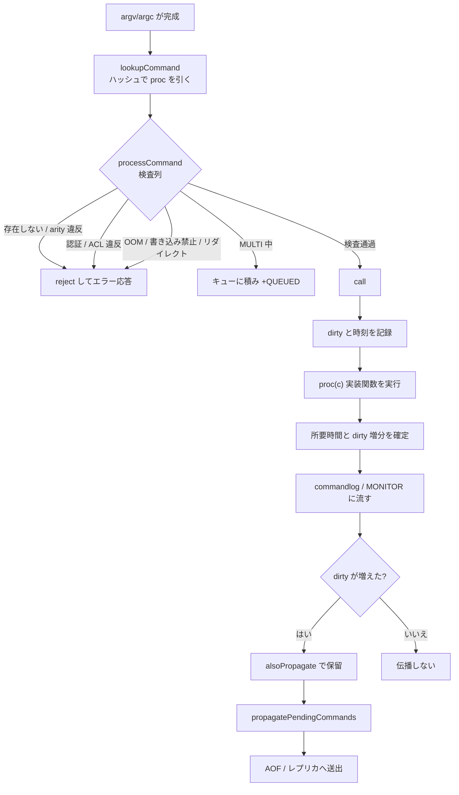

# 第27章 コマンド実行パイプライン

> **本章で読むソース**
>
> - [`src/server.c`](https://github.com/valkey-io/valkey/blob/9.1.0/src/server.c)
> - [`src/server.h`](https://github.com/valkey-io/valkey/blob/9.1.0/src/server.h)
> - [`src/commands.def`](https://github.com/valkey-io/valkey/blob/9.1.0/src/commands.def)

## この章の狙い

クライアントから届いた1つの要求が、どのコマンドの実装関数に振り分けられ、どんな検査を通り、どう実行され、その結果がどこへ伝わるのかを通して読む。
具体的には、コマンド名から実装を引く仕組み、`processCommand` の検査列、実行本体の `call`、変更を AOF とレプリカへ流す伝播の3段を扱う。
読み終えると、Valkey がコマンドあたりにかける固定的な処理の全体像と、その中に置かれた2つの最適化の機構が分かる。

## 前提

- [第24章 イベントループ](24-event-loop.md)：コマンド処理はイベントループのメインスレッド上で起きる。
- [第26章 RESP プロトコル](26-resp-protocol.md)：本章は引数配列 `c->argv`/`c->argc` が組み立て終わった地点から始まる。

## コマンドテーブルとハッシュ検索

コマンドの実体は、コマンド名から `struct serverCommand` への対応である。
`processCommand` が動き出す前に、まず「どの実装関数を呼ぶか」を名前から決めなければならない。
この対応表の各エントリが持つ情報を [`src/server.h` L2673-L2698](https://github.com/valkey-io/valkey/blob/9.1.0/src/server.h#L2673-L2698) で確認する。

```c
struct serverCommand {
    /* Declarative data */
    const char *declared_name;    /* A string representing the command declared_name. ... */
    // ... (中略) ...
    serverCommandProc *proc;        /* Command implementation */
    int arity;                      /* Number of arguments, it is possible to use -N to say >= N */
    uint64_t flags;                 /* Command flags, see CMD_*. */
    uint64_t acl_categories;        /* ACl categories, see ACL_CATEGORY_*. */
    commandDbIdArgs *get_dbid_args; /* Function to get database IDs used by this command */
    keySpec *key_specs;
    int key_specs_num;
    // ... (中略) ...
};
```

実行の判断に効く欄は4つである。
`proc` は実装関数へのポインタ、`arity` は引数の個数（負値は「N 個以上」を表す）、`flags` はコマンドの性質を表すビット集合（書き込みか、読み取り専用か、認証不要か、など）、`key_specs` はどの引数がキーかを宣言する仕様である。
これらは宣言的データであり、実装関数の中で参照されるのではなく、`processCommand` がコマンドを実行してよいかを判断する材料になる。

このテーブルは手書きではなく、コマンドごとの JSON 定義から自動生成される。
生成物が [`src/commands.def`](https://github.com/valkey-io/valkey/blob/9.1.0/src/commands.def) であり、冒頭にその旨が明記されている。

[`src/commands.def` L1-L7](https://github.com/valkey-io/valkey/blob/9.1.0/src/commands.def#L1-L7)

```c
/* Automatically generated by generate-command-code.py, do not edit. */
// ... (中略) ...
/* We have fabulous commands from
 * the fantastic
 * Command Table! */
```

テーブル本体は `serverCommandTable[]` という配列で、1行が1コマンドに対応する。
`GET` の行を見ると、`proc` が `getCommand`、`arity` が `2`、`flags` が `CMD_READONLY|CMD_FAST` と並ぶ。

[`src/commands.def` L12098](https://github.com/valkey-io/valkey/blob/9.1.0/src/commands.def#L12098)

```c
{MAKE_CMD("get","Returns the string value of a key.","O(1)","1.0.0",CMD_DOC_NONE,NULL,NULL,"string",COMMAND_GROUP_STRING,GET_History,0,GET_Tips,0,getCommand,2,CMD_READONLY|CMD_FAST,ACL_CATEGORY_FAST|ACL_CATEGORY_READ|ACL_CATEGORY_STRING,NULL,GET_Keyspecs,1,NULL,1),.args=GET_Args},
```

`GET` の `key_specs` には、別途生成された `GET_Keyspecs` が渡される。
これは「1番目の引数がキーで、読み取りアクセスである」ことを宣言する。

[`src/commands.def` L11190-L11192](https://github.com/valkey-io/valkey/blob/9.1.0/src/commands.def#L11190-L11192)

```c
keySpec GET_Keyspecs[1] = {
{NULL,CMD_KEY_RO|CMD_KEY_ACCESS,KSPEC_BS_INDEX,.bs.index={1},KSPEC_FK_RANGE,.fk.range={0,1,0}}
};
```

起動時に、この配列の各エントリは `populateCommandTable` でハッシュテーブル `server.commands` に登録される。

[`src/server.c` L3356-L3375](https://github.com/valkey-io/valkey/blob/9.1.0/src/server.c#L3356-L3375)

```c
void populateCommandTable(void) {
    int j;
    struct serverCommand *c;

    for (j = 0;; j++) {
        c = serverCommandTable + j;
        if (c->declared_name == NULL) break;
        // ... (中略) ...
        retval1 = hashtableAdd(server.commands, c);
        /* Populate an additional dictionary that will be unaffected
         * by rename-command statements in valkey.conf. */
        retval2 = hashtableAdd(server.orig_commands, c);
        serverAssert(retval1 && retval2);
    }
}
```

実行時にコマンド名を実装へ変換するのが `lookupCommand` であり、その中身は `lookupCommandLogic` のハッシュ検索である。

[`src/server.c` L3463-L3481](https://github.com/valkey-io/valkey/blob/9.1.0/src/server.c#L3463-L3481)

```c
struct serverCommand *lookupCommandLogic(hashtable *commands, robj **argv, int argc, int strict) {
    void *entry = NULL;
    bool found_command = hashtableFind(commands, objectGetVal(argv[0]), &entry);
    struct serverCommand *base_cmd = entry;
    bool has_subcommands = found_command && base_cmd->subcommands_ht;
    if (argc == 1 || !has_subcommands) {
        if (strict && argc != 1) return NULL;
        /* Note: It is possible that base_cmd->proc==NULL (e.g. CONFIG) */
        return base_cmd;
    } else { /* argc > 1 && has_subcommands */
        if (strict && argc != 2) return NULL;
        /* Note: Currently we support just one level of subcommands */
        return lookupSubcommand(base_cmd, objectGetVal(argv[1]));
    }
}

struct serverCommand *lookupCommand(robj **argv, int argc) {
    return lookupCommandLogic(server.commands, argv, argc, 0);
}
```

ここが本章で説明する最適化の1つ目である。
コマンド名からの検索を `hashtableFind` で行うため、登録コマンド数が増えても1コマンドの引き当てにかかる時間は平均で一定に保たれる。
コマンドはあらゆる要求で必ず1回引かれるので、この検索を線形走査ではなくハッシュにしておくことが、要求あたりの固定コストを小さく抑える。
`CONFIG GET` のように下位コマンドを持つ場合は、`subcommands_ht` をもう一段引いて子コマンドへ降りる。

なお、`server.commands` と並んで `server.orig_commands` にも同じエントリを登録している。
これは `valkey.conf` の `rename-command` でコマンド名を改名しても、改名前の名前から元の実装を引けるようにするためのもので、引数の書き換えなど内部処理がこちらを参照する。

## processCommand の検査列

コマンドが引けたら、実行に進む前に一連の前提条件を確認する。
この検査をまとめているのが `processCommand` である。

検査の目的は、実装関数 `proc` を呼んでよい状態かを保証することにある。
存在しないコマンドや引数の数が合わないコマンドをここで弾き、認証や権限、サーバの状態（メモリ上限、永続化の失敗、レプリカの読み取り専用、ローディング中、クラスタのスロット配置など）に照らして、その要求を今このノードで実行してよいかを判定する。
1つでも条件に外れれば、`reject` 系の関数でエラーを返し、`proc` には到達させない。

入口では、まずコマンドが見つかっているかを確認し、見つかっていれば `c->cmd` に確定させる。
直後に認証の確認が来る。
要求された接続が未認証なら、`CMD_NO_AUTH` が立つ `AUTH`/`HELLO` を除いて拒否する。

[`src/server.c` L4313-L4337](https://github.com/valkey-io/valkey/blob/9.1.0/src/server.c#L4313-L4337)

```c
        c->cmd = c->lastcmd = c->realcmd = cmd;

        if (authRequired(c)) {
            /* AUTH and HELLO and no auth commands are valid even in
             * non-authenticated state. */
            if (!c->cmd || !(c->cmd->flags & CMD_NO_AUTH)) {
                rejectCommand(c, shared.noautherr, 0);
                moduleFireCommandACLRejectedEvent(c, VALKEYMODULE_ACL_LOG_AUTH, -1);
                return C_OK;
            }
        }

        c->flag.buffered_reply = 0;
        sds err;

        if (!commandCheckExistence(c, &err)) {
            rejectCommandSds(c, err, 1);
            return C_OK;
        }
        if (c->read_flags & READ_FLAGS_BAD_ARITY) {
            /* Already detected this, but do it again just to get the error message. */
            serverAssert(!commandCheckArity(c->cmd, c->argc, &err));
            rejectCommandSds(c, err, 1);
            return C_OK;
        }
```

引数の数の検査は `commandCheckArity` が担う。
`arity` が正なら個数の完全一致、負なら絶対値以上を要求する。

[`src/server.c` L4185-L4195](https://github.com/valkey-io/valkey/blob/9.1.0/src/server.c#L4185-L4195)

```c
int commandCheckArity(struct serverCommand *cmd, int argc, sds *err) {
    if ((cmd->arity > 0 && cmd->arity != argc) || (argc < -cmd->arity)) {
        if (err) {
            *err = sdsnew(NULL);
            *err = sdscatprintf(*err, "wrong number of arguments for '%s' command", cmd->fullname);
        }
        return 0;
    }

    return 1;
}
```

ここから先は、コマンドの `flags` をまとめて読み取り、サーバの状態と突き合わせていく。
まず ACL の権限確認を行い、ユーザがこのコマンドとキーにアクセスできるかを判定する。

[`src/server.c` L4383-L4402](https://github.com/valkey-io/valkey/blob/9.1.0/src/server.c#L4383-L4402)

```c
    /* Check if the user can run this command according to the current
     * ACLs. */
    int acl_errpos;
    int acl_retval = ACLCheckAllPerm(c, &acl_errpos);
    if (acl_retval != ACL_OK) {
        addACLLogEntry(c, acl_retval, (c->flag.multi) ? ACL_LOG_CTX_MULTI : ACL_LOG_CTX_TOPLEVEL, acl_errpos, NULL,
                       NULL);
        sds msg = getAclErrorMessage(acl_retval, c->user, c->cmd, objectGetVal(c->argv[acl_errpos]), 0);
        rejectCommandFormat(c, 0, "-NOPERM %s", msg);
        // ... (中略) ...
        return C_OK;
    }
```

クラスタが有効なら、キーの所属スロットからこのノードが担当かを判定し、担当外なら `MOVED`/`ASK` のリダイレクトを返す。
このスロット計算は前段で `c->slot` に求めてある。

[`src/server.c` L4404-L4424](https://github.com/valkey-io/valkey/blob/9.1.0/src/server.c#L4404-L4424)

```c
    /* If cluster is enabled perform the cluster redirection here.
     * However we don't perform the redirection if:
     * 1) The sender of this command is our primary.
     * 2) The command has no key arguments. */
    if (server.cluster_enabled && !obey_client &&
        !(!(c->cmd->flags & CMD_MOVABLE_KEYS) && c->cmd->key_specs_num == 0 && c->cmd->proc != execCommand)) {
        int error_code;
        clusterNode *n = getNodeByQuery(c, &error_code);
        if (n == NULL || !clusterNodeIsMyself(n)) {
            // ... (中略) ...
            clusterRedirectClient(c, n, c->slot, error_code);
            c->duration = 0;
            c->cmd->rejected_calls++;
            moduleFireCommandRejectedEvent(c, NULL);
            return C_OK;
        }
    }
```

メモリ上限の検査は、`maxmemory` が設定されているときにメモリ退避を試み、退避しても足りないかどうかを `out_of_memory` に記録する。
そのうえで、メモリ使用を増やしうるコマンド（`CMD_DENYOOM` が立つ）だけを、メモリ不足のときに拒否する。

[`src/server.c` L4478-L4499](https://github.com/valkey-io/valkey/blob/9.1.0/src/server.c#L4478-L4499)

```c
    if (server.maxmemory && !isInsideYieldingLongCommand()) {
        int out_of_memory = (performEvictions() == EVICT_FAIL);
        // ... (中略) ...
        if (out_of_memory && is_denyoom_command) {
            if (c->slot_migration_job != NULL) {
                clusterHandleSlotMigrationClientOOM(c->slot_migration_job);
                return C_ERR;
            }

            rejectCommand(c, shared.oomerr, 1);
            return C_OK;
        }
        // ... (中略) ...
    }
```

この後にも、ディスク書き込みエラー時の書き込み拒否、書き込み可能なレプリカ数の不足、読み取り専用レプリカでの書き込み拒否、ローディング中の制限といった検査が続く。
いずれも `flags` とサーバ状態の組み合わせで判定し、外れれば `reject` してその場で戻る。
検査列の意図は一貫している。
コマンドの宣言的な性質（`flags` と `key_specs`）と、その瞬間のサーバの状態とを突き合わせ、安全に実行できると確認できたものだけを次段へ通す。

検査をすべて通過した要求は、最後に MULTI の状態で枝分かれする。
トランザクション中（`c->flag.multi`）で、かつ `EXEC` などの制御コマンドでなければ、ここでは実行せずキューに積んで `+QUEUED` を返す。
それ以外は `call` を呼んで実行する。

[`src/server.c` L4629-L4640](https://github.com/valkey-io/valkey/blob/9.1.0/src/server.c#L4629-L4640)

```c
    /* Exec the command */
    if (c->flag.multi && c->cmd->proc != execCommand && c->cmd->proc != discardCommand &&
        c->cmd->proc != quitCommand &&
        c->cmd->proc != resetCommand) {
        queueMultiCommand(c, cmd_flags);
        addReply(c, shared.queued);
    } else {
        int flags = CMD_CALL_FULL;
        call(c, flags);
        if (listLength(server.ready_keys) && !isInsideYieldingLongCommand()) handleClientsBlockedOnKeys();
    }
    return C_OK;
```

キューに積まれたコマンド群が後で `EXEC` によってまとめて `call` される流れは、第42章で扱う。

## 実行本体の call

`call` は、検査を通ったコマンドを実際に実行し、その実行に付随する統計と記録、伝播をまとめて行う関数である。
中心は実装関数の呼び出しだが、その前後で所要時間と変更件数を測り、`commandlog` と `MONITOR` に流し、最後に伝播の判断を下す。

実行の直前に、`server.dirty`（サーバ起動以来の累計変更件数）の現在値を控え、時刻を取る。
そして実装関数を呼ぶ。

[`src/server.c` L3860-L3896](https://github.com/valkey-io/valkey/blob/9.1.0/src/server.c#L3860-L3896)

```c
    /* Call the command. */
    dirty = server.dirty;
    long long old_primary_repl_offset = server.primary_repl_offset;
    incrCommandStatsOnError(NULL, 0);

    const ustime_t call_timer = ustime();
    enterExecutionUnit(1, call_timer);
    // ... (中略) ...
    c->cmd->proc(c);
```

`c->cmd->proc(c)` の1行が、`GET` なら `getCommand`、`SET` なら `setCommand` を呼ぶ箇所である。
コマンドごとの処理はすべてこの関数ポインタの先にあり、`call` 自身はどのコマンドかを知らずに共通の前後処理を回す。

実装関数から戻ると、所要時間を確定し、`dirty` の増分を求める。
この増分が、このコマンドがキー空間に加えた変更の件数である。

[`src/server.c` L3929-L3938](https://github.com/valkey-io/valkey/blob/9.1.0/src/server.c#L3929-L3938)

```c
    ustime_t duration;
    if (monotonicGetType() == MONOTONIC_CLOCK_HW)
        duration = getMonotonicUs() - monotonic_start;
    else
        duration = ustime() - call_timer;

    valkey_commands_trace(valkey_commands, command_call, connGetType(c->conn), getClientPeerId(c), getClientSockname(c), real_cmd->declared_name, duration);
    c->duration += duration;
    dirty = server.dirty - dirty;
    if (dirty < 0) dirty = 0;
```

測った所要時間は、まずレイテンシ統計に記録される。
続いて `commandlog` へ、その後 `MONITOR` 中のクライアントへ流す。
`commandlog` は実行に時間がかかったコマンドを記録する仕組みで、ここで現在のコマンドを登録する。

[`src/server.c` L3980-L3992](https://github.com/valkey-io/valkey/blob/9.1.0/src/server.c#L3980-L3992)

```c
    /* Log the command into the commandlog if needed.
     * If the client is blocked we will handle commandlog when it is unblocked. */
    if (update_command_stats && !c->flag.blocked) commandlogPushCurrentCommand(c, real_cmd);

    /* Send the command to clients in MONITOR mode if applicable,
     * since some administrative commands are considered too dangerous to be shown. ... */
    if (update_command_stats && !reprocessing_command && !(c->cmd->flags & (CMD_SKIP_MONITOR | CMD_ADMIN))) {
        robj **argv = c->original_argv ? c->original_argv : c->argv;
        int argc = c->original_argv ? c->original_argc : c->argc;
        replicationFeedMonitors(c, server.monitors, c->db->id, argv, argc);
    }
```

最後に、`call` はこのコマンドの実行結果を AOF とレプリカへ伝播するかを判断する。
ここで先ほど測った `dirty` の増分が効いてくる。

[`src/server.c` L4010-L4038](https://github.com/valkey-io/valkey/blob/9.1.0/src/server.c#L4010-L4038)

```c
    /* Propagate the command into the AOF and replication link. ... */
    if (flags & CMD_CALL_PROPAGATE && !c->flag.prevent_prop && c->cmd->proc != execCommand &&
        !(c->cmd->flags & CMD_MODULE)) {
        int propagate_flags = PROPAGATE_NONE;

        /* Check if the command operated changes in the data set. If so
         * set for replication / AOF propagation. */
        if (dirty) propagate_flags |= (PROPAGATE_AOF | PROPAGATE_REPL);

        /* If the client forced AOF / replication of the command, set
         * the flags regardless of the command effects on the data set. */
        if (c->flag.force_repl) propagate_flags |= PROPAGATE_REPL;
        if (c->flag.force_aof) propagate_flags |= PROPAGATE_AOF;
        // ... (中略) ...
        /* Call alsoPropagate() only if at least one of AOF / replication
         * propagation is needed. */
        if (propagate_flags != PROPAGATE_NONE) alsoPropagate(c->db->id, c->argv, c->argc, propagate_flags, c->slot);
    }
```

## 変更だけを伝播する

ここが2つ目の最適化である。
`if (dirty)` の判定により、実際にキー空間を変更したコマンドだけが伝播の対象になる。
`GET` のような読み取りや、`DEL` で存在しないキーを消そうとして1件も消えなかった場合は `dirty` が増えず、AOF にもレプリカにも何も流れない。

この機構が効く理由は、伝播の量を意味のある変更に絞れる点にある。
AOF にもレプリカにも、実際に状態を変えた操作だけを送れば、変更後の状態は再現できる。
読み取りや空振りまで送ればトラフィックとファイルサイズが膨らむが、`dirty` を基準にすればそれを避けられる。
書き込みコマンドであっても、結果として何も変わらなければ流さない、という判定が `flags` ではなく実行結果（`dirty`）に基づく点が要である。

伝播の入口は `alsoPropagate` で、流すコマンドを保留キュー `server.also_propagate` に積むだけである。

[`src/server.c` L3634-L3657](https://github.com/valkey-io/valkey/blob/9.1.0/src/server.c#L3634-L3657)

```c
void alsoPropagate(int dbid, robj **argv, int argc, int target, int slot) {
    robj **argvcopy;
    int j;

    if (!shouldPropagate(target)) return;
    // ... (中略) ...
    argvcopy = zmalloc(sizeof(robj *) * argc);
    for (j = 0; j < argc; j++) {
        argvcopy[j] = argv[j];
        incrRefCount(argv[j]);
    }
    serverOpArrayAppend(&server.also_propagate, dbid, argvcopy, argc, target, slot);
}
```

`alsoPropagate` を直接呼べば、実行したコマンドそのものではなく別のコマンドを伝播できる。
これは「書き換えて伝播する」ための仕組みである。
たとえば有効期限を相対時間で受け取ったコマンドは、レプリカや AOF には絶対時刻に直した形で流したい。
実装関数が `alsoPropagate` で書き換え後のコマンドを積み、元のコマンドの伝播を抑止すれば、各レプリカで同じ結果が再現される。

保留キューに積まれたコマンド群は、実行単位の終わりに `propagatePendingCommands` で実際に送り出される。
2つ以上のコマンドが積まれていれば、レプリカ側で原子的に適用されるよう `MULTI`/`EXEC` で囲んでから流す。

[`src/server.c` L3700-L3736](https://github.com/valkey-io/valkey/blob/9.1.0/src/server.c#L3700-L3736)

```c
static void propagatePendingCommands(void) {
    if (server.also_propagate.numops == 0) return;
    // ... (中略) ...
    int transaction = server.also_propagate.numops > 1;
    // ... (中略) ...
    if (transaction) {
        /* We use dbid=-1 to indicate we do not want to replicate SELECT. ... */
        propagateNow(-1, &shared.multi, 1, PROPAGATE_AOF | PROPAGATE_REPL, -1);
    }

    for (j = 0; j < server.also_propagate.numops; j++) {
        rop = &server.also_propagate.ops[j];
        serverAssert(rop->target);
        propagateNow(rop->dbid, rop->argv, rop->argc, rop->target, rop->slot);
    }

    if (transaction) {
        /* We use dbid=-1 to indicate we do not want to replicate select */
        propagateNow(-1, &shared.exec, 1, PROPAGATE_AOF | PROPAGATE_REPL, -1);
    }

    serverOpArrayFree(&server.also_propagate);
}
```

実際の送出は `propagateNow` で、`target` のビットに応じて AOF とレプリカ、必要ならスロット移行先へ同じコマンドを書き込む。

[`src/server.c` L3607-L3620](https://github.com/valkey-io/valkey/blob/9.1.0/src/server.c#L3607-L3620)

```c
    int propagate_to_aof = server.aof_state != AOF_OFF && target & PROPAGATE_AOF;
    // ... (中略) ...
    int propagate_to_repl = target & PROPAGATE_REPL;
    if (propagate_to_repl && !propagate_to_aof) {
        propagate_to_repl = server.primary_host == NULL && (server.repl_backlog || listLength(server.replicas) != 0);
    }
    int propagate_to_slot_migration = target & PROPAGATE_REPL && clusterIsAnySlotExporting();

    if (propagate_to_aof) feedAppendOnlyFile(dbid, argv, argc);
    if (propagate_to_repl) replicationFeedReplicas(dbid, argv, argc);
    if (propagate_to_slot_migration) clusterFeedSlotExportJobs(dbid, argv, argc, slot);
```

AOF への書き込みは第36章、レプリカへの送出は第38章でそれぞれ詳しく扱う。

## パイプラインの全体像

ここまでの流れを1枚の図にまとめる。



検査列で安全を確かめ、`call` で実行と計測を行い、変更があったときだけ伝播する。
この3段が、すべてのコマンドが通る共通の経路である。

## まとめ

- コマンドの実体は名前から `struct serverCommand`（`proc`/`arity`/`flags`/`key_specs`）への対応で、`commands.def` の `serverCommandTable[]` として JSON 定義から自動生成される。
- `lookupCommand` はこの表をハッシュテーブルで引く。コマンド数が増えても1回の検索コストが平均一定に保たれる点が、要求あたりの固定コストを抑える1つ目の最適化である。
- `processCommand` は、コマンドの宣言的な性質（`flags` と `key_specs`）とサーバの状態を突き合わせる検査列であり、存在、引数数、認証、ACL、OOM、書き込み禁止、クラスタリダイレクト、MULTI 中かを順に確認してから `call` へ通す。
- `call` は実装関数 `proc(c)` を呼び、所要時間と `dirty`（変更件数）の増分を測り、`commandlog` と `MONITOR` に流す。
- 実際にキー空間を変えた（`dirty` が増えた）コマンドだけを AOF とレプリカへ伝播する点が2つ目の最適化で、`alsoPropagate` を使えば書き換えた別コマンドを伝播することもできる。

## 関連する章

- [第28章 I/O スレッド](28-io-threads.md)：コマンドの引数解析やルックアップをメインスレッドから切り離す仕組み。
- [第36章 AOF](../part06-persistence/36-aof.md)：伝播されたコマンドがどう追記ファイルに書かれるか。
- [第38章 レプリケーション](../part07-replication-cluster/38-replication.md)：伝播されたコマンドがどうレプリカへ届くか。
- [第42章 トランザクション](../part08-features/42-transactions.md)：MULTI でキューに積まれたコマンドが EXEC で実行される流れ。
- [第50章 可観測性とデバッグ](../part09-ops-tools/50-observability-debug.md)：commandlog をはじめとする実行の記録と観測。
