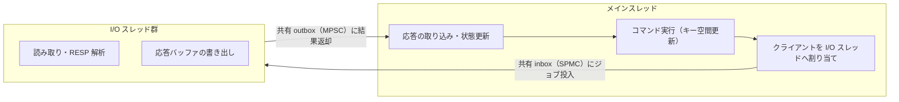

# 第28章 I/O スレッドとプリフェッチ

> **本章で読むソース**
>
> - [`src/io_threads.c`](https://github.com/valkey-io/valkey/blob/9.1.0/src/io_threads.c)
> - [`src/io_threads.h`](https://github.com/valkey-io/valkey/blob/9.1.0/src/io_threads.h)
> - [`src/queues.h`](https://github.com/valkey-io/valkey/blob/9.1.0/src/queues.h)
> - [`src/memory_prefetch.c`](https://github.com/valkey-io/valkey/blob/9.1.0/src/memory_prefetch.c)
> - [`src/networking.c`](https://github.com/valkey-io/valkey/blob/9.1.0/src/networking.c)

## この章の狙い

Valkey はコマンド実行を単一スレッドに保ちながら、ソケットの読み書きと RESP の解析を複数の I/O スレッドへ逃がす。
本章では、メインスレッドがクライアントを I/O スレッドへ割り当てる委譲の流れ、そのジョブをロックフリーなキューで受け渡す仕組み、そして実行直前にキーをキャッシュへ先読みするプリフェッチの二つの最適化を、実コードに沿って読む。

## 前提

- イベントループの構造と `beforeSleep` / `afterSleep` の呼び出し位置は[第24章 イベントループ](24-event-loop.md)で扱う。
- ソケットからの読み取りと書き出し、クライアント構造体の状態管理は[第25章 ネットワーク](25-networking.md)で扱う。
- コマンドの実行（キー空間の更新）の流れは[第27章 コマンド実行](27-command-execution.md)で扱う。

## なぜ I/O だけをスレッドに逃がすのか

Valkey のコマンド実行はキー空間を更新するため、複数スレッドで同時に走らせるとロックが必要になる。
そこで Valkey は、ロックを避けるために実行をメインスレッド一本に保つ。
一方、ソケットからのバイト列の読み取り、RESP プロトコルの解析、応答バッファの書き出しは、キー空間に触れない純粋な I/O 作業である。
この部分だけを複数の I/O スレッドに分担させれば、キー空間にロックを入れずに I/O を並列化できる。

I/O スレッドはデフォルトでは1本、つまり無効である。

[`src/config.c` L3379](https://github.com/valkey-io/valkey/blob/9.1.0/src/config.c#L3379)

```c
    createIntConfig("io-threads", NULL, DEBUG_CONFIG | MODIFIABLE_CONFIG, 1, IO_THREADS_MAX_NUM, server.io_threads_num, 1, INTEGER_CONFIG, NULL, updateIOThreads), /* Single threaded by default */
```

`io-threads` を2以上に設定すると、メインスレッドに加えて補助スレッドが起動する。
このスレッド群は読み取りと解析と書き出しを引き受けるが、コマンドの実行そのものは決して行わない。
実行は最後までメインスレッドに残る。

全体像を次の図に示す。



## 三種類のロックフリーキューでジョブを受け渡す

メインスレッドと I/O スレッドの間でジョブをやり取りするとき、共有データをミューテックスで囲むと、その取得と解放のたびに同期コストがかかる。
9.1.0 では、この通信モデルがロックフリーなキューへと作り直された。
リリースノートはこの変更を性能改善として記録している[^lockfree]。

[^lockfree]: `00-RELEASENOTES` の 9.1.0-rc2 の項に「Redesign IO threading communication model with lock-free queues (8-17% throughput gain) by @akashkgit (#3324)」とある。スループットの数値は環境に依存する目安である。

キューは生産者と消費者の人数に応じて三種類が使い分けられる。
それぞれの役割は `queues.h` の冒頭コメントに記されている。

[`src/queues.h` L1-L17](https://github.com/valkey-io/valkey/blob/9.1.0/src/queues.h#L1-L17)

```c
/*
 * Implements different types of queues
 *
 * 1. SPMC - Single Producer Multi Consumer
 *    - Automatic load balancing:
 *      Busy threads take less work, idle threads take more.
 *    - Each ring buffer cell is cache-line padded to prevent consumer contention.
 *    - Sequence numbers indicate empty/populated state for safe work claiming.
 *
 * 2. Multi Producer Single Consumer
 *    - Producer threads push jobs; consumer thread checks if queue is non-empty.
 *    - Producer threads reserve slots via atomic tail increment.
 *    - If full, jobs are buffered locally until space is available.
 *
 * 3. SPSC - Single Producer Single Consumer
 *    - Allows producer to batch jobs
 */
```

`io_threads.c` はこの三種を、通信の向きに合わせて配置する。

[`src/io_threads.c` L22-L27](https://github.com/valkey-io/valkey/blob/9.1.0/src/io_threads.c#L22-L27)

```c
// Main -> IO: Shared Queue (Single Producer Multi Consumer) where all IO threads pull jobs from
static spmcQueue io_shared_inbox = {0};
// IO -> Main: Response Channel (Multi Producer Single Consumer) used by IO threads to send results back to main-thread
static mpscQueue io_shared_outbox = {0};
// Main -> IO (Thread-Specific) for tasks that must run on specific IO thread where IO threads check their private inbox before the shared queue
static spscQueue io_private_inbox[IO_THREADS_MAX_NUM] = {0};
```

メインからすべての I/O スレッドへ向かう共有 inbox は、生産者がメイン一本で消費者が複数なので **SPMC**（単一生産者かつ複数消費者）である。
I/O スレッドからメインへ結果を返す outbox は、生産者が複数でメインが一本の消費者なので **MPSC**（複数生産者かつ単一消費者）になる。
さらに、特定の I/O スレッドに必ず処理させたいジョブのために、スレッドごとの専用 inbox を **SPSC**（単一生産者かつ単一消費者）で用意する。

キューに積むのはジョブを指すポインタである。
ジョブの種類は別フィールドを持たず、ポインタの下位3ビットに埋め込まれる。
`zmalloc` が返すポインタは8バイト境界に整列しているため、下位3ビットは常に0であり、ここを型タグに転用できる。

[`src/io_threads.c` L33-L46](https://github.com/valkey-io/valkey/blob/9.1.0/src/io_threads.c#L33-L46)

```c
/* Job Types for Tagged Pointers
 * We use the lower 3 bits of the pointer to store the job type.
 * Requires data pointers to be 8-byte aligned (standard for zmalloc/ptrs). */
#define JOB_TAG_MASK 0x7
#define JOB_PTR_MASK (~(uintptr_t)JOB_TAG_MASK)

static inline void *tagJob(void *ptr, int type) {
    return (void *)((uintptr_t)ptr | type);
}

static inline void untagJob(void *tagged_ptr, void **ptr, int *type) {
    *type = (int)((uintptr_t)tagged_ptr & JOB_TAG_MASK);
    *ptr = (void *)((uintptr_t)tagged_ptr & JOB_PTR_MASK);
}
```

ジョブの型を3ビットに収める制約は、列挙型の要素数を静的検査で縛ることで守られている（[`src/io_threads.h` L13-L15](https://github.com/valkey-io/valkey/blob/9.1.0/src/io_threads.h#L13-L15) の `_Static_assert`）。

## メインスレッドからの委譲

メインスレッドは、クライアントの読み取りまたは書き出しを I/O スレッドへ逃がせるかどうかを判断し、可能なら共有 inbox にジョブを積む。
読み取りの委譲を行うのが `trySendReadToIOThreads` である。

[`src/io_threads.c` L501-L532](https://github.com/valkey-io/valkey/blob/9.1.0/src/io_threads.c#L501-L532)

```c
int trySendReadToIOThreads(client *c) {
    if (server.active_io_threads_num <= 1) return C_ERR;
    /* If IO thread is already reading, return C_OK to make sure the main thread will not handle it. */
    if (c->io_read_state != CLIENT_IDLE) return C_OK;
    if (c->io_write_state == CLIENT_PENDING_IO) return C_OK;
    /* For simplicity, don't offload replica clients reads as read traffic from replica is negligible */
    if (getClientType(c) == CLIENT_TYPE_REPLICA) return C_ERR;
    // ... (中略) ...
    c->io_read_state = CLIENT_PENDING_IO;
    connSetPostponeUpdateState(c->conn, 1);

    if (unlikely(spmcEnqueue(&io_shared_inbox, tagJob(c, JOB_REQ_READ_CLIENT)) == false)) {
        c->read_flags = 0;
        c->io_read_state = CLIENT_IDLE;
        connSetPostponeUpdateState(c->conn, 0);
        return C_ERR;
    }

    io_jobs_submitted++;
    server.stat_io_reads_pending++;
    c->flag.pending_read = 1;
    return C_OK;
}
```

最初の関門は `active_io_threads_num <= 1` の判定である。
アクティブな I/O スレッドが自分一本だけなら委譲先がないので `C_ERR` を返し、メインスレッド自身が読む。
委譲できる場合は、クライアントの読み取り状態を `CLIENT_PENDING_IO` に進め、`spmcEnqueue` で共有 inbox にジョブを積む。
`spmcEnqueue` が満杯で失敗したときは状態を `CLIENT_IDLE` に巻き戻し、メインスレッドが処理にまわる。

このオフロードを呼び出すのは、ネットワーク層の `postponeClientRead` である。
読み取りイベントが発火したクライアントを、メインで読むか I/O スレッドに渡すかをここで切り替える。
詳しい読み取りハンドラの登録は[第25章 ネットワーク](25-networking.md)で扱う。

書き出しの委譲も同じ形をとる。
`trySendWriteToIOThreads` は、応答が残っているクライアントの書き出しジョブを共有 inbox に積む。

[`src/io_threads.c` L556-L576](https://github.com/valkey-io/valkey/blob/9.1.0/src/io_threads.c#L556-L576)

```c
        /* Save the last block of the reply list to io_last_reply_block and the used
         * position to io_last_bufpos. The I/O thread will write only up to
         * io_last_bufpos, regardless of the c->bufpos value. This is to prevent I/O
         * threads from reading data that might be invalid in their local CPU cache. */
        c->io_last_reply_block = listLast(c->reply);
        if (c->io_last_reply_block) {
            block = (clientReplyBlock *)listNodeValue(c->io_last_reply_block);
            c->io_last_bufpos = block->used;
        } else {
            c->io_last_bufpos = (size_t)c->bufpos;
        }
    }

    serverAssert(c->bufpos > 0 || c->io_last_bufpos > 0 || is_replica);

    /* The main-thread will update the client state after the I/O thread completes the write. */
    connSetPostponeUpdateState(c->conn, 1);
    c->write_flags = is_replica ? WRITE_FLAGS_IS_REPLICA : 0;
    c->io_write_state = CLIENT_PENDING_IO;
    void *job = tagJob(c, JOB_REQ_WRITE_CLIENT);
    if (unlikely(spmcEnqueue(&io_shared_inbox, job) == false)) {
```

書き出しを逃がすとき、メインスレッドは応答リストの末尾ブロックと、そのブロックで使用済みの位置 `io_last_bufpos` を控える。
I/O スレッドは `c->bufpos` ではなくこの控えた位置までしか書かない。
コメントが述べるとおり、この限界を設けるのは、I/O スレッドのローカル CPU キャッシュにまだ反映されていない、メインスレッド側の追記途中のデータを読まないためである。

`trySendWriteToIOThreads` は複数の地点から呼ばれる。
イベントループ末尾でまとめて応答を書き出す `handleClientsWithPendingWrites` がその一つである。

[`src/networking.c` L3295-L3301](https://github.com/valkey-io/valkey/blob/9.1.0/src/networking.c#L3295-L3301)

```c
        if (!clientHasPendingReplies(c)) continue;

        /* If we can send the client to the I/O thread, let it handle the write. */
        if (trySendWriteToIOThreads(c) == C_OK) continue;

        /* We can't write to the client while IO operation is in progress. */
        if (c->io_write_state != CLIENT_IDLE) continue;
```

委譲に成功すれば `continue` で次のクライアントへ進み、メインスレッドはそのクライアントの書き出しに時間を使わない。
失敗したときだけ、メインスレッドが自分で `writeToClient` を呼ぶ。

## I/O スレッドの本体

起動した I/O スレッドは `IOThreadMain` の無限ループでジョブを待ち受ける。
ループは二段の優先順位でキューを引く。

[`src/io_threads.c` L309-L362](https://github.com/valkey-io/valkey/blob/9.1.0/src/io_threads.c#L309-L362)

```c
        /* PRIORITY 1: Drain Private SPSC Queue (Batch Processing) */
        while ((batch_count = spscDequeueBatch(&io_private_inbox[id], batch_jobs, BATCH_SIZE)) > 0) {
            for (size_t i = 0; i < batch_count; i++) {
                void *data;
                int type;
                untagJob(batch_jobs[i], &data, &type);

                switch (type) {
                case JOB_REQ_FREE_ARGV:
                    ioThreadFreeArgv((robj **)data);
                    break;
                // ... (中略) ...
                }
            }
            processed += batch_count;
        }

        /* PRIORITY 2: Shared Global Queue (SPMC)
         * Only checked after SPSC is drained. */
        void *tagged_job = spmcDequeue(&io_shared_inbox);
        if (tagged_job) {
            void *data;
            int type;
            untagJob(tagged_job, &data, &type);

            switch (type) {
            case JOB_REQ_READ_CLIENT:
                ioThreadReadQueryFromClient((client *)data);
                break;
            case JOB_REQ_WRITE_CLIENT:
                ioThreadWriteToClient((client *)data);
                break;
            // ... (中略) ...
            }
            processed++;
        }

        if (processed) {
            atomic_fetch_add_explicit(&io_jobs_finished, processed, memory_order_release);
        }
```

スレッドはまず自分専用の SPSC inbox をバッチで引き、それが空になってから共有 SPMC inbox を一件引く。
専用 inbox を先に処理するのは、特定スレッドに割り当てられたジョブ（後述の引数解放やポーリング）の遅延を抑えるためである。
処理を終えた件数は `io_jobs_finished` にアトミックに足し込まれ、メインスレッドが未処理ジョブ数を知る手がかりになる。

読み取りジョブを引いたスレッドは `ioThreadReadQueryFromClient` を実行する。
ここでソケットからの読み取りと RESP 解析が行われる。

[`src/networking.c` L6554-L6603](https://github.com/valkey-io/valkey/blob/9.1.0/src/networking.c#L6554-L6603)

```c
void ioThreadReadQueryFromClient(client *c) {
    serverAssert(c->io_read_state == CLIENT_PENDING_IO);

    /* Read */
    readToQueryBuf(c);
    // ... (中略) ...
    parseInputBuffer(c);
    trimCommandQueue(c);
    prepareCommandQueue(c);
    // ... (中略) ...
done:
    // ... (中略) ...
    c->io_read_state = CLIENT_COMPLETED_IO;
    c->cur_tid = getCurTid();
    sendToMainThread(c, JOB_RES_READ_CLIENT);
}
```

読み取りと解析が済むと状態を `CLIENT_COMPLETED_IO` に進め、`sendToMainThread` で結果を outbox に積む。
このとき、自分のスレッド番号 `cur_tid` をクライアントに記録する。
後で引数を解放するジョブを、同じスレッドの専用 inbox に投げるための情報である。

書き出しジョブのほうは `ioThreadWriteToClient` が処理し、レプリカ向けかどうかで分岐したうえでソケットへ書き、やはり `sendToMainThread` で完了を返す（[`src/networking.c` L6605-L6616](https://github.com/valkey-io/valkey/blob/9.1.0/src/networking.c#L6605-L6616)）。
どちらのジョブも、I/O スレッドはキー空間に触れない。

両方のキューが空でジョブがなかったとき、スレッドはミューテックスでブロックして待つ。

[`src/io_threads.c` L364-L373](https://github.com/valkey-io/valkey/blob/9.1.0/src/io_threads.c#L364-L373)

```c
        /* If both queues were empty (no processing done), wait for signal. */
        if (processed == 0) {
            if (unlikely(pending_io_responses)) {
                flushPendingIOResponses(0);
            } else {
                /* If it is locked. We should block until main thread unlocks it. */
                pthread_mutex_lock(&io_threads_mutex[id]);
                pthread_mutex_unlock(&io_threads_mutex[id]);
            }
        }
```

ここでミューテックスが登場するが、これはジョブの受け渡しを保護するためのものではない。
スレッドごとに1本ある `io_threads_mutex[id]` は、そのスレッドを休止させるか起こすかを切り替えるためだけに使う。
メインスレッドがこのミューテックスをロックしている間、対応する I/O スレッドはここで停止する。
ジョブそのものはロックフリーなキューを通るので、稼働中のスレッドが共有データの取得で待つことはない。

## メインスレッドへの結果の取り込み

I/O スレッドが outbox に積んだ結果は、メインスレッドが `processIOThreadsResponses` でまとめて引き取る。
この関数はイベントループの `beforeSleep` から呼ばれ（[`src/server.c` L1844](https://github.com/valkey-io/valkey/blob/9.1.0/src/server.c#L1844)）、読み取り完了と書き出し完了を仕分ける。

[`src/io_threads.c` L891-L905](https://github.com/valkey-io/valkey/blob/9.1.0/src/io_threads.c#L891-L905)

```c
            for (int i = 0; i < dequeued_count; i++) {
                void *data;
                int job_type;
                untagJob(jobs[i], &data, &job_type);
                client *c = (client *)data;
                if (job_type == JOB_RES_READ_CLIENT) {
                    serverAssert(c->io_read_state == CLIENT_COMPLETED_IO);
                    read_jobs[read_count++] = c;
                } else if (job_type == JOB_RES_WRITE_CLIENT) {
                    serverAssert(c->io_write_state == CLIENT_COMPLETED_IO);
                    write_jobs[write_count++] = c;
                } else {
                    serverPanic("Unknown job type %d", job_type);
                }
            }
```

読み取り完了のクライアントは、`processClientIOReadsDone` で状態を整えられたのち、コマンド実行へ進む。
ここがプリフェッチの入口になる。

## プリフェッチ：実行直前にキーを先読みする

コマンド実行は単一スレッドなので、実行中にキーがメインメモリにしかなくキャッシュに乗っていなければ、メインスレッドはキャッシュミスのたびにメモリ待ちで止まる。
この待ち時間を隠すのが `memory_prefetch` である。
ファイル冒頭のコメントが目的を述べている。

[`src/memory_prefetch.c` L6-L9](https://github.com/valkey-io/valkey/blob/9.1.0/src/memory_prefetch.c#L6-L9)

```c
/*
 * This file utilizes prefetching keys and data for multiple commands in a batch,
 * to improve performance by amortizing memory access costs across multiple operations.
 */
```

仕組みの核は、複数クライアントの読み取り完了をひとまとめのバッチにし、そのバッチが触るキーをまとめて先読みすることにある。
読み取りが済んだクライアントは、`processClientIOReadsDone` の末尾で `addCommandToBatchAndProcessIfFull` を通じてバッチに加えられる。

[`src/networking.c` L6492-L6497](https://github.com/valkey-io/valkey/blob/9.1.0/src/networking.c#L6492-L6497)

```c
    /* try to add the command to the batch */
    int ret = addCommandToBatchAndProcessIfFull(c);
    /* If the command was not added to the commands batch, process it immediately */
    if (ret == C_ERR) {
        if (processPendingCommandAndInputBuffer(c) == C_OK) beforeNextClient(c);
    }
```

`addCommandToBatchAndProcessIfFull` は、クライアントの解析済みコマンドからキーを取り出してバッチに登録する。
バッチが満杯になると `processClientsCommandsBatch` を呼ぶ（[`src/memory_prefetch.c` L263-L290](https://github.com/valkey-io/valkey/blob/9.1.0/src/memory_prefetch.c#L263-L290)）。
バッチの上限は `prefetch-batch-max-size` で、既定は16である（[`src/config.c` L3383](https://github.com/valkey-io/valkey/blob/9.1.0/src/config.c#L3383)）。

`processClientsCommandsBatch` は、まずバッチ全体のプリフェッチを発行してから、コマンドを順に実行する。

[`src/memory_prefetch.c` L217-L243](https://github.com/valkey-io/valkey/blob/9.1.0/src/memory_prefetch.c#L217-L243)

```c
void processClientsCommandsBatch(void) {
    if (!batch || batch->client_count == 0) return;

    /* If executed_commands is not 0,
     * it means that we are in the middle of processing a batch and this is a recursive call */
    if (batch->executed_commands == 0) {
        prefetchCommands();
    }

    /* Process the commands */
    for (size_t i = 0; i < batch->client_count; i++) {
        client *c = batch->clients[i];
        if (c == NULL) continue;

        /* Set the client to null immediately to avoid accessing it again recursively when ProcessingEventsWhileBlocked */
        batch->clients[i] = NULL;
        batch->executed_commands++;
        if (processPendingCommandAndInputBuffer(c) != C_ERR) beforeNextClient(c);
    }

    resetCommandsBatch();
    // ... (中略) ...
}
```

先読みの本体 `prefetchCommands` は、引数オブジェクト、引数の文字列本体、そしてキーが入っているハッシュテーブルの該当領域を順にキャッシュへ引き寄せる。

[`src/memory_prefetch.c` L181-L214](https://github.com/valkey-io/valkey/blob/9.1.0/src/memory_prefetch.c#L181-L214)

```c
static void prefetchCommands(void) {
    /* Prefetch argv's for all clients */
    for (size_t i = 0; i < batch->client_count; i++) {
        client *c = batch->clients[i];
        if (!c || c->argc <= 1) continue;
        /* Skip prefetching first argv (cmd name) it was already looked up by the I/O thread. */
        for (int j = 1; j < c->argc; j++) {
            valkey_prefetch(c->argv[j]);
        }
    }
    // ... (中略) ...
    /* Prefetch hashtable keys for all commands. Prefetching is beneficial only if there are more than one key. */
    if (batch->key_count > 1) {
        server.stat_total_prefetch_batches++;
        /* Prefetch keys from the main hashtable */
        hashtablePrefetch(batch->keys_tables);
    }
}
```

`valkey_prefetch` は CPU のプリフェッチ命令である。
ビルド環境が対応していれば `__builtin_prefetch` に展開され、そうでなければ何もしない。

[`src/config.h` L381-L385](https://github.com/valkey-io/valkey/blob/9.1.0/src/config.h#L381-L385)

```c
#if HAS_BUILTIN_PREFETCH
#define valkey_prefetch(addr) __builtin_prefetch(addr)
#else
#define valkey_prefetch(addr) ((void)(addr))
#endif
```

プリフェッチ命令はデータの到着を待たない。
発行するとデータの読み込みが背後で始まり、命令を出した側はそのまま次の処理に進める。
バッチ内のすべてのキーについて先にこの命令を出しておけば、最初のキーのデータがメモリから運ばれている間に、次のキーのプリフェッチが発行できる。
ハッシュテーブルでのキー探索が、空振りせずキャッシュに乗ったデータに当たる確率が上がる。
これが、単一スレッド実行のキャッシュミス待ちを隠す機構である。

ハッシュテーブルのキー探索を1ステップずつ進めながら先読みするのが `hashtablePrefetch` である。
探索はノードをたどるたびにキャッシュミスを起こしうるため、`hashtableIncrementalFindStep` で一段進めてはバッチ内の次のキーへ移り、各キーの探索を交互に進める（[`src/memory_prefetch.c` L122-L168](https://github.com/valkey-io/valkey/blob/9.1.0/src/memory_prefetch.c#L122-L168)）。
あるキーのノード読み込みがメモリから運ばれている間に、別のキーの先読みを発行できるため、複数キーのメモリ待ちが重なって隠れる。

`hashtable.c` のインクリメンタルな探索 API と、それを支えるリハッシュの仕組みは[第7章 hashtable](../part01-data-structures/07-hashtable.md)で扱う。

プリフェッチがバッチ単位で意味を持つのは、I/O スレッドが複数クライアントの読み取りを並行に終わらせ、その完了がまとめてメインスレッドに戻ってくるからである。
委譲とプリフェッチという二つの最適化は、こうしてバッチ処理を介してつながっている。

## I/O スレッド数の動的調整

I/O スレッドは、起動時にすべて稼働させるのではなく、負荷に応じて本数を増減させる。
有効化されていても、最初はメインスレッド一本だけがアクティブな状態から始まる。

[`src/io_threads.c` L483-L493](https://github.com/valkey-io/valkey/blob/9.1.0/src/io_threads.c#L483-L493)

```c
    if (!io_threads_initialized) {
        server.active_io_threads_num = 1; /* We start with threads not active. */
        server.io_poll_state = AE_IO_STATE_NONE;
        server.io_ae_fired_events = 0;
        spmcInit(&io_shared_inbox, IO_SPMC_QUEUE_SIZE);
        mpscInit(&io_shared_outbox, IO_MPSC_QUEUE_SIZE);
        io_jobs_submitted = 0;
        atomic_init(&io_jobs_finished, 0);
        prefetchCommandsBatchInit();
        io_threads_initialized = 1;
    }
```

本数の調整は、イベントループのスリープ明けに呼ばれる `IOThreadsAfterSleep` が担う。
判断は二段階に分かれている。
アクティブが一本だけのときは「点火」を判断し、二本以上動いているときは「増減」を判断する。

点火の条件は、メインスレッドのアクティブ時間の割合がしきい値（30%）を超えることである。

[`src/io_threads.c` L166-L179](https://github.com/valkey-io/valkey/blob/9.1.0/src/io_threads.c#L166-L179)

```c
    /* Ignition Policy */
    if (server.active_io_threads_num == 1) {
        int should_ignite = 0;
        float main_thread_active_time = (float)getInstantaneousMetric(STATS_METRIC_MAIN_THREAD_ACTIVE_TIME) / 10000.0;
        /* Ignite IO threads when main-thread active time exceeds the threshold (30%) */
        should_ignite = (main_thread_active_time > (float)IO_IGNITION_MAIN_THREAD_ACTIVE_PERCENT);
        if (should_ignite) {
            pthread_mutex_unlock(&io_threads_mutex[1]);
            server.active_io_threads_num++;
            last_scale_time = now;
            serverLog(LL_DEBUG, "IO threads ignition: increased to %d", server.active_io_threads_num);
        }
        return;
    }
```

メインスレッドが暇なうちは I/O スレッドを起こさず、忙しくなって初めて二本目を点火する。
スレッドを起こす操作は、休止用のミューテックスを `pthread_mutex_unlock` で解放することで行う。
これで該当スレッドが `IOThreadMain` のブロック地点から動き出す。

二本以上が動いているときは、共有 inbox にたまったジョブ数の平均でスケールを決める。

[`src/io_threads.c` L202-L207](https://github.com/valkey-io/valkey/blob/9.1.0/src/io_threads.c#L202-L207)

```c
    /* Calculate Target */
    if (avg_q_size > 1 && active < (size_t)server.io_threads_num) {
        target++;
    } else if (avg_q_size == 0 && (now - last_scale_time > IO_COOLDOWN_MS)) {
        if (target > 1) target--;
    }
```

inbox に積み残しがあれば、I/O スレッドが追いついていないと見て1本増やす。
inbox が空のまま冷却期間（1秒）が過ぎていれば、余っていると見て1本減らす。
キューの長さという観測できる量を使い、I/O が詰まったときだけスレッドを足す設計である。

スリープ前の `IOThreadsBeforeSleep` では、未確定の専用 inbox を `commitIOJobs` で公開し、書き込みポインタの更新をまとめて行う（[`src/io_threads.c` L113-L137](https://github.com/valkey-io/valkey/blob/9.1.0/src/io_threads.c#L113-L137)）。
イベントループのどこでこれらが呼ばれるかは[第24章 イベントループ](24-event-loop.md)で扱う。

## まとめ

- コマンド実行はメインスレッド一本に保ち、キー空間に触れない読み取りと RESP 解析と書き出しだけを I/O スレッドへ逃がす。これでロックなしに I/O を並列化する。
- メインから I/O への共有 inbox は SPMC、I/O からメインへの outbox は MPSC、特定スレッド向けの専用 inbox は SPSC と、生産者と消費者の人数に合わせた三種のロックフリーキューでジョブを受け渡し、同期コストを抑える。9.1.0 でこの通信モデルがロックフリー化された。
- ジョブはタグ付きポインタで表し、種類をポインタ下位3ビットに埋め込む。8バイト整列を前提にした省メモリな表現である。
- プリフェッチは、複数クライアントの読み取り完了をバッチにまとめ、実行直前に引数とキーをまとめて CPU プリフェッチ命令でキャッシュへ引き寄せる。単一スレッド実行のキャッシュミス待ちを隠す。
- I/O スレッド数は固定せず、メインスレッドの稼働率と共有 inbox の滞留量に応じて、休止用ミューテックスの解放と取得で増減させる。

## 関連する章

- [第24章 イベントループ](24-event-loop.md)：`beforeSleep` / `afterSleep` での I/O スレッド連携の呼び出し位置。
- [第25章 ネットワーク](25-networking.md)：読み書きハンドラとクライアント状態管理。
- [第27章 コマンド実行](27-command-execution.md)：バッチ後に走るコマンド実行の流れ。
- [第7章 hashtable](../part01-data-structures/07-hashtable.md)：プリフェッチが利用するインクリメンタルなキー探索。
