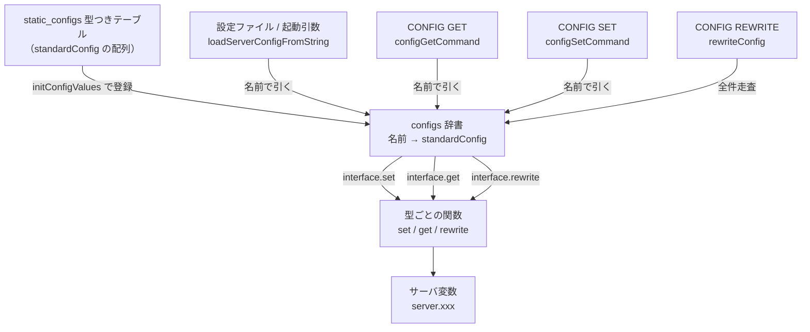

# 第29章 設定管理

> **本章で読むソース**
>
> - [`src/config.c`](https://github.com/valkey-io/valkey/blob/9.1.0/src/config.c)
> - [`src/config.h`](https://github.com/valkey-io/valkey/blob/9.1.0/src/config.h)
> - [`src/server.h`](https://github.com/valkey-io/valkey/blob/9.1.0/src/server.h)（設定フラグと設定型の宣言）

## この章の狙い

Valkey の設定項目は 200 を超える。
それでも設定ごとに読み込み、取得、更新、ファイル書き戻しのコードを書く必要はない。
本章では、すべての設定を一つの型つきテーブル `static_configs[]` に宣言し、設定ファイルの読み込みと `CONFIG GET`/`SET`/`REWRITE` がそのテーブルを共通の入口として処理する仕組みを読む。
新しい設定を足すときに表へ一行を加えるだけで済む理由を、機構のレベルで理解できるようにする。

## 前提

設定が起動シーケンスのどこで読まれるかは第3章を参照する。

- [第3章 Hello Valkey](../part00-introduction/03-hello-valkey.md)
- [第27章 コマンド実行](27-command-execution.md)（`CONFIG` もコマンドの一つとして実行される）

## 設定を一つの表に集める

Valkey の設定管理は、設定項目を記述したデータと、その記述を解釈する汎用コードを分離する。
記述側が `static_configs[]` という配列で、各要素が一個の設定を表す `standardConfig` 構造体である。

[`src/config.c` L299-L307](https://github.com/valkey-io/valkey/blob/9.1.0/src/config.c#L299-L307)

```c
struct standardConfig {
    const char *name;        /* The user visible name of this config */
    const char *alias;       /* An alias that can also be used for this config */
    unsigned int flags;      /* Flags for this specific config */
    typeInterface interface; /* The function pointers that define the type interface */
    typeData data;           /* The type specific data exposed used by the interface */
    configType type;         /* The type of config this is. */
    void *privdata;          /* privdata for this config, for module configs this is a ModuleConfig struct */
};
```

`standardConfig` の要点は二つある。
一つは `interface`で、これは設定の型ごとに振る舞いを切り替える関数ポインタの束である。
もう一つは `data`で、これは設定値そのものが格納されたサーバ変数へのポインタと、既定値や上下限などのメタ情報を持つ。

`interface` の中身は `typeInterface` で定義される。
起動時の初期化、値の設定、値の取得、ファイルへの書き戻しの四つを担う関数ポインタを持つ。

[`src/config.c` L282-L297](https://github.com/valkey-io/valkey/blob/9.1.0/src/config.c#L282-L297)

```c
typedef struct typeInterface {
    /* Called on server start, to init the server with default value */
    void (*init)(standardConfig *config);
    /* Called on server startup and CONFIG SET, returns 1 on success,
     * 2 meaning no actual change done, 0 on error and can set a verbose err
     * string */
    int (*set)(standardConfig *config, sds *argv, int argc, const char **err);
    /* Optional: called after `set()` to apply the config change. Used only in
     * the context of CONFIG SET. Returns 1 on success, 0 on failure.
     * Optionally set err to a static error string. */
    apply_fn apply;
    /* Called on CONFIG GET, returns sds to be used in reply */
    sds (*get)(standardConfig *config);
    /* Called on CONFIG REWRITE, required to rewrite the config state */
    void (*rewrite)(standardConfig *config, const char *name, struct rewriteConfigState *state);
} typeInterface;
```

設定の型は `configType` 列挙で表される。
真偽値、数値、文字列、SDS、列挙、そして表の枠に収まらない特殊型がある。

[`src/server.h` L3656-L3664](https://github.com/valkey-io/valkey/blob/9.1.0/src/server.h#L3656-L3664)

```c
/* Type of configuration. */
typedef enum {
    BOOL_CONFIG,
    NUMERIC_CONFIG,
    STRING_CONFIG,
    SDS_CONFIG,
    ENUM_CONFIG,
    SPECIAL_CONFIG,
} configType;
```

型ごとの `data` は共用体 `typeData` にまとめられ、`type` の値でどのメンバが有効かが決まる。
真偽値なら値ポインタ、既定値、検証関数を、数値なら加えて型タグと上下限を持つ。

[`src/config.c` L271-L277](https://github.com/valkey-io/valkey/blob/9.1.0/src/config.c#L271-L277)

```c
typedef union typeData {
    boolConfigData yesno;
    stringConfigData string;
    sdsConfigData sds;
    enumConfigData enumd;
    numericConfigData numeric;
} typeData;
```

この設計が効くのは、読み込みも `CONFIG GET`/`SET`/`REWRITE` も、設定の名前で表を引いて `interface` の関数ポインタを呼ぶだけで済むからである。
処理側は設定が真偽値か数値かを知らなくてよい。
型ごとの差は `interface` に閉じ込められ、共通コードは型に依存しない。
全体の関係を図にすると次のようになる。



## 登録マクロが行を生む

`static_configs[]` の一行は、型ごとの登録マクロで書く。
真偽値設定なら `createBoolConfig` を使い、名前、別名、フラグ、格納先のサーバ変数、既定値、検証関数、適用関数を並べる。

[`src/config.c` L3260-L3268](https://github.com/valkey-io/valkey/blob/9.1.0/src/config.c#L3260-L3268)

```c
standardConfig static_configs[] = {
    /* Bool configs */
    createBoolConfig("rdbchecksum", NULL, IMMUTABLE_CONFIG, server.rdb_checksum, 1, NULL, NULL),
    createBoolConfig("daemonize", NULL, IMMUTABLE_CONFIG, server.daemonize, 0, NULL, NULL),
    createBoolConfig("always-show-logo", NULL, IMMUTABLE_CONFIG, server.always_show_logo, 0, NULL, NULL),
    createBoolConfig("protected-mode", NULL, MODIFIABLE_CONFIG, server.protected_mode, 1, NULL, NULL),
    createBoolConfig("rdbcompression", NULL, MODIFIABLE_CONFIG, server.rdb_compression, 1, NULL, NULL),
    createBoolConfig("rdb-del-sync-files", NULL, MODIFIABLE_CONFIG, server.rdb_del_sync_files, 0, NULL, NULL),
    createBoolConfig("activerehashing", NULL, MODIFIABLE_CONFIG, server.activerehashing, 1, NULL, NULL),
```

マクロの正体は `standardConfig` のリテラル初期化子である。
`createBoolConfig` は、真偽値型に固定した `interface`（`boolConfigInit`/`boolConfigSet`/`boolConfigGet`/`boolConfigRewrite`）を埋め込み、`type` を `BOOL_CONFIG` に設定し、引数で受けた格納先、既定値、検証関数を `data.yesno` に詰める。

[`src/config.c` L1890-L1900](https://github.com/valkey-io/valkey/blob/9.1.0/src/config.c#L1890-L1900)

```c
#define createBoolConfig(name, alias, flags, config_addr, default, is_valid, apply)                      \
    {                                                                                                    \
        embedCommonConfig(name, alias, flags)                                                            \
            embedConfigInterface(boolConfigInit, boolConfigSet, boolConfigGet, boolConfigRewrite, apply) \
                .type = BOOL_CONFIG,                                                                     \
          .data.yesno = {                                                                                \
              .config = &(config_addr),                                                                  \
              .default_value = (default),                                                                \
              .is_valid_fn = (is_valid),                                                                 \
          }                                                                                              \
    }
```

共通部分は二つの補助マクロに切り出されている。
`embedCommonConfig` が名前、別名、フラグを、`embedConfigInterface` が四つの関数ポインタと適用関数を埋める。

[`src/config.c` L1836-L1840](https://github.com/valkey-io/valkey/blob/9.1.0/src/config.c#L1836-L1840)

```c
#define embedCommonConfig(config_name, config_alias, config_flags) \
    .name = (config_name), .alias = (config_alias), .flags = (config_flags),

#define embedConfigInterface(initfn, setfn, getfn, rewritefn, applyfn) \
    .interface = {.init = (initfn), .set = (setfn), .get = (getfn), .rewrite = (rewritefn), .apply = (applyfn)},
```

数値設定では型タグと上下限が加わる。
`createIntConfig` は共通の数値マクロを展開したうえで、`numeric_type` に `NUMERIC_TYPE_INT` を、共用体メンバ `config.i` に格納先を設定する。
このタグによって、同じ数値処理コードが `int`/`long`/`size_t` などの実体の違いを実行時に吸収できる。

[`src/config.c` L2309-L2315](https://github.com/valkey-io/valkey/blob/9.1.0/src/config.c#L2309-L2315)

```c
#define createIntConfig(name, alias, flags, lower, upper, config_addr, default, num_conf_flags, is_valid, apply) \
    embedCommonNumericalConfig(name, alias, flags, lower, upper, config_addr, default, num_conf_flags, is_valid, \
                               apply)                                                                            \
        .numeric_type = NUMERIC_TYPE_INT,                                                                        \
  .config.i = &(config_addr)                                                                                     \
    }                                                                                                            \
    }
```

列挙設定は、文字列と整数の対応表 `configEnum` を別に宣言し、`createEnumConfig` の引数として渡す。
たとえばメモリ退避方針 `maxmemory-policy` は次の対応表を持つ。

[`src/config.c` L60-L69](https://github.com/valkey-io/valkey/blob/9.1.0/src/config.c#L60-L69)

```c
configEnum maxmemory_policy_enum[] = {
    {"volatile-lru", MAXMEMORY_VOLATILE_LRU},
    {"volatile-lfu", MAXMEMORY_VOLATILE_LFU},
    {"volatile-random", MAXMEMORY_VOLATILE_RANDOM},
    {"volatile-ttl", MAXMEMORY_VOLATILE_TTL},
    {"allkeys-lru", MAXMEMORY_ALLKEYS_LRU},
    {"allkeys-lfu", MAXMEMORY_ALLKEYS_LFU},
    {"allkeys-random", MAXMEMORY_ALLKEYS_RANDOM},
    {"noeviction", MAXMEMORY_NO_EVICTION},
    {NULL, 0}};
```

各設定にはフラグが付く。
`IMMUTABLE_CONFIG` は起動時にしか設定できないこと、`SENSITIVE_CONFIG` は値がログに出ないよう伏字にすべきこと、`MULTI_ARG_CONFIG` は複数引数を取ることなどを表す。
処理側はこのフラグを見て分岐するため、設定ごとの振る舞いの差もテーブルのデータとして表現される。

[`src/server.h` L3626-L3640](https://github.com/valkey-io/valkey/blob/9.1.0/src/server.h#L3626-L3640)

```c
#define MODIFIABLE_CONFIG 0             /* This is the implied default for a standard \
                                         * config, which is mutable. */
#define IMMUTABLE_CONFIG (1ULL << 0)    /* Can this value only be set at startup? */
#define SENSITIVE_CONFIG (1ULL << 1)    /* Does this value contain sensitive information */
#define DEBUG_CONFIG (1ULL << 2)        /* Values that are useful for debugging. */
#define MULTI_ARG_CONFIG (1ULL << 3)    /* This config receives multiple arguments. */
#define HIDDEN_CONFIG (1ULL << 4)       /* This config is hidden in `config get <pattern>` (used for tests/debugging) */
#define PROTECTED_CONFIG (1ULL << 5)    /* Becomes immutable if enable-protected-configs is enabled. */
#define DENY_LOADING_CONFIG (1ULL << 6) /* This config is forbidden during loading. */
#define ALIAS_CONFIG (1ULL << 7)        /* For configs with multiple names, this flag is set on the alias. */
#define MODULE_CONFIG (1ULL << 8)       /* This config is a module config */
#define VOLATILE_CONFIG (1ULL << 9)     /* The config is a reference to the config data and not the config data itself (ex. \
                                         * a file name containing more configuration like a tls key). In this case we want  \
                                         * to apply the configuration change even if the new config value is the same as    \
                                         * the old. */
```

## テーブルを辞書に展開する

配列のままでは名前で引くのに線形探索になる。
そこで起動時に `initConfigValues` が `static_configs[]` を走査し、各設定の `init` を呼んで既定値をサーバ変数に書き込み、名前をキーにした辞書 `configs` へ登録する。

[`src/config.c` L3540-L3568](https://github.com/valkey-io/valkey/blob/9.1.0/src/config.c#L3540-L3568)

```c
void initConfigValues(void) {
    configs = dictCreate(&sdsHashDictType);
    dictExpand(configs, sizeof(static_configs) / sizeof(standardConfig));
    for (standardConfig *config = static_configs; config->name != NULL; config++) {
        if (config->interface.init) config->interface.init(config);
        // ... (中略) ...
        /* Add the primary config to the dictionary. */
        int ret = registerConfigValue(config->name, config, 0);
        serverAssert(ret);

        /* Aliases are the same as their primary counter parts, but they
         * also have a flag indicating they are the alias. */
        if (config->alias) {
            int ret = registerConfigValue(config->alias, config, ALIAS_CONFIG);
            serverAssert(ret);
        }
    }
}
```

別名を持つ設定は、主名と別名の両方を辞書に登録する。
別名側のエントリには `ALIAS_CONFIG` フラグが立ち、主名と別名が入れ替えて格納される。
これにより `cluster-slave-no-failover` のような旧名でも同じ設定を引ける。

[`src/config.c` L3526-L3536](https://github.com/valkey-io/valkey/blob/9.1.0/src/config.c#L3526-L3536)

```c
int registerConfigValue(const char *name, const standardConfig *config, int alias) {
    standardConfig *new = zmalloc(sizeof(standardConfig));
    memcpy(new, config, sizeof(standardConfig));
    if (alias) {
        new->flags |= ALIAS_CONFIG;
        new->name = config->alias;
        new->alias = config->name;
    }

    return dictAdd(configs, sdsnew(name), new) == DICT_OK;
}
```

辞書ができたあとは、設定を引く操作はすべて `lookupConfig` に集約される。
名前で辞書を引き、見つからなければ `NULL` を返すだけの短い関数である。

[`src/config.c` L313-L316](https://github.com/valkey-io/valkey/blob/9.1.0/src/config.c#L313-L316)

```c
static standardConfig *lookupConfig(sds name) {
    dictEntry *de = dictFind(configs, name);
    return de ? dictGetVal(de) : NULL;
}
```

## 設定ファイルと起動引数を読む

設定ファイルと起動引数は、最終的に一つの文字列にまとめられて `loadServerConfigFromString` に渡る。
この関数は文字列を行に分割し、行ごとに先頭トークンを設定名として解釈する。

[`src/config.c` L479-L502](https://github.com/valkey-io/valkey/blob/9.1.0/src/config.c#L479-L502)

```c
    for (i = 0; i < totlines; i++) {
        linenum = i + 1;
        lines[i] = sdstrim(lines[i], " \t\r\n");

        /* Skip comments and blank lines */
        if (lines[i][0] == '#' || lines[i][0] == '\0') continue;

        /* Split into arguments */
        argv = sdssplitargs(lines[i], &argc);
        if (argv == NULL) {
            err = "Unbalanced quotes in configuration line";
            goto loaderr;
        }
        // ... (中略) ...
        sdstolower(argv[0]);

        /* Iterate the configs that are standard */
        standardConfig *config = lookupConfig(argv[0]);
```

設定名が辞書に見つかれば、引数の個数を検証したうえで `interface.set` を呼ぶ。
ここでも処理側は型を意識しない。
真偽値か数値かにかかわらず、テーブルが持つ関数ポインタを通じて値が書き込まれる。

[`src/config.c` L503-L533](https://github.com/valkey-io/valkey/blob/9.1.0/src/config.c#L503-L533)

```c
        if (config) {
            /* For normal single arg configs enforce we have a single argument.
             * Note that MULTI_ARG_CONFIGs need to validate arg count on their own */
            if (!(config->flags & MULTI_ARG_CONFIG) && argc != 2) {
                err = "wrong number of arguments";
                goto loaderr;
            }
            // ... (中略) ...
            } else {
                /* Set config using all arguments that follows */
                if (!config->interface.set(config, &argv[1], argc - 1, &err)) {
                    goto loaderr;
                }
            }

            sdsfreesplitres(argv, argc);
            argv = NULL;
            continue;
        } else {
```

辞書に載らない指令、たとえば `include`、`rename-command`、`user`、`loadmodule` は、この関数の後段で個別に処理される。
表で扱えるのは値を一つのサーバ変数に対応づけられる設定で、構造を持つ指令は専用の分岐に振り分けられる。

## CONFIG SET で実行時に書き換える

`CONFIG SET` は、稼働中のサーバに対して名前と値の組を渡し、設定を更新する。
複数の組を一度に渡せるため、`configSetCommand` はまず全項目について設定を引き、即値ではないものや重複、変更不可の項目を先に弾く。

更新の本体は二段階である。
第一段で全項目の値を順に設定し、第二段で適用関数 `apply` をまとめて呼ぶ。
値の設定は `performInterfaceSet` を介して `interface.set` に届く。

[`src/config.c` L882-L912](https://github.com/valkey-io/valkey/blob/9.1.0/src/config.c#L882-L912)

```c
    /* Backup old values before setting new ones */
    for (i = 0; i < config_count; i++) old_values[i] = set_configs[i]->interface.get(set_configs[i]);

    /* Set all new values (don't apply yet) */
    for (i = 0; i < config_count; i++) {
        int res = performInterfaceSet(set_configs[i], new_values[i], &errstr);
        if (!res) {
            restoreBackupConfig(set_configs, old_values, i + 1, NULL, NULL);
            err_arg_name = set_configs[i]->name;
            goto err;
        } else if (res == 1) {
            /* A new value was set, if this config has an apply function then store it for execution later */
            // ... (中略) ...
            } else if (set_configs[i]->interface.apply) {
                /* Check if this apply function is already stored */
                int exists = 0;
                for (j = 0; apply_fns[j] != NULL && j <= i; j++) {
                    if (apply_fns[j] == set_configs[i]->interface.apply) {
                        exists = 1;
                        break;
                    }
                }
                /* Apply function not stored, store it */
                if (!exists) {
                    apply_fns[j] = set_configs[i]->interface.apply;
                    config_map_fns[j] = i;
                }
            }
        }
    }
```

設定を二段階に分けるのは、複数項目をまとめて変更したときの一貫性のためである。
先に古い値を退避しておき、途中で失敗したら `restoreBackupConfig` で全項目を元に戻す。
適用関数は重複が排除されてから呼ばれるので、同じ反映処理が二度走ることはない。

第二段では、ためた適用関数を順に呼ぶ。
どれかが失敗すれば、やはり退避値で巻き戻す。

[`src/config.c` L914-L925](https://github.com/valkey-io/valkey/blob/9.1.0/src/config.c#L914-L925)

```c
    /* Apply all configs after being set */
    for (i = 0; i < config_count && apply_fns[i] != NULL; i++) {
        if (!apply_fns[i](&errstr)) {
            serverLog(
                LL_WARNING,
                "Failed applying new configuration. Possibly related to new %s setting. Restoring previous settings.",
                set_configs[config_map_fns[i]]->name);
            restoreBackupConfig(set_configs, old_values, config_count, apply_fns, NULL);
            err_arg_name = set_configs[config_map_fns[i]]->name;
            goto err;
        }
    }
```

`performInterfaceSet` は、`MULTI_ARG_CONFIG` なら値を空白で分割してから `interface.set` を呼ぶ薄い仲介である。

[`src/config.c` L722-L737](https://github.com/valkey-io/valkey/blob/9.1.0/src/config.c#L722-L737)

```c
static int performInterfaceSet(standardConfig *config, sds value, const char **errstr) {
    sds *argv;
    int argc, res;

    if (config->flags & MULTI_ARG_CONFIG) {
        argv = sdssplitlen(value, sdslen(value), " ", 1, &argc);
    } else {
        argv = (char **)&value;
        argc = 1;
    }

    /* Set the config */
    res = config->interface.set(config, argv, argc, errstr);
    if (config->flags & MULTI_ARG_CONFIG) sdsfreesplitres(argv, argc);
    return res;
}
```

### 検証と適用を設定ごとに差し込む

型ごとの `set` 関数は、検証関数 `is_valid_fn` を呼び分ける場所でもある。
真偽値型の `boolConfigSet` を見ると、文字列を `yes`/`no` として解釈したあと、設定に検証関数があればそれを通す。
検証を抜けて初めてサーバ変数へ書き込む。

[`src/config.c` L1859-L1876](https://github.com/valkey-io/valkey/blob/9.1.0/src/config.c#L1859-L1876)

```c
static int boolConfigSet(standardConfig *config, sds *argv, int argc, const char **err) {
    UNUSED(argc);
    int yn = yesnotoi(argv[0]);
    if (yn == -1) {
        *err = "argument must be 'yes' or 'no'";
        return 0;
    }
    if (config->data.yesno.is_valid_fn && !config->data.yesno.is_valid_fn(yn, err)) return 0;
    int prev = config->flags & MODULE_CONFIG ? getModuleBoolConfig(config->privdata) : *(config->data.yesno.config);
    if (prev != yn) {
        if (config->flags & MODULE_CONFIG) {
            return setModuleBoolConfig(config->privdata, yn, err);
        }
        *(config->data.yesno.config) = yn;
        return 1;
    }
    return (config->flags & VOLATILE_CONFIG) ? 1 : 2;
}
```

戻り値は三状態である。
`0` は失敗、`1` は値を変更した、`2` は同じ値だったので何もしなかったことを表す。
`2` を返した設定は適用関数の対象にならず、無駄な反映処理が省かれる。

検証関数の中身は設定固有の前提を確かめる。
たとえば `activedefrag` の検証関数は、アクティブデフラグに対応した Jemalloc でビルドされていなければ有効化を拒む。

[`src/config.c` L2393-L2407](https://github.com/valkey-io/valkey/blob/9.1.0/src/config.c#L2393-L2407)

```c
static int isValidActiveDefrag(int val, const char **err) {
#ifndef HAVE_DEFRAG
    if (val) {
        *err = "Active defragmentation cannot be enabled: it "
               "requires a server compiled with a modified Jemalloc "
               "like the one shipped by default with the source "
               "distribution";
        return 0;
    }
#else
    UNUSED(val);
    UNUSED(err);
#endif
    return 1;
}
```

検証関数が値の妥当性だけを見るのに対し、適用関数 `apply` は値の反映に伴う副作用を担う。
`maxmemory` の設定では、`set` がサーバ変数を更新したあと、適用関数 `updateMaxmemory` が新しい上限に合わせてメモリ退避を走らせる。

[`src/config.c` L3461](https://github.com/valkey-io/valkey/blob/9.1.0/src/config.c#L3461)

```c
    createULongLongConfig("maxmemory", NULL, MODIFIABLE_CONFIG, 0, ULLONG_MAX, server.maxmemory, 0, MEMORY_CONFIG, NULL, updateMaxmemory),
```

検証関数と適用関数を分けるのは、値を書き換える操作と、それに伴う重い反映処理を切り離すためである。
複数項目をまとめて変更するとき、検証はすべての項目について先に終え、反映は重複を除いてからまとめて行える。

## CONFIG GET で値を読む

`CONFIG GET` はパターンに一致する設定を集めて返す。
パターンにグロブ記号がなければ辞書を直接引き、あれば全設定を走査して名前を照合する。
集めた各設定について `interface.get` を呼んで現在値を文字列化する。

[`src/config.c` L1017-L1031](https://github.com/valkey-io/valkey/blob/9.1.0/src/config.c#L1017-L1031)

```c
    i = 0;
    while ((de = dictNext(di)) != NULL) {
        standardConfig *config = (standardConfig *)dictGetVal(de);
        sorted[i].key = dictGetKey(de);
        sorted[i].value = config->interface.get(config);
        i++;
    }
    dictReleaseIterator(di);
    dictRelease(matches);

    qsort(sorted, n, sizeof(*sorted), configKeyCompare);
    for (i = 0; i < n; i++) {
        addReplyBulkCString(c, sorted[i].key);
        addReplyBulkSds(c, sorted[i].value);
    }
```

`get` の実装は型ごとに値を文字列へ変換するだけである。
真偽値なら `yes`/`no`、列挙なら対応表から名前を引く。
ここでも処理側は型を知らず、テーブルが持つ関数に変換を委ねる。

## CONFIG REWRITE で設定ファイルを書き直す

`CONFIG REWRITE` は、現在の設定値で設定ファイルを上書きする。
単純な全文生成ではなく、元のファイルのコメントや行の並びを残したまま、値の部分だけを差し替える。

`rewriteConfig` は四段階で進む。
まず古いファイルを読み込んで行ごとに保持し、次に全設定について `interface.rewrite` を呼んで状態を更新し、使われなくなった行を取り除き、最後にファイルへ書き戻す。

[`src/config.c` L1791-L1823](https://github.com/valkey-io/valkey/blob/9.1.0/src/config.c#L1791-L1823)

```c
    /* Step 1: read the old config into our rewrite state. */
    if ((state = rewriteConfigReadOldFile(path)) == NULL) return -1;
    if (force_write) state->force_write = 1;

    /* Step 2: rewrite every single option, replacing or appending it inside
     * the rewrite state. */

    /* Iterate the configs that are standard */
    dictIterator *di = dictGetIterator(configs);
    dictEntry *de;
    while ((de = dictNext(di)) != NULL) {
        standardConfig *config = dictGetVal(de);
        /* Only rewrite the primary names */
        if (config->flags & ALIAS_CONFIG) continue;
        if (config->interface.rewrite) config->interface.rewrite(config, dictGetKey(de), state);
    }
    dictReleaseIterator(di);
    // ... (中略) ...
    /* Step 3: remove all the orphaned lines in the old file, that is, lines
     * that were used by a config option and are no longer used, like in case
     * of multiple "save" options or duplicated options. */
    rewriteConfigRemoveOrphaned(state);

    /* Step 4: generate a new configuration file from the modified state
     * and write it into the original file. */
    newcontent = rewriteConfigGetContentFromState(state);
    retval = rewriteConfigOverwriteFile(server.configfile, newcontent);
```

別名のエントリは飛ばし、主名だけを書き戻す点に注意する。
同じ設定が主名と別名で二度書かれるのを避けるためである。

差し替えの要が `rewriteConfigRewriteLine` である。
その設定が元のファイルで使われていた行番号を辞書 `option_to_line` から引き、見つかればその行を新しい行で置き換える。
見つからなければ末尾に追記する。

[`src/config.c` L1250-L1283](https://github.com/valkey-io/valkey/blob/9.1.0/src/config.c#L1250-L1283)

```c
int rewriteConfigRewriteLine(struct rewriteConfigState *state, const char *option, sds line, int force) {
    sds o = sdsnew(option);
    list *l = dictFetchValue(state->option_to_line, o);

    rewriteConfigMarkAsProcessed(state, option);

    if (!l && !force && !state->force_write) {
        /* Option not used previously, and we are not forced to use it. */
        sdsfree(line);
        sdsfree(o);
        return 0;
    }

    if (l) {
        listNode *ln = listFirst(l);
        int linenum = (long)ln->value;

        /* There are still lines in the old configuration file we can reuse
         * for this option. Replace the line with the new one. */
        listDelNode(l, ln);
        if (listLength(l) == 0) dictDelete(state->option_to_line, o);
        sdsfree(state->lines[linenum]);
        state->lines[linenum] = line;
    } else {
        /* Append a new line. */
        if (state->needs_signature) {
            rewriteConfigAppendLine(state, sdsnew(CONFIG_REWRITE_SIGNATURE));
            state->needs_signature = 0;
        }
        rewriteConfigAppendLine(state, line);
    }
    sdsfree(o);
    return 1;
}
```

行を元の位置に残すこの仕組みのおかげで、利用者が書いたコメントや空行はそのまま保たれる。
既定値のままの設定は、引数 `force` が立たない限り書き戻さない。
たとえば真偽値の書き戻し関数 `boolConfigRewrite` は、現在値と既定値を `rewriteConfigYesNoOption` に渡し、両者が異なるときだけ行を強制的に書く。
これにより、出力されるファイルは既定値と異なる設定だけが目立つ簡潔なものになる。

## まとめ

- Valkey はすべての設定を `standardConfig` の型つきテーブル `static_configs[]` に宣言し、読み込みと `CONFIG GET`/`SET`/`REWRITE` をこの一つの表で一元的に扱う。
- 各設定は登録マクロ（`createBoolConfig`/`createIntConfig`/`createEnumConfig` など）で一行記述され、型ごとの `interface`（init/set/get/rewrite と apply）と格納先、既定値、上下限、検証関数がデータとして埋め込まれる。
- 起動時に `initConfigValues` がテーブルを辞書 `configs` に展開し、以後の名前引きは `lookupConfig` に集約される。別名は `ALIAS_CONFIG` フラグつきで両方登録される。
- `loadServerConfigFromString` は設定ファイルと起動引数を行ごとに解釈し、設定名で表を引いて `interface.set` を呼ぶ。型に依存しないこの入口が、設定ごとの個別コードを不要にしている。
- `CONFIG SET` は検証（`is_valid_fn`）と適用（`apply`）を分け、全項目をいったん設定してから重複を除いた適用関数をまとめて呼ぶ。途中失敗時は退避値で巻き戻す。
- `CONFIG REWRITE` は元のファイルの行とコメントを保持し、設定値の行だけを差し替える。既定値のままの設定は書き戻さない。

## 関連する章

- [第3章 Hello Valkey](../part00-introduction/03-hello-valkey.md)（起動シーケンスと設定の読み込み位置）
- [第27章 コマンド実行](27-command-execution.md)（`CONFIG` コマンドの実行経路）
- [第32章 メモリ退避](../part05-database/32-eviction.md)（`maxmemory` の適用先となる退避処理）
