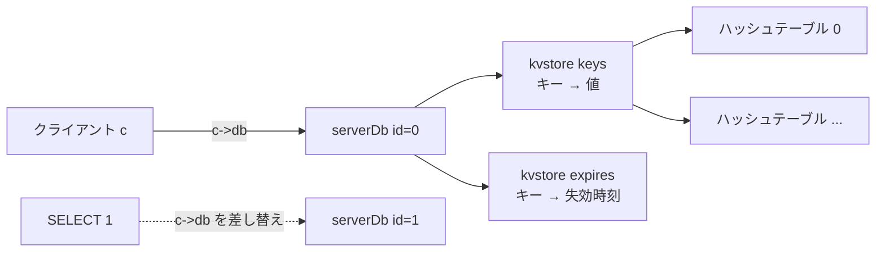
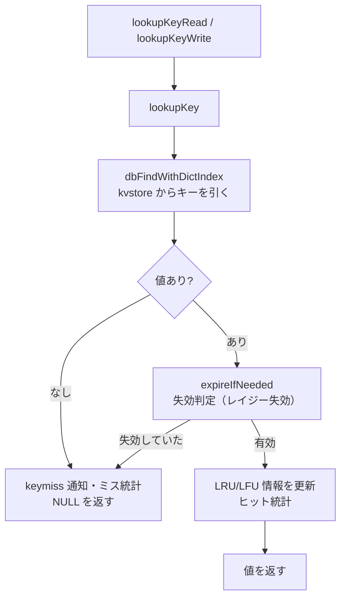
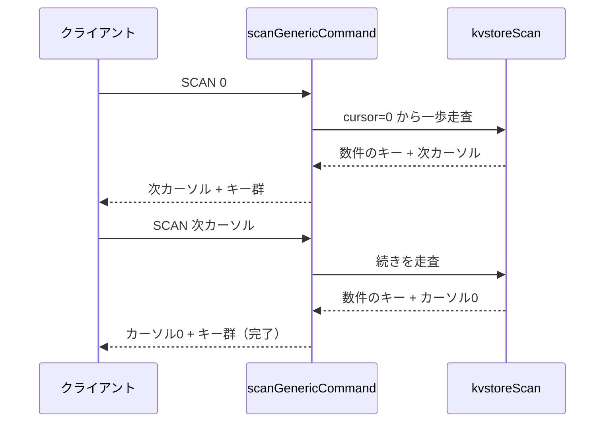

# 第30章 データベースとキー操作

> **本章で読むソース**
>
> - [`src/server.h`](https://github.com/valkey-io/valkey/blob/9.1.0/src/server.h)
> - [`src/db.c`](https://github.com/valkey-io/valkey/blob/9.1.0/src/db.c)
> - [`src/kvstore.c`](https://github.com/valkey-io/valkey/blob/9.1.0/src/kvstore.c)

## この章の狙い

Valkey の論理データベースが何で構成され、キーを引くときに内部で何が起きるかを読む。
`GET` がキーを見つける経路、`SET` がキーを登録する経路、そして `SCAN` がキー空間全体をブロックせずに走査する仕組みを、実コードに沿って追う。
最後の `SCAN` が本章の中心であり、リハッシュ中でもキーを漏らさずに少しずつ返す機構を理解することを目標とする。

## 前提

- [第6章 dict](../part01-data-structures/06-dict.md)と[第13章 kvstore](../part02-memory-keyspace/13-kvstore.md)。本章の `keys` と `expires` はどちらも `kvstore` であり、その内部のハッシュテーブルとカーソル走査の知識を前提にする。
- [第14章 オブジェクトとエンコーディング](../part03-objects-types/14-object-encoding.md)。キーと値はともに `robj` で表現される。

## `serverDb` の構造

Valkey の 1 つの論理データベースは `serverDb` 構造体で表される。
番号付きの複数のデータベースがあり、クライアントは `SELECT` で切り替える。

[`src/server.h` L901-L916](https://github.com/valkey-io/valkey/blob/9.1.0/src/server.h#L901-L916)

```c
typedef struct serverDb {
    kvstore *keys;                        /* The keyspace for this DB */
    kvstore *expires;                     /* Timeout of keys with a timeout set */
    kvstore *keys_with_volatile_items;    /* Keys with volatile items */
    dict *blocking_keys;                  /* Keys with clients waiting for data (BLPOP)*/
    dict *blocking_keys_unblock_on_nokey; /* Keys with clients waiting for
                                           * data, and should be unblocked if key is deleted (XREADEDGROUP).
                                           * This is a subset of blocking_keys*/
    dict *ready_keys;                     /* Blocked keys that received a PUSH */
    dict *watched_keys;                   /* WATCHED keys for MULTI/EXEC CAS */
    int id;                               /* Database ID */
    struct {
        long long avg_ttl;    /* Average TTL, just for stats */
        unsigned long cursor; /* Cursor of the active expire cycle. */
    } expiry[ACTIVE_EXPIRY_TYPE_COUNT];
} serverDb;
```

注目すべきは `keys` と `expires` の型が `dict *` ではなく `kvstore *` である点である。
`keys` がキーから値へのマッピング、すなわちこのデータベースのキー空間そのものを保持する。
`expires` は有効期限を持つキーだけを集め、キーから失効時刻へのマッピングを保持する。
有効期限を持たないキーは `expires` に現れないため、`expires` のサイズは `keys` のサイズ以下になる。

`kvstore` はハッシュテーブルの束をまとめた抽象である。
クラスタモードではスロットごとに別々のハッシュテーブルを持ち、非クラスタモードでは単一のハッシュテーブルだけを使う。
どちらの値を使うかは `getKVStoreIndexForKey` が決める。

[`src/db.c` L232-L235](https://github.com/valkey-io/valkey/blob/9.1.0/src/db.c#L232-L235)

```c
/* Returns which dict index should be used with kvstore for a given key. */
int getKVStoreIndexForKey(sds key) {
    return server.cluster_enabled ? getKeySlot(key) : 0;
}
```

`kvstore` の内部構造とインクリメンタルリハッシュは第13章で扱う。
本章ではキー空間を「番号で引けるハッシュテーブルの集まり」として扱えば足りる。

論理データベースの切り替えは `SELECT` が担う。
`selectCommand` は引数の番号を `selectDb` に渡し、`selectDb` はクライアントの `c->db` を差し替えるだけで切り替えを終える。

[`src/db.c` L727-L731](https://github.com/valkey-io/valkey/blob/9.1.0/src/db.c#L727-L731)

```c
int selectDb(client *c, int id) {
    if (id < 0 || id >= server.dbnum) return C_ERR;
    c->db = createDatabaseIfNeeded(id);
    return C_OK;
}
```

番号が範囲外なら `C_ERR` を返し、`selectCommand` 側で「DB index is out of range」のエラーを応答する。
以降そのクライアントのコマンドは、差し替わった `c->db` のキー空間に対して実行される。



## キー探索：読み取りと書き込みで分かれる経路

キーの値を引く処理は `lookupKey` に集約され、読み取り用と書き込み用の入口がその上に薄く乗っている。
読み取り用の `lookupKeyRead` は `lookupKeyReadWithFlags` を経由して `lookupKey` を呼ぶ。

[`src/db.c` L137-L160](https://github.com/valkey-io/valkey/blob/9.1.0/src/db.c#L137-L160)

```c
robj *lookupKeyReadWithFlags(serverDb *db, robj *key, int flags) {
    serverAssert(!(flags & LOOKUP_WRITE));
    return lookupKey(db, key, flags);
}

/* Like lookupKeyReadWithFlags(), but does not use any flag, which is the
 * common case. */
robj *lookupKeyRead(serverDb *db, robj *key) {
    return lookupKeyReadWithFlags(db, key, LOOKUP_NONE);
}

// ... (中略) ...
robj *lookupKeyWriteWithFlags(serverDb *db, robj *key, int flags) {
    return lookupKey(db, key, flags | LOOKUP_WRITE);
}

robj *lookupKeyWrite(serverDb *db, robj *key) {
    return lookupKeyWriteWithFlags(db, key, LOOKUP_NONE);
}
```

読み取り用と書き込み用の違いは `LOOKUP_WRITE` フラグだけである。
`lookupKeyWrite` はこのフラグを必ず付け、`lookupKeyRead` は付けない。
このフラグの有無が、失効したキーをその場で削除するかどうかを変える。

`lookupKey` の本体は、まずキー空間からエントリを引き、見つかったら失効判定を行う。

[`src/db.c` L81-L101](https://github.com/valkey-io/valkey/blob/9.1.0/src/db.c#L81-L101)

```c
robj *lookupKey(serverDb *db, robj *key, int flags) {
    int dict_index = getKVStoreIndexForKey(objectGetVal(key));
    robj *val = dbFindWithDictIndex(db, objectGetVal(key), dict_index);
    if (val) {
        // ... (中略) ...
        int is_ro_replica = server.primary_host && server.repl_replica_ro;
        int expire_flags = 0;
        if (flags & LOOKUP_WRITE && !is_ro_replica) expire_flags |= EXPIRE_FORCE_DELETE_EXPIRED;
        if (flags & LOOKUP_NOEXPIRE) expire_flags |= EXPIRE_AVOID_DELETE_EXPIRED;
        if (expireIfNeededWithDictIndex(db, key, val, expire_flags, dict_index) != KEY_VALID) {
            /* The key is no longer valid. */
            val = NULL;
        }
    }
```

キー空間からの実際の引き当ては `dbFindWithDictIndex` が行い、`kvstoreHashtableFind` でハッシュテーブルを引くだけの薄い関数である。

[`src/db.c` L2248-L2252](https://github.com/valkey-io/valkey/blob/9.1.0/src/db.c#L2248-L2252)

```c
static robj *dbFindWithDictIndex(serverDb *db, sds key, int dict_index) {
    void *existing = NULL;
    kvstoreHashtableFind(db->keys, dict_index, key, &existing);
    return existing;
}
```

値が見つかったときの失効判定が、読み書きで挙動を分ける核心である。
`LOOKUP_WRITE` が立ち、かつ読み取り専用レプリカでなければ `EXPIRE_FORCE_DELETE_EXPIRED` を付ける。
これは失効したキーを実際にキー空間から削除してよいことを意味する。
書き込みはキーを変更する前提なので、失効したキーをここで消してから新しい値を置く方が一貫する。
一方で読み取り専用レプリカは、プライマリから届く `DEL` を待ってキーを消すのが原則なので、レプリカ側で勝手に削除するとプライマリと食い違う。
そのため読み取り経路では削除を強制しない。

失効判定そのものは `expireIfNeededWithDictIndex` が担い、失効していれば `KEY_VALID` 以外を返す。
その場合 `val` を `NULL` にして、キーが存在しなかったかのように扱う。
このアクセス時の失効判定が、いわゆるレイジー失効である。
有効期限切れのキーは、誰かがアクセスした瞬間にこの経路で初めて取り除かれる。
失効の判定条件と削除、レプリケーションへの伝播は[第31章 有効期限](31-expire.md)で詳しく扱う。

失効を切り抜けて値が残った場合、アクセス時刻を更新する。

[`src/db.c` L103-L126](https://github.com/valkey-io/valkey/blob/9.1.0/src/db.c#L103-L126)

```c
    if (val) {
        // ... (中略) ...
        if (!hasActiveChildProcess() && !(flags & LOOKUP_NOTOUCH)) {
            /* Shared objects can't be stored in the database. */
            serverAssert(val->refcount != OBJ_SHARED_REFCOUNT);
            val->lru = lrulfu_touch(val->lru);
        }

        if (!(flags & (LOOKUP_NOSTATS | LOOKUP_WRITE))) server.stat_keyspace_hits++;
        /* TODO: Use separate hits stats for WRITE */
    } else {
        if (!(flags & (LOOKUP_NONOTIFY | LOOKUP_WRITE))) notifyKeyspaceEvent(NOTIFY_KEY_MISS, "keymiss", key, db->id);
        if (!(flags & (LOOKUP_NOSTATS | LOOKUP_WRITE))) server.stat_keyspace_misses++;
        /* TODO: Use separate misses stats and notify event for WRITE */
    }

    return val;
}
```

`val->lru` の更新は、メモリ退避が参照する LRU あるいは LFU の情報を進める処理である。
退避を有効にした構成では、キーにアクセスするたびにこの情報が更新され、退避時にどのキーを落とすかの判断材料になる。
このとき `hasActiveChildProcess()` でフォークした子プロセスがいないことを確かめている点に注意したい。
RDB 保存や AOF 書き換えのために子プロセスを走らせている間に `lru` を書き換えると、コピーオンライトでページが複製されてメモリ使用量が膨らむため、その間は更新を避ける。
退避アルゴリズムとこの情報の使われ方は[第32章 メモリ退避](32-eviction.md)で扱う。

最後にヒットとミスの統計を更新し、ミスのときはキー空間通知の `keymiss` イベントを発火する。
このイベントの仕組みは[第34章 キー空間通知](34-keyspace-notifications.md)で扱う。



## 追加と削除と上書き

キーの登録は `dbAdd`、削除は `dbDelete`、そして両者を束ねた高水準の入口が `setKey` である。
新しいキーは原則すべて `setKey` 経由で作られる。

`dbAdd` は内部の `dbAddInternal` に委譲する。
キーが存在しない前提で、値を `robj` に整えてキー空間に挿入する。

[`src/db.c` L202-L230](https://github.com/valkey-io/valkey/blob/9.1.0/src/db.c#L202-L230)

```c
static void dbAddInternal(serverDb *db, robj *key, robj **valref, int update_if_existing) {
    int dict_index = getKVStoreIndexForKey(objectGetVal(key));
    void **oldref = NULL;
    if (update_if_existing) {
        oldref = kvstoreHashtableFindRef(db->keys, dict_index, objectGetVal(key));
        if (oldref != NULL) {
            dbSetValue(db, key, valref, 1, oldref);
            return;
        }
    } else {
        debugServerAssertWithInfo(NULL, key, kvstoreHashtableFindRef(db->keys, dict_index, objectGetVal(key)) == NULL);
    }

    /* Not existing. Convert val to valkey object and insert. */
    robj *val = *valref;
    val = objectSetKeyAndExpire(val, objectGetVal(key), -1);
    // ... (中略) ...
    initObjectLRUOrLFU(val);
    kvstoreHashtableAdd(db->keys, dict_index, val);
    signalKeyAsReady(db, key, val->type);
    notifyKeyspaceEvent(NOTIFY_NEW, "new", key, db->id);
    *valref = val;
}

void dbAdd(serverDb *db, robj *key, robj **valref) {
    dbAddInternal(db, key, valref, 0);
}
```

挿入そのものは `kvstoreHashtableAdd` の一行だが、その前後の処理にキー空間の波及が表れている。
`signalKeyAsReady` は、そのキーで `BLPOP` などのブロック待ちをしているクライアントを起こす手がかりを記録する。
`notifyKeyspaceEvent` は `new` イベントを発火し、キーが新規に生まれたことを購読者に伝える。

削除は `dbDelete` が入口で、サーバの遅延解放設定に従って同期削除と非同期削除を選ぶ。

[`src/db.c` L552-L554](https://github.com/valkey-io/valkey/blob/9.1.0/src/db.c#L552-L554)

```c
int dbDelete(serverDb *db, robj *key) {
    return dbGenericDelete(db, key, server.lazyfree_lazy_server_del, DB_FLAG_KEY_DELETED);
}
```

実体の `dbGenericDeleteWithDictIndex` は、キー空間から消すと同時に `expires` からも対応する失効エントリを消す。

[`src/db.c` L492-L500](https://github.com/valkey-io/valkey/blob/9.1.0/src/db.c#L492-L500)

```c
        /* Delete from keys and expires tables. This will not free the object.
         * (The expires table has no destructor callback.) */
        kvstoreHashtableTwoPhasePopDelete(db->keys, dict_index, &pos);
        if (objectGetExpire(val) != -1) {
            bool deleted = kvstoreHashtableDelete(db->expires, dict_index, objectGetVal(key));
            serverAssert(deleted);
        } else {
            debugServerAssert(!kvstoreHashtableDelete(db->expires, dict_index, objectGetVal(key)));
        }
```

`keys` と `expires` は別々の `kvstore` なので、有効期限付きのキーを消すときは両方から消す必要がある。
失効時刻を持つキー（`objectGetExpire(val) != -1`）のときだけ `expires` の削除を必須とし、持たないキーでは `expires` に存在しないことを確かめる。
この対応関係を崩すと、値のないキーが `expires` に残る不整合が起きる。

`setKey` は、キーがあってもなくても値を設定する高水準の操作である。

[`src/db.c` L417-L436](https://github.com/valkey-io/valkey/blob/9.1.0/src/db.c#L417-L436)

```c
void setKey(client *c, serverDb *db, robj *key, robj **valref, int flags) {
    int keyfound = 0;

    if (flags & SETKEY_ALREADY_EXIST)
        keyfound = 1;
    else if (flags & SETKEY_ADD_OR_UPDATE)
        keyfound = -1;
    else if (!(flags & SETKEY_DOESNT_EXIST))
        keyfound = (lookupKeyWrite(db, key) != NULL);

    if (!keyfound) {
        dbAdd(db, key, valref);
    } else if (keyfound < 0) {
        dbAddInternal(db, key, valref, 1);
    } else {
        dbSetValue(db, key, valref, 1, NULL);
    }
    if (!(flags & SETKEY_KEEPTTL)) removeExpire(db, key);
    if (!(flags & SETKEY_NO_SIGNAL)) signalModifiedKey(c, db, key);
}
```

`SET` コマンドはこの `setKey` を呼んでキーを登録する。
存在しなければ `dbAdd`、存在すれば `dbSetValue` で上書きする。
キーがあれば既定で有効期限を消し（`removeExpire`）、キーを永続化する。
そして `signalModifiedKey` を呼ぶ。
これがキーの変更を `WATCH` の仕組みに伝える経路である。
`MULTI`/`EXEC` のトランザクションでそのキーを監視していたクライアントは、ここで監視対象が変更されたことを記録され、`EXEC` 時にトランザクションが失敗する。
`WATCH` の詳細は[第42章 トランザクション](../part08-features/42-transactions.md)で扱う。

キーの追加と削除は、単にハッシュテーブルを書き換えるだけでは終わらない。
ブロック待ちの解除、キー空間通知、`WATCH` の無効化という三つの波及が、追加削除の各経路に組み込まれている。

## SCAN：ノンブロッキングなキー空間走査

`KEYS` はパターンに一致する全キーを一度に返す。
キーが何百万とあれば、その走査が終わるまでイベントループは他のコマンドを処理できない。
`SCAN` はこの問題を、カーソルを使った分割走査で解く。
一度の呼び出しでは少数のキーと「次の位置を表すカーソル」を返し、クライアントがそのカーソルを次の `SCAN` に渡して続きを辿る。
これにより、巨大なキー空間でもイベントループを長時間ふさがずに全件を走査できる。

まず比較対象として `KEYS` を見る。

[`src/db.c` L936-L972](https://github.com/valkey-io/valkey/blob/9.1.0/src/db.c#L936-L972)

```c
void keysCommand(client *c) {
    sds pattern = objectGetVal(c->argv[1]);
    // ... (中略) ...
    kvstoreIterator *kvs_it = NULL;
    // ... (中略) ...
        kvs_it = kvstoreIteratorInit(c->db->keys, HASHTABLE_ITER_SAFE);
    void *next;
    while (kvs_di ? kvstoreHashtableIteratorNext(kvs_di, &next) : kvstoreIteratorNext(kvs_it, &next)) {
        robj *val = next;
        sds key = objectGetKey(val);
        if (allkeys || stringmatchlen(pattern, plen, key, sdslen(key), 0)) {
            if (!objectIsExpired(val)) {
                addReplyBulkCBuffer(c, key, sdslen(key));
                numkeys++;
            }
        }
        if (c->flag.close_asap) break;
    }
    // ... (中略) ...
}
```

`keysCommand` は `kvstoreIterator` でキー空間を端から端まで一気に舐め、一致したキーをその場で応答に積む。
途中で中断する余地は `close_asap`（接続を切るべきとき）しかなく、一回のコマンドで全件を処理しきる。

`SCAN` の入口は `scanCommand` で、カーソルを解析して `scanGenericCommand` に渡す。

[`src/db.c` L1401-L1406](https://github.com/valkey-io/valkey/blob/9.1.0/src/db.c#L1401-L1406)

```c
/* The SCAN command completely relies on scanGenericCommand. */
void scanCommand(client *c) {
    unsigned long long cursor;
    if (parseScanCursorOrReply(c, objectGetVal(c->argv[1]), &cursor) == C_ERR) return;
    scanGenericCommand(c, NULL, cursor);
}
```

走査の本体は `scanGenericCommandWithOptions` にある。
キー空間全体を対象とする場合（`o == NULL`）、`kvstoreScan` をカーソルが尽きるか上限に達するまで繰り返す。

[`src/db.c` L1305-L1313](https://github.com/valkey-io/valkey/blob/9.1.0/src/db.c#L1305-L1313)

```c
        do {
            /* In cluster mode there is a separate dictionary for each slot.
             * If cursor is empty, we should try exploring next non-empty slot. */
            if (o == NULL) {
                cursor = kvstoreScan(c->db->keys, cursor, slot, final_slot, keysScanCallback, NULL, &data);
            } else {
                cursor = hashtableScan(ht, cursor, hashtableScanCallback, &data);
            }
        } while (cursor && maxiterations-- && data.sampled < opts->count);
```

ループの終了条件が `SCAN` のノンブロッキング性を担保する。
`cursor` が 0 になれば走査は完結している。
そうでなくても、`maxiterations`（既定 COUNT の 10 倍）を使い切るか、収集したキー数が `count` に達した時点でループを抜ける。
これにより一回の `SCAN` の作業量に上限がかかり、イベントループを長時間ふさがない。
返した非ゼロのカーソルが、次の呼び出しが続きを再開するための位置になる。

`maxiterations` の上限は、空のバケットが多い疎なハッシュテーブルへの対策である。

[`src/db.c` L1266-L1270](https://github.com/valkey-io/valkey/blob/9.1.0/src/db.c#L1266-L1270)

```c
        /* We set the max number of iterations to ten times the specified
         * COUNT, so if the hash table is in a pathological state (very
         * sparsely populated) we avoid to block too much time at the cost
         * of returning no or very few elements. */
        unsigned long maxiterations = (unsigned long)opts->count * 10UL;
```

一回の走査ステップを実行するのが `kvstoreScan` である。
カーソルの下位ビットにハッシュテーブル番号を、上位ビットにハッシュテーブル内の位置を詰め込み、一個のカーソル値で「どのハッシュテーブルのどこまで進んだか」を表す。

[`src/kvstore.c` L415-L468](https://github.com/valkey-io/valkey/blob/9.1.0/src/kvstore.c#L415-L468)

```c
unsigned long long kvstoreScan(kvstore *kvs,
                               unsigned long long cursor,
                               int first_idx,
                               int last_idx,
                               kvstoreScanFunction scan_cb,
                               kvstoreScanShouldSkipHashtable *skip_cb,
                               void *privdata) {
    unsigned long long next_cursor = 0;
    /* During hash table traversal, 48 upper bits in the cursor are used for positioning in the HT.
     * Following lower bits are used for the hashtable index number, ranging from 0 to 2^num_hashtables_bits-1.
     * Hashtable index is always 0 at the start of iteration and can be incremented only if there are
     * multiple hashtables. */
    int didx = getAndClearHashtableIndexFromCursor(kvs, &cursor);
    // ... (中略) ...
    hashtable *ht = kvstoreGetHashtable(kvs, didx);
    kvstoreScanCallbackData cb_data = {.scan_cb = scan_cb, .privdata = privdata, .didx = didx};

    int skip = !ht || (skip_cb && skip_cb(ht)) || kvstoreIsImporting(kvs, didx);
    if (!skip) {
        next_cursor = hashtableScan(ht, cursor, hashtableScanToKvstoreScanCallback, &cb_data);
        /* In hashtableScan, scan_cb may delete entries (e.g., in active expire case). */
        freeHashtableIfNeeded(kvs, didx);
    }
    /* scanning done for the current hash table or if the scanning wasn't possible, move to the next hashtable index. */
    if (next_cursor == 0 || skip) {
        // ... (中略) ...
        int nextdidx = kvstoreGetNextNonEmptyHashtableIndex(kvs, didx);
        // ... (中略) ...
        didx = nextdidx;
    }
    if (didx == KVSTORE_INDEX_NOT_FOUND) {
        return 0;
    }
    addHashtableIndexToCursor(kvs, didx, &next_cursor);
    return next_cursor;
}
```

`kvstoreScan` はカーソルからハッシュテーブル番号を取り出し、その一個のハッシュテーブルを `hashtableScan` で一歩進める。
そのハッシュテーブルを走査し終えて `next_cursor` が 0 に戻ったら、次の空でないハッシュテーブルへ移る。
最後にハッシュテーブル番号を `next_cursor` に書き戻して返す。
進行状態がすべてカーソルという一個の数値に入っているので、`SCAN` は呼び出しごとに状態をサーバ側に持たずに済む。

ここで肝心なのが、`hashtableScan` の走査順がリハッシュに耐える設計になっている点である。
ハッシュテーブルがリハッシュで拡張や縮小している途中でも、カーソルを使った走査はバケットを上位ビットから辿る順序を採るため、走査の開始から終了までずっと存在し続けたキーは必ず一度は返る。
途中で追加や削除があったキーが返るかどうかは保証されないが、走査中ずっと在ったキーを取りこぼすことはない。
この走査順の仕組みは[第6章 dict](../part01-data-structures/06-dict.md)と[第13章 kvstore](../part02-memory-keyspace/13-kvstore.md)で扱う。
`SCAN` がリハッシュ中でも安全に使えるのは、この下層の性質を引き継いでいるからである。

走査で見つけた各キーは `keysScanCallback` が受け取り、ふるい分けたうえで結果に積む。

[`src/db.c` L1015-L1046](https://github.com/valkey-io/valkey/blob/9.1.0/src/db.c#L1015-L1046)

```c
/* Hashtable scan callback used by scanCallback when scanning the keyspace. */
void keysScanCallback(void *privdata, void *entry, int didx) {
    scanData *data = (scanData *)privdata;
    robj *obj = entry;
    data->sampled++;

    /* Filter an object if it isn't the type we want. */
    if (data->type != LLONG_MAX) {
        if (!objectTypeCompare(obj, data->type)) return;
    }

    sds key = objectGetKey(obj);

    /* Filter object if its key does not match the pattern. */
    if (data->pattern) {
        if (!stringmatchlen(data->pattern, sdslen(data->pattern), key, sdslen(key), 0)) {
            return;
        }
    }

    /* Handle and skip expired key. */
    if (objectIsExpired(obj)) {
        robj kobj;
        initStaticStringObject(kobj, key);
        if (expireIfNeededWithDictIndex(data->db, &kobj, obj, 0, didx) != KEY_VALID) {
            return;
        }
    }

    /* Keep this key. */
    addScanDataItem(data->result, (const char *)key, sdslen(key));
}
```

コールバックは三段のふるいを通す。
`MATCH` の `TYPE` 指定があれば型で弾き、`MATCH` のパターンがあれば一致しないキーを弾く。
そして失効済みのキーは `expireIfNeededWithDictIndex` を通し、有効でなければ結果に含めない。
`SCAN` の走査中にも失効判定が働き、`KEYS` と同じく失効済みのキーは返さない。

ループを抜けたら、応答の先頭にカーソルを、続いて収集したキーを並べて返す。

[`src/db.c` L1364-L1389](https://github.com/valkey-io/valkey/blob/9.1.0/src/db.c#L1364-L1389)

```c
    /* Reply to the client. */
    addReplyArrayLen(c, 2);

    // ... (中略：クラスタモードのカーソル整形) ...
    } else {
        addReplyBulkLongLong(c, cursor);
    }

    addReplyArrayLen(c, vectorLen(&result));
    for (uint32_t i = 0; i < vectorLen(&result); i++) {
        stringRef *key = vectorGet(&result, i);
        addReplyBulkCBuffer(c, key->buf, key->len);
        if (free_callback) {
            free_callback((sds)(key->buf));
        }
    }
```

返したカーソルが 0 なら走査は完了で、クライアントは `SCAN` を打ち切ってよい。
非ゼロなら、その値を次の `SCAN` に渡して続きを辿る。



`SCAN` のノンブロッキング性は、二つの上限の合わせ技で成り立つ。
一回の呼び出しの作業量を `maxiterations` と `count` で抑え、進行状態をカーソルという一個の数値に押し込んで呼び出しをまたぐ。
これにより、巨大なキー空間でもイベントループを長く止めずに全件を辿れる。
`KEYS` が全件を一度に処理してその間ブロックするのと、ここが対照的である。

## まとめ

- `serverDb` のキー空間 `keys` と失効時刻 `expires` はどちらも `kvstore` である。複数の論理データベースがあり、`SELECT` は `c->db` を差し替えて切り替える。
- キー探索は `lookupKey` に集約され、`LOOKUP_WRITE` フラグの有無で読み書きが分かれる。書き込みは失効キーをその場で削除し、読み取り専用レプリカでは削除しない。アクセス時の失効判定（レイジー失効）と LRU/LFU 情報の更新がここで起きる。
- キーの追加 `dbAdd`、削除 `dbDelete`、設定 `setKey` は、ハッシュテーブルの書き換えに加えて、ブロック待ちの解除、キー空間通知、`WATCH` の無効化を波及させる。`keys` と `expires` の対応はこの経路で保たれる。
- `SCAN` は `kvstoreScan` をカーソルで分割走査し、一回の作業量に上限をかけてイベントループをふさがない。進行状態はカーソル一個に収まり、リハッシュ中でも走査中ずっと在ったキーを取りこぼさない。
- `KEYS` は全キーを一度に走査してその間ブロックする。`SCAN` は分割して少しずつ返す点が異なる。

## 関連する章

- [第13章 kvstore](../part02-memory-keyspace/13-kvstore.md)：`keys`/`expires` の実体と、`SCAN` のカーソル走査やインクリメンタルリハッシュの下層。
- [第31章 有効期限](31-expire.md)：`expireIfNeeded` の失効判定とアクティブ失効、レプリケーションへの伝播。
- [第32章 メモリ退避](32-eviction.md)：`lookupKey` が更新する LRU/LFU 情報の使われ方。
- [第34章 キー空間通知](34-keyspace-notifications.md)：`notifyKeyspaceEvent` が発火する `new`/`del`/`keymiss` などのイベント。
- [第42章 トランザクション](../part08-features/42-transactions.md)：`signalModifiedKey` が連動する `WATCH` の仕組み。
