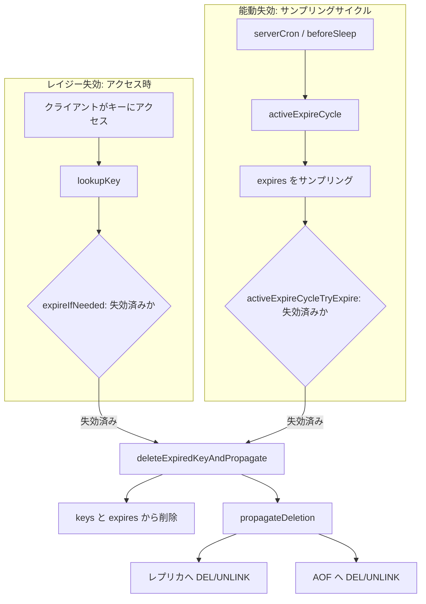

# 第31章 有効期限

> **本章で読むソース**
>
> - [`src/expire.c`](https://github.com/valkey-io/valkey/blob/9.1.0/src/expire.c)
> - [`src/db.c`](https://github.com/valkey-io/valkey/blob/9.1.0/src/db.c)
> - [`src/expire.h`](https://github.com/valkey-io/valkey/blob/9.1.0/src/expire.h)

## この章の狙い

Valkey のキーには、絶対時刻で表した失効時刻を付けられる。
失効時刻を過ぎたキーを、いつ、どのように実体から消すかが本章の主題である。
ここでは、アクセスした瞬間に消すレイジー失効と、定期的にサンプリングして掃除する能動失効という2つの機構を、実装に踏み込んで読む。
あわせて、失効による削除をレプリカと AOF へどう伝播し、レプリカ側ではなぜ自分で消さないのかを確認する。

## 前提

- [第30章 データベース](./30-database.md)：失効時刻を保持する `expires` kvstore と、キー本体を保持する `keys` kvstore の関係を前提にする。

## 失効の2つの経路

失効済みキーを実体から消す経路は2つある。
1つはキーにアクセスした瞬間に消すレイジー失効、もう1つは定期的にサンプリングして消す能動失効である。
どちらの経路も、削除の本体と伝播は同じ関数 `deleteExpiredKeyAndPropagate` に合流し、そこから `DEL`／`UNLINK` がレプリカと AOF へ伝わる。



レプリカは、この能動失効を自分では実行せず、また失効済みキーをアクセス時にも消さない。
削除は主が送る `DEL`／`UNLINK` を待つ。
その理由は本章の後半で扱う。

## 失効時刻はどこに、どう保持されるか

各データベース `serverDb` は、キー本体を持つ `keys` とは別に、失効時刻つきキーだけを集めた `expires` という kvstore を持つ。
`expires` は、キーから失効時刻（ミリ秒単位の絶対 Unix 時刻）への対応を表す。
失効時刻を持たないキーは `expires` に載らないので、このテーブルを走査すれば失効候補だけを効率よく集められる。
能動失効がサンプリング対象を `expires` に限れるのは、この分離があるからである。

失効時刻を設定するのは `setExpire` である。

[`src/db.c` L1894-L1933](https://github.com/valkey-io/valkey/blob/9.1.0/src/db.c#L1894-L1933)

```c
robj *setExpire(client *c, serverDb *db, robj *key, long long when) {
    /* TODO: Add val as a parameter to this function, to avoid looking it up. */
    robj *val;

    /* Reuse the object from the main dict in the expire dict. When setting
     * expire in an robj, it's potentially reallocated. We need to updates the
     * pointer(s) to it. */
    int dict_index = getKVStoreIndexForKey(objectGetVal(key));
    void **valref = kvstoreHashtableFindRef(db->keys, dict_index, objectGetVal(key));
    serverAssertWithInfo(NULL, key, valref != NULL);
    val = *valref;
    long long old_when = objectGetExpire(val);

    robj *newval = objectSetExpire(val, when);
    // ... (中略) ...
    if (old_when != -1) {
        /* Val already had an expire field, so it was not reallocated. */
        serverAssert(newval == val);
        /* It already exists in set of keys with expire. */
        debugServerAssert(!kvstoreHashtableAdd(db->expires, dict_index, newval));
    } else {
        /* No old expire. Update the pointer in the keys hashtable, if needed,
         * and add it to the expires hashtable. */
        if (newval != val) {
            val = *valref = newval;
        }
        bool added = kvstoreHashtableAdd(db->expires, dict_index, newval);
        serverAssert(added);
    }
    // ... (中略) ...
}
```

失効時刻は、値オブジェクト `robj` 自身に `objectSetExpire` で埋め込まれる。
`expires` テーブルに格納されるのは、この同じ値オブジェクトへのポインタであって、別途コピーした時刻ではない。
そのため `expires` に登録するときは `keys` に入っているのと同じ `robj` を指す必要があり、`setExpire` は `keys` 側を `kvstoreHashtableFindRef` で引いてから登録する。
失効時刻を埋め込む際にオブジェクトが再確保されることがあるので、再確保が起きたら `keys` 側のポインタも `val = *valref = newval` で差し替える。
このように `keys` と `expires` が同一の `robj` を共有するので、片方を消すときに失効時刻だけが取り残されるという不整合が起きない。

失効時刻を読むのは `getExpire`、外すのは `removeExpire` である。

[`src/db.c` L1874-L1885](https://github.com/valkey-io/valkey/blob/9.1.0/src/db.c#L1874-L1885)

```c
int removeExpire(serverDb *db, robj *key) {
    int dict_index = getKVStoreIndexForKey(objectGetVal(key));
    void *popped;
    if (kvstoreHashtablePop(db->expires, dict_index, objectGetVal(key), &popped)) {
        robj *val = popped;
        robj *newval = objectSetExpire(val, -1);
        serverAssert(newval == val);
        debugServerAssert(getExpire(db, key) == -1);
        return 1;
    }
    return 0;
}
```

`removeExpire` は `expires` からエントリを取り除き、値オブジェクトの失効時刻を `-1`、つまり失効なしに戻す。
`getExpire` は `expires` を引いて失効時刻を返し、登録がなければ `-1` を返す。
失効時刻に `-1` を使う約束は本章を通じて現れる。
失効時刻が `-1` のキーは永続キーであり、失効の対象にならない。

## 失効時刻を設定するコマンド

EXPIRE、PEXPIRE、EXPIREAT、PEXPIREAT は、いずれも `expireGenericCommand` に集約される。
4つの違いは引数の単位（秒かミリ秒か）と、基準時刻が現在時刻か 0 かだけである。

[`src/expire.c` L878-L896](https://github.com/valkey-io/valkey/blob/9.1.0/src/expire.c#L878-L896)

```c
/* EXPIRE key seconds [ NX | XX | GT | LT] */
void expireCommand(client *c) {
    expireGenericCommand(c, commandTimeSnapshot(), UNIT_SECONDS);
}

/* EXPIREAT key unix-time-seconds [ NX | XX | GT | LT] */
void expireatCommand(client *c) {
    expireGenericCommand(c, 0, UNIT_SECONDS);
}

/* PEXPIRE key milliseconds [ NX | XX | GT | LT] */
void pexpireCommand(client *c) {
    expireGenericCommand(c, commandTimeSnapshot(), UNIT_MILLISECONDS);
}

/* PEXPIREAT key unix-time-milliseconds [ NX | XX | GT | LT] */
void pexpireatCommand(client *c) {
    expireGenericCommand(c, 0, UNIT_MILLISECONDS);
}
```

相対指定の EXPIRE と PEXPIRE は基準時刻に現在時刻 `commandTimeSnapshot()` を渡し、絶対指定の EXPIREAT と PEXPIREAT は基準時刻 0 を渡す。
`expireGenericCommand` は受け取った値を内部で常にミリ秒の絶対時刻 `when` に正規化する。
秒指定なら 1000 倍し、基準時刻を足す。

[`src/expire.c` L764-L798](https://github.com/valkey-io/valkey/blob/9.1.0/src/expire.c#L764-L798)

```c
void expireGenericCommand(client *c, mstime_t basetime, int unit) {
    robj *key = c->argv[1], *param = c->argv[2];
    mstime_t when; /* unix time in milliseconds when the key will expire. */
    mstime_t current_expire = -1;
    int flag = 0;

    /* checking optional flags */
    if (parseExtendedExpireArgumentsOrReply(c, &flag, c->argc) != C_OK) {
        return;
    }

    if (getLongLongFromObjectOrReply(c, param, &when, NULL) != C_OK) return;

    /* EXPIRE allows negative numbers, but we can at least detect an
     * overflow by either unit conversion or basetime addition. */
    if (unit == UNIT_SECONDS) {
        // ... (中略) ...
        when *= 1000;
    }
    // ... (中略) ...
    when += basetime;
    /* A negative expiration time should cause a key to expire and be deleted immediately.
     * However, in some cases (such as import-mode), we might need to pause expiration,
     * and we don't want keys with negative expiration times (could cause a crash during active expiration).
     * Therefore, we simply change the expiration time to 0 to mark the key as expired. */
    if (when < 0) {
        when = 0;
    }
```

正規化に続いて、`NX`、`XX`、`GT`、`LT` の条件指定を処理する。
これらは既存の失効時刻と新しい失効時刻を比べて、設定するかどうかを決める。
たとえば `GT` は新しい失効時刻が現在より大きいときだけ設定し、`current_expire` が `-1`（永続キー）のときは無限大とみなすので常に失敗する。
条件を満たさなければ `0` を返して何もしない。

ここで一つ重要な分岐がある。
正規化した `when` がすでに過去なら、失効時刻を設定するのではなく、その場でキーを削除する。

[`src/expire.c` L800-L876](https://github.com/valkey-io/valkey/blob/9.1.0/src/expire.c#L800-L876)

```c
    robj *obj = lookupKeyWrite(c->db, key);

    /* No key, return zero. */
    if (obj == NULL) {
        addReply(c, shared.czero);
        return;
    }
    // ... (中略: NX/XX/GT/LT の判定) ...
    if (checkAlreadyExpired(when)) {
        deleteExpiredKeyFromOverwriteAndPropagate(c, key);
        addReply(c, shared.cone);
        return;
    } else {
        obj = setExpire(c, c->db, key, when);
        signalModifiedKey(c, c->db, key);
        notifyKeyspaceEvent(NOTIFY_GENERIC, "expire", key, c->db->id);
        server.dirty++;
        addReply(c, shared.cone);
        /* Propagate as PEXPIREAT millisecond-timestamp
         * Only rewrite the command arg if not already PEXPIREAT */
        if (c->cmd->proc != pexpireatCommand) {
            rewriteClientCommandArgument(c, 0, shared.pexpireat);
        }
        // ... (中略) ...
    }
}
```

`checkAlreadyExpired(when)` が真、つまり指定時刻がすでに過去で、かつ自分が主であり読み込み中でないときは、`deleteExpiredKeyFromOverwriteAndPropagate` でキーを即座に消す。
そうでなければ `setExpire` で失効時刻を設定する。

設定が成立したときは、伝播のためにコマンドを `PEXPIREAT` のミリ秒絶対時刻へ書き換える。
`rewriteClientCommandArgument` で `argv[0]` を `pexpireat` に、引数の時刻を正規化済みの `when` に差し替える。
こうすると、EXPIRE のような相対指定であっても、レプリカや AOF には絶対時刻の `PEXPIREAT` として伝わる。
相対指定のまま伝播すると、主とレプリカで基準となる現在時刻がずれて失効時刻が食い違うので、絶対時刻に直してから伝える。

## 残り時間を返すコマンド

TTL、PTTL、EXPIRETIME、PEXPIRETIME は `ttlGenericCommand` に集約される。

[`src/expire.c` L898-L921](https://github.com/valkey-io/valkey/blob/9.1.0/src/expire.c#L898-L921)

```c
/* Implements TTL, PTTL, EXPIRETIME and PEXPIRETIME */
void ttlGenericCommand(client *c, int output_ms, int output_abs) {
    robj *o;
    mstime_t expire, ttl = -1;

    /* If the key does not exist at all, return -2 */
    if ((o = lookupKeyReadWithFlags(c->db, c->argv[1], LOOKUP_NOTOUCH)) == NULL) {
        addReplyLongLong(c, -2);
        return;
    }

    /* The key exists. Return -1 if it has no expire, or the actual
     * TTL value otherwise. */
    expire = objectGetExpire(o);
    if (expire != -1) {
        ttl = output_abs ? expire : expire - commandTimeSnapshot();
        if (ttl < 0) ttl = 0;
    }
    if (ttl == -1) {
        addReplyLongLong(c, -1);
    } else {
        addReplyLongLong(c, output_ms ? ttl : ((ttl + 500) / 1000));
    }
}
```

ここで返り値の規約が3段階に分かれる。
キーが存在しなければ `-2`、存在して失効時刻がなければ `-1`、失効時刻があれば残り時間または絶対時刻を返す。
`output_abs` が立っていれば（EXPIRETIME と PEXPIRETIME）失効時刻そのものを、立っていなければ（TTL と PTTL）現在時刻との差を返す。
`output_ms` が立っていなければ秒に丸めるが、その際 `(ttl + 500) / 1000` として四捨五入する。

`lookupKeyReadWithFlags` に `LOOKUP_NOTOUCH` を渡している点に注目したい。
これは残り時間の参照でアクセス時刻を更新しないための指定である。
ただしレイジー失効そのものは抑止しないので、`lookupKey` の中で失効済みなら次節の経路でキーが消え、結果として `-2` が返る。

## レイジー失効：アクセスした瞬間に消す

最適化の核の1つ目がレイジー失効である。
キーにアクセスするたびに失効を判定し、失効していればその場で削除する。
アクセスされないキーは、この経路では消えない。

レイジー失効は `lookupKey` から呼ばれる。

[`src/db.c` L81-L126](https://github.com/valkey-io/valkey/blob/9.1.0/src/db.c#L81-L126)

```c
robj *lookupKey(serverDb *db, robj *key, int flags) {
    int dict_index = getKVStoreIndexForKey(objectGetVal(key));
    robj *val = dbFindWithDictIndex(db, objectGetVal(key), dict_index);
    if (val) {
        /* Forcing deletion of expired keys on a replica makes the replica
         * inconsistent with the primary. We forbid it on readonly replicas, but
         * we have to allow it on writable replicas to make write commands
         * behave consistently.
         *
         * It's possible that the WRITE flag is set even during a readonly
         * command, since the command may trigger events that cause modules to
         * perform additional writes. */
        int is_ro_replica = server.primary_host && server.repl_replica_ro;
        int expire_flags = 0;
        if (flags & LOOKUP_WRITE && !is_ro_replica) expire_flags |= EXPIRE_FORCE_DELETE_EXPIRED;
        if (flags & LOOKUP_NOEXPIRE) expire_flags |= EXPIRE_AVOID_DELETE_EXPIRED;
        if (expireIfNeededWithDictIndex(db, key, val, expire_flags, dict_index) != KEY_VALID) {
            /* The key is no longer valid. */
            val = NULL;
        }
    }
    // ... (中略) ...
}
```

キーが見つかると `expireIfNeeded` を呼び、戻り値が `KEY_VALID` でなければ、見つからなかったものとして `NULL` を返す。
読み取りコマンドはこの `NULL` を「キーなし」として扱うので、失効したキーは利用者から見れば存在しない。

判定と削除の本体は `expireIfNeeded` にある。
ここから先は `val` が渡されているので、まずオブジェクト埋め込みの失効時刻だけで早期に valid を返せる。

[`src/db.c` L2140-L2164](https://github.com/valkey-io/valkey/blob/9.1.0/src/db.c#L2140-L2164)

```c
static keyStatus expireIfNeededWithDictIndex(serverDb *db, robj *key, robj *val, int flags, int dict_index) {
    if (server.lazy_expire_disabled) return KEY_VALID;
    if (val != NULL) {
        if (!objectIsExpired(val)) return KEY_VALID;
    } else {
        if (!keyIsExpiredWithDictIndexImpl(db, key, dict_index)) return KEY_VALID;
    }
    expirationPolicy policy = getExpirationPolicyWithFlags(flags);
    if (policy == POLICY_IGNORE_EXPIRE) /* Ignore keys expiration. treat all keys as valid. */
        return KEY_VALID;
    else if (policy == POLICY_KEEP_EXPIRED) /* Treat expired keys as invalid, but do not delete them. */
        return KEY_EXPIRED;

    /* The key needs to be converted from static to heap before deleted */
    int static_key = key->refcount == OBJ_STATIC_REFCOUNT;
    if (static_key) {
        key = createStringObject(objectGetVal(key), sdslen(objectGetVal(key)));
    }
    /* Delete the key */
    deleteExpiredKeyAndPropagateWithDictIndex(db, key, dict_index);
    if (static_key) {
        decrRefCount(key);
    }
    return KEY_DELETED;
}
```

失効していなければ `KEY_VALID` を返してそのまま使わせる。
失効しているときの振る舞いは、`getExpirationPolicyWithFlags` が返す方針で決まる。
方針には3種類ある。
`POLICY_IGNORE_EXPIRE` は失効を無視して valid として扱い、`POLICY_KEEP_EXPIRED` は失効済みとして扱うが削除はせず、`POLICY_DELETE_EXPIRED` は削除する。

実際に削除すると判断したときは、`deleteExpiredKeyAndPropagateWithDictIndex` を呼んで `KEY_DELETED` を返す。
この削除関数は、次節で見る能動失効とも共有する伝播経路である。

方針を決める `getExpirationPolicyWithFlags` が、レプリカと主の違いを吸収している。

[`src/expire.c` L981-L1032](https://github.com/valkey-io/valkey/blob/9.1.0/src/expire.c#L981-L1032)

```c
expirationPolicy getExpirationPolicyWithFlags(int flags) {
    if (server.loading) return POLICY_IGNORE_EXPIRE;

    /* If we are running in the context of a replica, instead of
     * evicting the expired key from the database, we return ASAP:
     * the replica key expiration is controlled by the primary that will
     * send us synthesized DEL operations for expired keys. The
     * exception is when write operations are performed on writable
     * replicas.
     *
     * Still we try to reflect the correct state to the caller,
     * that is, POLICY_KEEP_EXPIRED so that the key will be ignored, but not deleted.
     *
     * When replicating commands from the primary, keys are never considered
     * expired, so we return POLICY_IGNORE_EXPIRE */
    if (server.primary_host != NULL) {
        if (server.current_client && (server.current_client->flag.primary)) return POLICY_IGNORE_EXPIRE;
        if (!(flags & EXPIRE_FORCE_DELETE_EXPIRED)) return POLICY_KEEP_EXPIRED;
    } else if (server.current_client && server.current_client->slot_migration_job) {
        // ... (中略) ...
    } else if (server.import_mode) {
        // ... (中略) ...
    }
    // ... (中略) ...
    return POLICY_DELETE_EXPIRED;
}
```

自分が主であれば（`server.primary_host` が `NULL`）、通常は `POLICY_DELETE_EXPIRED` まで進み、削除する。
自分がレプリカであれば（`server.primary_host` が非 `NULL`）、主からのコマンド実行中は `POLICY_IGNORE_EXPIRE`、それ以外では `POLICY_KEEP_EXPIRED` を返す。
つまりレプリカは、失効済みのキーを論理的には失効として扱いながらも、自分の判断では削除しない。
削除は主が送る `DEL`／`UNLINK` を待つ。
この方針は後の「レプリカでの失効の扱い」で改めて述べる。

## 能動失効：サンプリングで掃除する

最適化の核の2つ目が能動失効である。
レイジー失効だけでは、二度とアクセスされない失効済みキーがメモリに残り続ける。
これを補うのが、定期的に `expires` をサンプリングして失効済みキーを回収する `activeExpireCycle` である。

このサイクルには2つの呼び口がある。
1つは serverCron 経由の遅いサイクル、もう1つは beforeSleep 経由の速いサイクルである。

[`src/server.c` L1273-L1279](https://github.com/valkey-io/valkey/blob/9.1.0/src/server.c#L1273-L1279)

```c
    if (server.active_expire_enabled) {
        if (!iAmPrimary()) {
            expireReplicaKeys();
        } else {
            if (!server.import_mode) {
                activeExpireCycle(ACTIVE_EXPIRE_CYCLE_SLOW);
            }
```

[`src/server.c` L1870-L1875](https://github.com/valkey-io/valkey/blob/9.1.0/src/server.c#L1870-L1875)

```c
    /* Run a fast expire cycle (the called function will return
     * ASAP if a fast cycle is not needed). */
    ustime_t expire_cycle_time = 0;
    if (server.active_expire_enabled && !server.import_mode && iAmPrimary()) {
        expire_cycle_time = activeExpireCycle(ACTIVE_EXPIRE_CYCLE_FAST);
    }
```

遅いサイクルは `server.hz`（既定で毎秒10回）の頻度で `databasesCron` から呼ばれ、CPU 時間の予算を多めに取る。
速いサイクルはイベントループの各周回で `beforeSleep` から呼ばれ、短い予算で頻繁に走る。
どちらも `iAmPrimary()` が条件にあり、能動失効を実行するのは主だけである。
レプリカは `expireReplicaKeys`、つまり書き込み可能レプリカで自分が作ったキーの後始末だけを行う。

`ACTIVE_EXPIRE_CYCLE_SLOW` と `ACTIVE_EXPIRE_CYCLE_FAST` の値は次のとおりである。

[`src/expire.h` L18-L19](https://github.com/valkey-io/valkey/blob/9.1.0/src/expire.h#L18-L19)

```c
#define ACTIVE_EXPIRE_CYCLE_SLOW 0
#define ACTIVE_EXPIRE_CYCLE_FAST 1
```

### CPU 予算の決め方

`activeExpireCycle` はまず、サイクルの種別に応じて時間予算 `timelimit_us` を決める。

[`src/expire.c` L459-L487](https://github.com/valkey-io/valkey/blob/9.1.0/src/expire.c#L459-L487)

```c
ustime_t activeExpireCycle(int type) {
    /* If 'expire' action is paused, for whatever reason, then don't expire any key.
     * Typically, at the end of the pause we will properly expire the key OR we
     * will have failed over and the new primary will send us the expire. */
    if (isPausedActionsWithUpdate(PAUSE_ACTION_EXPIRE)) return 0;

    /* Adjust the running parameters according to the configured expire
     * effort. The default effort is 1, and the maximum configurable effort
     * is 10. Also make sure not to run fast cycles back to back. */
    ustime_t timelimit_us;
    if (type == ACTIVE_EXPIRE_CYCLE_FAST) {
        ustime_t config_cycle_fast_duration = ACTIVE_EXPIRE_CYCLE_FAST_DURATION + ACTIVE_EXPIRE_CYCLE_FAST_DURATION / 4 * activeExpireEffort();

        /* Never repeat a fast cycle for the same period
         * as the fast cycle total duration itself. */
        static monotime last_fast_cycle_start_time; /* When last fast cycle ran. */
        monotime start = getMonotonicUs();
        if (start < last_fast_cycle_start_time + config_cycle_fast_duration * 2) return 0;

        last_fast_cycle_start_time = start;
        timelimit_us = config_cycle_fast_duration;
    } else {
        /* We can use at max 'config_cycle_slow_time_perc' percentage of CPU
         * time per iteration. Since this function gets called with a frequency of
         * server.hz times per second, the following is the max amount of
         * microseconds we can spend in this function. */
        int config_cycle_slow_time_perc = ACTIVE_EXPIRE_CYCLE_SLOW_TIME_PERC + 2 * activeExpireEffort();
        timelimit_us = config_cycle_slow_time_perc * 1000000 / server.hz / 100;
    }
```

速いサイクルの予算は基準値 `ACTIVE_EXPIRE_CYCLE_FAST_DURATION`（1000 マイクロ秒）を土台にし、前回の速いサイクルから一定時間が経っていなければ即座に戻る。
こうして速いサイクルが連続で走り続けないようにしている。

遅いサイクルの予算は CPU の割合で決める。
基準は `ACTIVE_EXPIRE_CYCLE_SLOW_TIME_PERC`（25 パーセント）で、これを `server.hz` で割って1回あたりのマイクロ秒に直す。
遅いサイクルが毎秒 `server.hz` 回呼ばれるので、合計でほぼ CPU の25パーセントに収まる。

どちらの予算も `activeExpireEffort()` で増減する。
これは設定 `active-expire-effort`（1から10）に対応し、値を上げるほど予算が増え、より積極的に掃除する。

[`src/expire.c` L122-L125](https://github.com/valkey-io/valkey/blob/9.1.0/src/expire.c#L122-L125)

```c
#define ACTIVE_EXPIRE_CYCLE_KEYS_PER_LOOP 20    /* Keys for each DB loop. */
#define ACTIVE_EXPIRE_CYCLE_FAST_DURATION 1000  /* Microseconds. */
#define ACTIVE_EXPIRE_CYCLE_SLOW_TIME_PERC 25   /* Max % of CPU to use. */
#define ACTIVE_EXPIRE_CYCLE_ACCEPTABLE_STALE 10 /* % of stale keys after which */
```

### サンプリングと適応的な努力量

予算を決めたら、`activeExpireCycleJob` がデータベースを順に巡って `expires` をサンプリングする。
このループの肝は、失効済みキーの割合が高いデータベースに努力を集中させる点にある。

[`src/expire.c` L302-L409](https://github.com/valkey-io/valkey/blob/9.1.0/src/expire.c#L302-L409)

```c
        do {
            if (db == NULL) {
                break; /* DB not allocated since it was never used */
            }
            // ... (中略) ...
            data.sampled = 0;
            data.expired = 0;

            if (num > keys_per_loop) num = keys_per_loop;
            // ... (中略) ...
            while (data.sampled < num && checked_buckets < max_buckets) {
                unsigned long cursor = db->expiry[jobType].cursor;
                cursor = kvstoreScan(kvs, cursor, -1, -1, scan_cb,
                                     expireShouldSkipTableForSamplingCb, &data);
                // ... (中略) ...
            }
            // ... (中略) ...
            /* We don't repeat the cycle for the current database if the db is done
             * for scanning or an acceptable number of stale keys (logically expired
             * but yet not reclaimed). */
            repeat = db_done
                         ? 0
                         : (data.sampled == 0 || (data.expired * 100 / data.sampled) > config_cycle_acceptable_stale);
            // ... (中略) ...
        } while (repeat);
```

1回のループで `expires` から最大 `keys_per_loop` 本（基準20本、effort で増える）をサンプリングする。
`kvstoreScan` がサンプルごとに `scan_cb`（通常キーなら `expireScanCallback`）を呼ぶ。
サンプル全体に占める失効済みの割合が `config_cycle_acceptable_stale`（基準10パーセント、effort で下がる）を超えていれば `repeat` を立て、同じデータベースをもう一度サンプリングする。
失効済みが少なければそのデータベースを切り上げ、次へ進む。
失効済みキーが密集しているデータベースほど繰り返し掃除され、まばらなデータベースは早々に見切る。
このしくみで、わずかなメモリのために走査を続ける無駄を避ける。

実際に失効を判定して消すのは `expireScanCallback` から呼ばれる `activeExpireCycleTryExpire` である。

[`src/expire.c` L66-L80](https://github.com/valkey-io/valkey/blob/9.1.0/src/expire.c#L66-L80)

```c
int activeExpireCycleTryExpire(serverDb *db, robj *val, mstime_t now, int didx) {
    mstime_t t = objectGetExpire(val);
    serverAssert(t >= 0);
    if (now > t) {
        enterExecutionUnit(1, 0);
        sds key = objectGetKey(val);
        robj *keyobj = createStringObject(key, sdslen(key));
        deleteExpiredKeyAndPropagateWithDictIndex(db, keyobj, didx);
        decrRefCount(keyobj);
        exitExecutionUnit();
        return 1;
    } else {
        return 0;
    }
}
```

現在時刻 `now` がオブジェクトの失効時刻 `t` を過ぎていれば、`deleteExpiredKeyAndPropagateWithDictIndex` で削除して `1` を返す。
削除の本体は、レイジー失効と同じ関数である。
能動失効とレイジー失効は、失効を見つける経路こそ違うが、消し方と伝播は1つに集約されている。

予算超過の確認は、ループのなかで定期的に行う。

[`src/expire.c` L401-L408](https://github.com/valkey-io/valkey/blob/9.1.0/src/expire.c#L401-L408)

```c
            /* check time limit for every FIELDS job iteration or every 16 iterations for KEYS. */
            if ((iteration & time_check_mask) == 0) {
                if (elapsedUs(start) > (uint64_t)timelimit_us) {
                    state->timelimit_exit = 1;
                    server.stat_expired_time_cap_reached_count++;
                    break;
                }
            }
```

通常キーでは16回に1回だけ経過時間を確認する（`time_check_mask` が `0xf`）。
時刻取得そのものに費用がかかるので、毎回は確認しない。
予算を超えたら `timelimit_exit` を立てて中断し、次回の呼び出しは中断したデータベースの続きから再開する。
カーソル `db->expiry[jobType].cursor` を保持しているので、サイクルをまたいでも `expires` 全体を取りこぼしなく巡れる。

## 失効による削除の伝播

レイジー失効と能動失効が共有する削除経路を、最後に見る。
失効による削除は、主が単独で消して終わりではない。
レプリカと AOF へ削除を伝え、全体の整合を保つ必要がある。

その削除と伝播をまとめているのが `deleteExpiredKeyAndPropagateWithDictIndex` である。

[`src/db.c` L1952-L1963](https://github.com/valkey-io/valkey/blob/9.1.0/src/db.c#L1952-L1963)

```c
void deleteExpiredKeyAndPropagateWithDictIndex(serverDb *db, robj *keyobj, int dict_index) {
    mstime_t expire_latency;
    latencyStartMonitor(expire_latency);
    dbGenericDeleteWithDictIndex(db, keyobj, server.lazyfree_lazy_expire, DB_FLAG_KEY_EXPIRED, dict_index);
    latencyEndMonitor(expire_latency);
    latencyAddSampleIfNeeded("expire-del", expire_latency);
    latencyTraceIfNeeded(db, expire_del, expire_latency);
    notifyKeyspaceEvent(NOTIFY_EXPIRED, "expired", keyobj, db->id);
    signalModifiedKey(NULL, db, keyobj);
    propagateDeletion(db, keyobj, server.lazyfree_lazy_expire, dict_index);
    server.stat_expiredkeys++;
}
```

`dbGenericDeleteWithDictIndex` でキー本体を `keys` と `expires` の両方から消し、`expired` のキー空間通知を発行する。
そして `propagateDeletion` で、削除をレプリカと AOF へ伝える。
伝播するコマンドは `DEL` か `UNLINK` のどちらかである。

[`src/db.c` L2004-L2016](https://github.com/valkey-io/valkey/blob/9.1.0/src/db.c#L2004-L2016)

```c
void propagateDeletion(serverDb *db, robj *key, int lazy, int slot) {
    robj *argv[2];

    argv[0] = lazy ? shared.unlink : shared.del;
    argv[1] = key;

    /* If the primary decided to delete a key we must propagate it to replicas no matter what.
     * Even if module executed a command without asking for propagation. */
    int prev_replication_allowed = server.replication_allowed;
    server.replication_allowed = 1;
    alsoPropagate(db->id, argv, 2, PROPAGATE_AOF | PROPAGATE_REPL, slot);
    server.replication_allowed = prev_replication_allowed;
}
```

設定 `lazyfree-lazy-expire` が有効なら `UNLINK`（非同期解放）、無効なら `DEL`（同期解放）を伝える。
`alsoPropagate` のフラグに `PROPAGATE_AOF | PROPAGATE_REPL` を渡すので、伝播先は AOF とレプリケーションストリームの両方である。
主が失効で消したと決めた以上、モジュールが伝播を求めなくても必ず伝えるために、いったん `server.replication_allowed` を `1` に上書きする。

失効による削除をすべて明示的な `DEL`／`UNLINK` として伝えるのが、ここでの設計の要点である。
削除の発生源を主の1か所に集約し、AOF とレプリケーションがいずれも順序を保つので、削除済みのキーへ書き込みが来ても全体で整合する。
関数冒頭のコメントが、この理由を述べている。

[`src/db.c` L1985-L2003](https://github.com/valkey-io/valkey/blob/9.1.0/src/db.c#L1985-L2003)

```c
/* Propagate an implicit key deletion into replicas and the AOF file.
 * When a key was deleted in the primary by eviction, expiration or a similar
 * mechanism a DEL/UNLINK operation for this key is sent
 * to all the replicas and the AOF file if enabled.
 *
 * This way the key deletion is centralized in one place, and since both
 * AOF and the replication link guarantee operation ordering, everything
 * will be consistent even if we allow write operations against deleted
 * keys.
 *
 * This function may be called from:
 * 1. Within call(): Example: Lazy-expire on key access.
 *    In this case the caller doesn't have to do anything
 *    because call() handles server.also_propagate(); or
 * 2. Outside of call(): Example: Active-expire, eviction, slot ownership changed.
 *    In this the caller must remember to call
 *    postExecutionUnitOperations, preferably just after a
 *    single deletion batch, so that DEL/UNLINK will NOT be wrapped
 *    in MULTI/EXEC */
```

## レプリカでの失効の扱い

主が削除を集約する設計から、レプリカの振る舞いが決まる。
レプリカは失効済みキーを自分の判断で消さず、主が送る `DEL`／`UNLINK` を待つ。
もしレプリカが勝手に消すと、主の削除がまだ届いていない瞬間に、主とレプリカでキーの有無がずれるからである。

とはいえレプリカでも、読み取りの結果は正しく見せたい。
そこで `lookupKey` のコメントが述べるように、レプリカは失効済みキーを削除しないまま、論理的には失効として扱う。

[`src/db.c` L76-L80](https://github.com/valkey-io/valkey/blob/9.1.0/src/db.c#L76-L80)

```c
 * Note: this function also returns NULL if the key is logically expired but
 * still existing, in case this is a replica and the LOOKUP_WRITE is not set.
 * Even if the key expiry is primary-driven, we can correctly report a key is
 * expired on replicas even if the primary is lagging expiring our key via DELs
 * in the replication link. */
```

これを実現するのが、前に見た `getExpirationPolicyWithFlags` の `POLICY_KEEP_EXPIRED` である。
レプリカで失効済みキーを読むと、この方針により `expireIfNeeded` が `KEY_EXPIRED` を返し、`lookupKey` は `NULL` を返す。
キーは実体としては残るが、利用者からは存在しないように見える。
主からの `DEL` が届けば、そのときに実体も消える。

例外は2つある。
1つは、主からのコマンドを実行している最中（`server.current_client->flag.primary`）で、このとき方針は `POLICY_IGNORE_EXPIRE` になり、レプリカは失効をいっさい無視する。
主の `DEL` に素直に従うためである。
もう1つは書き込み可能レプリカで、書き込みコマンドの一貫性のために `EXPIRE_FORCE_DELETE_EXPIRED` で削除を許す。

## まとめ

- 失効時刻は値オブジェクト `robj` に埋め込まれ、失効時刻つきキーへのポインタだけを `expires` kvstore が別に集める。`setExpire` で設定し、`getExpire` で読み、`removeExpire` で外す。失効なしは `-1` で表す。
- EXPIRE、PEXPIRE、EXPIREAT、PEXPIREAT は `expireGenericCommand` に集約され、内部でミリ秒の絶対時刻に正規化したうえで、伝播時には `PEXPIREAT` へ書き換える。これで主とレプリカの基準時刻のずれを防ぐ。
- レイジー失効は `lookupKey` から `expireIfNeeded` を呼び、アクセスした瞬間に失効済みキーを消す。アクセスされないキーはこの経路では残る。
- 能動失効は `activeExpireCycle` が `expires` をサンプリングし、失効済みの割合が高いデータベースに努力を集中させる。遅いサイクルと速いサイクルが CPU 予算内で適応的に働き、`active-expire-effort` で積極性を調整できる。
- 失効による削除は `propagateDeletion` が `DEL`／`UNLINK` として AOF とレプリカへ伝える。削除の発生源を主の1か所に集約し、順序保証によって全体の整合を保つ。
- レプリカは失効済みキーを自分で消さず、読み取りでは論理的に失効として見せながら、実体の削除は主の `DEL` に従う。

## 関連する章

- [第30章 データベース](./30-database.md)：`keys` と `expires` の kvstore、キー探索の詳細。
- [第32章 メモリ退避](./32-eviction.md)：メモリ上限到達時に失効時刻と無関係にキーを退避する経路。
- [第36章 AOF](../part06-persistence/36-aof.md)：失効削除が `DEL`／`UNLINK` として追記される先。
- [第38章 レプリケーション](../part07-replication-cluster/38-replication.md)：主からレプリカへ削除が伝播するしくみ。
