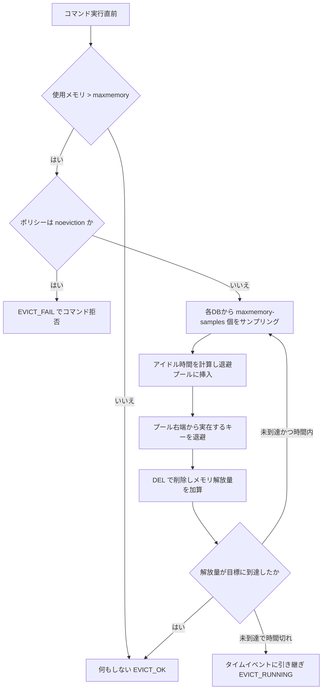
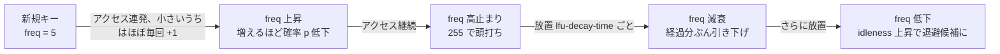

# 第32章 メモリ退避

> **本章で読むソース**
>
> - [`src/evict.c`](https://github.com/valkey-io/valkey/blob/9.1.0/src/evict.c)
> - [`src/lrulfu.c`](https://github.com/valkey-io/valkey/blob/9.1.0/src/lrulfu.c)
> - [`src/lrulfu.h`](https://github.com/valkey-io/valkey/blob/9.1.0/src/lrulfu.h)
> - [`src/object.c`](https://github.com/valkey-io/valkey/blob/9.1.0/src/object.c)
> - [`src/server.h`](https://github.com/valkey-io/valkey/blob/9.1.0/src/server.h)

## この章の狙い

Valkey は使用メモリが上限を超えると、保持しているキーの一部を捨ててメモリを取り戻す。
この処理を**メモリ退避**（eviction）と呼ぶ。
本章では、退避を発動する条件、退避するキーを選ぶポリシー、そして全キーを走査せずに退避候補を選ぶための二つの近似機構（**近似 LRU** と**確率的 LFU**）を、実コードに沿って読む。

## 前提

- メモリ使用量の計測と `maxmemory` の意味については[第12章 zmalloc](../part02-memory-keyspace/12-zmalloc.md)を先に読む。
- キー空間と `kvstore` の構造は[第13章 kvstore](../part02-memory-keyspace/13-kvstore.md)で扱う。
- 退避は失効（expire）とは別の機構である。失効は[第31章 有効期限](31-expire.md)を参照。

## 退避はどこで発動するか

退避の入口は `performEvictions` である。
この関数は、コマンドを実行する直前、メインスレッドがコマンドを処理する経路から呼ばれる。

[`src/server.c` L4478-L4479](https://github.com/valkey-io/valkey/blob/9.1.0/src/server.c#L4478-L4479)

```c
    if (server.maxmemory && !isInsideYieldingLongCommand()) {
        int out_of_memory = (performEvictions() == EVICT_FAIL);
```

`server.maxmemory` が 0 のとき、つまり上限を設けていないときは退避そのものを試みない。
`maxmemory` の既定値は 0 なので、初期状態では退避は起きない。

`performEvictions` は三つの結果を返す。

[`src/server.h` L3907-L3909](https://github.com/valkey-io/valkey/blob/9.1.0/src/server.h#L3907-L3909)

```c
#define EVICT_OK 0
#define EVICT_RUNNING 1
#define EVICT_FAIL 2
```

`EVICT_FAIL` は、メモリが上限を超えているのに退避できるキーが残っていない状態を指す。
このときメモリを増やす種類のコマンド（denyoom コマンド）は OOM エラーで拒否される。
`EVICT_RUNNING` は、まだ上限を超えているが退避処理を継続中であることを表す。

退避はコマンド実行のたびに同期的に走るが、一度の呼び出しで上限内に戻りきらなくてもよい。
解消しきれなかったときはタイムイベントを登録し、イベントループの合間に短い退避サイクルを繰り返す。

[`src/evict.c` L318-L341](https://github.com/valkey-io/valkey/blob/9.1.0/src/evict.c#L318-L341)

```c
/* The evictionTimeProc is started when "maxmemory" has been breached and
 * could not immediately be resolved.  This will spin the event loop with short
 * eviction cycles until the "maxmemory" condition has resolved or there are no
 * more evictable items.  */
static int isEvictionProcRunning = 0;
static long long evictionTimeProc(struct aeEventLoop *eventLoop, long long id, void *clientData) {
    UNUSED(eventLoop);
    UNUSED(id);
    UNUSED(clientData);

    if (performEvictions() == EVICT_RUNNING) return 0; /* keep evicting */

    /* For EVICT_OK - things are good, no need to keep evicting.
     * For EVICT_FAIL - there is nothing left to evict.  */
    isEvictionProcRunning = 0;
    return AE_NOMORE;
}
```

一度に解消しようとしないのは、ハッシュテーブルのリサイズや `maxmemory` の手動変更で、突然大きく上限を超えることがあるためである。
それを全部その場で退避しようとすると、退避だけにメインスレッドを占有してサーバが応答しなくなる。
退避に費やす時間には上限があり、超えた時点でループを抜けてタイムイベントに引き継ぐ。

[`src/evict.c` L598-L605](https://github.com/valkey-io/valkey/blob/9.1.0/src/evict.c#L598-L605)

```c
                /* After some time, exit the loop early - even if memory limit
                 * hasn't been reached.  If we suddenly need to free a lot of
                 * memory, don't want to spend too much time here.  */
                if (elapsedUs(evictionTimer) > eviction_time_limit_us) {
                    // We still need to free memory - start eviction timer proc
                    startEvictionTimeProc();
                    break;
                }
```

## どれだけ解放すべきかの判定

退避するかどうか、するならどれだけ解放すべきかは `getMaxmemoryState` が決める。
この関数は現在の使用メモリを `zmalloc_used_memory` から得て、`maxmemory` と比較する。

[`src/evict.c` L265-L301](https://github.com/valkey-io/valkey/blob/9.1.0/src/evict.c#L265-L301)

```c
int getMaxmemoryState(size_t *total, size_t *logical, size_t *tofree, float *level) {
    size_t mem_reported, mem_used, mem_tofree;

    /* Check if we are over the memory usage limit. If we are not, no need
     * to subtract the replicas output buffers. We can just return ASAP. */
    mem_reported = zmalloc_used_memory();
    if (total) *total = mem_reported;
    // ... (中略) ...
    /* Remove the size of replicas output buffers and AOF buffer from the
     * count of used memory. */
    mem_used = mem_reported;
    size_t overhead = freeMemoryGetNotCountedMemory();
    mem_used = (mem_used > overhead) ? mem_used - overhead : 0;
    // ... (中略) ...
    /* Compute how much memory we need to free. */
    mem_tofree = mem_used - server.maxmemory;
    // ... (中略) ...
    return C_ERR;
}
```

使用メモリをそのまま上限と比べるのではなく、いくつかのバッファ分を差し引く。
差し引く量は `freeMemoryGetNotCountedMemory` が返す。
対象はレプリケーション用の出力バッファと AOF バッファである。

[`src/evict.c` L192-L199](https://github.com/valkey-io/valkey/blob/9.1.0/src/evict.c#L192-L199)

```c
/* We don't want to count AOF buffers and replicas output buffers as
 * used memory: the eviction should use mostly data size, because
 * it can cause feedback-loop when we push DELs into them, putting
 * more and more DELs will make them bigger, if we count them, we
 * need to evict more keys, and then generate more DELs, maybe cause
 * massive eviction loop, even all keys are evicted.
 *
 * This function returns the sum of AOF and replication buffer. */
```

これらを使用メモリに数えないのには、暴走を避けるという明確な理由がある。
キーを退避すると `DEL` がレプリカ向けの出力バッファと AOF バッファに積まれ、バッファ自体が膨らむ。
バッファを使用メモリに数えてしまうと、退避するほど使用メモリが増えるように見え、さらに退避が必要になる。
この正のフィードバックを断つために、退避はデータ本体の大きさだけを見る。

## 退避ポリシー

退避するキーをどう選ぶかは `maxmemory-policy` が決める。
ポリシーは三つのフラグの組み合わせとして定義されている。

[`src/server.h` L547-L558](https://github.com/valkey-io/valkey/blob/9.1.0/src/server.h#L547-L558)

```c
#define MAXMEMORY_FLAG_LRU (1 << 0)
#define MAXMEMORY_FLAG_LFU (1 << 1)
#define MAXMEMORY_FLAG_ALLKEYS (1 << 2)

#define MAXMEMORY_VOLATILE_LRU ((0 << 8) | MAXMEMORY_FLAG_LRU)
#define MAXMEMORY_VOLATILE_LFU ((1 << 8) | MAXMEMORY_FLAG_LFU)
#define MAXMEMORY_VOLATILE_TTL (2 << 8)
#define MAXMEMORY_VOLATILE_RANDOM (3 << 8)
#define MAXMEMORY_ALLKEYS_LRU ((4 << 8) | MAXMEMORY_FLAG_LRU | MAXMEMORY_FLAG_ALLKEYS)
#define MAXMEMORY_ALLKEYS_LFU ((5 << 8) | MAXMEMORY_FLAG_LFU | MAXMEMORY_FLAG_ALLKEYS)
#define MAXMEMORY_ALLKEYS_RANDOM ((6 << 8) | MAXMEMORY_FLAG_ALLKEYS)
#define MAXMEMORY_NO_EVICTION (7 << 8)
```

ポリシーは二つの軸で読める。

- 対象の軸：`MAXMEMORY_FLAG_ALLKEYS` が立つポリシーはキー全体を対象にし、立たないポリシーは有効期限つきのキーだけを対象にする。コード上は前者が `db->keys`、後者が `db->expires` を退避元の `kvstore` に選ぶ。
- 基準の軸：`MAXMEMORY_FLAG_LRU` ならアイドル時間が長いキー、`MAXMEMORY_FLAG_LFU` ならアクセス頻度が低いキー、`MAXMEMORY_VOLATILE_TTL` なら失効が近いキー、`random` 系なら無作為に選ぶ。

`MAXMEMORY_NO_EVICTION` はどちらのフラグも立たない。
このとき退避は行わず、メモリを増やすコマンドはエラーで拒否する。

[`src/evict.c` L422-L425](https://github.com/valkey-io/valkey/blob/9.1.0/src/evict.c#L422-L425)

```c
    if (server.maxmemory_policy == MAXMEMORY_NO_EVICTION || (iAmPrimary() && server.import_mode)) {
        result = EVICT_FAIL; /* We need to free memory, but policy forbids or we are in import mode. */
        goto update_metrics;
    }
```

退避元の `kvstore` を `db->keys` と `db->expires` のどちらにするかは、退避ループの内側でフラグから決める。

[`src/evict.c` L459-L464](https://github.com/valkey-io/valkey/blob/9.1.0/src/evict.c#L459-L464)

```c
                    kvstore *kvs;
                    if (server.maxmemory_policy & MAXMEMORY_FLAG_ALLKEYS) {
                        kvs = db->keys;
                    } else {
                        kvs = db->expires;
                    }
```

## 近似 LRU と退避プール

LRU（least recently used）は、最も長く使われていないキーを選ぶ方針である。
これを厳密に実装するなら、全キーをアクセス時刻で並べた連結リストを保ち、末尾を退避する。
だがそのリストは件数に比例したメモリと、アクセスごとのつなぎ替えを要する。
Valkey はこれを避け、定数メモリで動く近似で済ませる。
方針はソースの冒頭コメントに書かれている。

[`src/evict.c` L70-L88](https://github.com/valkey-io/valkey/blob/9.1.0/src/evict.c#L70-L88)

```c
/* LRU approximation algorithm
 *
 * The server uses an approximation of the LRU algorithm that runs in constant
 * memory. Every time there is a key to expire, we sample N keys (with
 * N very small, usually in around 5) to populate a pool of best keys to
 * evict of M keys (the pool size is defined by EVPOOL_SIZE).
 *
 * The N keys sampled are added in the pool of good keys to expire (the one
 * with an old access time) if they are better than one of the current keys
 * in the pool.
 *
 * After the pool is populated, the best key we have in the pool is expired.
 * However note that we don't remove keys from the pool when they are deleted
 * so the pool may contain keys that no longer exist.
 *
 * When we try to evict a key, and all the entries in the pool don't exist
 * we populate it again. This time we'll be sure that the pool has at least
 * one key that can be evicted, if there is at least one key that can be
 * evicted in the whole database. */
```

近似の核は二つある。
一つは、全キーを並べる代わりに少数をランダムに**サンプリング**することである。
もう一つは、サンプルから選んだ良い候補を、呼び出しをまたいで**退避プール**（eviction pool）という固定長の配列に貯めておくことである。
プールの大きさは 16 に固定されている。

[`src/evict.c` L54-L62](https://github.com/valkey-io/valkey/blob/9.1.0/src/evict.c#L54-L62)

```c
#define EVPOOL_SIZE 16
#define EVPOOL_CACHED_SDS_SIZE 255
struct evictionPoolEntry {
    unsigned long long idle; /* Object idle time (inverse frequency for LFU) */
    sds key;                 /* Key name. */
    sds cached;              /* Cached SDS object for key name. */
    int dbid;                /* Key DB number. */
    int slot;                /* Slot. */
};
```

各エントリは `idle`（アイドル時間。値が大きいほど退避に適する）と、キー名 `key`、所属する DB とスロットを持つ。
プールはこの `idle` の昇順に並ぶ。
右端ほどアイドル時間が大きく、退避すべき良い候補が来る。

サンプリングとプールへの挿入を担うのが `evictionPoolPopulate` である。
この関数は対象の `kvstore` から `maxmemory-samples` 個（既定 5 個）のキーを取り、それぞれのアイドル時間を計算してプールに挿入していく。

[`src/evict.c` L113-L136](https://github.com/valkey-io/valkey/blob/9.1.0/src/evict.c#L113-L136)

```c
int evictionPoolPopulate(serverDb *db, kvstore *samplekvs, struct evictionPoolEntry *pool) {
    int j, k, count;
    void *samples[server.maxmemory_samples];

    int slot = kvstoreGetFairRandomHashtableIndex(samplekvs);
    /* We may get not found if there are no keys */
    if (slot == KVSTORE_INDEX_NOT_FOUND) return 0;
    count = kvstoreHashtableSampleEntries(samplekvs, slot, &samples[0], server.maxmemory_samples);
    for (j = 0; j < count; j++) {
        unsigned long long idle;
        robj *o = samples[j];
        sds key = objectGetKey(o);

        /* Calculate the idle time according to the policy. This is called
         * idle just because the code initially handled LRU, but is in fact
         * just a score where a higher score means better candidate. */
        if (server.maxmemory_policy & (MAXMEMORY_FLAG_LRU | MAXMEMORY_FLAG_LFU)) {
            idle = objectGetIdleness(o);
        } else if (server.maxmemory_policy == MAXMEMORY_VOLATILE_TTL) {
            /* In this case the sooner the expire the better. */
            idle = ULLONG_MAX - objectGetExpire(o);
        } else {
            serverPanic("Unknown eviction policy in evictionPoolPopulate()");
        }
```

`idle` という名前は LRU 由来だが、実際にはポリシーごとの「退避適性スコア」である。
LRU と LFU では `objectGetIdleness` の返す値を、TTL では失効が近いほど大きくなるよう `ULLONG_MAX` から失効時刻を引いた値を使う。
どのポリシーでも、スコアが大きいキーほど退避に適する、という一つの順序に揃えてある。

挿入は、自分より小さい `idle` を持つエントリの右に割り込む形で行う。
空きがあれば右へずらして場所を空け、空きがなければ最も小さい候補を押し出す。

[`src/evict.c` L138-L170](https://github.com/valkey-io/valkey/blob/9.1.0/src/evict.c#L138-L170)

```c
        /* Insert the element inside the pool.
         * First, find the first empty bucket or the first populated
         * bucket that has an idle time smaller than our idle time. */
        k = 0;
        while (k < EVPOOL_SIZE && pool[k].key && pool[k].idle < idle) k++;
        if (k == 0 && pool[EVPOOL_SIZE - 1].key != NULL) {
            /* Can't insert if the element is < the worst element we have
             * and there are no empty buckets. */
            continue;
        } else if (k < EVPOOL_SIZE && pool[k].key == NULL) {
            /* Inserting into empty position. No setup needed before insert. */
        } else {
            // ... (中略：右に空きがあれば memmove で右シフト、なければ左端を押し出す) ...
        }
```

プールに貯めたあと、退避ループはプールの右端から順にキーを選ぶ。

[`src/evict.c` L484-L514](https://github.com/valkey-io/valkey/blob/9.1.0/src/evict.c#L484-L514)

```c
                /* Go backward from best to worst element to evict. */
                for (k = EVPOOL_SIZE - 1; k >= 0; k--) {
                    if (pool[k].key == NULL) continue;
                    bestdbid = pool[k].dbid;
                    // ... (中略) ...
                    bool found = kvstoreHashtableFind(kvs, pool[k].slot, pool[k].key, &entry);

                    /* Remove the entry from the pool. */
                    if (pool[k].key != pool[k].cached) sdsfree(pool[k].key);
                    pool[k].key = NULL;
                    pool[k].idle = 0;

                    /* If the key exists, is our pick. Otherwise it is
                     * a ghost and we need to try the next element. */
                    if (found) {
                        valkey = entry;
                        bestkey = objectGetKey(valkey);
                        bestslot = pool[k].slot;
                        break;
                    } else {
                        /* Ghost... Iterate again. */
                    }
                }
```

プールはキーが削除されてもそのエントリを残すので、すでに存在しないキー（ghost）を含むことがある。
右端から見て見つからなければ次の候補へ進み、見つかったものを退避対象に決める。

退避プールが速度に効くのは、サンプルを呼び出しをまたいで蓄積できるからである。
一度のサンプリングだけで選ぶと、たまたまアイドルなキーがサンプルに入らなかったときに精度が落ちる。
プールに過去の良い候補を残しておけば、毎回の少数サンプルでも、より厳密な LRU に近い候補を退避できる。
これがサンプル数を `maxmemory-samples` 個（既定 5 個）に抑えたまま精度を上げる仕組みである。

退避サイクル全体を図にすると次のようになる。



## アイドル時間の近似と robj の lru フィールド

サンプルしたキーのアイドル時間は `objectGetIdleness` が返す。
この値は、各オブジェクトが持つ 24 ビットの `lru` フィールドから計算される。

[`src/server.h` L820-L830](https://github.com/valkey-io/valkey/blob/9.1.0/src/server.h#L820-L830)

```c
struct serverObject {
    unsigned type : 4;
    unsigned encoding : 4;
    unsigned lru : LRULFU_BITS;
    unsigned hasexpire : 1;
    unsigned hasembkey : 1;
    unsigned hasembval : 1;
    unsigned refcount : OBJ_REFCOUNT_BITS;
    void *val_ptr; /* Not always present. Use objectGetVal(obj) and
                    * objectSetVal(obj, val) instead. */
};
```

`lru` は `LRULFU_BITS`（24 ビット）の小さな領域である。
このフィールドは、LRU ポリシーのときは最終アクセス時刻として、LFU ポリシーのときは後述する頻度カウンタとして、二通りに使い分けられる。
1キーあたりわずか 24 ビットでアクセス履歴を近似することが、省メモリの要点である。

LRU の場合、`lru` には秒単位の最終アクセス時刻を 24 ビットに丸めて入れる。
アイドル時間は、現在時刻からこの値を引いて求める。

[`src/lrulfu.c` L42-L49](https://github.com/valkey-io/valkey/blob/9.1.0/src/lrulfu.c#L42-L49)

```c
uint32_t lru_getIdleSecs(uint32_t lru) {
    // Underflow is ok/expected
    uint32_t seconds = (LRUGetClockTime() - lru) & LRULFU_MASK;
    if (LRU_CLOCK_RESOLUTION != 1000) {
        seconds = (uint32_t)((long)seconds * LRU_CLOCK_RESOLUTION / 1000);
    }
    return seconds;
}
```

現在時刻 `lru_clock` はアクセスのたびに読み直すのではなく、サーバが定期的に更新したものを使う。
時刻を毎回システムコールで取らずキャッシュ済みの値を引くことで、アクセス経路のコストを下げている。
24 ビットしか持たないため、194 日触られないキーは時刻が一周し、最近アクセスされたように見えてしまう。
実用上はその前に退避されるか触られるため問題にならない。

`objectGetIdleness` は、ポリシーに応じて LRU と LFU を切り替える共通入口である。

[`src/object.c` L1656-L1661](https://github.com/valkey-io/valkey/blob/9.1.0/src/object.c#L1656-L1661)

```c
/* Return an indication of idleness.  Larger numbers are more idle. */
uint32_t objectGetIdleness(robj *o) {
    uint32_t idleness;
    o->lru = lrulfu_getIdleness(o->lru, &idleness);
    return idleness;
}
```

## 確率的 LFU カウンタ

LFU（least frequently used）は、アクセス**頻度**が低いキーを退避する方針である。
頻度を正確に数えるには各キーにアクセス回数のカウンタを持たせればよいが、それでは何バイトも要するうえ、古い人気が永遠に残る。
Valkey は同じ 24 ビットの `lru` フィールドを二つに割り、頻度を 8 ビットで近似する。

[`src/lrulfu.c` L52-L82](https://github.com/valkey-io/valkey/blob/9.1.0/src/lrulfu.c#L52-L82)

```c
/**************** LFU ****************/
/* ----------------------------------------------------------------------------
 * LFU (Least Frequently Used) implementation.
 *
 * We split the 24 bits into two fields:
 *
 *            16 bits           8 bits
 *     +-----------------------+--------+
 *     + Last access (minutes) | LOG_C  |
 *     +-----------------------+--------+
 *
 * LOG_C is a logarithmic counter that provides an indication of the access
 * frequency. However this field must also be decremented otherwise what used
 * to be a frequently accessed key in the past, will remain ranked like that
 * forever, while we want the algorithm to adapt to access pattern changes.
 *
 * So the remaining 16 bits are used in order to store the "access time",
 * a reduced-precision Unix time (we take 16 bits of the time converted
 * in minutes since we don't care about wrapping around) where the LOG_C
 * counter decays every minute by default (depends on lfu-decay-time).
 *
 * New keys don't start at zero, in order to have the ability to collect
 * some accesses before being trashed away, so they start at LFU_INIT_VAL.
 * The logarithmic increment performed on LOG_C takes care of LFU_INIT_VAL
 * when incrementing the key, so that keys starting at LFU_INIT_VAL
 * (or having a smaller value) have a very high chance of being incremented
 * on access. (The chance depends on counter and lfu-log-factor.)
 *
 * During decrement, the value of the logarithmic counter is decremented by
 * one when lfu-decay-time minutes elapsed.
 * --------------------------------------------------------------------------*/
```

上位 16 ビットに分単位の最終アクセス時刻、下位 8 ビットに対数カウンタ `LOG_C` を置く。
8 ビットのカウンタは 0 から 255 までしか数えられない。
これで膨大なアクセス回数を表せるのは、カウンタを 1 ずつではなく確率的に増やすからである。
この対数増加を担うのが `LFULogIncr` である。

[`src/lrulfu.c` L110-L121](https://github.com/valkey-io/valkey/blob/9.1.0/src/lrulfu.c#L110-L121)

```c
/* Increment the freq counter with logarithmic probability.
 * Values closer to 0 are more likely to increment.
 * Values closer to 255 are logarithmically less likely to increment. */
static uint8_t LFULogIncr(uint8_t freq) {
    if (freq == 255) return freq;
    double r = (double)rand() / RAND_MAX;
    double baseval = (int)freq - LFU_INIT_VAL;
    if (baseval < 0) baseval = 0;
    double p = 1.0 / (baseval * lfu_config_log_factor + 1);
    if (r < p) freq++;
    return freq;
}
```

アクセスのたびに、カウンタは確率 `p` でだけ 1 増える。
`p` は現在のカウンタ値が大きいほど小さくなる（`lfu-log-factor` は既定 10）。
カウンタが小さいうちはほぼ確実に増えるが、大きくなるほど増えにくくなる。
このため、数回しかアクセスされないキーと数百万回アクセスされるキーの違いを、8 ビットの範囲に対数的に押し込められる。
新しいキーは `LFU_INIT_VAL`（5）から始まり、退避される前にいくらかアクセスを集める猶予を持つ。

頻度は時間とともに減衰させる。
減衰しなければ、過去に人気だったキーが永遠に高頻度として残り、アクセス傾向の変化に追従できない。
減衰は `LFUDecay` が行う。

[`src/lrulfu.c` L98-L107](https://github.com/valkey-io/valkey/blob/9.1.0/src/lrulfu.c#L98-L107)

```c
/* Update an LFU to consider decay, but doesn't add a "touch" */
static uint32_t LFUDecay(uint32_t lfu) {
    uint16_t now = LFUGetTimeInMinutes();
    uint16_t prev_time = (uint16_t)(lfu >> 8);
    uint8_t freq = (uint8_t)lfu;
    uint16_t elapsed = now - prev_time; // Wrap-around expected/valid
    uint16_t num_periods = lfu_config_decay_time ? elapsed / lfu_config_decay_time : 0;
    freq = (num_periods > freq) ? 0 : freq - num_periods;
    return ((uint32_t)now << 8) | freq;
}
```

最終アクセスからの経過分を `lfu-decay-time`（既定 1 分）で割った数だけ、カウンタを引き下げる。
アクセス時の更新 `lfu_touch` は、まず `LFUDecay` で時間ぶんを減衰させ、続いて `LFULogIncr` で1回ぶんを増やす。

[`src/lrulfu.c` L124-L129](https://github.com/valkey-io/valkey/blob/9.1.0/src/lrulfu.c#L124-L129)

```c
uint32_t lfu_touch(uint32_t lfu) {
    lfu = LFUDecay(lfu);
    uint8_t freq = (uint8_t)lfu;
    freq = LFULogIncr(freq);
    return (lfu & ~(uint32_t)UINT8_MAX) | freq;
}
```

退避の候補選びでは頻度そのものではなく「退避適性」が必要なので、頻度を反転させてアイドル時間として扱う。
頻度が低いキーほどアイドル時間が大きくなり、LRU と同じ「スコアが大きいほど退避」という順序に乗る。

[`src/lrulfu.c` L162-L171](https://github.com/valkey-io/valkey/blob/9.1.0/src/lrulfu.c#L162-L171)

```c
uint32_t lrulfu_getIdleness(uint32_t lrulfu, uint32_t *idleness) {
    if (lrulfu_isUsingLFU()) {
        uint8_t freq;
        lrulfu = lfu_getFrequency(lrulfu, &freq);
        *idleness = UINT8_MAX - freq;
    } else {
        *idleness = lru_getIdleSecs(lrulfu);
    }
    return lrulfu;
}
```

LFU カウンタの対数増加と減衰を時系列で示すと次のようになる。



## 選んだキーを削除する

候補が決まると、退避ループはそのキーを削除してメモリ解放量を測る。

[`src/evict.c` L560-L574](https://github.com/valkey-io/valkey/blob/9.1.0/src/evict.c#L560-L574)

```c
            enterExecutionUnit(1, 0);
            delta = (long long)zmalloc_used_memory();
            latencyStartMonitor(eviction_latency);
            dbGenericDelete(db, keyobj, server.lazyfree_lazy_eviction, DB_FLAG_KEY_EVICTED);
            latencyEndMonitor(eviction_latency);
            latencyAddSampleIfNeeded("eviction-del", eviction_latency);
            latencyTraceIfNeeded(db, eviction_del, eviction_latency);
            delta -= (long long)zmalloc_used_memory();
            mem_freed += delta;
            server.stat_evictedkeys++;
            signalModifiedKey(NULL, db, keyobj);
            notifyKeyspaceEvent(NOTIFY_EVICTED, "evicted", keyobj, db->id);
            propagateDeletion(db, keyobj, server.lazyfree_lazy_eviction, bestslot);
            exitExecutionUnit();
            postExecutionUnitOperations();
```

削除前後で `zmalloc_used_memory` を読み、その差を解放量 `mem_freed` に積む。
削除は `dbGenericDelete` が行い、`server.lazyfree_lazy_eviction` が有効なら値の解放を別スレッドに回す。
退避したキーは `evicted` のキー空間通知として配信され、`DEL` がレプリカと AOF に伝播する。

`lazyfree-lazy-eviction` が有効なときは、別スレッドが裏で解放を進めるため、`mem_freed` の差分だけでは解放の実態を測りきれない。
このとき退避ループは 16 件ごとに `getMaxmemoryState` を読み直し、すでに目標に達していればループを抜ける。

[`src/evict.c` L578-L596](https://github.com/valkey-io/valkey/blob/9.1.0/src/evict.c#L578-L596)

```c
            if (keys_freed % 16 == 0) {
                /* When the memory to free starts to be big enough, we may
                 * start spending so much time here that is impossible to
                 * deliver data to the replicas fast enough, so we force the
                 * transmission here inside the loop. */
                if (replicas) flushReplicasOutputBuffers();
                // ... (中略) ...
                if (server.lazyfree_lazy_eviction) {
                    if (getMaxmemoryState(NULL, NULL, NULL, NULL) == C_OK) {
                        break;
                    }
                }
```

値の遅延解放そのものの仕組みは[第33章 遅延解放とデフラグ](33-lazyfree-defrag.md)で扱う。

## まとめ

- 退避はコマンド実行の直前に `performEvictions` から発動し、`maxmemory` が 0 のときは行わない。
- どれだけ解放すべきかは `getMaxmemoryState` が `zmalloc_used_memory` と `maxmemory` の差から決める。レプリカ出力バッファと AOF バッファは退避の暴走を防ぐため使用メモリから除く。
- ポリシーは「対象（全キーか失効時刻つきか）」と「基準（LRU/LFU/TTL/random）」の二軸で決まり、`noeviction` は退避せずコマンドを拒否する。
- 近似 LRU は、全キーを並べる代わりに少数をサンプリングし、良い候補を固定長 16 の退避プールに呼び出しをまたいで貯めることで、定数メモリのまま精度を上げる。
- 確率的 LFU は、24 ビットの `lru` フィールドを「最終アクセス分＋8 ビット対数カウンタ」に割り、`LFULogIncr` で対数的に増やし `LFUDecay` で時間減衰させて、少ないビットでアクセス頻度を近似する。
- 退避は時間制限つきで動き、解消しきれなければタイムイベントに引き継いでメインスレッドを長く占有しない。

## 関連する章

- [第12章 zmalloc](../part02-memory-keyspace/12-zmalloc.md)：使用メモリの計測。
- [第31章 有効期限](31-expire.md)：失効による削除との違い。
- [第33章 遅延解放とデフラグ](33-lazyfree-defrag.md)：退避したキーの値を別スレッドで解放する仕組み。
