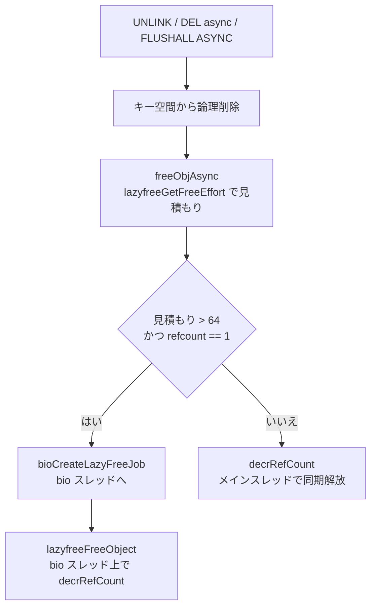
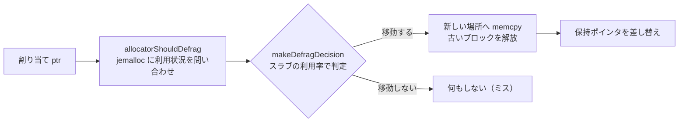

# 第33章 遅延解放とデフラグ

> **本章で読むソース**
>
> - [`src/lazyfree.c`](https://github.com/valkey-io/valkey/blob/9.1.0/src/lazyfree.c)
> - [`src/defrag.c`](https://github.com/valkey-io/valkey/blob/9.1.0/src/defrag.c)
> - [`src/allocator_defrag.c`](https://github.com/valkey-io/valkey/blob/9.1.0/src/allocator_defrag.c)
> - [`src/bio.c`](https://github.com/valkey-io/valkey/blob/9.1.0/src/bio.c)

## この章の狙い

Valkey は単一スレッドでコマンドを処理する。
このモデルでは、ひとつのコマンドが長く実行されると、その間ほかのクライアントの処理がすべて止まる。
本章では、メインスレッドの停止時間を抑えるための二つの仕組みを読む。
ひとつは巨大なオブジェクトの解放をバックグラウンドに逃がす遅延解放、もうひとつは長時間動かしたプロセスのメモリ断片化を少しずつ詰め直すアクティブデフラグである。

## 前提

メモリ確保の抽象層については[第12章「zmalloc」](../part02-memory-keyspace/12-zmalloc.md)を、キー空間を保持する `kvstore` については[第13章「kvstore」](../part02-memory-keyspace/13-kvstore.md)を先に読むとよい。
バックグラウンドの入出力スレッド（bio スレッド）の全体像は[第37章「永続化の内部」](../part06-persistence/37-persistence-internals.md)で扱う。

## メインスレッドを止める解放コスト

`DEL` で巨大な集合を消す場面を考える。
数百万要素を持つ集合は、内部的には要素ごとに確保された割り当ての集まりである。
これを解放するとは、その数百万個の割り当てをひとつずつアロケータへ返すことを意味する。
単一スレッドの Valkey では、この解放がメインスレッドの上で同期的に走るあいだ、ほかのコマンドは一切進まない。

`UNLINK` コマンドや、`FLUSHALL ASYNC` のような `ASYNC` 系のコマンドは、この問題に対する答えである。
キー空間からの論理的な削除（テーブルからの取り外し）だけをメインスレッドで即座に終え、実体のメモリ解放はバックグラウンドの bio スレッドに渡す。
こうすると、呼び出し側のコマンドはオブジェクトの大きさによらず短時間で返る。

削除の入口は `dbGenericDeleteWithDictIndex` にある。
キーと有効期限テーブルからエントリを外したあと、`async` フラグに応じて解放経路を選ぶ。

[`src/db.c` L492-L511](https://github.com/valkey-io/valkey/blob/9.1.0/src/db.c#L492-L511)

```c
        /* Delete from keys and expires tables. This will not free the object.
         * (The expires table has no destructor callback.) */
        kvstoreHashtableTwoPhasePopDelete(db->keys, dict_index, &pos);
        // ... (中略) ...
        if (async) {
            freeObjAsync(key, val, db->id);
        } else {
            decrRefCount(val);
        }
```

同期削除では `decrRefCount` がその場でオブジェクトを解放する。
非同期削除では `freeObjAsync` を呼ぶ。
ただし、非同期を選んでも必ずバックグラウンドへ回すわけではない。
小さなオブジェクトをわざわざ別スレッドへ渡すと、ジョブを組み立てる手間のぶんだけ遅くなる。
そこで `freeObjAsync` は、解放コストを見積もってから経路を分ける。

## 解放コストの見積もり

非同期にする価値があるかは、そのオブジェクトの解放にどれだけの割り当てを返す必要があるかで決まる。
`lazyfreeGetFreeEffort` は、この「解放にかかる手間」を要素数などから見積もって返す。

[`src/lazyfree.c` L137-L182](https://github.com/valkey-io/valkey/blob/9.1.0/src/lazyfree.c#L137-L182)

```c
size_t lazyfreeGetFreeEffort(robj *key, robj *obj, int dbid) {
    if (obj->type == OBJ_LIST && obj->encoding == OBJ_ENCODING_QUICKLIST) {
        quicklist *ql = objectGetVal(obj);
        return ql->len;
    } else if (obj->type == OBJ_SET && obj->encoding == OBJ_ENCODING_HASHTABLE) {
        hashtable *ht = objectGetVal(obj);
        return hashtableSize(ht);
    } else if (obj->type == OBJ_ZSET && obj->encoding == OBJ_ENCODING_SKIPLIST) {
        zset *zs = objectGetVal(obj);
        return zslGetLength(zs->zsl);
    } else if (obj->type == OBJ_HASH && obj->encoding == OBJ_ENCODING_HASHTABLE) {
        hashtable *ht = objectGetVal(obj);
        return hashtableSize(ht);
    } else if (obj->type == OBJ_STREAM) {
        // ... (中略) ...
    } else if (obj->type == OBJ_MODULE) {
        // ... (中略) ...
    } else {
        return 1; /* Everything else is a single allocation. */
    }
}
```

見積もりの値は、実際の割り当て数そのものではなく、それに比例する量である。
ハッシュテーブルで表される集合やハッシュなら要素数、スキップリストで表される sorted set なら要素数、quicklist で表されるリストならノード数を返す。
ストリームの場合は、内部の rax のノード数に、コンシューマグループとその PEL の大きさを加えた値で近似する。
全要素を数え歩くと見積もりだけで時間がかかるため、定数時間で済む量から推定している。
文字列のように単一の割り当てで表されるものは、論理的に複数の要素を含んでいても `1` を返す。

この見積もりを使い、`freeObjAsync` は閾値で経路を分ける。

[`src/lazyfree.c` L189-L204](https://github.com/valkey-io/valkey/blob/9.1.0/src/lazyfree.c#L189-L204)

```c
#define LAZYFREE_THRESHOLD 64

/* Free an object, if the object is huge enough, free it in async way. */
void freeObjAsync(robj *key, robj *obj, int dbid) {
    size_t free_effort = lazyfreeGetFreeEffort(key, obj, dbid);
    /* Note that if the object is shared, to reclaim it now it is not
     * possible. This rarely happens, however sometimes the implementation
     * of parts of the server core may call incrRefCount() to protect
     * objects, and then call dbDelete(). */
    if (free_effort > LAZYFREE_THRESHOLD && obj->refcount == 1) {
        atomic_fetch_add_explicit(&lazyfree_objects, 1, memory_order_relaxed);
        bioCreateLazyFreeJob(lazyfreeFreeObject, 1, obj);
    } else {
        decrRefCount(obj);
    }
}
```

非同期へ回す条件は二つある。
見積もりが閾値 `LAZYFREE_THRESHOLD`（64）を超えること、そして参照カウントが `1` であることである。
後者は、ほかから参照されているオブジェクトを横取りして解放しないための条件である。
両方を満たすときだけ `bioCreateLazyFreeJob` でジョブを作り、解放カウンタを増やす。
それ以外は `decrRefCount` で同期解放する。
コメントが述べるとおり、割り当てがわずかしかないオブジェクトを遅延解放に回すのは、かえって遅いだけだからである。

bio スレッド側が実際に取り出して走らせるのは `lazyfreeFreeObject` で、中身は `decrRefCount` を呼ぶだけである。
解放そのものは同期削除と同じで、走る場所がメインスレッドからバックグラウンドへ移っただけだと読める。

[`src/lazyfree.c` L12-L19](https://github.com/valkey-io/valkey/blob/9.1.0/src/lazyfree.c#L12-L19)

```c
/* Release objects from the lazyfree thread. It's just decrRefCount()
 * updating the count of objects to release. */
void lazyfreeFreeObject(void *args[]) {
    robj *o = (robj *)args[0];
    decrRefCount(o);
    atomic_fetch_sub_explicit(&lazyfree_objects, 1, memory_order_relaxed);
    atomic_fetch_add_explicit(&lazyfreed_objects, 1, memory_order_relaxed);
}
```



このジョブ生成 `bioCreateLazyFreeJob` は、渡された引数を `bio_job` に詰めて `BIO_LAZY_FREE` 種別のキューへ投入する。

[`src/bio.c` L193-L206](https://github.com/valkey-io/valkey/blob/9.1.0/src/bio.c#L193-L206)

```c
void bioCreateLazyFreeJob(lazy_free_fn free_fn, int arg_count, ...) {
    va_list valist;
    /* Allocate memory for the job structure and all required
     * arguments */
    bio_job *job = allocBioJob(sizeof(void *) * (arg_count));
    job->free_args.free_fn = free_fn;
    // ... (中略) ...
    bioSubmitJob(BIO_LAZY_FREE, job);
}
```

キューに投入したあとの取り出しとスレッド側の実行は bio スレッドの責務である。
その全体像は第37章で扱う。

## データベース全体を非同期で空にする

個々のキーだけでなく、データベース全体の `FLUSHALL ASYNC` も同じ発想で実装されている。
`emptyDbAsync` は、古いハッシュテーブル群を解放する代わりに、新しい空のテーブルへ差し替え、古いほうをまるごと bio スレッドへ渡す。

[`src/lazyfree.c` L206-L222](https://github.com/valkey-io/valkey/blob/9.1.0/src/lazyfree.c#L206-L222)

```c
/* Empty a DB asynchronously. What the function does actually is to
 * create a new empty set of hash tables and scheduling the old ones for
 * lazy freeing. */
void emptyDbAsync(serverDb *db) {
    // ... (中略) ...
    kvstore *oldkeys = db->keys, *oldexpires = db->expires, *oldkeyswithexpires = db->keys_with_volatile_items;
    db->keys = kvstoreCreate(&kvstoreKeysHashtableType, slot_count_bits, flags);
    db->expires = kvstoreCreate(&kvstoreExpiresHashtableType, slot_count_bits, flags);
    db->keys_with_volatile_items = kvstoreCreate(&kvstoreExpiresHashtableType, slot_count_bits, flags);
    atomic_fetch_add_explicit(&lazyfree_objects, kvstoreSize(oldkeys), memory_order_relaxed);
    bioCreateLazyFreeJob(lazyfreeFreeDatabase, 3, oldkeys, oldexpires, oldkeyswithexpires);
}
```

メインスレッドが行うのは、三つの `kvstore` ポインタを退避し、空のテーブルを差し込むことだけである。
クライアントから見ればデータベースは即座に空になっている。
退避した古いテーブルは、bio スレッドの `lazyfreeFreeDatabase` が `kvstoreRelease` で解放する。
同じパターンは `lazyfree.c` の各所にあり、クライアント追跡テーブルやレプリケーションバックログ、スクリプト辞書なども、要素数が `LAZYFREE_THRESHOLD` を超えるときだけ非同期で解放する。
どの非同期化も、解放コストが小さいうちは同期で済ませる点で一貫している。

なお、非同期削除を既定の挙動にするかは `lazyfree-lazy-user-del` などの設定で切り替えられる。
退避（eviction）や有効期限切れ、内部削除に対してもそれぞれ `lazyfree-lazy-eviction`、`lazyfree-lazy-expire`、`lazyfree-lazy-server-del`、`lazyfree-lazy-user-flush` が用意されている。

## 長時間稼働とメモリの断片化

遅延解放はメインスレッドの停止を避ける仕組みだった。
もうひとつの仕組みであるアクティブデフラグは、別の問題に答える。
長く動かしたプロセスでは、確保と解放を繰り返すうちにメモリが断片化する。
小さな割り当てがあちこちのスラブにまばらに残ると、アロケータは新しいスラブを返せないままメモリを抱え込む。
これがプロセスの実メモリ使用量（RSS）を押し上げる。

アクティブデフラグは、アロケータが管理する割り当てのうち「移動したほうがよい」ものを見つけ、新しい場所へコピーして詰め直す。
判定はアロケータ（jemalloc）に問い合わせる。
`activeDefragAllocWithoutFree` が、その問い合わせと移動の中核である。

[`src/defrag.c` L163-L180](https://github.com/valkey-io/valkey/blob/9.1.0/src/defrag.c#L163-L180)

```c
static void *activeDefragAllocWithoutFree(void *ptr, size_t *allocation_size) {
    size_t size;
    void *newptr;
    if (!allocatorShouldDefrag(ptr)) {
        server.stat_active_defrag_misses++;
        return NULL;
    }
    /* move this allocation to a new allocation.
     * make sure not to use the thread cache. so that we don't get back the same
     * pointers we try to free */
    size = zmalloc_size(ptr);
    newptr = allocatorDefragAlloc(size);
    memcpy(newptr, ptr, size);
    if (allocation_size) *allocation_size = size;

    server.stat_active_defrag_hits++;
    return newptr;
}
```

最初に `allocatorShouldDefrag` で、この割り当てを移動すべきか問い合わせる。
移動不要なら `NULL` を返して何もしない（ミスとして数える）。
移動すべきなら、同じサイズの新しい割り当てを取り、内容をコピーして新しいポインタを返す（ヒットとして数える）。
コメントが注意するとおり、確保にはスレッドキャッシュを避ける割り当てを使う。
いま解放しようとしているのと同じ番地を取り戻してしまっては、詰め直しにならないからである。

公開版の `activeDefragAlloc` は、これに古いブロックの解放を足したものである。

[`src/defrag.c` L187-L192](https://github.com/valkey-io/valkey/blob/9.1.0/src/defrag.c#L187-L192)

```c
void *activeDefragAlloc(void *ptr) {
    size_t allocation_size;
    void *newptr = activeDefragAllocWithoutFree(ptr, &allocation_size);
    if (newptr) allocatorDefragFree(ptr, allocation_size);
    return newptr;
}
```

呼び出し側は、`activeDefragAlloc` が非 `NULL` を返したら、自分が保持していた古いポインタを新しいものへ差し替える。
キーひとつぶんを処理する `defragKey` では、型とエンコーディングごとに、保持しているポインタを順に `activeDefragAlloc` へ通し、戻り値があれば差し替えていく。

[`src/defrag.c` L715-L723](https://github.com/valkey-io/valkey/blob/9.1.0/src/defrag.c#L715-L723)

```c
    } else if (ob->type == OBJ_SET) {
        if (ob->encoding == OBJ_ENCODING_HASHTABLE) {
            defragSet(ob);
        } else if (ob->encoding == OBJ_ENCODING_INTSET || ob->encoding == OBJ_ENCODING_LISTPACK) {
            void *newptr, *ptr = objectGetVal(ob);
            if ((newptr = activeDefragAlloc(ptr))) objectSetVal(ob, newptr);
        } else {
            serverPanic("Unknown set encoding");
        }
```

## 移動すべき割り当ての判定

移動すべきかどうかは jemalloc の状態に基づく。
`allocatorShouldDefrag` は、対象ポインタが属するスラブの利用状況を jemalloc に問い合わせ、判定関数に渡す。

[`src/allocator_defrag.c` L382-L411](https://github.com/valkey-io/valkey/blob/9.1.0/src/allocator_defrag.c#L382-L411)

```c
int allocatorShouldDefrag(void *ptr) {
    assert(defrag_supported);
    size_t out[BATCH_QUERY_ARGS_OUT];
    // ... (中略) ...
    je_mallctlbymib(je_cb.util_batch_query.key,
                    je_cb.util_batch_query.keylen,
                    out, &out_sz,
                    &ptr, in_sz);
    // ... (中略) ...
    return makeDefragDecision(&je_cb.bin_info[binind],
                              &je_usage_info[binind],
                              je_cb.bin_info[binind].nregs - SLAB_NFREE(out, 0));
}
```

問い合わせの実体は jemalloc の `util_batch_query` で、対象ポインタが属するスラブの長さ、領域数、空き数を返す。
ここから領域サイズを求めてスラブの bin を特定し、その bin の利用統計とともに `makeDefragDecision` へ渡す。
この判定は、以前の jemalloc が提供していた `je_get_defrag_hint` と同じ役割を、Valkey 側で再実装したものである。

判定そのものは利用率に基づく。

[`src/allocator_defrag.c` L358-L373](https://github.com/valkey-io/valkey/blob/9.1.0/src/allocator_defrag.c#L358-L373)

```c
static inline int makeDefragDecision(jeBinInfo *bin_info, jemallocBinUsageData *bin_usage, unsigned long nalloced) {
    unsigned long curr_full_slabs = bin_usage->curr_slabs - bin_usage->curr_nonfull_slabs;
    size_t allocated_nonfull = bin_usage->curr_regs - curr_full_slabs * bin_info->nregs;

    /* Don't defrag if the slab is full or if there's only 1 nonfull slab */
    if (bin_info->nregs == nalloced || bin_usage->curr_nonfull_slabs < 2) return 0;

    /* Defrag if the slab is less than 1/8 full */
    if (1000 * nalloced < bin_info->nregs * UTILIZATION_THRESHOLD_FACTOR_MILLI) return 1;

    /* Don't defrag if the slab usage is greater than the average usage (+ 12.5%) */
    if (1000 * nalloced * bin_usage->curr_nonfull_slabs > (1000 + UTILIZATION_THRESHOLD_FACTOR_MILLI) * allocated_nonfull) return 0;

    /* Otherwise, defrag! */
    return 1;
}
```

スラブが満杯なら、領域を動かしても断片化率は変わらないので移動しない。
非満杯のスラブがひとつしかなければ、移し先がないので移動しない。
そのうえで、スラブの利用率が 1/8（12.5%）未満ならまばらとみなして移動し、平均利用率を 12.5% 以上上回るほど詰まっているなら移動しない。
要するに、空きの多いスラブから領域を抜き取り、詰まったスラブへ寄せることで、空になったスラブをアロケータへ返せるようにする。



## CPU 予算の中で少しずつ進める

断片化の解消は一度に終わらせるものではない。
キー空間を全走査して全割り当てを動かせば、その間メインスレッドが長く止まり、遅延解放で避けたはずの停止を自ら招く。
そこでアクティブデフラグは、専用のタイマーで小刻みに走り、CPU 予算の範囲で少しずつ進める。

中心となる `activeDefragTimeProc` は、今回の処理に使える時間 `endtime` を決め、その時刻まで段階（ステージ）を進める。

[`src/defrag.c` L1161-L1198](https://github.com/valkey-io/valkey/blob/9.1.0/src/defrag.c#L1161-L1198)

```c
    monotime starttime = getMonotonicUs();
    int dutyCycleUs = computeDefragCycleUs();
    monotime endtime = starttime + dutyCycleUs;
    bool haveMoreWork = true;
    // ... (中略) ...
    do {
        if (!defrag.current_stage) {
            defrag.current_stage = listNodeValue(listFirst(defrag.remaining_stages));
            listDelNode(defrag.remaining_stages, listFirst(defrag.remaining_stages));
            // Initialize the stage with endtime==0
            doneStatus status = defrag.current_stage->stage_fn(0, defrag.current_stage->target, defrag.current_stage->privdata);
            serverAssert(status == DEFRAG_NOT_DONE); // Initialization should always return DEFRAG_NOT_DONE
        }

        doneStatus status = defrag.current_stage->stage_fn(endtime, defrag.current_stage->target, defrag.current_stage->privdata);
        if (status == DEFRAG_DONE) {
            zfree(defrag.current_stage);
            defrag.current_stage = NULL;
        }

        haveMoreWork = (defrag.current_stage || listLength(defrag.remaining_stages) > 0);
        // ... (中略) ...
    } while (haveMoreWork && getMonotonicUs() <= endtime - server.active_defrag_cycle_us);
```

各ステージ関数は、渡された `endtime` を超えたら処理を中断し、続きが残っていることを示す `DEFRAG_NOT_DONE` を返す。
タイマーは残作業があれば次回の呼び出しを予約し、なければ `endDefragCycle` でサイクルを閉じる。
このように内部状態（走査カーソルなど）を静的変数に保持し、毎回の呼び出しで少しずつ前進する点が、レイテンシを抑える要である。

巨大なコレクションは、メインの走査の中で一気に処理すると、その一回でレイテンシが跳ねる。
そこで、要素の多いオブジェクトは `defragLater` で後回しリストに積み、別の段階でカーソルを進めながら少しずつ処理する。

[`src/defrag.c` L356-L367](https://github.com/valkey-io/valkey/blob/9.1.0/src/defrag.c#L356-L367)

```c
/* when the value has lots of elements, we want to handle it later and not as
 * part of the main dictionary scan. this is needed in order to prevent latency
 * spikes when handling large items */
static void defragLater(robj *obj) {
    if (!defrag_later) {
        defrag_later = listCreate();
        listSetFreeMethod(defrag_later, sdsfreeVoid);
        defrag_later_cursor = 0;
    }
    sds key = sdsdup(objectGetKey(obj));
    listAddNodeTail(defrag_later, key);
}
```

後回しリストを処理する `defragLaterStep` は、ひとつの大きなキーの内部を走査する途中でも `endtime` を超えれば中断し、カーソルを残して戻る。
時間内に進める量は、反復回数やヒット数、走査数を見ながら調整される。

## 断片化率としきい値

デフラグを始めるかどうか、どれだけ CPU を割くかは、断片化率で決める。
断片化率は jemalloc の統計から `getAllocatorFragmentation` が計算する。

[`src/allocator_defrag.c` L419-L434](https://github.com/valkey-io/valkey/blob/9.1.0/src/allocator_defrag.c#L419-L434)

```c
float getAllocatorFragmentation(size_t *out_frag_bytes) {
    size_t resident, active, allocated, frag_smallbins_bytes;
    zmalloc_get_allocator_info(&allocated, &active, &resident, NULL, NULL);
    frag_smallbins_bytes = allocatorDefragGetFragSmallbins();
    /* Calculate the fragmentation ratio as the proportion of wasted memory in small
     * bins (which are defraggable) relative to the total allocated memory (including large bins).
     * This is because otherwise, if most of the memory usage is large bins, we may show high percentage,
     * despite the fact it's not a lot of memory for the user. */
    float frag_pct = (float)frag_smallbins_bytes / allocated * 100;
    // ... (中略) ...
    return frag_pct;
}
```

断片化率 `frag_pct` は、デフラグ可能なスモールビンの無駄なバイト数を、ラージビンを含む総確保量で割った割合である。
ラージビンの大きな割り当てで割合が見かけ上膨らむことを避けるため、分母に総量を取っている。

この `frag_pct` を使い、`updateDefragCpuPercent` がデフラグの開始としきい値を判定する。

[`src/defrag.c` L1264-L1293](https://github.com/valkey-io/valkey/blob/9.1.0/src/defrag.c#L1264-L1293)

```c
static void updateDefragCpuPercent(void) {
    size_t frag_bytes;
    float frag_pct = getAllocatorFragmentation(&frag_bytes);
    if (server.active_defrag_cpu_percent == 0) {
        if (frag_pct < server.active_defrag_threshold_lower ||
            frag_bytes < server.active_defrag_ignore_bytes) return;
    }

    /* Calculate the adaptive aggressiveness of the defrag based on the current
     * fragmentation and configurations. */
    int cpu_pct = INTERPOLATE(frag_pct, server.active_defrag_threshold_lower, server.active_defrag_threshold_upper,
                              server.active_defrag_cpu_min, server.active_defrag_cpu_max);
    cpu_pct = LIMIT(cpu_pct, server.active_defrag_cpu_min, server.active_defrag_cpu_max);
    // ... (中略) ...
}
```

断片化率が下限しきい値 `active-defrag-threshold-lower` を下回るか、無駄なバイト数が `active-defrag-ignore-bytes` を下回るあいだは、デフラグを始めない。
わずかな断片化のために CPU を使うのは割に合わないからである。
しきい値を超えると、断片化率を下限から上限 `active-defrag-threshold-upper` までの区間に対応づけ、割り当てる CPU を `active-defrag-cycle-min` から `active-defrag-cycle-max` の範囲で線形補間する（`INTERPOLATE`）。
断片化が進むほど、デフラグへ回す CPU の割合が上がる。
主な設定は次のとおりである。

| 設定 | 既定値 | 役割 |
| --- | --- | --- |
| `activedefrag` | 無効 | アクティブデフラグの有効化 |
| `active-defrag-ignore-bytes` | 100MB | この量を下回る断片化は無視する |
| `active-defrag-threshold-lower` | 10 | この断片化率（%）からデフラグを始める |
| `active-defrag-threshold-upper` | 100 | この断片化率（%）で最大の CPU を割く |
| `active-defrag-cycle-min` | 1 | 下限しきい値での CPU 割合（%） |
| `active-defrag-cycle-max` | 25 | 上限しきい値での CPU 割合（%） |

このように、断片化率を入力、CPU 割合を出力とする補間によって、必要なときだけ必要な強さで動く。
これがアクティブデフラグを「常時動かしても安全」にする要である。

## まとめ

- 単一スレッドの Valkey では、巨大オブジェクトの同期解放がメインスレッドを長く止める。遅延解放はこの解放を bio スレッドへ逃がし、コマンドの応答時間をオブジェクトの大きさから切り離す。
- 何を非同期にするかは `lazyfreeGetFreeEffort` が要素数などからコストを見積もり、閾値 `LAZYFREE_THRESHOLD`（64）と参照カウントで判定する。小さいオブジェクトは同期解放のほうが速い。
- `emptyDbAsync` は古いテーブルを空のものへ差し替え、古いほうをまるごと bio スレッドへ渡す。データベースは即座に空に見え、解放はバックグラウンドで進む。
- アクティブデフラグは、jemalloc に「移動すべき割り当て」を問い合わせ（`allocatorShouldDefrag` と `makeDefragDecision`）、新しい場所へコピーして詰め直す（`activeDefragAlloc`）。空になったスラブをアロケータへ返せるようにして RSS を下げる。
- デフラグは専用タイマーで CPU 予算の範囲を少しずつ進め、巨大なコレクションは `defragLater` で後回しにしてレイテンシの跳ねを防ぐ。
- 断片化率 `frag_pct` を入力に、`active-defrag-*` の各しきい値で開始判断と CPU 割合を決める。断片化が進むほど CPU を多く割く線形補間が、常時稼働を安全にしている。

## 関連する章

- [第12章「zmalloc」](../part02-memory-keyspace/12-zmalloc.md)：メモリ確保の抽象層と、断片化率の計算に使うアロケータ統計の出どころ。
- [第13章「kvstore」](../part02-memory-keyspace/13-kvstore.md)：遅延解放やデフラグが対象とするキー空間の保持構造。
- [第32章「メモリ退避」](../part05-database/32-eviction.md)：退避時の削除も `lazyfree-lazy-eviction` を通じて遅延解放と結び付く。
- [第37章「永続化の内部」](../part06-persistence/37-persistence-internals.md)：遅延解放ジョブを実行する bio スレッドの全体像。
