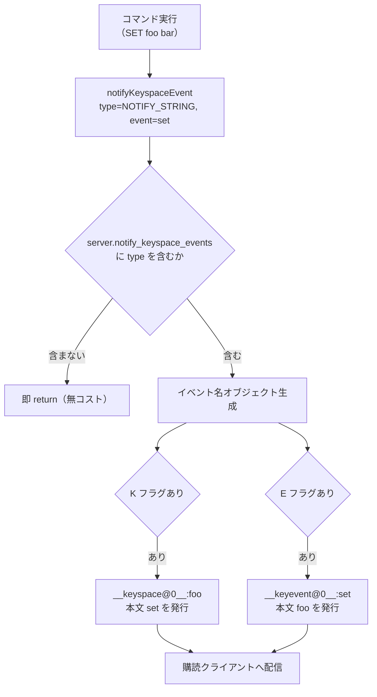

# 第34章 キースペース通知

> **本章で読むソース**
>
> - [`src/notify.c`](https://github.com/valkey-io/valkey/blob/9.1.0/src/notify.c)
> - [`src/server.h`](https://github.com/valkey-io/valkey/blob/9.1.0/src/server.h)
> - [`src/t_string.c`](https://github.com/valkey-io/valkey/blob/9.1.0/src/t_string.c)
> - [`src/db.c`](https://github.com/valkey-io/valkey/blob/9.1.0/src/db.c)

## この章の狙い

キーへの操作が起きたとき、その事実をクライアントへ知らせる仕組みがキースペース通知である。
本章では、コマンドが値を書き換えたあとに `notifyKeyspaceEvent` を呼ぶ流れ、通知が流れる2系統のチャンネル、そして設定フラグによって通知を取捨する仕組みを、実コードから読み解く。
平常時にコストをかけずに通知を提供する設計の核も合わせて見る。

## 前提

- Pub/Sub の発行と購読の仕組みは[第43章 Pub/Sub](../part08-features/43-pubsub.md)で扱う。本章は発行側だけを見る。
- キーの有効期限と失効は[第31章 有効期限](./31-expire.md)、メモリ退避は[第32章 メモリ退避](./32-eviction.md)で扱う。

## キースペース通知とは何か

キースペース通知は、キーに対する操作（`SET`、`DEL`、`EXPIRE`、有効期限切れによる失効など）が起きたとき、その事実を特別な Pub/Sub チャンネルへ発行する機能である。
購読しているクライアントは、自分が監視したいキーやイベントの変化をリアルタイムに受け取れる。
ポーリングで値を読み直すのではなく、変化があったときだけ通知を受け取る用途に向く。

通知の入口は一つの関数に集約されている。
コマンドの実装は、値を書き換えたあとにこの関数を呼ぶだけでよい。

[`src/notify.c` L97-L104](https://github.com/valkey-io/valkey/blob/9.1.0/src/notify.c#L97-L104)

```c
/* The API provided to the rest of the serer core is a simple function:
 *
 * notifyKeyspaceEvent(int type, char *event, robj *key, int dbid);
 *
 * 'type' is the notification class we define in `server.h`.
 * 'event' is a C string representing the event name.
 * 'key' is an Object representing the key name.
 * 'dbid' is the database ID where the key lives.  */
```

引数は4つである。
`type` は通知の種別を表すフラグで、`event` はイベント名の文字列、`key` は対象のキーオブジェクト、`dbid` はそのキーが属するデータベース番号を指す。
たとえば文字列への `SET` なら、種別は `NOTIFY_STRING`、イベント名は `"set"` となる。

## 種別を表すフラグ

通知の種別は、ビットフラグの定数として `server.h` に定義されている。

[`src/server.h` L652-L671](https://github.com/valkey-io/valkey/blob/9.1.0/src/server.h#L652-L671)

```c
/* Keyspace changes notification classes. Every class is associated with a
 * character for configuration purposes. */
#define NOTIFY_KEYSPACE (1 << 0)  /* K */
#define NOTIFY_KEYEVENT (1 << 1)  /* E */
#define NOTIFY_GENERIC (1 << 2)   /* g */
#define NOTIFY_STRING (1 << 3)    /* $ */
#define NOTIFY_LIST (1 << 4)      /* l */
#define NOTIFY_SET (1 << 5)       /* s */
#define NOTIFY_HASH (1 << 6)      /* h */
#define NOTIFY_ZSET (1 << 7)      /* z */
#define NOTIFY_EXPIRED (1 << 8)   /* x */
#define NOTIFY_EVICTED (1 << 9)   /* e */
#define NOTIFY_STREAM (1 << 10)   /* t */
#define NOTIFY_KEY_MISS (1 << 11) /* m (Note: This one is excluded from NOTIFY_ALL on purpose) */
#define NOTIFY_LOADED (1 << 12)   /* module only key space notification, indicate a key loaded from rdb */
#define NOTIFY_MODULE (1 << 13)   /* d, module key space notification */
#define NOTIFY_NEW (1 << 14)      /* n, new key notification */
#define NOTIFY_ALL                                                                                            \
    (NOTIFY_GENERIC | NOTIFY_STRING | NOTIFY_LIST | NOTIFY_SET | NOTIFY_HASH | NOTIFY_ZSET | NOTIFY_EXPIRED | \
     NOTIFY_EVICTED | NOTIFY_STREAM | NOTIFY_MODULE) /* A flag */
```

フラグは大きく2系統に分かれる。
`NOTIFY_GENERIC` から `NOTIFY_NEW` までは、どんな操作が起きたかという**イベントの種別**を表す。
`NOTIFY_KEYSPACE`（`K`）と `NOTIFY_KEYEVENT`（`E`）は、通知をどちらのチャンネルへ流すかという**チャンネルの選択**を表す。
各フラグの右にあるコメントの文字は、設定で種別を指定するときの一文字記号である。

`NOTIFY_KEY_MISS`（`m`）が `NOTIFY_ALL` から意図的に除外されている点には、コメントが注意を促している。
存在しないキーへの読み取りはアプリケーションで頻発しうるため、`A` を指定しただけで大量の通知が流れることを避ける配慮である。

## 設定フラグへの変換

設定 `notify-keyspace-events` には `KEA` や `Elg` のような文字列を与える。
この文字列を一文字ずつ走査し、対応するフラグを論理和で積み上げるのが `keyspaceEventsStringToFlags` である。

[`src/notify.c` L41-L66](https://github.com/valkey-io/valkey/blob/9.1.0/src/notify.c#L41-L66)

```c
int keyspaceEventsStringToFlags(char *classes) {
    char *p = classes;
    int c, flags = 0;

    while ((c = *p++) != '\0') {
        switch (c) {
        case 'A': flags |= NOTIFY_ALL; break;
        case 'g': flags |= NOTIFY_GENERIC; break;
        case '$': flags |= NOTIFY_STRING; break;
        // ... (中略) ...
        case 'K': flags |= NOTIFY_KEYSPACE; break;
        case 'E': flags |= NOTIFY_KEYEVENT; break;
        // ... (中略) ...
        default: return -1;
        }
    }
    return flags;
}
```

未知の文字が現れた場合は `-1` を返して設定エラーとする。
逆向きの変換 `keyspaceEventsFlagsToString` は、フラグから設定文字列を組み立てて `CONFIG GET` の応答などに使う。
設定の登録は `config.c` にあり、`setConfigNotifyKeyspaceEventsOption` がこの変換関数を呼んで `server.notify_keyspace_events` へフラグを格納する。

[`src/config.c` L3003-L3016](https://github.com/valkey-io/valkey/blob/9.1.0/src/config.c#L3003-L3016)

```c
static int setConfigNotifyKeyspaceEventsOption(standardConfig *config, sds *argv, int argc, const char **err) {
    UNUSED(config);
    if (argc != 1) {
        *err = "wrong number of arguments";
        return 0;
    }
    int flags = keyspaceEventsStringToFlags(argv[0]);
    if (flags == -1) {
        *err = "Invalid event class character. Use 'Ag$lshzxeKEtmdn'.";
        return 0;
    }
    server.notify_keyspace_events = flags;
    return 1;
}
```

ここで設定された `server.notify_keyspace_events` が、後述する通知発行時の判定に使われる。

## 平常時を無コストにする早期 return

通知の発行は `notifyKeyspaceEvent` が担う。
この関数は冒頭で、現在の設定に対象の種別が含まれているかを調べ、含まれていなければただちに戻る。

[`src/notify.c` L130-L133](https://github.com/valkey-io/valkey/blob/9.1.0/src/notify.c#L130-L133)

```c
    /* If notifications for this class of events are off, return ASAP. */
    if (!(server.notify_keyspace_events & type)) return;

    eventobj = createStringObject(event, strlen(event));
```

`server.notify_keyspace_events & type` は、設定フラグと今回の種別フラグのビット積である。
購読していない種別なら結果はゼロになり、関数はチャンネル文字列の生成にもオブジェクトの確保にも進まずに戻る。
`notify-keyspace-events` の既定値は空であり、この場合はあらゆる種別がこのビット積で弾かれる。

この早期 return が最適化の核である。
キースペース通知を使わない運用では、各コマンドが `notifyKeyspaceEvent` を呼んでも、ビット積一回の判定だけで戻るため、文字列生成や Pub/Sub 発行のコストは一切かからない。
通知を使うときだけコストを払い、使わないときはほぼ無コストに保つ設計である。
イベント名のオブジェクト `eventobj` を `createStringObject` で確保するのも、この判定を通り抜けた後である点に注意したい。
種別が一致して初めて、発行に必要なオブジェクトを作り始める。

## 2系統のチャンネルへの発行

判定を通過すると、`notifyKeyspaceEvent` は2種類のチャンネルへイベントを発行する。
どちらへ流すかは設定の `K` と `E` のフラグで決まる。

[`src/notify.c` L135-L158](https://github.com/valkey-io/valkey/blob/9.1.0/src/notify.c#L135-L158)

```c
    /* __keyspace@<db>__:<key> <event> notifications. */
    if (server.notify_keyspace_events & NOTIFY_KEYSPACE) {
        chan = sdsnewlen("__keyspace@", 11);
        len = ll2string(buf, sizeof(buf), dbid);
        chan = sdscatlen(chan, buf, len);
        chan = sdscatlen(chan, "__:", 3);
        chan = sdscatsds(chan, objectGetVal(key));
        chanobj = createObject(OBJ_STRING, chan);
        pubsubPublishMessage(chanobj, eventobj, 0);
        decrRefCount(chanobj);
    }

    /* __keyevent@<db>__:<event> <key> notifications. */
    if (server.notify_keyspace_events & NOTIFY_KEYEVENT) {
        chan = sdsnewlen("__keyevent@", 11);
        if (len == -1) len = ll2string(buf, sizeof(buf), dbid);
        chan = sdscatlen(chan, buf, len);
        chan = sdscatlen(chan, "__:", 3);
        chan = sdscatsds(chan, objectGetVal(eventobj));
        chanobj = createObject(OBJ_STRING, chan);
        pubsubPublishMessage(chanobj, key, 0);
        decrRefCount(chanobj);
    }
    decrRefCount(eventobj);
```

2系統のチャンネルは、同じ事実を逆向きの索引で表す。

**キースペースチャンネル**は `__keyspace@<db>__:<key>` という名前を持ち、本文としてイベント名を流す。
データベース0のキー `foo` に `SET` が起きると、チャンネル `__keyspace@0__:foo` へ本文 `set` が発行される。
あるキーに何が起きたかを追いたいときに購読する。

**キーイベントチャンネル**は `__keyevent@<db>__:<event>` という名前を持ち、本文としてキー名を流す。
同じ `SET` は、チャンネル `__keyevent@0__:set` へ本文 `foo` を発行する。
ある種類のイベントが、どのキーに起きたかを追いたいときに購読する。

チャンネル名にデータベース番号が埋め込まれるため、通知はデータベースごとに分離される。
`pubsubPublishMessage` の呼び出しで実際の配信が起きる。発行の先の仕組みは[第43章 Pub/Sub](../part08-features/43-pubsub.md)で扱う。

`len` 変数はデータベース番号を文字列化した長さを保持する。
キースペースチャンネルの生成時に一度計算した値を、キーイベントチャンネルの生成で `len == -1` のときだけ再計算するようにして、両方のチャンネルが有効なときの二度手間を避けている。



## コマンド側からの呼び出し

通知の発行点はコマンドの実装の中にある。
コマンドは値を書き換えたあと、種別フラグとイベント名を添えて `notifyKeyspaceEvent` を呼ぶ。
`SET` の実装を見ると、値をデータベースへ書き込んだ直後に呼び出している。

[`src/t_string.c` L161-L162](https://github.com/valkey-io/valkey/blob/9.1.0/src/t_string.c#L161-L162)

```c
    server.dirty++;
    notifyKeyspaceEvent(NOTIFY_STRING, "set", key, c->db->id);
```

種別は文字列型を表す `NOTIFY_STRING`、イベント名は `"set"` である。
データベース番号には、コマンドを実行しているクライアントの現在のデータベース `c->db->id` を渡す。

種別はコマンドの性質に応じて使い分けられる。
キーの生死に関わる汎用的な操作は `NOTIFY_GENERIC` を使う。
`EXPIRE` や `DEL` がこれにあたる。

[`src/db.c` L879](https://github.com/valkey-io/valkey/blob/9.1.0/src/db.c#L879)

```c
            notifyKeyspaceEvent(NOTIFY_GENERIC, "del", c->argv[j], c->db->id);
```

有効期限切れによる失効は、コマンドではなくサーバ内部の削除処理から発行される。
種別は `NOTIFY_EXPIRED` で、イベント名は `"expired"` である。

[`src/db.c` L1959](https://github.com/valkey-io/valkey/blob/9.1.0/src/db.c#L1959)

```c
    notifyKeyspaceEvent(NOTIFY_EXPIRED, "expired", keyobj, db->id);
```

この呼び出しはキーが実際に削除された後に置かれている。
失効が起きたタイミングと内部処理は[第31章 有効期限](./31-expire.md)、メモリ退避にともなう `NOTIFY_EVICTED` の通知は[第32章 メモリ退避](./32-eviction.md)で扱う。

種別とイベント名の対応は、こうして各コマンドの実装側で決まる。
通知の取捨は設定フラグが一手に引き受けるため、コマンドの実装は自分のイベントを無条件に発行してよい。
購読されていなければ `notifyKeyspaceEvent` の冒頭で弾かれる。
この責務の分離が、各コマンドへ通知のコストを意識させずに済ませている。

## まとめ

- キースペース通知は、キーへの操作を Pub/Sub の特別なチャンネルへ発行する機能で、入口は `notifyKeyspaceEvent` 一つに集約されている。
- 通知の種別は `server.h` のビットフラグ（`NOTIFY_STRING`、`NOTIFY_GENERIC`、`NOTIFY_EXPIRED` など）で表され、設定 `notify-keyspace-events` の一文字記号と対応する。
- `notifyKeyspaceEvent` は冒頭で設定フラグと種別のビット積を取り、購読されていない種別はオブジェクト確保にも進まず即座に戻る。これにより通知を使わない運用では発行コストがほぼゼロになる。
- 通知は `__keyspace@N__:<key>`（本文はイベント名）と `__keyevent@N__:<event>`（本文はキー名）の2系統へ、設定の `K` と `E` フラグに応じて流れる。同じ事実を逆向きの索引で表す。
- コマンドの実装は種別フラグとイベント名を添えて発行を呼ぶだけでよく、取捨は設定フラグが引き受ける。

## 関連する章

- [第43章 Pub/Sub](../part08-features/43-pubsub.md)：通知が発行された先のチャンネル配信の仕組み。
- [第31章 有効期限](./31-expire.md)：`expired` 通知が発行されるタイミングと失効処理。
- [第32章 メモリ退避](./32-eviction.md)：`evicted` 通知をともなうメモリ退避の仕組み。
- [第30章 データベース](./30-database.md)：`del` や `new` 通知を発行するキー空間の操作。
