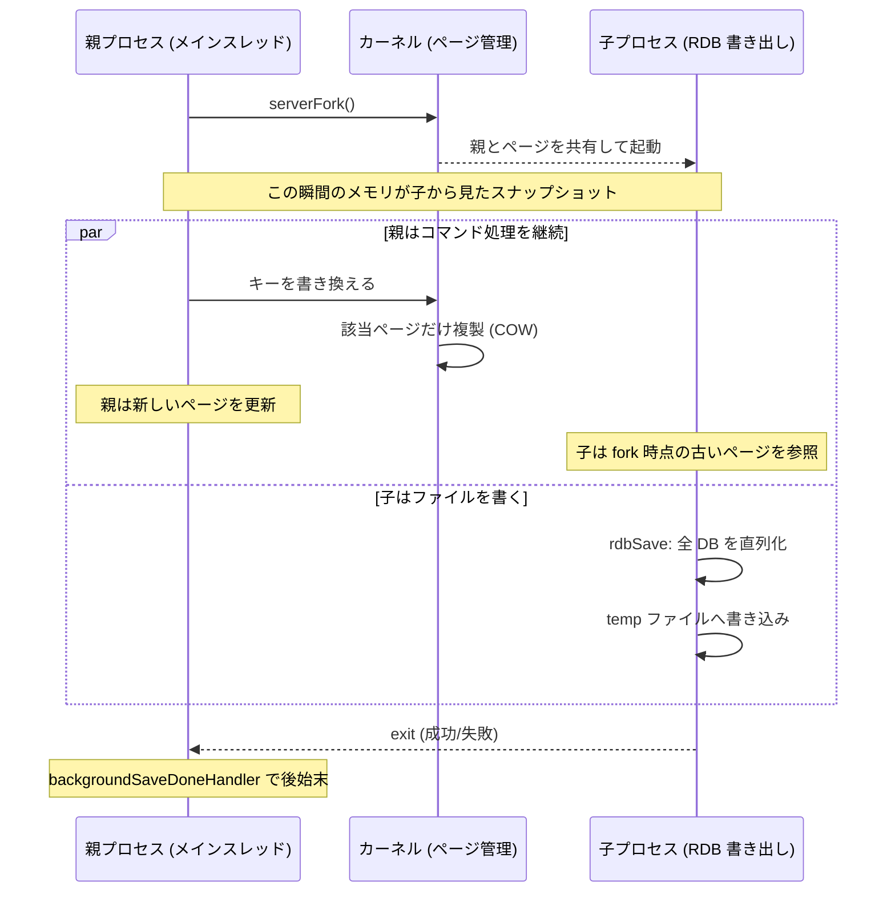

# 第35章 RDB スナップショット

> **本章で読むソース**
>
> - [`src/rdb.c`](https://github.com/valkey-io/valkey/blob/9.1.0/src/rdb.c)
> - [`src/rdb.h`](https://github.com/valkey-io/valkey/blob/9.1.0/src/rdb.h)
> - [`src/server.c`](https://github.com/valkey-io/valkey/blob/9.1.0/src/server.c)

## この章の狙い

RDB は、ある時点のデータセット全体を1つのバイナリファイルに固めるスナップショットである。
本章では、そのファイルがどのオペコードと型バイトで構成され、長さや整数がどう詰めて書かれるかを実装から読む。
中心の論点は、メモリ全体を複製せずに一貫したスナップショットを取る仕組みである。
`fork` した子プロセスでファイルを書き出し、親はコマンド処理を続け、コピーオンライトで変更されたページだけが複製される。
あわせて、起動時にこのファイルをオペコード単位で解釈して復元する読み込み経路を確認する。

## 前提

- [第13章 kvstore](../part02-memory-keyspace/13-kvstore.md)：データベースのキー集合を走査する `kvstore` を前提にする。
- [第14章 オブジェクトエンコーディング](../part03-objects-types/14-object-encoding.md)：値の `robj` とエンコーディングが、保存する型バイトに対応する。

## RDB ファイルの全体構造

RDB ファイルは、先頭のマジック文字列とバージョンから始まり、補助情報とデータベースの中身が続き、終端オペコードと CRC64 で閉じる。
全体を直列化するのは `rdbSaveRio` で、この関数を上から読めばファイルの並びがそのまま分かる。

[`src/rdb.c` L1472-L1509](https://github.com/valkey-io/valkey/blob/9.1.0/src/rdb.c#L1472-L1509)

```c
int rdbSaveRio(int req, int rdbver, rio *rdb, int *error, int rdbflags, rdbSaveInfo *rsi) {
    char magic[10];
    uint64_t cksum;
    long key_counter = 0;
    int j;

    if (server.rdb_checksum) rdb->update_cksum = rioGenericUpdateChecksum;
    const char *magic_prefix = rdbUseValkeyMagic(rdbver) ? "VALKEY" : "REDIS0";
    serverAssert(rdbver >= 0 && rdbver <= RDB_VERSION);
    snprintf(magic, sizeof(magic), "%s%03d", magic_prefix, rdbver);
    if (rdbWriteRaw(rdb, magic, 9) == -1) goto werr;
    if (rdbSaveInfoAuxFields(rdb, rdbflags, rsi) == -1) goto werr;
    // ... (中略: モジュール AUX と関数ライブラリの保存) ...

    /* save all databases, skip this if we're in functions-only mode */
    if (!(req & REPLICA_REQ_RDB_EXCLUDE_DATA)) {
        // ... (中略) ...
        if (clusterRDBSaveSlotImports(rdb, rdbver) == C_ERR) goto werr;
        for (j = 0; j < server.dbnum; j++) {
            if (rdbSaveDb(rdb, j, rdbflags, rdbver, &key_counter) == -1) goto werr;
        }
    }
    // ... (中略) ...
    /* EOF opcode */
    if (rdbSaveType(rdb, RDB_OPCODE_EOF) == -1) goto werr;

    /* CRC64 checksum. It will be zero if checksum computation is disabled, the
     * loading code skips the check in this case. */
    cksum = rdb->cksum;
    memrev64ifbe(&cksum);
    if (rioWrite(rdb, &cksum, 8) == 0) goto werr;
    return C_OK;
```

先頭9バイトのマジックは、接頭辞6文字と3桁のバージョン番号からなる。
接頭辞は `rdbUseValkeyMagic` が真なら `VALKEY`、そうでなければ `REDIS0` を選ぶ。
バージョン番号は `RDB_VERSION` で定義され、Valkey 9.0 以降は 80 を使う。

[`src/rdb.h` L52](https://github.com/valkey-io/valkey/blob/9.1.0/src/rdb.h#L52)

```c
#define RDB_VERSION 80
```

このバージョン番号は、フォーマットが後方非互換に変わるたびに増やす番号である。
ヘッダのコメントによれば、Valkey 9.0 から大きな番号に飛ばしたのは、非 OSS の Redis が使う RDB バージョンとの衝突を避けるためである。
読み込み側はマジックの6文字とこの番号を見て、自分が解釈できるファイルかを最初に判定する。

マジックの直後には、補助情報をまとめた **AUX フィールド**が並ぶ。
`rdbSaveInfoAuxFields` が、生成時のサーバ状態をキーと値の文字列対として書く。

[`src/rdb.c` L1256-L1272](https://github.com/valkey-io/valkey/blob/9.1.0/src/rdb.c#L1256-L1272)

```c
int rdbSaveInfoAuxFields(rio *rdb, int rdbflags, rdbSaveInfo *rsi) {
    int redis_bits = (sizeof(void *) == 8) ? 64 : 32;
    int aof_base = (rdbflags & RDBFLAGS_AOF_PREAMBLE) != 0;

    /* Add a few fields about the state when the RDB was created. */
    if (rdbSaveAuxFieldStrStr(rdb, "valkey-ver", VALKEY_VERSION) == -1) return -1;
    if (rdbSaveAuxFieldStrInt(rdb, "redis-bits", redis_bits) == -1) return -1;
    if (rdbSaveAuxFieldStrInt(rdb, "ctime", time(NULL)) == -1) return -1;
    if (rdbSaveAuxFieldStrInt(rdb, "used-mem", zmalloc_used_memory()) == -1) return -1;
    // ... (中略: レプリケーション情報などの条件付き AUX) ...
    if (rdbSaveAuxFieldStrInt(rdb, "aof-base", aof_base) == -1) return -1;
```

AUX フィールドは、生成したサーバのバージョン、ポインタ幅、作成時刻、使用メモリ量といったメタ情報を持つ。
レプリケーションの文脈で保存するときは、複製ストリームの位置を表す `repl-id` と `repl-offset` もここに入る。
この位置情報の意味は[第38章 レプリケーション](../part07-replication-cluster/38-replication.md)で扱う。

全体の並びは次のとおりである。

```text
+-----------------------------------------------------------+
| "VALKEY080"            マジック(6) + バージョン3桁  = 9 バイト |
+-----------------------------------------------------------+
| 0xFA AUX  "valkey-ver" "9.1.0"                            |
| 0xFA AUX  "redis-bits" "64"      ... 補助情報 (key/val 列) |
+-----------------------------------------------------------+
| 0xFE SELECTDB  <DB番号>                                   |
| 0xFB RESIZEDB  <キー総数> <expire 総数>                    |
|   [0xFC EXPIRETIME_MS <8byte>]  ← 有効期限つきキーのみ      |
|   <型バイト> <キー文字列> <値>      ← キー値ペア            |
|   <型バイト> <キー文字列> <値>                              |
|   ...                                                     |
| 0xFE SELECTDB  <次の DB番号>  ...                          |
+-----------------------------------------------------------+
| 0xFF EOF                                                  |
+-----------------------------------------------------------+
| CRC64 チェックサム  8 バイト                                |
+-----------------------------------------------------------+
```

## オペコードと型バイト

ファイル本体は1バイトの先頭値で構造を切り替える。
値が小さければデータベースを区切るオペコードや有効期限を表し、別の範囲なら続く値の型を表す。
両者は同じ `rdbSaveType` で1バイトとして書かれ、読み込み側は `rdbLoadType` で1バイト読んで分岐する。

オペコードは 243 から 255 までの大きな値に割り当てられている。

[`src/rdb.h` L145-L157](https://github.com/valkey-io/valkey/blob/9.1.0/src/rdb.h#L145-L157)

```c
#define RDB_OPCODE_SLOT_IMPORT 243     /* Slot import state (9.0). */
#define RDB_OPCODE_SLOT_INFO 244       /* Foreign slot info, safe to ignore. */
#define RDB_OPCODE_FUNCTION2 245       /* function library data */
#define RDB_OPCODE_FUNCTION_PRE_GA 246 /* old function library data for 7.0 rc1 and rc2 */
#define RDB_OPCODE_MODULE_AUX 247      /* Module auxiliary data. */
#define RDB_OPCODE_IDLE 248            /* LRU idle time. */
#define RDB_OPCODE_FREQ 249            /* LFU frequency. */
#define RDB_OPCODE_AUX 250             /* RDB aux field. */
#define RDB_OPCODE_RESIZEDB 251        /* Hash table resize hint. */
#define RDB_OPCODE_EXPIRETIME_MS 252   /* Expire time in milliseconds. */
#define RDB_OPCODE_EXPIRETIME 253      /* Old expire time in seconds. */
#define RDB_OPCODE_SELECTDB 254        /* DB number of the following keys. */
#define RDB_OPCODE_EOF 255             /* End of the RDB file. */
```

型バイトは 0 から始まる小さな値で、`RDB_TYPE_STRING` が 0、リストやセットなどが続く。

[`src/rdb.h` L107-L132](https://github.com/valkey-io/valkey/blob/9.1.0/src/rdb.h#L107-L132)

```c
enum RdbType {
    RDB_TYPE_STRING = 0,
    RDB_TYPE_LIST = 1,
    RDB_TYPE_SET = 2,
    RDB_TYPE_ZSET = 3,
    RDB_TYPE_HASH = 4,
    // ... (中略) ...
    RDB_TYPE_LIST_QUICKLIST_2 = 18,
    RDB_TYPE_STREAM_LISTPACKS_2 = 19,
    RDB_TYPE_SET_LISTPACK = 20, /* Added in RDB 11 (7.2) */
    RDB_TYPE_STREAM_LISTPACKS_3 = 21,
    RDB_TYPE_HASH_2 = 22, /* Hash with field-level expiration, RDB 80 (9.0) */
    RDB_TYPE_LAST
};
```

型バイトは値のエンコーディングごとに分かれている。
同じハッシュでも、listpack で表現されているか、フィールド単位の有効期限を持つかで別の番号になる。
このように保存時のエンコーディングを型バイトに焼き込むことで、読み込み側は値の中身を解釈する前に表現形式を確定できる。

オペコードと型バイトを1バイトの先頭値で兼ねられるのは、両者が同じ256段階の番号空間を、低い側と高い側に分けて使うからである。
`rdbIsObjectType` は、読んだ先頭値が型バイトの範囲かどうかを判定する。

[`src/rdb.h` L141](https://github.com/valkey-io/valkey/blob/9.1.0/src/rdb.h#L141)

```c
#define rdbIsObjectType(t) (((t) >= 0 && (t) <= 7) || ((t) >= 9 && (t) < RDB_TYPE_LAST))
```

### データベースの区切りとキー値ペア

各データベースの中身は `rdbSaveDb` が書く。
先頭で `SELECTDB` オペコードとデータベース番号を書き、続いて `RESIZEDB` でキー総数と有効期限つきキー数を書く。

[`src/rdb.c` L1393-L1408](https://github.com/valkey-io/valkey/blob/9.1.0/src/rdb.c#L1393-L1408)

```c
    /* Write the SELECT DB opcode */
    if ((res = rdbSaveType(rdb, RDB_OPCODE_SELECTDB)) < 0) goto werr;
    written += res;
    if ((res = rdbSaveLen(rdb, dbid)) < 0) goto werr;
    written += res;

    /* Write the RESIZE DB opcode. */
    unsigned long long expires_size = kvstoreSize(db->expires) + kvstoreImportingSize(db->expires);
    if ((res = rdbSaveType(rdb, RDB_OPCODE_RESIZEDB)) < 0) goto werr;
    written += res;
    if ((res = rdbSaveLen(rdb, db_size)) < 0) goto werr;
    written += res;
    if ((res = rdbSaveLen(rdb, expires_size)) < 0) goto werr;
    written += res;

    kvs_it = kvstoreIteratorInit(db->keys, HASHTABLE_ITER_SAFE | HASHTABLE_ITER_PREFETCH_VALUES | HASHTABLE_ITER_INCLUDE_IMPORTING);
```

`RESIZEDB` がキー総数を先に伝えるのは、読み込み側がハッシュテーブルをあらかじめ適切な大きさに確保し、読みながらの再ハッシュを避けるための助言である。
コメントもこれを `Hash table resize hint` と呼ぶ。

各キーは `rdbSaveKeyValuePair` が書く。
有効期限があればまず `EXPIRETIME_MS` オペコードとミリ秒時刻を書き、退避方針に応じて LRU や LFU の情報を添える。
そのあとに型バイト、キー文字列、値の本体が並ぶ。

[`src/rdb.c` L1189-L1222](https://github.com/valkey-io/valkey/blob/9.1.0/src/rdb.c#L1189-L1222)

```c
    /* Save the expire time */
    if (expiretime != -1) {
        if (rdbSaveType(rdb, RDB_OPCODE_EXPIRETIME_MS) == -1) return -1;
        if (rdbSaveMillisecondTime(rdb, expiretime) == -1) return -1;
    }

    /* Save the LRU info. */
    if (savelru) {
        uint64_t idletime = objectGetLRUIdleSecs(val);
        if (rdbSaveType(rdb, RDB_OPCODE_IDLE) == -1) return -1;
        if (rdbSaveLen(rdb, idletime) == -1) return -1;
    }
    // ... (中略: LFU 情報) ...

    /* Save type, key, value */
    int rdbtype = rdbGetObjectType(val, rdbver);
    // ... (中略) ...
    if (rdbSaveType(rdb, rdbtype) == -1) return -1;
    if (rdbSaveStringObject(rdb, key) == -1) return -1;
    if (rdbSaveObject(rdb, val, key, dbid, rdbtype) == -1) return -1;
```

型バイトの番号は `rdbGetObjectType` が値のエンコーディングから決め、値の本体は `rdbSaveObject` が型ごとに直列化する。
たとえば文字列なら `rdbSaveStringObject` を、リストなら quicklist のノードを順に書く。
型ごとの保存の詳細は各データ構造の章に譲り、本章では先頭の型バイトに値が続くという並びだけを押さえる。

## 長さと整数の可変長エンコード

RDB は長さを可変長で詰めて書く。
ほとんどのキーや短い値は63以下の長さに収まるため、1バイトで長さを表せると省メモリになる。
`rdbSaveLen` は、先頭バイトの上位2ビットでエンコード方式を示し、長さの大きさに応じて1バイトから9バイトまで使い分ける。

[`src/rdb.c` L227-L258](https://github.com/valkey-io/valkey/blob/9.1.0/src/rdb.c#L227-L258)

```c
int rdbSaveLen(rio *rdb, uint64_t len) {
    unsigned char buf[2];
    size_t nwritten;

    if (len < (1 << 6)) {
        /* Save a 6 bit len */
        buf[0] = (len & 0xFF) | (RDB_6BITLEN << 6);
        if (rdbWriteRaw(rdb, buf, 1) == -1) return -1;
        nwritten = 1;
    } else if (len < (1 << 14)) {
        /* Save a 14 bit len */
        buf[0] = ((len >> 8) & 0xFF) | (RDB_14BITLEN << 6);
        buf[1] = len & 0xFF;
        if (rdbWriteRaw(rdb, buf, 2) == -1) return -1;
        nwritten = 2;
    } else if (len <= UINT32_MAX) {
        /* Save a 32 bit len */
        buf[0] = RDB_32BITLEN;
        if (rdbWriteRaw(rdb, buf, 1) == -1) return -1;
        uint32_t len32 = htonl(len);
        if (rdbWriteRaw(rdb, &len32, 4) == -1) return -1;
        nwritten = 1 + 4;
    } else {
        /* Save a 64 bit len */
        buf[0] = RDB_64BITLEN;
        if (rdbWriteRaw(rdb, buf, 1) == -1) return -1;
        len = htonu64(len);
        if (rdbWriteRaw(rdb, &len, 8) == -1) return -1;
        nwritten = 1 + 8;
    }
    return nwritten;
}
```

先頭2ビットが `00` なら残り6ビットがそのまま長さで、1バイトで済む。
`01` なら次のバイトと合わせて14ビット、`10` なら続く4バイトまたは8バイトのビッグエンディアン整数で長さを表す。
上位2ビットが `11`、すなわち `RDB_ENCVAL` のときは長さではなく、値そのものが特殊エンコードされていることを示す。

[`src/rdb.h` L89-L102](https://github.com/valkey-io/valkey/blob/9.1.0/src/rdb.h#L89-L102)

```c
#define RDB_6BITLEN 0
#define RDB_14BITLEN 1
#define RDB_32BITLEN 0x80
#define RDB_64BITLEN 0x81
#define RDB_ENCVAL 3
#define RDB_LENERR UINT64_MAX

/* When a length of a string object stored on disk has the first two bits
 * set, the remaining six bits specify a special encoding for the object
 * accordingly to the following defines: */
#define RDB_ENC_INT8 0  /* 8 bit signed integer */
#define RDB_ENC_INT16 1 /* 16 bit signed integer */
#define RDB_ENC_INT32 2 /* 32 bit signed integer */
#define RDB_ENC_LZF 3   /* string compressed with FASTLZ */
```

この `ENCVAL` の枠が、文字列を詰める2つの最適化につながる。
`rdbSaveRawString` は、整数として表せる短い文字列を整数エンコードに置き換え、長い文字列は LZF で圧縮してから書く。

[`src/rdb.c` L495-L518](https://github.com/valkey-io/valkey/blob/9.1.0/src/rdb.c#L495-L518)

```c
ssize_t rdbSaveRawString(rio *rdb, unsigned char *s, size_t len) {
    int enclen;
    ssize_t n, nwritten = 0;

    /* Try integer encoding */
    if (len <= 11) {
        unsigned char buf[5];
        if ((enclen = rdbTryIntegerEncoding((char *)s, len, buf)) > 0) {
            if (rdbWriteRaw(rdb, buf, enclen) == -1) return -1;
            return enclen;
        }
    }

    /* Try LZF compression - under 20 bytes it's unable to compress even
     * aaaaaaaaaaaaaaaaaa so skip it */
    if (server.rdb_compression && len > 20) {
        n = rdbSaveLzfStringObject(rdb, s, len);
        if (n == -1) return -1;
        if (n > 0) return n;
        /* Return value of 0 means data can't be compressed, save the old way */
    }

    /* Store verbatim */
    if ((n = rdbSaveLen(rdb, len)) == -1) return -1;
```

たとえば `"12345"` のような文字列は、長さ付きの文字列ではなく `RDB_ENC_INT16` の整数として2バイトに収まる。
圧縮できない短い文字列や、整数化できない文字列は、長さの後に中身をそのまま書く経路に落ちる。
どちらの最適化も、先頭バイトの上位2ビットが `11` であれば特殊エンコード、それ以外なら通常の長さという1つの規則の上に乗っている。

## バックグラウンド保存

スナップショットの一貫性と非ブロッキング性を両立させる仕組みが、本章の核心である。
データセット全体を1バイトずつ書き出すあいだ、サーバがコマンド処理を止めていては困る。
かといって書き出し中にデータが変わると、ファイルが時点として一貫しなくなる。
`rdbSaveBackground` は `fork` でこの矛盾を解く。

[`src/rdb.c` L1664-L1700](https://github.com/valkey-io/valkey/blob/9.1.0/src/rdb.c#L1664-L1700)

```c
int rdbSaveBackground(int req, char *filename, rdbSaveInfo *rsi, int rdbflags) {
    pid_t childpid;

    if (hasActiveChildProcess()) return C_ERR;
    server.stat_rdb_saves++;

    server.dirty_before_bgsave = server.dirty;
    server.lastbgsave_try = time(NULL);

    if ((childpid = serverFork(CHILD_TYPE_RDB)) == 0) {
        int retval;

        /* Child */
        // ... (中略: プロセス名と CPU アフィニティの設定) ...
        retval = rdbSave(req, filename, rsi, rdbflags);
        if (retval == C_OK) {
            sendChildCowInfo(CHILD_INFO_TYPE_RDB_COW_SIZE, "RDB");
        }
        exitFromChild((retval == C_OK) ? 0 : 1);
    } else {
        /* Parent */
        if (childpid == -1) {
            server.lastbgsave_status = C_ERR;
            serverLog(LL_WARNING, "Can't save in background: fork: %s", strerror(errno));
            return C_ERR;
        }
        serverLog(LL_NOTICE, "Background saving started by pid %ld", (long)childpid);
        server.rdb_save_time_start = time(NULL);
        server.rdb_child_type = RDB_CHILD_TYPE_DISK;
        return C_OK;
    }
    return C_OK; /* unreached */
}
```

`serverFork` が返した値で親子が分かれる。
返り値が0なら子プロセスで、`rdbSave` を呼んでファイル全体を書き、書き終えたら `exitFromChild` で終了する。
返り値が子の PID なら親プロセスで、保存中であることを記録してすぐに戻り、イベントループへ復帰してコマンド処理を続ける。

ここで一貫性を保証するのが、OS のコピーオンライトである。
`fork` した直後、子は親と同じ物理メモリページを共有し、どちらも読むだけならページは複製されない。
親がコマンドを処理してデータを書き換えると、そのページだけが OS によって複製され、子は `fork` 時点の古いページを見続ける。
子が観測するメモリは `fork` した瞬間の状態に凍結されるため、データセット全体をコピーしなくても、その時点のスナップショットを書き出せる。



子が観測するメモリは凍結されるので、書き出し中に親がいくらキーを変えてもファイルは一時点の整合した姿になる。
複製されるのは書き換えられたページだけなので、追加のメモリは変更量に比例し、データセット全体の複製より小さく抑えられる。
これが、メモリ全体をコピーせずに非ブロッキングなスナップショットを取るという最適化の機構である。

子が `rdbSave` の中で各キーを書き終えるたびに、`rdbSaveDb` は `dismissObject` で書き出し済みオブジェクトのメモリを OS へ返す手がかりを与える。

[`src/rdb.c` L1439-L1443](https://github.com/valkey-io/valkey/blob/9.1.0/src/rdb.c#L1439-L1443)

```c
        /* In fork child process, we can try to release memory back to the
         * OS and possibly avoid or decrease COW. We give the dismiss
         * mechanism a hint about an estimated size of the object we stored. */
        size_t dump_size = rdb->processed_bytes - rdb_bytes_before_key;
        if (server.in_fork_child) dismissObject(o, dump_size);
```

子は書き出し済みのオブジェクトをもう使わないため、そのページを解放すれば、その後に親が同じページへ書いても複製が起きない。
これはコピーオンライトの複製量をさらに減らす工夫である。

子の終了は親のイベントループが検知する。
`serverCron` から呼ばれる `checkChildrenDone` が `backgroundSaveDoneHandler` を呼び、成功なら `dirty` カウンタを巻き戻して保存時刻を更新する。
子の生成と終了の検知、`fork` のコストといった子プロセス管理の一般論は[第37章 永続化の内部構造](./37-persistence-internals.md)で扱う。

なお、書き出し先の一時ファイルを最終ファイル名へ差し替えるのは `rdbSave` の `rename` である。
`rename` が原子的に名前を入れ替えるので、完成途中のファイルが正規の名前で見えることはない。

## 自動保存と SAVE / BGSAVE

スナップショットを取る契機は3つある。
`SAVE` コマンド、`BGSAVE` コマンド、そして `save` 設定による自動保存である。

`SAVE` は前景で保存する。
`saveCommand` は `rdbSave` を直接呼ぶので、保存が終わるまでメインスレッドはブロックする。

[`src/rdb.c` L3905-L3911](https://github.com/valkey-io/valkey/blob/9.1.0/src/rdb.c#L3905-L3911)

```c
    rdbSaveInfo rsi, *rsiptr;
    rsiptr = rdbPopulateSaveInfo(&rsi);
    if (rdbSave(REPLICA_REQ_NONE, server.rdb_filename, rsiptr, RDBFLAGS_NONE) == C_OK) {
        addReply(c, shared.ok);
    } else {
        addReplyErrorObject(c, shared.err);
    }
```

`BGSAVE` は `rdbSaveBackground` を呼んで、前節の `fork` 経路で非ブロッキングに保存する。

自動保存は `save` 設定で指定する。
この設定は「N 秒のあいだに M 回以上の変更があれば保存する」という条件の組であり、`serverCron` が毎周回でこれを評価する。

[`src/server.c` L1603-L1619](https://github.com/valkey-io/valkey/blob/9.1.0/src/server.c#L1603-L1619)

```c
        for (j = 0; j < server.saveparamslen; j++) {
            struct saveparam *sp = server.saveparams + j;

            /* Save if we reached the given amount of changes,
             * the given amount of seconds, and if the latest bgsave was
             * successful or if, in case of an error, at least
             * CONFIG_BGSAVE_RETRY_DELAY seconds already elapsed. */
            if (server.dirty >= sp->changes && server.unixtime - server.lastsave > sp->seconds &&
                (server.unixtime - server.lastbgsave_try > CONFIG_BGSAVE_RETRY_DELAY ||
                 server.lastbgsave_status == C_OK)) {
                serverLog(LL_NOTICE, "%d changes in %d seconds. Saving...", sp->changes, (int)sp->seconds);
                rdbSaveInfo rsi, *rsiptr;
                rsiptr = rdbPopulateSaveInfo(&rsi);
                rdbSaveBackground(REPLICA_REQ_NONE, server.rdb_filename, rsiptr, RDBFLAGS_NONE);
                break;
            }
        }
```

`server.dirty` は前回保存以降の変更回数で、設定された変更回数 `sp->changes` を超え、かつ前回保存から `sp->seconds` 秒が経っていれば保存する。
自動保存はこの条件を満たすと `rdbSaveBackground` を呼ぶので、`fork` した子で非ブロッキングに行う。
直前の `BGSAVE` が失敗していた場合は、一定時間が経つまで再試行を抑える条件も入っている。

## 読み込み

起動時の復元は `rdbLoad` から始まる。
ファイルを開いて `rio` でくるみ、`rdbLoadRio` 経由でオペコードを順に解釈する。

[`src/rdb.c` L3612-L3618](https://github.com/valkey-io/valkey/blob/9.1.0/src/rdb.c#L3612-L3618)

```c
    startLoadingFile(sb.st_size, filename, rdbflags);
    rioInitWithFile(&rdb, fp);

    retval = rdbLoadRio(&rdb, rdbflags, rsi);

    fclose(fp);
    stopLoading(retval == RDB_OK);
```

解釈の本体は `rdbLoadRioWithLoadingCtx` のループである。
まずマジック9バイトを読んでバージョンを取り、その後は1バイトずつ型を読んで分岐する。

[`src/rdb.c` L3147-L3162](https://github.com/valkey-io/valkey/blob/9.1.0/src/rdb.c#L3147-L3162)

```c
    if (rioRead(rdb, buf, 9) == 0) goto eoferr;
    buf[9] = '\0';
    if (memcmp(buf, "REDIS0", 6) == 0) {
        is_redis_magic = true;
    } else if (memcmp(buf, "VALKEY", 6) == 0) {
        is_valkey_magic = true;
    } else {
        serverLog(LL_WARNING, "Wrong signature trying to load DB from file: %.9s", buf);
        /* Signal to terminate the rdbLoad without clearing existing data */
        return RDB_INCOMPATIBLE;
    }
    rdbver = atoi(buf + 6);
    if (!rdbIsVersionAccepted(rdbver, is_valkey_magic, is_redis_magic)) {
        serverLog(LL_WARNING, "Can't handle RDB format version %d", rdbver);
        return RDB_INCOMPATIBLE;
    }
```

マジックとバージョンが受け入れ可能なら、ループに入って先頭バイトを読む。
読んだ値がオペコードなら対応する状態を更新し、型バイトならその型の値を1つ読み込む。

[`src/rdb.c` L3197-L3247](https://github.com/valkey-io/valkey/blob/9.1.0/src/rdb.c#L3197-L3247)

```c
        if (type == RDB_OPCODE_EXPIRETIME) {
            // ... (中略) ...
            expiretime *= 1000;
            if (rioGetReadError(rdb)) goto eoferr;
            continue; /* Read next opcode. */
        } else if (type == RDB_OPCODE_EXPIRETIME_MS) {
            // ... (中略) ...
            expiretime = rdbLoadMillisecondTime(rdb, rdbver);
            if (rioGetReadError(rdb)) goto eoferr;
            continue; /* Read next opcode. */
        // ... (中略: IDLE, FREQ) ...
        } else if (type == RDB_OPCODE_EOF) {
            /* EOF: End of file, exit the main loop. */
            break;
        } else if (type == RDB_OPCODE_SELECTDB) {
            /* SELECTDB: Select the specified database. */
            if ((dbid = rdbLoadLen(rdb, NULL)) == RDB_LENERR) goto eoferr;
            // ... (中略: 範囲チェックとデータベース生成) ...
            db = rdb_loading_ctx->dbarray[dbid];
            continue; /* Read next opcode. */
        } else if (type == RDB_OPCODE_RESIZEDB) {
            /* RESIZEDB: Hint about the size of the keys in the currently
             * selected data base, in order to avoid useless rehashing. */
            if ((db_size = rdbLoadLen(rdb, NULL)) == RDB_LENERR) goto eoferr;
            if ((expires_size = rdbLoadLen(rdb, NULL)) == RDB_LENERR) goto eoferr;
            should_expand_db = 1;
            continue; /* Read next opcode. */
        }
```

オペコードはどれも処理の後に `continue` でループ先頭へ戻り、次の先頭バイトを読む。
`EXPIRETIME_MS` のように後続のキーに付随する情報は、変数に覚えておいて次に読むキーへ適用する。
これが、保存時に有効期限オペコードをキーの前に置いた並びと対応する。
`SELECTDB` は以後のキーの入れ先データベースを切り替え、`EOF` でループを抜ける。

ファイルの末尾では、保存時に書いた CRC64 を読み込み側でも計算して照合する。

[`src/rdb.c` L3547-L3567](https://github.com/valkey-io/valkey/blob/9.1.0/src/rdb.c#L3547-L3567)

```c
    /* Verify the checksum if RDB version is >= 5 */
    if (rdbver >= 5) {
        uint64_t cksum, expected = rdb->cksum;

        if (rioRead(rdb, &cksum, 8) == 0) goto eoferr;
        if (server.rdb_checksum && !server.skip_checksum_validation) {
            memrev64ifbe(&cksum);
            if (rdb->flags & RIO_FLAG_SKIP_RDB_CHECKSUM) {
                serverLog(LL_NOTICE, "RDB file was saved with checksum disabled: skipped checksum for this transfer");
            } else if (cksum == 0) {
                serverLog(LL_NOTICE, "RDB file was saved with checksum disabled: no check performed.");
            } else if (cksum != expected) {
                serverLog(LL_WARNING,
                          "Wrong RDB checksum expected: (%llx) but "
                          "got (%llx). Aborting now.",
                          (unsigned long long)expected, (unsigned long long)cksum);
                rdbReportCorruptRDB("RDB CRC error");
                return RDB_FAILED;
            }
        }
    }
```

`rdb->cksum` は読み進めながら更新してきた CRC64 で、これがファイル末尾に書かれた値と一致しなければ破損とみなして読み込みを中止する。
末尾に書かれた値が0なら、保存時にチェックサムを無効化していた印として照合を飛ばす。
この末尾照合が、ファイルが途中で壊れていないことの保証になる。

## まとめ

- RDB は、ある時点のデータセット全体を1つのバイナリファイルに固めるスナップショットであり、`rdbSaveRio` がマジックと AUX、データベース本体、EOF、CRC64 の順に直列化する。
- ファイル本体は1バイトの先頭値で構造を切り替える。243以上の大きな値はデータベースの区切りや有効期限を表すオペコード、0からの小さな値は続く値の型バイトである。
- 長さは `rdbSaveLen` が先頭2ビットで方式を示して1バイトから9バイトで詰め、上位2ビットが `11` のときは整数化や LZF 圧縮による特殊エンコードを表す。短い値ほど少ないバイトで書ける。
- `rdbSaveBackground` は `fork` して子プロセスでファイルを書き、親はコマンド処理を続ける。子が見るメモリはコピーオンライトで `fork` 時点に凍結されるため、メモリ全体を複製せずに一貫したスナップショットを取れる。
- 自動保存は `save` 設定の条件を `serverCron` が評価して `BGSAVE` を起動する。`SAVE` は前景で、`BGSAVE` は子プロセスで保存する。
- 読み込みは `rdbLoad` が先頭バイトを順に解釈してキーを復元し、末尾の CRC64 を再計算して照合することで破損を検出する。

## 関連する章

- [第36章 AOF](./36-aof.md)：変更コマンドを逐次追記する、もう1つの永続化方式を扱う。RDB をプリアンブルとして併用する構成にも触れる。
- [第37章 永続化の内部構造](./37-persistence-internals.md)：`fork` した子プロセスの管理、`bio` のバックグラウンドスレッド、ファイルの後始末といった、保存に共通する基盤を扱う。
- [第38章 レプリケーション](../part07-replication-cluster/38-replication.md)：RDB を初期同期の転送形式として使う経路と、AUX に書いた複製位置の意味を扱う。
