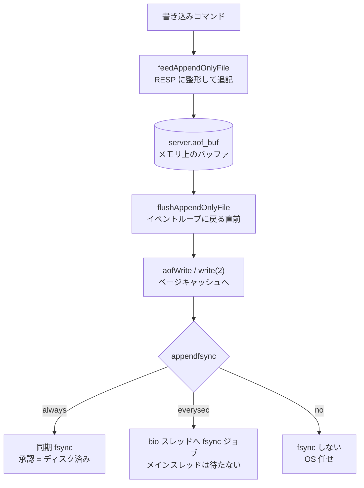
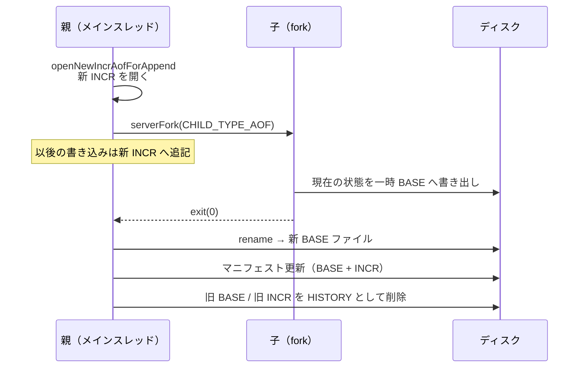

# 第36章 AOF 追記ファイル

> **本章で読むソース**
>
> - [`src/aof.c`](https://github.com/valkey-io/valkey/blob/9.1.0/src/aof.c)
> - [`src/server.h`](https://github.com/valkey-io/valkey/blob/9.1.0/src/server.h)

## この章の狙い

**AOF**（append-only file）は、データを変える各コマンドを実行順に追記したログである。
サーバを再起動したとき、このログを先頭から再生すれば、停止前の状態を復元できる。
本章では、書き込みコマンドがどのように AOF バッファへ積まれ、どの `fsync` ポリシーでファイルへ落ちるかを `aof.c` の実装で読む。
あわせて、ログが際限なく膨らむのを防ぐ書き換え（rewrite）と、それを支えるマルチパート AOF の構成を理解する。

## 前提

- [第27章 コマンド実行](../part04-server-events/27-command-execution.md)：書き込みコマンドが AOF へ伝播される起点を扱う。本章はその伝播先を読む。
- [第35章 RDB](./35-rdb.md)：書き換え後の BASE ファイルは RDB 形式でも書ける。RDB の保存処理を前提にする。

## AOF が記録するもの

AOF はデータベースの状態そのものではなく、状態を変えた操作の列を記録する。
`SET key value` を実行すれば、そのコマンドが RESP 形式のテキストとして1行ずつ追記される。
再起動時にこの列を先頭から実行し直すと、同じ順序で同じ変更が適用され、停止前の状態に戻る。

スナップショットを一定間隔で書く RDB に対し、AOF はコマンド単位で記録するため、障害時に失われる範囲を小さく保てる。
どこまで失わないかは後述の `fsync` ポリシーで決まる。

コマンドが AOF に渡る入口は、書き込みを伝播する `propagateNow` の中にある。

[`src/server.c` L3607-L3620](https://github.com/valkey-io/valkey/blob/9.1.0/src/server.c#L3607-L3620)

```c
    int propagate_to_aof = server.aof_state != AOF_OFF && target & PROPAGATE_AOF;
    /* ... (中略) ... */
    if (propagate_to_aof) feedAppendOnlyFile(dbid, argv, argc);
    if (propagate_to_repl) replicationFeedReplicas(dbid, argv, argc);
```

AOF への伝播とレプリカへの伝播は、同じ `argv`（コマンド配列）を同じ箇所から渡している。
このため AOF に記録されるコマンド列は、レプリケーションで流れるコマンド列と一致する。
どのコマンドがどう書き換えられて伝播されるか（決定性の確保など）は第27章で扱った。

## 書き込みをバッファへ積む

`feedAppendOnlyFile` は、渡されたコマンドを RESP 形式に整形して AOF バッファへ追記する。
バッファはサーバが保持する1本の `sds` 文字列 `server.aof_buf` であり、ここではディスクには触れない。

[`src/aof.c` L1446-L1482](https://github.com/valkey-io/valkey/blob/9.1.0/src/aof.c#L1446-L1482)

```c
void feedAppendOnlyFile(int dictid, robj **argv, int argc) {
    sds buf = sdsempty();
    /* ... (中略) ... */
    /* The DB this command was targeting is not the same as the last command
     * we appended. To issue a SELECT command is needed. */
    if (dictid != -1 && dictid != server.aof_selected_db) {
        char seldb[64];
        snprintf(seldb, sizeof(seldb), "%d", dictid);
        buf = sdscatprintf(buf, "*2\r\n$6\r\nSELECT\r\n$%lu\r\n%s\r\n", (unsigned long)strlen(seldb), seldb);
        server.aof_selected_db = dictid;
    }
    /* ... (中略) ... */
    buf = catAppendOnlyGenericCommand(buf, argc, argv);

    /* Append to the AOF buffer. This will be flushed on disk just before
     * of re-entering the event loop, so before the client will get a
     * positive reply about the operation performed. */
    if (server.aof_state == AOF_ON || (server.aof_state == AOF_WAIT_REWRITE && server.child_type == CHILD_TYPE_AOF)) {
        server.aof_buf = sdscatlen(server.aof_buf, buf, sdslen(buf));
    }
    sdsfree(buf);
}
```

ここで2つの処理が入る。
1つは対象データベースの選択である。
直前に追記したコマンドと異なるデータベース番号 `dictid` に対する操作なら、先に `SELECT` を1行差し込む。
これにより、復元時に各コマンドが正しいデータベースへ適用される。
もう1つはコマンド本体の整形で、`catAppendOnlyGenericCommand` が `argv` を RESP 配列のバイト列に変換する。

整形した結果を `server.aof_buf` の末尾に連結して、関数は戻る。
コメントが述べるとおり、このバッファはイベントループに戻る直前にディスクへ書かれる。
1コマンドごとに `write(2)` を呼ばず、1回のイベントループで積まれた書き込みをまとめて1回で流すための設計である。

## バッファをファイルへ書く

バッファをファイルへ落とすのは `flushAppendOnlyFile` である。
この関数は `beforeSleep` から、クライアントへ応答を返すより前に呼ばれる。

[`src/server.c` L1917-L1920](https://github.com/valkey-io/valkey/blob/9.1.0/src/server.c#L1917-L1920)

```c
    /* Write the AOF buffer on disk,
     * must be done before handleClientsWithPendingWrites,
     * in case of appendfsync=always. */
    if (server.aof_state == AOF_ON || server.aof_state == AOF_WAIT_REWRITE) flushAppendOnlyFile(0);
```

応答を返す前に書くのは、書き込みを承認したクライアントには、その変更がディスクに届いているという約束を守るためである。
関数の冒頭で、関数自身のコメントがこの方針を述べている。

[`src/aof.c` L1159-L1166](https://github.com/valkey-io/valkey/blob/9.1.0/src/aof.c#L1159-L1166)

```c
/* Write the append only file buffer on disk.
 *
 * Since we are required to write the AOF before replying to the client,
 * and the only way the client socket can get a write is entering when
 * the event loop, we accumulate all the AOF writes in a memory
 * buffer and write it on disk using this function just before entering
 * the event loop again.
 */
```

実際の書き込みは `aofWrite`（`write(2)` の薄いラッパ）で1回行う。

[`src/aof.c` L1247-L1248](https://github.com/valkey-io/valkey/blob/9.1.0/src/aof.c#L1247-L1248)

```c
    latencyStartMonitor(latency);
    nwritten = aofWrite(server.aof_fd, server.aof_buf, sdslen(server.aof_buf));
```

`write(2)` が成功しても、データはまだ OS のページキャッシュにあり、ディスクには届いていない。
ディスクへ強制的に書き出すのが `fsync(2)` であり、これをいつ呼ぶかが耐久性と性能を分ける。

### fsync ポリシー（最適化の核その1）

`fsync` をどの頻度で呼ぶかは、設定 `appendfsync` が決める3つの値に対応する。

[`src/server.h` L504-L506](https://github.com/valkey-io/valkey/blob/9.1.0/src/server.h#L504-L506)

```c
#define AOF_FSYNC_NO 0
#define AOF_FSYNC_ALWAYS 1
#define AOF_FSYNC_EVERYSEC 2
```

`flushAppendOnlyFile` の末尾が、この3値で分岐する。

[`src/aof.c` L1363-L1391](https://github.com/valkey-io/valkey/blob/9.1.0/src/aof.c#L1363-L1391)

```c
    /* Perform the fsync if needed. */
    if (server.aof_fsync == AOF_FSYNC_ALWAYS) {
        /* ... (中略) ... */
        if (valkey_fsync(server.aof_fd) == -1) {
            serverLog(LL_WARNING,
                      "Can't persist AOF for fsync error when the "
                      "AOF fsync policy is 'always': %s. Exiting...",
                      strerror(errno));
            exit(1);
        }
        /* ... (中略) ... */
        server.aof_last_incr_fsync_offset = server.aof_last_incr_size;
        server.aof_last_fsync = server.mstime;
        atomic_store_explicit(&server.fsynced_reploff_pending, server.primary_repl_offset, memory_order_relaxed);
    } else if (server.aof_fsync == AOF_FSYNC_EVERYSEC && server.mstime - server.aof_last_fsync >= 1000) {
        if (!sync_in_progress) {
            aof_background_fsync(server.aof_fd);
            server.aof_last_incr_fsync_offset = server.aof_last_incr_size;
        }
        server.aof_last_fsync = server.mstime;
    }
```

3つのポリシーは、耐久性と性能のどこを取るかで分かれる。

- **always**：書き込みのたびに `valkey_fsync` を同期で呼ぶ。承認した書き込みは必ずディスクにある。失われるデータは原理上ゼロに近い反面、コマンドごとにディスク同期を待つため最も遅い。
- **everysec**：前回の `fsync` から1秒以上経っていれば `fsync` する。ただし `aof_background_fsync` を通じて bio スレッドに投げ、メインスレッドは待たない。障害時に失う範囲は最大で約1秒分にとどまり、性能はメインスレッドを止めないぶん大きく落ちない。既定値である。
- **no**：`flushAppendOnlyFile` から `fsync` を呼ばず、いつディスクへ落ちるかを OS に任せる。最速だが、失う範囲は OS のフラッシュ間隔に依存する。

最適化の核は everysec にある。
`fsync` はディスクの応答を待つ重い処理なので、これをメインスレッドの応答経路から外に出す。
`aof_background_fsync` は `fsync` の実行を bio スレッドのジョブとして登録するだけで戻る。

[`src/aof.c` L905-L909](https://github.com/valkey-io/valkey/blob/9.1.0/src/aof.c#L905-L909)

```c
/* Starts a background task that performs fsync() against the specified
 * file descriptor (the one of the AOF file) in another thread. */
void aof_background_fsync(int fd) {
    bioCreateFsyncJob(fd, server.primary_repl_offset, 1);
}
```

メインスレッドは `write(2)` だけを担い、ディスク同期の待ちをバックグラウンドへ逃がす。
これにより、毎秒の耐久性をほぼ保ちながら、コマンド処理のスループットを `fsync` の遅延から切り離せる。
bio スレッドそのものの仕組みは第37章で扱う。

なお `flushAppendOnlyFile` の前段には、書き込みを遅延させる分岐もある。
everysec で前回の `fsync` がまだ bio スレッドで進行中なら、`write(2)` がその `fsync` に巻き込まれてブロックしうるため、最大2秒まで書き込みを先送りする。

[`src/aof.c` L1215-L1235](https://github.com/valkey-io/valkey/blob/9.1.0/src/aof.c#L1215-L1235)

```c
    if (server.aof_fsync == AOF_FSYNC_EVERYSEC && !force) {
        /* With this append fsync policy we do background fsyncing.
         * If the fsync is still in progress we can try to delay
         * the write for a couple of seconds. */
        if (sync_in_progress) {
            if (server.aof_flush_postponed_start == 0) {
                /* No previous write postponing, remember that we are
                 * postponing the flush and return. */
                server.aof_flush_postponed_start = server.mstime;
                return;
            } else if (server.mstime - server.aof_flush_postponed_start < 2000) {
                /* We were already waiting for fsync to finish, but for less
                 * than two seconds this is still ok. Postpone again. */
                return;
            }
            /* ... (中略) ... */
        }
    }
```

書き込みと fsync の流れを図にすると次のようになる。



## AOF 書き換え（最適化の核その2）

AOF は追記し続けるログなので、同じキーを何度も更新するとファイルは際限なく膨らむ。
これを縮めるのが書き換えである。
現在のデータベースの状態を作り直すのに必要な最小限のコマンド列（または RDB 形式の BASE ファイル）を書き起こせば、過去の冗長な追記を1つにまとめられる。

書き換えのコストはメインスレッドの停止に出るため、Valkey は `fork(2)` した子プロセスで行う。
`rewriteAppendOnlyFileBackground` の冒頭コメントが全体の流れを述べている。

[`src/aof.c` L2576-L2589](https://github.com/valkey-io/valkey/blob/9.1.0/src/aof.c#L2576-L2589)

```c
/* This is how rewriting of the append only file in background works:
 *
 * 1) The user calls BGREWRITEAOF
 * 2) The server calls this function, that forks():
 *    2a) the child rewrite the append only file in a temp file.
 *    2b) the parent open a new INCR AOF file to continue writing.
 * 3) When the child finished '2a' exists.
 * 4) The parent will trap the exit code, if it's OK, it will:
 *    4a) get a new BASE file name and mark the previous (if we have) as the HISTORY type
 *    4b) rename(2) the temp file in new BASE file name
 *    4c) mark the rewritten INCR AOFs as history type
 *    4d) persist AOF manifest file
 *    4e) Delete the history files use bio
 */
```

`fork(2)` の前に、親はまず新しい INCR ファイルを開いて、書き換え中の新規書き込みをそちらへ貯める。

[`src/aof.c` L2601-L2608](https://github.com/valkey-io/valkey/blob/9.1.0/src/aof.c#L2601-L2608)

```c
    /* We set aof_selected_db to -1 in order to force the next call to the
     * feedAppendOnlyFile() to issue a SELECT command. */
    server.aof_selected_db = -1;
    flushAppendOnlyFile(1);
    if (openNewIncrAofForAppend() != C_OK) {
        server.aof_lastbgrewrite_status = C_ERR;
        return C_ERR;
    }
```

続いて `serverFork` で子を作る。
子は現在のデータセットを一時ファイルへ書き出し、終わると終了する。
親はそのまま処理を続け、新規の書き込みは先ほど開いた INCR ファイルへ追記していく。

[`src/aof.c` L2626-L2643](https://github.com/valkey-io/valkey/blob/9.1.0/src/aof.c#L2626-L2643)

```c
    if ((childpid = serverFork(CHILD_TYPE_AOF)) == 0) {
        char tmpfile[256];
        /* Child */
        /* ... (中略) ... */
        snprintf(tmpfile, 256, "temp-rewriteaof-bg-%d.aof", (int)getpid());
        if (rewriteAppendOnlyFile(tmpfile) == C_OK) {
            serverLog(LL_NOTICE, "Successfully created the temporary AOF base file %s", tmpfile);
            sendChildCowInfo(CHILD_INFO_TYPE_AOF_COW_SIZE, "AOF rewrite");
            exitFromChild(0);
        } else {
            exitFromChild(1);
        }
    } else {
        /* ... (中略) ... */
    }
```

`fork(2)` を使うのがこの章のもう1つの最適化である。
子は親のメモリ空間のコピーを持つが、OS のコピーオンライトにより、書き換え中に変更されないページは物理メモリを共有したままで済む。
子はこの一貫したスナップショットを読み出してファイルへ書くだけで、メインスレッド（親）はコマンド処理を止めない。

子が書き出すコマンドは、現在の値を最小手数で復元する形にまとめられる。
たとえばリスト型は、要素を1個ずつではなく `AOF_REWRITE_ITEMS_PER_CMD` 個まで1つの `RPUSH` に束ねて出力する。

[`src/server.h` L150](https://github.com/valkey-io/valkey/blob/9.1.0/src/server.h#L150)

```c
#define AOF_REWRITE_ITEMS_PER_CMD 64
```

子が一時ファイルを完成させると、親側のハンドラ `backgroundRewriteDoneHandler` が後始末を引き継ぐ。
一時ファイルを新しい BASE ファイル名へ `rename(2)` し、書き換え中に貯めた INCR を連結する形でマニフェストを更新する。

[`src/aof.c` L2795-L2809](https://github.com/valkey-io/valkey/blob/9.1.0/src/aof.c#L2795-L2809)

```c
        /* Rename the temporary aof file to 'new_base_filename'. */
        latencyStartMonitor(latency);
        if (rename(tmpfile, new_base_filepath) == -1) {
            /* ... (中略) ... */
            goto cleanup;
        }
        /* ... (中略) ... */
        serverLog(LL_NOTICE, "Successfully renamed the temporary AOF base file %s into %s", tmpfile, new_base_filename);
```

書き換え後、古い BASE と書き換え済みの INCR は HISTORY 扱いになり、bio スレッド経由で削除される。
書き換えの全体像は次のとおりである。



## マルチパート AOF

書き換えで BASE と INCR を分けて扱えるのは、AOF が単一ファイルではなく複数ファイルの集合として構成されているからである。
この集合を記述するのがマニフェストファイルであり、`aof.c` 冒頭のコメントが3種類のファイルを説明する。

[`src/aof.c` L60-L83](https://github.com/valkey-io/valkey/blob/9.1.0/src/aof.c#L60-L83)

```c
 * Append-only files consist of three types:
 *
 * BASE: Represents a server snapshot from the time of last AOF rewrite. The manifest
 * file contains at most a single BASE file, which will always be the first file in the
 * list.
 *
 * INCR: Represents all write commands executed by the server following the last successful
 * AOF rewrite. In some cases it is possible to have several ordered INCR files.
 * ... (中略) ...
 * HISTORY: After a successful rewrite, the previous BASE and INCR become HISTORY files.
 * They will be automatically removed unless garbage collection is disabled.
 *
 * The following is a possible AOF manifest file content:
 *
 * file appendonly.aof.2.base.rdb seq 2 type b
 * file appendonly.aof.1.incr.aof seq 1 type h
 * ... (中略) ...
 * file appendonly.aof.5.incr.aof seq 5 type i
```

メモリ上では、この構成を `aofManifest` が保持する。

[`src/server.h` L1712-L1722](https://github.com/valkey-io/valkey/blob/9.1.0/src/server.h#L1712-L1722)

```c
typedef struct {
    aofInfo *base_aof_info;       /* BASE file information. NULL if there is no BASE file. */
    list *incr_aof_list;          /* INCR AOFs list. We may have multiple INCR AOF when rewrite fails. */
    list *history_aof_list;       /* HISTORY AOF list. ... (中略) ... */
    long long curr_base_file_seq; /* The sequence number used by the current BASE file. */
    long long curr_incr_file_seq; /* The sequence number used by the current INCR file. */
    int dirty;                    /* 1 Indicates that the aofManifest in the memory is inconsistent with disk */
} aofManifest;
```

BASE は最後の書き換え時点のスナップショットで、たかだか1つである。
INCR はその後の書き込みを記録する追記ファイルで、書き換えに失敗した場合などには複数並ぶことがある。
各ファイルは型を表す1文字（`b`/`h`/`i`）で区別される。

[`src/server.h` L1700-L1704](https://github.com/valkey-io/valkey/blob/9.1.0/src/server.h#L1700-L1704)

```c
typedef enum {
    AOF_FILE_TYPE_BASE = 'b', /* BASE file */
    AOF_FILE_TYPE_HIST = 'h', /* HISTORY file */
    AOF_FILE_TYPE_INCR = 'i', /* INCR file */
} aof_file_type;
```

この分割が、書き換えを安全かつ安価にする。
書き換え中も親は INCR への追記を続けられ、子が作る BASE と互いに干渉しない。
書き換えが成功したら、マニフェストの BASE だけを差し替え、古いファイルを HISTORY にして消せばよい。
マニフェスト更新自体も、一時ファイルへ書いてから `rename(2)` で原子的に差し替える。

[`src/aof.c` L566-L572](https://github.com/valkey-io/valkey/blob/9.1.0/src/aof.c#L566-L572)

```c
    if (rename(tmp_am_filepath, am_filepath) != 0) {
        serverLog(LL_WARNING, "Error trying to rename the temporary AOF manifest file %s into %s: %s", tmp_am_name,
                  am_name, strerror(errno));
        ret = C_ERR;
        goto cleanup;
    }
```

## 起動時の読み込み

サーバ起動時は `loadAppendOnlyFiles` がマニフェストに従って各ファイルを順に再生する。
まず BASE を読み、続いて INCR を並び順に読む。

[`src/aof.c` L1820-L1828](https://github.com/valkey-io/valkey/blob/9.1.0/src/aof.c#L1820-L1828)

```c
    /* Load BASE AOF if needed. */
    if (am->base_aof_info) {
        serverAssert(am->base_aof_info->file_type == AOF_FILE_TYPE_BASE);
        aof_name = (char *)am->base_aof_info->file_name;
        updateLoadingFileName(aof_name);
        base_size = getAppendOnlyFileSize(aof_name, NULL);
        last_file = ++aof_num == total_num;
        start = ustime();
        ret = loadSingleAppendOnlyFile(aof_name);
```

個々のファイルを再生するのが `loadSingleAppendOnlyFile` である。
このファイルが RDB 形式（BASE が RDB の場合や、旧形式の RDB プリアンブル付き AOF）なら、先頭シグネチャを見て RDB ローダへ渡す。

[`src/aof.c` L1566-L1581](https://github.com/valkey-io/valkey/blob/9.1.0/src/aof.c#L1566-L1581)

```c
    char sig[6]; /* "REDIS" or "VALKEY" */
    if (fread(sig, 1, 6, fp) != 6 || (memcmp(sig, "REDIS0", 6) != 0 && memcmp(sig, "VALKEY", 6) != 0)) {
        /* Not in RDB format, seek back at 0 offset. */
        if (fseek(fp, 0, SEEK_SET) == -1) goto readerr;
    } else {
        /* RDB format. Pass loading the RDB functions. */
        rio rdb;
        /* ... (中略) ... */
        rioInitWithFile(&rdb, fp);
        if (rdbLoadRio(&rdb, RDBFLAGS_AOF_PREAMBLE, NULL) != RDB_OK) {
```

RDB 形式でなければ、ファイルを RESP コマンドとして1コマンドずつ読み、偽クライアント `fakeClient` の文脈で実行する。
これは書き込み時の追記と逆向きの操作であり、追記したコマンド列を実行し直して状態を組み立てる。
RESP のパース自体は、ファイルから読む点を除けば通常のコマンド処理と同じである。

## まとめ

- AOF はデータを変えるコマンドを RESP 形式で実行順に追記したログで、再生すれば停止前の状態を復元できる。
- `feedAppendOnlyFile` がコマンドを `server.aof_buf` に積み、`flushAppendOnlyFile` がイベントループに戻る直前に1回の `write(2)` でファイルへ落とす。
- `fsync` ポリシーは always / everysec / no の3段で耐久性と性能を選ぶ。既定の everysec は `fsync` を bio スレッドへ逃がし、毎秒の耐久性を保ちつつメインスレッドを止めない。
- 書き換えは `fork(2)` した子で現在の状態を最小のコマンド列または BASE ファイルに圧縮し直す。コピーオンライトにより親のコマンド処理を止めずに済む。
- マルチパート AOF はマニフェストで BASE 1つと複数 INCR を束ねる。書き換え中の差分は INCR に貯まり、成功時に BASE を原子的に差し替える。
- 起動時は `loadAppendOnlyFiles` がマニフェスト順に BASE と INCR を再生して状態を復元する。

## 関連する章

- [第27章 コマンド実行](../part04-server-events/27-command-execution.md)：書き込みコマンドが AOF へ伝播される仕組み。
- [第35章 RDB](./35-rdb.md)：書き換え後の BASE ファイルが取りうる RDB 形式。
- [第37章 永続化の内部](./37-persistence-internals.md)：everysec の `fsync` を担う bio スレッドと、`fork(2)` 子プロセスの管理。
