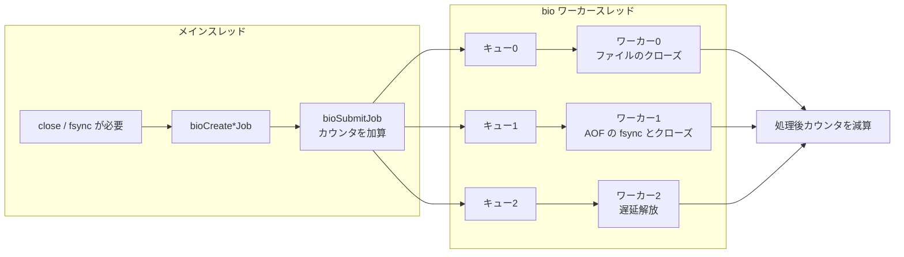
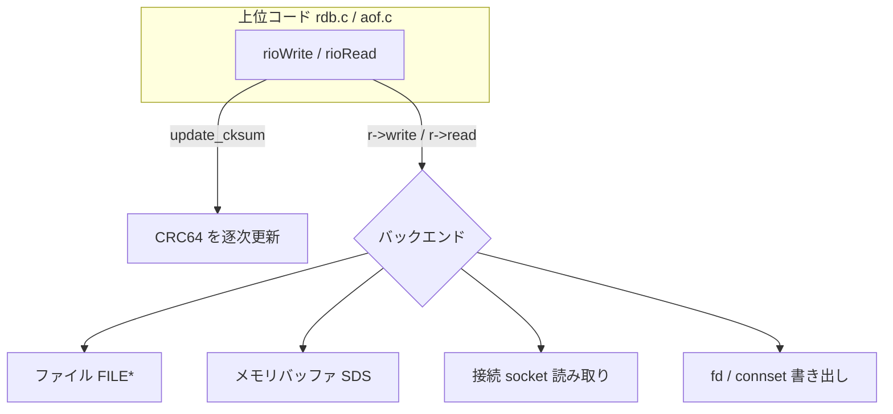
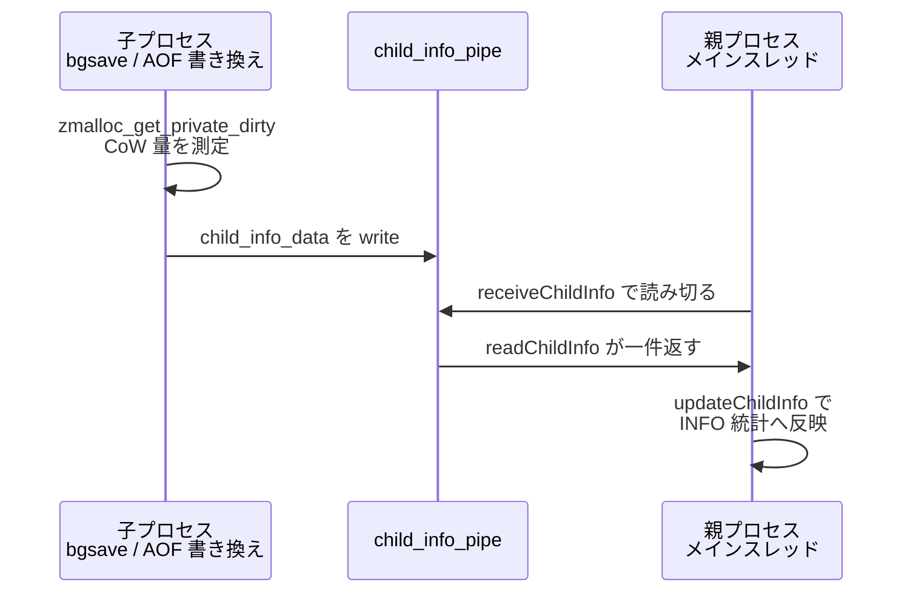

# 第37章 永続化の下支え

> **本章で読むソース**
>
> - [`src/bio.h`](https://github.com/valkey-io/valkey/blob/9.1.0/src/bio.h)
> - [`src/bio.c`](https://github.com/valkey-io/valkey/blob/9.1.0/src/bio.c)
> - [`src/rio.h`](https://github.com/valkey-io/valkey/blob/9.1.0/src/rio.h)
> - [`src/rio.c`](https://github.com/valkey-io/valkey/blob/9.1.0/src/rio.c)
> - [`src/childinfo.c`](https://github.com/valkey-io/valkey/blob/9.1.0/src/childinfo.c)

## この章の狙い

RDB と AOF は、それ単体では動かない。
どちらも、メインスレッドをブロックさせずにディスクへ書く仕組みと、書き込み先を問わない直列化の抽象に支えられている。
本章では、その下支えにあたる三つの機構を読む。
ブロックしうる操作を別スレッドへ逃がす **bio**（バックグラウンド I/O）、書き込み先の違いを吸収する **rio** 抽象、子プロセスの状態を親へ伝える **childinfo** である。

## 前提

- [第33章 遅延解放とデフラグ](../part05-database/33-lazyfree-defrag.md)：bio はオブジェクトの遅延解放を実行する側にあたる。
- [第35章 RDB](../part06-persistence/35-rdb.md)と[第36章 AOF](../part06-persistence/36-aof.md)：本章はこの二つの土台を説明する。先に読んでおくとつながりがわかる。

## メインスレッドからブロックを追い出す bio

Valkey はコマンドを単一スレッドのイベントループで処理する。
このスレッドが `close(2)` や `fsync(2)` で長時間止まると、その間すべてのクライアントが待たされる。
大きなファイルを閉じるときの `close` は、最後の参照が消えてファイルが unlink されるなら削除処理を伴い、低速になりうる。
AOF を毎秒同期する `fsync` も、ディスクが詰まっていれば数百ミリ秒単位で待たされる。
こうした「ブロックしうる操作」をメインスレッドから別のスレッドへ逃がすのが bio である。

ジョブの種別は `bio.h` の列挙で定義される。

[`src/bio.h` L48-L57](https://github.com/valkey-io/valkey/blob/9.1.0/src/bio.h#L48-L57)

```c
/* Background job opcodes */
enum {
    BIO_CLOSE_FILE = 0, /* Deferred close(2) syscall. */
    BIO_AOF_FSYNC,      /* Deferred AOF fsync. */
    BIO_LAZY_FREE,      /* Deferred objects freeing. */
    BIO_CLOSE_AOF,      /* Deferred close for AOF files. */
    BIO_RDB_SAVE,       /* Deferred save RDB to disk on replica */
    BIO_TLS_RELOAD,     /* Deferred TLS reload. */
    BIO_NUM_OPS
};
```

本章で追うのは、永続化に直接かかわる `BIO_CLOSE_FILE`（ファイルの遅延クローズ）、`BIO_AOF_FSYNC`（AOF の遅延同期）、`BIO_CLOSE_AOF`（同期してから閉じる）、そして第33章で扱った `BIO_LAZY_FREE`（オブジェクトの遅延解放）である。
`BIO_RDB_SAVE` はレプリカが受信した RDB をディスクへ書く専用で、第38章で扱う。

### ジョブ種別をワーカースレッドへ割り当てる

bio はジョブ種別ごとに担当ワーカースレッドを固定する。
割り当ては配列で静的に決まっている。

[`src/bio.c` L76-L98](https://github.com/valkey-io/valkey/blob/9.1.0/src/bio.c#L76-L98)

```c
static unsigned int bio_job_to_worker[] = {
    [BIO_CLOSE_FILE] = 0,
    [BIO_AOF_FSYNC] = 1,
    [BIO_CLOSE_AOF] = 1,
    [BIO_LAZY_FREE] = 2,
    [BIO_RDB_SAVE] = 3,
    [BIO_TLS_RELOAD] = 4, /* only used when BUILD_TLS=yes */
};

typedef struct {
    const char *const bio_worker_title;
    pthread_t bio_thread_id;
    mutexQueue *bio_jobs;
} bio_worker_data;

static bio_worker_data bio_workers[] = {
    {"bio_close_file"},
    {"bio_aof"},
    {"bio_lazy_free"},
    {"bio_rdb_save"},
    {"bio_tls_reload"}, /* only used when BUILD_TLS=yes */
};
```

割り当てから二つの設計判断が読み取れる。
第一に、`BIO_AOF_FSYNC` と `BIO_CLOSE_AOF` が同じワーカー 1 を共有する。
AOF ファイルに対する同期とクローズを同じスレッドが処理することで、ある fd への `fsync` がまだ片付いていないうちにその fd を閉じてしまう、という順序の食い違いを起こさずに済む。
第二に、遅延解放はワーカー 2 に分離されている。
解放対象が膨大なときでも、AOF の同期がその後ろで待たされない。

各ワーカーは自分専用のジョブキュー `bio_jobs`（`mutexQueue`）を持つ。
キューは挿入順に処理され、ファイル冒頭のコメントが述べるとおり、同じワーカーが扱うジョブは古いものから順に処理される。

### ジョブをキューに積む

メインスレッドは、操作を直接実行する代わりにジョブを作ってキューへ積む。
投入の共通経路が `bioSubmitJob` である。

[`src/bio.c` L186-L234](https://github.com/valkey-io/valkey/blob/9.1.0/src/bio.c#L186-L234)

```c
void bioSubmitJob(int type, bio_job *job) {
    job->header.type = type;
    bio_worker_data *const bwd = &bio_workers[bio_job_to_worker[type]];
    mutexQueueAdd(bwd->bio_jobs, job);
    atomic_fetch_add(&bio_jobs_counter[type], 1);
}
```

`bioSubmitJob` はジョブに種別タグを書き込み、`bio_job_to_worker` で担当ワーカーを引き、そのキューへ追加してから、種別ごとの未処理カウンタをアトミックに増やす。
カウンタを増やすだけで、完了を待たない。
これがメインスレッドのブロックを解く核心である。

永続化からの呼び口は種別ごとに用意されている。
たとえば AOF の遅延同期は `bioCreateFsyncJob` を、同期してから閉じる経路は `bioCreateCloseAofJob` を呼ぶ。

[`src/bio.c` L217-L234](https://github.com/valkey-io/valkey/blob/9.1.0/src/bio.c#L217-L234)

```c
void bioCreateCloseAofJob(int fd, long long offset, int need_reclaim_cache) {
    bio_job *job = allocBioJob(0);
    job->fd_args.fd = fd;
    job->fd_args.offset = offset;
    job->fd_args.need_fsync = 1;
    job->fd_args.need_reclaim_cache = need_reclaim_cache;

    bioSubmitJob(BIO_CLOSE_AOF, job);
}

void bioCreateFsyncJob(int fd, long long offset, int need_reclaim_cache) {
    bio_job *job = allocBioJob(0);
    job->fd_args.fd = fd;
    job->fd_args.offset = offset;
    job->fd_args.need_reclaim_cache = need_reclaim_cache;

    bioSubmitJob(BIO_AOF_FSYNC, job);
}
```

AOF の毎秒同期（`appendfsync everysec`）では、メインスレッドは書き込んだバイトを `write` でカーネルに渡したあと、`fsync` 自体は `bioCreateFsyncJob` でワーカー 1 に投げる。
ファイルの位置 `offset` をジョブに添えるのは、同期が完了したらどこまで永続化できたかをワーカーが記録するためである。

### ワーカースレッドがジョブを処理する

各ワーカーは `bioProcessBackgroundJobs` を回し続ける。
キューから一つ取り出し、種別で分岐して処理する。

[`src/bio.c` L268-L322](https://github.com/valkey-io/valkey/blob/9.1.0/src/bio.c#L268-L322)

```c
    while (1) {
        bio_job *job = mutexQueuePop(bwd->bio_jobs, true);

        /* Process the job accordingly to its type. */
        int job_type = job->header.type;

        if (job_type == BIO_CLOSE_FILE) {
            if (job->fd_args.need_fsync && valkey_fsync(job->fd_args.fd) == -1 && errno != EBADF && errno != EINVAL) {
                serverLog(LL_WARNING, "Fail to fsync the AOF file: %s", strerror(errno));
            }
            if (job->fd_args.need_reclaim_cache) {
                if (reclaimFilePageCache(job->fd_args.fd, 0, 0) == -1) {
                    serverLog(LL_NOTICE, "Unable to reclaim page cache: %s", strerror(errno));
                }
            }
            close(job->fd_args.fd);
        } else if (job_type == BIO_AOF_FSYNC || job_type == BIO_CLOSE_AOF) {
            /* ... (中略) ... */
            if (valkey_fsync(job->fd_args.fd) == -1 && errno != EBADF && errno != EINVAL) {
                /* ... (中略) ... */
            } else {
                atomic_store_explicit(&server.aof_bio_fsync_status, C_OK, memory_order_relaxed);
                atomic_store_explicit(&server.fsynced_reploff_pending, job->fd_args.offset, memory_order_relaxed);
            }
            /* ... (中略) ... */
            if (job_type == BIO_CLOSE_AOF) close(job->fd_args.fd);
        } else if (job_type == BIO_LAZY_FREE) {
            job->free_args.free_fn(job->free_args.free_args);
        }
        /* ... (中略) ... */
        zfree(job);
        atomic_fetch_sub(&bio_jobs_counter[job_type], 1);
    }
```

`mutexQueuePop` の第二引数 `true` はブロック付き取り出しを意味する。
キューが空ならワーカーはそこで眠り、ジョブが積まれると起きる。
ビジーループでも CPU をポーリングでも消費しない。

種別ごとの処理は、メインスレッドが本来やるはずだった操作そのものである。
`BIO_CLOSE_FILE` は必要なら `fsync` し、ページキャッシュを回収し、`close` する。
`BIO_AOF_FSYNC` は `fsync` の成否を `server.aof_bio_fsync_status` に記録し、成功時には `server.fsynced_reploff_pending` へジョブに添えた `offset` を書き込む。
ここで `fsync` が `EBADF` や `EINVAL` を返しても無視するのは、コメントが説明するとおり、メインスレッドが先に fd を閉じて別の用途に再利用した場合に偽の失敗を立てないためである。
処理が終わると、ジョブを解放し、未処理カウンタを一つ減らす。

メインスレッドは、永続化のために fsync を待つ必要があるとき、未処理ジョブ数を `bioPendingJobsOfType` で問い合わせる。

[`src/bio.c` L325-L335](https://github.com/valkey-io/valkey/blob/9.1.0/src/bio.c#L325-L335)

```c
/* Return the number of pending jobs of the specified type. */
unsigned long bioPendingJobsOfType(int type) {
    return atomic_load(&bio_jobs_counter[type]);
}

/* Wait for the job queue of the worker for jobs of specified type to become empty. */
void bioDrainWorker(int type) {
    while (bioPendingJobsOfType(type) > 0) {
        usleep(100);
    }
}
```

カウンタがアトミック変数である理由がここで効く。
メインスレッドは投入時に加算し、ワーカーは完了時に減算する。
両者がロックなしで安全に読み書きできるので、状況確認のたびにキューをロックして数える必要がない。

### bio によるブロック回避の全体像

メインスレッドからワーカーへのジョブの流れを図にする。



ここまでが最適化の核その一である。
ブロックしうるシステムコールをメインスレッドの外に出し、イベントループはジョブを積むだけで即座に次のクライアントへ戻る。

なお遅延解放そのものの設計（どのオブジェクトをいつ非同期に解放するか）は第33章で扱った。
本章はその実行基盤として bio を見た。

## 書き込み先を問わない rio 抽象

RDB の直列化コードは、ディスク上のファイルにも、メモリバッファにも、ディスクレスレプリケーションのソケットにも、同じ形式を書き出す。
書き込み先ごとに別々の直列化コードを持つのは保守の負担が大きい。
そこで Valkey は、読み書き先の違いを一段下に隠す抽象を置く。
それが rio である。
`rdb.c` の同じコードが、ファイル相手にもメモリバッファ相手にも RDB を読み書きできるのは、この抽象のおかげである。

rio は関数ポインタの組として定義される。

[`src/rio.h` L50-L67](https://github.com/valkey-io/valkey/blob/9.1.0/src/rio.h#L50-L67)

```c
struct _rio {
    /* Backend functions.
     * Since this functions do not tolerate short writes or reads the return
     * value is simplified to: zero on error, non zero on complete success. */
    size_t (*read)(struct _rio *, void *buf, size_t len);
    size_t (*write)(struct _rio *, const void *buf, size_t len);
    off_t (*tell)(struct _rio *);
    int (*flush)(struct _rio *);
    /* The update_cksum method if not NULL is used to compute the checksum of
     * all the data that was read or written so far. */
    void (*update_cksum)(struct _rio *, const void *buf, size_t len);

    /* The current checksum and flags (see RIO_FLAG_*) */
    uint64_t cksum, flags;
    /* ... (中略) ... */
};
```

`read`、`write`、`tell`、`flush` の四つが具体的な入出力先を実装する。
書き込み先の種類は四つある。

[`src/rio.h` L45-L48](https://github.com/valkey-io/valkey/blob/9.1.0/src/rio.h#L45-L48)

```c
#define RIO_TYPE_FILE (1 << 0)
#define RIO_TYPE_BUFFER (1 << 1)
#define RIO_TYPE_CONN (1 << 2)
#define RIO_TYPE_FD (1 << 3)
```

`RIO_TYPE_FILE` は `FILE *`、`RIO_TYPE_BUFFER` はメモリ上の SDS バッファ、`RIO_TYPE_CONN` は接続からの読み取り、`RIO_TYPE_FD` はパイプなど fd への書き出しに対応する。
バックエンドごとの状態は構造体末尾の共用体 `io` に置かれ、ファイルなら `FILE *` を、バッファなら SDS とその位置を保持する。

### 同じ呼び口でバックエンドを切り替える

上位コードが触れるのは `rioWrite` と `rioRead` のインライン関数だけである。
これらがバックエンドの関数ポインタを呼び、ついでにチェックサムを更新する。

[`src/rio.h` L119-L151](https://github.com/valkey-io/valkey/blob/9.1.0/src/rio.h#L119-L151)

```c
static inline size_t rioWrite(rio *r, const void *buf, size_t len) {
    if (r->flags & RIO_FLAG_WRITE_ERROR || r->flags & RIO_FLAG_CLOSE_ASAP) return 0;
    while (len) {
        size_t bytes_to_write =
            (r->max_processing_chunk && r->max_processing_chunk < len) ? r->max_processing_chunk : len;
        if (r->update_cksum) r->update_cksum(r, buf, bytes_to_write);
        if (r->write(r, buf, bytes_to_write) == 0) {
            r->flags |= RIO_FLAG_WRITE_ERROR;
            return 0;
        }
        buf = (char *)buf + bytes_to_write;
        len -= bytes_to_write;
        r->processed_bytes += bytes_to_write;
    }
    return 1;
}
```

`rioWrite` は `r->write` を間接呼び出しするだけで、その先がファイルかバッファかソケットかを知らない。
初期化関数がバックエンドを差し替える。
ファイルなら `rioInitWithFile` が `r` を `rioFileIO` で埋め、バッファなら `rioInitWithBuffer` が `rioBufferIO` で埋める。

[`src/rio.c` L197-L203](https://github.com/valkey-io/valkey/blob/9.1.0/src/rio.c#L197-L203)

```c
void rioInitWithFile(rio *r, FILE *fp) {
    *r = rioFileIO;
    r->io.file.fp = fp;
    r->io.file.buffered = 0;
    r->io.file.autosync = 0;
    r->io.file.reclaim_cache = 0;
}
```

`rioFileIO` は静的な雛形で、`read`、`write`、`tell`、`flush` にファイル用の実装を割り当ててある。
バッファ用の実装は、SDS への追記と読み取りで同じ関数群を満たす。

[`src/rio.c` L63-L75](https://github.com/valkey-io/valkey/blob/9.1.0/src/rio.c#L63-L75)

```c
/* Returns 1 or 0 for success/failure. */
static size_t rioBufferWrite(rio *r, const void *buf, size_t len) {
    r->io.buffer.ptr = sdscatlen(r->io.buffer.ptr, (char *)buf, len);
    r->io.buffer.pos += len;
    return 1;
}

/* Returns 1 or 0 for success/failure. */
static size_t rioBufferRead(rio *r, void *buf, size_t len) {
    if (sdslen(r->io.buffer.ptr) - r->io.buffer.pos < len) return 0; /* not enough buffer to return len bytes. */
    memcpy(buf, r->io.buffer.ptr + r->io.buffer.pos, len);
    r->io.buffer.pos += len;
    return 1;
}
```

実際の使い分けは初期化の一行で決まる。
RDB をディスクへ保存するときは `rioInitWithFile`、ディスクレスレプリケーションで複数レプリカへ同時に流すときは `rioInitWithConnset`、子プロセスからパイプへ流すときは `rioInitWithFd` を呼ぶ。
直列化の本体は一つのまま、入出力先だけが差し替わる。

### 書きながらチェックサムを計算する

rio の二つめの効きどころは `update_cksum` である。
`rioWrite` と `rioRead` は、データをバックエンドに渡す直前に `update_cksum` を呼ぶ。
書き出した内容をもう一度走査して CRC を計算する必要がない。
データが流れるその場で計算が進む。

[`src/rio.c` L427-L430](https://github.com/valkey-io/valkey/blob/9.1.0/src/rio.c#L427-L430)

```c
void rioGenericUpdateChecksum(rio *r, const void *buf, size_t len) {
    if ((r->flags & RIO_FLAG_SKIP_RDB_CHECKSUM) != 0) return; // skip RDB checksum
    r->cksum = crc64(r->cksum, buf, len);
}
```

`crc64` は現在のチェックサム値と新しいデータ片を受け取り、更新後の値を返す。
インクリメンタルに積み上げられるので、ストリームの末尾までデータが流れ終わった時点で `r->cksum` が全体の CRC64 になっている。
RDB の保存では `server.rdb_checksum` が有効なときに `update_cksum` へ `rioGenericUpdateChecksum` が差し込まれ、整合性チェック用のチェックサムがファイル末尾に書かれる。
別途ファイルを読み直す走査を省けるのが、この設計の省コストな点である。

`RIO_FLAG_SKIP_RDB_CHECKSUM` が立っているときは計算を飛ばす。
チェックサムを使わない設定のときに、CRC64 の計算コストそのものを払わないためである。

### ファイル書き込みでの自動 fsync

ファイル用バックエンドには、もう一つ永続化に効く工夫がある。
`autosync` を設定すると、一定バイトを書くごとに自動で同期する。

[`src/rio.c` L111-L128](https://github.com/valkey-io/valkey/blob/9.1.0/src/rio.c#L111-L128)

```c
static size_t rioFileWrite(rio *r, const void *buf, size_t len) {
    if (!r->io.file.autosync) return fwrite(buf, len, 1, r->io.file.fp);

    size_t nwritten = 0;
    /* Incrementally write data to the file, avoid a single write larger than
     * the autosync threshold (so that the kernel's buffer cache never has too
     * many dirty pages at once). */
    while (len != nwritten) {
        serverAssert(r->io.file.autosync > r->io.file.buffered);
        size_t nalign = (size_t)(r->io.file.autosync - r->io.file.buffered);
        size_t towrite = nalign > len - nwritten ? len - nwritten : nalign;

        if (fwrite((char *)buf + nwritten, towrite, 1, r->io.file.fp) == 0) return 0;
        nwritten += towrite;
        r->io.file.buffered += towrite;

        if (r->io.file.buffered >= r->io.file.autosync) {
            fflush(r->io.file.fp);
            /* ... (中略) ... */
```

閾値ごとに `fflush` し、`sync_file_range` で書き出しを進める。
コメントが述べるとおり、カーネルのバッファキャッシュに dirty ページを溜めすぎないための工夫である。
一度に大量のページを溜めてから同期すると、その瞬間に I/O が集中して長く待たされる。
こまめに書き出せば、I/O 圧力が時間方向に均される。
RDB の保存と AOF の書き換えでは、`rioSetAutoSync` に `REDIS_AUTOSYNC_BYTES` を渡してこの挙動を有効にしている。

### rio 抽象のまとめ図



ここまでが最適化の核その二である。
直列化コードを一本化しつつ、データを流すその場でチェックサムを積み上げる。

## 子プロセスから親へ状態を伝える childinfo

RDB の保存や AOF の書き換えは、`fork` した子プロセスが担う（第35章と第36章）。
fork 直後の子は親とメモリページを共有し、親が書き込んだページだけがコピーされる（コピーオンライト）。
このとき親が知りたいのは、子がどれだけのページをコピーさせたか、つまり保存がどれだけメモリを消費しているかである。
子は別プロセスなので、共有メモリ経由では渡せない。
そこで親子をパイプでつなぎ、子が測った値を流す。
これを担うのが childinfo である。

子が親へ送る本体が `sendChildInfoGeneric` である。

[`src/childinfo.c` L67-L116](https://github.com/valkey-io/valkey/blob/9.1.0/src/childinfo.c#L67-L116)

```c
/* Send save data to parent. */
void sendChildInfoGeneric(childInfoType info_type, size_t keys, size_t repl_output_bytes, double progress, char *pname) {
    if (server.child_info_pipe[1] == -1) return;
    /* ... (中略) ... */
    monotime now = getMonotonicUs();
    if (info_type != CHILD_INFO_TYPE_CURRENT_INFO || !cow_updated ||
        now - cow_updated > cow_update_cost * CHILD_COW_DUTY_CYCLE) {
        cow = zmalloc_get_private_dirty(-1);
        cow_updated = getMonotonicUs();
        cow_update_cost = cow_updated - now;
        /* ... (中略) ... */
    }

    data.information_type = info_type;
    data.keys = keys;
    data.repl_output_bytes = repl_output_bytes;
    data.cow = cow;
    data.cow_updated = cow_updated;
    data.progress = progress;

    ssize_t wlen = sizeof(data);

    if (write(server.child_info_pipe[1], &data, wlen) != wlen) {
        /* Failed writing to parent, it could have been killed, exit. */
        serverLog(LL_WARNING, "Child failed reporting info to parent, exiting. %s", strerror(errno));
        exitFromChild(1);
    }
}
```

子はコピーオンライトの実測値を `zmalloc_get_private_dirty` で取り、進捗（`progress`）や処理済みキー数（`keys`）とともに `child_info_data` 構造体に詰めてパイプへ書く。
コピーオンライト量の測定には、コメントが述べるとおり無視できないコストがかかる。
そこで進捗報告（`CHILD_INFO_TYPE_CURRENT_INFO`）のときは、前回の測定にかかった時間 `cow_update_cost` に `CHILD_COW_DUTY_CYCLE` を掛けた間隔が経つまで再測定を見送る。
測定そのものが保存を遅らせないよう、測定頻度をコストに比例して絞るわけである。

親は1秒ごとに、あるいは子の終了時に `receiveChildInfo` を呼び、パイプを読み切る。

[`src/childinfo.c` L173-L188](https://github.com/valkey-io/valkey/blob/9.1.0/src/childinfo.c#L173-L188)

```c
/* Receive info data from child. */
void receiveChildInfo(void) {
    if (server.child_info_pipe[0] == -1) return;

    size_t cow;
    monotime cow_updated;
    size_t keys;
    size_t repl_output_bytes;
    double progress;
    childInfoType information_type;

    /* Drain the pipe and update child info so that we get the final message. */
    while (readChildInfo(&information_type, &cow, &cow_updated, &keys, &repl_output_bytes, &progress)) {
        updateChildInfo(information_type, cow, cow_updated, keys, repl_output_bytes, progress);
    }
}
```

`readChildInfo` はパイプから固定長の `child_info_data` を一件ずつ取り出す。
パイプ越しの `read` は途中までしか返さないことがあるので、`server.child_info_nread` に読み取り済みバイト数を覚えておき、一件分が揃うまで部分データをバッファに残す。
揃ったら 1 を返し、`receiveChildInfo` はパイプが空になるまでこのループを回して最後のメッセージまで取り込む。

取り出した値は `updateChildInfo` がサーバ統計へ反映する。

[`src/childinfo.c` L119-L139](https://github.com/valkey-io/valkey/blob/9.1.0/src/childinfo.c#L119-L139)

```c
/* Update Child info. */
void updateChildInfo(childInfoType information_type, size_t cow, monotime cow_updated, size_t keys, size_t repl_output_bytes, double progress) {
    if (cow > server.stat_current_cow_peak) server.stat_current_cow_peak = cow;

    if (information_type == CHILD_INFO_TYPE_CURRENT_INFO) {
        server.stat_current_cow_bytes = cow;
        server.stat_current_cow_updated = cow_updated;
        server.stat_current_save_keys_processed = keys;
        if (progress != -1) server.stat_module_progress = progress;
    } else if (information_type == CHILD_INFO_TYPE_AOF_COW_SIZE) {
        server.stat_aof_cow_bytes = server.stat_current_cow_peak;
    } else if (information_type == CHILD_INFO_TYPE_RDB_COW_SIZE) {
        server.stat_rdb_cow_bytes = server.stat_current_cow_peak;
    }
    /* ... (中略) ... */
}
```

情報の種別で分岐し、進行中の値と、保存完了時のピーク値を別々の統計に書き分ける。
`CHILD_INFO_TYPE_RDB_COW_SIZE` なら直近 RDB のコピーオンライトのピークを `server.stat_rdb_cow_bytes` に、AOF なら `server.stat_aof_cow_bytes` に保存する。
これらの統計は `INFO` の集計に現れ、保存がメモリをどれだけ膨らませたかを運用者が確認できる。

childinfo の経路を図にまとめる。



## まとめ

- bio はブロックしうる `close` や `fsync` や遅延解放をメインスレッドからワーカースレッドへ逃がす。メインスレッドはジョブをキューへ積んでカウンタを増やすだけで、完了を待たずにイベントループへ戻る。
- ジョブ種別はワーカーへ静的に割り当てられ、AOF の `fsync` と `close` は同一ワーカーが順序を守って処理する。遅延解放は別ワーカーに分離され、他の同期を待たせない。
- rio は `read`、`write`、`tell`、`flush` の関数ポインタで、ファイルとバッファと接続と fd を同一の呼び口に統一する。直列化コードは書き込み先を意識しない。
- rio は `update_cksum` でデータを流すその場で CRC64 を積み上げる。書き出した内容を再走査せずに整合性チェック用のチェックサムが得られる。
- childinfo は fork した子のコピーオンライト量や進捗をパイプで親へ届ける。測定コストに応じて測定頻度を絞り、結果は `INFO` の統計へ反映される。

## 関連する章

- [第33章 遅延解放とデフラグ](../part05-database/33-lazyfree-defrag.md)：bio が実行する遅延解放の設計。
- [第35章 RDB](../part06-persistence/35-rdb.md)：rio とファイル保存、childinfo の送り手。
- [第36章 AOF](../part06-persistence/36-aof.md)：bio による毎秒同期と rio の書き込み。
- [第38章 レプリケーション](../part07-replication-cluster/38-replication.md)：ディスクレス転送での rio の connset と fd バックエンド、`BIO_RDB_SAVE`。
