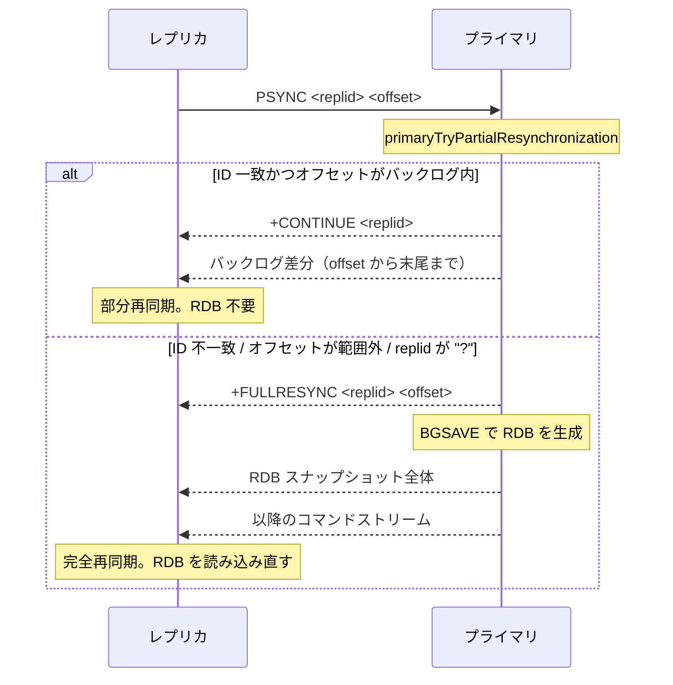
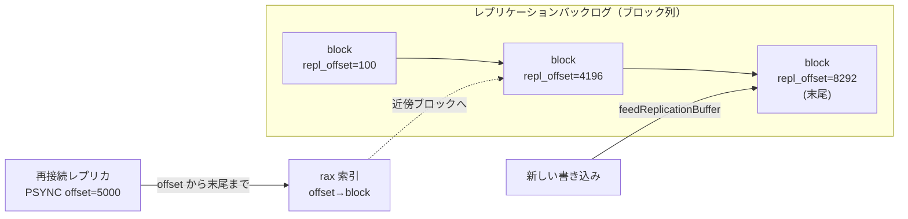

# 第38章 レプリケーション

> **本章で読むソース**
>
> - [`src/replication.c`](https://github.com/valkey-io/valkey/blob/9.1.0/src/replication.c)
> - [`src/server.h`](https://github.com/valkey-io/valkey/blob/9.1.0/src/server.h)
> - [`src/server.c`](https://github.com/valkey-io/valkey/blob/9.1.0/src/server.c)
> - [`src/rdb.c`](https://github.com/valkey-io/valkey/blob/9.1.0/src/rdb.c)

## この章の狙い

プライマリとレプリカのレプリケーションが、プライマリの書き込みをどうやってレプリカへ届け、両者の状態を一致させ続けるのかを理解する。
PSYNC のハンドシェイクで完全再同期と部分再同期を分ける条件、部分再同期を支えるレプリケーションバックログ、RDB をディスクに書かずにレプリカへ流すディスクレス同期という二つの最適化を、実コードのレベルで読む。

## 前提

- コマンドの実行と伝播の仕組みは [第27章](../part04-server-events/27-command-execution.md) を先に読むとよい。
- RDB スナップショットの生成は [第35章](../part06-persistence/35-rdb.md) で扱う。

## プライマリとレプリカの役割と読み取り専用

レプリケーションは、ひとつのプライマリ（primary）が受けた書き込みを、複数のレプリカ（replica）へ伝えて同じデータセットを保つ仕組みである。
レプリカは `REPLICAOF <host> <port>` でプライマリを指定し、主に接続して同期を始める。
このコマンドを処理するのが `replicaofCommand` である。

[`src/replication.c` L4607-L4645](https://github.com/valkey-io/valkey/blob/9.1.0/src/replication.c#L4607-L4645)

```c
    /* The special host/port combination "NO" "ONE" turns the instance
     * into a primary. Otherwise the new primary address is set. */
    if (!strcasecmp(objectGetVal(c->argv[1]), "no") && !strcasecmp(objectGetVal(c->argv[2]), "one")) {
        if (server.primary_host) {
            replicationUnsetPrimary();
            // ... (中略) ...
        }
    } else {
        // ... (中略) ...
        /* There was no previous primary or the user specified a different one,
         * we can continue. */
        replicationSetPrimary(objectGetVal(c->argv[1]), port, 0, true);
        // ... (中略) ...
    }
```

`REPLICAOF NO ONE` を受け取ると `replicationUnsetPrimary` でプライマリへの従属をやめ、自身を主に戻す。
それ以外では `replicationSetPrimary` で新しいプライマリの住所を登録し、以後の接続と同期を起動する。

レプリカは既定で読み取り専用である。
書き込みコマンドの受理判定は `processCommand`（[第27章](../part04-server-events/27-command-execution.md)）の中にある。

[`src/server.c` L4546-L4551](https://github.com/valkey-io/valkey/blob/9.1.0/src/server.c#L4546-L4551)

```c
    /* Don't accept write commands if this is a read only replica. But
     * accept write commands if this is our primary. */
    if (server.primary_host && server.repl_replica_ro && !obey_client && is_write_command) {
        rejectCommand(c, shared.roreplicaerr, 1);
        return C_OK;
    }
```

自身がプライマリを持ち（`server.primary_host`）、`replica-read-only` が有効で（`server.repl_replica_ro`）、プライマリからの伝播ではない（`!obey_client`）通常クライアントの書き込みは、`-READONLY` エラーで拒否される。
プライマリから流れてきた書き込みだけがレプリカのデータを変える。
この一方向性が、レプリカがプライマリのコピーであり続けることの土台になる。

## レプリケーションのオフセットと replication ID

レプリケーションは、プライマリが生成したコマンドストリームを連続したバイト列とみなし、その先頭からの累積バイト数をオフセットで数える。
プライマリの現在地は `server.primary_repl_offset` が保持する。

[`src/server.h` L2110](https://github.com/valkey-io/valkey/blob/9.1.0/src/server.h#L2110)

```c
    long long primary_repl_offset;              /* My current replication offset */
```

レプリカは「プライマリのどのオフセットまで受け取ったか」を覚えておき、再接続のときにその続きを要求する。
ただしオフセットだけでは足りない。
別のプライマリのストリームの同じオフセットと取り違えてはならないからである。
そこでプライマリは自分の履歴を表す乱数の識別子 **replication ID**（`server.replid`）を持つ。

[`src/replication.c` L2071-L2074](https://github.com/valkey-io/valkey/blob/9.1.0/src/replication.c#L2071-L2074)

```c
void changeReplicationId(void) {
    getRandomHexChars(server.replid, CONFIG_RUN_ID_SIZE);
    server.replid[CONFIG_RUN_ID_SIZE] = '\0';
}
```

データセットの履歴が切り替わる場面、たとえばレプリカが昇格して新しい主になる場面では、`changeReplicationId` で ID を引き直す。
これにより、過去のプライマリと同じオフセットを示してきたレプリカとの誤った接続を防ぐ。

ここで replication ID は二つある。
`server.replid` が現在の ID、`server.replid2` が直前の ID である。
レプリカが昇格すると `shiftReplicationId` が呼ばれ、それまでの ID を `replid2` に退避してから新しい ID を作る。

[`src/replication.c` L2090-L2103](https://github.com/valkey-io/valkey/blob/9.1.0/src/replication.c#L2090-L2103)

```c
void shiftReplicationId(void) {
    memcpy(server.replid2, server.replid, sizeof(server.replid));
    /* We set the second replid offset to the primary offset + 1, since
     * the replica will ask for the first byte it has not yet received, so
     * we need to add one to the offset: for example if, as a replica, we are
     * sure we have the same history as the primary for 50 bytes, after we
     * are turned into a primary, we can accept a PSYNC request with offset
     * 51, since the replica asking has the same history up to the 50th
     * byte, and is asking for the new bytes starting at offset 51. */
    server.second_replid_offset = server.primary_repl_offset + 1;
    changeReplicationId();
    // ... (中略) ...
}
```

昇格直後のレプリカは、旧プライマリの ID（`replid2`）と当時のオフセットを引き継いでいる。
旧主に従属していた兄弟レプリカが、昇格した新プライマリへ旧 ID で再接続してきても、`second_replid_offset` までなら同じ履歴とみなして部分再同期を受け入れられる。
このしくみは、フェイルオーバー後に兄弟レプリカ群がいっせいに完全再同期へ落ちるのを避けるためにある。

## PSYNC ハンドシェイクと再同期の分岐

レプリカは主に対して `PSYNC <replid> <offset>` を送る。
このコマンドを組み立てるのがレプリカ側の `replicaSendPsyncCommand` である。

[`src/replication.c` L3490-L3506](https://github.com/valkey-io/valkey/blob/9.1.0/src/replication.c#L3490-L3506)

```c
    } else if (server.cached_primary) {
        psync_replid = server.cached_primary->repl_data->replid;
        snprintf(psync_offset, sizeof(psync_offset), "%lld", server.cached_primary->repl_data->reploff + 1);
        serverLog(LL_NOTICE, "Trying a partial resynchronization (request %s:%s).", psync_replid, psync_offset);
    } else {
        serverLog(LL_NOTICE, "Partial resynchronization not possible (no cached primary)");
        psync_replid = "?";
        memcpy(psync_offset, "-1", 3);
    }
    // ... (中略) ...
        reply = sendCommand(conn, "PSYNC", psync_replid, psync_offset, NULL);
```

過去にプライマリと話した記録（`cached_primary`）があれば、その replication ID と「まだ受け取っていない最初のバイト」のオフセットを送る。
記録がなければ replid に `?`、オフセットに `-1` を入れる。
これは「履歴を持たないので完全再同期でよい」という明示の合図である。

プライマリの側は `syncCommand` で `SYNC` と `PSYNC` の両方を受ける。
`PSYNC` のときは、まず部分再同期を試みる。

[`src/replication.c` L1151-L1162](https://github.com/valkey-io/valkey/blob/9.1.0/src/replication.c#L1151-L1162)

```c
    if (!strcasecmp(objectGetVal(c->argv[0]), "psync")) {
        long long psync_offset;
        if (getLongLongFromObjectOrReply(c, c->argv[2], &psync_offset, NULL) != C_OK) {
            serverLog(LL_WARNING, "Replica %s asks for synchronization but with a wrong offset",
                      replicationGetReplicaName(c));
            return;
        }

        if (primaryTryPartialResynchronization(c, psync_offset) == C_OK) {
            server.stat_sync_partial_ok++;
            return; /* No full resync needed, return. */
        } else {
```

`primaryTryPartialResynchronization` が成功すれば部分再同期で済み、ここで処理を終える。
失敗すれば後続のコードへ落ちて完全再同期に進む。

完全再同期の準備をするのが、同じ `syncCommand` の末尾である。

[`src/replication.c` L1190-L1213](https://github.com/valkey-io/valkey/blob/9.1.0/src/replication.c#L1190-L1213)

```c
    /* Full resynchronization. */
    server.stat_sync_full++;

    /* Setup the replica as one waiting for BGSAVE to start. The following code
     * paths will change the state if we handle the replica differently. */
    c->repl_data->repl_state = REPLICA_STATE_WAIT_BGSAVE_START;
    // ... (中略) ...
    c->flag.replica = 1;
    listAddNodeTail(server.replicas, c);

    /* Create the replication backlog if needed. */
    if (listLength(server.replicas) == 1 && server.repl_backlog == NULL) {
        /* When we create the backlog from scratch, we always use a new
         * replication ID and clear the ID2, since there is no valid
         * past history. */
        changeReplicationId();
        clearReplicationId2();
        createReplicationBacklog();
        // ... (中略) ...
    }
```

クライアントをレプリカとして登録し（`server.replicas` に追加）、状態を `REPLICA_STATE_WAIT_BGSAVE_START` にする。
最初のレプリカが付いたときには、ここでバックログを新規に作る。
バックログを新規作成するときには新しい replication ID を引き直し、`replid2` を消す。
過去の有効な履歴がないからである。

部分再同期の判定そのものは `primaryTryPartialResynchronization` にある。
要求された replication ID がプライマリの `replid` とも `replid2` とも一致しなければ、履歴が違うので続行できない。

[`src/replication.c` L866-L910](https://github.com/valkey-io/valkey/blob/9.1.0/src/replication.c#L866-L910)

```c
    if (strcasecmp(primary_replid, server.replid) &&
        (strcasecmp(primary_replid, server.replid2) || psync_offset > server.second_replid_offset)) {
        /* Replid "?" is used by replicas that want to force a full resync. */
        if (primary_replid[0] != '?') {
            // ... (中略：ログ出力) ...
        } else {
            serverLog(LL_NOTICE, "Full resync requested by replica %s", replicationGetReplicaName(c));
        }
        goto need_full_resync;
    }

    /* We still have the data our replica is asking for? */
    if (!server.repl_backlog || psync_offset < server.repl_backlog->offset ||
        psync_offset > (server.repl_backlog->offset + server.repl_backlog->histlen)) {
        // ... (中略：ログ出力) ...
        goto need_full_resync;
    }
```

ID が一致しても、要求オフセットがバックログの保持範囲（`offset` から `offset + histlen` まで）の外なら、差分が残っていないので続けられない。
どちらの場合も `need_full_resync` へ飛び、`C_ERR` を返して完全再同期に切り替える。

両方を満たしたときだけ、プライマリは `+CONTINUE` を返して差分を送る。

[`src/replication.c` L934-L947](https://github.com/valkey-io/valkey/blob/9.1.0/src/replication.c#L934-L947)

```c
    if (c->repl_data->replica_capa & REPLICA_CAPA_PSYNC2) {
        buflen = snprintf(buf, sizeof(buf), "+CONTINUE %s\r\n", server.replid);
    } else {
        buflen = snprintf(buf, sizeof(buf), "+CONTINUE\r\n");
    }
    if (connWrite(c->conn, buf, buflen) != buflen) {
        freeClientAsync(c);
        return C_OK;
    }
    psync_len = addReplyReplicationBacklog(c, psync_offset);
    serverLog(
        LL_NOTICE,
        "Partial resynchronization request from %s accepted. Sending %lld bytes of backlog starting from offset %lld.",
        replicationGetReplicaName(c), psync_len, psync_offset);
```

`addReplyReplicationBacklog` が、要求オフセットからバックログ末尾までのバイト列をレプリカの送信対象に設定する。
これで切断中に失った分だけが送られ、完全再同期は避けられる。

完全再同期のときは、プライマリは `+FULLRESYNC <replid> <offset>` を返す。
これを送るのが `replicationSetupReplicaForFullResync` である。

[`src/replication.c` L830-L845](https://github.com/valkey-io/valkey/blob/9.1.0/src/replication.c#L830-L845)

```c
    replica->repl_data->psync_initial_offset = offset;
    replica->repl_data->repl_state = REPLICA_STATE_WAIT_BGSAVE_END;
    /* We are going to accumulate the incremental changes for this
     * replica as well. Set replicas_eldb to -1 in order to force to re-emit
     * a SELECT statement in the replication stream. */
    server.replicas_eldb = -1;

    /* Don't send this reply to replicas that approached us with
     * the old SYNC command. */
    if (!(replica->flag.pre_psync)) {
        buflen = snprintf(buf, sizeof(buf), "+FULLRESYNC %s %lld\r\n", server.replid, offset);
        if (connWrite(replica->conn, buf, buflen) != buflen) {
            freeClientAsync(replica);
            return C_ERR;
        }
    }
```

`+FULLRESYNC` には、これから送る RDB の基準となる replication ID とオフセットが入る。
レプリカはこの ID とオフセットを覚え、次回の切断後に `PSYNC` で部分再同期を試みる根拠にする。
レプリカ側で `+FULLRESYNC` を解釈するのが `replicaProcessPsyncReply` である。

[`src/replication.c` L3558-L3585](https://github.com/valkey-io/valkey/blob/9.1.0/src/replication.c#L3558-L3585)

```c
    if (!strncmp(reply, "+FULLRESYNC", 11)) {
        char *replid = NULL, *offset = NULL;

        /* FULL RESYNC, parse the reply in order to extract the replid
         * and the replication offset. */
        replid = strchr(reply, ' ');
        // ... (中略：パース) ...
        } else {
            memcpy(server.primary_replid, replid, offset - replid - 1);
            server.primary_replid[CONFIG_RUN_ID_SIZE] = '\0';
            server.primary_initial_offset = strtoll(offset, NULL, 10);
            serverLog(LL_NOTICE, "Full resync from primary: %s:%lld", server.primary_replid,
                      server.primary_initial_offset);
        }
        sdsfree(reply);
        return PSYNC_FULLRESYNC;
    }
```

レプリカは応答からプライマリの replication ID と初期オフセットを取り出し、これを起点にプライマリのコピーを作り直す。

ここまでのハンドシェイクを図にすると、次の二経路に分かれる。



## レプリケーションバックログによる部分再同期（最適化その1）

部分再同期を成り立たせるのが、プライマリが保持する循環的な履歴バッファ、**レプリケーションバックログ**である。
プライマリはレプリカへ送ったコマンドストリームを、同じ内容でバックログにも書き込む。
短時間の切断のあとにレプリカが復帰したら、必要なオフセットからの差分だけを送り、RDB の丸ごと転送を避ける。

バックログを管理する構造体は `replBacklog` である。

[`src/server.h` L1067-L1077](https://github.com/valkey-io/valkey/blob/9.1.0/src/server.h#L1067-L1077)

```c
typedef struct replBacklog {
    listNode *ref_repl_buf_node; /* Referenced node of replication buffer blocks,
                                  * see the definition of replBufBlock. */
    size_t unindexed_count;      /* The count from last creating index block. */
    rax *blocks_index;           /* The index of recorded blocks of replication
                                  * buffer for quickly searching replication
                                  * offset on partial resynchronization. */
    long long histlen;           /* Backlog actual data length */
    long long offset;            /* Replication "primary offset" of first
                                  * byte in the replication backlog buffer.*/
} replBacklog;
```

`offset` がバックログ先頭バイトのオフセット、`histlen` が保持している長さである。
この二つから保持範囲が `[offset, offset + histlen]` だと決まり、部分再同期の可否判定に使われる。

バックログとレプリカ群は、実体としては同じバッファブロックを共有している。
ブロックは `replBufBlock` で、各ブロックを何個のレプリカとバックログが参照しているかを `refcount` で数える。

[`src/server.h` L890-L896](https://github.com/valkey-io/valkey/blob/9.1.0/src/server.h#L890-L896)

```c
typedef struct replBufBlock {
    int refcount;          /* Number of replicas or repl backlog using. */
    long long id;          /* The unique incremental number. */
    long long repl_offset; /* Start replication offset of the block. */
    size_t size, used;
    char buf[];
} replBufBlock;
```

コマンドストリームを実際にこのブロック列へ書き込むのが `feedReplicationBuffer` である。
末尾ブロックに空きがあれば追記し、足りなければ新しいブロックを継ぎ足す。

[`src/replication.c` L464-L509](https://github.com/valkey-io/valkey/blob/9.1.0/src/replication.c#L464-L509)

```c
        /* Append to tail string when possible. */
        if (tail && tail->size > tail->used) {
            // ... (中略) ...
            size_t copy = (avail >= len) ? len : avail;
            memcpy(tail->buf + tail->used, s, copy);
            tail->used += copy;
            s += copy;
            len -= copy;
            server.primary_repl_offset += copy;
            server.repl_backlog->histlen += copy;
        }
        if (len) {
            /* Create a new node, make sure it is allocated to at
             * least PROTO_REPLY_CHUNK_BYTES */
            // ... (中略：新ブロックの確保) ...
            tail->repl_offset = server.primary_repl_offset + 1;
            // ... (中略) ...
            server.primary_repl_offset += copy;
            server.repl_backlog->histlen += copy;
        }
```

書き込んだバイト数だけ `primary_repl_offset` と `histlen` が進む。
このブロック列をレプリカもバックログも参照するので、同じデータを二重に持たずに済む。
つまり、現に接続しているレプリカへの送信バッファが、そのまま切断レプリカ向けの履歴を兼ねる。
ここが省メモリの要点である。

ブロック列は、ただの連結リストだと目的のオフセットを探すのに先頭からたどることになる。
そこで一定ブロックごとに `rax`（基数木）の索引を張り、オフセットからおおよそのブロックへ一気に飛べるようにしている。
索引を作るのが `createReplicationBacklogIndex` である。

[`src/replication.c` L182-L190](https://github.com/valkey-io/valkey/blob/9.1.0/src/replication.c#L182-L190)

```c
void createReplicationBacklogIndex(listNode *ln) {
    server.repl_backlog->unindexed_count++;
    if (server.repl_backlog->unindexed_count >= REPL_BACKLOG_INDEX_PER_BLOCKS) {
        replBufBlock *o = listNodeValue(ln);
        uint64_t encoded_offset = htonu64(o->repl_offset);
        raxInsert(server.repl_backlog->blocks_index, (unsigned char *)&encoded_offset, sizeof(uint64_t), ln, NULL);
        server.repl_backlog->unindexed_count = 0;
    }
}
```

部分再同期で要求オフセットから送信を始めるとき、`addReplyReplicationBacklog` はこの索引を使う。

[`src/replication.c` L756-L789](https://github.com/valkey-io/valkey/blob/9.1.0/src/replication.c#L756-L789)

```c
    /* Iterate recorded blocks, quickly search the approximate node. */
    listNode *node = NULL;
    if (raxSize(server.repl_backlog->blocks_index) > 0) {
        uint64_t encoded_offset = htonu64(offset);
        raxIterator ri;
        raxStart(&ri, server.repl_backlog->blocks_index);
        raxSeek(&ri, ">", (unsigned char *)&encoded_offset, sizeof(uint64_t));
        // ... (中略：索引から近傍ノードを得る) ...
    } else {
        /* No recorded blocks, just from the start node to search. */
        node = server.repl_backlog->ref_repl_buf_node;
    }

    /* Search the exact node. */
    while (node != NULL) {
        replBufBlock *o = listNodeValue(node);
        if (o->repl_offset + (long long)o->used >= offset) break;
        node = listNextNode(node);
    }
    serverAssert(node != NULL);
```

索引で近いブロックまで飛んでから、目的のオフセットを含むブロックまで細かくたどる。
これにより、要求オフセットの探索が、バックログ全体の線形走査ではなく索引引きで済む。

バックログ全体の流れを図にすると次のようになる。



バックログには上限があり、超えた分の古いブロックは捨てられる。
既定の上限は `repl-backlog-size`（10MB）である。
切断が長引いて要求オフセットがこの範囲から落ちると、部分再同期はできず完全再同期になる。
言い換えれば、バックログは短時間の切断を差分転送で吸収するための最適化であって、無制限の履歴ではない。

## ディスクレス同期（最適化その2）

完全再同期ではプライマリが RDB スナップショットをレプリカへ送る。
素直に作るなら、いったん RDB ファイルをディスクに書き、それを読みながら送ることになる。
**ディスクレス同期**は、生成した RDB をディスクに置かず、子プロセスから直接レプリカのソケットへ流す。
ディスクへの書き込みと読み戻しを省く。

どちらの方式を使うかは `startBgsaveForReplication` が決める。

[`src/replication.c` L1002-L1028](https://github.com/valkey-io/valkey/blob/9.1.0/src/replication.c#L1002-L1028)

```c
    socket_target = (mincapa & REPLICA_CAPA_EOF) && (server.repl_diskless_sync ||
                                                     (req & REPLICA_REQ_RDB_MASK) ||
                                                     rdbver != RDB_VERSION);
    // ... (中略) ...
    rdbSaveInfo rsi, *rsiptr;
    rsiptr = rdbPopulateSaveInfo(&rsi);
    /* Only do rdbSave* when rsiptr is not NULL,
     * otherwise replica will miss repl-stream-db. */
    if (rsiptr) {
        if (socket_target)
            retval = rdbSaveToReplicasSockets(req, rdbver, rsiptr);
        else {
            /* Keep the page cache since it'll get used soon */
            retval = rdbSaveBackground(req, server.rdb_filename, rsiptr, RDBFLAGS_REPLICATION | RDBFLAGS_KEEP_CACHE);
        }
        // ... (中略) ...
    }
```

レプリカが EOF マーカーを扱える（`REPLICA_CAPA_EOF`）うえで、`repl-diskless-sync` が有効なら、ソケット直送（`rdbSaveToReplicasSockets`）を選ぶ。
そうでなければ `rdbSaveBackground` でディスクへ書く。
ディスクレスでは RDB の終端がファイルサイズではなくバイト列のマーカーで示される。
これがレプリカが EOF マーカー対応である必要の理由である。

ソケット直送の実体は `rdbSaveToReplicasSockets` にある。
プライマリは対象レプリカのソケットを集め、子プロセスを fork して、その子が RDB をソケットへ直接書き出す。

[`src/rdb.c` L3769-L3800](https://github.com/valkey-io/valkey/blob/9.1.0/src/rdb.c#L3769-L3800)

```c
    /* Filter replica connections pending full sync (ie. in WAIT_BGSAVE_START state). */
    listRewind(server.replicas, &li);
    while ((ln = listNext(&li))) {
        client *replica = ln->value;
        if (replica->repl_data->repl_state == REPLICA_STATE_WAIT_BGSAVE_START) {
            // ... (中略：要件チェック) ...
            conns[connsnum++] = replica->conn;
            // ... (中略) ...
            replicationSetupReplicaForFullResync(replica, getPsyncInitialOffset());
        }
        // ... (中略) ...
    }

    /* Create the child process. */
    if ((childpid = serverFork(CHILD_TYPE_RDB)) == 0) {
```

完全再同期を待っている（`REPLICA_STATE_WAIT_BGSAVE_START`）レプリカの接続を集め、それぞれに `+FULLRESYNC` を送ってから fork する。
子プロセスは fork 時点のデータセットを RDB として書き出し、集めたソケットへ流す。
ディスクを経由しないので、完全再同期にかかるディスク I/O を丸ごと省ける。
fork 時のコピーオンライトにより、子は親のメモリのスナップショットを追加コピーなしで読める（[第35章](../part06-persistence/35-rdb.md)）。

ディスクレスを有効にするかは `repl-diskless-sync` で切り替える。
このフラグは 9.1.0 では既定で有効になっている。

[`src/config.c` L3278](https://github.com/valkey-io/valkey/blob/9.1.0/src/config.c#L3278)

```c
    createBoolConfig("repl-diskless-sync", NULL, DEBUG_CONFIG | MODIFIABLE_CONFIG, server.repl_diskless_sync, 1, NULL, NULL),
```

## コマンド伝播と ACK

完全再同期で初期コピーを作ったあとは、プライマリが受けた書き込みを継続的にレプリカへ流す。
これを担うのが `replicationFeedReplicas` である。
コマンド実行後の伝播経路（[第27章](../part04-server-events/27-command-execution.md)）から、`propagateNow` がこの関数を呼ぶ。

[`src/server.c` L3612-L3619](https://github.com/valkey-io/valkey/blob/9.1.0/src/server.c#L3612-L3619)

```c
    int propagate_to_repl = target & PROPAGATE_REPL;
    // ... (中略) ...
    if (propagate_to_repl) replicationFeedReplicas(dbid, argv, argc);
```

`replicationFeedReplicas` は、まず必要なら `SELECT` を挿入し、続いてコマンドを RESP のバルク列に整形してバッファへ書き込む。

[`src/replication.c` L572-L582](https://github.com/valkey-io/valkey/blob/9.1.0/src/replication.c#L572-L582)

```c
    if (server.primary_host != NULL) return;

    /* If there aren't replicas, and there is no backlog buffer to populate,
     * we can return ASAP. */
    if (server.repl_backlog == NULL && listLength(server.replicas) == 0) {
        /* We increment the repl_offset anyway, since we use that for tracking AOF fsyncs
         * even when there's no replication active. This code will not be reached if AOF
         * is also disabled. */
        server.primary_repl_offset += 1;
        return;
    }
```

自身がレプリカなら（`server.primary_host != NULL`）ここでは伝播せず、プライマリから受けたストリームをそのまま下流へ中継する。
これにより、レプリカのレプリカ（連鎖レプリケーション）でも、プライマリと同一のオフセットと replication ID を保てる。

整形したバイト列は、前述の `feedReplicationBuffer` を通って、接続中の各レプリカとバックログの共有ブロック列に入る。

[`src/replication.c` L606-L629](https://github.com/valkey-io/valkey/blob/9.1.0/src/replication.c#L606-L629)

```c
    /* Write the command to the replication buffer if any. */
    char aux[LONG_STR_SIZE + 3];

    /* Add the multi bulk reply length. */
    aux[0] = '*';
    len = ll2string(aux + 1, sizeof(aux) - 1, argc);
    aux[len + 1] = '\r';
    aux[len + 2] = '\n';
    feedReplicationBuffer(aux, len + 3);

    for (j = 0; j < argc; j++) {
        // ... (中略：各引数を $<len>\r\n<data>\r\n に整形) ...
        feedReplicationBuffer(aux, len + 3);
        feedReplicationBufferWithObject(argv[j]);
        feedReplicationBuffer(aux + len + 1, 2);
    }
```

レプリカは受け取ったストリームを適用し、定期的に `REPLCONF ACK <offset>` で「ここまで処理した」をプライマリへ知らせる。
プライマリはこれを `replconfCommand` の `ack` 分岐で受ける。

[`src/replication.c` L1449-L1462](https://github.com/valkey-io/valkey/blob/9.1.0/src/replication.c#L1449-L1462)

```c
        } else if (!strcasecmp(objectGetVal(c->argv[j]), "ack")) {
            /* REPLCONF ACK is used by replica to inform the primary the amount
             * of replication stream that it processed so far. It is an
             * internal only command that normal clients should never use. */
            long long offset;

            if (!c->flag.replica) return;
            if ((getLongLongFromObject(c->argv[j + 1], &offset) != C_OK)) return;
            if (offset > c->repl_data->repl_ack_off) c->repl_data->repl_ack_off = offset;
            // ... (中略) ...
            c->repl_data->repl_ack_time = server.unixtime;
```

プライマリは各レプリカの確認済みオフセット（`repl_ack_off`）と最終 ACK 時刻（`repl_ack_time`）を更新する。
このオフセットが、`WAIT` コマンドで「何台のレプリカが指定オフセットまで受け取ったか」を数える根拠になる。

[`src/replication.c` L5042-L5051](https://github.com/valkey-io/valkey/blob/9.1.0/src/replication.c#L5042-L5051)

```c
    /* First try without blocking at all. */
    ackreplicas = replicationCountAcksByOffset(offset);
    if (ackreplicas >= numreplicas || c->flag.deny_blocking) {
        addReplyLongLong(c, ackreplicas);
        return;
    }

    /* Otherwise block the client and put it into our list of clients
     * waiting for ack from replicas. */
    blockClientForReplicaAck(c, timeout, offset, numreplicas, 0);
```

`WAIT numreplicas timeout` は、自分の書き込みのオフセットまでを確認したレプリカが指定台数に達するまでクライアントをブロックする。
これにより、書き込みが十分な数のレプリカへ届いたことをアプリ側から確認できる。

## まとめ

- レプリカは `REPLICAOF` で主に従属し、既定では読み取り専用になる。プライマリから流れてきた書き込みだけがレプリカのデータを変える。
- レプリケーションは、コマンドストリームを連続バイト列とみなしオフセットで数え、履歴の同一性を replication ID で識別する。
- `PSYNC <replid> <offset>` のハンドシェイクで、プライマリは replication ID の一致と要求オフセットがバックログ内かを調べ、満たせば `+CONTINUE`（部分再同期）、満たさなければ `+FULLRESYNC`（完全再同期）に分岐する。
- レプリケーションバックログは、接続中レプリカへの送信バッファと履歴を同じブロック列で兼ねる。短時間の切断を差分転送で吸収する最適化であり、`rax` 索引でオフセット探索を速める。上限を超えると完全再同期になる。
- ディスクレス同期は、完全再同期の RDB をディスクに置かず子プロセスからソケットへ直送し、ディスク I/O を省く。レプリカ側の EOF マーカー対応が前提になる。
- プライマリは書き込みを `replicationFeedReplicas` で全レプリカとバックログへ流し、レプリカは `REPLCONF ACK` で進捗を返す。`WAIT` はこの ACK を数えて書き込みの到達を確認する。

## 関連する章

- [第27章 コマンド実行](../part04-server-events/27-command-execution.md)：書き込みコマンドが `replicationFeedReplicas` へ伝播するまでの経路。
- [第35章 RDB](../part06-persistence/35-rdb.md)：完全再同期で転送されるスナップショットの生成。
- [第39章 クラスタ](./39-cluster.md)：複数のレプリケーショングループでスロットを分担する構成と、その上でのレプリケーション。
