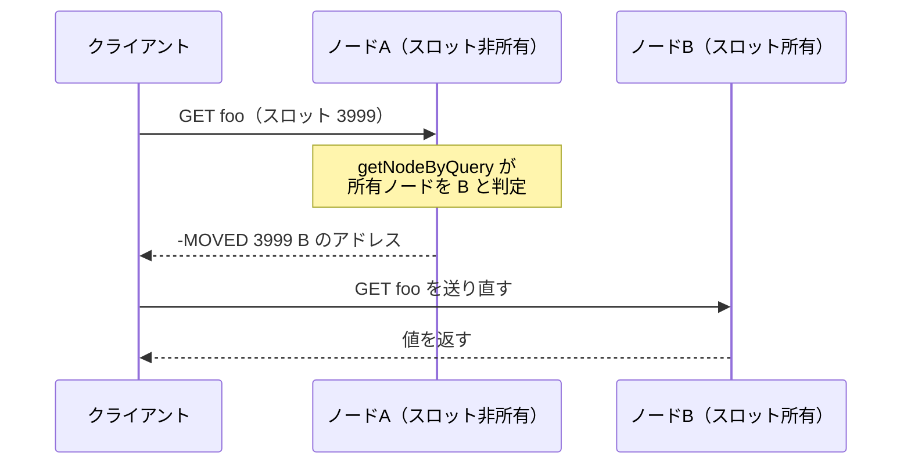
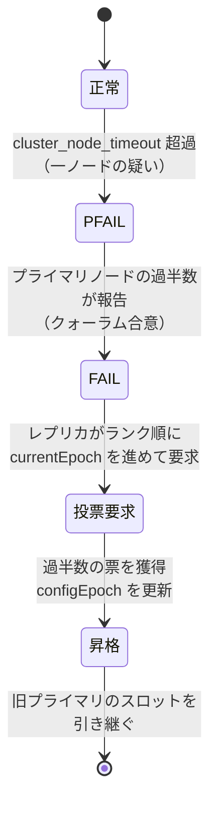

# 第39章 クラスタの仕組み

> **本章で読むソース**
>
> - [`src/cluster.h`](https://github.com/valkey-io/valkey/blob/9.1.0/src/cluster.h)
> - [`src/cluster.c`](https://github.com/valkey-io/valkey/blob/9.1.0/src/cluster.c)
> - [`src/cluster_legacy.c`](https://github.com/valkey-io/valkey/blob/9.1.0/src/cluster_legacy.c)
> - [`src/cluster_legacy.h`](https://github.com/valkey-io/valkey/blob/9.1.0/src/cluster_legacy.h)

## この章の狙い

Valkey クラスタは、中央のコーディネータを置かずに複数のノードへキー空間を分割し、ノードの故障に自律的に対処する。
本章では、キーがどのプライマリノードに割り当たるかを決める仕組み、担当外のノードに来た要求を正しいノードへ向け直すリダイレクト、ノードどうしが状態を伝え合うゴシッププロトコル、そして故障の検知から昇格までのフェイルオーバーを、それぞれ実コードで追う。

## 前提

- [第38章 レプリケーション](38-replication.md)（プライマリとレプリカの関係、複製オフセット）

## キー空間を 16384 のスロットに分ける

クラスタを構成する各ノードは、キー空間の全体ではなく一部だけを受け持つ。
その分割の単位が**ハッシュスロット**である。
Valkey はキー空間を固定数のスロットに分け、各スロットをちょうど一つのプライマリノードが所有する。

スロットの総数は `CLUSTER_SLOTS` として `16384` に固定されている。

[`src/cluster.h` L9-L10](https://github.com/valkey-io/valkey/blob/9.1.0/src/cluster.h#L9-L10)

```c
#define CLUSTER_SLOT_MASK_BITS 14                   /* Number of bits used for slot id. */
#define CLUSTER_SLOTS (1 << CLUSTER_SLOT_MASK_BITS) /* Total number of slots in cluster mode, which is 16384. */
```

スロット番号は 14 ビットで表せる範囲（0 から 16383）に収まる。
あるキーをどのスロットに写すかは `keyHashSlot` が決める。
キーの CRC16 を計算し、その下位 14 ビットだけを取り出す。

[`src/cluster.c` L58-L77](https://github.com/valkey-io/valkey/blob/9.1.0/src/cluster.c#L58-L77)

```c
unsigned int keyHashSlot(const char *key, int keylen) {
    int s, e; /* start-end indexes of { and } */

    for (s = 0; s < keylen; s++)
        if (key[s] == '{') break;

    /* No '{' ? Hash the whole key. This is the base case. */
    if (s == keylen) return crc16(key, keylen) & 0x3FFF;

    /* '{' found? Check if we have the corresponding '}'. */
    for (e = s + 1; e < keylen; e++)
        if (key[e] == '}') break;

    /* No '}' or nothing between {} ? Hash the whole key. */
    if (e == keylen || e == s + 1) return crc16(key, keylen) & 0x3FFF;

    /* If we are here there is both a { and a } on its right. Hash
     * what is in the middle between { and }. */
    return crc16(key + s + 1, e - s - 1) & 0x3FFF;
}
```

`& 0x3FFF` が下位 14 ビットの取り出しにあたり、結果は必ず 0 から 16383 になる。
基本の場合はキー全体をハッシュする。
ただしキーが `{...}` を含むときは、最初の `{` と次の `}` の間の文字列だけをハッシュ対象にする。
これが**ハッシュタグ**である。
`{user1000}.following` と `{user1000}.followers` はいずれも `user1000` だけがハッシュされるため、同じスロットに落ちる。
複数キーをまたぐコマンドを同一ノードで実行させたいときに使う。

この設計の核は、キーから担当ノードを引くまでが完全に決定論的である点にある。
クライアントもサーバも、外部の地図を引かずに、キーの文字列だけからスロット番号を計算できる。
スロットから所有ノードへの対応は、各ノードがメモリ上に持つ単純な配列で引ける。

[`src/cluster_legacy.h` L444](https://github.com/valkey-io/valkey/blob/9.1.0/src/cluster_legacy.h#L444)

```c
    clusterNode *slots[CLUSTER_SLOTS];
```

`clusterState` の `slots` は、スロット番号を添字に取って所有ノードへのポインタを返す長さ 16384 の配列である。
スロット番号からノードを引く `getNodeBySlot` は、この配列を一回参照するだけで済む。

[`src/cluster_legacy.c` L8376-L8378](https://github.com/valkey-io/valkey/blob/9.1.0/src/cluster_legacy.c#L8376-L8378)

```c
clusterNode *getNodeBySlot(int slot) {
    return server.cluster->slots[slot];
}
```

逆向きの「あるノードがどのスロットを持つか」は、ノード側のビットマップで表す。

[`src/cluster_legacy.h` L381](https://github.com/valkey-io/valkey/blob/9.1.0/src/cluster_legacy.h#L381)

```c
    unsigned char slots[CLUSTER_SLOTS / 8]; /* slots handled by this node */
```

`clusterNode` の `slots` は 16384 ビットを `16384 / 8 = 2048` バイトに詰めたビットマップで、所有するスロットの位置のビットだけが立つ。
スロットをノードに割り当てる `clusterAddSlot` は、この二つの表現を同時に更新する。

[`src/cluster_legacy.c` L6479-L6486](https://github.com/valkey-io/valkey/blob/9.1.0/src/cluster_legacy.c#L6479-L6486)

```c
int clusterAddSlot(clusterNode *n, int slot) {
    if (server.cluster->slots[slot]) return C_ERR;
    clusterNodeSetSlotBit(n, slot);
    server.cluster->slots[slot] = n;
    bitmapClearBit(server.cluster->owner_not_claiming_slot, slot);
    clusterSlotStatReset(slot);
    return C_OK;
}
```

スロットが未割り当てのときだけ受け付け、`clusterNodeSetSlotBit` でノード `n` のビットマップに該当ビットを立て、`server.cluster->slots[slot]` に所有者を記録する。
キー数ではなくスロット単位で所有を管理するため、再シャーディングのときも 16384 個の枠を付け替えるだけで済み、所有情報の量はクラスタ規模やキー数に依存しない。

```mermaid
flowchart LR
    K["キー \"{user1000}.following\""] -->|ハッシュタグ抽出| T["user1000"]
    T -->|crc16| C["CRC16 値"]
    C -->|"& 0x3FFF（下位14ビット）"| S["スロット番号 0..16383"]
    S -->|"slots[slot]"| N["担当のプライマリノード"]
```

## 担当外のノードに来た要求を向け直す

クライアントは任意のノードに接続してよい。
接続先がそのキーのスロットを所有していなければ、所有ノードへ案内する必要がある。
この判定を一手に引き受けるのが `getNodeByQuery` である。

呼び出し側はあらかじめコマンドの対象スロットを `c->slot` に計算しておく。

[`src/cluster.c` L1049-L1101](https://github.com/valkey-io/valkey/blob/9.1.0/src/cluster.c#L1049-L1101)

```c
clusterNode *getNodeByQuery(client *c, int *error_code) {
    clusterNode *myself = getMyClusterNode();
    clusterNode *n = NULL;
    // ... (中略) ...
    /* No key at all in command? then we can serve the request
     * without redirections or errors in all the cases. */
    if (c->slot == -1) return myself;

    n = getNodeBySlot(c->slot);

    /* If a slot is not served, we are in "cluster down" state.
     * This check is done early to preserve historical behavior. */
    if (n == NULL) {
        if (error_code) *error_code = CLUSTER_REDIR_DOWN_UNBOUND;
        return NULL;
    }
```

スロットからノードを引き、所有ノードが見つからなければクラスタは「down」状態にあると判断する。
所有ノードが自分でなければ、関数の末尾でリダイレクトを指示する。

[`src/cluster.c` L1302-L1306](https://github.com/valkey-io/valkey/blob/9.1.0/src/cluster.c#L1302-L1306)

```c
    /* Base case: just return the right node. However, if this node is not
     * myself, set error_code to MOVED since we need to issue a redirection. */
    if (n != myself && error_code) *error_code = CLUSTER_REDIR_MOVED;
    return n;
}
```

所有ノードが自分以外なら `error_code` に `CLUSTER_REDIR_MOVED` を設定して、そのノードを返す。
スロットの移行が進行中の場合は事情が異なる。
移行元がまだ持っていないキーへの要求は、移行先を指す一時的な案内に切り替わる。

[`src/cluster.c` L1266-L1277](https://github.com/valkey-io/valkey/blob/9.1.0/src/cluster.c#L1266-L1277)

```c
    /* If we don't have all the keys and we are migrating the slot, send
     * an ASK redirection or TRYAGAIN. */
    if (migrating_slot && missing_keys) {
        /* If we have keys but we don't have all keys, we return TRYAGAIN */
        if (existing_keys) {
            if (error_code) *error_code = CLUSTER_REDIR_UNSTABLE;
            return NULL;
        } else {
            if (error_code) *error_code = CLUSTER_REDIR_ASK;
            return getMigratingSlotDest(c->slot);
        }
    }
```

スロットを移行中で、要求されたキーを自分が持っていなければ、`CLUSTER_REDIR_ASK` を立てて移行先ノードを返す。
ここで `MOVED` と `ASK` の性質の差が現れる。
`MOVED` はスロットの所有が確定的に別ノードへ移ったことを意味し、クライアントは以後そのスロットの宛先を更新してよい。
`ASK` は移行が完了するまでの一時的な迂回であり、その一回の要求だけを別ノードへ向け、スロットの宛先は更新しない。

実際にクライアントへ返すエラー文字列は `clusterRedirectClient` が組み立てる。

[`src/cluster.c` L1329-L1334](https://github.com/valkey-io/valkey/blob/9.1.0/src/cluster.c#L1329-L1334)

```c
    } else if (error_code == CLUSTER_REDIR_MOVED || error_code == CLUSTER_REDIR_ASK) {
        /* Report TLS ports to TLS client, and report non-TLS port to non-TLS client. */
        int port = clusterNodeClientPort(n, shouldReturnTlsInfo(), c);
        addReplyErrorSds(c,
                         sdscatprintf(sdsempty(), "-%s %d %s:%d", (error_code == CLUSTER_REDIR_ASK) ? "ASK" : "MOVED",
                                      hashslot, clusterNodePreferredEndpoint(n, c), port));
```

返答は `-MOVED 3999 127.0.0.1:6381` のような形になり、スロット番号と宛先ノードの接続先を含む。
クライアントはこの案内を読んで、同じ要求を指定されたノードへ送り直す。



スロットの移行そのものの手順（`MIGRATE`、`CLUSTER SETSLOT`、アトミックなスロット移行）は[第40章 スロット移行](40-slot-migration.md)で扱う。

## ゴシップで構成情報を収束させる

スロットの所有とノードの生死は、クラスタ全体で共有されていなければならない。
Valkey はこの共有を中央のレジストリではなく、ノードどうしの定期的なメッセージ交換でまかなう。
各ノードは通常のクライアント用ポートとは別に**クラスタバス**のポートを開き、そこで ping と pong をやり取りする。
バスのポートは明示指定がなければクライアントポートに固定値を足したものになる。

[`src/cluster_legacy.h` L5](https://github.com/valkey-io/valkey/blob/9.1.0/src/cluster_legacy.h#L5)

```c
#define CLUSTER_PORT_INCR 10000 /* Cluster port = baseport + PORT_INCR */
```

クライアントが 6379 番なら、バスは既定で 16379 番になる。
ping/pong の発信は `clusterCron` が担う。
この関数は周期的に呼ばれ、呼ばれた回数を `iteration` で数える。

[`src/cluster_legacy.c` L6151-L6161](https://github.com/valkey-io/valkey/blob/9.1.0/src/cluster_legacy.c#L6151-L6161)

```c
void clusterCron(void) {
    dictIterator *di;
    dictEntry *de;
    int update_state = 0;
    int orphaned_primaries; /* How many primaries there are without ok replicas. */
    int max_replicas;       /* Max number of ok replicas for a single primary. */
    int this_replicas;      /* Number of ok replicas for our primary (if we are replica). */
    mstime_t min_pong = 0, now = mstime();
    clusterNode *min_pong_node = NULL;
    static unsigned long long iteration = 0;
    iteration++; /* Number of times this function was called so far. */
```

`clusterCron` は 100 ミリ秒ごとに呼ばれる[^cron]。
ただし ping を全ノードへ毎回送るわけではない。
10 回に 1 回、つまりおよそ毎秒一回だけ、ランダムに選んだ少数のノードの中から最も古い pong を持つ相手を一つだけ選んで ping する。

[`src/cluster_legacy.c` L6185-L6208](https://github.com/valkey-io/valkey/blob/9.1.0/src/cluster_legacy.c#L6185-L6208)

```c
    /* Ping some random node 1 time every 10 iterations, so that we usually ping
     * one random node every second. */
    if (!server.debug_cluster_disable_random_ping && !(iteration % 10)) {
        int j;

        /* Check a few random nodes and ping the one with the oldest
         * pong_received time. */
        for (j = 0; j < 5; j++) {
            de = dictGetRandomKey(server.cluster->nodes);
            clusterNode *this = dictGetVal(de);

            /* Don't ping nodes disconnected or with a ping currently active. */
            if (this->link == NULL || this->ping_sent != 0) continue;
            if (this->flags & (CLUSTER_NODE_MYSELF | CLUSTER_NODE_HANDSHAKE)) continue;
            if (min_pong_node == NULL || min_pong > this->pong_received) {
                min_pong_node = this;
                min_pong = this->pong_received;
            }
        }
        if (min_pong_node) {
            serverLog(LL_DEBUG, "Pinging node %.40s (%s)", min_pong_node->name, humanNodename(min_pong_node));
            clusterSendPing(min_pong_node->link, CLUSTERMSG_TYPE_PING);
        }
    }
```

ランダムに 5 ノードを覗き、その中で最も長く pong が返っていないノードを優先して ping する。
全ノードへ総当たりで ping するとノード数の二乗に比例した通信量になるが、この確率的なサンプリングなら一ノードあたりの送信は規模に対して一定に近く保たれる。

肝心の状態伝播は ping/pong の本体ではなく、メッセージに同梱される**ゴシップセクション**で起こる。
ping を送る `clusterSendPing` は、自分が知っている他ノードの情報をメッセージの末尾に何件か詰める。
詰める件数は全ノード数のおよそ 1 割に決める。

[`src/cluster_legacy.c` L4858-L4864](https://github.com/valkey-io/valkey/blob/9.1.0/src/cluster_legacy.c#L4858-L4864)

```c
    wanted = (dictSize(server.cluster->nodes) * server.cluster_message_gossip_perc / 100);
    if (wanted < 3) wanted = 3;
    if (wanted > freshnodes) wanted = freshnodes;

    /* Include all the nodes in PFAIL state, so that failure reports are
     * faster to propagate to go from PFAIL to FAIL state. */
    int pfail_wanted = server.cluster->stats_pfail_nodes;
```

`wanted` は全ノード数に `cluster_message_gossip_perc`（既定で 10）を掛けた値で、下限は 3、上限は自分と送信先を除いたノード数になる。
一通のメッセージが運ぶのは全体のごく一部だが、各ノードが毎秒ランダムな相手と交換を続けることで、ある変化は数回の往復で全体に行き渡る。
故障の疑いがあるノード（後述の PFAIL）は別枠で必ず同梱し、疑いの報告だけは速く広げる。

受信側は `clusterProcessGossipSection` でゴシップを取り込む。
他ノードから見た pong 受信時刻が自分の記録より新しければ、それを採用する。

[`src/cluster_legacy.c` L2823-L2841](https://github.com/valkey-io/valkey/blob/9.1.0/src/cluster_legacy.c#L2823-L2841)

```c
            /* If from our POV the node is up (no failure flags are set),
             * we have no pending ping for the node, nor we have failure
             * reports for this node, update the last pong time with the
             * one we see from the other nodes. */
            if (!(flags & (CLUSTER_NODE_FAIL | CLUSTER_NODE_PFAIL)) &&
                nodeInNormalState(node) &&
                node->ping_sent == 0 &&
                clusterNodeFailureReportsCount(node) == 0) {
                mstime_t pongtime = ntohl(g->pong_received);
                pongtime *= 1000; /* Convert back to milliseconds. */

                /* Replace the pong time with the received one only if
                 * it's greater than our view but is not in the future
                 * (with 500 milliseconds tolerance) from the POV of our
                 * clock. */
                if (pongtime <= (server.mstime + 500) && pongtime > node->pong_received) {
                    node->pong_received = pongtime;
                }
            }
```

自分が正常とみなしているノードについては、ゴシップ経由で得た新しい pong 時刻を取り込んで生存情報を更新する。
これにより、自分が直接 ping していないノードの生死も、他ノードを介して間接的に把握できる。

## 故障の検知とフェイルオーバー

ノードの故障判定は二段階で進む。
まず各ノードが単独で「疑い」を立て、次にクラスタの合意で「確定」させる。

第一段階の疑いは `clusterCron` の中で立つ。
自分が送った ping への pong も、その他の受信データも一定時間途絶えたノードに、`CLUSTER_NODE_PFAIL` フラグを立てる。

[`src/cluster_legacy.c` L6287-L6299](https://github.com/valkey-io/valkey/blob/9.1.0/src/cluster_legacy.c#L6287-L6299)

```c
        mstime_t node_delay = (ping_delay < data_delay) ? ping_delay : data_delay;

        if (node_delay > server.cluster_node_timeout) {
            /* Timeout reached. Set the node as possibly failing if it is
             * not already in this state. */
            if (!(node->flags & (CLUSTER_NODE_PFAIL | CLUSTER_NODE_FAIL))) {
                node->flags |= CLUSTER_NODE_PFAIL;
                update_state = 1;
                if (clusterNodeIsVotingPrimary(myself)) {
                    markNodeAsFailingIfNeeded(node);
                } else {
                    serverLog(LL_NOTICE, "NODE %.40s (%s) possibly failing.", node->name, humanNodename(node));
                }
```

無応答の時間が `cluster_node_timeout` を超えると `CLUSTER_NODE_PFAIL`（possible failure、疑い）が立つ。
PFAIL はあくまで一ノードの主観であり、これだけではフェイルオーバーは起きない。

第二段階は合意である。
各ノードはゴシップで自分の PFAIL 報告を広め、受信側は誰が誰を疑っているかを記録する。
`markNodeAsFailingIfNeeded` が、ある対象への PFAIL 報告が投票権を持つプライマリノードの過半数に達したかを判定する。

[`src/cluster_legacy.c` L2582-L2605](https://github.com/valkey-io/valkey/blob/9.1.0/src/cluster_legacy.c#L2582-L2605)

```c
void markNodeAsFailingIfNeeded(clusterNode *node) {
    int failures;
    int needed_quorum = (server.cluster->size / 2) + 1;

    if (!nodeTimedOut(node)) return; /* We can reach it. */
    if (nodeFailed(node)) return;    /* Already FAILing. */

    failures = clusterNodeFailureReportsCount(node);
    /* Also count myself as a voter if I'm a voting primary. */
    if (clusterNodeIsVotingPrimary(myself)) failures++;
    if (failures < needed_quorum) return; /* No weak agreement from primaries. */

    serverLog(LL_NOTICE, "Marking node %.40s (%s) as failing (quorum reached).", node->name, humanNodename(node));

    /* Mark the node as failing. */
    markNodeAsFailing(node);

    /* Broadcast the failing node name to everybody, forcing all the other
     * reachable nodes to flag the node as FAIL.
     * We do that even if this node is a replica and not a primary: anyway
     * the failing state is triggered collecting failure reports from primaries,
     * so here the replica is only helping propagating this status. */
    clusterSendFail(node->name);
}
```

`needed_quorum` はプライマリノードの過半数（`size / 2 + 1`）であり、報告数がこれに達すると `markNodeAsFailing` で `CLUSTER_NODE_FAIL` を立て、`clusterSendFail` で確定を全体に通知する。
過半数の合意を要求することで、一部のノードからしか見えない一時的な不通でフェイルオーバーが暴発するのを防ぐ。

プライマリノードが FAIL になると、そのレプリカが昇格に動く。
昇格を駆動するのは `clusterHandleReplicaFailover` である[^rename]。
前提条件として、自分がレプリカであり、複製元のプライマリが FAIL になっていることなどを確認する。

[`src/cluster_legacy.c` L5606-L5612](https://github.com/valkey-io/valkey/blob/9.1.0/src/cluster_legacy.c#L5606-L5612)

```c
void clusterHandleReplicaFailover(void) {
    mstime_t now = mstime();
    mstime_t data_age;
    mstime_t auth_age = now - server.cluster->failover_auth_time;
    int needed_quorum = (server.cluster->size / 2) + 1;
    int manual_failover = server.cluster->mf_end != 0 && server.cluster->mf_can_start;
    mstime_t auth_timeout, auth_retry_time;
```

レプリカはすぐに投票を要求するのではなく、開始時刻 `failover_auth_time` に遅延を入れる。
遅延は固定分とランダム分に加えて、自分の**ランク**に比例した分を持つ。

[`src/cluster_legacy.c` L5680-L5684](https://github.com/valkey-io/valkey/blob/9.1.0/src/cluster_legacy.c#L5680-L5684)

```c
        server.cluster->failover_auth_rank = clusterGetReplicaRank();
        /* We add another delay that is proportional to the replica rank.
         * By default, 1 second * rank. This way replicas that have a probably
         * less updated replication offset, are penalized. */
        server.cluster->failover_auth_time += server.cluster->failover_auth_rank * (delay * 2);
```

ランク（`clusterGetReplicaRank`）は、自分より新しい複製オフセットを持つレプリカの数で決まる。
最も新しいデータを持つレプリカがランク 0 で遅延が最小になり、最初に投票を要求できる。
遅れたレプリカほど開始が後ろにずれるため、できるだけデータの新しいレプリカが主に昇格しやすくなる。

遅延が明けると、選挙の世代である `currentEpoch` を進めて投票を要求する。

[`src/cluster_legacy.c` L5786-L5796](https://github.com/valkey-io/valkey/blob/9.1.0/src/cluster_legacy.c#L5786-L5796)

```c
    /* Ask for votes if needed. */
    if (server.cluster->failover_auth_sent == 0) {
        server.cluster->currentEpoch++;
        server.cluster->failover_auth_epoch = server.cluster->currentEpoch;
        serverLog(LL_NOTICE, "Starting a failover election for epoch %llu, node config epoch is %llu",
                  (unsigned long long)server.cluster->currentEpoch, (unsigned long long)nodeEpoch(myself));
        clusterRequestFailoverAuth();
        server.cluster->failover_auth_sent = 1;
        clusterDoBeforeSleep(CLUSTER_TODO_SAVE_CONFIG | CLUSTER_TODO_UPDATE_STATE | CLUSTER_TODO_FSYNC_CONFIG);
        return; /* Wait for replies. */
    }
```

`clusterRequestFailoverAuth` が全プライマリノードへ投票要求を一斉に送る。
要求を受けたプライマリノードは `clusterSendFailoverAuthIfNeeded` で投票の可否を判断する。
鍵となるのは、一つの世代では一票しか投じないという制約である。

[`src/cluster_legacy.c` L5320-L5325](https://github.com/valkey-io/valkey/blob/9.1.0/src/cluster_legacy.c#L5320-L5325)

```c
    /* I already voted for this epoch? Return ASAP. */
    if (server.cluster->lastVoteEpoch == server.cluster->currentEpoch) {
        serverLog(LL_WARNING, "Failover auth denied to %.40s (%s): already voted for epoch %llu", node->name,
                  humanNodename(node), (unsigned long long)server.cluster->currentEpoch);
        return;
    }
```

同じ `currentEpoch` ですでに投票済みなら棄権する。
これにより、一つの世代で過半数の票を得られるレプリカは高々一つに限られ、複数のレプリカが同時に昇格することを防ぐ。
条件を満たせば票を返す。

[`src/cluster_legacy.c` L5379-L5384](https://github.com/valkey-io/valkey/blob/9.1.0/src/cluster_legacy.c#L5379-L5384)

```c
    /* We can vote for this replica. */
    server.cluster->lastVoteEpoch = server.cluster->currentEpoch;
    clusterDoBeforeSleep(CLUSTER_TODO_SAVE_CONFIG | CLUSTER_TODO_FSYNC_CONFIG);
    clusterSendFailoverAuth(node);
    serverLog(LL_NOTICE, "Failover auth granted to %.40s (%s) for epoch %llu", node->name, humanNodename(node),
              (unsigned long long)server.cluster->currentEpoch);
```

`lastVoteEpoch` を現在の世代に更新してから `clusterSendFailoverAuth` で票（ACK）を返す。
要求元のレプリカは届いた票を数える。

[`src/cluster_legacy.c` L4417-L4422](https://github.com/valkey-io/valkey/blob/9.1.0/src/cluster_legacy.c#L4417-L4422)

```c
        if (clusterNodeIsVotingPrimary(sender) && sender_claimed_current_epoch >= server.cluster->failover_auth_epoch) {
            server.cluster->failover_auth_count++;
            /* Maybe we reached a quorum here, set a flag to make sure
             * we check ASAP. */
            clusterDoBeforeSleep(CLUSTER_TODO_HANDLE_FAILOVER);
        }
```

票を投じたのが投票権を持つプライマリノードで、その世代が自分の選挙世代以上であれば `failover_auth_count` を増やす。
集めた票が過半数に達したかは、再び `clusterHandleReplicaFailover` が確かめる。

[`src/cluster_legacy.c` L5798-L5817](https://github.com/valkey-io/valkey/blob/9.1.0/src/cluster_legacy.c#L5798-L5817)

```c
    /* Check if we reached the quorum. */
    if (server.cluster->failover_auth_count >= needed_quorum) {
        /* We have the quorum, we can finally failover the primary. */

        serverLog(LL_NOTICE, "Failover election won: I'm the new primary.");

        /* Update my configEpoch to the epoch of the election. */
        if (myself->configEpoch < server.cluster->failover_auth_epoch) {
            myself->configEpoch = server.cluster->failover_auth_epoch;
            clusterDoBeforeSleep(CLUSTER_TODO_SAVE_CONFIG | CLUSTER_TODO_FSYNC_CONFIG | CLUSTER_TODO_BROADCAST_ALL);
            serverLog(LL_NOTICE, "configEpoch set to %llu after successful failover",
                      (unsigned long long)myself->configEpoch);
        }

        /* Take responsibility for the cluster slots. */
        clusterFailoverReplaceYourPrimary();
    } else {
        clusterLogCantFailover(CLUSTER_CANT_FAILOVER_WAITING_VOTES);
    }
}
```

票が `needed_quorum`（プライマリノードの過半数）に達すると選挙に勝利する。
自分の `configEpoch` を選挙世代に引き上げ、`clusterFailoverReplaceYourPrimary` で旧プライマリのスロットを引き継いで主に昇格する。
`configEpoch` を最新にしておくことで、同じスロットを古い構成で主張するノードが現れても、世代の大きい方を正とする規則で衝突を解消できる。
更新された構成はゴシップを通じてクラスタ全体へ広まり、クライアントは新しいプライマリへの `MOVED` 案内を受けて宛先を切り替える。



プライマリとレプリカの複製関係そのもの（複製オフセット、部分再同期）は[第38章 レプリケーション](38-replication.md)で扱う。
レプリカを持たない単一構成での障害監視（Sentinel）は[第41章 Sentinel](41-sentinel.md)で扱う。

## まとめ

- キー空間は 16384 個のハッシュスロットに分かれ、各スロットを一つのプライマリノードが所有する。`keyHashSlot` は CRC16 の下位 14 ビットでキーをスロットへ写し、`{}` のハッシュタグで対象を絞れる。
- スロットからノードへの対応は長さ 16384 の配列、ノードから所有スロットへの対応は 2048 バイトのビットマップで持つ。所有情報の量はキー数に依存しない。
- 担当外ノードへの要求は `getNodeByQuery` が判定し、確定的な移動には `MOVED`、移行中の一時的な迂回には `ASK` を返す。
- ノードはクラスタバスの別ポートで毎秒ランダムな相手と ping/pong を交換し、ゴシップセクションに約 1 割のノード情報を載せて状態を伝える。総当たりを避けることで通信量を規模に対して抑える。
- 故障は二段階で確定する。各ノードが `cluster_node_timeout` 超過で PFAIL を立て、プライマリノードの過半数の合意で FAIL に昇格する。
- プライマリの FAIL を受けてレプリカが昇格する。データの新しいレプリカほど早く投票を要求し、一世代一票の制約のもとで過半数の票を得た一つだけが主になる。

## 関連する章

- [第38章 レプリケーション](38-replication.md)
- [第40章 スロット移行](40-slot-migration.md)
- [第41章 Sentinel](41-sentinel.md)

[^cron]: `clusterCron` は `serverCron` から `CLUSTER_CRON_PERIOD_MS`（100 ミリ秒）周期で呼ばれる。
[^rename]: この関数は以前のバージョンでは `clusterHandleSlaveFailover` という名前だったが、Valkey では用語を `replica` に統一する方針に伴って `clusterHandleReplicaFailover` に改名されている。
