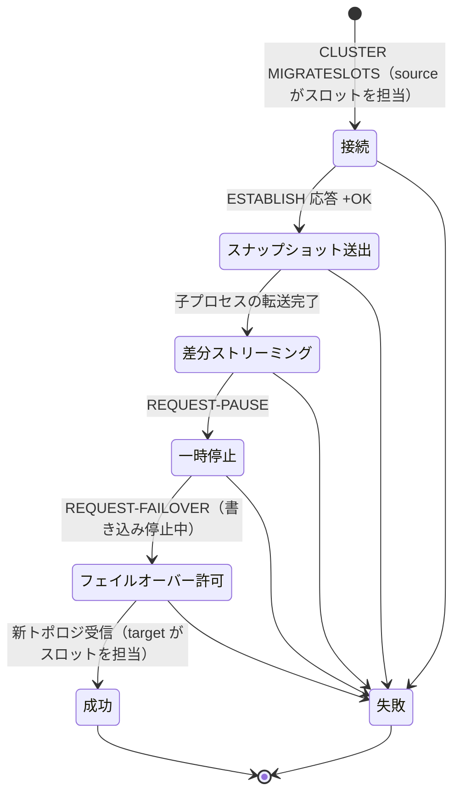

# 第40章 アトミックスロット移行

> **本章で読むソース**
>
> - [`design-docs/atomic-slot-migration.md`](https://github.com/valkey-io/valkey/blob/9.1.0/design-docs/atomic-slot-migration.md)
> - [`src/cluster_migrateslots.c`](https://github.com/valkey-io/valkey/blob/9.1.0/src/cluster_migrateslots.c)
> - [`src/cluster_slot_stats.c`](https://github.com/valkey-io/valkey/blob/9.1.0/src/cluster_slot_stats.c)
> - [`src/cluster_legacy.c`](https://github.com/valkey-io/valkey/blob/9.1.0/src/cluster_legacy.c)

## この章の狙い

あるスロット群を、ある primary ノードから別のノードへ移し替えるとき、クラスタ全体から見て一貫した形で所有権を切り替える仕組みを理解する。
移行中もクライアントから見たデータの整合性が保たれること、所有権の切替が一瞬で原子的に起こることを、`cluster_migrateslots.c` の状態機械に対応づけて読む。
あわせて、スロット単位の統計が移行や負荷分散の判断材料になることを確認する。

## 前提

クラスタ全体の構成とハッシュスロットの考え方は[第39章](39-cluster.md)で扱う。
スナップショットと差分の転送は primary-replica レプリケーションの仕組みを下敷きにしており、その基礎は[第38章](38-replication.md)にある。

## アトミックスロット移行が解く問題

**アトミックスロット移行**（Atomic Slot Migration、以下 ASM）は、ハッシュスロットをノード間で移すための機能である。
design-docs によれば、ASM はキーを1個ずつ移す代わりにスロット単位で動作し、既存のレプリケーションとフェイルオーバーの基本要素を転用する（[`design-docs/atomic-slot-migration.md` L10-L24](https://github.com/valkey-io/valkey/blob/9.1.0/design-docs/atomic-slot-migration.md#L10-L24)）。
物理的なデータ転送は primary-replica レプリケーションの仕組みを借りつつ、移動対象のスロットだけに範囲を絞る。
所有権の最終的な引き渡しは手動フェイルオーバーに似た協調手順で実行し、原子的な移転を保証する。

この設計の核心は、移行中の担当ノードの扱いにある。
design-docs によれば、移行の全期間を通じて source ノードがデータを保持し、業務リクエストに応え続ける（[`design-docs/atomic-slot-migration.md` L20-L24](https://github.com/valkey-io/valkey/blob/9.1.0/design-docs/atomic-slot-migration.md#L20-L24)）。
原子的な移転が完了した後にのみ、トラフィックを target ノードへ切り替える。
つまり、スロットを担当するノードはどの瞬間でも一意に定まり、切替は不可分な一点で起こる。

これは旧来の方式とは別の位置づけにある。
従来の `CLUSTER SETSLOT <slot> IMPORTING`、`CLUSTER SETSLOT <slot> MIGRATING`、`MIGRATE` を使う移行は、コマンド `cluster_legacy.c` の `SETSLOT` サブコマンドに残っている（[`src/cluster_legacy.c` L7661-L7681](https://github.com/valkey-io/valkey/blob/9.1.0/src/cluster_legacy.c#L7661-L7681)）。
ASM はこのキー単位の移行に代わるものとして設計された（[`design-docs/atomic-slot-migration.md` L5-L8](https://github.com/valkey-io/valkey/blob/9.1.0/design-docs/atomic-slot-migration.md#L5-L8)）。
ASM 自身も、旧来の手動 IMPORTING/MIGRATING がスロットに設定されている間は開始を拒む。
`validateSlotMigrationCanStartOrReply` が `isAnySlotInManualImportingState` と `isAnySlotInManualMigratingState` を確認し、いずれかが真なら移行を始めない（[`src/cluster_migrateslots.c` L507-L525](https://github.com/valkey-io/valkey/blob/9.1.0/src/cluster_migrateslots.c#L507-L525)）。

## 移行を表す状態とジョブ

移行の片端ごとに、`slotMigrationJob` という構造体が一つ作られる。
ジョブは export（source 側）または import（target 側）のどちらかの型を持ち、`CLUSTER MIGRATESLOTS` の実行中だけ存在する（[`src/cluster_migrateslots.c` L44-L47](https://github.com/valkey-io/valkey/blob/9.1.0/src/cluster_migrateslots.c#L44-L47)）。

```c
typedef enum slotMigrationJobType {
    SLOT_MIGRATION_EXPORT,
    SLOT_MIGRATION_IMPORT,
} slotMigrationJobType;
```

ジョブの現在位置は `slotMigrationJobState` 列挙で表す。
import 側、export 側、終端の三群に分かれており、移行はこの状態を一段ずつ進めることで前進する（[`src/cluster_migrateslots.c` L15-L42](https://github.com/valkey-io/valkey/blob/9.1.0/src/cluster_migrateslots.c#L15-L42)）。

```c
typedef enum slotMigrationJobState {
    /* Importing states */
    SLOT_IMPORT_WAIT_ACK,
    SLOT_IMPORT_RECEIVE_SNAPSHOT,
    SLOT_IMPORT_WAITING_FOR_PAUSED,
    SLOT_IMPORT_FAILOVER_REQUESTED,
    SLOT_IMPORT_FAILOVER_GRANTED,
    // ... (中略) ...
    /* Exporting states */
    SLOT_EXPORT_CONNECTING,
    // ... (中略) ...
    SLOT_EXPORT_STREAMING,
    SLOT_EXPORT_WAITING_TO_PAUSE,
    SLOT_EXPORT_FAILOVER_PAUSED,
    SLOT_EXPORT_FAILOVER_GRANTED,
    /* Terminal states */
    SLOT_MIGRATION_JOB_FAILED,
    SLOT_MIGRATION_JOB_CANCELLED,
    SLOT_MIGRATION_JOB_SUCCESS,
} slotMigrationJobState;
```

状態機械の本体は `proceedWithSlotMigration` である。
この関数は現在状態を `switch` で分岐し、進められるだけ進めてはイベントを待つために `return` する（[`src/cluster_migrateslots.c` L1957-L1960](https://github.com/valkey-io/valkey/blob/9.1.0/src/cluster_migrateslots.c#L1957-L1960)）。

```c
void proceedWithSlotMigration(slotMigrationJob *job) {
    /* Continue within the state machine until we have no more work. */
    while (1) {
        switch (job->state) {
```

この関数は二つの経路から呼ばれる。
一つは `CLUSTER MIGRATESLOTS` の処理が export ジョブを作った直後である（[`src/cluster_migrateslots.c` L1240-L1241](https://github.com/valkey-io/valkey/blob/9.1.0/src/cluster_migrateslots.c#L1240-L1241)）。
もう一つは定期処理 `clusterSlotMigrationCron` で、すべてのジョブを巡回して状態を前進させる（[`src/cluster_migrateslots.c` L2524](https://github.com/valkey-io/valkey/blob/9.1.0/src/cluster_migrateslots.c#L2524)）。

## 段階ごとの担当ノードと切替

移行は開始、転送、切替、完了の四段階で進む。
design-docs はこの流れを五項目に整理している（[`design-docs/atomic-slot-migration.md` L28-L52](https://github.com/valkey-io/valkey/blob/9.1.0/design-docs/atomic-slot-migration.md#L28-L52)）。
以下では source 側の export 状態を軸に、各段階でどちらが担当するかを追う。



### 開始とスナップショット転送

source は target へ接続し、`CLUSTER SYNCSLOTS ESTABLISH` を送って移行を申し込む。
target 側ではこのコマンドが import ジョブを生成し、対象スロットを kvstore 上で「インポート中」と印付けする（[`src/cluster_migrateslots.c` L630-L632](https://github.com/valkey-io/valkey/blob/9.1.0/src/cluster_migrateslots.c#L630-L632)、[`src/cluster_migrateslots.c` L802-L803](https://github.com/valkey-io/valkey/blob/9.1.0/src/cluster_migrateslots.c#L802-L803)）。

target が `+OK` を返すと、source は ESTABLISH の応答を読んで `SLOT_EXPORT_WAITING_TO_SNAPSHOT` へ進み、最初の `ACK` を送る（[`src/cluster_migrateslots.c` L1933-L1939](https://github.com/valkey-io/valkey/blob/9.1.0/src/cluster_migrateslots.c#L1933-L1939)）。

design-docs によれば、source は子プロセスを fork し、スロットのキーを走査して直列化する（[`design-docs/atomic-slot-migration.md` L30-L36](https://github.com/valkey-io/valkey/blob/9.1.0/design-docs/atomic-slot-migration.md#L30-L36)）。
転送は AOF 形式、すなわちコマンドの並びとして行う。
target の primary と replica はこのコマンド列を再生してスロットの状態を復元する。

実装では、状態が `SLOT_EXPORT_WAITING_TO_SNAPSHOT` のとき、他の子プロセスがなく出力バッファに保留中の書き込みがないことを確認してからスナップショットを開始する（[`src/cluster_migrateslots.c` L2042-L2076](https://github.com/valkey-io/valkey/blob/9.1.0/src/cluster_migrateslots.c#L2042-L2076)）。
子プロセスの中身は `childSnapshotForSyncSlot` で、対象スロット範囲のキーだけを AOF として書き出し、末尾に `CLUSTER SYNCSLOTS SNAPSHOT-EOF` を付ける（[`src/cluster_migrateslots.c` L1557-L1577](https://github.com/valkey-io/valkey/blob/9.1.0/src/cluster_migrateslots.c#L1557-L1577)）。

```c
int childSnapshotForSyncSlot(rio *aof, slotMigrationJob *job) {
    list *slot_ranges = job->slot_ranges;
    size_t key_count = 0;
    for (int db_num = 0; db_num < server.dbnum; db_num++) {
        // ... (中略) ...
            for (int slot = r->start_slot; slot <= r->end_slot; slot++) {
                if (rewriteSlotToAppendOnlyFileRio(
                        aof, db_num, slot, &key_count) == C_ERR) return C_ERR;
            }
        // ... (中略) ...
    }
    rioWrite(aof, "*3\r\n", 4);
    rioWriteBulkString(aof, "CLUSTER", 7);
    rioWriteBulkString(aof, "SYNCSLOTS", 9);
    rioWriteBulkString(aof, "SNAPSHOT-EOF", 12);
    return C_OK;
}
```

この段階では source がスロットを担当し続ける。
スナップショットの一貫したコピーは fork した子プロセスがコピーオンライトのメモリ上で作るため、親プロセスは業務リクエストへの応答を止めずに済む。
これが、移行中もクライアントから見た整合性が保たれる第一の理由である。

### 差分の追記とインクリメンタル更新

design-docs によれば、初期スナップショットを転送している間も source は業務リクエストに応え続け、その間にスロットのキーへ加わった変更を記録し、スナップショット転送の完了後に差分として target へ送る（[`design-docs/atomic-slot-migration.md` L38-L41](https://github.com/valkey-io/valkey/blob/9.1.0/design-docs/atomic-slot-migration.md#L38-L41)）。

実装では、スナップショット中に対象スロットへ書き込みが起きると、レプリケーションのコマンド列が `clusterFeedSlotExportJobs` を通って export ジョブのクライアント出力バッファに積まれる（[`src/cluster_migrateslots.c` L1725-L1759](https://github.com/valkey-io/valkey/blob/9.1.0/src/cluster_migrateslots.c#L1725-L1759)）。
このバッファは、子プロセスがスナップショットを送り終えてストリーミング状態に入るまでフラッシュを保留する。
保留の判定は `clusterSlotMigrationShouldInstallWriteHandler` が `SLOT_EXPORT_SNAPSHOTTING` の間だけ書き込みハンドラの設置を見送ることで行う（[`src/cluster_migrateslots.c` L1715-L1721](https://github.com/valkey-io/valkey/blob/9.1.0/src/cluster_migrateslots.c#L1715-L1721)）。
こうしてスナップショットの末尾と差分の先頭が連続するため、target は順番どおりに再生すれば source と同じ状態に到達できる。

target は `SNAPSHOT-EOF` を受け取ると、source へ `REQUEST-PAUSE` を返し、`SLOT_IMPORT_WAITING_FOR_PAUSED` へ進む（[`src/cluster_migrateslots.c` L648-L672](https://github.com/valkey-io/valkey/blob/9.1.0/src/cluster_migrateslots.c#L648-L672)）。
ここまで、スロットを担当するのは依然として source である。

### 書き込みの一時停止

design-docs によれば、差分を送り終えた source は移行中スロットへの書き込みを一時停止し、それらのスロットへの業務リクエストを以後拒む（[`design-docs/atomic-slot-migration.md` L42-L45](https://github.com/valkey-io/valkey/blob/9.1.0/design-docs/atomic-slot-migration.md#L42-L45)）。
この停止が、target を source と同じ状態に保つための要となる。

実装では、target からの `REQUEST-PAUSE` を受けて `slotExportTryDoPause` が走る。
未送出のレプリケーションデータが設定上限を超えていなければ書き込みを停止し、`PAUSE_DURING_SLOT_MIGRATION` を理由に `pauseActions` を呼ぶ（[`src/cluster_migrateslots.c` L1449-L1465](https://github.com/valkey-io/valkey/blob/9.1.0/src/cluster_migrateslots.c#L1449-L1465)）。

```c
int slotExportTryDoPause(slotMigrationJob *job) {
    serverAssert(job->type == SLOT_MIGRATION_EXPORT);

    if (server.debug_slot_migration_prevent_pause ||
        (server.slot_migration_max_failover_repl_bytes >= 0 &&
         job->client->reply_bytes > (size_t)server.slot_migration_max_failover_repl_bytes)) {
        return C_ERR;
    }
    // ... (中略) ...
    job->mf_end = mstime() + server.cluster_mf_timeout * CLUSTER_MF_PAUSE_MULT;
    pauseActions(PAUSE_DURING_SLOT_MIGRATION, job->mf_end,
                 PAUSE_ACTIONS_CLIENT_WRITE_SET);
    sendSyncSlotsMessage(job, "PAUSED");
    return C_OK;
}
```

停止に成功すると source は target へ `PAUSED` を送り、`SLOT_EXPORT_FAILOVER_PAUSED` へ進む。
未送出データが残って停止できないときは `SLOT_EXPORT_WAITING_TO_PAUSE` へ移り、バッファが捌けてから再試行する（[`src/cluster_migrateslots.c` L2084-L2088](https://github.com/valkey-io/valkey/blob/9.1.0/src/cluster_migrateslots.c#L2084-L2088)）。
target は `PAUSED` を読むと、その時点で source に追いついたとみなして `REQUEST-FAILOVER` を返す（[`src/cluster_migrateslots.c` L676-L695](https://github.com/valkey-io/valkey/blob/9.1.0/src/cluster_migrateslots.c#L676-L695)）。

### 原子的な切替

design-docs によれば、source が停止した後に target が takeover を行い、そのスロットの primary になる（[`design-docs/atomic-slot-migration.md` L46-L47](https://github.com/valkey-io/valkey/blob/9.1.0/design-docs/atomic-slot-migration.md#L46-L47)）。

切替の許可は source 側で握られている。
`clusterCommandSyncSlotsRequestFailover` は、自分がまだ停止中であることを最後にもう一度確認してから `FAILOVER-GRANTED` を返す（[`src/cluster_migrateslots.c` L1504-L1547](https://github.com/valkey-io/valkey/blob/9.1.0/src/cluster_migrateslots.c#L1504-L1547)）。
すでに停止が解けていれば許可を拒み、移行を失敗させる。
これにより、source が業務リクエストを再開しうる状態のまま target が所有権を主張することを防ぐ。

許可を受けた target は `SLOT_IMPORT_FAILOVER_GRANTED` へ進み、`performSlotImportJobFailover` で所有権を奪取する（[`src/cluster_migrateslots.c` L1974-L1984](https://github.com/valkey-io/valkey/blob/9.1.0/src/cluster_migrateslots.c#L1974-L1984)）。
この関数は config epoch を強制的に上げ、対象スロットを自分に割り当て直し、全ノードへトポロジ変更を伝える（[`src/cluster_migrateslots.c` L847-L872](https://github.com/valkey-io/valkey/blob/9.1.0/src/cluster_migrateslots.c#L847-L872)）。

```c
void performSlotImportJobFailover(slotMigrationJob *job) {
    serverAssert(job->type == SLOT_MIGRATION_IMPORT);
    /* 1) Force bump the epoch to facilitate propagation. */
    clusterBumpConfigEpochWithoutConsensus();

    /* 2) Claim all the slots in the slot migration job to myself. */
    // ... (中略) ...
        for (int i = range->start_slot; i <= range->end_slot; i++) {
            clusterDelSlot(i);
            clusterAddSlot(server.cluster->myself, i);
        }
    // ... (中略) ...

    /* 4) Pong all the other nodes so that they can update the state accordingly
     *    and detect that we have taken over the slots. */
    clusterDoBeforeSleep(CLUSTER_TODO_BROADCAST_ALL);
}
```

epoch を上げてからスロットを割り当てるため、クラスタの他ノードはより新しい構成として target の所有権を受け入れる。
所有権が target に移るのは、この epoch 更新とスロット割り当てが起こる一点である。
source が書き込みを止めている間に切替が完了するので、同じスロットを二つのノードが同時に担当する瞬間は生じない。

### 完了

design-docs によれば、target が primary になると、source はクラスタのトポロジ更新でその事実を知り、停止を解いて移行を完了する（[`design-docs/atomic-slot-migration.md` L48-L52](https://github.com/valkey-io/valkey/blob/9.1.0/design-docs/atomic-slot-migration.md#L48-L52)）。

実装では、`SLOT_EXPORT_FAILOVER_GRANTED` の source が `checkSlotExportOwnership` で所有権の移転を確認し、移転済みならジョブを成功で終える（[`src/cluster_migrateslots.c` L2100-L2139](https://github.com/valkey-io/valkey/blob/9.1.0/src/cluster_migrateslots.c#L2100-L2139)）。
新しいトポロジが時間内に届かないときは停止を解くが、そのとき後から自分の epoch が低いことが分かればスロットを失い、再開後に受け付けた書き込みが巻き戻る危険がある（[`src/cluster_migrateslots.c` L2100-L2128](https://github.com/valkey-io/valkey/blob/9.1.0/src/cluster_migrateslots.c#L2100-L2128)）。
このため source は、許可後しばらくは停止を維持してトポロジの伝播を待つ。

## キーの封じ込めとロールバック

移行中の整合性は、各ノードがどのスロットの読み書きを受け付けるかを厳密に制御することで保たれる。
design-docs によれば、あるスロットの primary でないノードでそのスロットのキー付きコマンドを実行すると `-MOVED` で拒否される（[`design-docs/atomic-slot-migration.md` L138-L145](https://github.com/valkey-io/valkey/blob/9.1.0/design-docs/atomic-slot-migration.md#L138-L145)）。
さらに `SCAN` や `KEYS` のようなキーを取らない読み取りは、インポート中スロットのデータを露出しないようフィルタされる。
target shard の各ノードは移行ジョブの状態を追い、移行が完了するまでそのスロットへの書き込みをエンドユーザーから隠す。

移行が失敗すると ASM は自動でロールバックする。
design-docs は、リンク切断、ノードのクラッシュや分断、source または target でのフェイルオーバー、target の OOM、source の出力バッファ肥大、`FLUSHDB` の実行といった失敗要因を列挙している（[`design-docs/atomic-slot-migration.md` L99-L110](https://github.com/valkey-io/valkey/blob/9.1.0/design-docs/atomic-slot-migration.md#L99-L110)）。
実装側では、たとえば移行中に `FLUSHDB` が起きると `clusterHandleFlushDuringSlotMigration` が進行中のジョブを失敗させる（[`src/cluster_migrateslots.c` L950-L961](https://github.com/valkey-io/valkey/blob/9.1.0/src/cluster_migrateslots.c#L950-L961)）。
所有権が予期せず変わった場合も `clusterUpdateSlotImportsOnOwnershipChange` がジョブを失敗させ、不要になったキーを掃除する（[`src/cluster_migrateslots.c` L902-L946](https://github.com/valkey-io/valkey/blob/9.1.0/src/cluster_migrateslots.c#L902-L946)）。
掃除は primary だけが行い、`delKeysNotOwnedByMyself` が自分の所有でないスロットのキーを削除する（[`src/cluster_migrateslots.c` L213-L226](https://github.com/valkey-io/valkey/blob/9.1.0/src/cluster_migrateslots.c#L213-L226)）。

進行中のインポートは RDB にも書き出される。
design-docs によれば、replica がインポート中に再同期しても移行を認識し続けられるよう、進行中の各インポートを新しい opcode の RDB セクションに直列化する（[`design-docs/atomic-slot-migration.md` L147-L162](https://github.com/valkey-io/valkey/blob/9.1.0/design-docs/atomic-slot-migration.md#L147-L162)）。
この opcode は必須であり、認識できなければ RDB のロードは失敗する。
実装では `clusterRDBSaveSlotImports` がインポートジョブを `RDB_OPCODE_SLOT_IMPORT` として保存し、`clusterRDBLoadSlotImport` が読み戻してトラッキング用のジョブを作る（[`src/cluster_migrateslots.c` L362-L418](https://github.com/valkey-io/valkey/blob/9.1.0/src/cluster_migrateslots.c#L362-L418)）。

## スロット統計と移行の判断材料

どのスロットを移すか、どこへ移すかを決めるには、スロットごとの負荷を測る手段が要る。
`CLUSTER SLOT-STATS` はスロット単位の統計を返す。
キー数は常に返り、設定 `cluster_slot_stats_enabled` が有効なときは CPU 時間、ネットワーク入力バイト、ネットワーク出力バイトも加わる（[`src/cluster_slot_stats.c` L93-L112](https://github.com/valkey-io/valkey/blob/9.1.0/src/cluster_slot_stats.c#L93-L112)）。

```c
static void addReplySlotStat(client *c, int slot) {
    // ... (中略) ...
    addReplyBulkCString(c, "key-count");
    addReplyLongLong(c, countKeysInSlot(slot));

    /* Any additional metrics aside from key-count come with a performance trade-off,
     * and are aggregated and returned based on its server config. */
    if (server.cluster_slot_stats_enabled) {
        addReplyBulkCString(c, "cpu-usec");
        addReplyLongLong(c, server.cluster->slot_stats[slot].cpu_usec);
        addReplyBulkCString(c, "network-bytes-in");
        addReplyLongLong(c, server.cluster->slot_stats[slot].network_bytes_in);
        addReplyBulkCString(c, "network-bytes-out");
        addReplyLongLong(c, server.cluster->slot_stats[slot].network_bytes_out);
    }
}
```

統計は二通りに引ける。
`SLOTSRANGE start end` はスロット番号の昇順で範囲内の統計を返す（[`src/cluster_slot_stats.c` L262-L276](https://github.com/valkey-io/valkey/blob/9.1.0/src/cluster_slot_stats.c#L262-L276)）。
`ORDERBY metric [LIMIT n] [ASC|DESC]` は指定した指標で並べ替えて上位を返すので、負荷の偏ったスロットを直接見つけられる（[`src/cluster_slot_stats.c` L278-L323](https://github.com/valkey-io/valkey/blob/9.1.0/src/cluster_slot_stats.c#L278-L323)）。

キー数以外の指標を集計するとコマンド実行ごとに計上の手間が増えるため、これらは設定で有効化したときだけ集計する（[`src/cluster_slot_stats.c` L102-L103](https://github.com/valkey-io/valkey/blob/9.1.0/src/cluster_slot_stats.c#L102-L103)）。
キー数だけは別経路の `countKeysInSlot` で都度数えるため、この設定に関わらず常に取得できる（[`src/cluster_slot_stats.c` L199-L203](https://github.com/valkey-io/valkey/blob/9.1.0/src/cluster_slot_stats.c#L199-L203)）。

## CLUSTER 関連サブコマンドの役割

ASM はいくつかの `CLUSTER` サブコマンドで操作と観測を行う。

- `CLUSTER MIGRATESLOTS`：operator が source 側で実行し、指定スロット範囲の target への移行を始める。引数を解析して export ジョブを作り、状態機械を起動する（[`src/cluster_migrateslots.c` L1149-L1247](https://github.com/valkey-io/valkey/blob/9.1.0/src/cluster_migrateslots.c#L1149-L1247)）。
- `CLUSTER CANCELSLOTMIGRATIONS`：進行中の移行をすべて取り消す。export ジョブを `SLOT_MIGRATION_JOB_CANCELLED` で終える（[`src/cluster_migrateslots.c` L1267-L1293](https://github.com/valkey-io/valkey/blob/9.1.0/src/cluster_migrateslots.c#L1267-L1293)）。
- `CLUSTER GETSLOTMIGRATIONS`：各ジョブの種別、対象スロット、source と target、状態、メッセージなどを返し、進行を観測できる（[`src/cluster_migrateslots.c` L2393-L2434](https://github.com/valkey-io/valkey/blob/9.1.0/src/cluster_migrateslots.c#L2393-L2434)）。
- `CLUSTER SYNCSLOTS`：source、target、target replica がハンドオフ状態を調停するための内部コマンドである。`ESTABLISH`、`SNAPSHOT-EOF`、`REQUEST-PAUSE`、`PAUSED`、`REQUEST-FAILOVER`、`FAILOVER-GRANTED`、`FINISH`、`ACK` などのサブコマンドを `clusterCommandSyncSlots` が振り分ける（[`src/cluster_migrateslots.c` L2580-L2641](https://github.com/valkey-io/valkey/blob/9.1.0/src/cluster_migrateslots.c#L2580-L2641)）。

design-docs によれば、`SYNCSLOTS ACK` は source と target が定期的に交換する生存確認で、レプリケーションのタイムアウト内に届かなければ移行は中止される（[`design-docs/atomic-slot-migration.md` L91-L94](https://github.com/valkey-io/valkey/blob/9.1.0/design-docs/atomic-slot-migration.md#L91-L94)）。
実装では `clusterSlotMigrationCron` が最後の `ACK` 時刻を見てタイムアウトを判定し、`run_with_period(1000)` で `ACK` を送る（[`src/cluster_migrateslots.c` L2498-L2535](https://github.com/valkey-io/valkey/blob/9.1.0/src/cluster_migrateslots.c#L2498-L2535)）。

## まとめ

- アトミックスロット移行は、スロット群を一つの primary から別のノードへ、クラスタ全体から見て一貫した形で移す機能である。キー単位ではなくスロット単位で、レプリケーションとフェイルオーバーの基本要素を転用する。
- 移行は接続、スナップショット送出、差分ストリーミング、一時停止、フェイルオーバー許可、完了の順に状態を進める。各状態は `proceedWithSlotMigration` の `switch` に対応する。
- スナップショットは fork した子プロセスがコピーオンライトで作るため、source は転送中も業務リクエストに応え続けられる。
- 所有権の切替は、source が書き込みを止めている間に target が epoch を上げてスロットを奪取する一点で起こる。これにより同じスロットを二ノードが同時に担当する瞬間が生じない。
- 非 primary はキー付きコマンドを `-MOVED` で拒み、インポート中スロットを `SCAN`/`KEYS` から隠す。失敗時は自動でロールバックし、不要なキーを掃除する。
- `CLUSTER SLOT-STATS` がスロット単位の負荷を返し、どのスロットをどこへ移すかの判断材料になる。

## 関連する章

- クラスタ全体の構成とハッシュスロットは[第39章 クラスタ](39-cluster.md)。
- スナップショットと差分の転送の下敷きとなるレプリケーションは[第38章 レプリケーション](38-replication.md)。
