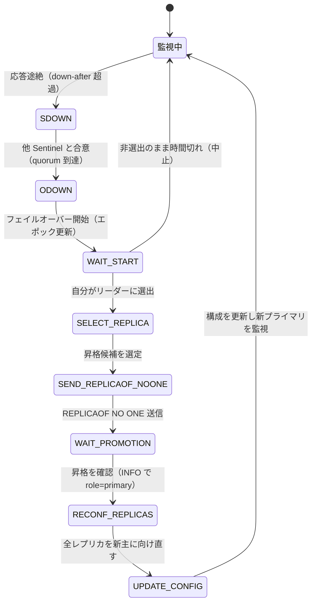

# 第41章 Sentinel

> **本章で読むソース**
>
> - [`src/sentinel.c`](https://github.com/valkey-io/valkey/blob/9.1.0/src/sentinel.c)
> - [`sentinel.conf`](https://github.com/valkey-io/valkey/blob/9.1.0/sentinel.conf)

## この章の狙い

Sentinel は、クラスタ機能を使わないプライマリとレプリカの構成でプライマリの死活を監視し、プライマリが落ちたときにレプリカを自動で昇格させる仕組みである。
本章では、各 Sentinel が独立に下す主観的ダウン（SDOWN）の判定から、複数の Sentinel の合意による客観的ダウン（ODOWN）、リーダー選出、フェイルオーバーの状態機械までを、実コードに沿って読む。
読み終えると、`down-after-milliseconds` と `quorum` という二つの設定がそれぞれどの判定に効くのか、なぜ多数決を二段構えにしているのかを説明できるようになる。

## 前提

- レプリケーションの仕組み（プライマリとレプリカの役割、`REPLICAOF`）は[第38章](./38-replication.md)で扱う。本章は、その上で死活監視と昇格を自動化する層を読む。
- Sentinel 同士の通知に使う Pub/Sub の機構は[第43章](../part08-features/43-pubsub.md)で扱う。

## Sentinel が担う四つの仕事

Sentinel は通常の Valkey サーバを `--sentinel` 付きで起動した特別なモードである。
専用ポート 26379 で待ち受け、監視対象のプライマリ、レプリカ、他の Sentinel へ定期的にコマンドを送りながら、構成の変化を追い続ける。

その役割は四つに整理できる。

- **監視**：プライマリとレプリカが期待どおり動いているかを定期的に確認する。
- **通知**：障害などの事象を、ログと Pub/Sub チャンネルへ流す。
- **自動フェイルオーバー**：プライマリが落ちたと判断したら、レプリカの一つを新しいプライマリへ昇格させ、残りのレプリカを新主に向け直す。
- **構成提供**：クライアントは Sentinel に問い合わせて、現在どのアドレスがプライマリかを知る。フェイルオーバー後もこの問い合わせ先は変わらない。

Sentinel の動作は、一定間隔で起動するタイマーハンドラに集約されている。
ハンドラは監視対象の各インスタンスについて、まず接続を維持し定期コマンドを送る「監視の前半」と、ダウン判定やフェイルオーバーを進める「行動の後半」を順に実行する。

[`src/sentinel.c` L5339-L5365](https://github.com/valkey-io/valkey/blob/9.1.0/src/sentinel.c#L5339-L5365)

```c
void sentinelHandleValkeyInstance(sentinelValkeyInstance *ri) {
    /* ========== MONITORING HALF ============ */
    /* Every kind of instance */
    sentinelReconnectInstance(ri);
    sentinelSendPeriodicCommands(ri);

    /* ============== ACTING HALF ============= */
    /* We don't proceed with the acting half if we are in TILT mode.
     * TILT happens when we find something odd with the time, like a
     * sudden change in the clock. */
    if (sentinel.tilt) {
        if (mstime() - sentinel.tilt_start_time < sentinel_tilt_period) return;
        sentinel.tilt = 0;
        sentinelEvent(LL_WARNING, "-tilt", NULL, "#tilt mode exited");
    }

    /* Every kind of instance */
    sentinelCheckSubjectivelyDown(ri);

    /* Only primaries */
    if (ri->flags & SRI_PRIMARY) {
        sentinelCheckObjectivelyDown(ri);
        if (sentinelStartFailoverIfNeeded(ri)) sentinelAskPrimaryStateToOtherSentinels(ri, SENTINEL_ASK_FORCED);
        sentinelFailoverStateMachine(ri);
        sentinelAskPrimaryStateToOtherSentinels(ri, SENTINEL_NO_FLAGS);
    }
}
```

後半の流れがそのまま本章の構成になる。
`sentinelCheckSubjectivelyDown` で各 Sentinel が独自にダウンを疑い、`sentinelCheckObjectivelyDown` で合意を確かめ、`sentinelStartFailoverIfNeeded` 以降でフェイルオーバーを進める。
監視対象を表す `sentinelValkeyInstance` は、フラグ `SRI_PRIMARY` / `SRI_REPLICA` / `SRI_SENTINEL` で種別を区別し、ダウン状態も `SRI_S_DOWN`（SDOWN）/ `SRI_O_DOWN`（ODOWN）というフラグで保持する。

接続そのものは `instanceLink` 構造体が持つ。
ここに、最後に有効な応答があった時刻 `last_avail_time` や、応答待ちの ping を送った時刻 `act_ping_time` などが記録される。
これらの時刻が、次に見る死活判定の入力になる。

[`src/sentinel.c` L164-L189](https://github.com/valkey-io/valkey/blob/9.1.0/src/sentinel.c#L164-L189)

```c
typedef struct instanceLink {
    int refcount;              /* Number of sentinelValkeyInstance owners. */
    int disconnected;          /* Non-zero if we need to reconnect cc or pc. */
    int pending_commands;      /* Number of commands sent waiting for a reply. */
    valkeyAsyncContext *cc;    /* Libvalkey context for commands. */
    valkeyAsyncContext *pc;    /* Libvalkey context for Pub / Sub. */
    mstime_t cc_conn_time;     /* cc connection time. */
    mstime_t pc_conn_time;     /* pc connection time. */
    mstime_t pc_last_activity; /* Last time we received any message. */
    mstime_t last_avail_time;  /* Last time the instance replied to ping with
                                  a reply we consider valid. */
    mstime_t act_ping_time;    /* Time at which the last pending ping (no pong
                                  received after it) was sent. This field is
                                  set to 0 when a pong is received, and set again
                                  to the current time if the value is 0 and a new
                                  ping is sent. */
    // ... (中略) ...
} instanceLink;
```

なお `instanceLink` は複数の `sentinelValkeyInstance` から共有されうる（`refcount` がその所有者数を数える）。
同じ Sentinel を複数のプライマリから監視している場合、同一相手への接続を一本にまとめる仕掛けである。

## 主観的ダウン（SDOWN）の判定

死活判定の出発点は、各 Sentinel が単独で下す **SDOWN**（subjectively down、主観的ダウン）である。
判定は単純で、最後の有効応答からの経過時間が、設定値 `down_after_period` を超えたかどうかを見る。
この設定が `sentinel.conf` の `down-after-milliseconds` であり、コメントは「PING に継続的に正常応答しない時間がこの値を超えたら S_DOWN とみなす」と述べている。

[`sentinel.conf` L128-L136](https://github.com/valkey-io/valkey/blob/9.1.0/sentinel.conf#L128-L136)

```text
# sentinel down-after-milliseconds <master-name> <milliseconds>
#
# Number of milliseconds the master (or any attached replica or sentinel) should
# be unreachable (as in, not acceptable reply to PING, continuously, for the
# specified period) in order to consider it in S_DOWN state (Subjectively
# Down).
#
# Default is 30 seconds.
sentinel down-after-milliseconds mymaster 30000
```

判定本体が `sentinelCheckSubjectivelyDown` である。
冒頭で経過時間 `elapsed` を求める。
応答待ちの ping があればその送信時刻からの経過を、接続が切れていれば最後に有効だった時刻からの経過を使う。

[`src/sentinel.c` L4407-L4464](https://github.com/valkey-io/valkey/blob/9.1.0/src/sentinel.c#L4407-L4464)

```c
void sentinelCheckSubjectivelyDown(sentinelValkeyInstance *ri) {
    mstime_t elapsed = 0;

    if (ri->link->act_ping_time)
        elapsed = mstime() - ri->link->act_ping_time;
    else if (ri->link->disconnected)
        elapsed = mstime() - ri->link->last_avail_time;

    // ... (中略：応答が滞った接続を張り直す処理) ...

    /* Update the SDOWN flag. We believe the instance is SDOWN if:
     *
     * 1) It is not replying.
     * 2) We believe it is a primary, it reports to be a replica for enough time
     *    to meet the down_after_period, plus enough time to get two times
     *    INFO report from the instance. */
    if (elapsed > ri->down_after_period ||
        (ri->flags & SRI_PRIMARY && ri->role_reported == SRI_REPLICA &&
         mstime() - ri->role_reported_time > (ri->down_after_period + sentinel_info_period * 2)) ||
        (ri->flags & SRI_PRIMARY_REBOOT &&
         mstime() - ri->primary_reboot_since_time > ri->primary_reboot_down_after_period)) {
        /* Is subjectively down */
        if ((ri->flags & SRI_S_DOWN) == 0) {
            sentinelEvent(LL_WARNING, "+sdown", ri, "%@");
            ri->s_down_since_time = mstime();
            ri->flags |= SRI_S_DOWN;
        }
    } else {
        /* Is subjectively up */
        if (ri->flags & SRI_S_DOWN) {
            sentinelEvent(LL_WARNING, "-sdown", ri, "%@");
            ri->flags &= ~(SRI_S_DOWN | SRI_SCRIPT_KILL_SENT);
        }
    }
}
```

SDOWN とみなす条件は三つの論理和になっている。
第一が、いま述べた `elapsed > ri->down_after_period`、つまり応答が途絶えた場合である。
第二は、プライマリだと思っている相手が自分を「レプリカ」だと報告し続けている場合で、フェイルオーバー後の取り残しなどを検出する。
第三は、プライマリの再起動を検出した場合である。

状態が変わる瞬間にだけ `sentinelEvent` を呼び、`+sdown` または `-sdown` を発火している点に注目したい。
この関数は事象をログに記録すると同時に、Pub/Sub チャンネルへも流す（後述の「通知」を支える）。
ここで重要なのは、SDOWN はあくまで一台の Sentinel の主観だということである。
ネットワークの一時的な瞬断や、その Sentinel だけが孤立した状況でも SDOWN は立ちうる。
単一ノードの誤検知をそのままフェイルオーバーの引き金にするわけにはいかない。
そこで合意の段が要る。

## 客観的ダウン（ODOWN）と quorum

複数の Sentinel が同じプライマリを SDOWN と見ていることを確かめた状態が **ODOWN**（objectively down、客観的ダウン）である。
判定は `sentinelCheckObjectivelyDown` が行う。

[`src/sentinel.c` L4472-L4504](https://github.com/valkey-io/valkey/blob/9.1.0/src/sentinel.c#L4472-L4504)

```c
void sentinelCheckObjectivelyDown(sentinelValkeyInstance *primary) {
    dictIterator *di;
    dictEntry *de;
    unsigned int quorum = 0, odown = 0;

    if (primary->flags & SRI_S_DOWN) {
        /* Is down for enough sentinels? */
        quorum = 1; /* the current sentinel. */
        /* Count all the other sentinels. */
        di = dictGetIterator(primary->sentinels);
        while ((de = dictNext(di)) != NULL) {
            sentinelValkeyInstance *ri = dictGetVal(de);

            if (ri->flags & SRI_PRIMARY_DOWN) quorum++;
        }
        dictReleaseIterator(di);
        if (quorum >= primary->quorum) odown = 1;
    }

    /* Set the flag accordingly to the outcome. */
    if (odown) {
        if ((primary->flags & SRI_O_DOWN) == 0) {
            sentinelEvent(LL_WARNING, "+odown", primary, "%@ #quorum %d/%d", quorum, primary->quorum);
            primary->flags |= SRI_O_DOWN;
            primary->o_down_since_time = mstime();
        }
    } else {
        if (primary->flags & SRI_O_DOWN) {
            sentinelEvent(LL_WARNING, "-odown", primary, "%@");
            primary->flags &= ~SRI_O_DOWN;
        }
    }
}
```

数え方は明快である。
まず自分自身を 1 票（`quorum = 1`）と数え、知っている他の Sentinel のうち、当のプライマリを落ちていると報告しているもの（`SRI_PRIMARY_DOWN` フラグが立っているもの）を加算する。
他 Sentinel の見解は、定期的に送る `SENTINEL is-primary-down-by-addr` への応答を `sentinelReceiveIsPrimaryDownReply` が受け取り、この `SRI_PRIMARY_DOWN` に反映している。
合計が設定値 `primary->quorum` に達したら ODOWN と判定する。

この `quorum` が `sentinel.conf` の `sentinel monitor` 行の末尾で指定する値である。
コメントは「少なくとも quorum 台の Sentinel が同意したときに限り O_DOWN とみなす」と述べる。

[`sentinel.conf` L75-L92](https://github.com/valkey-io/valkey/blob/9.1.0/sentinel.conf#L75-L92)

```text
# sentinel monitor <master-name> <ip> <valkey-port> <quorum>
#
# Tells Sentinel to monitor this master, and to consider it in O_DOWN
# (Objectively Down) state only if at least <quorum> sentinels agree.
#
# Note that whatever is the ODOWN quorum, a Sentinel will require to
# be elected by the majority of the known Sentinels in order to
# start a failover, so no failover can be performed in minority.
#
# Replicas are auto-discovered, so you don't need to specify replicas in
# any way. Sentinel itself will rewrite this configuration file adding
# the replicas using additional configuration options.
# Also note that the configuration file is rewritten when a
# replica is promoted to master.
#
# Note: master name should not include special characters or spaces.
# The valid charset is A-z 0-9 and the three characters ".-_".
sentinel monitor mymaster 127.0.0.1 6379 2
```

SDOWN と ODOWN を分けたことが、死活判定における設計の核の一つである。
判定を二段にすると、一台だけが見る一時的な不通を ODOWN まで昇格させずに済む。
`quorum` 台の合意が揃って初めてフェイルオーバーへ進むため、単一ノードの誤検知や局所的なネットワーク分断でプライマリが誤って降ろされることを、多数決で防げる。
コメントが「ODOWN は弱い quorum であり、N 台が同じ瞬間に合意したという強い保証はない」と断っているとおり、ODOWN は時間幅の中での合意にすぎない。
それでも、フェイルオーバーを始める前にもう一段の多数決（リーダー選出）を重ねることで、複数の Sentinel が同時にプライマリを昇格させてしまう事態を避ける。

## Sentinel 同士の発見と通知

ここまでの ODOWN 判定は「他の Sentinel を知っている」ことを前提にしていた。
Sentinel は互いを `__sentinel__:hello` という固定の Pub/Sub チャンネルで発見する。
各 Sentinel は監視対象へ定期的に hello メッセージを `PUBLISH` し、同じチャンネルを `SUBSCRIBE` して相手の hello を受け取る。
これにより、設定に直接書かなくても、同じプライマリを監視している Sentinel 同士が自動で顔ぶれを把握する。

送信側が `sentinelSendHello` である。
hello のペイロードは、自分（Sentinel）の情報と、現在認識しているプライマリの情報をカンマ区切りで並べた 8 トークンになっている。

[`src/sentinel.c` L2935-L2947](https://github.com/valkey-io/valkey/blob/9.1.0/src/sentinel.c#L2935-L2947)

```c
    /* Format and send the Hello message. */
    snprintf(payload, sizeof(payload),
             "%s,%d,%s,%llu," /* Info about this sentinel. */
             "%s,%s,%d,%llu", /* Info about current primary. */
             announce_ip, announce_port, sentinel.myid, (unsigned long long)sentinel.current_epoch,
             /* --- */
             primary->name, announceSentinelAddr(primary_addr), primary_addr->port,
             (unsigned long long)primary->config_epoch);
    retval = valkeyAsyncCommand(ri->link->cc, sentinelPublishReplyCallback, ri, "%s %s %s",
                                sentinelInstanceMapCommand(ri, "PUBLISH"), SENTINEL_HELLO_CHANNEL, payload);
    if (retval != C_OK) return C_ERR;
    ri->link->pending_commands++;
    return C_OK;
```

受信側は `sentinelProcessHelloMessage` がトークンを解釈する。
知らない Sentinel が現れれば `sentinelValkeyInstance` を作って自分の一覧に加え、`+sentinel` 事象を発火する。
また hello にはプライマリの構成エポック（`config_epoch`）が載っており、受け取った構成のほうが新しければ、自分が知るプライマリのアドレスを更新する。
フェイルオーバー後に新しいプライマリのアドレスが Sentinel 群へ伝播するのは、この経路である。

[`src/sentinel.c` L2764-L2776](https://github.com/valkey-io/valkey/blob/9.1.0/src/sentinel.c#L2764-L2776)

```c
void sentinelProcessHelloMessage(char *hello, int hello_len) {
    /* Format is composed of 8 tokens:
     * 0=ip,1=port,2=runid,3=current_epoch,4=primary_name,
     * 5=primary_ip,6=primary_port,7=primary_config_epoch. */
    int numtokens, port, removed, primary_port;
    uint64_t current_epoch, primary_config_epoch;
    char **token = sdssplitlen(hello, hello_len, ",", 1, &numtokens);
    sentinelValkeyInstance *si, *primary;

    if (numtokens == 8) {
        /* Obtain a reference to the primary this hello message is about */
        primary = sentinelGetPrimaryByName(token[4]);
        if (!primary) goto cleanup; /* Unknown primary, skip the message. */
```

通知の出口は `sentinelEvent` に一本化されている。
SDOWN や ODOWN、後述のフェイルオーバー各段はすべてこの関数を呼ぶ。
関数は事象をログに記録したうえで、デバッグ用以外の事象を、事象名（`+sdown`、`+odown`、`+switch-master` など）を名前とする Pub/Sub チャンネルへ `pubsubPublishMessage` で流す。

[`src/sentinel.c` L707-L725](https://github.com/valkey-io/valkey/blob/9.1.0/src/sentinel.c#L707-L725)

```c
    /* Log the message if the log level allows it to be logged. */
    if (level >= server.verbosity) serverLog(level, "%s %s", type, msg);

    /* Publish the message via Pub/Sub if it's not a debugging one. */
    if (level != LL_DEBUG) {
        channel = createStringObject(type, strlen(type));
        payload = createStringObject(msg, strlen(msg));
        pubsubPublishMessage(channel, payload, 0);
        decrRefCount(channel);
        decrRefCount(payload);
    }

    /* Call the notification script if applicable. */
    if (level == LL_WARNING && ri != NULL) {
        sentinelValkeyInstance *primary = (ri->flags & SRI_PRIMARY) ? ri : ri->primary;
        if (primary && primary->notification_script) {
            sentinelScheduleScriptExecution(primary->notification_script, type, msg, NULL);
        }
    }
```

`LL_WARNING` の事象では、設定された通知スクリプトがあれば併せて起動する。
運用側はこの Pub/Sub チャンネルを購読するか、スクリプトを仕掛けることで、フェイルオーバーの進行を外から追える。
Pub/Sub の仕組み自体は[第43章](../part08-features/43-pubsub.md)で扱う。

## リーダー選出

ODOWN に達しても、各 Sentinel がてんでにレプリカを昇格させては構成が割れる。
そこで、ODOWN を確認した Sentinel 群は、フェイルオーバーを実際に実行する **リーダー** を一台だけ投票で選ぶ。

フェイルオーバーを始めうるかを判断するのが `sentinelStartFailoverIfNeeded` である。
プライマリが ODOWN であること、すでにフェイルオーバー中でないこと、直近に試みすぎていないことを確かめる。

[`src/sentinel.c` L4923-L4946](https://github.com/valkey-io/valkey/blob/9.1.0/src/sentinel.c#L4923-L4946)

```c
int sentinelStartFailoverIfNeeded(sentinelValkeyInstance *primary) {
    /* We can't failover if the primary is not in O_DOWN state. */
    if (!(primary->flags & SRI_O_DOWN)) return 0;

    /* Failover already in progress? */
    if (primary->flags & SRI_FAILOVER_IN_PROGRESS) return 0;

    /* Last failover attempt started too little time ago? */
    if (mstime() - primary->failover_start_time < primary->failover_timeout * 2) {
        // ... (中略：ログ出力) ...
        return 0;
    }

    sentinelStartFailover(primary);
    return 1;
}
```

条件を満たすと `sentinelStartFailover` がエポックを一つ進めてフェイルオーバーを開始状態にする。
このエポック（`failover_epoch`）が、今回の選出を識別する番号になる。

[`src/sentinel.c` L4900-L4910](https://github.com/valkey-io/valkey/blob/9.1.0/src/sentinel.c#L4900-L4910)

```c
void sentinelStartFailover(sentinelValkeyInstance *primary) {
    serverAssert(primary->flags & SRI_PRIMARY);

    primary->failover_state = SENTINEL_FAILOVER_STATE_WAIT_START;
    primary->flags |= SRI_FAILOVER_IN_PROGRESS;
    primary->failover_epoch = ++sentinel.current_epoch;
    sentinelEvent(LL_WARNING, "+new-epoch", primary, "%llu", (unsigned long long)sentinel.current_epoch);
    sentinelEvent(LL_WARNING, "+try-failover", primary, "%@");
    primary->failover_start_time = mstime() + rand() % SENTINEL_MAX_DESYNC;
    primary->failover_state_change_time = mstime();
}
```

票を集めて勝者を決めるのが `sentinelGetLeader` である。
あるエポックでリーダーになるには、二つの条件をともに満たさなければならない。
有効投票者の絶対多数（`voters / 2 + 1`）と、設定値 `quorum` 以上である。

[`src/sentinel.c` L4654-L4715](https://github.com/valkey-io/valkey/blob/9.1.0/src/sentinel.c#L4654-L4715)

```c
char *sentinelGetLeader(sentinelValkeyInstance *primary, uint64_t epoch) {
    dict *counters;
    dictIterator *di;
    dictEntry *de;
    unsigned int voters = 0, voters_quorum;
    char *myvote;
    char *winner = NULL;
    uint64_t leader_epoch;
    uint64_t max_votes = 0;

    serverAssert(primary->flags & (SRI_O_DOWN | SRI_FAILOVER_IN_PROGRESS));
    counters = dictCreate(&leaderVotesDictType);

    voters = dictSize(primary->sentinels) + 1; /* All the other sentinels and me.*/

    /* Count other sentinels votes */
    di = dictGetIterator(primary->sentinels);
    while ((de = dictNext(di)) != NULL) {
        sentinelValkeyInstance *ri = dictGetVal(de);
        if (ri->leader != NULL && ri->leader_epoch == sentinel.current_epoch) sentinelLeaderIncr(counters, ri->leader);
    }
    dictReleaseIterator(di);

    // ... (中略：最多票の暫定勝者を選ぶ) ...

    /* Count this Sentinel vote:
     * if this Sentinel did not voted yet, either vote for the most
     * common voted sentinel, or for itself if no vote exists at all. */
    if (winner)
        myvote = sentinelVoteLeader(primary, epoch, winner, &leader_epoch);
    else
        myvote = sentinelVoteLeader(primary, epoch, sentinel.myid, &leader_epoch);

    if (myvote && leader_epoch == epoch) {
        uint64_t votes = sentinelLeaderIncr(counters, myvote);

        if (votes > max_votes) {
            max_votes = votes;
            winner = myvote;
        }
    }

    voters_quorum = voters / 2 + 1;
    if (winner && (max_votes < voters_quorum || max_votes < primary->quorum)) winner = NULL;

    winner = winner ? sdsnew(winner) : NULL;
    sdsfree(myvote);
    dictRelease(counters);
    return winner;
}
```

他 Sentinel の票を数え、最多票の候補を暫定勝者とし、自分の票を `sentinelVoteLeader` で投じる。
自分はまだ投票していなければ、最多票の候補に乗るか、票が一つもなければ自分自身（`sentinel.myid`）に入れる。
最後に `max_votes` が `voters_quorum`（絶対多数）と `quorum` の両方を満たすかを確かめ、満たさなければ勝者なし（`NULL`）にする。

実際の投票が `sentinelVoteLeader` である。
要求エポックが自分の知る最新以上で、まだそのエポックで投票していなければ、要求された候補に投票してエポックを記録する。
一度あるエポックで投票したら、同じエポックでは別候補に入れ直せない。

[`src/sentinel.c` L4600-L4623](https://github.com/valkey-io/valkey/blob/9.1.0/src/sentinel.c#L4600-L4623)

```c
char *sentinelVoteLeader(sentinelValkeyInstance *primary, uint64_t req_epoch, char *req_runid, uint64_t *leader_epoch) {
    if (req_epoch > sentinel.current_epoch) {
        sentinel.current_epoch = req_epoch;
        sentinelFlushConfig();
        sentinelEvent(LL_WARNING, "+new-epoch", primary, "%llu", (unsigned long long)sentinel.current_epoch);
    }

    if (primary->leader_epoch < req_epoch && sentinel.current_epoch <= req_epoch) {
        sdsfree(primary->leader);
        primary->leader = sdsnew(req_runid);
        primary->leader_epoch = sentinel.current_epoch;
        sentinelFlushConfig();
        sentinelEvent(LL_WARNING, "+vote-for-leader", primary, "%s %llu", primary->leader,
                      (unsigned long long)primary->leader_epoch);
        // ... (中略：自分以外に投票したら次回開始を遅らせる) ...
    }

    *leader_epoch = primary->leader_epoch;
    return primary->leader ? sdsnew(primary->leader) : NULL;
}
```

エポックごとに一票という制約と、絶対多数の要求が、フェイルオーバーにおける設計の核の二つ目である。
ODOWN は「プライマリが落ちている」という観測の合意にすぎないのに対し、リーダー選出は「誰が処置を実行するか」を一意に決める。
`sentinel monitor` のコメントが「quorum がいくつであれ、フェイルオーバーを始めるには既知の Sentinel の多数派に選出される必要がある」と述べていたのはこのためである。
多数派の支持を得た一台だけが昇格を進めるので、少数派に分断された側ではフェイルオーバーが進まず、二つのプライマリが並び立つ事態を避けられる。

## フェイルオーバーの状態機械

選出を含むフェイルオーバーの進行は、状態機械として実装されている。
各状態は `SENTINEL_FAILOVER_STATE_*` の定数で表され、`sentinelFailoverStateMachine` が現在の状態に応じて担当関数へ振り分ける。

[`src/sentinel.c` L5296-L5313](https://github.com/valkey-io/valkey/blob/9.1.0/src/sentinel.c#L5296-L5313)

```c
void sentinelFailoverStateMachine(sentinelValkeyInstance *ri) {
    serverAssert(ri->flags & SRI_PRIMARY);

    if (!(ri->flags & SRI_FAILOVER_IN_PROGRESS)) return;

    switch (ri->failover_state) {
    case SENTINEL_FAILOVER_STATE_WAIT_START: sentinelFailoverWaitStart(ri); break;
    case SENTINEL_FAILOVER_STATE_SELECT_REPLICA: sentinelFailoverSelectReplica(ri); break;
    case SENTINEL_FAILOVER_STATE_SEND_REPLICAOF_NOONE:
        if (!(ri->flags & SRI_COORD_FAILOVER))
            sentinelFailoverSendReplicaOfNoOne(ri);
        else
            sentinelFailoverSendFailover(ri);
        break;
    case SENTINEL_FAILOVER_STATE_WAIT_PROMOTION: sentinelFailoverWaitPromotion(ri); break;
    case SENTINEL_FAILOVER_STATE_RECONF_REPLICAS: sentinelFailoverReconfNextReplica(ri); break;
    }
}
```

状態は順に遷移する。
全体の流れを先に図で示す。



最初の状態 `WAIT_START` で、リーダーかどうかを判定する。
`sentinelFailoverWaitStart` が `sentinelGetLeader` を呼び、自分がリーダーでなく強制フェイルオーバーでもなければ、一定時間後に処理を中止する。
リーダーであれば次の `SELECT_REPLICA` へ進む。

[`src/sentinel.c` L5052-L5081](https://github.com/valkey-io/valkey/blob/9.1.0/src/sentinel.c#L5052-L5081)

```c
void sentinelFailoverWaitStart(sentinelValkeyInstance *ri) {
    char *leader;
    int isleader;

    /* Check if we are the leader for the failover epoch. */
    leader = sentinelGetLeader(ri, ri->failover_epoch);
    isleader = leader && strcasecmp(leader, sentinel.myid) == 0;
    sdsfree(leader);

    /* If I'm not the leader, and it is not a forced failover via
     * SENTINEL FAILOVER, then I can't continue with the failover. */
    if (!isleader && !(ri->flags & SRI_FORCE_FAILOVER)) {
        mstime_t election_timeout = sentinel_election_timeout;

        /* The election timeout is the MIN between SENTINEL_ELECTION_TIMEOUT
         * and the configured failover timeout. */
        if (election_timeout > ri->failover_timeout) election_timeout = ri->failover_timeout;
        /* Abort the failover if I'm not the leader after some time. */
        if (mstime() - ri->failover_start_time > election_timeout) {
            sentinelEvent(LL_WARNING, "-failover-abort-not-elected", ri, "%@");
            sentinelAbortFailover(ri);
        }
        return;
    }
    sentinelEvent(LL_WARNING, "+elected-leader", ri, "%@");
    if (sentinel.simfailure_flags & SENTINEL_SIMFAILURE_CRASH_AFTER_ELECTION) sentinelSimFailureCrash();
    ri->failover_state = SENTINEL_FAILOVER_STATE_SELECT_REPLICA;
    ri->failover_state_change_time = mstime();
    sentinelEvent(LL_WARNING, "+failover-state-select-slave", ri, "%@");
}
```

`SELECT_REPLICA` では、昇格させるレプリカを `sentinelSelectReplica` が選ぶ。
選定は、応答していて切断されておらず優先度が 0 でないレプリカに絞ったうえで、優先度（`replica_priority`、小さいほど優先）、処理済みのレプリケーションオフセット（大きいほど優先）、`runid` の辞書順で並べ替えて先頭を採る。
オフセットが大きいレプリカほどプライマリのデータを多く受け取っているため、昇格時のデータ損失が小さくなる。
適切なレプリカが見つかれば、それに `SRI_PROMOTED` を立てて `SEND_REPLICAOF_NOONE` へ進む。

[`src/sentinel.c` L5083-L5099](https://github.com/valkey-io/valkey/blob/9.1.0/src/sentinel.c#L5083-L5099)

```c
void sentinelFailoverSelectReplica(sentinelValkeyInstance *ri) {
    sentinelValkeyInstance *replica = sentinelSelectReplica(ri);

    /* We don't handle the timeout in this state as the function aborts
     * the failover or go forward in the next state. */
    if (replica == NULL) {
        sentinelEvent(LL_WARNING, "-failover-abort-no-good-slave", ri, "%@");
        sentinelAbortFailover(ri);
    } else {
        sentinelEvent(LL_WARNING, "+selected-slave", replica, "%@");
        replica->flags |= SRI_PROMOTED;
        ri->promoted_replica = replica;
        ri->failover_state = SENTINEL_FAILOVER_STATE_SEND_REPLICAOF_NOONE;
        ri->failover_state_change_time = mstime();
        sentinelEvent(LL_NOTICE, "+failover-state-send-slaveof-noone", replica, "%@");
    }
}
```

`SEND_REPLICAOF_NOONE` で、選んだレプリカへ `REPLICAOF NO ONE` を送ってプライマリへ昇格させる。
コマンドの応答は当てにせず、後で `INFO` の役割が `primary` に変わるのを見て成否を確かめる方針なので、送信後はただ `WAIT_PROMOTION` へ進む。

[`src/sentinel.c` L5133-L5156](https://github.com/valkey-io/valkey/blob/9.1.0/src/sentinel.c#L5133-L5156)

```c
void sentinelFailoverSendReplicaOfNoOne(sentinelValkeyInstance *ri) {
    int retval;

    /* We can't send the command to the promoted replica if it is now
     * disconnected. Retry again and again with this state until the timeout
     * is reached, then abort the failover. */
    if (ri->promoted_replica->link->disconnected) {
        if (mstime() - ri->failover_state_change_time > ri->failover_timeout) {
            sentinelEvent(LL_WARNING, "-failover-abort-slave-timeout", ri, "%@");
            sentinelAbortFailover(ri);
        }
        return;
    }

    /* Send REPLICAOF NO ONE command to turn the replica into a primary.
     * We actually register a generic callback for this command as we don't
     * really care about the reply. We check if it worked indirectly observing
     * if INFO returns a different role (primary instead of replica). */
    retval = sentinelSendReplicaOf(ri->promoted_replica, NULL);
    if (retval != C_OK) return;
    sentinelEvent(LL_NOTICE, "+failover-state-wait-promotion", ri->promoted_replica, "%@");
    ri->failover_state = SENTINEL_FAILOVER_STATE_WAIT_PROMOTION;
    ri->failover_state_change_time = mstime();
}
```

`WAIT_PROMOTION` は時間切れだけを見張る状態である。
昇格が `INFO` で確認できると、次は `RECONF_REPLICAS` で残りのレプリカを新しいプライマリへ向け直す。
`sentinelFailoverReconfNextReplica` は、同時に再構成するレプリカ数を `parallel_syncs` で絞りながら、各レプリカへ新プライマリを指す `REPLICAOF` を送る。
`parallel_syncs` を小さくすると、再同期で同時に負荷がかかるレプリカ数を抑えられる。

[`src/sentinel.c` L5244-L5277](https://github.com/valkey-io/valkey/blob/9.1.0/src/sentinel.c#L5244-L5277)

```c
    di = dictGetIterator(primary->replicas);
    while (in_progress < primary->parallel_syncs && (de = dictNext(di)) != NULL) {
        sentinelValkeyInstance *replica = dictGetVal(de);
        int retval;

        /* Skip the promoted replica, and already configured replicas. */
        if (replica->flags & (SRI_PROMOTED | SRI_RECONF_DONE)) continue;

        // ... (中略：送信済みのまま時間切れしたものを done 扱いにする) ...

        /* Nothing to do for instances that are disconnected or already
         * in RECONF_SENT state. */
        if (replica->flags & (SRI_RECONF_SENT | SRI_RECONF_INPROG)) continue;
        if (replica->link->disconnected) continue;

        /* Send REPLICAOF <new primary>. */
        retval = sentinelSendReplicaOf(replica, primary->promoted_replica->addr);
        if (retval == C_OK) {
            replica->flags |= SRI_RECONF_SENT;
            replica->replica_reconf_sent_time = mstime();
            sentinelEvent(LL_NOTICE, "+slave-reconf-sent", replica, "%@");
            in_progress++;
        }
    }
    dictReleaseIterator(di);
```

すべてのレプリカが新主に向いたら、状態は `UPDATE_CONFIG` になる。
ここで `sentinelFailoverSwitchToPromotedReplica` が、自分の構成上でプライマリのアドレスを昇格したレプリカのものに差し替え、`+switch-master` 事象を発火する。

[`src/sentinel.c` L5286-L5294](https://github.com/valkey-io/valkey/blob/9.1.0/src/sentinel.c#L5286-L5294)

```c
void sentinelFailoverSwitchToPromotedReplica(sentinelValkeyInstance *primary) {
    sentinelValkeyInstance *ref = primary->promoted_replica ? primary->promoted_replica : primary;

    sentinelEvent(LL_WARNING, "+switch-master", primary, "%s %s %d %s %d", primary->name,
                  announceSentinelAddr(primary->addr), primary->addr->port, announceSentinelAddr(ref->addr),
                  ref->addr->port);

    sentinelResetPrimaryAndChangeAddress(primary, ref->addr->hostname, ref->addr->port);
}
```

`+switch-master` が、クライアントにとって最も重要な事象である。
これを受け取った（あるいは Sentinel に問い合わせた）クライアントは、新しいプライマリのアドレスへ接続を切り替える。
リーダー以外の Sentinel も、昇格したプライマリからの構成エポックがより新しいことを hello で知り、自分の構成を同じアドレスへ更新する。
こうして、構成提供という Sentinel の最後の仕事が果たされる。

## まとめ

- Sentinel はプライマリとレプリカの構成の監視、通知、自動フェイルオーバー、構成提供を担う。動作はタイマーハンドラの「監視の前半」と「行動の後半」に集約される。
- 死活判定は二段構えである。各 Sentinel が `down-after-milliseconds` の超過で単独に下す SDOWN と、`quorum` 台の合意で確定する ODOWN を分け、単一ノードの誤検知を多数決で防ぐ。
- ODOWN の後、Sentinel 群はエポックごとに一票の投票で実行リーダーを一台だけ選ぶ。絶対多数と `quorum` の両方を満たした一台だけが昇格を進めるので、二つのプライマリが並び立つことを避けられる。
- フェイルオーバーは状態機械として進む。リーダー判定、レプリカ選定、`REPLICAOF NO ONE` による昇格、残りレプリカの向け直し、構成更新の順に遷移する。
- レプリカ選定はレプリケーションオフセットの大きいものを優先し、昇格時のデータ損失を小さくする。`parallel_syncs` は再構成の同時数を絞る。
- Sentinel 同士は `__sentinel__:hello` チャンネルで互いを発見し、事象はすべて `sentinelEvent` から Pub/Sub と通知スクリプトへ流れる。

## 関連する章

- [第38章 レプリケーション](./38-replication.md)：本章が前提とするプライマリとレプリカの仕組みと `REPLICAOF`。
- [第43章 Pub/Sub](../part08-features/43-pubsub.md)：hello による発見と事象通知が使うチャンネル機構。
