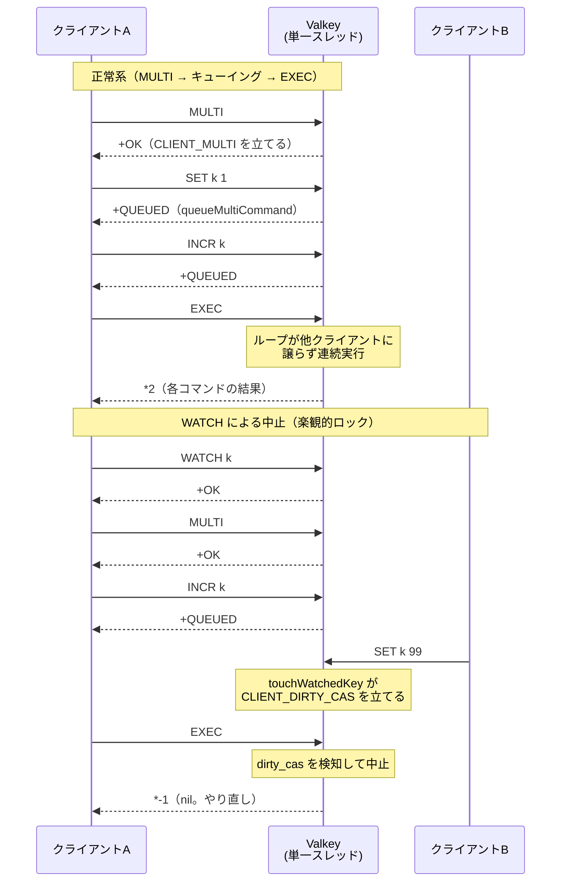

# 第42章 トランザクション MULTI/EXEC

> **本章で読むソース**
>
> - [`src/multi.c`](https://github.com/valkey-io/valkey/blob/9.1.0/src/multi.c)
> - [`src/server.h`](https://github.com/valkey-io/valkey/blob/9.1.0/src/server.h)
> - [`src/server.c`](https://github.com/valkey-io/valkey/blob/9.1.0/src/server.c)

## この章の狙い

Valkey のトランザクションは、`MULTI` から `EXEC` までに送ったコマンドをひとまとめにして実行する仕組みである。
本章では、コマンドがどこにキューイングされ、`EXEC` がそれをどう連続実行するかをコードで追う。
あわせて、Valkey のトランザクションを支える二つの設計、すなわち単一スレッドによる原子性と、`WATCH` による楽観的ロックを機構のレベルで説明する。

## 前提

- コマンドが `processCommand` を経て `call` で実行される流れは [第27章 コマンドの実行](../part04-server-events/27-command-execution.md) で扱う。
- キーの変更が監視中のクライアントへ通知される経路は [第30章 データベース](../part05-database/30-database.md) で扱う。

## トランザクションの状態はクライアントごとに持つ

トランザクションの状態は、サーバ全体ではなくクライアントごとに保持される。
`client` 構造体の `mstate` フィールドがそれで、`MULTI` を最初に使ったときに遅延確保される。

[`src/server.h` L935-L959](https://github.com/valkey-io/valkey/blob/9.1.0/src/server.h#L935-L959)

```c
typedef struct multiCmd {
    robj **argv;
    int argv_len;
    int argc;
    struct serverCommand *cmd;
    int slot;
} multiCmd;

typedef struct multiState {
    multiCmd *commands;             /* Array of MULTI commands */
    int count;                      /* Total number of MULTI commands */
    int cmd_flags;                  /* The accumulated command flags OR-ed together. */
    int cmd_inv_flags;              /* Same as cmd_flags, OR-ing the ~flags. */
    size_t argv_len_sums;           /* mem used by all commands arguments */
    int alloc_count;                /* total number of multiCmd struct memory reserved. */
    list watched_keys;              /* List of watchedKey for iteration and cleanup. */
    hashtable **watched_keys_by_db; /* Per-db hashtable for O(1) watched key lookup. */
    int transaction_db_id;          /* Currently SELECTed DB id in transaction context */
} multiState;
```

`commands` がキューの本体で、`multiCmd` の配列としてコマンドの引数一式とコマンド定義を保持する。
`count` がキューに積まれたコマンド数、`watched_keys` が後述する `WATCH` の監視対象である。

`MULTI` コマンド自体の処理は短い。
`multiState` を用意し、クライアントに `CLIENT_MULTI` フラグ（`c->flag.multi`）を立てて `OK` を返すだけである。

[`src/multi.c` L156-L161](https://github.com/valkey-io/valkey/blob/9.1.0/src/multi.c#L156-L161)

```c
void multiCommand(client *c) {
    if (!c->mstate) initClientMultiState(c);
    c->flag.multi = 1;
    c->mstate->transaction_db_id = c->db->id;
    addReply(c, shared.ok);
}
```

`CLIENT_MULTI` フラグが立っている間、後続のコマンドは実行されずキューに積まれる。
その分岐の判断は `multi.c` ではなく `processCommand` の側にある。

## キューイングへの分岐

`processCommand` は、コマンドを実行する直前で、クライアントがトランザクション中かどうかを見る。

[`src/server.c` L4630-L4639](https://github.com/valkey-io/valkey/blob/9.1.0/src/server.c#L4630-L4639)

```c
    /* Exec the command */
    if (c->flag.multi && c->cmd->proc != execCommand && c->cmd->proc != discardCommand &&
        c->cmd->proc != quitCommand &&
        c->cmd->proc != resetCommand) {
        queueMultiCommand(c, cmd_flags);
        addReply(c, shared.queued);
    } else {
        int flags = CMD_CALL_FULL;
        call(c, flags);
        if (listLength(server.ready_keys) && !isInsideYieldingLongCommand()) handleClientsBlockedOnKeys();
    }
```

`CLIENT_MULTI` が立っていて、かつコマンドが `EXEC`、`DISCARD`、`QUIT`、`RESET` のいずれでもないとき、`queueMultiCommand` でキューに積み、クライアントには即時実行の応答ではなく `+QUEUED` を返す。
この四つのコマンドだけはトランザクション制御そのものに関わるため、キューイングを素通りして実行される。
`EXEC` がここでキューを実行へ移し、`DISCARD` がキューを捨てる。

`queueMultiCommand` はクライアントの引数をキューへ移し替える。

[`src/multi.c` L91-L137](https://github.com/valkey-io/valkey/blob/9.1.0/src/multi.c#L91-L137)

```c
/* Add a new command into the MULTI commands queue */
void queueMultiCommand(client *c, uint64_t cmd_flags) {
    multiCmd *mc;

    /* No sense to waste memory if the transaction is already aborted. */
    if (c->flag.dirty_cas || c->flag.dirty_exec) return;
    if (!c->mstate) initClientMultiState(c);
    if (c->mstate->count == 0) {
        /* If a client is using multi/exec, assuming it is used to execute at least
         * two commands. Hence, creating by default size of 2. */
        c->mstate->commands = zmalloc(sizeof(multiCmd) * 2);
        c->mstate->alloc_count = 2;
    }
    if (c->mstate->count == c->mstate->alloc_count) {
        c->mstate->alloc_count = c->mstate->alloc_count < INT_MAX / 2 ? c->mstate->alloc_count * 2 : INT_MAX;
        c->mstate->commands = zrealloc(c->mstate->commands, sizeof(multiCmd) * (c->mstate->alloc_count));
    }
    mc = c->mstate->commands + c->mstate->count;
    mc->cmd = c->cmd;
    mc->argc = c->argc;
    mc->argv = c->argv;
    mc->argv_len = c->argv_len;
    mc->slot = c->slot;
    // ... (中略) ...
    c->mstate->count++;
    c->mstate->cmd_flags |= cmd_flags;
    c->mstate->cmd_inv_flags |= ~cmd_flags;
    c->mstate->argv_len_sums += c->argv_len_sum + sizeof(robj *) * c->argc;

    /* Reset the client's args since we copied them into the mstate and shouldn't
     * reference them from c anymore. */
    c->argv = NULL;
    c->argc = 0;
    c->argv_len_sum = 0;
    c->argv_len = 0;
}
```

ここで起きていることは、引数配列 `argv` の所有権をクライアントから `multiCmd` へ移すことである。
末尾でクライアント側の `c->argv` を `NULL` に戻しているのは、同じ配列を二箇所から参照させないためで、コピーではなくポインタの付け替えで済ませている。
キューの配列は最初に二要素ぶんだけ確保し、足りなくなるたびに倍々で拡張する。
トランザクションは二つ以上のコマンドをまとめる用途が大半だという見込みに合わせた初期サイズである。

`cmd_flags` と `cmd_inv_flags` には、積んだ各コマンドのフラグを OR で畳み込んで蓄えていく。
これにより、キュー全体が書き込みコマンドを含むか、全コマンドがある性質を満たすかといった判定を、`EXEC` の前に配列を走査せずに行える。

## EXEC によるキューの連続実行

`EXEC` はキューを先頭から順に実行する。
その本体が `execCommand` である。

[`src/multi.c` L189-L237](https://github.com/valkey-io/valkey/blob/9.1.0/src/multi.c#L189-L237)

```c
void execCommand(client *c) {
    // ... (中略) ...
    if (!c->flag.multi) {
        addReplyError(c, "EXEC without MULTI");
        return;
    }

    /* EXEC with expired watched key is disallowed*/
    if (isWatchedKeyExpired(c)) {
        c->flag.dirty_cas = 1;
    }

    /* Check if we need to abort the EXEC because:
     * 1) Some WATCHed key was touched.
     * 2) There was a previous error while queueing commands. */
    if (c->flag.dirty_cas || c->flag.dirty_exec) {
        if (c->flag.dirty_exec) {
            addReplyErrorObject(c, shared.execaborterr);
        } else {
            addReply(c, shared.nullarray[c->resp]);
        }
        discardTransaction(c);
        return;
    }

    struct ClientFlags old_flags = c->flag;

    /* we do not want to allow blocking commands inside multi */
    c->flag.deny_blocking = 1;

    /* Exec all the queued commands */
    unwatchAllKeys(c); /* Unwatch ASAP otherwise we'll waste CPU cycles */

    server.in_exec = 1;
    // ... (中略) ...
    addReplyArrayLen(c, c->mstate->count);
```

実行に入る前に二つの中止条件を確認する。
`CLIENT_DIRTY_CAS`（`c->flag.dirty_cas`）が立っていれば、監視中のキーが変更されたということなので、トランザクションは実行せず空配列（nil）を返す。
`CLIENT_DIRTY_EXEC`（`c->flag.dirty_exec`）が立っていれば、キューイング中にエラーがあったので `EXECABORT` エラーを返す。
どちらでもなければ、応答として配列長（キューのコマンド数）を先に書き、各コマンドの結果をその要素として返していく。

実際のループはキューを順に取り出し、`call` で実行する。

[`src/multi.c` L238-L296](https://github.com/valkey-io/valkey/blob/9.1.0/src/multi.c#L238-L296)

```c
    for (j = 0; j < c->mstate->count; j++) {
        c->argc = c->mstate->commands[j].argc;
        c->argv = c->mstate->commands[j].argv;
        c->argv_len = c->mstate->commands[j].argv_len;
        c->cmd = c->realcmd = c->mstate->commands[j].cmd;

        /* ACL permissions are also checked at the time of execution in case
         * they were changed after the commands were queued. */
        int acl_errpos;
        int acl_retval = ACLCheckAllPerm(c, &acl_errpos);
        if (acl_retval != ACL_OK) {
            // ... (中略) ...
            addReplyErrorFormat(c, "-NOPERM ACLs rules changed ...");
        } else {
            if (c->id == CLIENT_ID_AOF)
                call(c, CMD_CALL_NONE);
            else
                call(c, CMD_CALL_FULL);

            serverAssert(c->flag.blocked == 0);
        }
        // ... (中略) ...
    }
    // ... (中略) ...
    discardTransaction(c);

    server.in_exec = 0;
}
```

ループはキューの `multiCmd` を一つずつクライアントの `c->argv` や `c->cmd` に載せ替えてから `call` を呼ぶ。
コマンドの実行そのものは `call` が担い、その内部は第27章で扱う。
ここで押さえるべきは、ループが途中で止まらないことである。
あるコマンドがエラーを返しても、`addReplyErrorFormat` などで結果としてエラーを書き込むだけで、次の要素へ進む。
全コマンドを実行し終えると `discardTransaction` で状態を片付け、`CLIENT_MULTI` フラグを下ろす。

### 原子性とロールバックの不在

ここで Valkey のトランザクションの一つ目の設計が見えてくる。
キューの実行が原子的なのは、ロックや特別な隔離機構によるのではない。
コマンドの実行が単一スレッドのイベントループ上で行われ、`execCommand` のループが他のクライアントに制御を譲らずに最後まで回りきるからである。
`EXEC` のループが回っている間、他クライアントのコマンドはイベントループに処理されない。
キューのコマンドは、あいだに何も挟まずに連続して実行される。
これが「`EXEC` 中に割り込みが起きない」ことの機構である。

その代わり、Valkey のトランザクションにはロールバックがない。
先のループが示すとおり、途中のコマンドがエラーになっても残りは実行され、すでに適用された変更は取り消されない。
これは設計上の選択である。
キューイングの段階で弾けるのは構文の誤りや存在しないコマンドといった種類の失敗で、これらは `EXEC` の前に `CLIENT_DIRTY_EXEC` として捕まる。
`EXEC` 開始後に起きるエラーは、たとえば文字列に対してリスト操作を行うような、コマンドとデータ型の不整合に由来するものが中心で、これはプログラム側の誤りである。
ロールバックを持たないことで実行経路を単純に保てるという判断だと考えられる。

実行中であることは `server.in_exec` フラグで外から分かるようになっている。
ループの前で `1` にし、終わったら `0` に戻す。

## キューイング中のエラーで EXEC を拒否する

キューイングの段階でコマンドを受け付けられなかったとき、トランザクションは「汚れた」状態になり、`EXEC` は拒否される。
その印を立てるのが `flagTransaction` である。

[`src/multi.c` L147-L154](https://github.com/valkey-io/valkey/blob/9.1.0/src/multi.c#L147-L154)

```c
/* Flag the transaction as DIRTY_EXEC so that EXEC will fail.
 * Should be called every time there is an error while queueing a command. */
void flagTransaction(client *c) {
    if (c->flag.multi) {
        c->flag.dirty_exec = 1;
        resetClientMultiState(c);
    }
}
```

`flagTransaction` は `processCommand` 系の経路から、コマンドのキューイングに失敗したときに呼ばれる。
`CLIENT_DIRTY_EXEC` を立てたうえでキューの中身を捨てる。
先に見たとおり、`EXEC` はこのフラグを見つけると `EXECABORT` エラーを返してトランザクションを破棄する。
存在しないコマンドや引数の数が合わないコマンドを `MULTI` 中に送ると、その場では `QUEUED` ではなくエラーが返り、最終的に `EXEC` も失敗するのはこの仕組みによる。

`DISCARD` は、エラーがなくてもトランザクションを能動的に捨てる。

[`src/multi.c` L139-L170](https://github.com/valkey-io/valkey/blob/9.1.0/src/multi.c#L139-L170)

```c
void discardTransaction(client *c) {
    resetClientMultiState(c);
    c->flag.multi = 0;
    c->flag.dirty_cas = 0;
    c->flag.dirty_exec = 0;
    unwatchAllKeys(c);
}
// ... (中略) ...
void discardCommand(client *c) {
    if (!c->flag.multi) {
        addReplyError(c, "DISCARD without MULTI");
        return;
    }
    discardTransaction(c);
    addReply(c, shared.ok);
}
```

`discardTransaction` はキューを解放し、`CLIENT_MULTI` と二つの汚れフラグを下ろし、監視中のキーも解除する。
`EXEC` も実行後にこの関数を呼ぶので、トランザクションの後始末は成功時も破棄時も同じ経路に集まっている。

## WATCH による楽観的ロック

二つ目の設計が `WATCH` である。
`WATCH` はキーを監視対象に登録し、そのキーが `EXEC` までに変更されたら `EXEC` を中止させる。
これにより、ロックを取らずに「読んだ値が変わっていなければ書き込む」という条件付き実行（CAS、compare-and-swap）が書ける。
キーをロックして他クライアントを待たせるのではなく、変更が起きたら自分のトランザクションを諦めるという楽観的な方式である。

`WATCH` の登録は `watchForKey` が行う。

[`src/multi.c` L356-L397](https://github.com/valkey-io/valkey/blob/9.1.0/src/multi.c#L356-L397)

```c
/* Watch for the specified key */
void watchForKey(client *c, robj *key) {
    list *clients = NULL;
    watchedKey *wk;

    if (listLength(&c->mstate->watched_keys) == 0) server.watching_clients++;
    // ... (中略) ...
    /* Check if we are already watching for this key */
    if (hashtableFind(c->mstate->watched_keys_by_db[c->db->id], key, NULL)) {
        return; /* Key already watched */
    }

    /* This key is not already watched in this DB. Let's add it */
    clients = dictFetchValue(c->db->watched_keys, key);
    if (!clients) {
        clients = listCreate();
        dictAdd(c->db->watched_keys, key, clients);
        incrRefCount(key);
    }

    /* Add the new key to the list of keys watched by this client */
    wk = zmalloc(sizeof(*wk));
    wk->key = key;
    wk->client = c;
    wk->db = c->db;
    wk->expired = keyIsExpired(c->db, key);
    incrRefCount(key);
    listAddNodeTail(&c->mstate->watched_keys, wk);
    watchedKeyLinkToClients(clients, wk);

    /* Add the new key to the per-db hashtable for O(1) lookup. */
    hashtableAdd(c->mstate->watched_keys_by_db[c->db->id], wk);
}
```

監視の登録は二方向のリンクで成り立っている。
一つはクライアント側で、`mstate->watched_keys` のリストに `watchedKey` を積む。
もう一つはデータベース側で、`db->watched_keys` 辞書がキーから「そのキーを監視しているクライアントのリスト」を引けるようにしている。
キーが変更されたときに、そのキーを監視している全クライアントへ即座にたどり着くためである。
登録時にそのキーがすでに有効期限切れだった場合は `wk->expired` を立てておき、後述する判定で「もとから無かった」ものとして扱う。

`WATCH` 自体は `MULTI` の前に発行する。
トランザクションの内側では使えないように、`WATCH` コマンドには `NO_MULTI` フラグが付いている。
`processCommand` は `CLIENT_MULTI` 中に `CMD_NO_MULTI` のコマンドが来るとエラーにするため、`MULTI` のあとに `WATCH` を送るとキューイングされず拒否される。

### 変更の検知

監視中のキーが書き換えられると、`touchWatchedKey` がそのキーを監視している全クライアントに印を付ける。

[`src/multi.c` L453-L492](https://github.com/valkey-io/valkey/blob/9.1.0/src/multi.c#L453-L492)

```c
/* "Touch" a key, so that if this key is being WATCHed by some client the
 * next EXEC will fail. */
void touchWatchedKey(serverDb *db, robj *key) {
    list *clients;
    listIter li;
    listNode *ln;

    if (dictSize(db->watched_keys) == 0) return;
    clients = dictFetchValue(db->watched_keys, key);
    if (!clients) return;

    /* Mark all the clients watching this key as CLIENT_DIRTY_CAS */
    listRewind(clients, &li);
    while ((ln = listNext(&li))) {
        watchedKey *wk = server_member2struct(watchedKey, node, ln);
        client *c = wk->client;
        // ... (中略) ...
        c->flag.dirty_cas = 1;
        resetClientMultiState(c);
        /* As the client is marked as dirty, there is no point in getting here
         * again in case that key (or others) are modified again (or keep the
         * memory overhead till EXEC). */
        unwatchAllKeys(c);

    skip_client:
        continue;
    }
}
```

`touchWatchedKey` は、キーから監視クライアントのリストを引き、各クライアントに `CLIENT_DIRTY_CAS` を立てる。
冒頭の `dictSize(db->watched_keys) == 0` の早期 return が効いていて、誰も `WATCH` していないデータベースでは、この関数はキーを引くまでもなく即座に戻る。
監視が一件もない通常の書き込みでは、ほぼコストがかからない。

この関数を呼ぶのはキー変更の通知経路である。
キーを変更したコマンドは `signalModifiedKey` を通じて `touchWatchedKey` を呼ぶ。

[`src/db.c` L754-L757](https://github.com/valkey-io/valkey/blob/9.1.0/src/db.c#L754-L757)

```c
void signalModifiedKey(client *c, serverDb *db, robj *key) {
    touchWatchedKey(db, key);
    trackingInvalidateKey(c, key, 1);
}
```

`signalModifiedKey` がキー変更通知の入り口で、その詳しい経路は第30章で扱う。
本章で重要なのは、ここから `touchWatchedKey` が呼ばれ、`CLIENT_DIRTY_CAS` が立つことである。
あとは `execCommand` が冒頭でこのフラグを見て、トランザクションを中止し nil を返す。
書き手の側からは、`WATCH` した値を読み、`MULTI` から `EXEC` を組み立てて発行し、`EXEC` が nil を返したら「途中で誰かが変更した」と判断して最初からやり直す、という流れになる。

有効期限切れも変更とみなす。
`execCommand` は実行に入る前に `isWatchedKeyExpired` を呼び、監視中のキーが期限切れになっていれば `CLIENT_DIRTY_CAS` を立てる。

[`src/multi.c` L438-L451](https://github.com/valkey-io/valkey/blob/9.1.0/src/multi.c#L438-L451)

```c
int isWatchedKeyExpired(client *c) {
    listIter li;
    listNode *ln;
    watchedKey *wk;
    if (!c->mstate || listLength(&c->mstate->watched_keys) == 0) return 0;
    listRewind(&c->mstate->watched_keys, &li);
    while ((ln = listNext(&li))) {
        wk = listNodeValue(ln);
        if (wk->expired) continue; /* was expired when WATCH was called */
        if (keyIsExpired(wk->db, wk->key)) return 1;
    }

    return 0;
}
```

`WATCH` した時点ですでに期限切れだったキー（`wk->expired`）は対象外にする。
監視を始めた後に期限が切れたキーだけを変更として扱う。

## 処理の流れ図

`MULTI` からキューイングを経て `EXEC` が連続実行する流れと、`WATCH` した値が変更されて `EXEC` が中止される流れを示す。



## まとめ

- トランザクションの状態はクライアントごとの `multiState` に持つ。`MULTI` で `CLIENT_MULTI` を立てると、以降のコマンドは `processCommand` の分岐で `queueMultiCommand` へ回り、実行されずキューに積まれて `+QUEUED` が返る。
- `queueMultiCommand` は引数配列の所有権をクライアントから `multiCmd` へ移し替える。コピーではなくポインタの付け替えで済ませ、配列は倍々で拡張する。
- `EXEC` はキューを先頭から `call` で連続実行する。実行が原子的なのは、単一スレッドのイベントループ上でループが他クライアントに制御を譲らずに回りきるためである。
- ロールバックはない。途中のコマンドがエラーになっても残りは実行される。キューイング時の失敗は `CLIENT_DIRTY_EXEC` として `EXEC` 前に弾かれる。
- `WATCH` は楽観的ロックである。監視中のキーが変更されると `touchWatchedKey` が `CLIENT_DIRTY_CAS` を立て、`EXEC` は実行せず nil を返す。ロックを取らずに条件付き実行を実現する。
- `db->watched_keys` が空のデータベースでは `touchWatchedKey` が即座に戻るため、`WATCH` を使わない通常の書き込みにはほぼコストがかからない。

## 関連する章

- [第27章 コマンドの実行](../part04-server-events/27-command-execution.md)：`EXEC` のループが呼ぶ `call` の中身と、`processCommand` の全体像。
- [第30章 データベース](../part05-database/30-database.md)：`signalModifiedKey` から始まるキー変更通知の経路。
- [第44章 スクリプティング](44-scripting.md)：複数コマンドを原子的に実行するもう一つの手段である Lua スクリプト。
