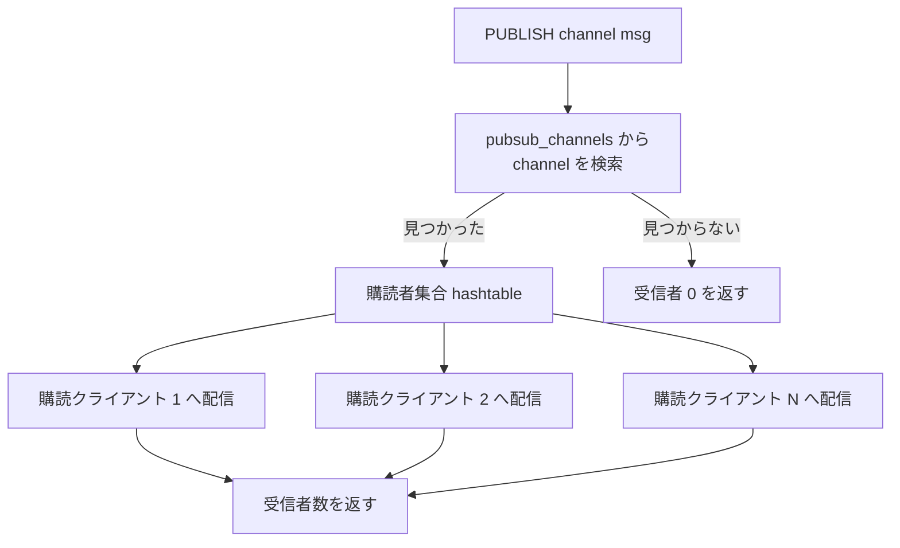

# 第43章 Pub/Sub

> **本章で読むソース**
>
> - [`src/pubsub.c`](https://github.com/valkey-io/valkey/blob/9.1.0/src/pubsub.c)
> - [`src/server.h`](https://github.com/valkey-io/valkey/blob/9.1.0/src/server.h)

## この章の狙い

Valkey の Pub/Sub は、送り手と受け手が互いを知らないまま、チャンネルを介してメッセージをやりとりする仕組みである。
本章では、`SUBSCRIBE` でチャンネルを購読してから `PUBLISH` で配信が届くまでの経路を、サーバ側のデータ構造とともに読む。
チャンネル名から購読者の集合へ直接たどり着くルーティングと、クラスタでの配信範囲をスロット内に閉じるシャード Pub/Sub という、二つの設計を機構のレベルで理解できるようになる。

## 前提

- [第26章 RESP プロトコルと応答生成](../part04-server-events/26-resp-protocol.md)：購読者へのメッセージは RESP3 のプッシュ型で送られる。
- [第30章 データベース](../part05-database/30-database.md)：チャンネルの集合は `kvstore` で保持される。

## チャンネルと購読者を結ぶデータ構造

Pub/Sub の中心にあるのは、チャンネル名から、そのチャンネルを購読しているクライアントの集合への対応である。
この対応をサーバ全体で一つ持つのが `server.pubsub_channels` である。

[`src/server.h` L2258-L2264](https://github.com/valkey-io/valkey/blob/9.1.0/src/server.h#L2258-L2264)

```c
/* Pubsub */
kvstore *pubsub_channels;      /* Map channels to list of subscribed clients */
dict *pubsub_patterns;         /* A dict of pubsub_patterns */
int notify_keyspace_events;    /* Events to propagate via Pub/Sub. This is an
                                  xor of NOTIFY_... flags. */
kvstore *pubsubshard_channels; /* Map shard channels in every slot to list of subscribed clients */
unsigned int pubsub_clients;   /* # of clients in Pub/Sub mode */
```

`pubsub_channels` は `kvstore`、つまりスロットごとに分割されたハッシュテーブルの集まりである。
キーはチャンネル名、値はそのチャンネルを購読するクライアントを要素に持つ `hashtable` である。
通常の Pub/Sub はスロットを区別しないので、ここではスロット 0 だけを使う。
`pubsubshard_channels` は同じ構造をシャード Pub/Sub のために持ち、こちらはスロットを実際に使い分ける。
パターン購読は数が少ないと見込まれるため、`kvstore` ではなく単純な `dict` の `pubsub_patterns` に置く。

クライアント側にも、自分が何を購読しているかの記録がある。

[`src/server.h` L1212-L1223](https://github.com/valkey-io/valkey/blob/9.1.0/src/server.h#L1212-L1223)

```c
typedef struct ClientPubSubData {
    hashtable *pubsub_channels;      /* channels a client is interested in (SUBSCRIBE) */
    hashtable *pubsub_patterns;      /* patterns a client is interested in (PSUBSCRIBE) */
    hashtable *pubsubshard_channels; /* shard level channels a client is interested in (SSUBSCRIBE) */
    /* ... (中略) ... */
} ClientPubSubData;
```

`ClientPubSubData` はクライアント構造体に直接埋め込まず、必要になったときに `initClientPubSubData` で確保する。
Pub/Sub を一度も使わないクライアントにこの領域を持たせないための遅延確保であり、通常のコマンドだけを実行するクライアントのメモリを節約する。

つまり購読関係は両方向で保持される。
サーバの `pubsub_channels` はチャンネルから購読者をたどるためにあり、配信の起点で使う。
クライアントの `pubsub_channels` はそのクライアントが何を購読しているかをたどるためにあり、切断時の一括解除などで使う。

## 購読の登録

`SUBSCRIBE channel [channel ...]` を処理する `subscribeCommand` は、引数のチャンネルを一つずつ `pubsubSubscribeChannel` に渡すだけである。

[`src/pubsub.c` L575-L590](https://github.com/valkey-io/valkey/blob/9.1.0/src/pubsub.c#L575-L590)

```c
/* SUBSCRIBE channel [channel ...] */
void subscribeCommand(client *c) {
    int j;
    if (c->flag.deny_blocking && !c->flag.multi) {
        /* ... (中略：DENY BLOCKING クライアントは購読できない) ... */
        addReplyError(c, "SUBSCRIBE isn't allowed for a DENY BLOCKING client");
        return;
    }
    for (j = 1; j < c->argc; j++) pubsubSubscribeChannel(c, c->argv[j], pubSubType);
    markClientAsPubSub(c);
}
```

`pubsubSubscribeChannel` の第3引数 `pubSubType` は、通常の Pub/Sub とシャード Pub/Sub で処理本体を共有するための型である。
どちらの種別でも登録の手順は同じで、違いはどのサーバ側辞書を使うか、購読通知に何という語を返すかだけにまとめてある。

[`src/pubsub.c` L76-L97](https://github.com/valkey-io/valkey/blob/9.1.0/src/pubsub.c#L76-L97)

```c
/*
 * Pub/Sub type for global channels.
 */
pubsubtype pubSubType = {
    .shard = 0,
    .clientPubSubChannels = getClientPubSubChannels,
    .subscriptionCount = clientSubscriptionsCount,
    .serverPubSubChannels = &server.pubsub_channels,
    .subscribeMsg = &shared.subscribebulk,
    .unsubscribeMsg = &shared.unsubscribebulk,
    .messageBulk = &shared.messagebulk,
};

/*
 * Pub/Sub type for shard level channels bounded to a slot.
 */
pubsubtype pubSubShardType = {
    .shard = 1,
    .clientPubSubChannels = getClientPubSubShardChannels,
    .subscriptionCount = clientShardSubscriptionsCount,
    .serverPubSubChannels = &server.pubsubshard_channels,
    .subscribeMsg = &shared.ssubscribebulk,
    .unsubscribeMsg = &shared.sunsubscribebulk,
    .messageBulk = &shared.smessagebulk,
};
```

登録の本体が `pubsubSubscribeChannel` である。
ここで両方向のデータ構造に同時に書き込む。

[`src/pubsub.c` L290-L328](https://github.com/valkey-io/valkey/blob/9.1.0/src/pubsub.c#L290-L328)

```c
int pubsubSubscribeChannel(client *c, robj *channel, pubsubtype type) {
    hashtable *clients = NULL;
    int retval = 0;
    unsigned int slot = 0;

    if (!c->pubsub_data) initClientPubSubData(c);

    /* Add the channel to the client -> channels hash table */
    hashtablePosition position;
    if (hashtableFindPositionForInsert(type.clientPubSubChannels(c), channel, &position, NULL)) {
        /* Not yet subscribed to this channel */
        retval = 1;
        /* Add the client to the channel -> list of clients hash table */
        if (server.cluster_enabled && type.shard) {
            slot = getKeySlot(objectGetVal(channel));
        }

        hashtablePosition pos;
        void *existing;
        if (!kvstoreHashtableFindPositionForInsert(*type.serverPubSubChannels, slot, channel, &pos, &existing)) {
            clients = existing;
            channel = *(robj **)hashtableMetadata(clients);
        } else {
            /* Store pointer to channel name in the dict's metadata. */
            clients = hashtableCreate(&clientHashtableType);
            *(robj **)hashtableMetadata(clients) = channel;
            incrRefCount(channel);
            /* Insert this dict in the kvstore at the position returned above. */
            kvstoreHashtableInsertAtPosition(*type.serverPubSubChannels, slot, clients, &pos);
        }

        serverAssert(hashtableAdd(clients, c));
        hashtableInsertAtPosition(type.clientPubSubChannels(c), channel, &position);
        incrRefCount(channel);
    }
    /* Notify the client */
    addReplyPubsubSubscribed(c, channel, type);
    return retval;
}
```

最初の `hashtableFindPositionForInsert` は、クライアント側の購読チャンネル集合にそのチャンネルがまだ無いかを確かめ、無ければ挿入位置を `position` に得る。
すでに購読済みなら以降の処理を飛ばし、`retval` は 0 のままになる。
重複購読を辞書の検索一回で弾く構造であり、同じチャンネルへの二重登録を防ぐ。

未購読だった場合、サーバ側の辞書に対しても同じく挿入位置を先に求める。
チャンネルが初めて購読されるなら、購読者を入れる空の `hashtable` を作り、そのメタデータ領域にチャンネル名の `robj` へのポインタを保存してから、求めておいた位置へ挿入する。
すでに他のクライアントが購読しているチャンネルなら、既存の購読者集合を取り出して再利用する。
最後に、購読者集合へこのクライアントを加え、クライアント側の集合へチャンネルを加える。
挿入位置を先に求めてからそこへ挿入する形は、検索と挿入で辞書を二度たどらないための最適化である。

チャンネル名の `robj` は、サーバ側の購読者集合のメタデータと、クライアント側の購読集合の両方から参照される。
そのため `incrRefCount` で参照カウントを増やし、どちらか一方が解除されても文字列が解放されないようにしている。

## 配信のルーティング

配信の核心は `pubsubPublishMessageInternal` にある。
`PUBLISH channel message` は最終的にこの関数を呼ぶ。

[`src/pubsub.c` L508-L536](https://github.com/valkey-io/valkey/blob/9.1.0/src/pubsub.c#L508-L536)

```c
int pubsubPublishMessageInternal(robj *channel, robj *message, pubsubtype type) {
    int receivers = 0;
    void *element;
    dictEntry *de;
    dictIterator *di;
    int slot = -1;

    /* Send to clients listening for that channel */
    if (server.cluster_enabled && type.shard) {
        slot = keyHashSlot(objectGetVal(channel), sdslen(objectGetVal(channel)));
    }
    if (kvstoreHashtableFind(*type.serverPubSubChannels, (slot == -1) ? 0 : slot, channel, &element)) {
        hashtable *clients = element;
        hashtableIterator iter;
        hashtableInitIterator(&iter, clients, 0);
        void *c;
        while (hashtableNext(&iter, &c)) {
            addReplyPubsubMessage(c, channel, message, *type.messageBulk);
            clusterSlotStatsAddNetworkBytesOutForShardedPubSubInternalPropagation(c, slot);
            updateClientMemUsageAndBucket(c);
            receivers++;
        }
        hashtableCleanupIterator(&iter);
    }

    if (type.shard) {
        /* Shard pubsub ignores patterns. */
        return receivers;
    }
    /* ... (中略：パターン購読への配信が続く) ... */
```

配信はチャンネル名で `pubsub_channels` を引き、見つかった購読者集合だけを走査する。
`kvstoreHashtableFind` はハッシュ検索であり、購読者が居なければそのチャンネルのエントリは存在しないので、`PUBLISH` は何もせず受信者 0 を返す。
購読していないクライアントは、配信のたびに走査されることがない。
接続中のクライアントが何万あっても、`PUBLISH` の仕事量はそのチャンネルの購読者数にほぼ比例する。
これがチャンネルを辞書のキーにしたことの効果である。

各購読者へは `addReplyPubsubMessage` で `message` 型のメッセージを書き込む。

[`src/pubsub.c` L108-L119](https://github.com/valkey-io/valkey/blob/9.1.0/src/pubsub.c#L108-L119)

```c
void addReplyPubsubMessage(client *c, robj *channel, robj *msg, robj *message_bulk) {
    struct ClientFlags old_flags = c->flag;
    c->flag.pushing = 1;
    if (c->resp == 2)
        addReply(c, shared.mbulkhdr[3]);
    else
        addReplyPushLen(c, 3);
    addReply(c, message_bulk);
    addReplyBulk(c, channel);
    if (msg) addReplyBulk(c, msg);
    if (!old_flags.pushing) c->flag.pushing = 0;
}
```

応答は3要素である。
種別を表す `message`、チャンネル名、本文の順で並ぶ。
RESP3 のクライアント（`c->resp` が 2 でない）には `addReplyPushLen` でプッシュ型のヘッダを書く。
プッシュ型は、クライアントが送ったコマンドへの返答ではなく、サーバ側の都合で送り出される非同期メッセージを表す。
RESP2 のクライアントには配列ヘッダ `mbulkhdr[3]` で送る。

次の図は `PUBLISH` の経路を示す。



## パターン購読

`PSUBSCRIBE` は、固定のチャンネル名ではなく、グロブパターンに一致するチャンネルへのメッセージを受け取る購読である。
パターンは `pubsub_patterns` という `dict` に、パターン文字列をキー、購読者集合を値として登録する。

[`src/pubsub.c` L400-L420](https://github.com/valkey-io/valkey/blob/9.1.0/src/pubsub.c#L400-L420)

```c
bool pubsubSubscribePattern(client *c, robj *pattern) {
    if (!c->pubsub_data) initClientPubSubData(c);
    bool pattern_added = hashtableAdd(c->pubsub_data->pubsub_patterns, pattern);
    if (pattern_added) {
        incrRefCount(pattern);
        /* Add the client to the pattern -> list of clients hash table */
        hashtable *clients;
        dictEntry *de = dictFind(server.pubsub_patterns, pattern);
        if (de == NULL) {
            clients = hashtableCreate(&clientHashtableType);
            dictAdd(server.pubsub_patterns, pattern, clients);
            incrRefCount(pattern);
        } else {
            clients = dictGetVal(de);
        }
        serverAssert(hashtableAdd(clients, c));
    }
    /* Notify the client */
    addReplyPubsubPatSubscribed(c, pattern);
    return pattern_added;
}
```

配信側では、チャンネル名による直接検索とは扱いが異なる。
パターンはチャンネル名と文字単位で一致するとは限らないので、辞書を引いて済ますことができない。
`pubsubPublishMessageInternal` は、チャンネル購読者へ配り終えたあと、登録されている全パターンを走査する。

[`src/pubsub.c` L538-L562](https://github.com/valkey-io/valkey/blob/9.1.0/src/pubsub.c#L538-L562)

```c
    /* Send to clients listening to matching channels */
    di = dictGetIterator(server.pubsub_patterns);
    if (di) {
        channel = getDecodedObject(channel);
        while ((de = dictNext(di)) != NULL) {
            robj *pattern = dictGetKey(de);
            hashtable *clients = dictGetVal(de);
            if (!stringmatchlen((char *)objectGetVal(pattern), sdslen(objectGetVal(pattern)),
                                (char *)objectGetVal(channel), sdslen(objectGetVal(channel)), 0))
                continue;

            hashtableIterator iter;
            hashtableInitIterator(&iter, clients, 0);
            void *c;
            while (hashtableNext(&iter, &c)) {
                addReplyPubsubPatMessage(c, pattern, channel, message);
                updateClientMemUsageAndBucket(c);
                receivers++;
            }
            hashtableCleanupIterator(&iter);
        }
        decrRefCount(channel);
        dictReleaseIterator(di);
    }
    return receivers;
```

各パターンについて `stringmatchlen` でチャンネル名との一致を判定し、一致したパターンの購読者にだけ配信する。
パターン配信のメッセージは `pmessage` 型で、本文の前に一致したパターンが添えられる。
受け手が複数のパターンを購読しているとき、どのパターンに反応したメッセージなのかを区別できるようにするためである。

パターンは登録数だけ毎回の `PUBLISH` で走査される。
チャンネル購読が辞書一回の検索で済むのに対し、パターン購読は登録パターン数に比例する文字列照合を伴う。
この走査が `PUBLISH` ごとに走るので、パターン購読は機能としては便利でも、チャンネル購読より配信時の費用が高い。

## シャード Pub/Sub

クラスタでは、通常の Pub/Sub のメッセージはどのノードにも届く必要がある。
あるノードへの `PUBLISH` は、購読者がどのノードに繋いでいるか分からないため、クラスタの全ノードへブロードキャストされる。
購読者の少ないチャンネルでも、配信のたびにノード間でメッセージが行き交うことになる。

シャード Pub/Sub は、この配信範囲をスロット単位に閉じることでブロードキャストを避ける。
`SSUBSCRIBE`/`SPUBLISH` は、チャンネル名をキーと同じハッシュ規則でスロットへ割り当て、そのスロットを担当するノードの中だけで購読と配信を完結させる。
登録は通常のチャンネルと同じ `pubsubSubscribeChannel` を `pubSubShardType` で呼ぶ。

[`src/pubsub.c` L751-L764](https://github.com/valkey-io/valkey/blob/9.1.0/src/pubsub.c#L751-L764)

```c
/* SSUBSCRIBE shardchannel [shardchannel ...] */
void ssubscribeCommand(client *c) {
    if (c->flag.deny_blocking) {
        /* A client that has CLIENT_DENY_BLOCKING flag on
         * expect a reply per command and so can not execute subscribe. */
        addReplyError(c, "SSUBSCRIBE isn't allowed for a DENY BLOCKING client");
        return;
    }

    for (int j = 1; j < c->argc; j++) {
        pubsubSubscribeChannel(c, c->argv[j], pubSubShardType);
    }
    markClientAsPubSub(c);
}
```

スロットの割り当ては、登録時には `pubsubSubscribeChannel` の中で `getKeySlot` により、配信時には `pubsubPublishMessageInternal` の冒頭で `keyHashSlot` により求める。
求めたスロットは `kvstore` のスロット番号として使われ、`pubsubshard_channels` の対応するスロットのハッシュテーブルだけを引く。
これにより、同じチャンネル名は常に同じスロット、同じ担当ノードへ集まる。

シャード配信はパターンを扱わない。
先に読んだ `pubsubPublishMessageInternal` で、`type.shard` が立っているときはチャンネル購読者へ配り終えた時点で `return` し、パターン走査へ進まない。
スロット内に閉じた配信の中でクラスタ全体のパターンを照合する意味がないからである。

`SPUBLISH` のクラスタへの伝播も、担当スロットを持つノードの範囲にとどまる。

[`src/pubsub.c` L643-L647](https://github.com/valkey-io/valkey/blob/9.1.0/src/pubsub.c#L643-L647)

```c
int pubsubPublishMessageAndPropagateToCluster(robj *channel, robj *message, int sharded) {
    int receivers = pubsubPublishMessage(channel, message, sharded);
    if (server.cluster_enabled) clusterPropagatePublish(channel, message, sharded);
    return receivers;
}
```

クラスタ無効時は `server.cluster_enabled` が偽なので、シャード Pub/Sub も単一ノード内の通常の Pub/Sub と同じく動く。
スロットの割り当ては行われるが、スロットは常に 0 として扱われ、ノード間の伝播は起きない。
クラスタ自体の仕組みは [第39章 クラスタ](../part07-replication-cluster/39-cluster.md) で扱う。

## 解除とクライアント切断

購読の解除は登録の逆をたどる。
`pubsubUnsubscribeChannel` は、クライアント側の集合からチャンネルを消し、サーバ側の購読者集合からそのクライアントを消す。

[`src/pubsub.c` L332-L366](https://github.com/valkey-io/valkey/blob/9.1.0/src/pubsub.c#L332-L366)

```c
int pubsubUnsubscribeChannel(client *c, robj *channel, int notify, pubsubtype type) {
    hashtable *clients;
    int retval = 0;
    int slot = 0;

    /* ... (中略) ... */
    if (hashtableDelete(type.clientPubSubChannels(c), channel)) {
        retval = 1;
        /* ... (中略：シャードならスロットを求める) ... */
        void *found = NULL;
        kvstoreHashtableFind(*type.serverPubSubChannels, slot, channel, &found);
        serverAssertWithInfo(c, NULL, found);
        clients = found;
        serverAssertWithInfo(c, NULL, hashtableDelete(clients, c));
        if (hashtableSize(clients) == 0) {
            /* Free the dict and associated hash entry at all if this was
             * the latest client, so that it will be possible to abuse
             * PUBSUB creating millions of channels. */
            kvstoreHashtableDelete(*type.serverPubSubChannels, slot, channel);
        }
    }
    /* ... (中略) ... */
    return retval;
}
```

最後の購読者が抜けると、そのチャンネルの購読者集合ごと `pubsub_channels` から削除する。
購読者の居ないチャンネルのエントリをサーバに残さないための後始末であり、これがないと、購読のない大量のチャンネル名が辞書に溜まっていく。

クライアントが切断されるときは `freeClientPubSubData` が、そのクライアントの購読をチャンネル、シャードチャンネル、パターンの順ですべて解除する。

[`src/pubsub.c` L268-L286](https://github.com/valkey-io/valkey/blob/9.1.0/src/pubsub.c#L268-L286)

```c
void freeClientPubSubData(client *c) {
    if (!c->pubsub_data) return;
    /* Unsubscribe from all the pubsub channels */
    pubsubUnsubscribeAllChannels(c, 0);
    pubsubUnsubscribeShardAllChannels(c, 0);
    pubsubUnsubscribeAllPatterns(c, 0);
    unmarkClientAsPubSub(c);
    /* ... (中略：各 hashtable を解放) ... */
    zfree(c->pubsub_data);
    c->pubsub_data = NULL;
}
```

クライアント側の集合がそのクライアントの全購読をたどれるので、切断時にサーバ全体の `pubsub_channels` を走査せずに解除を済ませられる。
両方向で購読関係を持つことが、ここで効いている。

## キースペース通知という応用

Valkey 内部のいくつかの機能は、この Pub/Sub の上に乗っている。
キースペース通知は、キーへの操作（`SET`、`DEL`、有効期限切れなど）が起きたときに、その出来事をあらかじめ決まった名前のチャンネルへ `PUBLISH` する仕組みである。
`server.pubsub_channels` に並んだ `notify_keyspace_events` というフラグ群が、どの種類のイベントを通知するかを表す。
通知の本体は通常の Pub/Sub の配信を使うので、購読側は `__keyspace@0__:foo` のようなチャンネルを `SUBSCRIBE` するだけで、キーの変化を受け取れる。
キースペース通知の詳しい仕組みは [第34章 キースペース通知](../part05-database/34-keyspace-notifications.md) で扱う。

## まとめ

- Pub/Sub は、チャンネルを介して送り手と受け手を疎結合にする。送り手は購読者を知らず、受け手は誰が送ったかを知らない。
- サーバの `pubsub_channels`（`kvstore`）はチャンネルから購読者集合への辞書であり、`PUBLISH` はそのチャンネルの購読者だけを走査する。無関係なクライアントを走査しないことが配信を軽くする。
- クライアント側にも購読集合があり、購読関係を両方向で持つ。これにより切断時の一括解除をサーバ全体の走査なしに行える。
- パターン購読（`PSUBSCRIBE`）は `pubsub_patterns` に登録し、`PUBLISH` のたびに全パターンを文字列照合する。便利だが配信時の費用はチャンネル購読より高い。
- シャード Pub/Sub（`SSUBSCRIBE`/`SPUBLISH`）はチャンネルをスロットへ割り当て、配信を担当ノード内に閉じる。クラスタ全体へのブロードキャストを避ける。
- 購読者へのメッセージは RESP3 のプッシュ型で送られ、キースペース通知などの内部機能がこの配信の上に乗る。

## 関連する章

- [第26章 RESP プロトコルと応答生成](../part04-server-events/26-resp-protocol.md)：プッシュ型メッセージの形式。
- [第34章 キースペース通知](../part05-database/34-keyspace-notifications.md)：Pub/Sub の上に乗るキー変化の通知。
- [第39章 クラスタ](../part07-replication-cluster/39-cluster.md)：スロットと担当ノードの仕組み。
