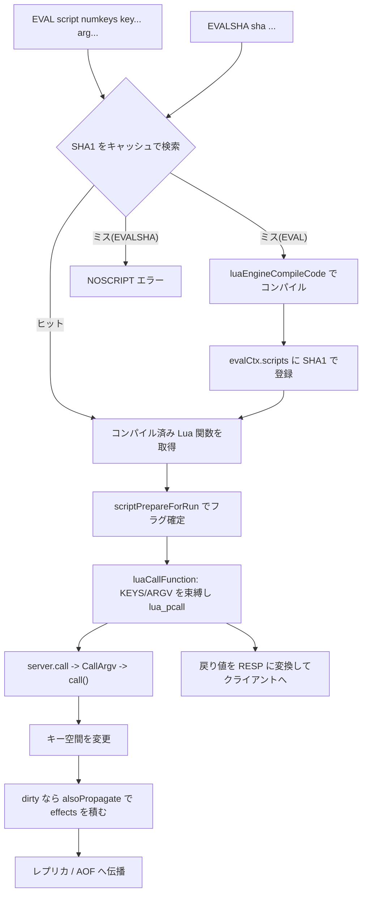

# 第44章 スクリプティング EVAL/Lua

> **本章で読むソース**
>
> - [`src/eval.c`](https://github.com/valkey-io/valkey/blob/9.1.0/src/eval.c)
> - [`src/script.c`](https://github.com/valkey-io/valkey/blob/9.1.0/src/script.c)
> - [`src/scripting_engine.c`](https://github.com/valkey-io/valkey/blob/9.1.0/src/scripting_engine.c)
> - [`src/modules/lua/script_lua.c`](https://github.com/valkey-io/valkey/blob/9.1.0/src/modules/lua/script_lua.c)
> - [`src/modules/lua/engine_lua.c`](https://github.com/valkey-io/valkey/blob/9.1.0/src/modules/lua/engine_lua.c)

## この章の狙い

`EVAL` はサーバ上で Lua スクリプトを実行し、その中から `redis.call`/`server.call` で任意のコマンドを呼べる仕組みである。
本章では、スクリプト本文を SHA1 でキャッシュして再送を省く最適化と、スクリプトを単一スレッドで割り込みなく走らせる原子実行の設計を、実コードで追う。
さらに、スクリプトが起こした変更をレプリカと AOF へどう伝えるか（effects 伝播）を、コマンド実行の経路に沿って読む。

## 前提

- コマンドが `processCommand` から `call()` を経て実行される流れは[第27章](../part04-server-events/27-command-execution.md)で扱う。本章の `server.call` はその経路に合流する。
- レプリケーションへの伝播は[第38章](../part07-replication-cluster/38-replication.md)、AOF への伝播は[第36章](../part06-persistence/36-aof.md)で扱う。
- スクリプトキャッシュを使わず関数として登録する `FUNCTION` は[第45章](45-functions.md)で扱う。本章の `EVAL` と同じスクリプティングエンジン層を共有する。

## EVAL コマンドの入口と引数の受け渡し

`EVAL script numkeys key... arg...` は、スクリプト本文に続けてキーの個数 `numkeys` を渡し、以降の引数を `numkeys` 個のキーと残りの引数に分ける。
スクリプト側はキーを `KEYS`、引数を `ARGV` という配列で受け取る。
入口の `evalCommand` は `evalGenericCommand` に処理を委ね、引数の振り分けはそこで行われる。

[`src/eval.c` L472-L539](https://github.com/valkey-io/valkey/blob/9.1.0/src/eval.c#L472-L539)

```c
static void evalGenericCommand(client *c, int evalsha) {
    char sha[41];
    long long numkeys;

    /* Get the number of arguments that are keys */
    if (getLongLongFromObjectOrReply(c, c->argv[2], &numkeys, NULL) != C_OK) return;
    if (numkeys > (c->argc - 3)) {
        addReplyError(c, "Number of keys can't be greater than number of args");
        return;
    } else if (numkeys < 0) {
        addReplyError(c, "Number of keys can't be negative");
        return;
    }
    // ... (中略) ...
}
```

`c->argv[1]` がスクリプト本文、`c->argv[2]` が `numkeys` であり、`c->argv[3]` 以降をキーと引数に分割する。
分割した配列は、後述の実行時に `c->argv + 3` をキー先頭、`c->argv + 3 + numkeys` を引数先頭として渡す。

キーと引数を Lua の `KEYS`/`ARGV` グローバルとして見せるのは、Lua エンジン側の `luaCallFunction` である。
渡された配列から Lua のテーブルを作り、`EVAL` のときはグローバル変数に束縛する。

[`src/modules/lua/script_lua.c` L2079-L2095](https://github.com/valkey-io/valkey/blob/9.1.0/src/modules/lua/script_lua.c#L2079-L2095)

```c
    /* Populate the argv and keys table accordingly to the arguments that
     * EVAL received. */
    luaCreateArray(lua, keys, nkeys);
    /* On eval, keys and arguments are globals. */
    if (type == VMSE_EVAL) {
        /* open global protection to set KEYS */
        lua_enablereadonlytable(lua, LUA_GLOBALSINDEX, 0);
        lua_setglobal(lua, "KEYS");
        lua_enablereadonlytable(lua, LUA_GLOBALSINDEX, 1);
    }
    luaCreateArray(lua, args, nargs);
    if (type == VMSE_EVAL) {
        /* open global protection to set ARGV */
        lua_enablereadonlytable(lua, LUA_GLOBALSINDEX, 0);
        lua_setglobal(lua, "ARGV");
        lua_enablereadonlytable(lua, LUA_GLOBALSINDEX, 1);
    }
```

`KEYS`/`ARGV` を束縛する前後で `lua_enablereadonlytable` を切り替えているのは、グローバルテーブルを通常は書き込み禁止にして、スクリプトが偶発的にグローバルを汚すのを防いでいるためである。
束縛のあいだだけ保護を外し、終わったら戻す。

Valkey 9.1.0 では、Lua の実行系がサーバ本体から `src/modules/lua/` 配下のスクリプティングエンジンとして切り出されている。
`EVAL` 固有の処理（引数分割、キャッシュ、SHA1）は `src/eval.c` に残り、Lua の解釈と `server.call` の提供は Lua エンジンが担う。
両者をつなぐのが `src/scripting_engine.c` のエンジン呼び出し層であり、`FUNCTION`（第45章）も同じ層を共有する。

## スクリプトキャッシュとEVALSHA

同じスクリプトを毎回ネットワーク越しに送り直すのは無駄が大きい。
そこで Valkey は、スクリプト本文の SHA1 をキーにしてコンパイル済みのスクリプトをサーバ側に保持し、`EVALSHA <sha>` で本文を送らずに再実行できるようにする。
これが最適化の核の一つである。

キャッシュの実体は `evalCtx` 構造体が持つ辞書とリストである。

[`src/eval.c` L88-L93](https://github.com/valkey-io/valkey/blob/9.1.0/src/eval.c#L88-L93)

```c
/* Eval context */
struct evalCtx {
    dict *scripts;                  /* A dictionary of SHA1 -> evalScript */
    list *scripts_lru_list;         /* A list of SHA1, first in first out LRU eviction. */
    unsigned long long scripts_mem; /* Cached scripts' memory + oh */
} evalCtx;
```

`scripts` が SHA1 文字列から `evalScript` への辞書であり、`evalScript` はコンパイル済みのスクリプト、所属エンジン、元の本文、宣言フラグを束ねる。

[`src/eval.c` L58-L64](https://github.com/valkey-io/valkey/blob/9.1.0/src/eval.c#L58-L64)

```c
typedef struct evalScript {
    compiledFunction *script;
    scriptingEngine *engine;
    robj *body;
    uint64_t flags;
    listNode *node; /* list node in scripts_lru_list list. */
} evalScript;
```

`EVAL` か `EVALSHA` かで、参照する SHA1 の求め方が分かれる。
`EVAL` は本文を `sha1hex` でハッシュして求め、`EVALSHA` は受け取った 40 文字をそのまま小文字化して使う。

[`src/eval.c` L211-L228](https://github.com/valkey-io/valkey/blob/9.1.0/src/eval.c#L211-L228)

```c
static void evalCalcScriptHash(int evalsha, sds script, char *out_sha) {
    /* We obtain the script SHA1, then check if this function is already
     * defined into the Lua state */
    if (!evalsha) {
        /* Hash the code if this is an EVAL call */
        sha1hex(out_sha, script, sdslen(script));
    } else {
        /* We already have the SHA if it is an EVALSHA */
        int j;
        char *sha = script;

        /* Convert to lowercase. We don't use tolower since the function
         * managed to always show up in the profiler output consuming
         * a non trivial amount of time. */
        for (j = 0; j < 40; j++) out_sha[j] = (sha[j] >= 'A' && sha[j] <= 'Z') ? sha[j] + ('a' - 'A') : sha[j];
        out_sha[40] = '\0';
    }
}
```

求めた SHA1 で辞書を引き、見つからなければ分岐する。
`EVALSHA` でキャッシュに無ければ、本文を持たないので実行できず `NOSCRIPT` エラーを返す。
`EVAL` で無ければ、本文があるので新規にコンパイルして登録する。

[`src/eval.c` L493-L510](https://github.com/valkey-io/valkey/blob/9.1.0/src/eval.c#L493-L510)

```c
    dictEntry *entry = dictFind(evalCtx.scripts, sha);

    if (evalsha && entry == NULL) {
        /* Calling EVALSHA using an hash that was never added to the scripts
         * cache. */
        addReplyErrorObject(c, shared.noscripterr);
        return;
    }

    if (entry == NULL) {
        robj *body = c->argv[1];
        char *_sha = sha;
        if (evalRegisterNewScript(c, body, &_sha) != C_OK) {
            return;
        }
        entry = dictFind(evalCtx.scripts, sha);
        serverAssert(entry != NULL);
    }
```

新規登録の `evalRegisterNewScript` は、本文をエンジンに渡してコンパイルし、得たコンパイル済み関数を `evalScript` として辞書に入れる。
コンパイルは `scriptingEngineCallCompileCode` を介してエンジンの `compile_code` を呼ぶ。

[`src/eval.c` L425-L467](https://github.com/valkey-io/valkey/blob/9.1.0/src/eval.c#L425-L467)

```c
    robj *_err = NULL;
    size_t num_compiled_functions = 0;
    compiledFunction **functions =
        scriptingEngineCallCompileCode(engine,
                                       VMSE_EVAL,
                                       (sds)objectGetVal(body) + shebang_len,
                                       sdslen(objectGetVal(body)) - shebang_len,
                                       0,
                                       &num_compiled_functions,
                                       &_err);
    // ... (中略) ...
    /* We also save a SHA1 -> Original script map in a dictionary
     * so that we can replicate / write in the AOF all the
     * EVALSHA commands as EVAL using the original script. */
    evalScript *es = zcalloc(sizeof(evalScript));
    es->script = functions[0];
    es->engine = engine;
    es->flags = script_flags;
    sds _sha = sdsnew(*sha);
    if (!is_script_load) {
        /* Script eviction only applies to EVAL, not SCRIPT LOAD. */
        es->node = scriptsLRUAdd(c, _sha);
    }
    es->body = body;
    int retval = dictAdd(evalCtx.scripts, _sha, es);
    serverAssert(retval == DICT_OK);
    evalCtx.scripts_mem += sdsAllocSize(_sha) + getStringObjectSdsUsedMemory(body);
    incrRefCount(body);
    zfree(functions);
```

Lua エンジン側の `compile_code` にあたる `luaEngineCompileCode` は、`luaL_loadbuffer` で本文をコンパイルし、得た Lua 関数を Lua レジストリに登録して、その参照番号を `compiledFunction` として返す。

[`src/modules/lua/engine_lua.c` L253-L288](https://github.com/valkey-io/valkey/blob/9.1.0/src/modules/lua/engine_lua.c#L253-L288)

```c
    if (type == VMSE_EVAL) {
        lua_State *lua = lua_engine_ctx->eval_lua;

        if (luaL_loadbuffer(
                lua, code, code_len, "@user_script")) {
            *err = ValkeyModule_CreateStringPrintf(module_ctx, "Error compiling script (new function): %s", lua_tostring(lua, -1));
            lua_pop(lua, 1);
            return functions;
        }

        ValkeyModule_Assert(lua_isfunction(lua, -1));
        int function_ref = luaL_ref(lua, LUA_REGISTRYINDEX);

        luaFunction *script = ValkeyModule_Calloc(1, sizeof(luaFunction));
        *script = (luaFunction){
            .lua = lua,
            .function_ref = function_ref,
        };
        // ... (中略) ...
    }
```

ここがキャッシュによる最適化の機構である。
コンパイルは初回の `EVAL` でだけ走り、以後は SHA1 から Lua 関数の参照を引いて即座に呼ぶ。
2 回目以降は本文の送信もパースもパースエラー検査も省け、レイテンシと CPU を節約できる。
`SCRIPT LOAD` は実行せずにこの登録だけを行い、`EVALSHA` で呼ぶ運用を支える。

### EVAL 由来のスクリプトだけを退避する

`EVAL` を毎回違う本文で呼ぶ使い方をすると、キャッシュが無制限に増えてメモリを食う。
そこで `EVAL` 経由で登録されたスクリプトには上限つきの LRU 退避を設け、`SCRIPT LOAD` で明示登録したものは退避しない。
退避対象を `EVAL` 由来に限るのは、`EVALSHA` がキャッシュ消失で失敗するリスクを避けつつ、濫用の発生源だけを抑えるためである。

[`src/eval.c` L350-L364](https://github.com/valkey-io/valkey/blob/9.1.0/src/eval.c#L350-L364)

```c
#define LRU_LIST_LENGTH 500
static listNode *scriptsLRUAdd(client *c, sds sha) {
    /* Evict oldest. */
    while (listLength(evalCtx.scripts_lru_list) >= LRU_LIST_LENGTH) {
        listNode *ln = listFirst(evalCtx.scripts_lru_list);
        sds oldest = listNodeValue(ln);
        evalDeleteScript(c, oldest);
        listDelNode(evalCtx.scripts_lru_list, ln);
        server.stat_evictedscripts++;
    }

    /* Add current. */
    listAddNodeTail(evalCtx.scripts_lru_list, sdsdup(sha));
    return listLast(evalCtx.scripts_lru_list);
}
```

上限は 500 件で、超えると先頭（最も古い）から捨てる。
スクリプトの数は鍵ほど多くないので、厳密なソート済み LRU は要らず、使用のたびにリスト末尾へ繋ぎ直す軽い実装で足りる。

## スクリプトの原子実行

スクリプトは単一スレッドのイベントループ上で、他のコマンドに割り込まれずに最後まで走る。
途中の `server.call` がキー空間を直接操作し、スクリプトが終わるまでその間に他クライアントのコマンドは実行されない。
これが設計の核の一つであり、複数操作をまとめて一貫した状態で行える根拠になる。

実行に入る前に、`scriptPrepareForRun` が実行コンテキスト `scriptRunCtx` を整える。
ここで書き込み可否や決定性に関わるフラグを確定し、現在走行中のスクリプトとして登録する。

[`src/script.c` L213-L244](https://github.com/valkey-io/valkey/blob/9.1.0/src/script.c#L213-L244)

```c
    run_ctx->engine = engine;

    run_ctx->original_client = caller;
    run_ctx->funcname = funcname;
    run_ctx->slot = caller->slot;
    run_ctx->original_db = caller->db;

    run_ctx->start_time = getMonotonicUs();

    run_ctx->flags = 0;
    run_ctx->repl_flags = PROPAGATE_AOF | PROPAGATE_REPL;

    if (ro || (!(script_flags & SCRIPT_FLAG_EVAL_COMPAT_MODE) && (script_flags & SCRIPT_FLAG_NO_WRITES))) {
        /* On fcall_ro or on functions that do not have the 'write'
         * flag, we will not allow write commands. */
        run_ctx->flags |= SCRIPT_READ_ONLY;
    }
    // ... (中略) ...
    /* set the curr_run_ctx so we can use it to kill the script if needed */
    curr_run_ctx = run_ctx;

    return C_OK;
```

`repl_flags` を `PROPAGATE_AOF | PROPAGATE_REPL` で初期化しているのが、後述の effects 伝播の既定値である。
`*_ro` 系コマンドや `no-writes` フラグつきのスクリプトでは `SCRIPT_READ_ONLY` を立て、書き込みコマンドを拒む。
`curr_run_ctx` に格納することで、走行中のスクリプトを `SCRIPT KILL` が参照できるようにする。

準備が整うと `evalGenericCommand` はエンジンの関数呼び出し層に実行を委ね、終わると後始末する。

[`src/eval.c` L512-L531](https://github.com/valkey-io/valkey/blob/9.1.0/src/eval.c#L512-L531)

```c
    evalScript *es = dictGetVal(entry);
    int ro = c->cmd->proc == evalRoCommand || c->cmd->proc == evalShaRoCommand;

    scriptRunCtx rctx;
    if (scriptPrepareForRun(&rctx, es->engine, c, sha, es->flags, ro) != C_OK) {
        return;
    }
    rctx.flags |= SCRIPT_EVAL_MODE; /* mark the current run as EVAL (as opposed to FCALL) so we'll
                                      get appropriate error messages and logs */

    scriptingEngineCallFunction(es->engine,
                                &rctx,
                                c,
                                es->script,
                                VMSE_EVAL,
                                c->argv + 3,
                                numkeys,
                                c->argv + 3 + numkeys,
                                c->argc - 3 - numkeys);
    scriptResetRun(&rctx);
```

`SCRIPT_EVAL_MODE` を立てるのは、`EVAL` と `FCALL`（第45章）でエラーメッセージや `SCRIPT KILL`/`FUNCTION KILL` の対象を区別するためである。
`c->argv + 3` をキー先頭、`c->argv + 3 + numkeys` を引数先頭として渡す点が、冒頭の引数分割の帰結にあたる。

実際に Lua 関数を呼ぶのは `luaCallFunction` で、`lua_pcall` でスクリプト本体を走らせ、戻り値を RESP に変換してクライアントへ返す。

[`src/modules/lua/script_lua.c` L2103-L2108](https://github.com/valkey-io/valkey/blob/9.1.0/src/modules/lua/script_lua.c#L2103-L2108)

```c
    int err;
    if (type == VMSE_EVAL) {
        err = lua_pcall(lua, 0, 1, -2);
    } else {
        err = lua_pcall(lua, 2, 1, -4);
    }
```

`lua_pcall` はスクリプトを最後まで走らせて返るので、その間メインスレッドは他のコマンドを処理しない。
これが原子実行の実体である。

### 長時間スクリプトへの対処

割り込まれない実行は一貫性を保証する一方、無限ループや重いスクリプトはサーバを止めてしまう。
そこで実行中に定期的に呼ばれる `scriptInterrupt` が、経過時間が閾値を超えたらビジー状態に入り、限られたコマンドだけ応答できるよう一時的にイベントループへ戻る。

[`src/script.c` L83-L107](https://github.com/valkey-io/valkey/blob/9.1.0/src/script.c#L83-L107)

```c
    if (server.busy_reply_threshold == 0) {
        return SCRIPT_CONTINUE;
    }

    long long elapsed = elapsedMs(run_ctx->start_time);
    if (elapsed < server.busy_reply_threshold) {
        return SCRIPT_CONTINUE;
    }

    serverLog(LL_WARNING,
              "Slow script detected: still in execution after %lld milliseconds. "
              "You can try killing the script using the %s command. Script name is: %s.",
              elapsed, (run_ctx->flags & SCRIPT_EVAL_MODE) ? "SCRIPT KILL" : "FUNCTION KILL", run_ctx->funcname);

    enterScriptTimedoutMode(run_ctx);
    // ... (中略) ...
    processEventsWhileBlocked();

    return (run_ctx->flags & SCRIPT_KILLED) ? SCRIPT_KILL : SCRIPT_CONTINUE;
```

閾値 `busy_reply_threshold` を超えると警告ログを出し、`SCRIPT KILL` を受け付けられる状態にする。
ただし `SCRIPT KILL` で止められるのは、まだ書き込みをしていないスクリプトに限る。
すでに書き込んだスクリプトを途中で殺すと、原子性が壊れて中途半端な状態が残るからである。

[`src/script.c` L294-L300](https://github.com/valkey-io/valkey/blob/9.1.0/src/script.c#L294-L300)

```c
    if (curr_run_ctx->flags & SCRIPT_WRITE_DIRTY) {
        addReplyError(c, "-UNKILLABLE Sorry the script already executed write "
                         "commands against the dataset. You can either wait the "
                         "script termination or kill the server in a hard way "
                         "using the SHUTDOWN NOSAVE command.");
        return;
    }
```

## server.callからコマンド実行への合流

スクリプトが `server.call`（互換用の別名が `redis.call`）を呼ぶと、`luaServerGenericCommand` が Lua スタック上の引数をコマンド引数に組み立て、モジュールのコマンド呼び出し API `CallArgv` に渡す。
ここで付ける呼び出しフラグが、スクリプトモードと伝播の挙動を決める。

[`src/modules/lua/script_lua.c` L1185-L1216](https://github.com/valkey-io/valkey/blob/9.1.0/src/modules/lua/script_lua.c#L1185-L1216)

```c
    int flags = VALKEYMODULE_CALL_ARGV_SCRIPT_MODE |
                VALKEYMODULE_CALL_ARGV_REPLICATE |
                VALKEYMODULE_CALL_ARGV_ERRORS_AS_REPLIES |
                VALKEYMODULE_CALL_ARGV_RESPECT_DENY_OOM |
                VALKEYMODULE_CALL_ARGV_REPLY_EXACT;

    if (!(rctx->replication_flags & PROPAGATE_AOF)) {
        flags |= VALKEYMODULE_CALL_ARGV_NO_AOF;
    }
    if (!(rctx->replication_flags & PROPAGATE_REPL)) {
        flags |= VALKEYMODULE_CALL_ARGV_NO_REPLICAS;
    }
    // ... (中略) ...
    errno = 0;
    int res = ValkeyModule_CallArgv(rctx->module_ctx, argv, argc, flags, &handlers, &call_ctx);
    ValkeyModule_Assert(res == VALKEYMODULE_OK);
```

`VALKEYMODULE_CALL_ARGV_SCRIPT_MODE` はこの呼び出しがスクリプト由来であることを示し、`VALKEYMODULE_CALL_ARGV_REPLICATE` は実行したコマンドを伝播対象にする。
`rctx->replication_flags` はスクリプトが `server.set_repl` で切り替えた伝播設定を反映し、AOF やレプリカへの伝播を個別に止められる。

`CallArgv` の先では、スクリプトモードのとき書き込み可否やクラスタのスロット整合を検査する。
読み取り専用スクリプトが書き込みコマンドを呼べば、ここで弾く。

[`src/module.c` L6824-L6839](https://github.com/valkey-io/valkey/blob/9.1.0/src/module.c#L6824-L6839)

```c
    /* Script mode tests */
    if (flags & VALKEYMODULE_CALL_ARGV_SCRIPT_MODE) {
        // ... (中略) ...
        if (is_running_script && scriptIsReadOnly() && (cmd_flags & (CMD_WRITE | CMD_MAY_REPLICATE))) {
            errno = ENOSPC;
            reply_error_msg = sdsnew("Write commands are not allowed from read-only scripts.");
            goto cleanup;
        }

        /* If the script already made a modification to the dataset, we can't
         * fail it on unpredictable error state. */
        if ((is_running_script && !scriptIsWriteDirty() && cmd_flags & CMD_WRITE) ||
            (!is_running_script && cmd_flags & CMD_WRITE)) {
```

書き込みコマンドを実行すると判断した時点で `scriptSetWriteDirtyFlag` を呼び、先の `SCRIPT KILL` 不可判定に使う書き込み済みフラグを立てる。

[`src/module.c` L6871-L6873](https://github.com/valkey-io/valkey/blob/9.1.0/src/module.c#L6871-L6873)

```c
            if (is_running_script) {
                scriptSetWriteDirtyFlag();
            }
```

検査を通ると `call()` を呼ぶ。
これが通常のコマンド実行と同じ経路であり、`processCommand` 配下の実処理に合流する（第27章）。

[`src/module.c` L6919-L6925](https://github.com/valkey-io/valkey/blob/9.1.0/src/module.c#L6919-L6925)

```c
    /* Run the command */
    int call_flags = CMD_CALL_FROM_MODULE;
    if (replicate) {
        if (!(flags & VALKEYMODULE_CALL_ARGV_NO_AOF)) call_flags |= CMD_CALL_PROPAGATE_AOF;
        if (!(flags & VALKEYMODULE_CALL_ARGV_NO_REPLICAS)) call_flags |= CMD_CALL_PROPAGATE_REPL;
    }
    call(c, call_flags);
```

`replicate` が真のとき `CMD_CALL_PROPAGATE_AOF`/`CMD_CALL_PROPAGATE_REPL` を立てて `call()` に渡す。
このフラグが、次節の effects 伝播の引き金になる。

## effects伝播

スクリプトの伝播では、スクリプト本文を送るのではなく、スクリプトが実際に起こした変更（effects）をコマンド列としてレプリカと AOF へ送る。
非決定的な乱数や時刻を使うスクリプトでも、レプリカ側で本文を再実行せずに、起きた変更だけを再現できる。

`call()` は、実行したコマンドがデータセットを変更した（`dirty`）ときに、そのコマンド自身を伝播キューへ積む。
積むのは `alsoPropagate` であり、伝播の有無は先ほど立てた `CMD_CALL_PROPAGATE_*` フラグで決まる。

[`src/server.c` L4014-L4038](https://github.com/valkey-io/valkey/blob/9.1.0/src/server.c#L4014-L4038)

```c
    if (flags & CMD_CALL_PROPAGATE && !c->flag.prevent_prop && c->cmd->proc != execCommand &&
        !(c->cmd->flags & CMD_MODULE)) {
        int propagate_flags = PROPAGATE_NONE;

        /* Check if the command operated changes in the data set. If so
         * set for replication / AOF propagation. */
        if (dirty) propagate_flags |= (PROPAGATE_AOF | PROPAGATE_REPL);
        // ... (中略) ...
        if (c->flag.prevent_repl_prop || c->flag.module_prevent_repl_prop || !(flags & CMD_CALL_PROPAGATE_REPL))
            propagate_flags &= ~PROPAGATE_REPL;
        if (c->flag.prevent_aof_prop || c->flag.module_prevent_aof_prop || !(flags & CMD_CALL_PROPAGATE_AOF))
            propagate_flags &= ~PROPAGATE_AOF;

        /* Call alsoPropagate() only if at least one of AOF / replication
         * propagation is needed. */
        if (propagate_flags != PROPAGATE_NONE) alsoPropagate(c->db->id, c->argv, c->argc, propagate_flags, c->slot);
    }
```

ここで積まれるのはスクリプトが呼んだ個々のコマンド（`c->argv`）であって、`EVAL` の本文ではない。
スクリプトが複数の書き込みコマンドを呼べば、それぞれが effects として順に積まれ、スクリプト終了後にまとめてレプリカと AOF へ流れる（伝播の段取りは第27章、流路は第36章と第38章）。

スクリプトはこの伝播先を `server.set_repl` で切り替えられる。
切り替えは `scriptRunCtx` ではなく Lua 側の呼び出しコンテキストの `replication_flags` を書き換え、以後の `server.call` に効く。

[`src/modules/lua/script_lua.c` L1359-L1379](https://github.com/valkey-io/valkey/blob/9.1.0/src/modules/lua/script_lua.c#L1359-L1379)

```c
static int luaRedisSetReplCommand(lua_State *lua) {
    int flags, argc = lua_gettop(lua);

    luaFuncCallCtx *rctx = luaGetFromRegistry(lua, REGISTRY_RUN_CTX_NAME);
    ValkeyModule_Assert(rctx); /* Only supported inside script invocation */

    if (argc != 1) {
        luaPushError(lua, "server.set_repl() requires one argument.");
        return luaError(lua);
    }

    flags = lua_tonumber(lua, -1);
    if ((flags & ~(PROPAGATE_AOF | PROPAGATE_REPL)) != 0) {
        luaPushError(lua, "Invalid replication flags. Use REPL_AOF, REPL_REPLICA, REPL_ALL or REPL_NONE.");
        return luaError(lua);
    }

    rctx->replication_flags = flags;

    return 0;
}
```

旧来の `server.replicate_commands` は、この effects 伝播が既定になった結果、何もせず真を返すだけの互換用関数になっている。

[`src/modules/lua/engine_lua.c` L61-L71](https://github.com/valkey-io/valkey/blob/9.1.0/src/modules/lua/engine_lua.c#L61-L71)

```c
/* Adds server.replicate_commands()
 *
 * DEPRECATED: Now do nothing and always return true.
 * Turn on single commands replication if the script never called
 * a write command so far, and returns true. Otherwise if the script
 * already started to write, returns false and stick to whole scripts
 * replication, which is our default. */
int luaServerReplicateCommandsCommand(lua_State *lua) {
    lua_pushboolean(lua, 1);
    return 1;
}
```

## 全体の流れ



## まとめ

- `EVAL script numkeys key... arg...` は引数を `numkeys` 個のキーと残りの引数に分け、Lua 側に `KEYS`/`ARGV` として渡す。
- スクリプト本文を SHA1 でキャッシュし、`EVALSHA` は本文を送らずに再実行できる。コンパイルは初回だけ走り、レイテンシと CPU を節約する。
- `EVAL` 由来のキャッシュだけ上限 500 件の LRU 退避を設け、`SCRIPT LOAD` 登録分は退避しない。
- スクリプトは単一スレッドで割り込まれずに走る。長時間化すると `scriptInterrupt` がビジー状態に入り、書き込み前なら `SCRIPT KILL` で止められる。
- `server.call` は `CallArgv` を経て通常の `call()` に合流し、実行したコマンドが effects として伝播される。送られるのは本文でなく結果のコマンド列である。
- 伝播は `server.set_repl` で AOF とレプリカ個別に切り替えられる。`server.replicate_commands` は既定化により互換用に縮退している。

## 関連する章

- [第27章 コマンド実行](../part04-server-events/27-command-execution.md)：`server.call` が合流する `call()`/`processCommand` の実処理。
- [第36章 AOF](../part06-persistence/36-aof.md) と[第38章 レプリケーション](../part07-replication-cluster/38-replication.md)：積まれた effects が流れる先。
- [第45章 Functions](45-functions.md)：同じスクリプティングエンジン層を共有する関数登録方式。
