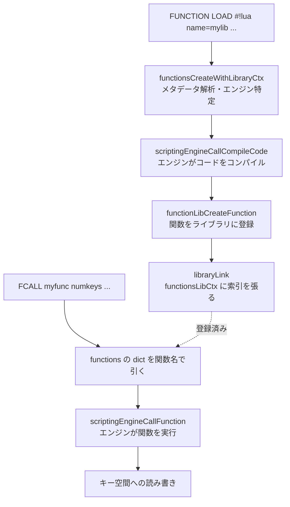

# 第45章 Functions とスクリプトエンジン

> **本章で読むソース**
>
> - [`src/functions.c`](https://github.com/valkey-io/valkey/blob/9.1.0/src/functions.c)
> - [`src/functions.h`](https://github.com/valkey-io/valkey/blob/9.1.0/src/functions.h)
> - [`src/scripting_engine.c`](https://github.com/valkey-io/valkey/blob/9.1.0/src/scripting_engine.c)
> - [`src/script.c`](https://github.com/valkey-io/valkey/blob/9.1.0/src/script.c)
> - [`src/rdb.c`](https://github.com/valkey-io/valkey/blob/9.1.0/src/rdb.c)

## この章の狙い

**Functions** は、名前付きの関数の集まりを **ライブラリ** として一度サーバに登録しておき、以後はその名前で呼び出す仕組みである。
クライアントがスクリプト本文を毎回送る `EVAL` と違い、ライブラリはサーバ側に保持され、`FCALL` で関数名を指定するだけで実行できる。
本章では、ライブラリと関数の対応をどのデータ構造で保持するか、言語処理系（Lua）をどう抽象越しに差し込むか、そして登録した関数をどう永続化するかを実装から読む。
この三つは独立した設計判断であり、それぞれを機構として切り分けて確認する。

## 前提

- [第6章 dict](../part01-data-structures/06-dict.md)：ライブラリ名から関数までの対応は `dict` で引く。
- [第27章 コマンドの実行](../part04-server-events/27-command-execution.md)：`FCALL` も一つのコマンドとしてイベントループ上で処理される。
- [第44章 スクリプティング](44-scripting.md)：`EVAL` と実行コンテキスト（`scriptRunCtx`）を共有する。本章は重複を避け、Functions 固有の経路だけを扱う。

## 全体像

`FUNCTION LOAD` から `FCALL` までの流れを先に俯瞰する。
ロード時にライブラリのコードはスクリプトエンジンに渡され、エンジンが個々の関数をコンパイルして返す。
サーバはその関数をライブラリに登録し、関数名から直接引ける索引も張る。
呼び出し時は関数名で索引を引き、見つけた関数を再びエンジンに渡して実行する。



## ライブラリと関数の対応を保持する `functionsLibCtx`

設計の核の一つめは、ライブラリと関数の二段の索引である。
登録済みのライブラリ群は、グローバルな `functionsLibCtx` がまとめて保持する。
この構造体はライブラリ名から引く索引と、関数名から直接引く索引の二つを持つ。

[`src/functions.c` L59-L64](https://github.com/valkey-io/valkey/blob/9.1.0/src/functions.c#L59-L64)

```c
struct functionsLibCtx {
    dict *libraries;     /* Library name -> Library object */
    dict *functions;     /* Function name -> Function object that can be used to run the function */
    size_t cache_memory; /* Overhead memory (structs, dictionaries, ..) used by all the functions */
    dict *engines_stats; /* Per engine statistics */
};
```

`libraries` はライブラリ名から `functionLibInfo` を引く。
個々のライブラリは自前の `functions` 辞書を持ち、自分に属する関数を抱える。

[`src/functions.h` L77-L82](https://github.com/valkey-io/valkey/blob/9.1.0/src/functions.h#L77-L82)

```c
struct functionLibInfo {
    sds name;                /* Library name */
    dict *functions;         /* Functions dictionary */
    scriptingEngine *engine; /* Pointer to the scripting engine */
    sds code;                /* Library code */
};
```

ここで `functionsLibCtx` がライブラリとは別に `functions` 辞書を持つ点が効いている。
`FCALL` が受け取るのは関数名だけであり、その関数がどのライブラリに属するかを呼び出し側は知らない。
ライブラリ単位の辞書しかなければ、関数名から実体に到達するのに全ライブラリを走査することになる。
全関数を平らに並べた `functions` 索引を別に張ることで、関数名から実体への参照を辞書一回で引ける。
この平索引はライブラリ単位の辞書と内容が重複するが、`FCALL` の探索コストを定数に抑えるための意図的な二重化である。

辞書の値となる `functionInfo` は、コンパイル済みの関数本体と、属するライブラリへの逆参照を持つ。

[`src/functions.h` L70-L73](https://github.com/valkey-io/valkey/blob/9.1.0/src/functions.h#L70-L73)

```c
typedef struct functionInfo {
    compiledFunction *compiled_function; /* Compiled function structure */
    functionLibInfo *li;                 /* Pointer to the library created the function */
} functionInfo;
```

`li` を逆向きに持つのは、関数から所属ライブラリのエンジンへ到達するためである。
後で見る `FCALL` の実行は、関数の `li->engine` をたどって実行先のエンジンを決める。

## ロード時の登録経路

`FUNCTION LOAD` のコマンドハンドラ `functionLoadCommand` は、引数を解析して本体を `functionsCreateWithLibraryCtx` に渡す。

[`src/functions.c` L1114-L1148](https://github.com/valkey-io/valkey/blob/9.1.0/src/functions.c#L1114-L1148)

```c
void functionLoadCommand(client *c) {
    int replace = 0;
    int argc_pos = 2;
    while (argc_pos < c->argc - 1) {
        robj *next_arg = c->argv[argc_pos++];
        if (!strcasecmp(objectGetVal(next_arg), "replace")) {
            replace = 1;
            continue;
        }
        addReplyErrorFormat(c, "Unknown option given: %s", (char *)objectGetVal(next_arg));
        return;
    }
    // ... (中略) ...
    robj *code = c->argv[argc_pos];
    sds err = NULL;
    sds library_name = NULL;
    size_t timeout = LOAD_TIMEOUT_MS;
    if (mustObeyClient(c)) {
        timeout = 0;
    }
    if (!(library_name = functionsCreateWithLibraryCtx(objectGetVal(code), replace, &err, curr_functions_lib_ctx, timeout))) {
        serverAssert(err != NULL);
        addReplyErrorSds(c, err);
        return;
    }
    /* Indicate that the command changed the data so it will be replicated and
     * counted as a data change (for persistence configuration) */
    server.dirty++;
    addReplyBulkSds(c, library_name);
}
```

成功すると `server.dirty++` を加算する。
これはデータを変更したことの記録であり、関数の登録がレプリケーションと永続化の対象になることを意味する。
ロードに時間制限 `timeout` を設けるのは、後述のコンパイルが暴走するのを防ぐためである。
`mustObeyClient` が真、つまり呼び出しがプライマリからの伝播やファイル読み込みであるときは `timeout` を 0 にして制限を外す。
すでに受理済みのコードを取り込む場面で、制限のために失敗させてレプリカが分岐するのを避けるためである。

`functionsCreateWithLibraryCtx` の中心は、コードをエンジンに渡してコンパイルし、返ってきた関数を一つずつ登録する部分である。

[`src/functions.c` L1036-L1067](https://github.com/valkey-io/valkey/blob/9.1.0/src/functions.c#L1036-L1067)

```c
    new_li = engineLibraryCreate(md.name, engine, code);
    size_t num_compiled_functions = 0;
    robj *compile_error = NULL;
    compiledFunction **compiled_functions =
        scriptingEngineCallCompileCode(engine,
                                       VMSE_FUNCTION,
                                       md.code,
                                       sdslen(md.code),
                                       timeout,
                                       &num_compiled_functions,
                                       &compile_error);
    if (compiled_functions == NULL) {
        serverAssert(num_compiled_functions == 0);
        serverAssert(compile_error != NULL);
        *err = sdsdup(objectGetVal(compile_error));
        decrRefCount(compile_error);
        goto error;
    }

    serverAssert(compile_error == NULL);

    for (size_t i = 0; i < num_compiled_functions; i++) {
        int ret = functionLibCreateFunction(compiled_functions[i], new_li, err);
        if (ret == C_ERR) {
            freeCompiledFunctions(engine,
                                  compiled_functions,
                                  num_compiled_functions,
                                  i);
            goto error;
        }
    }
    zfree(compiled_functions);
```

コンパイルはエンジンに委ねられ、その結果は `compiledFunction` の配列として返る。
一つのライブラリのコードが複数の関数を `redis.register_function` で宣言できるため、戻り値は配列になっている。
返ってきた関数は `functionLibCreateFunction` で一つずつライブラリに登録される。

[`src/functions.c` L274-L303](https://github.com/valkey-io/valkey/blob/9.1.0/src/functions.c#L274-L303)

```c
static int functionLibCreateFunction(compiledFunction *function,
                                     functionLibInfo *li,
                                     sds *err) {
    serverAssert(function->name->type == OBJ_STRING);
    serverAssert(function->desc == NULL || function->desc->type == OBJ_STRING);

    if (functionsVerifyName(objectGetVal(function->name)) != C_OK) {
        *err = sdsnew("Function names can only contain letters, numbers, or "
                      "underscores(_) and must be at least one character long");
        return C_ERR;
    }

    sds name_sds = sdsdup(objectGetVal(function->name));
    if (dictFetchValue(li->functions, name_sds)) {
        *err = sdsnew("Function already exists in the library");
        sdsfree(name_sds);
        return C_ERR;
    }

    functionInfo *fi = zmalloc(sizeof(*fi));
    *fi = (functionInfo){
        .compiled_function = function,
        .li = li,
    };

    int res = dictAdd(li->functions, name_sds, fi);
    serverAssert(res == DICT_OK);

    return C_OK;
}
```

この時点では関数はまだライブラリの内部辞書 `li->functions` に入っただけで、`functionsLibCtx` の平索引には現れていない。
ライブラリ全体の検証が通った後で `libraryLink` が呼ばれ、所属する関数を一括で平索引に張る。

[`src/functions.c` L340-L360](https://github.com/valkey-io/valkey/blob/9.1.0/src/functions.c#L340-L360)

```c
static void libraryLink(functionsLibCtx *lib_ctx, functionLibInfo *li) {
    dictIterator *iter = dictGetIterator(li->functions);
    dictEntry *entry = NULL;
    while ((entry = dictNext(iter))) {
        functionInfo *fi = dictGetVal(entry);
        dictAdd(lib_ctx->functions,
                sdsnew(objectGetVal(fi->compiled_function->name)),
                fi);
        lib_ctx->cache_memory += functionMallocSize(fi);
    }
    dictReleaseIterator(iter);

    dictAdd(lib_ctx->libraries, li->name, li);
    lib_ctx->cache_memory += libraryMallocSize(li);

    /* update stats */
    functionsLibEngineStats *stats = dictFetchValue(lib_ctx->engines_stats, scriptingEngineGetName(li->engine));
    serverAssert(stats);
    stats->n_lib++;
    stats->n_functions += dictSize(li->functions);
}
```

登録を「内部辞書への追加」と「平索引への一括 link」の二段に分けているのは、ライブラリ単位の原子性のためである。
途中の関数で名前衝突などの検証に失敗すると、`libraryLink` を呼ばずに `error` ラベルへ飛び、新しいライブラリ全体を捨てる。
平索引への反映を最後のひとまとめにすることで、半分だけ登録されたライブラリが `FCALL` から見えてしまう状態を避けている。

## スクリプトエンジンの抽象

設計の核の二つめは、言語処理系を差し替え可能な部品として外に切り出したことである。
Functions と `EVAL` のどちらも、コードのコンパイルと関数の実行を直接 Lua に依存せず、`scriptingEngine` という抽象を介して呼ぶ。
エンジンはコールバック関数の集合として登録され、サーバ本体はそのコールバックを呼ぶだけで言語の中身を知らない。

エンジンの登録は `scriptingEngineManagerRegister` が受け持つ。

[`src/scripting_engine.c` L136-L172](https://github.com/valkey-io/valkey/blob/9.1.0/src/scripting_engine.c#L136-L172)

```c
int scriptingEngineManagerRegister(const char *engine_name,
                                   ValkeyModule *engine_module,
                                   engineCtx *engine_ctx,
                                   engineMethods *engine_methods) {
    serverAssert(engine_name != NULL);
    sds engine_name_sds = sdsnew(engine_name);

    if (dictFetchValue(engineMgr.engines, engine_name_sds)) {
        serverLog(LL_WARNING, "Scripting engine '%s' is already registered in the server", engine_name_sds);
        sdsfree(engine_name_sds);
        return C_ERR;
    }

    scriptingEngine *e = zmalloc(sizeof(*e));
    *e = (scriptingEngine){
        .name = engine_name_sds,
        .module = engine_module,
        .impl = {
            .ctx = engine_ctx,
        },
        .module_ctx_cache = {0},
    };
    scriptingEngineInitializeEngineMethods(e, engine_methods);
    // ... (中略) ...
    dictAdd(engineMgr.engines, engine_name_sds, e);
    // ... (中略) ...
    return C_OK;
}
```

エンジンは名前を鍵にして `engineMgr.engines` 辞書へ登録される。
この名前は、ライブラリ先頭のシバン行 `#!lua name=mylib` の `lua` の部分と突き合わせられる。
`functionsCreateWithLibraryCtx` がメタデータから取り出したエンジン名で `scriptingEngineManagerFind` を引き、対応するエンジンを得る。

Lua エンジン自身は Valkey モジュールとして実装されており、起動時に静的モジュールとしてロードされて自分を登録する。

[`src/server.c` L7700-L7705](https://github.com/valkey-io/valkey/blob/9.1.0/src/server.c#L7700-L7705)

```c
    /* Initialize the LUA scripting engine on-startup only when LUA is built statically */
    if (scriptingEngineManagerFind("lua") == NULL) {
        if (moduleLoadStatic("lua", NULL, 0, 0) != C_OK) {
            serverPanic("Lua engine initialization failed, check the server logs.");
        }
    }
```

Lua を組み込みではなくモジュール経由で登録するのは、エンジンの口を一本化するための設計である。
モジュールが公開する `VM_RegisterScriptingEngine` から `scriptingEngineManagerRegister` を呼ぶ経路に Lua も乗せることで、本体は Lua を特別扱いしない。
将来別の言語エンジンを足すときも、同じ登録 API に同じ形のコールバック集合を渡せば済む。

コンパイルと実行は、エンジンのコールバックを呼ぶ薄いラッパーを通る。
ロード時に呼ばれた `scriptingEngineCallCompileCode` は、ABI バージョンに応じてコールバックを選び、コードを関数の配列へ変換する。

[`src/scripting_engine.c` L280-L316](https://github.com/valkey-io/valkey/blob/9.1.0/src/scripting_engine.c#L280-L316)

```c
compiledFunction **scriptingEngineCallCompileCode(scriptingEngine *engine,
                                                  subsystemType type,
                                                  const char *code,
                                                  size_t code_len,
                                                  size_t timeout,
                                                  size_t *out_num_compiled_functions,
                                                  robj **err) {
    serverAssert(type == VMSE_EVAL || type == VMSE_FUNCTION);
    compiledFunction **functions = NULL;
    ValkeyModuleCtx *module_ctx = engineSetupModuleCtx(COMMON_MODULE_CTX_INDEX, engine, false, NULL);
    // ... (中略) ...
        functions = engine->impl.methods.compile_code(
            module_ctx,
            engine->impl.ctx,
            type,
            code,
            code_len,
            timeout,
            out_num_compiled_functions,
            err);
    // ... (中略) ...
    engineTeardownModuleCtx(COMMON_MODULE_CTX_INDEX, engine);

    return functions;
}
```

第一引数の `subsystemType` が `VMSE_EVAL` か `VMSE_FUNCTION` のいずれかを取る点が、抽象が Functions と `EVAL` を兼ねる要である。
同じエンジンの同じコールバックを、種別を変えて両方の用途で呼ぶ。
コンパイルの結果が単一スクリプトではなく関数の配列で返るのも、`FUNCTION` 種別が複数関数を宣言できることに合わせた形である。

## `FCALL` の実行経路

`FCALL` と `FCALL_RO` は、読み取り専用かどうかを示す引数だけが違い、本体は `fcallCommandGeneric` を共有する。

[`src/functions.c` L646-L692](https://github.com/valkey-io/valkey/blob/9.1.0/src/functions.c#L646-L692)

```c
static void fcallCommandGeneric(client *c, int ro) {
    /* Functions need to be fed to monitors before the commands they execute. */
    replicationFeedMonitors(c, server.monitors, c->db->id, c->argv, c->argc);

    robj *function_name = c->argv[1];
    dictEntry *de = c->cur_script;
    if (!de) de = dictFind(curr_functions_lib_ctx->functions, objectGetVal(function_name));
    if (!de) {
        addReplyError(c, "Function not found");
        return;
    }
    functionInfo *fi = dictGetVal(de);
    scriptingEngine *engine = fi->li->engine;

    long long numkeys;
    /* Get the number of arguments that are keys */
    if (getLongLongFromObject(c->argv[2], &numkeys) != C_OK) {
        addReplyError(c, "Bad number of keys provided");
        return;
    }
    // ... (中略) ...

    scriptRunCtx run_ctx;
    if (scriptPrepareForRun(&run_ctx,
                            engine,
                            c,
                            objectGetVal(fi->compiled_function->name),
                            fi->compiled_function->f_flags,
                            ro) != C_OK) return;

    scriptingEngineCallFunction(engine,
                                &run_ctx,
                                run_ctx.original_client,
                                fi->compiled_function,
                                VMSE_FUNCTION,
                                c->argv + 3,
                                numkeys,
                                c->argv + 3 + numkeys,
                                c->argc - 3 - numkeys);
    scriptResetRun(&run_ctx);
}
```

関数名で `curr_functions_lib_ctx->functions` の平索引を引き、`functionInfo` を得る。
実行先のエンジンは関数の `fi->li->engine` から取り出す。
ここで先に張っておいた関数からライブラリへの逆参照が効いて、関数名だけから正しいエンジンに到達できる。

実行の前後を `scriptPrepareForRun` と `scriptResetRun` が挟む。
この二つは第44章の `EVAL` と共通の実行コンテキストであり、書き込み可否やキー数、有効期限の扱いといった実行時の制約を `scriptRunCtx` にまとめる。
`FCALL` は単一スレッドのイベントループ上でこの文脈を確立してから関数を呼ぶため、関数の実行中に他のコマンドが割り込んでデータを書き換える心配がない。
実体の呼び出しは `scriptingEngineCallFunction` に委ねられ、これも種別 `VMSE_FUNCTION` を添えてエンジンのコールバックを叩くだけである。

[`src/scripting_engine.c` L343-L368](https://github.com/valkey-io/valkey/blob/9.1.0/src/scripting_engine.c#L343-L368)

```c
void scriptingEngineCallFunction(scriptingEngine *engine,
                                 serverRuntimeCtx *server_ctx,
                                 client *caller,
                                 compiledFunction *compiled_function,
                                 subsystemType type,
                                 robj **keys,
                                 size_t nkeys,
                                 robj **args,
                                 size_t nargs) {
    serverAssert(type == VMSE_EVAL || type == VMSE_FUNCTION);

    ValkeyModuleCtx *module_ctx = engineSetupModuleCtx(COMMON_MODULE_CTX_INDEX, engine, true, caller);

    engine->impl.methods.call_function(
        module_ctx,
        engine->impl.ctx,
        server_ctx,
        compiled_function,
        type,
        keys,
        nkeys,
        args,
        nargs);

    engineTeardownModuleCtx(COMMON_MODULE_CTX_INDEX, engine);
}
```

キーと残りの引数は `numkeys` を境に二分して渡される。
`fcallCommandGeneric` の `c->argv + 3` から `numkeys` 個がキー、その後ろが追加引数である。
キーを引数から分離して明示するのは、クラスタでどのスロットに触れるかを呼び出しの時点で確定させるためである。

## 永続化

登録した関数はサーバの再起動後も残る。
ライブラリは通常のキー空間とは別に、RDB の先頭でまとめて保存される。
保存は `rdbSaveFunctions` が担い、各ライブラリのコード本文をオペコード `RDB_OPCODE_FUNCTION2` とともに書き出す。

[`src/rdb.c` L1360-L1379](https://github.com/valkey-io/valkey/blob/9.1.0/src/rdb.c#L1360-L1379)

```c
ssize_t rdbSaveFunctions(rio *rdb) {
    dict *functions = functionsLibGet();
    dictIterator *iter = dictGetIterator(functions);
    dictEntry *entry = NULL;
    ssize_t written = 0;
    ssize_t ret;
    while ((entry = dictNext(iter))) {
        if ((ret = rdbSaveType(rdb, RDB_OPCODE_FUNCTION2)) < 0) goto werr;
        written += ret;
        functionLibInfo *li = dictGetVal(entry);
        if ((ret = rdbSaveRawString(rdb, (unsigned char *)li->code, sdslen(li->code))) < 0) goto werr;
        written += ret;
    }
    dictReleaseIterator(iter);
    return written;

werr:
    dictReleaseIterator(iter);
    return -1;
}
```

保存されるのはコンパイル済みの内部表現ではなく、ロード時に受け取ったコード本文 `li->code` そのものである。
本文にはシバン行が含まれ、そこにエンジン名とライブラリ名が書かれている。
復元時はこの本文を読み戻し、ロードと同じ経路で再びコンパイルする。

[`src/rdb.c` L3069-L3104](https://github.com/valkey-io/valkey/blob/9.1.0/src/rdb.c#L3069-L3104)

```c
int rdbFunctionLoad(rio *rdb, int ver, functionsLibCtx *lib_ctx, int rdbflags, sds *err) {
    UNUSED(ver);
    sds error = NULL;
    sds final_payload = NULL;
    int res = C_ERR;
    if (!(final_payload = rdbGenericLoadStringObject(rdb, RDB_LOAD_SDS, NULL))) {
        error = sdsnew("Failed loading library payload");
        goto done;
    }

    if (lib_ctx) {
        sds library_name = NULL;
        if (!(library_name =
                  functionsCreateWithLibraryCtx(final_payload, rdbflags & RDBFLAGS_ALLOW_DUP, &error, lib_ctx, 0))) {
            if (!error) {
                error = sdsnew("Failed creating the library");
            }
            goto done;
        }
        sdsfree(library_name);
    }
    // ... (中略) ...
}
```

`rdbFunctionLoad` は読み戻した本文をそのまま `functionsCreateWithLibraryCtx` に渡す。
これは `FUNCTION LOAD` が呼ぶのと同じ関数であり、コンパイルと登録の経路を再利用する。
復元時の `timeout` は 0 を渡してコンパイルの時間制限を外す。
すでに受理されて保存された本文を読み戻す場面では、制限のために失敗させると元の状態を再現できなくなるためである。

コードを内部表現ではなく本文で保存する設計には、エンジン非依存という利点がある。
RDB の側はコンパイル結果の形式を一切知らず、文字列を保存して読み戻すだけでよい。
コンパイルの責務はエンジンに閉じたままで、永続化の経路にエンジンごとの分岐が漏れ出さない。

この保存はファイル形式としては RDB に属する。
AOF を使う構成でも、ベースファイルを RDB プリアンブルで書くときに同じ `rdbSaveFunctions` の経路を通り、ライブラリが先頭に書き込まれる。
RDB と AOF それぞれのファイル全体の構造は第35章と第36章で扱う。

## まとめ

- Functions は、名前付き関数の集まりであるライブラリを `FUNCTION LOAD` で登録し、`FCALL name numkeys ...` で呼び出す。スクリプト本文を毎回送る `EVAL` と違い、サーバ側に保持され名前で呼べる。
- `functionsLibCtx` は、ライブラリ名から引く索引と、関数名から直接引く平索引の二つを持つ。後者は `FCALL` の関数探索を辞書一回に抑えるための意図的な二重化である。
- ロードは「ライブラリ内部辞書への登録」と「平索引への一括 link」の二段で、後段を最後にまとめることで半端に登録されたライブラリが見えないようにしている。
- スクリプトエンジンは `scriptingEngine` の抽象として外に切り出され、Lua もモジュール経由で同じ登録 API に乗る。コンパイルと実行は種別 `VMSE_EVAL` / `VMSE_FUNCTION` を切り替えて同じコールバックを呼ぶ。
- `FCALL` は単一スレッド上で `scriptPrepareForRun` により実行文脈を確立してからエンジンを呼び、第44章の `EVAL` と実行コンテキストを共有する。
- 永続化はコンパイル結果ではなくコード本文を `RDB_OPCODE_FUNCTION2` とともに保存し、復元時はロードと同じ経路で再コンパイルする。これにより永続化の経路はエンジンの内部表現を知らずに済む。

## 関連する章

- [第44章 スクリプティング](44-scripting.md)：`EVAL` と、本章が共有する `scriptRunCtx` の実行コンテキスト。
- [第35章 RDB スナップショット](../part06-persistence/35-rdb.md)：ライブラリを書き出す RDB ファイルの全体構造。
- [第36章 AOF](../part06-persistence/36-aof.md)：RDB プリアンブルを通じてライブラリが AOF にも残る経路。
- [第49章 モジュール](49-modules.md)：Lua エンジンを含むスクリプトエンジンを登録するモジュール API。
