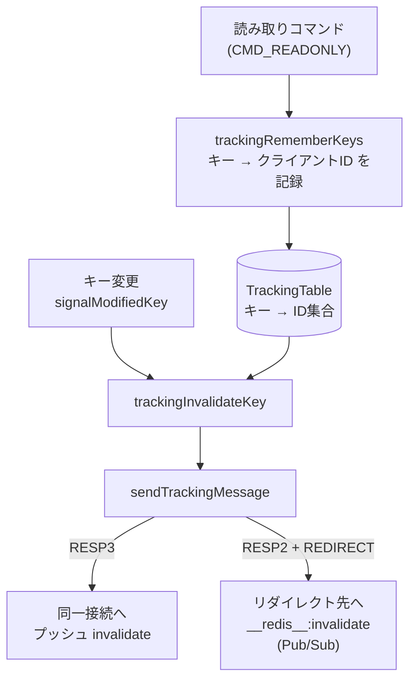

# 第46章 クライアントサイドキャッシュ

> **本章で読むソース**
>
> - [`src/tracking.c`](https://github.com/valkey-io/valkey/blob/9.1.0/src/tracking.c)
> - [`src/server.h`](https://github.com/valkey-io/valkey/blob/9.1.0/src/server.h)
> - [`src/db.c`](https://github.com/valkey-io/valkey/blob/9.1.0/src/db.c)
> - [`src/server.c`](https://github.com/valkey-io/valkey/blob/9.1.0/src/server.c)
> - [`src/networking.c`](https://github.com/valkey-io/valkey/blob/9.1.0/src/networking.c)

## この章の狙い

クライアントが読み取った値を手元に持っておき、サーバから「そのキーが変わった」という無効化通知が届くまでそれを使い回す。
この仕組みをサーバ側で支援するのが**クライアントサイドキャッシュ**である。
本章では、サーバが「どのクライアントがどのキーを持っているか」をどう覚え、キーが変わったときにどの経路で通知を届けるかを、`tracking.c` のコードに沿って読む。
覚え方の異なる二つのモード、すなわちデフォルトモードとブロードキャストモードがどのようなデータ構造で実装され、どこで記録コストとのトレードオフを取っているかを理解できるようになる。

## 前提

- [第26章 RESP プロトコル](../part04-server-events/26-resp-protocol.md)：RESP3 のプッシュ型メッセージを使う。
- [第30章 データベース](../part05-database/30-database.md)：キー変更シグナル `signalModifiedKey` が無効化の起点になる。
- [第43章 Pub/Sub](43-pubsub.md)：RESP2 のクライアントへリダイレクトする際に Pub/Sub のチャネルを使う。

## キャッシュ無効化という設計

クライアントが頻繁に読むキーをローカルにキャッシュできれば、同じ値を取るための往復をなくせる。
問題は、キャッシュした値がいつ古くなるかをクライアントが知る手立てである。
Valkey は、クライアントが値を取得したことをサーバ側で覚えておき、そのキーが変更された時点で当の値を持つクライアントへ無効化を通知するという形でこれを解く。

`tracking.c` の冒頭コメントが、この設計の中心にあるデータ構造を述べている。

[`src/tracking.c` L33-L45](https://github.com/valkey-io/valkey/blob/9.1.0/src/tracking.c#L33-L45)

```c
/* The tracking table is constituted by a radix tree of keys, each pointing
 * to a radix tree of client IDs, used to track the clients that may have
 * certain keys in their local, client side, cache.
 *
 * When a client enables tracking with "CLIENT TRACKING on", each key served to
 * the client is remembered in the table mapping the keys to the client IDs.
 * Later, when a key is modified, all the clients that may have local copy
 * of such key will receive an invalidation message.
 *
 * Clients will normally take frequently requested objects in memory, removing
 * them when invalidation messages are received. */
rax *TrackingTable = NULL;
rax *PrefixTable = NULL;
```

`TrackingTable` は「キー名 → そのキーを読んだクライアントID集合」という二段の rax（基数木）である。
内側の集合がクライアントの実体ではなくクライアントIDを持つのは、クライアントが切断されたとき集合側を即座に掃除しないためである。
ID が指すクライアントが既にいなければ、通知を送る段でその ID を無視すればよい。
多数のキーを登録したクライアントが消えるたびに全エントリを走査する負担を避ける、遅延削除の設計である。

機能の入口は `CLIENT TRACKING` コマンドで、無効化を有効にするのが `enableTracking` である。

[`src/tracking.c` L181-L198](https://github.com/valkey-io/valkey/blob/9.1.0/src/tracking.c#L181-L198)

```c
void enableTracking(client *c, uint64_t redirect_to, struct ClientFlags options, robj **prefix, size_t numprefix) {
    if (!c->flag.tracking) server.tracking_clients++;
    c->flag.tracking = 1;
    c->flag.tracking_broken_redir = 0;
    c->flag.tracking_bcast = 0;
    // ... (中略) ...
    c->pubsub_data->client_tracking_redirection = redirect_to;

    /* This may be the first client we ever enable. Create the tracking
     * table if it does not exist. */
    if (TrackingTable == NULL) {
        TrackingTable = raxNew();
        PrefixTable = raxNew();
        TrackingChannelName = createStringObject("__redis__:invalidate", 20);
    }
```

`TrackingTable` と `PrefixTable` は、最初のクライアントが追跡を有効にしたときに初めて確保される。
追跡を使わない通常の運用では、この二つの木のためのメモリを一切持たない。

クライアントの追跡状態は `ClientFlags` のビットフラグで保持する。

[`src/server.h` L1157-L1163](https://github.com/valkey-io/valkey/blob/9.1.0/src/server.h#L1157-L1163)

```c
    uint64_t tracking : 1;                 /* Client enabled keys tracking in order to perform client side caching. */
    uint64_t tracking_broken_redir : 1;    /* Target client is invalid. */
    uint64_t tracking_bcast : 1;           /* Tracking in BCAST mode. */
    uint64_t tracking_optin : 1;           /* Tracking in opt-in mode. */
    uint64_t tracking_optout : 1;          /* Tracking in opt-out mode. */
    uint64_t tracking_caching : 1;         /* CACHING yes/no was given, depending on optin/optout mode. */
    uint64_t tracking_noloop : 1;          /* Don't send invalidation messages about writes performed by myself. */
```

`tracking` が追跡そのものの有効化、`tracking_bcast` がモードの切り替えである。
リダイレクト先のクライアントIDは、フラグではなく `client_tracking_redirection` という整数フィールドに置く（[`src/server.h` L1216-L1222](https://github.com/valkey-io/valkey/blob/9.1.0/src/server.h#L1216-L1222)）。

`CLIENT TRACKING on` のオプションは `clientTrackingCommand` が解釈する。
`REDIRECT`、`BCAST`、`PREFIX`、`OPTIN`、`OPTOUT`、`NOLOOP` を読み取り、整合性を検査したうえで `enableTracking` を呼ぶ。

[`src/networking.c` L5519-L5531](https://github.com/valkey-io/valkey/blob/9.1.0/src/networking.c#L5519-L5531)

```c
        } else if (!strcasecmp(objectGetVal(c->argv[j]), "bcast")) {
            options.tracking_bcast = 1;
        } else if (!strcasecmp(objectGetVal(c->argv[j]), "optin")) {
            options.tracking_optin = 1;
        } else if (!strcasecmp(objectGetVal(c->argv[j]), "optout")) {
            options.tracking_optout = 1;
        } else if (!strcasecmp(objectGetVal(c->argv[j]), "noloop")) {
            options.tracking_noloop = 1;
        } else if (!strcasecmp(objectGetVal(c->argv[j]), "prefix") && moreargs) {
            j++;
            prefix = zrealloc(prefix, sizeof(robj *) * (numprefix + 1));
            prefix[numprefix++] = c->argv[j];
        } else {
```

以降では、`BCAST` を付けない既定の動作と、付けたときのブロードキャスト動作を分けて読む。

## デフォルトモード：読まれたキーだけを覚える

既定のモードでは、サーバはクライアントが実際に読んだキーだけを記録する。
読み取りコマンドの実行後、`call` の中から `trackingRememberKeys` が呼ばれてキーを `TrackingTable` に書き込む。

[`src/server.c` L4046-L4058](https://github.com/valkey-io/valkey/blob/9.1.0/src/server.c#L4046-L4058)

```c
    /* If the client has keys tracking enabled for client side caching,
     * make sure to remember the keys it fetched via this command. For read-only
     * scripts, don't process the script, only the commands it executes. */
    if ((c->cmd->flags & CMD_READONLY) && (c->cmd->proc != evalRoCommand) && (c->cmd->proc != evalShaRoCommand) &&
        (c->cmd->proc != fcallroCommand)) {
        /* We use the tracking flag of the original external client that
         * triggered the command, but we take the keys from the actual command
         * being executed. */
        if (server.current_client && (server.current_client->flag.tracking) &&
            !(server.current_client->flag.tracking_bcast)) {
            trackingRememberKeys(server.current_client, c);
        }
    }
```

記録の対象は読み取り専用コマンド（`CMD_READONLY`）に限られ、`tracking_bcast` のクライアントは除外される。
ブロードキャストモードでは個々の読み取りを覚えないからである。

`trackingRememberKeys` は、実行されたコマンドからキーを取り出し、キーごとにクライアントIDを登録する。

[`src/tracking.c` L222-L262](https://github.com/valkey-io/valkey/blob/9.1.0/src/tracking.c#L222-L262)

```c
void trackingRememberKeys(client *tracking, client *executing) {
    /* Return if we are in optin/out mode and the right CACHING command
     * was/wasn't given in order to modify the default behavior. */
    uint64_t optin = tracking->flag.tracking_optin;
    uint64_t optout = tracking->flag.tracking_optout;
    uint64_t caching_given = tracking->flag.tracking_caching;
    if ((optin && !caching_given) || (optout && caching_given)) return;

    getKeysResult result;
    initGetKeysResult(&result);
    int numkeys = getKeysFromCommand(executing->cmd, executing->argv, executing->argc, &result);
    // ... (中略) ...
    keyReference *keys = result.keys;

    for (int j = 0; j < numkeys; j++) {
        int idx = keys[j].pos;
        sds sdskey = objectGetVal(executing->argv[idx]);
        void *result;
        rax *ids;
        if (!raxFind(TrackingTable, (unsigned char *)sdskey, sdslen(sdskey), &result)) {
            ids = raxNew();
            int inserted = raxTryInsert(TrackingTable, (unsigned char *)sdskey, sdslen(sdskey), ids, NULL);
            serverAssert(inserted == 1);
        } else {
            ids = result;
        }
        if (raxTryInsert(ids, (unsigned char *)&tracking->id, sizeof(tracking->id), NULL, NULL))
            TrackingTableTotalItems++;
    }
    getKeysFreeResult(&result);
}
```

先頭の `optin`/`optout` の判定は、何を覚えるかの粒度を制御する。
`OPTIN` モードでは直前に `CLIENT CACHING yes` を出したコマンドだけを、`OPTOUT` モードでは `CLIENT CACHING no` を出さなかったコマンドだけを記録する。
これにより、キャッシュに値する読み取りだけを選んで覚えられる。

キーごとの登録は二段で進む。
`TrackingTable` にキーが無ければ内側の rax を新規作成して挿入し、あればそれを取り出す。
そのうえで内側の rax にクライアントIDを `raxTryInsert` で入れる。
新規に入ったときだけ `TrackingTableTotalItems` を増やす。
このカウンタは追跡テーブル全体に格納された ID 総数であり、後述する上限制御の判断材料になる。

読んでいないキーには一切エントリを作らない。
無効化を送るべき相手が、そのキーを読んだクライアントに限定される。
読まれないキーが大半を占めるワークロードでは、この絞り込みが記録量を強く抑える。

## キー変更から無効化通知へ

記録した情報が活きるのは、キーが変更された瞬間である。
キー変更のシグナルは `signalModifiedKey` に集約されており、そこから `trackingInvalidateKey` が呼ばれる。

[`src/db.c` L754-L757](https://github.com/valkey-io/valkey/blob/9.1.0/src/db.c#L754-L757)

```c
void signalModifiedKey(client *c, serverDb *db, robj *key) {
    touchWatchedKey(db, key);
    trackingInvalidateKey(c, key, 1);
}
```

`trackingInvalidateKey` は、変更されたキーを `TrackingTable` で引き、登録されている各クライアントに無効化を送る。

[`src/tracking.c` L373-L424](https://github.com/valkey-io/valkey/blob/9.1.0/src/tracking.c#L373-L424)

```c
void trackingInvalidateKey(client *c, robj *keyobj, int bcast) {
    if (TrackingTable == NULL) return;

    unsigned char *key = (unsigned char *)objectGetVal(keyobj);
    size_t keylen = sdslen(objectGetVal(keyobj));

    if (bcast && raxSize(PrefixTable) > 0) trackingRememberKeyToBroadcast(c, (char *)key, keylen);

    void *result;
    if (!raxFind(TrackingTable, key, keylen, &result)) return;
    rax *ids = result;

    raxIterator ri;
    raxStart(&ri, ids);
    raxSeek(&ri, "^", NULL, 0);
    while (raxNext(&ri)) {
        uint64_t id;
        memcpy(&id, ri.key, sizeof(id));
        client *target = lookupClientByID(id);
        // ... (中略) ...
        if (target == NULL || !(target->flag.tracking) || target->flag.tracking_bcast) {
            continue;
        }
        // ... (中略) ...
        if (target == server.current_client && (server.current_client->flag.executing_command)) {
            incrRefCount(keyobj);
            listAddNodeTail(server.tracking_pending_keys, keyobj);
        } else {
            sendTrackingMessage(target, (char *)objectGetVal(keyobj), sdslen(objectGetVal(keyobj)), 0);
        }
    }
    raxStop(&ri);

    /* Free the tracking table: we'll create the radix tree and populate it
     * again if more keys will be modified in this caching slot. */
    TrackingTableTotalItems -= raxSize(ids);
    raxFree(ids);
    raxRemove(TrackingTable, (unsigned char *)key, keylen, NULL);
}
```

内側 rax を走査し、ID からクライアントを引く。
そのクライアントが既にいない、追跡を止めた、あるいはブロードキャストモードに切り替わっている場合は飛ばす（前段で挙げた遅延削除がここで効く）。
変更を起こしたのが当のクライアント自身で、しかもまだコマンド実行中の場合は、その場では送らず `tracking_pending_keys` に積む。
無効化メッセージがコマンドの応答と混ざらず、応答の後に届くようにするためである。
積まれたキーはコマンド完了後に `trackingHandlePendingKeyInvalidations` がまとめて送る（[`src/tracking.c` L426-L452](https://github.com/valkey-io/valkey/blob/9.1.0/src/tracking.c#L426-L452)）。

通知を送り終えると、そのキーの内側 rax を丸ごと解放してテーブルから外す。
一度無効化したキーについては、クライアントがもう値を持っていない前提が成り立つので、記録を残す必要がない。
同じキーが再び読まれれば、その時点で改めて登録される。

実際の送信は `sendTrackingMessage` が担う。
ここで RESP のバージョンとリダイレクトの有無に応じて通知経路が分かれる。

[`src/tracking.c` L276-L321](https://github.com/valkey-io/valkey/blob/9.1.0/src/tracking.c#L276-L321)

```c
void sendTrackingMessage(client *c, char *keyname, size_t keylen, int proto) {
    struct ClientFlags old_flags = c->flag;
    c->flag.pushing = 1;

    int using_redirection = 0;
    if (c->pubsub_data->client_tracking_redirection) {
        client *redir = lookupClientByID(c->pubsub_data->client_tracking_redirection);
        if (!redir || redir->flag.close_after_reply || redir->flag.close_asap) {
            c->flag.tracking_broken_redir = 1;
            // ... (中略) ...
            return;
        }
        // ... (中略) ...
        c = redir;
        using_redirection = 1;
        // ... (中略) ...
    }

    /* Only send such info for clients in RESP version 3 or more. However
     * if redirection is active, and the connection we redirect to is
     * in Pub/Sub mode, we can support the feature with RESP 2 as well,
     * by sending Pub/Sub messages in the __redis__:invalidate channel. */
    if (c->resp > 2) {
        addReplyPushLen(c, 2);
        addReplyBulkCBuffer(c, "invalidate", 10);
    } else if (using_redirection && c->flag.pubsub) {
        /* We use a static object to speedup things, however we assume
         * that addReplyPubsubMessage() will not take a reference. */
        addReplyPubsubMessage(c, TrackingChannelName, NULL, shared.messagebulk);
    } else {
        /* If are here, the client is neither using RESP3, nor is
         * redirecting to another client. We can't send anything to
         * it since RESP2 does not support push messages in the same
         * connection. */
        // ... (中略) ...
        return;
    }
```

経路は三つに分かれる。
クライアントが RESP3 を話すなら、同じ接続にプッシュ型メッセージとして `invalidate` を送る。
RESP2 のクライアントは同一接続でプッシュを受け取れないので、`REDIRECT` で別のクライアントIDを指定しておく。
リダイレクト先が Pub/Sub 状態なら、`__redis__:invalidate` チャネルへ Pub/Sub メッセージとして送る。
どちらにも当てはまらないクライアント（RESP2 でリダイレクトも無い）には何も送れず、ここで打ち切る。
リダイレクト先が既に消えていれば `tracking_broken_redir` を立て、RESP3 の元クライアントには `tracking-redir-broken` を通知する。



## ブロードキャストモード：プレフィックスへの一斉通知

デフォルトモードは記録が正確な代わりに、読まれたキーの数だけ ID を覚える。
読み取りが膨大なワークロードでは、この記録自体が無視できない量になる。
ブロードキャストモードは、個々の読み取りを覚えるのをやめ、代わりにクライアントが宣言したプレフィックスに一致するキーの変更を一斉に通知する。

`CLIENT TRACKING on BCAST PREFIX <p>` を受けると、`enableTracking` が各プレフィックスについて `enableBcastTrackingForPrefix` を呼ぶ。

[`src/tracking.c` L200-L208](https://github.com/valkey-io/valkey/blob/9.1.0/src/tracking.c#L200-L208)

```c
    /* For broadcasting, set the list of prefixes in the client. */
    if (options.tracking_bcast) {
        c->flag.tracking_bcast = 1;
        if (numprefix == 0) enableBcastTrackingForPrefix(c, "", 0);
        for (size_t j = 0; j < numprefix; j++) {
            sds sdsprefix = objectGetVal(prefix[j]);
            enableBcastTrackingForPrefix(c, sdsprefix, sdslen(sdsprefix));
        }
    }
```

プレフィックスを一つも指定しなければ空文字列が登録され、すべてのキー変更が対象になる。
`enableBcastTrackingForPrefix` は `PrefixTable` にプレフィックスごとの状態 `bcastState` を作り、そこへ購読クライアントを加える。

[`src/tracking.c` L52-L59](https://github.com/valkey-io/valkey/blob/9.1.0/src/tracking.c#L52-L59)

```c
/* This is the structure that we have as value of the PrefixTable, and
 * represents the list of keys modified, and the list of clients that need
 * to be notified, for a given prefix. */
typedef struct bcastState {
    rax *keys;    /* Keys modified in the current event loop cycle. */
    rax *clients; /* Clients subscribed to the notification events for this
                     prefix. */
} bcastState;
```

`bcastState` は、そのプレフィックスについて「今サイクルで変更されたキー」と「通知すべきクライアント」を二つの rax で持つ。
キー変更時、デフォルトモードの記録と同じ `trackingInvalidateKey` の中で `trackingRememberKeyToBroadcast` が呼ばれ、変更キーが一致するプレフィックスの `bs->keys` に積まれる。

[`src/tracking.c` L340-L355](https://github.com/valkey-io/valkey/blob/9.1.0/src/tracking.c#L340-L355)

```c
void trackingRememberKeyToBroadcast(client *c, char *keyname, size_t keylen) {
    raxIterator ri;
    raxStart(&ri, PrefixTable);
    raxSeek(&ri, "^", NULL, 0);
    while (raxNext(&ri)) {
        if (ri.key_len > keylen) continue;
        if (ri.key_len != 0 && memcmp(ri.key, keyname, ri.key_len) != 0) continue;
        bcastState *bs = ri.data;
        /* We insert the client pointer as associated value in the radix
         * tree. This way we know who was the client that did the last
         * change to the key, and can avoid sending the notification in the
         * case the client is in NOLOOP mode. */
        raxInsert(bs->keys, (unsigned char *)keyname, keylen, c, NULL);
    }
    raxStop(&ri);
}
```

変更キーが各プレフィックスの接頭辞条件を満たすかを `memcmp` で確かめ、満たすプレフィックスの `keys` にキーを積む。
ここでキーに紐づけて記録するのは、最後に変更したクライアントのポインタである。
後述の `NOLOOP` で、自分の変更による通知を自分に返さないために使う。

変更のたびに各クライアントへ送るのではなく、いったん溜める点が要である。
通知の送出はイベントループの `beforeSleep` まで遅延され、`trackingBroadcastInvalidationMessages` がまとめて行う。

[`src/server.c` L1906-L1908](https://github.com/valkey-io/valkey/blob/9.1.0/src/server.c#L1906-L1908)

```c
    /* Send the invalidation messages to clients participating to the
     * client side caching protocol in broadcasting (BCAST) mode. */
    trackingBroadcastInvalidationMessages();
```

[`src/tracking.c` L600-L646](https://github.com/valkey-io/valkey/blob/9.1.0/src/tracking.c#L600-L646)

```c
void trackingBroadcastInvalidationMessages(void) {
    raxIterator ri, ri2;
    // ... (中略) ...
    raxStart(&ri, PrefixTable);
    raxSeek(&ri, "^", NULL, 0);

    /* For each prefix... */
    while (raxNext(&ri)) {
        bcastState *bs = ri.data;

        if (raxSize(bs->keys)) {
            /* Generate the common protocol for all the clients that are
             * not using the NOLOOP option. */
            sds proto = trackingBuildBroadcastReply(NULL, bs->keys);

            /* Send this array of keys to every client in the list. */
            raxStart(&ri2, bs->clients);
            raxSeek(&ri2, "^", NULL, 0);
            while (raxNext(&ri2)) {
                client *c;
                memcpy(&c, ri2.key, sizeof(c));
                if (c->flag.tracking_noloop) {
                    /* This client may have certain keys excluded. */
                    sds adhoc = trackingBuildBroadcastReply(c, bs->keys);
                    // ... (中略) ...
                } else {
                    sendTrackingMessage(c, proto, sdslen(proto), 1);
                }
            }
            raxStop(&ri2);
            // ... (中略) ...
            sdsfree(proto);
        }
        raxFree(bs->keys);
        bs->keys = raxNew();
    }
    raxStop(&ri);
}
```

プレフィックスごとに、溜まった変更キーの配列を `trackingBuildBroadcastReply` で一度だけ RESP に組み立て、その同じバイト列を購読クライアント全員に送る。
プロトコルの生成を購読者数分繰り返さず使い回すのが、ブロードキャストの送出コストを抑える工夫である。
`NOLOOP` を指定したクライアントには、自分が最後に変更したキーを除いた専用の配列を別途作って送る。
送り終えると `bs->keys` を作り直し、次サイクルの変更だけを新たに溜める。

この設計のトレードオフは記録コストと通知の正確さにある。
デフォルトモードは読んだキーだけを覚えるので通知が正確だが、読み取りごとに ID を記録する。
ブロードキャストモードは読み取りを覚えない代わりに、プレフィックスに一致しさえすれば、そのクライアントが実際に読んでいないキーの変更まで通知が届く。
どちらが有利かはワークロード次第である。

## 追跡テーブルの上限と退避

デフォルトモードは読まれたキーを際限なく覚えるので、読み取りが多く更新が少ないワークロードでは記録量が膨らむ。
これを抑えるのが `trackingLimitUsedSlots` で、`tracking-table-max-keys` で設定した上限を超えた分のキーを退避する。

[`src/tracking.c` L510-L535](https://github.com/valkey-io/valkey/blob/9.1.0/src/tracking.c#L510-L535)

```c
void trackingLimitUsedSlots(void) {
    static unsigned int timeout_counter = 0;
    if (TrackingTable == NULL) return;
    if (server.tracking_table_max_keys == 0) return; /* No limits set. */
    size_t max_keys = server.tracking_table_max_keys;
    if (raxSize(TrackingTable) <= max_keys) {
        timeout_counter = 0;
        return; /* Limit not reached. */
    }

    /* We have to invalidate a few keys to reach the limit again. The effort
     * we do here is proportional to the number of times we entered this
     * function and found that we are still over the limit. */
    int effort = 100 * (timeout_counter + 1);

    /* We just remove one key after another by using a random walk. */
    raxIterator ri;
    raxStart(&ri, TrackingTable);
    while (effort > 0) {
        effort--;
        raxSeek(&ri, "^", NULL, 0);
        raxRandomWalk(&ri, 0);
        if (raxEOF(&ri)) break;
        robj *keyobj = createStringObject((char *)ri.key, ri.key_len);
        trackingInvalidateKey(NULL, keyobj, 0);
        decrRefCount(keyobj);
```

上限を超えていると、ランダムウォークで選んだキーを `trackingInvalidateKey` に渡して退避する。
退避はキーが実際に変わったわけではないが、無効化通知の送信を伴う。
登録クライアントには、サーバがそのキーの追跡をやめたことを伝える必要があるからである。
一度の呼び出しで処理する量（`effort`）は、上限超過が続くほど増える。
これにより、軽い超過なら少しの退避で済ませ、深刻な超過には積極的に対処する。

## まとめ

- クライアントサイドキャッシュは、クライアントが読んだ値を手元に保持し、サーバからの無効化通知が来るまで使い回す仕組みである。
- デフォルトモードは `TrackingTable`（キー → クライアントID集合の二段 rax）に、クライアントが実際に読んだキーだけを `trackingRememberKeys` で記録し、変更時に該当クライアントへ正確に通知する。
- ブロードキャストモードは個々の読み取りを覚えず、`PrefixTable` に登録したプレフィックスへ一致するキーの変更を、`beforeSleep` でまとめて一斉通知する。記録コストと通知の正確さのトレードオフを取る。
- 無効化の起点は `signalModifiedKey` から呼ばれる `trackingInvalidateKey` で、`sendTrackingMessage` が RESP3 ではプッシュ、RESP2 ではリダイレクト先への Pub/Sub という経路を選ぶ。
- 内側 rax にクライアントIDを置く遅延削除、退避時の `effort` 制御、ブロードキャスト時のプロトコル使い回しが、記録と通知のコストを抑える。

## 関連する章

- [第26章 RESP プロトコル](../part04-server-events/26-resp-protocol.md)：RESP3 のプッシュ型メッセージ。
- [第30章 データベース](../part05-database/30-database.md)：キー変更シグナル `signalModifiedKey`。
- [第43章 Pub/Sub](43-pubsub.md)：リダイレクト時に使うチャネル `__redis__:invalidate`。
