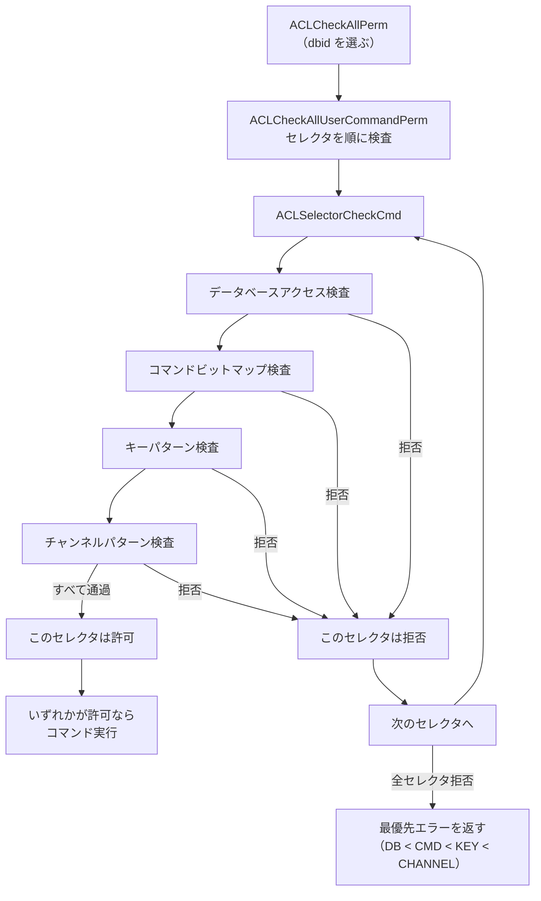

# 第48章 ACL とセキュリティ

> **本章で読むソース**
>
> - [`src/acl.c`](https://github.com/valkey-io/valkey/blob/9.1.0/src/acl.c)
> - [`src/server.h`](https://github.com/valkey-io/valkey/blob/9.1.0/src/server.h)

## この章の狙い

Valkey の **ACL**（Access Control List）は、接続ごとに「実行できるコマンド」「触れるキー」「購読できるチャンネル」を制限する仕組みである。
本章では、ユーザーの権限がどのデータ構造で表現され、各コマンドの実行前にそれがどう検査されるかを読む。
コマンド許可をビットマップで持って高速に判定する設計と、一人のユーザーに複数の権限セットを束ねる**セレクタ**という設計を、機構のレベルで理解できるようになる。

## 前提

- [第27章 コマンド実行](../part04-server-events/27-command-execution.md)：`processCommand` がコマンド本体を呼ぶ前に ACL 検査を挟む。
- [第43章 Pub/Sub](./43-pubsub.md)：チャンネルの購読と配信。ACL はチャンネル名への権限も検査する。
- [第29章 config](../part04-server-events/29-config.md)：`requirepass` や `user` の設定行が起動時に ACL へ読み込まれる。

## ACL が制限するもの

ACL は、認証済みの接続に紐づいた一人のユーザーの権限を、コマンド実行のたびに照合する。
接続が確立した直後は、まだ認証されていない接続として既定のユーザー（`default`）に紐づく。
`AUTH` または `HELLO` の `AUTH` 節でユーザー名とパスワードを送ると、その接続は別のユーザーへ切り替わる。
現在どのユーザーかは、クライアント構造体の `user` フィールドが指す。

[`src/server.h` L1398](https://github.com/valkey-io/valkey/blob/9.1.0/src/server.h#L1398)

```c
    user *user;                        /* User associated with this connection */
```

ユーザーは三つの軸で権限を持つ。
実行できるコマンドの集合、読み書きできるキーのパターン集合、`PUBLISH` や `SUBSCRIBE` で触れるチャンネルのパターン集合である。
コマンド実行のたびに、サーバはこの三つ（と後述するデータベース番号）を順に照合し、すべて通ったときだけコマンドを実行する。

## ユーザーの表現

ユーザーは `struct user` で表される。
名前、フラグ、パスワードのリスト、そしてセレクタのリストを持つ。

[`src/server.h` L1043-L1051](https://github.com/valkey-io/valkey/blob/9.1.0/src/server.h#L1043-L1051)

```c
typedef struct user {
    sds name;         /* The username as an SDS string. */
    uint32_t flags;   /* See USER_FLAG_* */
    list *passwords;  /* A list of SDS valid passwords for this user. */
    list *selectors;  /* A list of selectors this user validates commands
                         against. This list will always contain at least
                         one selector for backwards compatibility. */
    robj *acl_string; /* cached string represent of ACLs */
} user;
```

権限そのものは `user` ではなく、`selectors` に入る一つ一つのセレクタが持つ。
コマンド許可、キーパターン、チャンネルパターンを実際に保持するのはセレクタの側であり、`user` はそれらを束ねる入れ物に近い。
`flags` は、ユーザーが有効か無効か、パスワードを要求しないか、といったユーザー全体の状態を表す。

[`src/server.h` L1016-L1040](https://github.com/valkey-io/valkey/blob/9.1.0/src/server.h#L1016-L1040)

```c
#define USER_COMMAND_BITS_COUNT 1024             /* The total number of command bits     \
                                                   in the user structure. The last valid \
                                                   command ID we can set in the user     \
                                                   is USER_COMMAND_BITS_COUNT-1. */
#define USER_FLAG_ENABLED (1 << 0)               /* The user is active. */
#define USER_FLAG_DISABLED (1 << 1)              /* The user is disabled. */
#define USER_FLAG_NOPASS (1 << 2)                /* The user requires no password, any   \
                                                    provided password will work. For the \
                                                    default user, this also means that   \
                                                    no AUTH is needed, and every         \
                                                    connection is immediately            \
                                                    authenticated. */
// ... (中略) ...
#define SELECTOR_FLAG_ROOT (1 << 0)        /* This is the root user permission \
                                            * selector. */
#define SELECTOR_FLAG_ALLKEYS (1 << 1)     /* The user can mention any key. */
#define SELECTOR_FLAG_ALLCOMMANDS (1 << 2) /* The user can run all commands. */
#define SELECTOR_FLAG_ALLCHANNELS (1 << 3) /* The user can mention any Pub/Sub \
                                              channel. */
#define SELECTOR_FLAG_ALLDBS (1 << 4)      /* Allow all databases */
```

`USER_COMMAND_BITS_COUNT` は 1024 である。
コマンド許可は、コマンドごとに割り当てられた ID をビット位置とする 1024 ビットのビットマップで表す。
セレクタの定義を見ると、許可されたコマンドのビット列、キーパターンのリスト、チャンネルパターンのリストが並ぶ。

[`src/acl.c` L159-L188](https://github.com/valkey-io/valkey/blob/9.1.0/src/acl.c#L159-L188)

```c
typedef struct {
    uint32_t flags; /* See SELECTOR_FLAG_* */
    /* The bit in allowed_commands is set if this user has the right to
     * execute this command.
     *
     * If the bit for a given command is NOT set and the command has
     * allowed first-args, the server will also check allowed_firstargs in order to
     * understand if the command can be executed. */
    uint64_t allowed_commands[USER_COMMAND_BITS_COUNT / 64];
    // ... (中略) ...
    sds **allowed_firstargs;
    list *patterns;    /* A list of allowed key patterns. If this field is NULL
                          the user cannot mention any key in a command, unless
                          the flag ALLKEYS is set in the user. */
    list *channels;    /* A list of allowed Pub/Sub channel patterns. If this
                          field is NULL the user cannot mention any channel in a
                          `PUBLISH` or [P][UNSUBSCRIBE] command, unless the flag
                          ALLCHANNELS is set in the user. */
    sds command_rules; /* A string representation of the ordered categories and commands, this
                        * is used to regenerate the original ACL string for display. */
    intset *dbs;       /* Set of allowed database ids. If set is NULL or empty the user
                        * cannot access any database, unless the flag ALLDBS is set. */
} aclSelector;
```

`allowed_commands` は `uint64_t` を 16 個並べた配列で、合計 1024 ビットになる。
コマンドに `+@read` や `+get` といった許可を与えると、対応するビットが立つ。
キーとチャンネルはパターンの集合なので、許可の判定には文字列照合が要る。
これに対しコマンド許可だけはビットマップに落とせるので、判定が 1 回のビット演算で済む。

ビットの座標計算が `ACLGetCommandBitCoordinates` である。
コマンド ID から、配列の何番目の `uint64_t`（word）と、その中の何ビット目（bit）かを求める。

[`src/acl.c` L542-L547](https://github.com/valkey-io/valkey/blob/9.1.0/src/acl.c#L542-L547)

```c
static int ACLGetCommandBitCoordinates(uint64_t id, uint64_t *word, uint64_t *bit) {
    if (id >= USER_COMMAND_BITS_COUNT) return C_ERR;
    *word = id / sizeof(uint64_t) / 8;
    *bit = 1ULL << (id % (sizeof(uint64_t) * 8));
    return C_OK;
}
```

ビット検査の本体は `ACLGetSelectorCommandBit` で、求めた word と bit を使って配列要素との `&` を取るだけである。

[`src/acl.c` L556-L560](https://github.com/valkey-io/valkey/blob/9.1.0/src/acl.c#L556-L560)

```c
static int ACLGetSelectorCommandBit(const aclSelector *selector, unsigned long id) {
    uint64_t word, bit;
    if (ACLGetCommandBitCoordinates(id, &word, &bit) == C_ERR) return 0;
    return (selector->allowed_commands[word] & bit) != 0;
}
```

コマンド許可の判定が速いのは、許可をビットマップに持たせたことで、コマンドが許可されているかを配列添字と 1 回の `&` で答えられるからである。
許可コマンドのリストを線形に走査する必要がない。

## 権限チェックの流れ

各コマンドの実行直前に ACL を検査するのは `processCommand` である（第27章）。
コマンド本体を呼ぶ手前で `ACLCheckAllPerm` を呼び、許可されなければ `-NOPERM` を返してコマンドを実行しない。

[`src/server.c` L4385-L4391](https://github.com/valkey-io/valkey/blob/9.1.0/src/server.c#L4385-L4391)

```c
    int acl_errpos;
    int acl_retval = ACLCheckAllPerm(c, &acl_errpos);
    if (acl_retval != ACL_OK) {
        addACLLogEntry(c, acl_retval, (c->flag.multi) ? ACL_LOG_CTX_MULTI : ACL_LOG_CTX_TOPLEVEL, acl_errpos, NULL,
                       NULL);
        sds msg = getAclErrorMessage(acl_retval, c->user, c->cmd, objectGetVal(c->argv[acl_errpos]), 0);
        rejectCommandFormat(c, 0, "-NOPERM %s", msg);
```

`ACLCheckAllPerm` はクライアントから呼ぶ高レベル API で、検査に使うデータベース番号を選んでから本体へ渡すだけである。

[`src/acl.c` L2110-L2113](https://github.com/valkey-io/valkey/blob/9.1.0/src/acl.c#L2110-L2113)

```c
int ACLCheckAllPerm(client *c, int *idxptr) {
    int dbid = (c->flag.multi) ? c->mstate->transaction_db_id : c->db->id;
    return ACLCheckAllUserCommandPerm(c->user, c->cmd, c->argv, c->argc, dbid, idxptr);
}
```

トランザクション中（`MULTI`）なら、いま実行しているコマンドの `db->id` ではなく、トランザクションを開始したときのデータベース番号を使う。

一つのセレクタに対する検査は `ACLSelectorCheckCmd` が行う。
データベースアクセス、コマンドビット、キー、チャンネルの順に検査し、どこかで拒否されれば、その理由を表す定数を返す。
最初にデータベースアクセスを見るが、ここでは中心となるコマンドビット検査から読む。

[`src/acl.c` L1900-L1918](https://github.com/valkey-io/valkey/blob/9.1.0/src/acl.c#L1900-L1918)

```c
    if (!(selector->flags & SELECTOR_FLAG_ALLCOMMANDS) && !(cmd->flags & CMD_NO_AUTH)) {
        /* If the bit is not set we have to check further, in case the
         * command is allowed just with that specific first argument. */
        if (ACLGetSelectorCommandBit(selector, id) == 0) {
            /* Check if the first argument matches. */
            if (argc < 2 || selector->allowed_firstargs == NULL || selector->allowed_firstargs[id] == NULL) {
                return ACL_DENIED_CMD;
            }
            // ... (中略：allowed_firstargs を走査し、第1引数が一致すれば許可) ...
        }
    }
```

セレクタに「全コマンド許可」のフラグが立っていればこの検査ごと飛ばす。
そうでなければ `ACLGetSelectorCommandBit` でコマンドのビットを見る。
ビットが立っていなければ拒否だが、その前に `allowed_firstargs` を見て、特定の第1引数のときだけ許される設定（たとえば `+config|get` のように `CONFIG GET` だけを許す）でないかを確かめる。

コマンドが許されたら、次にコマンドが触れるキーを順に検査する。

[`src/acl.c` L1920-L1938](https://github.com/valkey-io/valkey/blob/9.1.0/src/acl.c#L1920-L1938)

```c
    /* Check if the user can execute commands explicitly touching the keys
     * mentioned in the command arguments. */
    if (!(selector->flags & SELECTOR_FLAG_ALLKEYS) && doesCommandHaveKeys(cmd)) {
        if (!(cache->keys_init)) {
            initGetKeysResult(&(cache->keys));
            getKeysFromCommandWithSpecs(cmd, argv, argc, GET_KEYSPEC_DEFAULT, &(cache->keys));
            cache->keys_init = 1;
        }
        getKeysResult *result = &(cache->keys);
        keyReference *resultidx = result->keys;
        for (int j = 0; j < result->numkeys; j++) {
            int idx = resultidx[j].pos;
            ret = ACLSelectorCheckKey(selector, objectGetVal(argv[idx]), sdslen(objectGetVal(argv[idx])), resultidx[j].flags, false);
            if (ret != ACL_OK) {
                if (keyidxptr) *keyidxptr = resultidx[j].pos;
                return ret;
            }
        }
    }
```

コマンドの引数のうちどれがキーかは、コマンドのキー仕様（keyspec）から `getKeysFromCommandWithSpecs` で求める。
求めたキーを一つずつ `ACLSelectorCheckKey` にかけ、一つでも許されないキーがあればその位置を記録して拒否する。
キーの抽出結果は `cache` に保存され、同じコマンドを複数のセレクタで検査するときに二度抽出しないようにしている。

最後にチャンネルを検査する。

[`src/acl.c` L1940-L1961](https://github.com/valkey-io/valkey/blob/9.1.0/src/acl.c#L1940-L1961)

```c
    /* Check if the user can execute commands explicitly touching the channels
     * mentioned in the command arguments */
    const int channel_flags = CMD_CHANNEL_PUBLISH | CMD_CHANNEL_SUBSCRIBE;
    if (!(selector->flags & SELECTOR_FLAG_ALLCHANNELS) && doesCommandHaveChannelsWithFlags(cmd, channel_flags)) {
        getKeysResult channels;
        initGetKeysResult(&channels);
        getChannelsFromCommand(cmd, argv, argc, &channels);
        keyReference *channelref = channels.keys;
        for (int j = 0; j < channels.numkeys; j++) {
            int idx = channelref[j].pos;
            if (!(channelref[j].flags & channel_flags)) continue;
            int is_pattern = channelref[j].flags & CMD_CHANNEL_PATTERN;
            int ret =
                ACLCheckChannelAgainstList(selector->channels, objectGetVal(argv[idx]), sdslen(objectGetVal(argv[idx])), is_pattern);
            // ... (中略：許されないチャンネルがあれば拒否) ...
        }
        getKeysFreeResult(&channels);
    }
    return ACL_OK;
```

`PUBLISH` や `SUBSCRIBE` の対象チャンネルを取り出し、セレクタのチャンネルパターンと照合する。
ここまで一度も拒否されなければ、このセレクタは `ACL_OK` を返す。
チャンネルの権限が Pub/Sub のどこで効くかは第43章のチャンネル購読を参照するとよい。

キーの照合を行う `ACLSelectorCheckKey` は、まず「全キー許可」なら即座に通し、そうでなければ各パターンと突き合わせる。

[`src/acl.c` L1725-L1753](https://github.com/valkey-io/valkey/blob/9.1.0/src/acl.c#L1725-L1753)

```c
static int ACLSelectorCheckKey(aclSelector *selector, const char *key, int keylen, int keyspec_flags, bool is_prefix) {
    /* The selector can access any key */
    if (selector->flags & SELECTOR_FLAG_ALLKEYS) return ACL_OK;

    listIter li;
    listNode *ln;
    listRewind(selector->patterns, &li);

    int key_flags = 0;
    if (keyspec_flags & CMD_KEY_ACCESS) key_flags |= ACL_READ_PERMISSION;
    if (keyspec_flags & CMD_KEY_INSERT) key_flags |= ACL_WRITE_PERMISSION;
    if (keyspec_flags & CMD_KEY_DELETE) key_flags |= ACL_WRITE_PERMISSION;
    if (keyspec_flags & CMD_KEY_UPDATE) key_flags |= ACL_WRITE_PERMISSION;

    /* Test this key against every pattern. */
    while ((ln = listNext(&li))) {
        keyPattern *pattern = listNodeValue(ln);
        if ((pattern->flags & key_flags) != key_flags) continue;
        size_t plen = sdslen(pattern->pattern);
        // ... (中略：is_prefix なら prefixmatchlen) ...
        if (stringmatchlen(pattern->pattern, plen, key, keylen, 0)) return ACL_OK;
    }
    return ACL_DENIED_KEY;
}
```

コマンドがそのキーを読むのか書くのかは keyspec のフラグから `key_flags` に畳み込む。
各パターンは読み専用、書き専用、読み書きの別を持つので、要求する操作（`key_flags`）をパターンが許していなければ照合せずに飛ばす。
パターン文字列との照合は `stringmatchlen` のグロブ照合で、一致するパターンが一つでもあれば許可する。
キーはこのように、パターンごとに権限フラグを突き合わせてから文字列照合する。
コマンドビットが 1 回のビット演算で済むのと比べると、キーは登録パターン数に比例した照合を要する。

複数のセレクタをまとめる検査が `ACLCheckAllUserCommandPerm` である。

[`src/acl.c` L2071-L2107](https://github.com/valkey-io/valkey/blob/9.1.0/src/acl.c#L2071-L2107)

```c
int ACLCheckAllUserCommandPerm(user *u, struct serverCommand *cmd, robj **argv, int argc, int dbid, int *idxptr) {
    listIter li;
    listNode *ln;

    /* If there is no associated user, the connection can run anything. */
    if (u == NULL) return ACL_OK;

    /* We have to pick a single error to log, the logic for picking is as follows:
     * 1) Prefer higher priority errors: DB < CMD < KEY < CHANNEL
     * 2) For errors of the same type, return the last (highest index) argument that failed. */
    int relevant_error = ACL_DENIED_DB;
    int local_idxptr = 0, last_idx = 0;
    // ... (中略：セレクタ間でキー抽出結果を共有するキャッシュ) ...

    /* Check each selector sequentially */
    listRewind(u->selectors, &li);
    while ((ln = listNext(&li))) {
        aclSelector *s = (aclSelector *)listNodeValue(ln);
        int acl_retval = ACLSelectorCheckCmd(s, cmd, argv, argc, &local_idxptr, &cache, dbid);
        if (acl_retval == ACL_OK) {
            cleanupACLKeyResultCache(&cache);
            return ACL_OK;
        }
        if (acl_retval > relevant_error || (acl_retval == relevant_error && local_idxptr > last_idx)) {
            relevant_error = acl_retval;
            last_idx = local_idxptr;
        }
    }

    *idxptr = last_idx;
    cleanupACLKeyResultCache(&cache);
    return relevant_error;
}
```

ユーザーのセレクタを先頭から順に検査し、いずれか一つが `ACL_OK` を返した時点で許可する。
すべてのセレクタが拒否したときは、優先順位 `DB < CMD < KEY < CHANNEL` に従って最も優先度の高いエラーを選び、それを返す。
これは、クライアントに返すエラーメッセージとログを一つに絞るためである。
`user` が `NULL`、つまり認証用の内部クライアントなどユーザーが紐づかない接続は、検査を素通しする。

次の図は、コマンド実行前の ACL 検査の流れである。



## セレクタによる権限の細分化

セレクタは、一人のユーザーに複数の権限セットを持たせるための仕組みである。
ユーザーは作成時に必ず一つの**root セレクタ**を持ち、追加のセレクタを後から足せる。
root セレクタは、セレクタ機能が無かった頃の ACL との後方互換のために置かれている。

[`src/acl.c` L450-L452](https://github.com/valkey-io/valkey/blob/9.1.0/src/acl.c#L450-L452)

```c
    /* Add the initial root selector */
    aclSelector *s = ACLCreateSelector(SELECTOR_FLAG_ROOT);
    listAddNodeHead(u->selectors, s);
```

root セレクタはリストの先頭に置かれ、`ACLUserGetRootSelector` で取り出せる。

[`src/acl.c` L422-L427](https://github.com/valkey-io/valkey/blob/9.1.0/src/acl.c#L422-L427)

```c
static aclSelector *ACLUserGetRootSelector(user *u) {
    serverAssert(listLength(u->selectors));
    aclSelector *s = (aclSelector *)listNodeValue(listFirst(u->selectors));
    serverAssert(s->flags & SELECTOR_FLAG_ROOT);
    return s;
}
```

`+get ~key:*` のように括弧を付けずに書いた権限は root セレクタに足される。
括弧で囲んだ `(+get ~key:*)` のような並びは、追加のセレクタとして登録される。
先に読んだ `ACLCheckAllUserCommandPerm` は、いずれかのセレクタが許可すれば許可する。
この「いずれか一つ」の評価により、たとえば「`key1:*` には読み書き、`key2:*` には読み取りだけ」という権限を、二つのセレクタに分けて表現できる。
一つのセレクタ内では、コマンドとキーの両方を同時に満たす必要があるので、コマンドとキーの対応を保ったまま権限を分けたいときにセレクタが効く。

## 認証とパスワードの照合

パスワードは平文では保持しない。
`requirepass` や `ACL SETUSER ... >password` で与えたパスワードは、SHA256 のハッシュを16進文字列にして保存する。
ハッシュ化は `ACLHashPassword` が行う。

[`src/acl.c` L219-L233](https://github.com/valkey-io/valkey/blob/9.1.0/src/acl.c#L219-L233)

```c
static sds ACLHashPassword(unsigned char *cleartext, size_t len) {
    SHA256_CTX ctx;
    unsigned char hash[SHA256_BLOCK_SIZE];
    char hex[HASH_PASSWORD_LEN];
    char *cset = "0123456789abcdef";

    sha256_init(&ctx);
    sha256_update(&ctx, (unsigned char *)cleartext, len);
    sha256_final(&ctx, hash);

    for (int j = 0; j < SHA256_BLOCK_SIZE; j++) {
        hex[j * 2] = cset[((hash[j] & 0xF0) >> 4)];
        hex[j * 2 + 1] = cset[(hash[j] & 0xF)];
    }
    return sdsnewlen(hex, HASH_PASSWORD_LEN);
}
```

認証時の照合は `ACLCheckUserCredentials` が行う。
無効ユーザーは拒否し、`nopass` のユーザーは無条件に通し、それ以外は登録された各ハッシュと突き合わせる。

[`src/acl.c` L1566-L1600](https://github.com/valkey-io/valkey/blob/9.1.0/src/acl.c#L1566-L1600)

```c
int ACLCheckUserCredentials(robj *username, robj *password) {
    user *u = ACLGetUserByName(objectGetVal(username), sdslen(objectGetVal(username)));
    if (u == NULL) {
        errno = ENOENT;
        return C_ERR;
    }

    /* Disabled users can't login. */
    if (u->flags & USER_FLAG_DISABLED) {
        errno = EINVAL;
        return C_ERR;
    }

    /* If the user is configured to don't require any password, we
     * are already fine here. */
    if (u->flags & USER_FLAG_NOPASS) return C_OK;

    /* Check all the user passwords for at least one to match. */
    listIter li;
    listNode *ln;
    listRewind(u->passwords, &li);
    sds hashed = ACLHashPassword(objectGetVal(password), sdslen(objectGetVal(password)));
    while ((ln = listNext(&li))) {
        sds thispass = listNodeValue(ln);
        if (!time_independent_strcmp(hashed, thispass, HASH_PASSWORD_LEN)) {
            sdsfree(hashed);
            return C_OK;
        }
    }
    sdsfree(hashed);

    /* If we reached this point, no password matched. */
    errno = EINVAL;
    return C_ERR;
}
```

入力されたパスワードも `ACLHashPassword` でハッシュ化してから、保存済みハッシュと比べる。
比較に使う `time_independent_strcmp` は、一致と不一致のどちらでも常に全文字を走査する定数時間の比較である。

[`src/acl.c` L209-L215](https://github.com/valkey-io/valkey/blob/9.1.0/src/acl.c#L209-L215)

```c
static int time_independent_strcmp(char *a, char *b, int len) {
    int diff = 0;
    for (int j = 0; j < len; j++) {
        diff |= (a[j] ^ b[j]);
    }
    return diff; /* If zero strings are the same. */
}
```

各文字の排他的論理和を `diff` に積み上げ、最後に `diff` が 0 かどうかで一致を判定する。
途中で不一致を見つけても抜けないので、比較にかかる時間が一致した接頭辞の長さに依存しない。
先頭から何文字一致したかを実行時間の差から推測する攻撃を避けるための実装である。

`AUTH` コマンドの処理が `authCommand` である。
引数2個のときは `default` ユーザーへの認証として扱う。

[`src/acl.c` L3453-L3490](https://github.com/valkey-io/valkey/blob/9.1.0/src/acl.c#L3453-L3490)

```c
void authCommand(client *c) {
    /* Only two or three argument forms are allowed. */
    if (c->argc > 3) {
        addReplyErrorObject(c, shared.syntaxerr);
        return;
    }
    /* Always redact the second argument */
    redactClientCommandArgument(c, 1);

    /* Handle the two different forms here. The form with two arguments
     * will just use "default" as username. */
    robj *username, *password;
    if (c->argc == 2) {
        /* Mimic the old behavior of giving an error for the two argument
         * form if no password is configured. */
        if (DefaultUser->flags & USER_FLAG_NOPASS) {
            addReplyError(c, "AUTH <password> called without any password "
                             "configured for the default user. Are you sure "
                             "your configuration is correct?");
            return;
        }

        username = shared.default_username;
        password = c->argv[1];
    } else {
        // ... (中略：3引数形式は username と password を取る) ...
    }

    robj *err = NULL;
    int result = ACLAuthenticateUser(c, username, password, &err);
    if (result == AUTH_OK) {
        addReply(c, shared.ok);
    } else if (result == AUTH_ERR) {
        addAuthErrReply(c, err);
    }
    // ... (中略) ...
}
```

`default` ユーザーが `nopass` のとき、2引数形式の `AUTH` はエラーを返す。
パスワードを設定していない既定構成では、`AUTH` で平文パスワードを送る使い方を弾く。
照合に通れば `ACLAuthenticateUser` が接続のユーザーを切り替える。
通らなければ `WRONGPASS` 系のエラーを返す。
コマンド引数のうちパスワードは `redactClientCommandArgument` で伏せられ、`MONITOR` などのログに平文が残らないようにしている。

## ルール文字列の解釈

`ACL SETUSER` や設定ファイルの `user` 行に書く規則は、`+@read`、`~key:*`、`&channel`、`>password` のような短い文字列である。
これらを一つずつ解釈するのが `ACLSetUser` で、文字列の先頭の記号で分岐する。
パスワードを加える `>` と、追加セレクタを表す `(...)` の二箇所を見る。

[`src/acl.c` L1427-L1445](https://github.com/valkey-io/valkey/blob/9.1.0/src/acl.c#L1427-L1445)

```c
    } else if (op[0] == '>' || op[0] == '#') {
        sds newpass;
        if (op[0] == '>') {
            newpass = ACLHashPassword((unsigned char *)op + 1, oplen - 1);
        } else {
            if (ACLCheckPasswordHash((unsigned char *)op + 1, oplen - 1) == C_ERR) {
                errno = EBADMSG;
                return C_ERR;
            }
            newpass = sdsnewlen(op + 1, oplen - 1);
        }
        listNode *ln = listSearchKey(u->passwords, newpass);
        /* Avoid re-adding the same password multiple times. */
        if (ln == NULL)
            listAddNodeTail(u->passwords, newpass);
        else
            sdsfree(newpass);
        u->flags &= ~USER_FLAG_NOPASS;
    }
```

`>password` は平文を受け取り、その場で SHA256 ハッシュにしてパスワードリストへ加える。
`#hash` は既にハッシュ化された値を直接受け取る形で、長さが正しいハッシュか確かめてから加える。
どちらもパスワードを足すと `nopass` フラグを下ろす。

`(...)` は追加セレクタを表し、`aclCreateSelectorFromOpSet` で括弧の中を分割して新しいセレクタを作る。

[`src/acl.c` L1465-L1472](https://github.com/valkey-io/valkey/blob/9.1.0/src/acl.c#L1465-L1472)

```c
    } else if (op[0] == '(' && op[oplen - 1] == ')') {
        aclSelector *selector = aclCreateSelectorFromOpSet(op, oplen);
        if (!selector) {
            /* No errorno set, propagate it from interior error. */
            return C_ERR;
        }
        listAddNodeTail(u->selectors, selector);
        return C_OK;
    }
```

括弧で囲まれていない `+@read` や `~key:*` のような規則は、root セレクタ向けの `ACLSetSelector` に渡る。
`aclCreateSelectorFromOpSet` は、括弧の中身を空白で区切って一つずつ `ACLSetSelector` に渡し、追加セレクタを組み立てる。

[`src/acl.c` L1085-L1101](https://github.com/valkey-io/valkey/blob/9.1.0/src/acl.c#L1085-L1101)

```c
static aclSelector *aclCreateSelectorFromOpSet(const char *opset, size_t opsetlen) {
    serverAssert(opset[0] == '(' && opset[opsetlen - 1] == ')');
    aclSelector *s = ACLCreateSelector(0);

    int argc = 0;
    sds *argv = sdsnsplitargs(opset + 1, opsetlen - 2, &argc);
    for (int i = 0; i < argc; i++) {
        if (ACLSetSelector(s, argv[i], sdslen(argv[i])) == C_ERR) {
            ACLFreeSelector(s);
            s = NULL;
            break;
        }
    }
    sdsfreesplitres(argv, argc);
    return s;
}
```

セレクタ一つに対する規則の解釈が `ACLSetSelector` である。
`allkeys`（`~*`）や `+@all` のような全許可は、対応するフラグを立てるかビットマップを全ビット 1 にする。

[`src/acl.c` L1145-L1147](https://github.com/valkey-io/valkey/blob/9.1.0/src/acl.c#L1145-L1147)

```c
    if (!strcasecmp(op, "allkeys") || !strcasecmp(op, "~*")) {
        selector->flags |= SELECTOR_FLAG_ALLKEYS;
        listEmpty(selector->patterns);
```

`~` で始まる規則はキーパターン、`%R`/`%W` を前置した `%RW~key` は読み書きの別を指定するキーパターンである。

[`src/acl.c` L1182-L1225](https://github.com/valkey-io/valkey/blob/9.1.0/src/acl.c#L1182-L1225)

```c
    } else if (op[0] == '~' || op[0] == '%') {
        if (selector->flags & SELECTOR_FLAG_ALLKEYS) {
            errno = EEXIST;
            return C_ERR;
        }
        int flags = 0;
        size_t offset = 1;
        if (op[0] == '%') {
            // ... (中略：R/W を読み取り、'~' まで進めて flags を立てる) ...
        } else {
            flags = ACL_ALL_PERMISSION;
        }
        // ... (中略：空白を含むパターンは拒否) ...
        keyPattern *newpat = ACLKeyPatternCreate(sdsnewlen(op + offset, oplen - offset), flags);
        listNode *ln = listSearchKey(selector->patterns, newpat);
        /* Avoid re-adding the same key pattern multiple times. */
        if (ln == NULL) {
            listAddNodeTail(selector->patterns, newpat);
        } else {
            ((keyPattern *)listNodeValue(ln))->flags |= flags;
            ACLKeyPatternFree(newpat);
        }
        selector->flags &= ~SELECTOR_FLAG_ALLKEYS;
    }
```

`%` 形式では R と W を読み取って読み取り権限と書き込み権限のフラグを組み立て、`~` の後ろをパターン本体とする。
`~` だけのときは読み書き両方の権限を持つパターンになる。
作ったパターンはセレクタの `patterns` リストに加わり、`ACLSelectorCheckKey` がこのフラグを使ってキーの読み書きを判定する。

`&` で始まる規則はチャンネルパターンで、`channels` リストへ加える。

[`src/acl.c` L1226-L1242](https://github.com/valkey-io/valkey/blob/9.1.0/src/acl.c#L1226-L1242)

```c
    } else if (op[0] == '&') {
        if (selector->flags & SELECTOR_FLAG_ALLCHANNELS) {
            errno = EISDIR;
            return C_ERR;
        }
        if (ACLStringHasSpaces(op + 1, oplen - 1)) {
            errno = EINVAL;
            return C_ERR;
        }
        sds newpat = sdsnewlen(op + 1, oplen - 1);
        listNode *ln = listSearchKey(selector->channels, newpat);
        /* Avoid re-adding the same channel pattern multiple times. */
        if (ln == NULL)
            listAddNodeTail(selector->channels, newpat);
        else
            sdsfree(newpat);
        selector->flags &= ~SELECTOR_FLAG_ALLCHANNELS;
    }
```

`+command` のようなコマンド許可は、この続きの分岐でコマンドを名前から引き、対応するビットを立てる。

起動時には、設定ファイルの `user` 行が `ACLLoadConfiguredUsers` で適用される。

[`src/acl.c` L2437-L2481](https://github.com/valkey-io/valkey/blob/9.1.0/src/acl.c#L2437-L2481)

```c
static int ACLLoadConfiguredUsers(void) {
    listIter li;
    listNode *ln;
    listRewind(UsersToLoad, &li);
    while ((ln = listNext(&li)) != NULL) {
        sds *aclrules = listNodeValue(ln);
        sds username = aclrules[0];
        // ... (中略：ユーザー名の検証) ...
        user *u = ACLCreateUser(username, sdslen(username));
        if (!u) {
            /* Only valid duplicate user is the default one. */
            serverAssert(!strcmp(username, "default"));
            u = ACLGetUserByName("default", 7);
            ACLSetUser(u, "reset", -1);
        }
        /* Load every rule defined for this user. */
        for (int j = 1; aclrules[j]; j++) {
            if (ACLSetUser(u, aclrules[j], sdslen(aclrules[j])) != C_OK) {
                // ... (中略：エラーをログに出して C_ERR を返す) ...
            }
        }
        // ... (中略：'on' が無いユーザーは無効のままで警告) ...
    }
    return C_OK;
}
```

設定行ごとに、先頭をユーザー名、続きを規則の並びとして読む。
ユーザーを作り、規則を一つずつ `ACLSetUser` に渡して権限を組み立てる。
これにより、`requirepass` や `user default on >pass ~* +@all` のような設定が、ここまで読んだデータ構造へと反映される。
設定行の文法は第29章を参照するとよい。

## まとめ

- ACL は認証済み接続に紐づくユーザーの権限を、コマンド実行のたびに `processCommand` が `ACLCheckAllPerm` で照合する。許可されなければ `-NOPERM` を返してコマンドを実行しない。
- ユーザーの権限はセレクタが持つ。コマンド許可は 1024 ビットのビットマップ、キーとチャンネルはパターン集合で表す。
- コマンド許可の判定は、コマンド ID をビット位置として配列添字と 1 回の `&` で答えられる。許可コマンドを線形に走査しないので速い。
- 一つのセレクタの検査はデータベース、コマンド、キー、チャンネルの順に行う。キーは読み書きの別をパターンのフラグと突き合わせてから文字列照合する。
- ユーザーは root セレクタと追加セレクタを持ち、いずれかのセレクタが許可すれば許可する。これにより「このキーにはこのコマンド」という細かい権限を表現できる。
- パスワードは SHA256 ハッシュで保持し、認証時は定数時間の比較で照合する。`nopass` は無条件に通し、無効ユーザーは拒否する。

## 関連する章

- [第27章 コマンド実行](../part04-server-events/27-command-execution.md)：`processCommand` が ACL 検査を挟む位置。
- [第43章 Pub/Sub](./43-pubsub.md)：チャンネルの購読と配信。ACL のチャンネル権限が効く場面。
- [第29章 config](../part04-server-events/29-config.md)：`requirepass` と `user` 設定行の読み込み。
