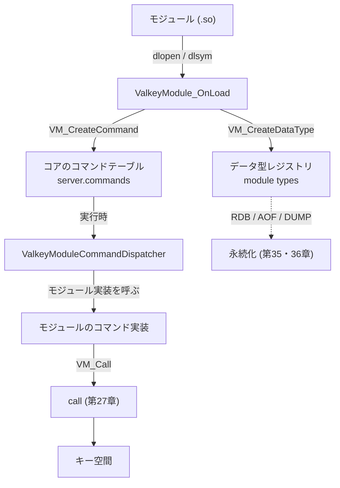

# 第49章 モジュールシステム

> **本章で読むソース**
>
> - [`src/module.c`](https://github.com/valkey-io/valkey/blob/9.1.0/src/module.c)
> - [`src/valkeymodule.h`](https://github.com/valkey-io/valkey/blob/9.1.0/src/valkeymodule.h)

## この章の狙い

Valkey は共有ライブラリ（`.so`）を読み込み、新しいコマンドやデータ型を C で追加できる。
本章では、その拡張機構がコアの内部構造をモジュールに直接触らせずに動かす仕組みを読む。
中心となるのは二つの設計判断である。
コアの実装が変わってもモジュールのバイナリ互換（ABI）を保つための不透明な API と、モジュールがコアの機能を安全に呼び戻すための `ValkeyModule_Call` である。

## 前提

- [第27章 コマンドの実行](../part04-server-events/27-command-execution.md)（コマンドテーブルと `call`）
- [第14章 オブジェクトとエンコーディング](../part03-objects-types/14-object-encoding.md)（`robj` とデータ型）

## モジュールが読み込まれるまで

モジュールは二つの経路で読み込まれる。
起動時に設定ファイルの `loadmodule` 行を処理する経路と、稼働中に `MODULE LOAD` コマンドを実行する経路である。
どちらも最終的に `moduleLoad` を呼ぶ。
起動時の経路は、設定で積み上げたキュー（`server.loadmodule_queue`）を順に処理する。

[`src/module.c` L13144-L13157](https://github.com/valkey-io/valkey/blob/9.1.0/src/module.c#L13144-L13157)

```c
void moduleLoadFromQueue(void) {
    listIter li;
    listNode *ln;

    listRewind(server.loadmodule_queue, &li);
    while ((ln = listNext(&li))) {
        struct moduleLoadQueueEntry *loadmod = ln->value;
        if (moduleLoad(loadmod->path, (void **)loadmod->argv, loadmod->argc, 0) == C_ERR) {
            serverLog(LL_WARNING, "Can't load module from %s: server aborting", loadmod->path);
            exit(1);
        }
        moduleLoadQueueEntryFree(loadmod);
        listDelNode(server.loadmodule_queue, ln);
    }
```

`moduleLoad` は共有ライブラリを `dlopen` で開き、初期化関数のシンボルを `dlsym` で引く。
探すシンボル名は `ValkeyModule_OnLoad` で、見つからなければ旧来の `RedisModule_OnLoad` を試す。
どちらも存在しなければ読み込みは失敗する。

[`src/module.c` L13454-L13479](https://github.com/valkey-io/valkey/blob/9.1.0/src/module.c#L13454-L13479)

```c
    handle = dlopen(path, dlopen_flags);
    if (handle == NULL) {
        serverLog(LL_WARNING, "Module %s failed to load: %s", path, dlerror());
        return C_ERR;
    }

    const char *onLoadNames[] = {"ValkeyModule_OnLoad", "RedisModule_OnLoad"};
    for (size_t i = 0; i < sizeof(onLoadNames) / sizeof(onLoadNames[0]); i++) {
        onload = (ModuleLoadFunc)(unsigned long)dlsym(handle, onLoadNames[i]);
        if (onload != NULL) {
            if (i != 0) {
                serverLog(LL_NOTICE, "Legacy Redis Module %s found", path);
            }
            break;
        }
    }
    // ... (中略) ...
    return moduleInitPostOnLoadResolved(onload, handle, path, module_argv, module_argc, is_loadex, 0);
```

`dlopen` に渡すフラグには、`__GLIBC__` などの環境で `RTLD_DEEPBIND` が加わる。
これは、複数のモジュールが同じ名前のシンボルを持っていても、各モジュールが自分のライブラリ内のシンボルを優先して解決するようにするためである。
モジュール同士のシンボル衝突を避ける配慮であり、コア側の API 公開の設計（後述）とあわせて、モジュールがグローバルなシンボル空間を汚さずに同居できるようにしている。

`OnLoad` のシンボルが解決できたら、`moduleInitPostOnLoadResolved` が一時的なコンテキストを作り、その `OnLoad` を呼ぶ。

[`src/module.c` L13350-L13378](https://github.com/valkey-io/valkey/blob/9.1.0/src/module.c#L13350-L13378)

```c
    ValkeyModuleCtx ctx;
    moduleCreateContext(&ctx, NULL, VALKEYMODULE_CTX_TEMP_CLIENT); /* We pass NULL since we don't have a module yet. */
    if (onload((void *)&ctx, module_argv, module_argc) == VALKEYMODULE_ERR) {
        // ... (中略：初期化失敗時のクリーンアップ) ...
        moduleFreeContext(&ctx);
        if (handle) {
            dlclose(handle);
        }
        return C_ERR;
    }
    // ... (中略) ...
    /* Module loaded! Register it. */
    dictAdd(modules, ctx.module->name, ctx.module);
```

`OnLoad` が成功を返すと、モジュールはグローバルな `modules` 辞書に名前で登録される。
このとき渡される `ValkeyModuleCtx`（コンテキスト）が、モジュールがコアと対話する唯一の窓口になる。
次節では、このコンテキストを通じてコアの API がどう公開されるかを見る。

本章でたどる全体像を先に図で示す。
モジュールは `OnLoad` の中でコマンドや型を登録し、稼働中は `VM_Call` を通じてコアのキー空間に働きかける。



## 不透明な API による ABI 安定

モジュール拡張の設計で核となる判断は、コア内部のデータ構造をモジュールに直接見せないことである。
モジュールは `robj` や `dict` の中身を構造体として触らない。
代わりに `ValkeyModuleCtx` や `ValkeyModuleKey` といった不透明なハンドルと、それらを操作する関数群越しにだけコアを操作する。
これにより、コアの実装（構造体のメモリレイアウトや内部関数）が変わっても、モジュールのバイナリは作り直さずに動き続けられる。

公開される関数はコア側では `VM_` という接頭辞を持ち、モジュール側では `ValkeyModule_` という名前で見える。
この二重の命名には理由がある。

[`src/module.c` L849-L857](https://github.com/valkey-io/valkey/blob/9.1.0/src/module.c#L849-L857)

```c
/* --------------------------------------------------------------------------
 * Service API exported to modules
 *
 * Note that all the exported APIs are called VM_<funcname> in the core
 * and ValkeyModule_<funcname> in the module side (defined as function
 * pointers in valkeymodule.h). In this way the dynamic linker does not
 * mess with our global function pointers, overriding it with the symbols
 * defined in the main executable having the same names.
 * -------------------------------------------------------------------------- */
```

モジュール側の `ValkeyModule_` 群は、コアの関数を直接呼ぶのではなく、関数ポインタである。
ヘッダ `valkeymodule.h` では、これらが関数ポインタ変数として宣言されている。

[`src/valkeymodule.h` L1567-L1573](https://github.com/valkey-io/valkey/blob/9.1.0/src/valkeymodule.h#L1567-L1573)

```c
VALKEYMODULE_API int (*ValkeyModule_CreateCommand)(ValkeyModuleCtx *ctx,
                                                   const char *name,
                                                   ValkeyModuleCmdFunc cmdfunc,
                                                   const char *strflags,
                                                   int firstkey,
                                                   int lastkey,
                                                   int keystep) VALKEYMODULE_ATTR;
```

これらのポインタは、モジュールの読み込み時に名前で解決されて埋められる。
解決の入り口は `VM_GetApi` である。
名前から関数ポインタを引く辞書 `server.moduleapi` を一段かませることで、モジュールはコアの関数アドレスを直接知る必要がなくなる。

[`src/module.c` L859-L870](https://github.com/valkey-io/valkey/blob/9.1.0/src/module.c#L859-L870)

```c
int VM_GetApi(const char *funcname, void **targetPtrPtr) {
    /* Lookup the requested module API and store the function pointer into the
     * target pointer. The function returns VALKEYMODULE_ERR if there is no such
     * named API, otherwise VALKEYMODULE_OK.
     *
     * This function is not meant to be used by modules developer, it is only
     * used implicitly by including valkeymodule.h. */
    dictEntry *he = dictFind(server.moduleapi, funcname);
    if (!he) return VALKEYMODULE_ERR;
    *targetPtrPtr = dictGetVal(he);
    return VALKEYMODULE_OK;
}
```

この辞書は起動時に、`REGISTER_API` マクロが各 `VM_` 関数を名前で登録して作る。
同じ関数を `ValkeyModule_` と `RedisModule_` の両方の名前で登録しているため、フォーク元の Redis 向けに書かれたモジュールのバイナリもそのまま動く。

[`src/module.c` L13005-L13013](https://github.com/valkey-io/valkey/blob/9.1.0/src/module.c#L13005-L13013)

```c
int moduleRegisterApi(const char *funcname, void *funcptr) {
    return dictAdd(server.moduleapi, (char *)funcname, funcptr);
}

/* Register Module APIs under both RedisModule_ and ValkeyModule_ namespaces
 * so that legacy Redis module binaries can continue to function */
#define REGISTER_API(name)                                                      \
    moduleRegisterApi("ValkeyModule_" #name, (void *)(unsigned long)VM_##name); \
    moduleRegisterApi("RedisModule_" #name, (void *)(unsigned long)VM_##name);
```

モジュール側で関数ポインタを一気に埋めるのが `ValkeyModule_Init` である。
これは `valkeymodule.h` に `static` 関数としてインライン展開されており、各モジュールのバイナリに埋め込まれる。
`ValkeyModule_Init` はコンテキストの先頭から `VM_GetApi` のアドレスを取り出し、それを使って残りのポインタを名前解決していく。

[`src/valkeymodule.h` L2325-L2338](https://github.com/valkey-io/valkey/blob/9.1.0/src/valkeymodule.h#L2325-L2338)

```c
static int ValkeyModule_Init(ValkeyModuleCtx *ctx, const char *name, int ver, int apiver) {
    void *getapifuncptr = ((void **)ctx)[0];
    ValkeyModule_GetApi = (int (*)(const char *, void *))(unsigned long)getapifuncptr;
    VALKEYMODULE_GET_API(Alloc);
    VALKEYMODULE_GET_API(TryAlloc);
    // ... (中略) ...
    VALKEYMODULE_GET_API(CreateCommand);
    VALKEYMODULE_GET_API(GetCommand);
    VALKEYMODULE_GET_API(CreateSubcommand);
```

先頭の一行 `((void **)ctx)[0]` が、コンテキスト構造体の最初のフィールドを読んでいる。
これはコア側の `ValkeyModuleCtx` の定義と対応している。

[`src/module.c` L160-L162](https://github.com/valkey-io/valkey/blob/9.1.0/src/module.c#L160-L162)

```c
struct ValkeyModuleCtx {
    void *getapifuncptr;                              /* NOTE: Must be the first field. */
    struct ValkeyModule *module;                      /* Module reference. */
```

コンテキストの先頭に `getapifuncptr` を必ず置くという約束だけが、コアとモジュールの間で共有される唯一のレイアウト前提である。
モジュールはこの一つのポインタから出発して、必要な API をすべて名前で引ける。
構造体の残りのフィールドの並びをモジュールが知る必要はない。
コアがフィールドを足したり並べ替えたりしても、先頭の約束さえ守れば既存のモジュールは動き続ける。
これが ABI 安定の仕掛けである。

`VALKEYMODULE_GET_API` の正体は、名前を文字列化して `ValkeyModule_GetApi` を呼ぶ薄いマクロである。

[`src/valkeymodule.h` L1546](https://github.com/valkey-io/valkey/blob/9.1.0/src/valkeymodule.h#L1546)

```c
#define VALKEYMODULE_GET_API(name) ValkeyModule_GetApi("ValkeyModule_" #name, ((void **)&ValkeyModule_##name))
```

## コマンドの登録

新しいコマンドの登録は `VM_CreateCommand` が担う。
モジュールが渡すのは、コマンド名、実装関数のポインタ、フラグ文字列、それにキー引数の位置情報である。
この関数はモジュールの初期化中（`OnLoad` の最中）にしか呼べない。
冒頭でその制約を確認している `ctx->module->onload` のチェックがそれである。

[`src/module.c` L1397-L1427](https://github.com/valkey-io/valkey/blob/9.1.0/src/module.c#L1397-L1427)

```c
int VM_CreateCommand(ValkeyModuleCtx *ctx,
                     const char *name,
                     ValkeyModuleCmdFunc cmdfunc,
                     const char *strflags,
                     int firstkey,
                     int lastkey,
                     int keystep) {
    if (!ctx->module->onload) return VALKEYMODULE_ERR;
    int64_t flags = strflags ? commandFlagsFromString((char *)strflags) : 0;
    if (flags == -1) return VALKEYMODULE_ERR;
    if ((flags & CMD_MODULE_NO_CLUSTER) && server.cluster_enabled) return VALKEYMODULE_ERR;

    /* Check if the command name is valid. */
    if (!isCommandNameValid(name)) return VALKEYMODULE_ERR;

    /* Check if the command name is busy. */
    if (lookupCommandByCString(name) != NULL) return VALKEYMODULE_ERR;

    sds declared_name = sdsnew(name);
    ValkeyModuleCommand *cp = moduleCreateCommandProxy(ctx->module, declared_name, sdsdup(declared_name), cmdfunc,
                                                       flags, firstkey, lastkey, keystep);
    cp->serverCmd->arity = cmdfunc ? -1 : -2; /* Default value, can be changed later via dedicated API */
    /* Drain IO queue before modifying commands dictionary to prevent concurrent access while modifying it. */
    drainIOThreadsQueue();
    serverAssert(hashtableAdd(server.commands, cp->serverCmd));
    serverAssert(hashtableAdd(server.orig_commands, cp->serverCmd));
    cp->serverCmd->id = ACLGetCommandID(declared_name); /* ID used for ACL. */
    /* Invalidate COMMAND response cache since we added a new command */
    invalidateCommandCache();
    return VALKEYMODULE_OK;
}
```

名前の検証と重複チェックを通すと、`moduleCreateCommandProxy` が「プロキシ」を作る。
プロキシは、コアのコマンドテーブルに載せる `serverCommand` 構造体と、モジュール側の実装関数を結びつける橋渡しである。
できあがった `serverCommand` をコマンドテーブル `server.commands` に追加することで、モジュールのコマンドはコア組み込みのコマンドと同じ仕組みで実行されるようになる。
コマンドテーブルとコマンドの探索については第27章で扱う。

プロキシの肝は、コマンドの実体関数（`proc`）に共通のディスパッチャを差し込むところにある。

[`src/module.c` L1451-L1461](https://github.com/valkey-io/valkey/blob/9.1.0/src/module.c#L1451-L1461)

```c
    cp = zcalloc(sizeof(*cp));
    cp->module = module;
    cp->func = cmdfunc;
    cp->serverCmd = zcalloc(sizeof(*serverCmd));
    cp->serverCmd->declared_name = declared_name; /* SDS for module commands */
    cp->serverCmd->fullname = fullname;
    cp->serverCmd->current_name = fullname;
    cp->serverCmd->group = COMMAND_GROUP_MODULE;
    cp->serverCmd->proc = ValkeyModuleCommandDispatcher;
    cp->serverCmd->flags = flags | CMD_MODULE;
    cp->serverCmd->module_cmd = cp;
```

コアがこのコマンドを実行するとき、呼ばれるのはモジュールの関数ではなく `ValkeyModuleCommandDispatcher` である。
ディスパッチャはコンテキストを組み立て、そこにクライアントを差してから、プロキシが覚えているモジュール実装 `cp->func` を呼ぶ。

[`src/module.c` L1042-L1049](https://github.com/valkey-io/valkey/blob/9.1.0/src/module.c#L1042-L1049)

```c
void ValkeyModuleCommandDispatcher(client *c) {
    ValkeyModuleCommand *cp = c->cmd->module_cmd;
    ValkeyModuleCtx ctx;
    moduleCreateContext(&ctx, cp->module, VALKEYMODULE_CTX_COMMAND);

    ctx.client = c;
    cp->func(&ctx, (void **)c->argv, c->argc);
    moduleFreeContext(&ctx);
```

ここで `argv` が `void **` にキャストされて渡されている点に注目したい。
コア内部では引数は `robj *` の配列だが、モジュールには中身を見せず不透明なポインタとして渡す。
モジュールは前節の API（`ValkeyModuleString` を操作する `VM_` 関数群）を通してしか、この引数を読めない。
コマンド実装と引数受け渡しの両方で、コアの実体型を隠す方針が貫かれている。

## モジュールからコマンドを実行する

モジュールが拡張で行いたい処理の多くは、既存のコマンドの組み合わせで足りる。
そのために、モジュールからコアのコマンドを呼び戻す経路が `VM_Call` である。
これが二つ目の核となる設計判断である。
`VM_Call` はコマンド名と、引数の型を表すフォーマット文字列を取り、結果を `ValkeyModuleCallReply` という不透明な返信オブジェクトで返す。

[`src/module.c` L6555-L6561](https://github.com/valkey-io/valkey/blob/9.1.0/src/module.c#L6555-L6561)

```c
ValkeyModuleCallReply *VM_Call(ValkeyModuleCtx *ctx, const char *cmdname, const char *fmt, ...) {
    client *c = NULL;
    robj **argv = NULL;
    int argc = 0, flags = 0;
    va_list ap;
    ValkeyModuleCallReply *reply = NULL;
    sds reply_error_msg = NULL;
```

`VM_Call` はフォーマット文字列から引数の `robj` 配列を組み立て、専用のクライアントオブジェクトを用意してコマンドを探索する。
コマンドの存在と引数の数を検証したうえで、コア共通のコマンド実行関数 `call` に処理を委ねる。

[`src/module.c` L6919-L6925](https://github.com/valkey-io/valkey/blob/9.1.0/src/module.c#L6919-L6925)

```c
    /* Run the command */
    int call_flags = CMD_CALL_FROM_MODULE;
    if (replicate) {
        if (!(flags & VALKEYMODULE_CALL_ARGV_NO_AOF)) call_flags |= CMD_CALL_PROPAGATE_AOF;
        if (!(flags & VALKEYMODULE_CALL_ARGV_NO_REPLICAS)) call_flags |= CMD_CALL_PROPAGATE_REPL;
    }
    call(c, call_flags);
```

ここが設計の要である。
モジュールはキー空間を自前で書き換えるのではなく、コアと同じ `call` を通してコマンドを実行する。
`call` を経由するため、コマンドの伝播（レプリケーションと AOF）、有効期限の処理、キー空間通知といったコアの一連の振る舞いが、モジュール発のコマンドにも一律に適用される。
`CMD_CALL_FROM_MODULE` フラグでモジュール由来であることを伝え、伝播の有無はフォーマット文字列の修飾子（`!`、`A`、`R`）で制御する。
`call` 自体の流れは第27章で扱う。

`VM_Call` のフォーマット文字列には、伝播以外にも実行モードを切り替える修飾子がある。
たとえば `C` はコンテキストに紐づくユーザーの権限でコマンドを実行させ、ACL のチェックを通す。
`S` はスクリプトと同じ制約下で実行し、`D` は実際の実行手前まで進めて成否だけを返す「ドライラン」になる。

[`src/module.c` L6469-L6479](https://github.com/valkey-io/valkey/blob/9.1.0/src/module.c#L6469-L6479)

```c
 *     * `C` -- Run a command as the user attached to the context.
 *              User is either attached automatically via the client that directly
 *              issued the command and created the context or via VM_SetContextUser.
 *              If the context is not directly created by an issued command (such as a
 *              background context and no user was set on it via VM_SetContextUser,
 *              VM_Call will fail.
 *              Checks if the command can be executed according to ACL rules and causes
 *              the command to run as the determined user, so that any future user
 *              dependent activity, such as ACL checks within scripts will proceed as
 *              expected.
 *              Otherwise, the command will run as the unrestricted user.
```

返信オブジェクト `ValkeyModuleCallReply` も不透明型である。
モジュールはこのハンドルを `VM_CallReplyType` や `VM_CallReplyInteger` などで読み解く。
返信の解析は遅延式で、最初は型と長さだけを持ち、モジュールがアクセスしたときに必要なぶんだけ解釈する。
返信を使い終えたら `VM_FreeCallReply` で解放する。

## 独自データ型の登録

文字列やリストなど既存の型では表せない値を扱いたいモジュールは、独自のデータ型を登録できる。
登録は `VM_CreateDataType` が行う。
モジュールは9文字の型名とエンコーディングのバージョン番号、それに一連のコールバック関数の表を渡す。

[`src/module.c` L7459-L7466](https://github.com/valkey-io/valkey/blob/9.1.0/src/module.c#L7459-L7466)

```c
moduleType *VM_CreateDataType(ValkeyModuleCtx *ctx, const char *name, int encver, void *typemethods_ptr) {
    if (!ctx->module->onload) return NULL;
    uint64_t id = moduleTypeEncodeId(name, encver);
    if (id == 0) return NULL;
    if (moduleTypeLookupModuleByName(name) != NULL) return NULL;

    long typemethods_version = ((long *)typemethods_ptr)[0];
    if (typemethods_version == 0) return NULL;
```

9文字の型名とバージョンは、64ビットの「型ID」へ符号化される。
このIDが RDB ファイルに書き込まれ、ファイルを読み戻すときにどのモジュールの型かを再び突き合わせる鍵になる。

[`src/module.c` L7149-L7153](https://github.com/valkey-io/valkey/blob/9.1.0/src/module.c#L7149-L7153)

```c
/* Turn a 9 chars name in the specified charset and a 10 bit encver into
 * a single 64 bit unsigned integer that represents this exact module name
 * and version. This final number is called a "type ID" and is used when
 * writing module exported values to RDB files, in order to re-associate the
 * value to the right module to load them during RDB loading.
```

コールバックの表には、バージョンごとに段階的に拡張されたフィールドが入っている。
基本となるのは RDB の保存と読み込み、AOF への書き出し、メモリ使用量の算出、`DEBUG DIGEST` 用のダイジェスト計算、それに値の解放である。

[`src/module.c` L7498-L7506](https://github.com/valkey-io/valkey/blob/9.1.0/src/module.c#L7498-L7506)

```c
    moduleType *mt = zcalloc(sizeof(*mt));
    mt->id = id;
    mt->module = ctx->module;
    mt->rdb_load = tms->rdb_load;
    mt->rdb_save = tms->rdb_save;
    mt->aof_rewrite = tms->aof_rewrite;
    mt->mem_usage = tms->mem_usage;
    mt->digest = tms->digest;
    mt->free = tms->free;
```

これらのコールバックを登録しておくことで、モジュール独自の値が RDB と AOF、それに `DUMP` と `RESTORE` の対象になる。
コアは値の中身を理解しないまま、登録された関数を呼んで永続化と復元を任せる。
永続化の仕組みは第35章（RDB）と第36章（AOF）で扱う。

登録された型は、モジュール構造体の `types` リストにつながれる（`listAddNodeTail(ctx->module->types, mt)`）。
RDB を読み戻すときは、ファイルに書かれた型IDから `moduleTypeLookupModuleByID` で対応するモジュールと型を引く。
データ型を提供するモジュールは原則としてアンロードできないため、この対応づけは小さなキャッシュで高速化されている。

## コンテキスト、メモリ管理、ブロッキング

`ValkeyModuleCtx` は API の窓口であると同時に、呼び出しの間の状態を抱える器でもある。
モジュールが API で確保したオブジェクトを覚えておく自動メモリのキュー、後で長さを埋める応答配列、プールアロケータの先頭などをコンテキストが保持する。

[`src/module.c` L160-L186](https://github.com/valkey-io/valkey/blob/9.1.0/src/module.c#L160-L186)

```c
struct ValkeyModuleCtx {
    void *getapifuncptr;                              /* NOTE: Must be the first field. */
    struct ValkeyModule *module;                      /* Module reference. */
    client *client;                                   /* Client calling a command. */
    struct ValkeyModuleBlockedClient *blocked_client; /* Blocked client for
                                                        thread safe context. */
    struct AutoMemEntry *amqueue;                     /* Auto memory queue of objects to free. */
    // ... (中略) ...
    struct ValkeyModulePoolAllocBlock *pa_head;
    long long next_yield_time;

    const struct ValkeyModuleUser *user; /* ValkeyModuleUser commands executed via
                                           VM_Call should be executed as, if set */
};
```

自動メモリ管理は、コマンドの実装中に確保したキーや文字列や応答を、ディスパッチャがコンテキストを破棄するときにまとめて解放する仕組みである。
`ValkeyModuleCommandDispatcher` の末尾で呼ばれる `moduleFreeContext` が、この回収を行う。
モジュールが解放漏れを起こしにくくするための配慮である。

コンテキストにはもう一つ、プールアロケータがある。
小さな確保を多数行うとき、ブロック単位でまとめて確保して切り出すことで、確保ごとのオーバーヘッドを下げる。
確保したメモリはコールバックが返るときに一括で解放されるため、寿命の短い一時データに向く。

[`src/module.c` L126-L134](https://github.com/valkey-io/valkey/blob/9.1.0/src/module.c#L126-L134)

```c
/* The pool allocator block. Modules can allocate memory via this special
 * allocator that will automatically release it all once the callback returns.
 * This means that it can only be used for ephemeral allocations. However
 * there are two advantages for modules to use this API:
 *
 * 1) The memory is automatically released when the callback returns.
 * 2) This allocator is faster for many small allocations since whole blocks
 *    are allocated, and small pieces returned to the caller just advancing
 *    the index of the allocation.
```

最後に、モジュールはクライアントをブロックして、別スレッドで時間のかかる処理を進めることもできる。
`VM_BlockClient` がブロック対象のハンドル（`ValkeyModuleBlockedClient`）を返し、処理が終わったらモジュールがクライアントを起こして応答を返す。
これはモジュールが単一スレッドのイベントループを長時間占有せずに重い処理を行うための仕組みだが、本章では存在に触れるにとどめる。

## まとめ

- モジュールは共有ライブラリを `dlopen` で読み込み、`ValkeyModule_OnLoad` を初期化の入り口として呼ぶ。読み込みは起動時の `loadmodule` 設定と稼働中の `MODULE LOAD` の二経路がある。
- コアの API は `VM_` 関数群として実装され、モジュールには関数ポインタ（`ValkeyModule_` 群）として公開される。モジュールはコンテキスト先頭の `getapifuncptr` だけを足がかりに、必要な API を名前で解決する。
- コンテキストや返信などはすべて不透明なハンドルで渡され、コアの実体型は隠される。これによりコア実装が変わってもモジュールの ABI が保たれる。
- `VM_CreateCommand` はプロキシ経由でモジュールのコマンドをコアのコマンドテーブルに載せ、共通の `ValkeyModuleCommandDispatcher` で実行する。
- `VM_Call` はモジュールからコアのコマンドを呼び戻す経路で、コア共通の `call` を通すことで伝播やキー空間通知などの振る舞いを一律に適用する。
- `VM_CreateDataType` で独自型を登録すると、コールバック表を通じて RDB と AOF、それに `DUMP` に対応できる。型IDが永続化と復元の突き合わせの鍵になる。

## 関連する章

- [第27章 コマンドの実行](../part04-server-events/27-command-execution.md)（コマンドテーブルと `call`）
- [第14章 オブジェクトとエンコーディング](../part03-objects-types/14-object-encoding.md)（`robj` とデータ型）
- [第35章 RDB](../part06-persistence/35-rdb.md)（モジュール型の永続化）
- [第36章 AOF](../part06-persistence/36-aof.md)（モジュール型の AOF 対応）
