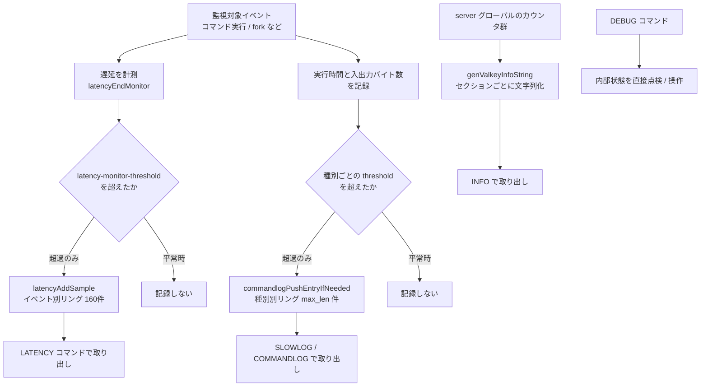

# 第50章 可観測性とデバッグ

> **本章で読むソース**
>
> - [`src/server.c`](https://github.com/valkey-io/valkey/blob/9.1.0/src/server.c)（`genValkeyInfoString` / `infoCommand`）
> - [`src/latency.c`](https://github.com/valkey-io/valkey/blob/9.1.0/src/latency.c)（遅延監視）
> - [`src/commandlog.c`](https://github.com/valkey-io/valkey/blob/9.1.0/src/commandlog.c)（コマンドログ）
> - [`src/debug.c`](https://github.com/valkey-io/valkey/blob/9.1.0/src/debug.c)（`DEBUG` コマンド）

## この章の狙い

Valkey が自分自身の状態をどう外へ見せるかを読む。
`INFO` がサーバ状態をどう文字列に組み立てるか、遅延監視がスパイクをどう拾うか、コマンドログが遅い実行や大きな入出力をどう残すか、`DEBUG` が内部点検の入口をどう開くかを、実装から理解できるようにする。
これらに共通する設計、すなわち平常時の記録を閾値で抑え、メモリを固定リングで一定に保つ仕組みを、機構レベルで押さえる。

## 前提

- コマンド実行の流れと統計の出どころは [第27章](../part04-server-events/27-command-execution.md) で扱う。本章で参照する遅延サンプルとコマンドログの記録は、いずれもコマンド実行直後に呼ばれる。
- オブジェクトのエンコーディングは [第14章](../part03-objects-types/14-object-encoding.md)、有効期限の能動失効は [第31章](../part05-database/31-expire.md) を前提とする。`DEBUG OBJECT` と `DEBUG SET-ACTIVE-EXPIRE` はこれらの内部状態を直接のぞく。

## INFO がサーバ状態を文字列に組み立てる

運用監視の基盤は `INFO` コマンドである。
クライアントが `INFO` を送ると、サーバはメモリ、クライアント、永続化、レプリケーション、統計といったセクションを一つの大きなテキストにまとめて返す。
この組み立てを担うのが `genValkeyInfoString` である。

入口の `infoCommand` は短い。
要求されたセクション名を解析し、本体に渡し、結果をそのまま返すだけである。

[`src/server.c` L6770-L6784](https://github.com/valkey-io/valkey/blob/9.1.0/src/server.c#L6770-L6784)

```c
/* INFO [<section> [<section> ...]] */
void infoCommand(client *c) {
    if (server.sentinel_mode) {
        sentinelInfoCommand(c);
        return;
    }
    int all_sections = 0;
    int everything = 0;
    dict *sections_dict = genInfoSectionDict(c->argv + 1, c->argc - 1, NULL, &all_sections, &everything);
    sds info = genValkeyInfoString(sections_dict, all_sections, everything);
    addReplyVerbatim(c, info, sdslen(info), "txt");
    sdsfree(info);
    releaseInfoSectionDict(sections_dict);
    return;
}
```

引数の解析は `genInfoSectionDict` が引き受ける。
この関数は要求されたセクション名を `dict`（キー集合）に積み、`all` と `everything` のキーワードを `all_sections` / `everything` フラグに変換する。
引数が省略されたときは既定のセクション一覧を使い、しかもその `dict` を一度だけ作って使い回す。

[`src/server.c` L5998-L6023](https://github.com/valkey-io/valkey/blob/9.1.0/src/server.c#L5998-L6023)

```c
dict *genInfoSectionDict(robj **argv, int argc, char **defaults, int *out_all, int *out_everything) {
    char *default_sections[] = {
        "server",
        "clients",
        "memory",
        // ... (中略) ...
        "keyspace",
        NULL,
    };
    if (!defaults) defaults = default_sections;

    if (argc == 0) {
        /* In this case we know the dict is not gonna be modified, so we cache
         * it as an optimization for a common case. */
        if (cached_default_info_sections) return cached_default_info_sections;
        cached_default_info_sections = dictCreate(&stringSetDictType);
        dictExpand(cached_default_info_sections, 16);
        addInfoSectionsToDict(cached_default_info_sections, defaults);
        return cached_default_info_sections;
    }
```

引数なしの `INFO` は最も多い呼び方である。
そのため既定セクションの `dict` を `cached_default_info_sections` に保持し、二回目以降は構築せずに返す。
このキャッシュは、毎回の `INFO` で同じ `dict` を作り直す無駄を省く小さな最適化である。

セクションをどれだけ出すかが決まると、`genValkeyInfoString` が本体を組み立てる。
セクションごとに整数の番号は振られていない。
出力すべきかどうかは、その場で `all_sections || dictFind(section_dict, "<名前>")` という文字列照合で判定する。

[`src/server.c` L6065-L6070](https://github.com/valkey-io/valkey/blob/9.1.0/src/server.c#L6065-L6070)

```c
sds genValkeyInfoString(dict *section_dict, int all_sections, int everything) {
    sds info = sdsempty();
    time_t uptime = server.unixtime - server.stat_starttime;
    int j;
    int sections = 0;
    if (everything) all_sections = 1;
```

各セクションは同じ型をなぞる。
出力対象かを判定し、すでに一つ以上出力していれば区切りの `\r\n` を挟み、`sdscatprintf` で「`# セクション名`」に続けて行ごとの指標を連結する。
たとえば統計セクションは、累計接続数や毎秒処理コマンド数といった指標をこの形で並べる。

[`src/server.c` L6422-L6428](https://github.com/valkey-io/valkey/blob/9.1.0/src/server.c#L6422-L6428)

```c
        if (sections++) info = sdscat(info, "\r\n");
        info = sdscatprintf(
            info,
            "# Stats\r\n" FMTARGS(
                "total_connections_received:%lld\r\n", server.stat_numconnections,
                "total_commands_processed:%lld\r\n", server.stat_numcommands,
                "instantaneous_ops_per_sec:%lld\r\n", getInstantaneousMetric(STATS_METRIC_COMMAND),
                // ... (中略) ...
```

`if (sections++)` という書き方が、セクション間の改行を一つだけ正しく入れる役割を担う。
最初のセクションでは `sections` が `0` なので区切りを入れず、二つ目以降で `\r\n` を前置する。
出力される指標の値は、ほとんどが `server` グローバル構造体のカウンタ（`server.stat_numconnections` など）をそのまま読み出したものである。
これらのカウンタをいつ更新するかはコマンド実行の経路に属する話で、[第27章](../part04-server-events/27-command-execution.md) で扱う。

`genValkeyInfoString` が出力するセクションは多い。
`Server`、`Clients`、`Memory`、`Persistence`、`Stats`、`Replication`、`CPU`、`Commandstats`、`Errorstats`、`Latencystats`、`Cluster`、`Keyspace` などが、それぞれ同じ判定と連結の型で並んでいる。
これらのうち `Latencystats` と `Commandstats` は、次に見る遅延監視やコマンド単位のヒストグラムと結びついている。

## 遅延監視がスパイクだけを拾う

`INFO` がカウンタの現在値を見せるのに対し、遅延監視は時間方向の異常を捉える。
フォークやコマンド実行といった監視対象のイベントが、設定した閾値を超えて遅くなったとき、その遅延スパイクを記録する。
記録された履歴は `LATENCY` コマンドで取り出せる。

記録の入口は `latencyAddSample` である。
イベント名ごとに時系列を持ち、なければその場で作る。
最大値、合計、件数を更新し、サンプルを固定長の配列へ書き込む。

[`src/latency.c` L79-L113](https://github.com/valkey-io/valkey/blob/9.1.0/src/latency.c#L79-L113)

```c
void latencyAddSample(const char *event, ustime_t latency_us) {
    mstime_t latency = latency_us / 1000;
    struct latencyTimeSeries *ts = dictFetchValue(server.latency_events, event);
    time_t now = time(NULL);
    int prev;

    /* Create the time series if it does not exist. */
    if (ts == NULL) {
        ts = zmalloc(sizeof(*ts));
        ts->idx = 0;
        // ... (中略) ...
    }

    if (latency > ts->max) ts->max = latency;
    ts->sum += latency;
    ts->cnt++;

    /* If the previous sample is in the same second, we update our old sample
     * if this latency is > of the old one, or just return. */
    prev = (ts->idx + LATENCY_TS_LEN - 1) % LATENCY_TS_LEN;
    if (ts->samples[prev].time == now) {
        if (latency > ts->samples[prev].latency) ts->samples[prev].latency = latency;
        return;
    }

    ts->samples[ts->idx].time = now;
    ts->samples[ts->idx].latency = latency;

    ts->idx++;
    if (ts->idx == LATENCY_TS_LEN) ts->idx = 0;
}
```

サンプルの格納先は要素数 `LATENCY_TS_LEN`（160）のリング配列である。
`idx` が次に書く位置を指し、末尾まで来たら先頭へ戻る。
同じ秒に複数のスパイクが来たときは新しいサンプルを増やさず、その秒の最大遅延だけを残す。
これにより一つのイベントが保持する履歴は常に最大160件で頭打ちになり、メモリは一定に保たれる。

ここで重要なのは、`latencyAddSample` が無条件には呼ばれないことである。
呼び出しは `latencyAddSampleIfNeeded` マクロを介し、このマクロが閾値による足切りを行う。

[`src/latency.h` L92-L94](https://github.com/valkey-io/valkey/blob/9.1.0/src/latency.h#L92-L94)

```c
/* Add the sample only if the elapsed time is >= to the configured threshold. */
#define latencyAddSampleIfNeeded(event, var) \
    if (server.latency_monitor_threshold && (var) >= server.latency_monitor_threshold * 1000) latencyAddSample((event), (var));
```

このマクロが、平常時の記録を抑える最適化の核心である。
`latency-monitor-threshold` が `0`（無効）なら何もしない。
有効であっても、計測した遅延が閾値（ミリ秒）に満たなければ記録しない。
監視が単なるカウントではなく「異常だけ」を残すのは、この一文の条件判定による。
正常に速いコマンドは無数に流れるため、それらを毎回 `dict` 検索とサンプル書き込みにかけると、観測のためのコストが本来の処理を圧迫する。
閾値で足切りすることで、記録のコストは遅い事象が起きたときだけ発生する。

このマクロが実際に置かれるのが、コマンド実行直後の経路である。
高速コマンドかどうかでイベント名を選び、計測した遅延を渡す。

[`src/server.c` L3969-L3978](https://github.com/valkey-io/valkey/blob/9.1.0/src/server.c#L3969-L3978)

```c
    if (update_command_stats) {
        char *latency_event = (real_cmd->flags & CMD_FAST) ? "fast-command" : "command";
        latencyAddSampleIfNeeded(latency_event, duration);
        if (real_cmd->flags & CMD_FAST) {
            latencyTraceIfNeeded(server, fast_command, duration);
        } else {
            latencyTraceIfNeeded(server, command, duration);
        }
        if (server.execution_nesting == 0) durationAddSample(EL_DURATION_TYPE_CMD, duration);
    }
```

フォークも同じ仕組みで監視される。
子プロセス生成にかかった時間 `server.stat_fork_time` を `"fork"` イベントとして記録する。

[`src/server.c` L7102](https://github.com/valkey-io/valkey/blob/9.1.0/src/server.c#L7102)

```c
        latencyAddSampleIfNeeded("fork", server.stat_fork_time);
```

記録した履歴の取り出しは `latencyCommand` が担う。
`LATENCY HISTORY <event>` はイベントの時系列サンプルを返し、`LATENCY LATEST` は全イベントの最新サンプルを一覧する。
`LATENCY RESET` は履歴を消す。

[`src/latency.c` L684-L727](https://github.com/valkey-io/valkey/blob/9.1.0/src/latency.c#L684-L727)

```c
void latencyCommand(client *c) {
    struct latencyTimeSeries *ts;

    if (!strcasecmp(objectGetVal(c->argv[1]), "history") && c->argc == 3) {
        /* LATENCY HISTORY <event> */
        ts = dictFetchValue(server.latency_events, objectGetVal(c->argv[2]));
        if (ts == NULL) {
            addReplyArrayLen(c, 0);
        } else {
            latencyCommandReplyWithSamples(c, ts);
        }
    // ... (中略) ...
    } else if (!strcasecmp(objectGetVal(c->argv[1]), "latest") && c->argc == 2) {
        /* LATENCY LATEST */
        latencyCommandReplyWithLatestEvents(c);
    // ... (中略) ...
    } else if (!strcasecmp(objectGetVal(c->argv[1]), "reset") && c->argc >= 2) {
        /* LATENCY RESET */
        if (c->argc == 2) {
            addReplyLongLong(c, latencyResetEvent(NULL));
        } else {
            int j, resets = 0;

            for (j = 2; j < c->argc; j++) resets += latencyResetEvent(objectGetVal(c->argv[j]));
            addReplyLongLong(c, resets);
        }
    // ... (中略) ...
```

このほか `LATENCY DOCTOR` は履歴を人間が読める診断レポートに変換し（`createLatencyReport`）、`LATENCY GRAPH` は ASCII のスパークラインを描く。
`LATENCY HISTOGRAM` だけは別系統で、`latencyAddSample` のリング履歴ではなく、コマンドごとに保持する HDR ヒストグラム（`cmd->latency_histogram`）から累積分布を返す。
こちらは `INFO` の `Latencystats` セクションと同じデータ源を使う。

## コマンドログが遅い実行と大きな入出力を残す

遅延監視が「いつ、どれだけ遅かったか」の時系列を残すのに対し、コマンドログは「どのコマンドが」遅かったかを引数つきで残す。
記録の種別は三つある。
実行が遅かったもの、要求が大きかったもの、応答が大きかったものである。

[`src/server.h` L370-L376](https://github.com/valkey-io/valkey/blob/9.1.0/src/server.h#L370-L376)

```c
/* Type of commandlog */
typedef enum {
    COMMANDLOG_TYPE_SLOW = 0,
    COMMANDLOG_TYPE_LARGE_REQUEST,
    COMMANDLOG_TYPE_LARGE_REPLY,
    COMMANDLOG_TYPE_NUM
} commandlog_type;
```

コマンド実行直後、`commandlogPushCurrentCommand` が三つの種別すべてを順に判定する。
スローには実行時間 `duration` を、大きな要求と応答にはそれぞれの転送バイト数を渡す。

[`src/commandlog.c` L169-L171](https://github.com/valkey-io/valkey/blob/9.1.0/src/commandlog.c#L169-L171)

```c
    commandlogPushEntryIfNeeded(c, argv, argc, duration, COMMANDLOG_TYPE_SLOW);
    commandlogPushEntryIfNeeded(c, argv, argc, net_input_bytes_curr_cmd, COMMANDLOG_TYPE_LARGE_REQUEST);
    commandlogPushEntryIfNeeded(c, argv, argc, net_output_bytes_curr_cmd, COMMANDLOG_TYPE_LARGE_REPLY);
```

種別ごとの記録判定は `commandlogPushEntryIfNeeded` に集約される。
この関数が、遅延監視と同じ「閾値による足切り」と「固定リングによるメモリ上限」を同時に実装している。

[`src/commandlog.c` L105-L112](https://github.com/valkey-io/valkey/blob/9.1.0/src/commandlog.c#L105-L112)

```c
static void commandlogPushEntryIfNeeded(client *c, robj **argv, int argc, long long value, int type) {
    if (server.commandlog[type].threshold < 0 || server.commandlog[type].max_len == 0) return; /* The corresponding commandlog disabled */
    if (value >= server.commandlog[type].threshold)
        listAddNodeHead(server.commandlog[type].entries, commandlogCreateEntry(c, argv, argc, value, type));

    /* Remove old entries if needed. */
    while (listLength(server.commandlog[type].entries) > server.commandlog[type].max_len) listDelNode(server.commandlog[type].entries, listLast(server.commandlog[type].entries));
}
```

判定は二段である。
種別ごとの `threshold` が負か、`max_len` が `0` なら、そのログは無効として即座に戻る。
有効なら、計測値が閾値以上のときだけ新しいエントリを先頭に積む。
積んだあとリストが `max_len` を超えていれば、末尾から削る。
この先頭追加と末尾削除の組み合わせが、固定長のリングバッファとして働く。
新しいものが入るたびに古いものが押し出されるため、保持件数は `max_len` で頭打ちになり、コマンドログのメモリは一定に保たれる。

エントリの生成 `commandlogCreateEntry` も省メモリを意識している。
引数は最大 `COMMANDLOG_ENTRY_MAX_ARGC`（32）までしか保存せず、超過分は「あと何個あったか」を示す擬似引数に置き換える。
長すぎる文字列引数も `COMMANDLOG_ENTRY_MAX_STRING`（128）バイトで切り詰める。

[`src/commandlog.c` L42-L55](https://github.com/valkey-io/valkey/blob/9.1.0/src/commandlog.c#L42-L55)

```c
        if (ceargc != argc && j == ceargc - 1) {
            ce->argv[j] =
                createObject(OBJ_STRING, sdscatprintf(sdsempty(), "... (%d more arguments)", argc - ceargc + 1));
        } else {
            if (clientCommandArgShouldBeRedacted(c, j)) {
                ce->argv[j] = shared.redacted;
                /* Trim too long strings as well... */
            } else if (argv[j]->type == OBJ_STRING && sdsEncodedObject(argv[j]) &&
                       sdslen(objectGetVal(argv[j])) > COMMANDLOG_ENTRY_MAX_STRING) {
                sds s = sdsnewlen(objectGetVal(argv[j]), COMMANDLOG_ENTRY_MAX_STRING);

                s = sdscatprintf(s, "... (%lu more bytes)",
                                 (unsigned long)sdslen(objectGetVal(argv[j])) - COMMANDLOG_ENTRY_MAX_STRING);
                ce->argv[j] = createObject(OBJ_STRING, s);
```

巨大な引数をそのまま保存すると、診断のためのログがデータ本体に匹敵するメモリを食う。
件数だけでなく一件あたりの大きさにも上限を設けることで、リングバッファ全体の上限が実効的に効くようにしている。

記録の取り出しは二つのコマンドが担う。
`SLOWLOG` はスロー種別だけを扱う従来からのコマンドで、`COMMANDLOG` は三種別すべてを `<type>` 引数で選んで取り出す新しいコマンドである。
両者とも `commandlogGetReply` を通じて、エントリの ID、時刻、計測値、引数配列、クライアントのアドレスと名前を返す。

## DEBUG が内部状態の点検口を開く

`DEBUG` は運用とテストのための入口である。
オブジェクトのエンコーディング確認、人工的なスリープ、能動失効の停止など、内部状態を直接のぞいたり操作したりするサブコマンドを束ねている。
入口の `debugCommand` は、`c->argv[1]` のサブコマンド名で分岐する一つの大きな関数である。

[`src/debug.c` L398](https://github.com/valkey-io/valkey/blob/9.1.0/src/debug.c#L398)

```c
void debugCommand(client *c) {
```

代表的なのが `DEBUG OBJECT` である。
キーに対応する値オブジェクトの低レベル情報、すなわちアドレス、参照カウント、エンコーディング、直列化後の長さなどを返す。
エンコーディングがクイックリストのときは、ノード数や平均充填率といった内部指標も付け足す。

[`src/debug.c` L658-L666](https://github.com/valkey-io/valkey/blob/9.1.0/src/debug.c#L658-L666)

```c
        strenc = strEncoding(val->encoding);

        char extra[138] = {0};
        if (val->encoding == OBJ_ENCODING_QUICKLIST) {
            char *nextra = extra;
            int remaining = sizeof(extra);
            quicklist *ql = objectGetVal(val);
            /* Add number of quicklist nodes */
            int used = snprintf(nextra, remaining, " ql_nodes:%lu", ql->len);
```

`strEncoding` が返す文字列が、`listpack` か `quicklist` か `intset` かといったエンコーディングの実体である。
あるキーが期待どおりのコンパクトエンコーディングを使っているか、それとも閾値を超えて汎用表現に切り替わったかを、`DEBUG OBJECT` で確認できる。
エンコーディング切替の閾値そのものは [第14章](../part03-objects-types/14-object-encoding.md) で扱う。

`DEBUG SLEEP` は、サーバを指定秒数だけ止める。
単一スレッドのイベントループは、この `nanosleep` の間まったく前へ進めない。

[`src/debug.c` L882-L890](https://github.com/valkey-io/valkey/blob/9.1.0/src/debug.c#L882-L890)

```c
    } else if (!strcasecmp(objectGetVal(c->argv[1]), "sleep") && c->argc == 3) {
        double dtime = valkey_strtod_sds(objectGetVal(c->argv[2]), NULL);
        long long utime = dtime * 1000000;
        struct timespec tv;

        tv.tv_sec = utime / 1000000;
        tv.tv_nsec = (utime % 1000000) * 1000;
        nanosleep(&tv, NULL);
        addReply(c, shared.ok);
```

この人工的な停止は、遅延監視やコマンドログがスパイクを正しく拾うかを試すのに使える。
サーバ全体が止まるという事実そのものが、単一スレッドモデルの帰結を端的に示す。

`DEBUG SET-ACTIVE-EXPIRE` は、背景で走る能動失効サイクルを止めたり再開したりする。
`server.active_expire_enabled` を切り替えるだけの一行である。

[`src/debug.c` L891-L893](https://github.com/valkey-io/valkey/blob/9.1.0/src/debug.c#L891-L893)

```c
    } else if (!strcasecmp(objectGetVal(c->argv[1]), "set-active-expire") && c->argc == 3) {
        server.active_expire_enabled = atoi(objectGetVal(c->argv[2]));
        addReply(c, shared.ok);
```

これを `0` にすると、有効期限切れのキーが背景処理で消されなくなる。
アクセス時の遅延失効だけが残るため、能動失効と遅延失効の役割を切り分けて観察できる（能動失効は [第31章](../part05-database/31-expire.md)）。

`DEBUG QUICKLIST-PACKED-THRESHOLD` は、クイックリストのノードを平文で持つか圧縮して持つかの境目となるサイズを変える。

[`src/debug.c` L894-L901](https://github.com/valkey-io/valkey/blob/9.1.0/src/debug.c#L894-L901)

```c
    } else if (!strcasecmp(objectGetVal(c->argv[1]), "quicklist-packed-threshold") && c->argc == 3) {
        int memerr;
        unsigned long long sz = memtoull((const char *)objectGetVal(c->argv[2]), &memerr);
        if (memerr || !quicklistSetPackedThreshold(sz)) {
            addReplyError(c, "argument must be a memory value bigger than 1 and smaller than 4gb");
        } else {
            addReply(c, shared.ok);
        }
```

通常は到達しにくいエッジケースを、閾値を意図的に下げて再現するためのテスト用入口である。
`DEBUG` の各サブコマンドは、本番運用の指標を見せる `INFO` とは別の層、すなわち内部構造を直接いじって挙動を確かめる層に属する。

## 記録の全体像

監視対象イベントの計測から、閾値判定、各バッファへの記録、`INFO` による集約までを一つの流れとして見ると、本章の四つの仕組みの関係が見える。



遅延監視とコマンドログは、別々のデータを別々のバッファに残しながら、同じ二つの工夫を共有する。
閾値で平常時の記録を止めることと、固定長リングでメモリを一定に保つことである。
`INFO` はこれらとは独立に、グローバルカウンタの現在値を集約して見せる。
`DEBUG` はさらに別の層で、内部構造そのものへの点検口を開く。

## まとめ

- `INFO` は `genValkeyInfoString` がセクションごとに `sdscatprintf` で指標を連結して組み立てる。出力対象は整数 enum ではなく文字列照合で決まり、引数なしの既定セクションは `dict` をキャッシュして再利用する。
- 遅延監視は `latencyAddSample` がイベント別の160件リングにスパイクを残す。記録は `latencyAddSampleIfNeeded` マクロが `latency-monitor-threshold` で足切りし、平常時の観測コストを抑える。
- コマンドログは `commandlogPushEntryIfNeeded` がスロー、大きな要求、大きな応答の三種別を、それぞれ閾値判定と `max_len` の固定リングで記録する。一件あたりの引数数と文字列長にも上限があり、ログがデータ本体を圧迫しない。
- `DEBUG` は `DEBUG OBJECT`（エンコーディング確認）、`DEBUG SLEEP`（人工的な停止）、`DEBUG SET-ACTIVE-EXPIRE`（能動失効の停止）、`DEBUG QUICKLIST-PACKED-THRESHOLD`（閾値の操作）など、内部点検とテストの入口を束ねる。
- 遅延監視とコマンドログに共通する設計は、閾値による記録抑制と固定リングによるメモリ上限である。観測のための処理が本来の処理を圧迫しないよう、コストを異常時だけに寄せている。

## 関連する章

- [第27章 コマンド実行](../part04-server-events/27-command-execution.md)：本章で参照した遅延サンプルとコマンドログの記録は、いずれもコマンド実行直後の経路で呼ばれる。統計カウンタの更新もここに属する。
- [第14章 オブジェクトとエンコーディング](../part03-objects-types/14-object-encoding.md)：`DEBUG OBJECT` が見せるエンコーディングと、その切替閾値を扱う。
- [第31章 有効期限](../part05-database/31-expire.md)：`DEBUG SET-ACTIVE-EXPIRE` が止める能動失効の仕組みを扱う。
