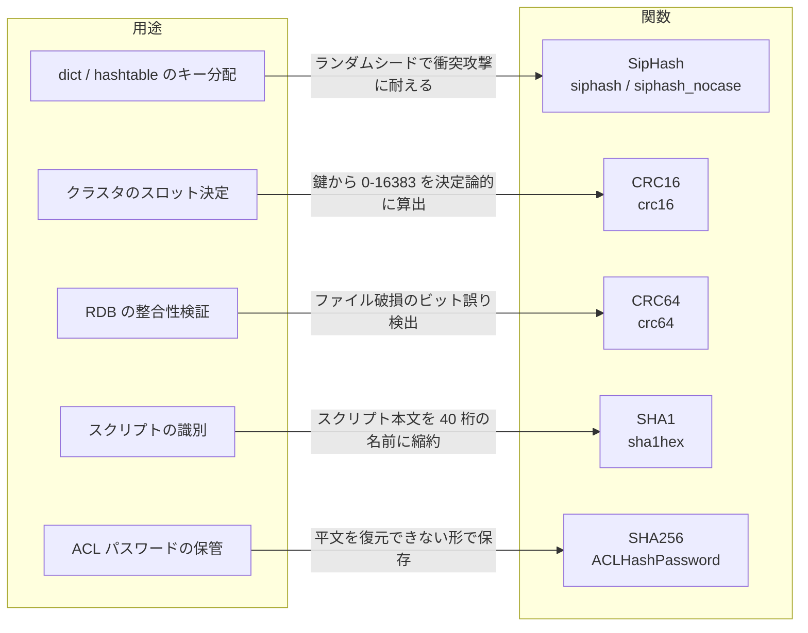

# 第51章 ハッシュ、チェックサム、ユーティリティ

> **本章で読むソース**
>
> - [`src/siphash.c`](https://github.com/valkey-io/valkey/blob/9.1.0/src/siphash.c)
> - [`src/dict.c`](https://github.com/valkey-io/valkey/blob/9.1.0/src/dict.c)
> - [`src/crc16.c`](https://github.com/valkey-io/valkey/blob/9.1.0/src/crc16.c)
> - [`src/crc64.c`](https://github.com/valkey-io/valkey/blob/9.1.0/src/crc64.c)
> - [`src/sha1.c`](https://github.com/valkey-io/valkey/blob/9.1.0/src/sha1.c)
> - [`src/sha256.c`](https://github.com/valkey-io/valkey/blob/9.1.0/src/sha256.c)
> - [`src/util.c`](https://github.com/valkey-io/valkey/blob/9.1.0/src/util.c)

## この章の狙い

Valkey は数バイトの値を要約する関数を何種類も使い分けている。
本章では、5つのハッシュ、チェックサム関数がそれぞれどの用途に割り当てられ、その用途がどんな性質を要求するかを対応づけて読む。
あわせて、ハッシュテーブルを衝突攻撃から守る仕組みと、数値と文字列の高速変換、グロブ照合の実装を扱う。

## 前提

特になし。
dict と hashtable の内部構造を先に押さえておくと、SipHash がどこで呼ばれるかが読みやすい。
必要に応じて [第6章 dict](../part01-data-structures/06-dict.md) を参照するとよい。

## 用途ごとに関数を割り当てる

要約関数に共通する操作は、任意長のバイト列を固定長の整数に潰すことである。
ところが Valkey が要求する性質は用途ごとに違う。
ハッシュテーブルの分配では「攻撃者に衝突を作らせない」ことが重要だが、クラスタのスロット決定では逆に「どのノードでも同じ鍵が同じ値になる」決定性が要る。
ファイルの破損検出では暗号強度はいらず、ビット誤りを高い確率で捕まえることが要る。
スクリプトの識別やパスワードの保管では、衝突困難性や逆算困難性という暗号学的な性質が要る。

この対応を一枚にまとめる。



それぞれの選択理由は、要求される性質から逆算できる。
以下の節で、性質の核になる2点を機構レベルで読む。
ひとつは dict の SipHash がもつ衝突攻撃への耐性であり、もうひとつは CRC が破損検出とスロット決定の双方に向く理由である。

## SipHash 本体

dict と hashtable のキー分配には**SipHash**を使う。
SipHash は鍵つきの擬似ランダム関数であり、16 バイトの鍵 `k` を知らない攻撃者には出力を予測できない。
本体は [`src/siphash.c` L126-L176](https://github.com/valkey-io/valkey/blob/9.1.0/src/siphash.c#L126-L176) にある。

```c
uint64_t siphash(const uint8_t *in, const size_t inlen, const uint8_t *k) {
    // ... (中略) ...
    uint64_t v0 = 0x736f6d6570736575ULL;
    uint64_t v1 = 0x646f72616e646f6dULL;
    uint64_t v2 = 0x6c7967656e657261ULL;
    uint64_t v3 = 0x7465646279746573ULL;
    uint64_t k0 = U8TO64_LE(k);
    uint64_t k1 = U8TO64_LE(k + 8);
    // ... (中略) ...
    for (; in != end; in += 8) {
        m = U8TO64_LE(in);
        v3 ^= m;

        SIPROUND;

        v0 ^= m;
    }
    // ... (中略) ...
    b = v0 ^ v1 ^ v2 ^ v3;
```

処理の流れはこうだ。
4 つの 64 ビット内部状態 `v0`〜`v3` を鍵 `k0`/`k1` で初期化し、入力を 8 バイトずつ取り込んでは攪拌関数 `SIPROUND` を回す。
`SIPROUND` の中身は加算、回転、排他的論理和の組み合わせで、[`src/siphash.c` L107-L123](https://github.com/valkey-io/valkey/blob/9.1.0/src/siphash.c#L107-L123) に定義されている。
末尾の端数バイトと入力長を混ぜてから最終ラウンドを通し、4 つの状態を排他的論理和でまとめて 64 ビットのハッシュを返す。

Valkey が使うのは攪拌回数を削った SipHash 1-2 である。
取り込みごとに `SIPROUND` を 1 回、最後に 3 回回す構成で、ファイル冒頭のコメント [`src/siphash.c` L22-L26](https://github.com/valkey-io/valkey/blob/9.1.0/src/siphash.c#L22-L26) が選択の理由を記している。
推奨の 2-4 変種より強度はわずかに落ちるが自明な攻撃は知られておらず、以前使っていた MurmurHash2 と同じ速度で動くという判断である。

大文字小文字を区別しないハッシュには `siphash_nocase` を使う。
本体は [`src/siphash.c` L185-L244](https://github.com/valkey-io/valkey/blob/9.1.0/src/siphash.c#L185-L244) にあり、入力を取り込むときに `siptlw` で各バイトを小文字へ畳んでから攪拌する。
別関数を用意しているのは、いったん小文字化した一時バッファを作る方式を避けるためで、その意図はファイル冒頭 [`src/siphash.c` L33-L36](https://github.com/valkey-io/valkey/blob/9.1.0/src/siphash.c#L33-L36) のコメントに書かれている。

## HashDoS 耐性

SipHash を選んだ目的は、衝突攻撃への耐性にある。
ハッシュテーブルは、異なるキーが同じバケットに集中すると探索が連結リストの走査に退化し、計算量が O(1) から O(n) へ崩れる。
ハッシュ関数が固定で公開されていると、攻撃者は同じバケットに落ちるキーを大量に投入し、サーバを意図的に劣化させられる。
これが**HashDoS**である。

dict はハッシュ関数として SipHash を呼ぶ。
[`src/dict.c` L145-L151](https://github.com/valkey-io/valkey/blob/9.1.0/src/dict.c#L145-L151) を読む。

```c
uint64_t dictGenHashFunction(const void *key, size_t len) {
    return siphash(key, len, dict_hash_function_seed);
}

uint64_t dictGenCaseHashFunction(const unsigned char *buf, size_t len) {
    return siphash_nocase(buf, len, dict_hash_function_seed);
}
```

鍵にあたるのが `dict_hash_function_seed` である。
この 16 バイトの**シード**を起動ごとにランダムな値で埋めることが、HashDoS 耐性の核になる。
シードの読み書きは [`src/dict.c` L129-L137](https://github.com/valkey-io/valkey/blob/9.1.0/src/dict.c#L129-L137) にある。

```c
static uint8_t dict_hash_function_seed[16];

void dictSetHashFunctionSeed(uint8_t *seed) {
    memcpy(dict_hash_function_seed, seed, sizeof(dict_hash_function_seed));
}

uint8_t *dictGetHashFunctionSeed(void) {
    return dict_hash_function_seed;
}
```

シードは起動時に乱数で初期化される。
[`src/server.c` L7465-L7468](https://github.com/valkey-io/valkey/blob/9.1.0/src/server.c#L7465-L7468) が `getRandomBytes` で 16 バイトを生成し、dict と hashtable の双方に渡している。

```c
    uint8_t hashseed[16];
    getRandomBytes(hashseed, sizeof(hashseed));
    dictSetHashFunctionSeed(hashseed);
    hashtableSetHashFunctionSeed(hashseed);
```

これで、あるキーがどのバケットに落ちるかは起動ごとに変わる。
攻撃者はシードを知らないかぎり、同じバケットに集中するキー集合を事前に用意できない。
SipHash が鍵つきの擬似ランダム関数であり、鍵なしには出力を予測できないという性質が、ここでそのまま効く。
速度を保ったまま衝突攻撃を成立させなくする仕組みである。

## CRC によるスロット決定と破損検出

CRC は剰余多項式に基づくチェックサムで、ビット誤りの検出に向く。
Valkey は幅の違う2つの CRC を別々の用途に割り当てている。

クラスタのスロット決定には**CRC16**を使う。
クラスタは鍵空間を 16384 個のスロットに分け、各鍵を所属スロットへ写す必要がある。
この写像は決定論的でなければならない。
同じ鍵はどのノードで計算しても同じスロットになり、リバランスの前後でも一致しなければクラスタが破綻するからだ。
[`src/cluster.c` L58-L77](https://github.com/valkey-io/valkey/blob/9.1.0/src/cluster.c#L58-L77) の `keyHashSlot` がこの写像を担う。

```c
unsigned int keyHashSlot(const char *key, int keylen) {
    int s, e; /* start-end indexes of { and } */

    for (s = 0; s < keylen; s++)
        if (key[s] == '{') break;

    /* No '{' ? Hash the whole key. This is the base case. */
    if (s == keylen) return crc16(key, keylen) & 0x3FFF;
    // ... (中略) ...
    return crc16(key + s + 1, e - s - 1) & 0x3FFF;
}
```

`crc16` の値の下位 14 ビットを `& 0x3FFF` で取り出すと、ちょうど 0 から 16383 の範囲に収まる。
鍵に `{...}` が含まれるときは中括弧の中身だけをハッシュする。
これがハッシュタグで、別々の鍵を同じスロットへ意図的に集めて同一ノードに置くために使う。
`crc16` 本体は [`src/crc16.c` L81-L87](https://github.com/valkey-io/valkey/blob/9.1.0/src/crc16.c#L81-L87) にあり、256 要素の事前計算テーブル `crc16tab` を引いて 1 バイトずつ処理する。

```c
uint16_t crc16(const char *buf, int len) {
    int counter;
    uint16_t crc = 0;
    for (counter = 0; counter < len; counter++)
        crc = (crc << 8) ^ crc16tab[((crc >> 8) ^ *buf++) & 0x00FF];
    return crc;
}
```

ここで CRC を使う理由は、暗号強度ではなく分配の均一さと決定性にある。
SipHash のようなシードは要らない。
スロット決定は秘匿が目的ではなく、全ノードで再現できることが目的だからだ。

ファイルの整合性検証には**CRC64**を使う。
RDB ファイルは末尾 8 バイトに本体全体の CRC64 を書き込み、読み込み時に再計算して照合する。
書き込み側は [`src/rdb.c` L1504-L1508](https://github.com/valkey-io/valkey/blob/9.1.0/src/rdb.c#L1504-L1508) で末尾にチェックサムを付ける。

```c
    /* CRC64 checksum. It will be zero if checksum computation is disabled, the
     * loading code skips the check in this case. */
    cksum = rdb->cksum;
    memrev64ifbe(&cksum);
    if (rioWrite(rdb, &cksum, 8) == 0) goto werr;
```

読み込み側は [`src/rdb.c` L3547-L3564](https://github.com/valkey-io/valkey/blob/9.1.0/src/rdb.c#L3547-L3564) で再計算した値と末尾の値を突き合わせ、食い違えば破損とみなして読み込みを中止する。
チェックサムが 0 のときは計算が無効化されていたとみなし、検証を飛ばす。

CRC64 がファイル破損検出に向くのは、剰余多項式という構造が連続したビット誤りを高い確率で検出するためである。
`_crc64` の生成元多項式は [`src/crc64.c` L34](https://github.com/valkey-io/valkey/blob/9.1.0/src/crc64.c#L34) の `POLY` に固定されている。
ただし参照実装はビット単位で遅いため、`crc64` は事前計算したテーブルを引いて高速化する。
[`src/crc64.c` L135-L143](https://github.com/valkey-io/valkey/blob/9.1.0/src/crc64.c#L135-L143) を読む。

```c
/* Initializes the 16KB lookup tables. */
void crc64_init(void) {
    crcspeed64native_init(_crc64, crc64_table);
}

/* Compute crc64 */
uint64_t crc64(uint64_t crc, const unsigned char *s, uint64_t l) {
    return crcspeed64native(crc64_table, crc, (void *) s, l);
}
```

`crc64_init` が `_crc64` をもとに 8 本のテーブルを構築し、`crc64` はそのテーブルを引いて複数バイトをまとめて処理する。
1 ビットずつ多項式除算する素朴な実装に比べ、テーブル参照でバイト単位に進めるぶん速い。

## スクリプトとパスワードのハッシュ

スクリプトの識別とパスワードの保管には、暗号学的ハッシュを使う。
どちらも衝突や逆算が困難であることを要求する用途で、CRC や SipHash では役割が違う。

スクリプトの識別には**SHA1**を使う。
`EVAL` で送られたスクリプト本文を 40 桁の十六進文字列に縮約し、その名前で `EVALSHA` から呼び出せるようにする。
[`src/eval.c` L122-L137](https://github.com/valkey-io/valkey/blob/9.1.0/src/eval.c#L122-L137) の `sha1hex` がこの縮約を行う。

```c
void sha1hex(char *digest, char *script, size_t len) {
    SHA1_CTX ctx;
    unsigned char hash[20];
    char *cset = "0123456789abcdef";
    int j;

    SHA1Init(&ctx);
    SHA1Update(&ctx, (unsigned char *)script, len);
    SHA1Final(hash, &ctx);

    for (j = 0; j < 20; j++) {
        digest[j * 2] = cset[((hash[j] & 0xF0) >> 4)];
        digest[j * 2 + 1] = cset[(hash[j] & 0xF)];
    }
    digest[40] = '\0';
}
```

20 バイトのダイジェストを `SHA1Init`/`SHA1Update`/`SHA1Final` の三段で計算し、1 バイトを 2 桁の十六進に展開して 40 文字にする。
ここで SHA1 を選ぶのは衝突困難性のためだ。
本文の異なる別々のスクリプトが同じ名前に潰れると、片方を呼んだつもりで別のスクリプトが走ってしまう。

パスワードの保管には**SHA256**を使う。
ACL はパスワードを平文では持たず、SHA256 の十六進表現で保存する。
[`src/acl.c` L219-L234](https://github.com/valkey-io/valkey/blob/9.1.0/src/acl.c#L219-L234) の `ACLHashPassword` がこの変換を担う。

```c
static sds ACLHashPassword(unsigned char *cleartext, size_t len) {
    SHA256_CTX ctx;
    unsigned char hash[SHA256_BLOCK_SIZE];
    char hex[HASH_PASSWORD_LEN];
    char *cset = "0123456789abcdef";

    sha256_init(&ctx);
    sha256_update(&ctx, (unsigned char *)cleartext, len);
    sha256_final(&ctx, hash);

    for (int j = 0; j < SHA256_BLOCK_SIZE; j++) {
        hex[j * 2] = cset[((hash[j] & 0xF0) >> 4)];
        hex[j * 2 + 1] = cset[(hash[j] & 0xF)];
    }
    return sdsnewlen(hex, HASH_PASSWORD_LEN);
}
```

認証時には入力された平文を同じ手順でハッシュし、保存済みの値と突き合わせる。
逆算が困難なハッシュを使うことで、設定ファイルやメモリダンプから保存値が漏れても平文のパスワードは復元できない。

## 数値と文字列の高速変換

ここからは要約関数を離れ、ホットパスで多用される文字列ユーティリティを読む。

整数を文字列へ直す `ll2string` は、`INCR` の応答整形や整数エンコーディングの判定で頻繁に呼ばれる。
符号を処理したあと本体の `ull2string` に委ね、[`src/util.c` L396-L416](https://github.com/valkey-io/valkey/blob/9.1.0/src/util.c#L396-L416) が変換する。

```c
int ull2string(char *dst, size_t dstlen, unsigned long long value) {
    static const char digits[201] = "0001020304050607080910111213141516171819"
                                    "2021222324252627282930313233343536373839"
                                    "4041424344454647484950515253545556575859"
                                    "6061626364656667686970717273747576777879"
                                    "8081828384858687888990919293949596979899";
    // ... (中略) ...
    while (value >= 100) {
        int const i = (value % 100) * 2;
        value /= 100;
        memcpy(dst + next - 1, digits + i, 2);
        next -= 2;
    }
```

速さの工夫は、00 から 99 までの 2 桁文字列をあらかじめ `digits` テーブルに並べておく点にある。
値を 100 で割りながら下位 2 桁ずつ取り出し、対応する 2 文字をテーブルから `memcpy` する。
1 桁ずつ剰余と除算を繰り返す方式に比べ、ループ回数が半分で済む。

逆方向の `string2ll` は文字列を整数に直す。
[`src/util.c` L571-L635](https://github.com/valkey-io/valkey/blob/9.1.0/src/util.c#L571-L635) の `string2llScalar` が桁ごとに値を組み立て、各ステップで乗算と加算の桁あふれを検査する。
桁を取り込むループ本体は [`src/util.c` L606-L618](https://github.com/valkey-io/valkey/blob/9.1.0/src/util.c#L606-L618) にある。

```c
    /* Parse all the other digits, checking for overflow at every step. */
    while (plen < slen && p[0] >= '0' && p[0] <= '9') {
        if (v > (ULLONG_MAX / 10)) /* Overflow. */
            return 0;
        v *= 10;

        if (v > (ULLONG_MAX - (p[0] - '0'))) /* Overflow. */
            return 0;
        v += p[0] - '0';

        p++;
        plen++;
    }
```

桁あふれをその場で検出して 0 を返すため、`strtoll` のように `errno` を経由しなくても安全に変換できる。
さらに対応 CPU では AVX512 を使う実装に切り替える。
[`src/util.c` L640-L663](https://github.com/valkey-io/valkey/blob/9.1.0/src/util.c#L640-L663) が起動時の CPU 判定で `string2llAVX512` か `string2llScalar` を選ぶ仕掛けで、ifunc によって呼び出しのたびの分岐を消している。

## グロブ照合

`KEYS`、`SCAN`、パターン購読の `PSUBSCRIBE` は、グロブパターンとキーを照合する。
照合は [`src/util.c` L191-L194](https://github.com/valkey-io/valkey/blob/9.1.0/src/util.c#L191-L194) の `stringmatchlen` が入口で、実体は再帰関数 `stringmatchlen_impl` にある。
[`src/util.c` L73-L101](https://github.com/valkey-io/valkey/blob/9.1.0/src/util.c#L73-L101) の `*` の処理を読む。

```c
    while (patternLen && stringLen) {
        switch (pattern[0]) {
        case '*':
            while (patternLen && pattern[1] == '*') {
                pattern++;
                patternLen--;
            }
            if (patternLen == 1) return 1; /* match */
            while (stringLen) {
                if (stringmatchlen_impl(pattern + 1, patternLen - 1, string, stringLen, nocase, skipLongerMatches,
                                        nesting + 1))
                    return 1;                     /* match */
                if (*skipLongerMatches) return 0; /* no match */
                string++;
                stringLen--;
            }
            /* There was no match for the rest of the pattern starting
             * from anywhere in the rest of the string. If there were
             * any '*' earlier in the pattern, we can terminate the
             * search early without trying to match them to longer
             * substrings. This is because a longer match for the
             * earlier part of the pattern would require the rest of the
             * pattern to match starting later in the string, and we
             * have just determined that there is no match for the rest
             * of the pattern starting from anywhere in the current
             * string. */
            *skipLongerMatches = 1;
            return 0; /* no match */
            break;
```

`*` は任意長の並びに一致するため、残りパターンを文字列の各位置から試す再帰になる。
ここで `skipLongerMatches` という枝刈りフラグが効く。
残りパターンがどの開始位置でも一致しないと判明したら、それ以前の `*` をさらに長く伸ばしても一致しないので、探索を早期に打ち切れる。
連続する `*` を 1 個に畳む冒頭のループも、同じ位置を何度も試す無駄を消している。

`[...]` の文字クラスや `?`、`\` によるエスケープも同じ関数が処理する。
`nesting` が 1000 を超えると 0 を返す制限が [`src/util.c` L70-L71](https://github.com/valkey-io/valkey/blob/9.1.0/src/util.c#L70-L71) にあり、悪意あるパターンによる過剰な再帰を止めている。

## まとめ

- Valkey は用途ごとに要約関数を割り当てる。dict のキー分配は SipHash、クラスタのスロット決定は CRC16、RDB の整合性は CRC64、スクリプトの識別は SHA1、ACL のパスワードは SHA256 である。
- dict は SipHash に起動ごとのランダムシード `dict_hash_function_seed` を与え、攻撃者がバケット衝突を仕込む HashDoS を成立させない。シードは `getRandomBytes` で初期化される。
- CRC16 はスロットを 0 から 16383 へ決定論的に写す。秘匿は不要で、全ノードでの再現性が要件である。
- CRC64 は RDB 末尾に書かれ、読み込み時の再計算と照合でファイル破損を検出する。事前計算テーブルでバイト単位に処理して速い。
- SHA1 と SHA256 は衝突困難性と逆算困難性を要求する用途に使う。前者はスクリプト名、後者はパスワードの保存形式である。
- `ll2string` は 2 桁テーブルと `memcpy`、`string2ll` は桁あふれの逐次検査と AVX512 切り替え、`stringmatchlen` は `skipLongerMatches` の枝刈りで、いずれもホットパスを軽くする。

## 関連する章

- dict と hashtable がハッシュ値をどう使うかは [第6章 dict](../part01-data-structures/06-dict.md)。
- クラスタのスロット割り当てとハッシュタグは [第39章 クラスタ](../part07-replication-cluster/39-cluster.md)。
- RDB のフォーマットとチェックサムの位置づけは [第35章 RDB](../part06-persistence/35-rdb.md)。
- スクリプトの登録と `EVALSHA` の流れは [第44章 スクリプティング](../part08-features/44-scripting.md)。
- ACL のパスワード認証は [第48章 ACL](../part08-features/48-acl.md)。
