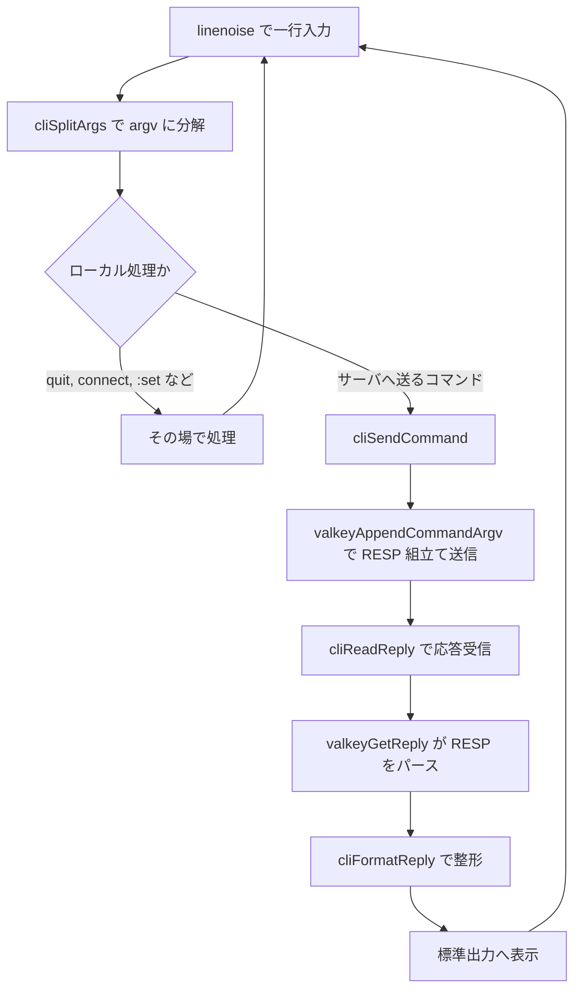
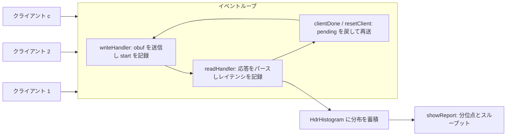

# 第52章 クライアントツール

> **本章で読むソース**
>
> - [`src/valkey-cli.c`](https://github.com/valkey-io/valkey/blob/9.1.0/src/valkey-cli.c)
> - [`src/valkey-benchmark.c`](https://github.com/valkey-io/valkey/blob/9.1.0/src/valkey-benchmark.c)

## この章の狙い

`valkey-cli` と `valkey-benchmark` は、いずれもサーバへ接続して RESP でコマンドを送り、応答を読む点では普通のクライアントである。
本章では、対話的なクライアントである `valkey-cli` が入力をコマンドに組み立てて送り、応答を解釈して表示する流れを実コードで追う。
あわせて、クラスタでのリダイレクト追従、大量投入の `--pipe`、そして `valkey-benchmark` が並列クライアントで負荷をかけてレイテンシ分布を測る仕組みを読む。
これまでの章でサーバ側から見てきた RESP やコマンド実行やクラスタを、クライアント側からどう使うかでつなぎ直す。

## 前提

- [第51章 ハッシュとユーティリティ](51-hashing-utils.md)（CRC16 とスロット計算）

本章ではサーバ側の仕組みを前提として参照する。
RESP の組み立てと解釈は[第26章 RESP プロトコル](../part04-server-events/26-resp-protocol.md)、コマンドの受理と実行は[第27章 コマンド実行](../part04-server-events/27-command-execution.md)、スロットとリダイレクトは[第39章 クラスタの仕組み](../part07-replication-cluster/39-cluster.md)で扱う。

## 対話ループ：入力を一行読んでコマンドにする

`valkey-cli` を引数なしで起動すると対話モードに入る。
入口は `main` で、実行すべきコマンドが引数として与えられていないときに `repl` を呼ぶ。

[`src/valkey-cli.c` L10246-L10256](https://github.com/valkey-io/valkey/blob/9.1.0/src/valkey-cli.c#L10246-L10256)

```c
    /* Start interactive mode when no command is provided */
    if (argc == 0 && !config.eval) {
        /* Ignore SIGPIPE in interactive mode to force a reconnect */
        signal(SIGPIPE, SIG_IGN);
        signal(SIGINT, sigIntHandler);

        /* Note that in repl mode we don't abort on connection error.
         * A new attempt will be performed for every command send. */
        cliConnect(0);
        repl();
    }
```

ここで `SIGPIPE` を無視するのは、接続が切れた書き込みでプロセスが落ちないようにし、次のコマンド送信で張り直すためである。
コメントが述べるとおり、対話モードでは接続エラーで終了せず、コマンドごとに接続を試みる。

`repl` は一行ずつ入力を読む無限ループである。
中心は `linenoise` で一行を受け取り、`cliSplitArgs` でトークンに分解する部分にある。

[`src/valkey-cli.c` L3336-L3367](https://github.com/valkey-io/valkey/blob/9.1.0/src/valkey-cli.c#L3336-L3367)

```c
    while (1) {
        line = linenoise(context ? config.prompt : "not connected> ");
        if (line == NULL) {
            /* ^C, ^D or similar. */
            if (config.pubsub_mode) {
                config.pubsub_mode = 0;
                if (cliConnect(CC_FORCE) == VALKEY_OK) continue;
            }
            break;
        } else if (line[0] != '\0') {
            long repeat = 1;
            int skipargs = 0;
            char *endptr = NULL;

            argv = cliSplitArgs(line, &argc);
            // ... (中略) ...
            /* check if we have a repeat command option and
             * need to skip the first arg */
            errno = 0;
            repeat = strtol(argv[0], &endptr, 10);
```

`linenoise` は補完や履歴を備えた行入力ライブラリで、TTY のときは候補表示やヒントのコールバックが設定される。
`cliSplitArgs` は引用符やエスケープを解釈しながら、一行を引数の配列 `argv` に切り分ける。
先頭トークンが整数で後ろに引数が続くときは、それを繰り返し回数 `repeat` として扱う。
たとえば `3 ping` は `PING` を三回送る指定になる。

切り分けた `argv` のうち、`quit` や `connect` や接頭辞 `:` で始まる設定変更など、ローカルで処理する語はその場で捌く。
それ以外はサーバへ送るコマンドとして `issueCommandRepeat` に渡す。

[`src/valkey-cli.c` L3412-L3431](https://github.com/valkey-io/valkey/blob/9.1.0/src/valkey-cli.c#L3412-L3431)

```c
            } else {
                long long start_time = mstime(), elapsed;

                issueCommandRepeat(argc - skipargs, argv + skipargs, repeat);

                /* If our debugging session ended, show the EVAL final
                 * reply. */
                if (config.eval_ldb_end) {
                    config.eval_ldb_end = 0;
                    cliReadReply(0);
                    printf("\n(Lua debugging session ended%s)\n\n",
                           config.eval_ldb_sync ? "" : " -- dataset changes rolled back");
                    cliInitHelp();
                }

                elapsed = mstime() - start_time;
                if (elapsed >= 500 && config.output == OUTPUT_STANDARD) {
                    printf("(%.2fs)\n", (double)elapsed / 1000);
                }
            }
```

コマンドの前後で時刻を取り、500 ミリ秒を超えたら所要時間を表示する。
これは応答が遅いコマンドを対話中に気付けるようにするためである。

## RESP の組み立てと送信：`cliSendCommand`

`issueCommandRepeat` は接続の確認とクラスタの再送制御を担い、実際の送受信は `cliSendCommand` に委ねる。
`cliSendCommand` は引数の配列をそのまま RESP の配列にして送る。
組み立てと送信は `valkeyAppendCommandArgv` が行う。

[`src/valkey-cli.c` L2391-L2399](https://github.com/valkey-io/valkey/blob/9.1.0/src/valkey-cli.c#L2391-L2399)

```c
    /* Setup argument length */
    argvlen = zmalloc(argc * sizeof(size_t));
    for (j = 0; j < argc; j++) argvlen[j] = sdslen(argv[j]);

    /* Negative repeat is allowed and causes infinite loop,
       works well with the interval option. */
    while (repeat < 0 || repeat-- > 0) {
        valkeyAppendCommandArgv(context, argc, (const char **)argv, argvlen);
```

各引数の長さを先に求めてから渡すのは、引数にバイナリを含んでよいためである。
RESP の配列はバルク文字列の長さを前置するので、終端文字に頼らず任意のバイト列を送れる。
RESP がコマンドをどう符号化するかは[第26章 RESP プロトコル](../part04-server-events/26-resp-protocol.md)で扱う。

送信したら応答を読む。
通常のコマンドでは、`cliReadReply` を呼んで一つの応答を受け取り、表示する。

[`src/valkey-cli.c` L2434-L2440](https://github.com/valkey-io/valkey/blob/9.1.0/src/valkey-cli.c#L2434-L2440)

```c
        /* Read response, possibly skipping pubsub/push messages. */
        while (1) {
            if (cliReadReply(output_raw) != VALKEY_OK) {
                zfree(argvlen);
                return VALKEY_ERR;
            }
            fflush(stdout);
```

ここで pub/sub のメッセージや RESP3 のプッシュ応答は読み飛ばす。
コマンドの応答とサーバが自発的に送るメッセージは別物なので、求めている応答が来るまでループする。

## 応答の解釈と表示：`cliReadReply`

`cliReadReply` は応答を一つ受け取り、種別を見て整形して表示する。
受信そのものは `valkeyGetReply` が行い、RESP をパースして `valkeyReply` 構造体を返す。

[`src/valkey-cli.c` L2168-L2191](https://github.com/valkey-io/valkey/blob/9.1.0/src/valkey-cli.c#L2168-L2191)

```c
    if (valkeyGetReply(context, &_reply) != VALKEY_OK) {
        if (config.blocking_state_aborted) {
            config.blocking_state_aborted = 0;
            config.monitor_mode = 0;
            config.pubsub_mode = 0;
            return cliConnect(CC_FORCE);
        }

        if (config.shutdown) {
            valkeyFree(context);
            context = NULL;
            return VALKEY_OK;
        }
        if (config.interactive) {
            /* Filter cases where we should reconnect */
            if (context->err == VALKEY_ERR_IO && (errno == ECONNRESET || errno == EPIPE)) return VALKEY_ERR;
            if (context->err == VALKEY_ERR_EOF) return VALKEY_ERR;
        }
        cliPrintContextError();
        exit(1);
        return VALKEY_ERR; /* avoid compiler warning */
    }

    config.last_reply = reply = (valkeyReply *)_reply;
```

受信に失敗したときの分岐が、対話モードの粘り強さを支える。
接続が切れた種類のエラー（`ECONNRESET`、`EPIPE`、`EOF`）なら、終了せずに `VALKEY_ERR` を返して上位に再接続を促す。

応答を受け取ったら、最後に種別ごとの整形へ進む。

[`src/valkey-cli.c` L2235-L2241](https://github.com/valkey-io/valkey/blob/9.1.0/src/valkey-cli.c#L2235-L2241)

```c
    if (output) {
        out = cliFormatReply(reply, config.output, output_raw_strings);
        fwrite(out, sdslen(out), 1, stdout);
        fflush(stdout);
        sdsfree(out);
    }
    return VALKEY_OK;
```

`cliFormatReply` は出力モードに応じて整形を切り替える。
標準の TTY 向け表示、生のバイト列、CSV、JSON のいずれかで応答を文字列にする。
配列やマップは入れ子をたどって行ごとに番号付きで並べるため、対話中に構造を読み取りやすい。

ここまでの一周を図にすると次のようになる。



## クラスタモード：MOVED と ASK に従って接続を張り替える

クラスタでは、キーが属するスロットを所有するノードへ要求を出さなければならない。
担当外のノードに当たると、サーバは `MOVED` か `ASK` のエラー応答で正しいノードを教える。
`--cluster` 相当のクラスタモードでは、`cliReadReply` がこのエラーを検出して接続先を差し替える。

[`src/valkey-cli.c` L2195-L2228](https://github.com/valkey-io/valkey/blob/9.1.0/src/valkey-cli.c#L2195-L2228)

```c
    /* Check if we need to connect to a different node and reissue the
     * request. */
    if (config.cluster_mode && reply->type == VALKEY_REPLY_ERROR &&
        (!strncmp(reply->str, "MOVED ", 6) || !strncmp(reply->str, "ASK ", 4))) {
        char *p = reply->str, *s;
        int slot;

        output = 0;
        // ... (中略) ...
        s = strchr(p, ' ');     /* MOVED[S]3999 127.0.0.1:6381 */
        p = strchr(s + 1, ' '); /* MOVED[S]3999[P]127.0.0.1:6381 */
        *p = '\0';
        slot = atoi(s + 1);
        s = strrchr(p + 1, ':'); /* MOVED 3999[P]127.0.0.1[S]6381 */
        *s = '\0';
        if (p + 1 != s) {
            // ... (中略) ...
            sdsfree(config.conn_info.hostip);
            config.conn_info.hostip = sdsnew(p + 1);
        }
        config.conn_info.hostport = atoi(s + 1);
        if (config.interactive)
            printf("-> Redirected to slot [%d] located at %s:%d\n", slot, config.conn_info.hostip,
                   config.conn_info.hostport);
        config.cluster_reissue_command = 1;
        if (!strncmp(reply->str, "ASK ", 4)) {
            config.cluster_send_asking = 1;
        }
        cliRefreshPrompt();
    }
```

エラー文字列から目的ノードのアドレスとスロット番号を切り出し、接続情報を書き換える。
このとき応答は表示せず（`output = 0`）、再送フラグ `cluster_reissue_command` を立てる。
`ASK` のときはさらに `cluster_send_asking` を立てる。
`MOVED` はスロットの恒久的な移動、`ASK` は移行中の一時的な転送を表すからである。

フラグを受けるのは `issueCommandRepeat` のループである。

[`src/valkey-cli.c` L3135-L3162](https://github.com/valkey-io/valkey/blob/9.1.0/src/valkey-cli.c#L3135-L3162)

```c
    while (1) {
        if (config.cluster_reissue_command || context == NULL || context->err == VALKEY_ERR_IO ||
            context->err == VALKEY_ERR_EOF) {
            if (cliConnect(CC_FORCE) != VALKEY_OK) {
                cliPrintContextError();
                config.cluster_reissue_command = 0;
                return VALKEY_ERR;
            }
        }
        config.cluster_reissue_command = 0;
        if (config.cluster_send_asking) {
            if (cliSendAsking() != VALKEY_OK) {
                cliPrintContextError();
                return VALKEY_ERR;
            }
        }
        if (cliSendCommand(argc, argv, repeat) != VALKEY_OK) {
            // ... (中略) ...
        }

        /* Issue the command again if we got redirected in cluster mode */
        if (config.cluster_mode && config.cluster_reissue_command) {
            continue;
        }
        break;
    }
```

再送フラグが立っていれば、書き換えた接続情報で `cliConnect(CC_FORCE)` を呼んで新しいノードへ張り替える。
`ASK` の転送先には、本来の担当ではないノードに一時的に受け付けてもらうため、本命のコマンドの前に `ASKING` を送る。
そのうえで `cliSendCommand` を再実行し、リダイレクトが続く限りループを回す。
スロットの所有とリダイレクトの意味は[第39章 クラスタの仕組み](../part07-replication-cluster/39-cluster.md)で扱う。

## `--pipe`：大量のコマンドを一括投入する

データの一括投入では、コマンドを一つ送って応答を待つ往復を繰り返すと、往復の待ち時間が支配的になる。
`--pipe` モードは、標準入力に流し込んだ RESP のバイト列をそのまま送りながら、同時に応答を読み続けることでこの往復を畳む。
入口は `main` から `pipeMode` を呼ぶところにある。

[`src/valkey-cli.c` L10191-L10195](https://github.com/valkey-io/valkey/blob/9.1.0/src/valkey-cli.c#L10191-L10195)

```c
    /* Pipe mode */
    if (config.pipe_mode) {
        if (cliConnect(0) == VALKEY_ERR) exit(1);
        pipeMode();
    }
```

`pipeMode` はソケットを非ブロッキングにし、読み書きを一つのループでまとめて回す。
書ける状態のときに標準入力を読んで送り、読める状態のときに応答を回収する。

[`src/valkey-cli.c` L8972-L9010](https://github.com/valkey-io/valkey/blob/9.1.0/src/valkey-cli.c#L8972-L9010)

```c
    while (!done) {
        int mask = AE_READABLE;

        if (!eof || obuf_len != 0) mask |= AE_WRITABLE;
        mask = aeWait(context->fd, mask, 1000);

        /* Handle the readable state: we can read replies from the server. */
        if (mask & AE_READABLE) {
            int read_error = 0;

            do {
                if (!read_error && valkeyBufferRead(context) == VALKEY_ERR) {
                    read_error = 1;
                }

                reply = NULL;
                if (valkeyGetReply(context, (void **)&reply) == VALKEY_ERR) {
                    // ... (中略) ...
                }
                if (reply) {
                    last_read_time = time(NULL);
                    if (reply->type == VALKEY_REPLY_ERROR) {
                        fprintf(stderr, "%s\n", reply->str);
                        errors++;
                    } else if (eof && reply->type == VALKEY_REPLY_STRING && reply->len == 20) {
                        // ... (中略) ...
                        if (memcmp(reply->str, magic, 20) == 0) {
                            printf("Last reply received from server.\n");
                            done = 1;
                            replies--;
                        }
                    }
                    replies++;
                    freeReplyObject(reply);
                }
            } while (reply);
            // ... (中略) ...
        }
```

送るべきデータと読むべき応答を同じループで扱うので、送信が応答を待たない。
これがパイプラインによる往復削減の核である。
クライアントは応答を一つずつ確認せず、入力を送り切ってから返ってきた応答をまとめて数える。

ここで難しいのは、いつ全部読み終えたと判断するかである。
入力を読み切ったら、`pipeMode` は最後に決め打ちの `ECHO` コマンドを送る。

[`src/valkey-cli.c` L9048-L9065](https://github.com/valkey-io/valkey/blob/9.1.0/src/valkey-cli.c#L9048-L9065)

```c
                    if (nread == 0) {
                        /* The ECHO sequence starts with a "\r\n" so that if there
                         * is garbage in the protocol we read from stdin, the ECHO
                         * will likely still be properly formatted.
                         * CRLF is ignored by the server, so it has no effects. */
                        char echo[] = "\r\n*2\r\n$4\r\nECHO\r\n$20\r\n01234567890123456789\r\n";
                        int j;

                        eof = 1;
                        /* Everything transferred, so we queue a special
                         * ECHO command that we can match in the replies
                         * to make sure everything was read from the server. */
                        for (j = 0; j < 20; j++) magic[j] = rand() & 0xff;
                        memcpy(echo + 21, magic, 20);
                        memcpy(obuf, echo, sizeof(echo) - 1);
                        obuf_len = sizeof(echo) - 1;
                        obuf_pos = 0;
                        printf("All data transferred. Waiting for the last reply...\n");
```

20 バイトの乱数を生成して `ECHO` の引数にする。
この乱数を覚えておき、応答の中に同じ 20 バイトが返ってきたら、それより前の応答はすべて受信し終えたと判断できる。
直前の読み取りループで `memcmp(reply->str, magic, 20)` が一致したら `done` を立てるのは、この合図を検出する処理である。
末尾を一意な目印で区切ることで、応答の総数を事前に知らなくても完了を判定できる。

## 補完とヘルプ：`cliInitHelp`

対話モードでは、コマンド名の補完やヘルプ表示のために、サーバが持つコマンド一覧を取り込む。
`cliInitHelp` は接続済みのサーバに `COMMAND DOCS` を問い合わせ、その応答からヘルプ項目を組み立てる。

[`src/valkey-cli.c` L903-L929](https://github.com/valkey-io/valkey/blob/9.1.0/src/valkey-cli.c#L903-L929)

```c
    if (cliConnect(CC_QUIET) == VALKEY_ERR) {
        /* Can not connect to the server, but we still want to provide
         * help, generate it only from the static cli_commands.c data instead. */
        groups = dictCreate(&groupsdt);
        cliLegacyInitHelp(groups);
        return;
    }
    commandTable = valkeyCommand(context, "COMMAND DOCS");
    if (commandTable == NULL || commandTable->type == VALKEY_REPLY_ERROR) {
        /* New COMMAND DOCS subcommand not supported - generate help from
         * static cli_commands.c data instead. */
        // ... (中略) ...
    };
    if (commandTable->type != VALKEY_REPLY_MAP && commandTable->type != VALKEY_REPLY_ARRAY) return;

    /* Scan the array reported by COMMAND DOCS and fill in the entries */
    helpEntriesLen = cliCountCommands(commandTable);
    helpEntries = zmalloc(sizeof(helpEntry) * helpEntriesLen);

    groups = dictCreate(&groupsdt);
    cliInitCommandHelpEntries(commandTable, groups);
    cliInitGroupHelpEntries(groups);
```

サーバから取った定義をそのまま使うので、接続先のバージョンが知っているコマンドに補完とヘルプが追従する。
接続できないときや古いサーバで `COMMAND DOCS` がないときは、`cli_commands.c` に静的に埋め込んだ表へ退避する。
補完候補はこの `helpEntries` から作られ、`linenoise` のコールバックを通じて入力中に提示される。

## valkey-benchmark：並列クライアントで負荷をかける

`valkey-benchmark` は、指定したコマンドを並列のクライアントから繰り返し送り、スループットとレイテンシ分布を測る。
ここでのクライアントは、`valkey-cli` のような対話的なものではなく、イベントループに乗せた非同期の接続である。
各クライアントは `_client` 構造体で表される。

[`src/valkey-benchmark.c` L174-L194](https://github.com/valkey-io/valkey/blob/9.1.0/src/valkey-benchmark.c#L174-L194)

```c
typedef struct _client {
    valkeyContext *context;
    sds obuf;
    char **stagptr;     /* Pointers to slot hashtags (cluster mode only) */
    size_t staglen;     /* Number of pointers in client->stagptr */
    size_t stagfree;    /* Number of unused pointers in client->stagptr */
    size_t written;     /* Bytes of 'obuf' already written */
    long long start;    /* Start time of a request */
    long long latency;  /* Request latency */
    int seqlen;         /* Number of commands in the command sequence */
    int pending;        /* Number of pending requests (replies to consume) */
    int prefix_pending; /* If non-zero, number of pending prefix commands. Commands
                           such as auth and select are prefixed to the pipeline of
                           benchmark commands and discarded after the first send. */
    int prefixlen;      /* Size in bytes of the pending prefix commands */
    int thread_id;
    struct clusterNode *cluster_node;
    int slots_last_update;
    uint64_t paused : 1;
    uint64_t reuse : 1;
} *client;
```

各クライアントは送信用バッファ `obuf` を一つ持ち、未回収の応答数 `pending` を数える。
測定の起点である `start` と算出したレイテンシ `latency` も、クライアントごとに持つ。

`createClient` は接続を開き、送るコマンドをパイプライン段数ぶん `obuf` に並べる。
ここで送信バッファをあらかじめ作り込んでおくのが、繰り返し送信を軽くする要点である。

[`src/valkey-benchmark.c` L1034-L1045](https://github.com/valkey-io/valkey/blob/9.1.0/src/valkey-benchmark.c#L1034-L1045)

```c
    c->prefixlen = sdslen(c->obuf);
    /* Append the request itself. */
    if (from) {
        c->obuf = sdscatlen(c->obuf, from->obuf + from->prefixlen, sdslen(from->obuf) - from->prefixlen);
        seqlen = from->seqlen;
    } else {
        for (int j = 0; j < config.pipeline; j++) c->obuf = sdscatlen(c->obuf, cmd, len);
    }

    c->written = 0;
    c->seqlen = seqlen;
    c->pending = config.pipeline * seqlen + c->prefix_pending;
```

パイプライン段数 `config.pipeline`（オプション `-P` で指定する）の回数だけ、同じコマンドを `obuf` に連結する。
あらかじめ符号化したバイト列を持つので、繰り返しのたびにコマンドを組み立て直さずに済む。
そのため、二人目以降のクライアントは `from` から `obuf` を丸ごと複製して作れる。
回収すべき応答数 `pending` は、段数とコマンド列の長さの積に、`AUTH` や `SELECT` などの前置コマンド数を足したものになる。

`createMissingClients` は、目標の並列数に達するまで `createClient` を繰り返し呼ぶ。

[`src/valkey-benchmark.c` L1098-L1103](https://github.com/valkey-io/valkey/blob/9.1.0/src/valkey-benchmark.c#L1098-L1103)

```c
static void createMissingClients(client c) {
    int n = 0;
    while (config.liveclients < config.numclients) {
        int thread_id = -1;
        if (config.num_threads) thread_id = config.liveclients % config.num_threads;
        createClient(NULL, 0, 0, c, thread_id);
```

並列数 `config.numclients`（オプション `-c`）に届くまでクライアントを足す。
スレッドを使う指定なら、クライアントをスレッドへ順番に割り振る。

## 送って受けて測る：writeHandler と readHandler

各クライアントはイベントループに登録され、ソケットが書ける／読めるイベントで駆動される。
書けるイベントでは `writeHandler` が `obuf` をソケットへ流す。
全部書き終えたら、書きイベントを外して読みイベントに切り替える。

[`src/valkey-benchmark.c` L868-L908](https://github.com/valkey-io/valkey/blob/9.1.0/src/valkey-benchmark.c#L868-L908)

```c
    /* Initialize request when nothing was written. */
    if (c->written == 0) {
        /* Enforce upper bound to number of requests. */
        int requests_issued = atomic_fetch_add_explicit(&config.requests_issued,
                                                        config.pipeline * c->seqlen,
                                                        memory_order_relaxed);
        if (isBenchmarkFinished(requests_issued)) {
            return;
        }

        /* Really initialize: replace keys and set start time. */
        if (config.replace_placeholders) replacePlaceholders(c->obuf + c->prefixlen, config.pipeline);
        if (config.cluster_mode && c->staglen > 0) setClusterKeyHashTag(c);
        c->slots_last_update = atomic_load_explicit(&config.slots_last_update, memory_order_relaxed);
        c->start = ustime();
        c->latency = -1;
    }
    const ssize_t buflen = sdslen(c->obuf);
    const ssize_t writeLen = buflen - c->written;
    if (writeLen > 0) {
        void *ptr = c->obuf + c->written;
        while (1) {
            // ... (中略) ...
            const ssize_t nwritten = cliWriteConn(c->context, ptr, writeLen);
            if (nwritten != writeLen) {
                // ... (中略) ...
            } else {
                aeDeleteFileEvent(el, c->context->fd, AE_WRITABLE);
                createFileEvent(el, c->context->fd, AE_READABLE, readHandler, c);
                return;
            }
        }
    }
```

書き始めの一回だけ、`c->start = ustime()` で測定の起点を記録する。
レイテンシを測るのはこの起点から応答が届くまでなので、パイプラインの場合は段全体を一回として測ることになる。
ここで `requests_issued` を発行段数ぶん原子的に進め、目標数に達したら新規の発行を止める。

読めるイベントでは `readHandler` が応答をパースし、`pending` を減らしながらレイテンシを記録する。

[`src/valkey-benchmark.c` L689-L702](https://github.com/valkey-io/valkey/blob/9.1.0/src/valkey-benchmark.c#L689-L702)

```c
    /* Calculate latency only for the first read event. This means that the
     * server already sent the reply and we need to parse it. Parsing overhead
     * is not part of the latency, so calculate it only once, here. */
    if (c->latency < 0) c->latency = ustime() - (c->start);

    if (valkeyBufferRead(c->context) != VALKEY_OK) {
        fprintf(stderr, "Error: %s\n", c->context->errstr);
        exit(1);
    } else {
        while (c->pending) {
            if (valkeyGetReply(c->context, &reply) != VALKEY_OK) {
                fprintf(stderr, "Error: %s\n", c->context->errstr);
                exit(1);
```

最初の読みイベントでだけレイテンシを確定する。
コメントが述べるとおり、応答のパースにかかる時間は計測対象から外すためである。
受け取った応答ごとに分布へ記録し、`pending` を一つずつ減らす。

[`src/valkey-benchmark.c` L755-L781](https://github.com/valkey-io/valkey/blob/9.1.0/src/valkey-benchmark.c#L755-L781)

```c
                int requests_finished = atomic_fetch_add_explicit(&config.requests_finished, 1, memory_order_relaxed);
                if (!isBenchmarkFinished(requests_finished)) {
                    if (config.num_threads == 0) {
                        hdr_record_value(config.latency_histogram, // Histogram to record to
                                         (long)c->latency <= CONFIG_LATENCY_HISTOGRAM_MAX_VALUE
                                             ? (long)c->latency
                                             : CONFIG_LATENCY_HISTOGRAM_MAX_VALUE); // Value to record
                        // ... (中略) ...
                    } else {
                        hdr_record_value_atomic(config.latency_histogram, // Histogram to record to
                                                // ... (中略) ...
                    }
                }
                c->pending--;
                if (c->pending == 0) {
                    clientDone(c);
                    break;
                }
```

レイテンシは `hdr_record_value` で HdrHistogram に積む。
これは広い範囲のレイテンシを対数的なバケットで保持するヒストグラムで、分位点を後から精度を保って取り出せる。
スレッドを使うときは原子版の `hdr_record_value_atomic` を使い、複数スレッドが同じヒストグラムへ安全に書き込む。
段がすべて返って `pending` が 0 になったら `clientDone` へ進み、続きの計測へ移る。

`clientDone` は、まだ目標の要求数に達していなければ、同じクライアントを `resetClient` で初期化して次の送信に備える。

[`src/valkey-benchmark.c` L572-L578](https://github.com/valkey-io/valkey/blob/9.1.0/src/valkey-benchmark.c#L572-L578)

```c
static void resetClient(client c) {
    aeEventLoop *el = CLIENT_GET_EVENTLOOP(c);
    aeDeleteFileEvent(el, c->context->fd, AE_WRITABLE);
    aeDeleteFileEvent(el, c->context->fd, AE_READABLE);
    createFileEvent(el, c->context->fd, AE_WRITABLE, writeHandler, c);
    c->written = 0;
    c->pending = config.pipeline * c->seqlen;
}
```

接続を張り直さず、書きイベントを付け直して `pending` を段数に戻すだけである。
接続を使い回すので、計測の主役である送受信そのものに測定が集中する。

並列クライアントによる負荷生成と計測の関係を図にすると次のようになる。



## パイプライン（`-P`）が往復を畳む仕組み

`valkey-cli --pipe` と同じ発想が、`valkey-benchmark` の `-P` にもある。
段数 1 では、クライアントはコマンドを一つ送って応答を待ち、それから次を送る。
このとき、サーバの処理が速くてもネットワークの往復が待ち時間を占める。

`-P` で段数を上げると、`createClient` が `obuf` に同じコマンドを段数ぶん連結する。
クライアントはそれを一度の書き込みでまとめて送り、`pending` を段数に設定して応答をまとめて受ける。
一回の往復に複数のコマンドを詰めるので、要求あたりの往復のコストが段数で割られる。
サーバ側でも、まとまって届いた複数のコマンドを続けて処理できるため、システムコールやイベント処理の固定費が要求あたりで下がる。
コマンドがどのように受理され実行されるかは[第27章 コマンド実行](../part04-server-events/27-command-execution.md)で扱う。

ただし段を増やすほど、一段あたりのレイテンシは段全体を一回として測る形になる。
`writeHandler` が段の先頭で一度だけ `start` を記録し、`readHandler` が最初の応答でレイテンシを確定することから、報告されるレイテンシは段全体の往復時間に近い。
スループットは段数で改善しても、個々の要求の応答時間がそのまま縮むわけではない。

## 結果の報告：showReport

計測が終わると、`showReport` が蓄積したヒストグラムから分位点を取り出して表示する。

[`src/valkey-benchmark.c` L1133-L1140](https://github.com/valkey-io/valkey/blob/9.1.0/src/valkey-benchmark.c#L1133-L1140)

```c
static void showReport(void) {
    const float reqpersec = (float)config.requests_finished / ((float)config.totlatency / 1000.0f);
    const float p0 = ((float)hdr_min(config.latency_histogram)) / 1000.0f;
    const float p50 = hdr_value_at_percentile(config.latency_histogram, 50.0) / 1000.0f;
    const float p95 = hdr_value_at_percentile(config.latency_histogram, 95.0) / 1000.0f;
    const float p99 = hdr_value_at_percentile(config.latency_histogram, 99.0) / 1000.0f;
    const float p100 = ((float)hdr_max(config.latency_histogram)) / 1000.0f;
    const float avg = hdr_mean(config.latency_histogram) / 1000.0f;
```

スループットは、完了した要求数を全体の所要時間で割って求める。
レイテンシは平均だけでなく、p50、p95、p99、最小、最大を `hdr_value_at_percentile` で取り出す。
分位点まで示すのは、平均が隠してしまう尾の遅さ（一部の要求だけが遅い状況）を読み取るためである。

[`src/valkey-benchmark.c` L1213-L1217](https://github.com/valkey-io/valkey/blob/9.1.0/src/valkey-benchmark.c#L1213-L1217)

```c
        printf("Summary:\n");
        printf("  throughput summary: %.2f requests per second\n", reqpersec);
        printf("  latency summary (msec):\n");
        printf("    %9s %9s %9s %9s %9s %9s\n", "avg", "min", "p50", "p95", "p99", "max");
        printf("    %9.3f %9.3f %9.3f %9.3f %9.3f %9.3f\n", avg, p0, p50, p95, p99, p100);
```

最後に、スループットとレイテンシの要約を一行ずつ表示する。
これが、サーバへ並列に負荷をかけた結果として読み手に返る数字である。

## まとめ

- `valkey-cli` の対話ループは `repl` にあり、`linenoise` で一行読んで `cliSplitArgs` で分解し、`cliSendCommand` が `valkeyAppendCommandArgv` で RESP に組み立てて送る。応答は `cliReadReply` が `valkeyGetReply` で受け、`cliFormatReply` で整形して表示する。
- クラスタモードでは、`cliReadReply` が `MOVED` と `ASK` のエラーを検出して接続情報を書き換え、`issueCommandRepeat` のループが接続を張り替えてコマンドを再送する。`ASK` のときは本命の前に `ASKING` を送る。
- `--pipe` は標準入力の RESP をそのまま送りながら同時に応答を読み、末尾に置いた乱数入りの `ECHO` で完了を判定することで、大量投入の往復を畳む。
- `valkey-benchmark` は並列クライアントをイベントループに乗せ、`writeHandler` で送って `readHandler` で受け、レイテンシを HdrHistogram に積む。送信バッファを作り込んで使い回すことで、計測を送受信そのものに集中させる。
- パイプライン（`-P`）は一回の往復に複数コマンドを詰めて要求あたりの往復コストを段数で割る。スループットは上がるが、報告されるレイテンシは段全体の往復時間に近づく。

## 本書のまとめ

本書は Valkey 9.1.0 のソースを、下から積み上げる順で読んできた。
最初に SDS や dict や listpack といった低レベルのデータ構造を読み、その上に文字列やリストやハッシュなどの型と、`robj` によるエンコーディングの切り替えを見た。
次に単一スレッドのイベントループと RESP とコマンド実行を中心に、I/O スレッドや設定を含むサーバの骨格を追い、キー空間の管理、有効期限とメモリ退避、遅延解放を読んだ。
そこから RDB と AOF による永続化、レプリケーションとクラスタとアトミックなスロット移行、トランザクションやスクリプティングやクライアントトラッキングや ACL やモジュールといった拡張機能へ進んだ。

最後の運用ツールの章で、これらの仕組みをクライアント側から呼び戻した。
`valkey-cli` の対話ループは RESP の組み立てと解釈をそのまま実演し、クラスタモードはスロットとリダイレクトの設計をクライアント側でなぞる。
`valkey-benchmark` の並列負荷とレイテンシ計測は、単一スレッドのイベントループとパイプラインがスループットをどう生むかを、測れる数字として返す。
個々の構造を独立に読んだうえで、ツールがそれらを束ねて使う様子まで追えたなら、Valkey というシステムを一通り見渡したことになる。

## 関連する章

- [第26章 RESP プロトコル](../part04-server-events/26-resp-protocol.md)（コマンドと応答の符号化）
- [第27章 コマンド実行](../part04-server-events/27-command-execution.md)（サーバがコマンドを受理し実行する流れ）
- [第39章 クラスタの仕組み](../part07-replication-cluster/39-cluster.md)（スロットと MOVED / ASK リダイレクト）
