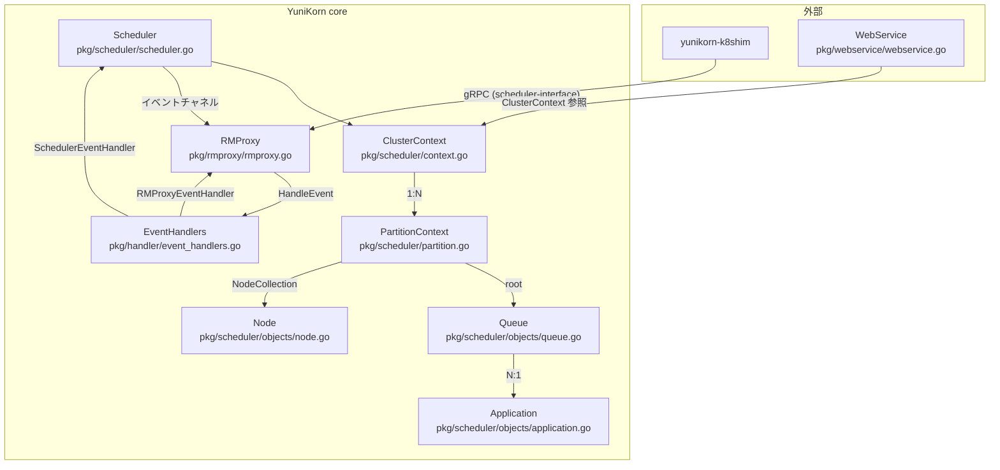

# 第1章 YuniKorn core の全体像

> 本章で読むソース
>
> - [pkg/scheduler/scheduler.go L36-52](https://github.com/apache/yunikorn-core/blob/v1.8.0/pkg/scheduler/scheduler.go#L36-L52)
> - [pkg/scheduler/context.go L45-61](https://github.com/apache/yunikorn-core/blob/v1.8.0/pkg/scheduler/context.go#L45-L61)
> - [pkg/scheduler/partition.go L48-82](https://github.com/apache/yunikorn-core/blob/v1.8.0/pkg/scheduler/partition.go#L48-L82)
> - [pkg/scheduler/objects/queue.go L52-99](https://github.com/apache/yunikorn-core/blob/v1.8.0/pkg/scheduler/objects/queue.go#L52-L99)
> - [pkg/scheduler/objects/application.go L83-130](https://github.com/apache/yunikorn-core/blob/v1.8.0/pkg/scheduler/objects/application.go#L83-L130)
> - [pkg/scheduler/objects/node.go L41-63](https://github.com/apache/yunikorn-core/blob/v1.8.0/pkg/scheduler/objects/node.go#L41-L63)
> - [pkg/rmproxy/rmproxy.go L41-51](https://github.com/apache/yunikorn-core/blob/v1.8.0/pkg/rmproxy/rmproxy.go#L41-L51)
> - [pkg/handler/event_handlers.go L21-28](https://github.com/apache/yunikorn-core/blob/v1.8.0/pkg/handler/event_handlers.go#L21-L28)

## この章の狙い

本章では YuniKorn core の全体アーキテクチャを把握する。
YuniKorn エコシステムの中で core がどの位置を占めるか、core 内部の主要コンポーネントがどのような役割を果たすか、それらがどのように接続されているかを整理する。
具体的なスケジューリングアルゴリズムは後の章に譲り、ここではデータ構造の配置とイベントの流れを俯瞰する。

## 前提

読者は Go の基本的な構文と、チャネルを用いた並行処理の仕組みを理解していることを想定する。
また Kubernetes のスケジューラが「Pod を Node に割り当てる」役割を持つことは既知とする。

## YuniKorn エコシステムの構成

YuniKorn は Kubernetes 向けのユニバーサルリソーススケジューラである。
エコシステムは主に4つのリポジトリで構成される。

- **yunikorn-core**: スケジューリングエンジン本体。キュー階層の管理、リソース割り当ての決定、プリエンプション、リザベーションを担う。
- **yunikorn-k8shim**: Kubernetes 固有の連携層（shim）。Kubernetes API と core のあいだを橋渡しする。
- **yunikorn-web**: Web UI。クラスタの状態やキューの利用率を可視化する。
- **yunikorn-scheduler-interface**: core と shim のあいだでやり取りする Protobuf 定義と Go API。

core は Kubernetes 固有の知識を直接持たない。
shim が Kubernetes から受け取った Pod や Node の情報を、`scheduler-interface` で定義された Protobuf メッセージに変換して core に渡す。
core は純粋にスケジューリングの決定だけを行い、その結果を shim に返す。
この分離により、core は Kubernetes 以外のリソースマネージャからも再利用できる。

## core 内部のコンポーネント配置

core 内部は、`Scheduler` を頂点に `ClusterContext`、`PartitionContext`、そしてキューやノードといったオブジェクト層へと階層化されている。



各コンポーネントの役割を整理する。

### `Scheduler`

`Scheduler` は core のエントリーポイントとなるサービスである。

[pkg/scheduler/scheduler.go L36-43](https://github.com/apache/yunikorn-core/blob/v1.8.0/pkg/scheduler/scheduler.go#L36-L43)

```go
type Scheduler struct {
	clusterContext  *ClusterContext  // main context
	pendingEvents   chan interface{} // queue for events
	activityPending chan bool        // activity pending channel
	stop            chan struct{}    // channel to signal stop request
	healthChecker   *HealthChecker
	nodesMonitor    *nodesResourceUsageMonitor
}
```

`Scheduler` は `ClusterContext` を保持し、イベント処理用のゴルーチンとスケジューリングループのゴルーチンを起動する。
`pendingEvents` は容量 1,048,576（1024×1024）のチャネルであり、RMProxy からのイベントを一時的に蓄える。

### `ClusterContext`

`ClusterContext` は複数の `PartitionContext` を保持する、クラスタ全体のコンテキストである。

[pkg/scheduler/context.go L45-61](https://github.com/apache/yunikorn-core/blob/v1.8.0/pkg/scheduler/context.go#L45-L61)

```go
type ClusterContext struct {
	partitions     map[string]*PartitionContext
	policyGroup    string
	rmEventHandler handler.EventHandler
	uuid           string

	needPreemption      bool
	reservationDisabled bool

	rmInfo    map[string]*RMInformation
	startTime time.Time

	locking.RWMutex

	lastHealthCheckResult *dao.SchedulerHealthDAOInfo
}
```

`ClusterContext` の `schedule()` メソッドは、すべてのパーティションを走査してスケジューリングを試みるメインループである。
このメソッドの詳細は第3章で扱う。

### `PartitionContext`

`PartitionContext` は1つの論理リソースプールを表す。
Kubernetes における1つのクラスタが、YuniKorn では1つのパーティションに対応する。

[pkg/scheduler/partition.go L48-70](https://github.com/apache/yunikorn-core/blob/v1.8.0/pkg/scheduler/partition.go#L48-L70)

```go
type PartitionContext struct {
	RmID string // the RM the partition belongs to
	Name string // name of the partition

	// Private fields need protection
	root                   *objects.Queue                  // start of the queue hierarchy
	applications           map[string]*objects.Application // applications assigned to this partition
	completedApplications  map[string]*objects.Application // completed applications from this partition
	rejectedApplications   map[string]*objects.Application // rejected applications from this partition
	nodes                  objects.NodeCollection          // nodes assigned to this partition
	placementManager       *placement.AppPlacementManager  // placement manager for this partition
	partitionManager       *partitionManager               // manager for this partition
	stateMachine           *fsm.FSM                        // the state of the partition for scheduling
	stateTime              time.Time                       // last time the state was updated (needed for cleanup)
	userGroupCache         *security.UserGroupCache        // user cache per partition
	totalPartitionResource *resources.Resource             // Total node resources
	allocations            int                             // Number of allocations on the partition
	reservations           int                             // number of reservations
	placeholderAllocations int                             // number of placeholder allocations
	preemptionEnabled      bool                            // whether preemption is enabled or not
	quotaPreemptionEnabled bool                            // whether quota preemption is enabled or not
	foreignAllocs          map[string]*objects.Allocation  // foreign (non-Yunikorn) allocations
	appQueueMapping        *objects.AppQueueMapping        // appID mapping to queues
```

`PartitionContext` はキュー階層のルート（`root`）、アプリケーションのマップ、ノードコレクション、プレイスメントマネージャを保持する。
スケジューリングの実際の手続き（`tryReservedAllocate`、`tryPlaceholderAllocate`、`tryAllocate`）もこの構造体のメソッドとして実装されている。

### `Queue`

`Queue` はリソース管理の単位となるキューである。
設定ファイルで定義された静的キューと、アプリケーションの配置ルールによって動的に作成されるキューがある。

[pkg/scheduler/objects/queue.go L52-71](https://github.com/apache/yunikorn-core/blob/v1.8.0/pkg/scheduler/objects/queue.go#L52-L71)

```go
type Queue struct {
	QueuePath string // Fully qualified path for the queue
	Name      string // Queue name as in the config etc.

	// Private fields need protection
	sortType             policies.SortPolicy       // How applications (leaf) or queues (parents) are sorted
	children             map[string]*Queue         // Only for direct children, parent queue only
	childPriorities      map[string]int32          // cached priorities for child queues
	applications         map[string]*Application   // only for leaf queue
	appPriorities        map[string]int32          // cached priorities for application
	reservedApps         map[string]int            // applications reserved within this queue, with reservation count
	parent               *Queue                    // link back to the parent in the scheduler
	pending              *resources.Resource       // pending resource for the apps in the queue
	allocatedResource    *resources.Resource       // allocated resource for the apps in the queue
	preemptingResource   *resources.Resource       // preempting resource for the apps in the queue
	prioritySortEnabled  bool                      // whether priority is used for request sorting
	priorityPolicy       policies.PriorityPolicy   // priority policy
	priorityOffset       int32                     // priority offset for this queue relative to others
	preemptionPolicy     policies.PreemptionPolicy // preemption policy
	preemptionDelay      time.Duration             // time delay before preemption is considered
```

`Queue` は親子関係で階層を構成し、`pending` リソースと `allocatedResource` を伝播させる。
リーフキューだけが `Application` を保持し、親キューは子キューの集約値を管理する。

### `Application`

`Application` はスケジューリング対象のジョブを表す。
Kubernetes であれば Pod グループ、Spark であればアプリケーションがこれに相当する。

[pkg/scheduler/objects/application.go L83-102](https://github.com/apache/yunikorn-core/blob/v1.8.0/pkg/scheduler/objects/application.go#L83-L102)

```go
type Application struct {
	ApplicationID string            // application ID
	Partition     string            // partition Name
	tags          map[string]string // application tags used in scheduling

	// Private mutable fields need protection
	queuePath         string
	queue             *Queue                  // queue the application is running in
	pending           *resources.Resource     // pending resources from asks for the app
	reservations      map[string]*reservation // a map of reservations
	requests          map[string]*Allocation  // a map of allocations, pending or satisfied
	sortedRequests    sortedRequests          // list of requests pre-sorted
	user              security.UserGroup      // owner of the application
	allocatedResource *resources.Resource     // total allocated resources
	submissionTime    time.Time               // time application was submitted (based on the first ask)

	usedResource        *resources.TrackedResource // keep track of resource usage of the application
	preemptedResource   *resources.TrackedResource // keep track of preempted resource usage of the application
	placeholderResource *resources.TrackedResource // keep track of placeholder resource usage of the application
```

`Application` はリクエスト（`Allocation`）の集合であり、状態機械でライフサイクルを管理する。
リザベーションやギャングスケジューリングの状態もここに保持される。

### `Node`

`Node` はクラスタ内の1つの計算資源を表す。

[pkg/scheduler/objects/node.go L41-63](https://github.com/apache/yunikorn-core/blob/v1.8.0/pkg/scheduler/objects/node.go#L41-L63)

```go
type Node struct {
	NodeID    string
	Hostname  string
	Rackname  string
	Partition string

	attributes        map[string]string
	totalResource     *resources.Resource
	occupiedResource  *resources.Resource
	allocatedResource *resources.Resource
	availableResource *resources.Resource
	allocations       map[string]*Allocation
	schedulable       bool

	reservations map[string]*reservation
	listeners    []NodeListener
	nodeEvents   *schedEvt.NodeEvents

	locking.RWMutex
}
```

`Node` は `totalResource` から `allocatedResource` と `occupiedResource` を引いた `availableResource` を持つ。
ノードは `NodeCollection` で管理され、B-tree によるスコア順のイテレータで効率的に走査される。

### `RMProxy`

`RMProxy` は外部のリソースマネージャ（shim）との通信を担うゲートウェイである。

[pkg/rmproxy/rmproxy.go L41-51](https://github.com/apache/yunikorn-core/blob/v1.8.0/pkg/rmproxy/rmproxy.go#L41-L51)

```go
type RMProxy struct {
	schedulerEventHandler handler.EventHandler
	stop                  chan struct{}

	pendingRMEvents chan interface{}

	rmIDToCallback map[string]api.ResourceManagerCallback

	locking.RWMutex
}
```

`RMProxy` は `scheduler-interface` の `SchedulerAPI` インターフェースを実装し、shim からの gRPC コールを受け取る。
受け取ったリクエストは内部イベント（`rmevent`）に変換され、チャネル経由で `Scheduler` に送られる。

## イベント駆動の接続

コンポーネント間の接続はイベントチャネルで構成される。
`EventHandlers` 構造体が、`Scheduler` と `RMProxy` の相互のイベントハンドラを保持する。

[pkg/handler/event_handlers.go L21-28](https://github.com/apache/yunikorn-core/blob/v1.8.0/pkg/handler/event_handlers.go#L21-L28)

```go
type EventHandler interface {
	HandleEvent(ev interface{})
}

type EventHandlers struct {
	RMProxyEventHandler   EventHandler
	SchedulerEventHandler EventHandler
}
```

イベントの流れは2方向ある。

1. **shim から core へ**: shim が `RMProxy` の `UpdateAllocation`、`UpdateApplication`、`UpdateNode` を呼ぶ。`RMProxy` はリクエストを `rmevent` に包み、`SchedulerEventHandler`（`Scheduler`）のチャネルに送る。
2. **core から shim へ**: スケジューリング結果が出ると、`ClusterContext` は `RMProxyEventHandler`（`RMProxy`）のチャネルに `RMNewAllocationsEvent` 等を送る。`RMProxy` は登録済みの `ResourceManagerCallback` を通じて shim に結果を返す。

この双方向のイベントフローにより、`Scheduler` のスケジューリングループと `RMProxy` のイベント処理が独立したゴルーチンで動作する。

## スケジューリングの概要

`ClusterContext.schedule()` は、各パーティションに対して3段階のスケジューリングを試みる。

[pkg/scheduler/context.go L120-157](https://github.com/apache/yunikorn-core/blob/v1.8.0/pkg/scheduler/context.go#L120-L157)

```go
func (cc *ClusterContext) schedule() bool {
	activity := false
	scheduleCycleStart := time.Now()
	for _, psc := range cc.GetPartitionMapClone() {
		if psc.root.GetMaxResource() == nil {
			continue
		}
		if psc.isStopped() {
			continue
		}
		schedulingStart := time.Now()
		result := psc.tryReservedAllocate()
		if result == nil {
			result = psc.tryPlaceholderAllocate()
			if result == nil {
				result = psc.tryAllocate()
			}
		}
		metrics.GetSchedulerMetrics().ObserveSchedulingLatency(schedulingStart)
		// ... (中略) ...
	}
	metrics.GetSchedulerMetrics().ObserveSchedulingCycle(scheduleCycleStart)
	return activity
}
```

1サイクルで試みる処理は以下の3つである。

1. **`tryReservedAllocate`**: 既存のリザベーションを解消できる割り当てを試みる。リザベーションが存在しない場合は即座に `nil` を返す。
2. **`tryPlaceholderAllocate`**: プレースホルダー（ギャングスケジューリング用の仮確保）を本番の割り当てに置き換える試みを行う。プレイスホルダーが存在しない場合は即座に `nil` を返す。
3. **`tryAllocate`**: 通常の割り当てを試みる。キュー階層をルートからたどり、利用可能なノードにリソースを配置する。

この優先順位により、リザベーションやプレイスホルダーが先に処理され、デッドロックやリソースの無駄を防ぐ。
各メソッドの詳細は第3章、第8章、第9章で扱う。

## `scheduler-interface` を介した shim との連携

`RMProxy` は `scheduler-interface` が定義する `SchedulerAPI` インターフェースを実装する。
このインターフェースは以下のメソッドを持つ。

- `RegisterResourceManager`: RM（shim）の登録。コールバックを同時に登録する。
- `UpdateAllocation`: アロケーションの追加・リリース。
- `UpdateApplication`: アプリケーションの追加・削除。
- `UpdateNode`: ノードの追加・削除・更新。
- `UpdateConfiguration`: 設定の動的更新。

shim は gRPC サーバーとしてこれらの API を呼び出す。
`RMProxy` は受け取ったリクエストを `rmevent` パッケージのイベント型に変換し、`Scheduler` の `pendingEvents` チャネルに送る。

[pkg/rmproxy/rmevent/events.go L26-44](https://github.com/apache/yunikorn-core/blob/v1.8.0/pkg/rmproxy/rmevent/events.go#L26-L44)

```go
type RMUpdateAllocationEvent struct {
	Request *si.AllocationRequest
}

type RMUpdateApplicationEvent struct {
	Request *si.ApplicationRequest
}

type RMUpdateNodeEvent struct {
	Request *si.NodeRequest
}
```

`si` パッケージは `scheduler-interface` リポジトリで定義された Protobuf の Go 型である。
このように `scheduler-interface` を中間層に挟むことで、core は Kubernetes 固有の概念（Pod、Deployment など）を一切知らずにスケジューリングを行える。

## `NodeCollection` と B-tree によるノード走査

ノードの走査効率も、スケジューリング性能に影響する。
`NodeCollection` は `baseNodeCollection` で実装され、ノードを B-tree（`github.com/google/btree`）で管理する。

[pkg/scheduler/objects/node_collection.go L73-85](https://github.com/apache/yunikorn-core/blob/v1.8.0/pkg/scheduler/objects/node_collection.go#L73-L85)

```go
type baseNodeCollection struct {
	Partition string // partition used with this collection

	// Private fields need protection
	nsp         NodeSortingPolicy   // node sorting policy
	nodes       map[string]*nodeRef // nodes assigned to this collection
	sortedNodes *btree.BTree        // nodes sorted by score

	unreservedIterator *treeIterator
	fullIterator       *treeIterator

	locking.RWMutex
}
```

ノードは `NodeSortingPolicy` に基づくスコアで B-tree にソートされて格納される。
スケジューリング時には `NodeIterator` でスコア順にノードを走査するため、リソースの空きが多いノードを優先的に選択できる。
B-tree は挿入・削除が O(log n) で済み、イテレータも効率的に構築できるため、大規模クラスタでのスケジューリング遅延を抑えられる。

## 設定管理

スケジューラの動作は YAML 形式の設定ファイルで制御される。
`configs.SchedulerConfig` は複数の `PartitionConfig` を含み、各パーティションはキュー階層、プレイスメントルール、プリエンプション設定、ノードソートポリシーを持つ。

[pkg/common/configs/config.go L37-57](https://github.com/apache/yunikorn-core/blob/v1.8.0/pkg/common/configs/config.go#L37-L57)

```go
type SchedulerConfig struct {
	Partitions []PartitionConfig
	Checksum   string `yaml:",omitempty" json:",omitempty"`
}

type PartitionConfig struct {
	Name              string
	Queues            []QueueConfig
	PlacementRules    []PlacementRule           `yaml:",omitempty" json:",omitempty"`
	Limits            []Limit                   `yaml:",omitempty" json:",omitempty"`
	Preemption        PartitionPreemptionConfig `yaml:",omitempty" json:",omitempty"`
	NodeSortPolicy    NodeSortingPolicy         `yaml:",omitempty" json:",omitempty"`
	UserGroupResolver UserGroupResolver         `yaml:",omitempty" json:",omitempty"`
}
```

`Checksum` フィールドにより、設定変更の有無を SHA-256 ハッシュで高速に判定できる。
同じ設定の再適用をスキップすることで、設定更新時の不要な再構築を避けている。

## まとめ

本章では YuniKorn core の全体像を整理した。
core は `Scheduler` を頂点に `ClusterContext`、`PartitionContext`、`Queue`、`Application`、`Node` の階層構造でリソース管理を行う。
`RMProxy` が `scheduler-interface` を介して shim と通信し、イベントチャネルで `Scheduler` と接続する。
スケジューリングはリザベーション、プレイスホルダー、通常割り当ての3段階で構成され、B-tree によるノード走査で効率を図る。
これらのコンポーネントがどのように起動し、結合されるかは第2章で扱う。

## 関連する章

- [第2章 起動とサービス結合](02-startup.md)
- [第3章 スケジューリングサイクル](../part01-scheduler-core/03-scheduling-cycle.md)
- [第4章 キュー階層と共有ポリシー](../part01-scheduler-core/04-queue-hierarchy.md)
