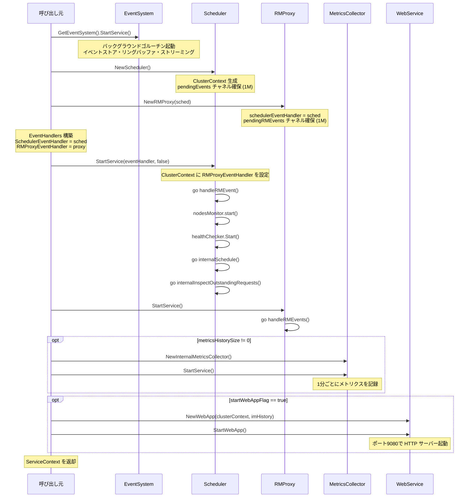

# 第2章 起動とサービス結合

> 本章で読むソース
>
> - [pkg/entrypoint/entrypoint.go L41-116](https://github.com/apache/yunikorn-core/blob/v1.8.0/pkg/entrypoint/entrypoint.go#L41-L116)
> - [pkg/entrypoint/service_context.go L32-53](https://github.com/apache/yunikorn-core/blob/v1.8.0/pkg/entrypoint/service_context.go#L32-L53)
> - [pkg/scheduler/scheduler.go L45-74](https://github.com/apache/yunikorn-core/blob/v1.8.0/pkg/scheduler/scheduler.go#L45-L74)
> - [pkg/rmproxy/rmproxy.go L74-86](https://github.com/apache/yunikorn-core/blob/v1.8.0/pkg/rmproxy/rmproxy.go#L74-L86)
> - [pkg/webservice/webservice.go L40-89](https://github.com/apache/yunikorn-core/blob/v1.8.0/pkg/webservice/webservice.go#L40-L89)
> - [pkg/handler/event_handlers.go L21-28](https://github.com/apache/yunikorn-core/blob/v1.8.0/pkg/handler/event_handlers.go#L21-L28)
> - [pkg/events/event_system.go L115-201](https://github.com/apache/yunikorn-core/blob/v1.8.0/pkg/events/event_system.go#L115-L201)

## この章の狙い

本章では YuniKorn core の起動シーケンスを追う。
`StartAllServices` が呼ばれてから各サービスが初期化され、イベントチャネルで結合されるまでの流れを把握する。
起動順序の意図と、サービス間の依存関係を明確にすることが目的である。

## 前提

第1章で `Scheduler`、`RMProxy`、`ClusterContext`、`EventHandlers` の役割と配置を確認した。
本章ではそれらが具体的にどのように生成され、接続されるかを読み解く。

## `ServiceContext` によるサービスの束ね

`ServiceContext` は起動したすべてのサービスを1つの構造体にまとめる。

[pkg/entrypoint/service_context.go L32-37](https://github.com/apache/yunikorn-core/blob/v1.8.0/pkg/entrypoint/service_context.go#L32-L37)

```go
type ServiceContext struct {
	RMProxy          api.SchedulerAPI
	Scheduler        *scheduler.Scheduler
	WebApp           *webservice.WebService
	MetricsCollector metrics.InternalMetricsCollector
}
```

`RMProxy` は `api.SchedulerAPI` インターフェース型で保持される。
shim はこのインターフェースを通じて core と通信するため、具象型を意識する必要がない。
`StopAll` メソッドは `WebApp`、`MetricsCollector`、`Scheduler`、`RMProxy`、イベントシステムの順で停止する。

[pkg/entrypoint/service_context.go L39-53](https://github.com/apache/yunikorn-core/blob/v1.8.0/pkg/entrypoint/service_context.go#L39-L53)

```go
func (s *ServiceContext) StopAll() {
	log.Log(log.Entrypoint).Info("ServiceContext stop all services")
	if s.WebApp != nil {
		if err := s.WebApp.StopWebApp(); err != nil {
			log.Log(log.Entrypoint).Error("failed to stop web-app",
				zap.Error(err))
		}
	}
	if s.MetricsCollector != nil {
		s.MetricsCollector.Stop()
	}
	s.Scheduler.Stop()
	s.RMProxy.Stop()
	events.GetEventSystem().Stop()
}
```

停止順序は起動順序の逆である。
最初に外部からのリクエストを受け付ける `WebApp` を止め、最後にイベントシステムを止める。
これにより、停止処理中に新しいイベントが発生しないことを保証する。

## `startAllServicesWithParameters` の全体像

起動の中心となる関数は `startAllServicesWithParameters` である。

[pkg/entrypoint/entrypoint.go L78-116](https://github.com/apache/yunikorn-core/blob/v1.8.0/pkg/entrypoint/entrypoint.go#L78-L116)

```go
func startAllServicesWithParameters(opts startupOptions) *ServiceContext {
	log.Log(log.Entrypoint).Info("Starting event system")
	events.GetEventSystem().StartService()

	sched := scheduler.NewScheduler()
	proxy := rmproxy.NewRMProxy(sched)
	eventHandler := handler.EventHandlers{
		SchedulerEventHandler: sched,
		RMProxyEventHandler:   proxy,
	}

	log.Log(log.Entrypoint).Info("ServiceContext start scheduling services")
	sched.StartService(eventHandler, opts.manualScheduleFlag)
	proxy.StartService()

	context := &ServiceContext{
		RMProxy:   proxy,
		Scheduler: sched,
	}

	var imHistory *history.InternalMetricsHistory
	if opts.metricsHistorySize != 0 {
		log.Log(log.Entrypoint).Info("creating InternalMetricsHistory")
		imHistory = history.NewInternalMetricsHistory(opts.metricsHistorySize)
		metricsCollector := metrics.NewInternalMetricsCollector(imHistory)
		metricsCollector.StartService()
		context.MetricsCollector = metricsCollector
	}

	if opts.startWebAppFlag {
		log.Log(log.Entrypoint).Info("ServiceContext start web application service")
		webapp := webservice.NewWebApp(sched.GetClusterContext(), imHistory)
		webapp.StartWebApp()
		context.WebApp = webapp
	}

	return context
}
```

この関数は以下の順序でサービスを初期化する。

1. イベントシステムの起動
2. `Scheduler` と `RMProxy` の生成
3. `EventHandlers` の構築と相互結合
4. `Scheduler` のサービス開始
5. `RMProxy` のサービス開始
6. `MetricsCollector` の起動（任意）
7. `WebService` の起動（任意）

## イベントシステムの起動

最も最初に起動するのは `EventSystem` である。

[pkg/events/event_system.go L115-120](https://github.com/apache/yunikorn-core/blob/v1.8.0/pkg/events/event_system.go#L115-L120)

```go
func GetEventSystem() EventSystem {
	once.Do(func() {
		Init()
	})
	return ev
}
```

`EventSystem` は `sync.Once` で遅延初期化されるシングルトンである。
`StartService` でバックグラウンドゴルーチンを起動し、イベントのストア、リングバッファ、ストリーミング配信を開始する。

[pkg/events/event_system.go L167-201](https://github.com/apache/yunikorn-core/blob/v1.8.0/pkg/events/event_system.go#L167-L201)

```go
func (ec *EventSystemImpl) StartServiceWithPublisher(withPublisher bool) {
	ec.Lock()
	defer ec.Unlock()

	configs.AddConfigMapCallback(ec.eventSystemId, func() {
		go ec.reloadConfig()
	})

	ec.trackingEnabled = isTrackingEnabled()
	ec.ringBufferCapacity = getRingBufferCapacity()
	ec.requestCapacity = getRequestCapacity()

	go func() {
		log.Log(log.Events).Info("Starting event system handler")
		for {
			select {
			case <-ec.stop:
				return
			case event, ok := <-ec.channel:
				if !ok {
					return
				}
				if event != nil {
					ec.Store.Store(event)
					ec.eventBuffer.Add(event)
					ec.streaming.PublishEvent(event)
					metrics.GetEventMetrics().IncEventsProcessed()
				}
			}
		}
	}()
	if withPublisher {
		ec.publisher.StartService()
	}
}
```

イベントシステムはスケジューリングの内部イベント（キューの状態変化、アロケーションの決定など）を記録し、REST API やストリーミングで外部に配信する基盤である。
他のサービスがイベントを発行する前に、受信側が起動していなければならない。
このため、イベントシステムが最も先に起動する。

## `Scheduler` と `RMProxy` の相互結合

`Scheduler` と `RMProxy` は互いの `EventHandler` を保持することで、双方向にイベントを送れるようになる。

[pkg/entrypoint/entrypoint.go L82-87](https://github.com/apache/yunikorn-core/blob/v1.8.0/pkg/entrypoint/entrypoint.go#L82-L87)

```go
sched := scheduler.NewScheduler()
proxy := rmproxy.NewRMProxy(sched)
eventHandler := handler.EventHandlers{
	SchedulerEventHandler: sched,
	RMProxyEventHandler:   proxy,
}
```

`NewRMProxy` の引数として `sched` を渡している。
`RMProxy` はこの `sched` を `schedulerEventHandler` フィールドに保持し、shim からのリクエストを `Scheduler` に転送する。

[pkg/rmproxy/rmproxy.go L74-82](https://github.com/apache/yunikorn-core/blob/v1.8.0/pkg/rmproxy/rmproxy.go#L74-L82)

```go
func NewRMProxy(schedulerEventHandler handler.EventHandler) *RMProxy {
	rm := &RMProxy{
		rmIDToCallback:        make(map[string]api.ResourceManagerCallback),
		pendingRMEvents:       make(chan interface{}, 1024*1024),
		stop:                  make(chan struct{}),
		schedulerEventHandler: schedulerEventHandler,
	}
	return rm
}
```

`RMProxy` の `pendingRMEvents` チャネルも 1,048,576 の容量を持つ。
`Scheduler` の `pendingEvents` と同様に、イベントの喪失を防ぐための十分なバッファを確保している。

## `Scheduler` のサービス開始

`EventHandlers` を受け取った `Scheduler` は `StartService` で以下の処理を行う。

[pkg/scheduler/scheduler.go L55-74](https://github.com/apache/yunikorn-core/blob/v1.8.0/pkg/scheduler/scheduler.go#L55-L74)

```go
func (s *Scheduler) StartService(handlers handler.EventHandlers, manualSchedule bool) {
	s.clusterContext.setEventHandler(handlers.RMProxyEventHandler)

	go s.handleRMEvent()

	s.nodesMonitor = newNodesResourceUsageMonitor(s.clusterContext)
	s.nodesMonitor.start()

	s.healthChecker = NewHealthChecker(s.clusterContext)
	s.healthChecker.Start()

	if !manualSchedule {
		go s.internalSchedule()
		go s.internalInspectOutstandingRequests()
	}
}
```

`StartService` は以下のゴルーチンを起動する。

1. **`handleRMEvent`**: `Scheduler` の `pendingEvents` チャネルからイベントを取り出し、`ClusterContext` の各ハンドラに振り分ける。
2. **`nodesResourceUsageMonitor`**: 1秒ごとにノードのリソース使用率を集計し、メトリクスに記録する。
3. **`HealthChecker`**: 定期的にスケジューラの健全性を検査する。
4. **`internalSchedule`**: メインのスケジューリングループ。活動がない場合でも100ミリ秒のタイムアウトで再試行する。
5. **`internalInspectOutstandingRequests`**: 1秒ごとに未処理のリクエストを検査し、オートスケーリングのトリガーを更新する。

`ClusterContext` に `RMProxyEventHandler` を設定する点が重要である。
これにより、`ClusterContext` がスケジューリング結果を `RMProxy` に通知できるようになる。

`internalSchedule` のイベント駆動モデルに注目する。

[pkg/scheduler/scheduler.go L77-92](https://github.com/apache/yunikorn-core/blob/v1.8.0/pkg/scheduler/scheduler.go#L77-L92)

```go
func (s *Scheduler) internalSchedule() {
	for {
		select {
		case <-s.stop:
			return
		case <-s.activityPending:
			// activity pending
		case <-time.After(100 * time.Millisecond):
			// timeout, run scheduler anyway
		}

		if s.clusterContext.schedule() {
			s.registerActivity()
		}
	}
}
```

スケジューリングループは `activityPending` チャネルで通知を受け取るまでスリープする。
イベント処理（`handleRMEvent`）が活動を検知すると `registerActivity` が呼ばれ、`activityPending` にシグナルが送られる。

[pkg/scheduler/scheduler.go L156-163](https://github.com/apache/yunikorn-core/blob/v1.8.0/pkg/scheduler/scheduler.go#L156-L163)

```go
func (s *Scheduler) registerActivity() {
	select {
	case s.activityPending <- true:
		// activity registered
	default:
		// buffer is full, activity will be processed at the next available opportunity
	}
}
```

`activityPending` は容量1のチャネルであり、ノンブロッキングでシグナルを送る。
すでにシグナルが溜まっている場合は何もせず、次のスケジュールサイクルで処理される。
この設計により、イベントが連続して発生してもスケジューリングループが過剰に起動されず、CPU を浪費しない。
100ミリ秒のタイムアウトは、イベントを見逃した場合でも最終的にスケジュールが実行されることを保証する。

## `RMProxy` のサービス開始

`RMProxy` の `StartService` はシンプルにイベント処理ゴルーチンを1つ起動するだけである。

[pkg/rmproxy/rmproxy.go L84-86](https://github.com/apache/yunikorn-core/blob/v1.8.0/pkg/rmproxy/rmproxy.go#L84-L86)

```go
func (rmp *RMProxy) StartService() {
	go rmp.handleRMEvents()
}
```

`handleRMEvents` は `pendingRMEvents` チャネルからイベントを取り出し、種類に応じて処理を振り分ける。

[pkg/rmproxy/rmproxy.go L187-209](https://github.com/apache/yunikorn-core/blob/v1.8.0/pkg/rmproxy/rmproxy.go#L187-L209)

```go
func (rmp *RMProxy) handleRMEvents() {
	for {
		select {
		case ev := <-rmp.pendingRMEvents:
			switch v := ev.(type) {
			case *rmevent.RMNewAllocationsEvent:
				rmp.processAllocationUpdateEvent(v)
			case *rmevent.RMApplicationUpdateEvent:
				rmp.processApplicationUpdateEvent(v)
			case *rmevent.RMReleaseAllocationEvent:
				rmp.processRMReleaseAllocationEvent(v)
			case *rmevent.RMRejectedAllocationEvent:
				rmp.processRMRejectedAllocationEvent(v)
			case *rmevent.RMNodeUpdateEvent:
				rmp.processRMNodeUpdateEvent(v)
			default:
				panic(fmt.Sprintf("%s is not an acceptable type for RM event.", reflect.TypeOf(v).String()))
			}
		case <-rmp.stop:
			return
		}
	}
}
```

`RMProxy` が処理するイベントは、すべて `Scheduler` 側から送られてくるアウトゴーイングのイベントである。
アロケーション結果、アプリケーションの受理・拒否、ノードの受理・拒否などを、shim の `ResourceManagerCallback` に返す。

## `WebService` の起動

`WebService` は `ClusterContext` と `InternalMetricsHistory` を受け取って起動する。

[pkg/webservice/webservice.go L84-89](https://github.com/apache/yunikorn-core/blob/v1.8.0/pkg/webservice/webservice.go#L84-L89)

```go
func NewWebApp(context *scheduler.ClusterContext, internalMetrics *history.InternalMetricsHistory) *WebService {
	m := &WebService{}
	schedulerContext.Store(context)
	imHistory = internalMetrics
	return m
}
```

`ClusterContext` は `atomic.Pointer` で格納される。
これにより、REST API ハンドラがロックなしで `ClusterContext` を参照できる。

[pkg/webservice/webservice.go L66-82](https://github.com/apache/yunikorn-core/blob/v1.8.0/pkg/webservice/webservice.go#L66-L82)

```go
func (m *WebService) StartWebApp() {
	router := newRouter()
	m.httpServer = &http.Server{
		Addr:              ":9080",
		Handler:           router,
		ReadHeaderTimeout: 10 * time.Second,
	}

	log.Log(log.REST).Info("web-app started", zap.Int("port", 9080))
	go func() {
		httpError := m.httpServer.ListenAndServe()
		if httpError != nil && !errors.Is(httpError, http.ErrServerClosed) {
			log.Log(log.REST).Error("HTTP serving error",
				zap.Error(httpError))
		}
	}()
}
```

`WebService` はポート9080で HTTP サーバーを起動する。
`ReadHeaderTimeout` に10秒を設定することで、Slowloris 攻撃への耐性を持たせている。

## 起動シーケンス

以上の起動順序をシーケンス図でまとめる。



## イベントチャネルの容量設計

`Scheduler` と `RMProxy` のイベントチャネルは、いずれも 1,048,576（1024×1024）の容量を持つ。

[pkg/scheduler/scheduler.go L48](https://github.com/apache/yunikorn-core/blob/v1.8.0/pkg/scheduler/scheduler.go#L48)

```go
m.pendingEvents = make(chan interface{}, 1024*1024)
```

[pkg/rmproxy/rmproxy.go L77](https://github.com/apache/yunikorn-core/blob/v1.8.0/pkg/rmproxy/rmproxy.go#L77)

```go
		pendingRMEvents:       make(chan interface{}, 1024*1024),
```

この大きなバッファは、イベントのブロッキングを防ぐために設計されている。
チャネルが満杯の場合、`enqueueAndCheckFull` 関数は `DPanic` ログを出力する。

[pkg/scheduler/scheduler.go L114-125](https://github.com/apache/yunikorn-core/blob/v1.8.0/pkg/scheduler/scheduler.go#L114-L125)

```go
func enqueueAndCheckFull(queue chan interface{}, ev interface{}) {
	select {
	case queue <- ev:
		log.Log(log.Scheduler).Debug("enqueued event",
			zap.Stringer("eventType", reflect.TypeOf(ev)),
			zap.Any("event", ev),
			zap.Int("currentQueueSize", len(queue)))
	default:
		log.Log(log.Scheduler).DPanic("failed to enqueue event",
			zap.Stringer("event", reflect.TypeOf(ev)))
	}
}
```

`DPanic` は開発環境ではパニックを引き起こし、本番環境ではエラーログを出力する。
1M のバッファは、大規模クラスタで数千のノードと数万の Pod が同時に更新される状況でも、イベントが溢れないことを想定している。
チャネルはノンブロッキングの `select` で送信を試みるため、バッファが満杯でも送信側はブロックされない。

## `startupOptions` による起動モードの切り替え

`StartAllServices` は `startupOptions` で起動モードを制御する。

[pkg/entrypoint/entrypoint.go L35-49](https://github.com/apache/yunikorn-core/blob/v1.8.0/pkg/entrypoint/entrypoint.go#L35-L49)

```go
type startupOptions struct {
	manualScheduleFlag bool
	startWebAppFlag    bool
	metricsHistorySize int
}

func StartAllServices() *ServiceContext {
	log.Log(log.Entrypoint).Info("ServiceContext start all services")
	return startAllServicesWithParameters(
		startupOptions{
			manualScheduleFlag: false,
			startWebAppFlag:    true,
			metricsHistorySize: 1440,
		})
}
```

`manualScheduleFlag` が `false` の場合、スケジューリングループは自動で起動する。
`true` の場合はテスト用に手動ステップ模式となり、`MultiStepSchedule` で明示的にステップを進める。
`startWebAppFlag` が `false` の場合、`WebService` は起動しない。
テストでは `StartAllServicesWithManualScheduler` で `manualScheduleFlag: true`, `startWebAppFlag: false` を指定する。

## まとめ

本章では YuniKorn core の起動シーケンスを追った。
起動は `EventSystem` → `Scheduler` + `RMProxy` の相互結合 → `MetricsCollector` → `WebService` の順で進む。
`EventHandlers` が2つのサービスのイベントハンドラを束ね、双方向のイベントフローを構成する。
スケジューリングループは `activityPending` チャネルによるイベント駆動と100ミリ秒のタイムアウトで、不要な CPU 消費を抑えつつ応答性を保つ。
イベントチャネルは1M のバッファで overflowing を防ぎ、`DPanic` で異常を検知する。
これらの設計により、core は大規模クラスタでも安定して起動し、イベントを処理し続けられる。

## 関連する章

- [第1章 YuniKorn core の全体像](01-overview.md)
- [第3章 スケジューリングサイクル](../part01-scheduler-core/03-scheduling-cycle.md)
