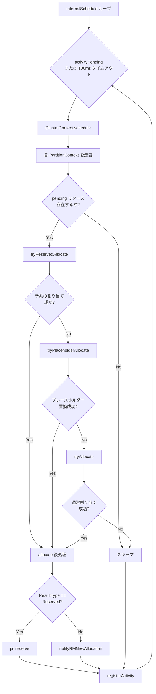

# 第3章 スケジューリングサイクル

> 本章で読むソース:
>
> - [pkg/scheduler/scheduler.go L77-L92](https://github.com/apache/yunikorn-core/blob/v1.8.0/pkg/scheduler/scheduler.go#L77-L92)
> - [pkg/scheduler/context.go L120-L157](https://github.com/apache/yunikorn-core/blob/v1.8.0/pkg/scheduler/context.go#L120-L157)
> - [pkg/scheduler/partition.go L816-L868](https://github.com/apache/yunikorn-core/blob/v1.8.0/pkg/scheduler/partition.go#L816-L868)

## この章の狙い

スケジューラがどのようにリソース割り当ての決定を繰り返すか、その駆動ループの全体像を把握する。
`Scheduler` の無限ループから `PartitionContext` の3段階の割り当て試行まで、1サイクルの流れを追う。

## 前提

第1章で `Scheduler` がイベント駆動のサービスとして起動することを述べた。
本章では、そのサービスが内部で持つ2つのゴルーチン、`internalSchedule` と `handleRMEvent` の役割を整理する。

## イベント処理ループ

`Scheduler` は起動時に2つのゴルーチンを立ち上げる。

[pkg/scheduler/scheduler.go L55-L74](https://github.com/apache/yunikorn-core/blob/v1.8.0/pkg/scheduler/scheduler.go#L55-L74)

```go
func (s *Scheduler) StartService(handlers handler.EventHandlers, manualSchedule bool) {
	s.clusterContext.setEventHandler(handlers.RMProxyEventHandler)
	go s.handleRMEvent()
	s.nodesMonitor = newNodesResourceUsageMonitor(s.clusterContext)
	s.nodesMonitor.start()
	s.healthChecker = NewHealthChecker(s.clusterContext)
	s.healthChecker.Start()
	if !manualSchedule {
		go s.internalSchedule()
		go s.internalInspectOutstandingRequests()
	}
}
```

`handleRMEvent` は Shim から届くイベントを逐次処理する。
ノード追加、アプリケーション追加、アロケーション更新といったイベントを `ClusterContext` に委譲する。

[pkg/scheduler/scheduler.go L127-L153](https://github.com/apache/yunikorn-core/blob/v1.8.0/pkg/scheduler/scheduler.go#L127-L153)

```go
func (s *Scheduler) handleRMEvent() {
	for {
		select {
		case ev := <-s.pendingEvents:
			switch v := ev.(type) {
			case *rmevent.RMUpdateAllocationEvent:
				s.clusterContext.handleRMUpdateAllocationEvent(v)
			case *rmevent.RMUpdateApplicationEvent:
				s.clusterContext.handleRMUpdateApplicationEvent(v)
			case *rmevent.RMUpdateNodeEvent:
				s.clusterContext.handleRMUpdateNodeEvent(v)
			// ...
			}
			s.registerActivity()
		case <-s.stop:
			return
		}
	}
}
```

各イベント処理の終わりには `registerActivity` を呼び、スケジューリングループに再試行を促す。

## 駆動ループの構造

`internalSchedule` は100ミリ秒のタイムアウト付きの無限ループである。

[pkg/scheduler/scheduler.go L77-L92](https://github.com/apache/yunikorn-core/blob/v1.8.0/pkg/scheduler/scheduler.go#L77-L92)

```go
func (s *Scheduler) internalSchedule() {
	for {
		select {
		case <-s.stop:
			return
		case <-s.activityPending:
			// activity pending
		case <-time.After(100 * time.Millisecond):
			// timeout, run scheduler anyway
		}
		if s.clusterContext.schedule() {
			s.registerActivity()
		}
	}
}
```

このループは3つの契機で目覚める。

- `activityPending` チャネルにシグナルが届いたとき（イベント処理後や割り当て成功後）
- 100ミリ秒のタイムアウト
- `stop` チャネルで停止

割り当てに成功すると `registerActivity` が呼ばれ、次のサイクルが即座に始まる。
イベントが途絶えても100ミリ秒ごとに必ず1回実行されるため、スケジューラは starvation しない。

## `ClusterContext.schedule` の処理

`schedule` メソッドは全パーティションを走査し、各パーティションで3段階の割り当てを試行する。

[pkg/scheduler/context.go L120-L157](https://github.com/apache/yunikorn-core/blob/v1.8.0/pkg/scheduler/context.go#L120-L157)

```go
func (cc *ClusterContext) schedule() bool {
	activity := false
	scheduleCycleStart := time.Now()
	for _, psc := range cc.GetPartitionMapClone() {
		if psc.root.GetMaxResource() == nil {
			continue
		}
		if psc.isStopped() {
			continue
		}
		schedulingStart := time.Now()
		result := psc.tryReservedAllocate()
		if result == nil {
			result = psc.tryPlaceholderAllocate()
			if result == nil {
				result = psc.tryAllocate()
			}
		}
		metrics.GetSchedulerMetrics().ObserveSchedulingLatency(schedulingStart)
		if result != nil {
			if result.ResultType == objects.Replaced {
				cc.notifyRMAllocationReleased(psc.RmID, psc.Name,
					[]*objects.Allocation{result.Request.GetRelease()},
					si.TerminationType_PLACEHOLDER_REPLACED,
					"replacing allocationKey: "+result.Request.GetAllocationKey())
			} else {
				cc.notifyRMNewAllocation(psc.RmID, result.Request)
			}
			activity = true
		}
	}
	metrics.GetSchedulerMetrics().ObserveSchedulingCycle(scheduleCycleStart)
	return activity
}
```

パーティションにリソースが存在しない場合、または停止中の場合はスキップする。
それ以外では3つのメソッドを順に呼び出し、最初に成功した結果を返す。

## 3段階の割り当て試行

各 `PartitionContext` は以下の優先順位で割り当てを試みる。

1. **予約の割り当て**（`tryReservedAllocate`）
2. **プレースホルダーの置換**（`tryPlaceholderAllocate`）
3. **通常の割り当て**（`tryAllocate`）

[pkg/scheduler/partition.go L831-L868](https://github.com/apache/yunikorn-core/blob/v1.8.0/pkg/scheduler/partition.go#L831-L868)

```go
func (pc *PartitionContext) tryReservedAllocate() *objects.AllocationResult {
	if pc.getReservationCount() == 0 {
		return nil
	}
	if !resources.StrictlyGreaterThanZero(pc.root.GetPendingResource()) {
		return nil
	}
	result := pc.root.TryReservedAllocate(pc.GetNodeIterator)
	if result != nil {
		return pc.allocate(result)
	}
	return nil
}

func (pc *PartitionContext) tryPlaceholderAllocate() *AllocationResult {
	if pc.getPhAllocationCount() == 0 {
		return nil
	}
	if !resources.StrictlyGreaterThanZero(pc.root.GetPendingResource()) {
		return nil
	}
	result := pc.root.TryPlaceholderAllocate(pc.GetNodeIterator, pc.GetNode)
	if result != nil {
		return result
	}
	return nil
}
```

[pkg/scheduler/partition.go L816-L827](https://github.com/apache/yunikorn-core/blob/v1.8.0/pkg/scheduler/partition.go#L816-L827)

```go
func (pc *PartitionContext) tryAllocate() *objects.AllocationResult {
	if !resources.StrictlyGreaterThanZero(pc.root.GetPendingResource()) {
		return nil
	}
	result := pc.root.TryAllocate(pc.GetNodeIterator, pc.GetFullNodeIterator,
		pc.GetNode, pc.IsPreemptionEnabled(), pc.IsQuotaPreemptionEnabled())
	if result != nil {
		return pc.allocate(result)
	}
	return nil
}
```

各メソッドは pending リソースが存在しない場合に早期リターンする。
この早期リターンにより、キューに要求がないパーティションでは無駄な探索が発生しない。

予約の割り当てが最優先なのは、ノードを予約したアプリケーションに対して確実にリソースを届けるためである。
プレースホルダーの置換が2番目なのは、Gang スケジューリングで確保した仮の割り当てを実割り当てに置き換える必要があるためである。

## 割り当て結果の後処理

`allocate` メソッドは `AllocationResult` を受け取り、アプリケーションとノードの存在を確認する。

[pkg/scheduler/partition.go L872-L961](https://github.com/apache/yunikorn-core/blob/v1.8.0/pkg/scheduler/partition.go#L872-L961)

```go
func (pc *PartitionContext) allocate(result *objects.AllocationResult) *objects.AllocationResult {
	appID := result.Request.GetApplicationID()
	app := pc.getApplication(appID)
	if app == nil {
		log.Log(log.SchedPartition).Info("Application was removed while allocating",
			zap.String("appID", appID))
		return nil
	}
	alloc := result.Request
	targetNodeID := result.NodeID
	targetNode := pc.GetNode(targetNodeID)
	if targetNode == nil {
		log.Log(log.SchedPartition).Info("Target node was removed while allocating",
			zap.String("nodeID", targetNodeID),
			zap.String("appID", appID))
		if alloc.IsAllocated() {
			allocKey := alloc.GetAllocationKey()
			if _, err := app.DeallocateAsk(allocKey); err != nil {
				log.Log(log.SchedPartition).Warn("Failed to unwind allocation", ...)
			}
		}
		return nil
	}
	// ...
	if result.ResultType == objects.Reserved {
		pc.reserve(app, targetNode, result.Request)
		return nil
	}
	// ...
	alloc.SetBindTime(time.Now())
	alloc.SetNodeID(targetNodeID)
	pc.updateAllocationCount(1)
	return result
}
```

スケジューリング中にアプリケーションやノードが削除される可能性がある。
このチェックは競合状態への対処であり、存在しない対象への割り当てを防ぐ。

## スケジューリングサイクルの流れ



## 最適化の工夫

スケジューリングサイクルの最適化は、早期リターンの連鎖にある。

`tryReservedAllocate` は予約数が0の場合、`tryPlaceholderAllocate` はプレースホルダー数が0の場合、`tryAllocate` は pending リソースが0の場合に即座に nil を返す。
これにより、該当する状態にないパーティションではキュー階層の走査自体が発生しない。

さらに `internalSchedule` は `activityPending` チャネルをバッファ付き（サイズ1）で保持する。
イベント処理後に `registerActivity` が呼ばれたとき、チャネルが空であれば即座にシグナルが伝わる。
チャネルが満杯の場合は次のタイムアウトまで待てるため、過剰な目覚めが発生しない。

この設計により、スケジューラはアイドル時には100ミリ秒周期で動き、アクティブ時にはイベント駆動で即座に反応する。

## まとめ

スケジューリングサイクルは `internalSchedule` の無限ループから始まり、`ClusterContext.schedule` を経由して各パーティションの3段階割り当て試行に至る。
予約、プレースホルダー置換、通常割り当ての順で試行し、最初に成功した結果を Shim に通知する。
早期リターンの連鎖と activity チャネルのバッファリングにより、不要な走査と過剰な目覚めを回避している。

## 関連する章

- [第4章 キュー階層と共有ポリシー](04-queue-hierarchy.md): `root.TryAllocate` から再帰的にキュー階層を下る処理を詳述する
- [第5章 アプリケーションとアロケーションリクエスト](05-application-and-allocation.md): `Application.tryAllocate` の内部処理を詳述する
- [第6章 ノード管理](06-node-management.md): ノードイテレータの生成とノード走査の仕組みを詳述する
