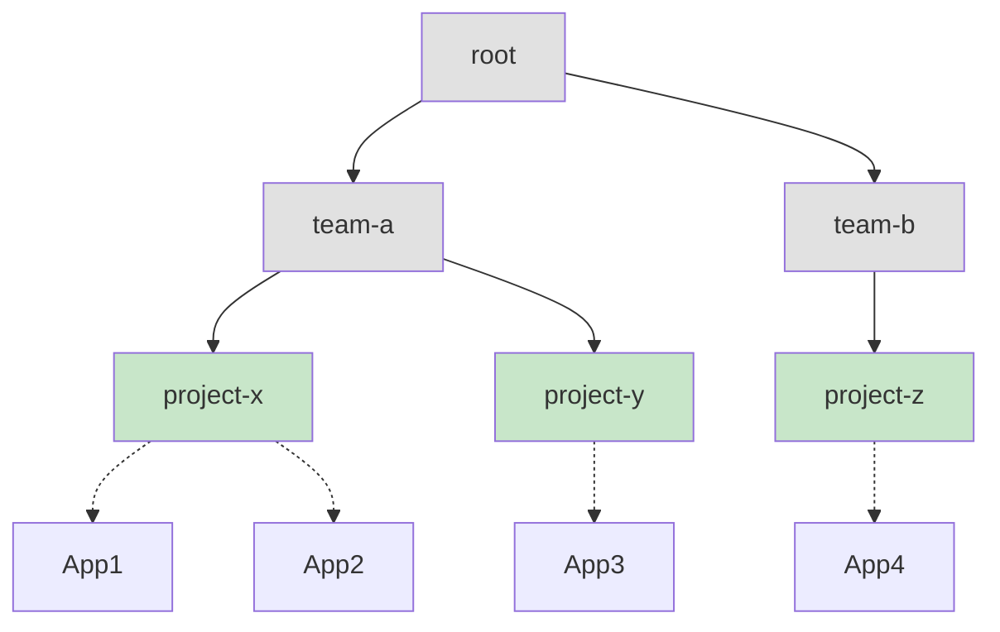
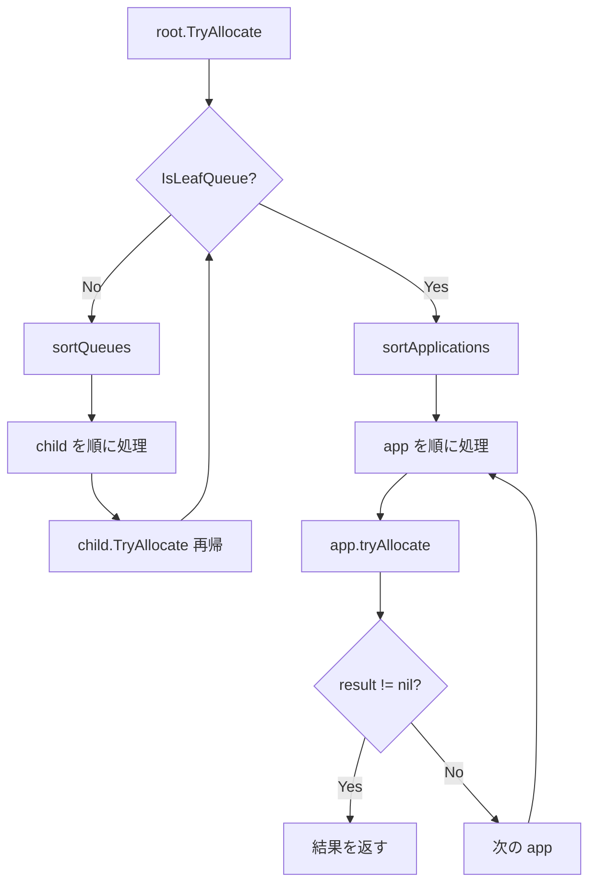

# 第4章 キュー階層と共有ポリシー

> 本章で読むソース:
>
> - [pkg/scheduler/objects/queue.go L52-L99](https://github.com/apache/yunikorn-core/blob/v1.8.0/pkg/scheduler/objects/queue.go#L52-L99)
> - [pkg/scheduler/objects/queue.go L1584-L1646](https://github.com/apache/yunikorn-core/blob/v1.8.0/pkg/scheduler/objects/queue.go#L1584-L1646)
> - [pkg/scheduler/objects/queue.go L1332-L1379](https://github.com/apache/yunikorn-core/blob/v1.8.0/pkg/scheduler/objects/queue.go#L1332-L1379)
> - [pkg/scheduler/policies/sorting_policy.go L28-L54](https://github.com/apache/yunikorn-core/blob/v1.8.0/pkg/scheduler/policies/sorting_policy.go#L28-L54)

## この章の狙い

キュー階層のデータ構造と、`TryAllocate` が再帰的にキューを下る仕組みを理解する。
親キューとリーフキューの役割分担、アプリケーションのソーティングポリシーが割り当て順序に与える影響を明らかにする。

## 前提

第3章で `PartitionContext.tryAllocate` が `root.TryAllocate` を呼ぶことを確認した。
本章ではこの再帰呼び出しの内部構造を追う。

## Queue 構造体

`Queue` はキュー階層の各ノードを表す。

[pkg/scheduler/objects/queue.go L52-L99](https://github.com/apache/yunikorn-core/blob/v1.8.0/pkg/scheduler/objects/queue.go#L52-L99)

```go
type Queue struct {
	QueuePath string // Fully qualified path for the queue
	Name      string // Queue name as in the config etc.

	// Private fields need protection
	sortType             policies.SortPolicy       // How applications (leaf) or queues (parents) are sorted
	children             map[string]*Queue         // Only for direct children, parent queue only
	childPriorities      map[string]int32          // cached priorities for child queues
	applications         map[string]*Application   // only for leaf queue
	appPriorities        map[string]int32          // cached priorities for application
	reservedApps         map[string]int            // applications reserved within this queue, with reservation count
	parent               *Queue                    // link back to the parent in the scheduler
	pending              *resources.Resource       // pending resource for the apps in the queue
	allocatedResource    *resources.Resource       // allocated resource for the apps in the queue
	preemptingResource   *resources.Resource       // preempting resource for the apps in the queue
	prioritySortEnabled  bool                      // whether priority is used for request sorting
	// ...
	maxResource              *resources.Resource // When not set, max = nil
	guaranteedResource       *resources.Resource // When not set, Guaranteed == 0
	isLeaf                   bool                // this is a leaf queue or not (i.e. parent)
	isManaged                bool                // queue is part of the config, not auto created
	stateMachine             *fsm.FSM            // the state of the queue for scheduling
	// ...
	locking.RWMutex
}
```

キューは `children` で子キューを保持し、`applications` でアプリケーションを保持する。
`isLeaf` が true のキューはアプリケーションを直接保持し、false のキューは子キューのみを保持する。

## 親キューとリーフキューの役割

キュー階層はツリー構造を形成する。

- **親キュー**: 子キューを保持する。リソースの集約と配分を行う。アプリケーションは直接保持しない。
- **リーフキュー**: アプリケーションを保持する。実際のスケジューリング判断が行われる場所である。



灰色が親キュー、緑色がリーフキューである。
リーフキューだけがアプリケーションを保持し、スケジューリングの末端となる。

## ソーティングポリシー

キューは `sortType` に基づいて子キューまたはアプリケーションをソートする。

[pkg/scheduler/policies/sorting_policy.go L28-L35](https://github.com/apache/yunikorn-core/blob/v1.8.0/pkg/scheduler/policies/sorting_policy.go#L28-L35)

```go
type SortPolicy int

const (
	FifoSortPolicy             SortPolicy = iota // first in first out, submit time
	FairSortPolicy                               // fair based on usage
	deprecatedStateAwarePolicy                   // deprecated: now alias for FIFO
	Undefined                                    // not initialised or parsing failed
)
```

- **FIFO**: 提出時刻の早い順に処理する
- **Fair**: 現在のリソース使用量に基づいて公平に処理する

FIFO はシンプルで予測可能である。
Fair は使用量が少ないキューを優先することで、リソースの公平な配分を実現する。

## TryAllocate の再帰的処理

`TryAllocate` はリーフキューに到達するまで再帰的に子キューを下る。

[pkg/scheduler/objects/queue.go L1584-L1646](https://github.com/apache/yunikorn-core/blob/v1.8.0/pkg/scheduler/objects/queue.go#L1584-L1646)

```go
func (sq *Queue) TryAllocate(iterator func() NodeIterator, fullIterator func() NodeIterator,
	getnode func(string) *Node, allowPreemption, quotaPreemption bool) *AllocationResult {
	// ...
	if sq.IsLeafQueue() {
		headRoom := sq.getHeadRoom()
		preemptionDelay := sq.GetPreemptionDelay()
		preemptAttemptsRemaining := maxPreemptionsPerQueue
		for _, app := range sq.sortApplications(false) {
			runnableInQueue := sq.canRunApp(app.ApplicationID)
			runnableByUserLimit := ugm.GetUserManager().CanRunApp(sq.QueuePath,
				app.ApplicationID, app.user)
			app.updateRunnableStatus(runnableInQueue, runnableByUserLimit)
			if app.IsAccepted() && (!runnableInQueue || !runnableByUserLimit) {
				continue
			}
			deadline := app.GetBackoffDeadline()
			if !deadline.IsZero() && time.Now().Before(deadline) {
				continue
			}
			result := app.tryAllocate(headRoom, allowPreemption, preemptionDelay,
				&preemptAttemptsRemaining, iterator, fullIterator, getnode)
			if result != nil {
				if app.IsAccepted() {
					sq.setAllocatingAccepted(app.ApplicationID)
				}
				return result
			}
		}
	} else {
		for _, child := range sq.sortQueues() {
			result := child.TryAllocate(iterator, fullIterator, getnode,
				allowPreemption, quotaPreemption)
			if result != nil {
				return result
			}
		}
	}
	return nil
}
```

リーフキューでは `sortApplications` でアプリケーションをソートし、順に `app.tryAllocate` を呼ぶ。
親キューでは `sortQueues` で子キューをソートし、順に再帰呼び出しする。

## sortQueues の実装

`sortQueues` は pending リソースを持つ子キューのみをソート対象とする。

[pkg/scheduler/objects/queue.go L1357-L1379](https://github.com/apache/yunikorn-core/blob/v1.8.0/pkg/scheduler/objects/queue.go#L1357-L1379)

```go
func (sq *Queue) sortQueues() []*Queue {
	if sq.IsLeafQueue() {
		return nil
	}
	sortedQueues := make([]*Queue, 0)
	sortedMaxFairResources := make([]*resources.Resource, 0)
	for _, child := range sq.GetCopyOfChildren() {
		if child.IsStopped() {
			continue
		}
		if resources.StrictlyGreaterThanZero(child.GetPendingResource()) {
			sortedQueues = append(sortedQueues, child)
			sortedMaxFairResources = append(sortedMaxFairResources, child.GetFairMaxResource())
		}
	}
	sortQueue(sortedQueues, sortedMaxFairResources, sq.getSortType(), sq.IsPrioritySortEnabled())
	return sortedQueues
}
```

停止中のキューは除外される。
pending リソースがないキューも除外されるため、要求のないサブツリーは走査されない。

## sortApplications の実装

`sortApplications` も同様に、割り当て可能なアプリケーションのみを対象とする。

[pkg/scheduler/objects/queue.go L1332-L1351](https://github.com/apache/yunikorn-core/blob/v1.8.0/pkg/scheduler/objects/queue.go#L1332-L1351)

```go
func (sq *Queue) sortApplications(withPlaceholdersOnly bool) []*Application {
	if !sq.IsLeafQueue() {
		return nil
	}
	apps := sq.GetCopyOfApps()
	if withPlaceholdersOnly {
		for key, app := range apps {
			if !app.HasPlaceholderAllocation() {
				delete(apps, key)
			}
		}
	}
	if len(apps) == 0 {
		return nil
	}
	return sortApplications(apps, sq.getSortType(), sq.IsPrioritySortEnabled(),
		sq.GetGuaranteedResource())
}
```

## headRoom の計算

リーフキューは `getHeadRoom` で割り当て可能なリソース上限を取得する。

```go
headRoom := sq.getHeadRoom()
```

headRoom はキューの `maxResource` から `allocatedResource` を引き、親キューの headRoom と比較して小さい方を返す。
これにより、キュー階層のどのレベルでもリソース制限が守られる。

## TryReservedAllocate と TryPlaceholderAllocate

予約とプレースホルダーの割り当て試行も同様の再帰構造を持つ。

[pkg/scheduler/objects/queue.go L1725-L1776](https://github.com/apache/yunikorn-core/blob/v1.8.0/pkg/scheduler/objects/queue.go#L1725-L1776)

```go
func (sq *Queue) TryReservedAllocate(iterator func() NodeIterator) *AllocationResult {
	if sq.IsLeafQueue() {
		reservedCopy := sq.GetReservedApps()
		if len(reservedCopy) != 0 {
			headRoom := sq.getHeadRoom()
			for appID, numRes := range reservedCopy {
				// ...
				result := app.tryReservedAllocate(headRoom, iterator)
				if result != nil {
					return result
				}
			}
		}
	} else {
		for _, child := range sq.sortQueues() {
			result := child.TryReservedAllocate(iterator)
			if result != nil {
				return result
			}
		}
	}
	return nil
}
```

予約の割り当ては `reservedApps` に登録されたアプリケーションのみを対象とする。
これにより、予約のないキューでは無駄な走査が発生しない。

## キュー階層を descending する流れ



## 最適化の工夫

キュー階層の走査における最適化は、スキップ条件の厳密さにある。

`sortQueues` は pending リソースが0の子キューを除外する。
これにより、要求のないサブツリー全体を走査せずに済む。
大規模なキュー階層では、このスキップが探索コストを大幅に削減する。

さらに `TryAllocate` の冒頭で quota preemption のトリガー判定を行うが、親キューでトリガーされた場合は子キューではトリガーしない。
これにより、同じスケジューリングサイクル内で複数回の preemption が発生するのを防ぎ、計算量を抑制している。

## まとめ

キュー階層は親キューとリーフキューで役割を分担する。
親キューは子キューをソートして再帰的に探索し、リーフキューはアプリケーションをソートして割り当てを試行する。
FIFO と Fair のソーティングポリシーが割り当て順序を決定する。
pending リソースのないキューをスキップする仕組みにより、大規模な階層でも効率的に動作する。

## 関連する章

- [第3章 スケジューリングサイクル](03-scheduling-cycle.md): `TryAllocate` が呼び出される文脈を説明する
- [第5章 アプリケーションとアロケーションリクエスト](05-application-and-allocation.md): `app.tryAllocate` の内部処理を詳述する
- [第7章 プレイスメントルール](07-placement-rules.md): アプリケーションがキューに配置される仕組みを詳述する
