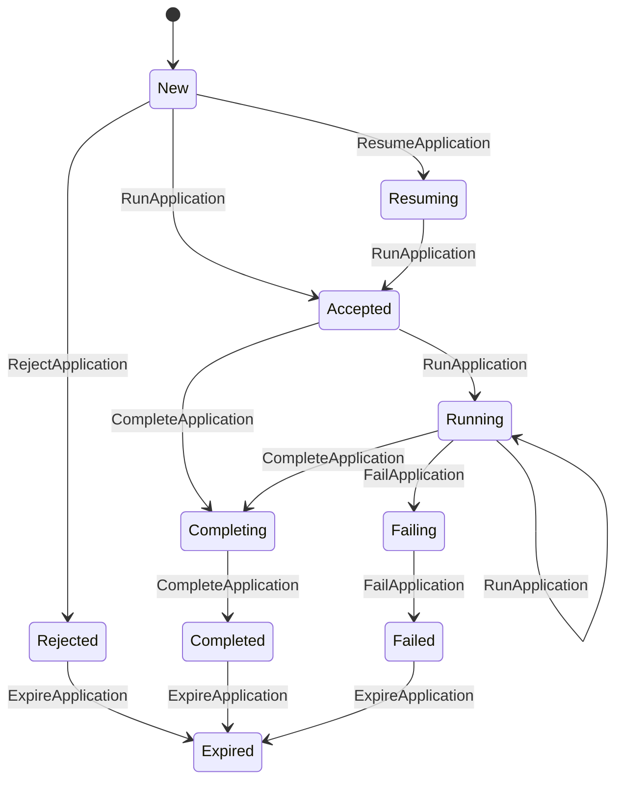
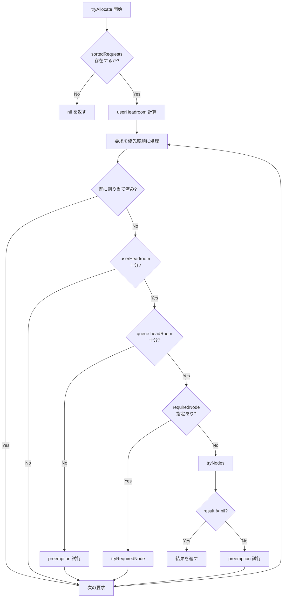

# 第5章 アプリケーションとアロケーションリクエスト

> 本章で読むソース:
>
> - [pkg/scheduler/objects/application.go L83-L130](https://github.com/apache/yunikorn-core/blob/v1.8.0/pkg/scheduler/objects/application.go#L83-L130)
> - [pkg/scheduler/objects/application_state.go L39-L92](https://github.com/apache/yunikorn-core/blob/v1.8.0/pkg/scheduler/objects/application_state.go#L39-L92)
> - [pkg/scheduler/objects/application_state.go L94-L134](https://github.com/apache/yunikorn-core/blob/v1.8.0/pkg/scheduler/objects/application_state.go#L94-L134)
> - [pkg/scheduler/objects/allocation.go L39-L78](https://github.com/apache/yunikorn-core/blob/v1.8.0/pkg/scheduler/objects/allocation.go#L39-L78)
> - [pkg/scheduler/objects/sorted_asks.go L27-L65](https://github.com/apache/yunikorn-core/blob/v1.8.0/pkg/scheduler/objects/sorted_asks.go#L27-L65)
> - [pkg/scheduler/objects/application.go L1029-L1121](https://github.com/apache/yunikorn-core/blob/v1.8.0/pkg/scheduler/objects/application.go#L1029-L1121)

## この章の狙い

アプリケーションのライフサイクルと状態機械を理解する。
アロケーションリクエスト（`Allocation`）のデータ構造と、優先度付きソートによる要求の処理順序を明らかにする。

## 前提

第4章で `Queue.TryAllocate` が `app.tryAllocate` を呼ぶことを確認した。
本章ではアプリケーション側の処理、特に状態遷移とリクエスト管理に焦点を当てる。

## Application 構造体

`Application` はスケジューリング対象のワークロードを表す。

[pkg/scheduler/objects/application.go L83-L130](https://github.com/apache/yunikorn-core/blob/v1.8.0/pkg/scheduler/objects/application.go#L83-L130)

```go
type Application struct {
	ApplicationID string            // application ID
	Partition     string            // partition Name
	tags          map[string]string // application tags used in scheduling

	// Private mutable fields need protection
	queuePath         string
	queue             *Queue                  // queue the application is running in
	pending           *resources.Resource     // pending resources from asks for the app
	reservations      map[string]*reservation // a map of reservations
	requests          map[string]*Allocation  // a map of allocations, pending or satisfied
	sortedRequests    sortedRequests          // list of requests pre-sorted
	user              security.UserGroup      // owner of the application
	allocatedResource *resources.Resource     // total allocated resources
	submissionTime    time.Time               // time application was submitted (based on the first ask)
	// ...
	stateMachine         *fsm.FSM                    // application state machine
	stateTimer           *time.Timer                 // timer for state time
	execTimeout          time.Duration               // execTimeout for the application run
	placeholderTimer     *time.Timer                 // placeholder replace timer
	gangSchedulingStyle  string                      // gang scheduling style can be hard or soft
	// ...
	locking.RWMutex
}
```

アプリケーションはリクエストのマップ（`requests`）とソート済みリスト（`sortedRequests`）を保持する。
`sortedRequests` はスケジューリング時に使用され、`requests` はキーによる高速アクセスに使用される。

## Application の状態機械

アプリケーションは有限状態機械でライフサイクルを管理する。

[pkg/scheduler/objects/application_state.go L64-L75](https://github.com/apache/yunikorn-core/blob/v1.8.0/pkg/scheduler/objects/application_state.go#L64-L75)

```go
const (
	New applicationState = iota
	Accepted
	Running
	Rejected
	Completing
	Completed
	Failing
	Failed
	Expired
	Resuming
)
```

状態遷移は以下のルールで定義される。

[pkg/scheduler/objects/application_state.go L94-L134](https://github.com/apache/yunikorn-core/blob/v1.8.0/pkg/scheduler/objects/application_state.go#L94-L134)

```go
func eventDesc() fsm.Events {
	return fsm.Events{
		{
			Name: RejectApplication.String(),
			Src:  []string{New.String()},
			Dst:  Rejected.String(),
		}, {
			Name: RunApplication.String(),
			Src:  []string{New.String(), Resuming.String()},
			Dst:  Accepted.String(),
		}, {
			Name: RunApplication.String(),
			Src:  []string{Accepted.String(), Running.String(), Completing.String()},
			Dst:  Running.String(),
		}, {
			Name: CompleteApplication.String(),
			Src:  []string{Accepted.String(), Running.String()},
			Dst:  Completing.String(),
		}, {
			Name: CompleteApplication.String(),
			Src:  []string{Completing.String()},
			Dst:  Completed.String(),
		}, {
			Name: FailApplication.String(),
			Src:  []string{New.String(), Accepted.String(), Running.String()},
			Dst:  Failing.String(),
		}, {
			Name: FailApplication.String(),
			Src:  []string{Failing.String()},
			Dst:  Failed.String(),
		}, {
			Name: ResumeApplication.String(),
			Src:  []string{New.String(), Accepted.String()},
			Dst:  Resuming.String(),
		}, {
			Name: ExpireApplication.String(),
			Src:  []string{Completed.String(), Failed.String(), Rejected.String()},
			Dst:  Expired.String(),
		},
	}
}
```

## 状態遷移図



`New` はアプリケーションが提出された直後の状態である。
`Accepted` はキューに配置されスケジューリング可能な状態である。
`Running` は少なくとも1つの割り当てが成功した状態である。
`Completing` は完了処理中の遷移状態であり、30秒後に `Completed` へ自動遷移する。
`Rejected` は配置ルールや ACL のチェックに失敗した状態である。

## Allocation（アロケーションリクエスト）

`Allocation` はリソース要求を表す。スケジューラ内部では「ask」とも呼ばれる。

[pkg/scheduler/objects/allocation.go L39-L78](https://github.com/apache/yunikorn-core/blob/v1.8.0/pkg/scheduler/objects/allocation.go#L39-L78)

```go
type Allocation struct {
	// Read-only fields
	allocationKey     string
	applicationID     string
	taskGroupName     string    // task group this allocation belongs to
	placeholder       bool      // is this a placeholder allocation
	createTime        time.Time // the time this allocation was created (used in reservations)
	priority          int32
	requiredNode      string
	allowPreemptSelf  bool
	allowPreemptOther bool
	originator        bool
	tags              map[string]string
	foreign           bool
	preemptable       bool

	// Mutable fields which need protection
	allocated            bool
	allocatedResource    *resources.Resource
	nodeID               string      // the node this allocation is bound to
	bindTime             time.Time   // the time this allocation was bound to a node
	released             bool        // whether this allocation has been released (for placeholders)
	release              *Allocation // placeholder to be released for this allocation
	preempted            bool        // whether this allocation has been marked for preemption
	// ...
	locking.RWMutex
}
```

`allocationKey` は要求の一意識別子である。
`priority` は要求の優先度であり、ソートに使用される。
`requiredNode` が設定されている場合、特定のノードへの割り当てを試みる。
`placeholder` が true の場合、Gang スケジューリング用の仮割り当てである。

## sortedRequests による優先度付きソート

アプリケーションは要求を優先度順にソートして保持する。

[pkg/scheduler/objects/sorted_asks.go L27-L65](https://github.com/apache/yunikorn-core/blob/v1.8.0/pkg/scheduler/objects/sorted_asks.go#L27-L65)

```go
type sortedRequests []*Allocation

func (s *sortedRequests) insert(ask *Allocation) {
	size := len(*s)
	if size > 0 && ask.LessThan((*s)[size-1]) {
		s.insertAt(size, ask)
		return
	}
	idx := sort.Search(size, func(i int) bool {
		return (*s)[i].LessThan(ask)
	})
	s.insertAt(idx, ask)
}

func (s *sortedRequests) remove(ask *Allocation) {
	for i, a := range *s {
		if a.allocationKey == ask.allocationKey {
			s.removeAt(i)
			return
		}
	}
}
```

`insert` は高速パスとして末尾への追加を試みる。
新しい要求は既存の要求より優先度が低い（`LessThan` が true）場合が多く、この場合に O(1) で挿入できる。
末尾以外の場合は二分探索で挿入位置を特定する。

## Application.tryAllocate の処理

`tryAllocate` はソート済みの要求を順に処理し、ノードへの割り当てを試みる。

[pkg/scheduler/objects/application.go L1029-L1121](https://github.com/apache/yunikorn-core/blob/v1.8.0/pkg/scheduler/objects/application.go#L1029-L1121)

```go
func (sa *Application) tryAllocate(headRoom *resources.Resource, allowPreemption bool,
	preemptionDelay time.Duration, preemptAttemptsRemaining *int,
	nodeIterator func() NodeIterator, fullNodeIterator func() NodeIterator,
	getNodeFn func(string) *Node) *AllocationResult {
	sa.Lock()
	defer sa.Unlock()
	if sa.sortedRequests == nil {
		return nil
	}
	userHeadroom := ugm.GetUserManager().Headroom(sa.queuePath, sa.ApplicationID, sa.user)
	unschedulable := uint64(0)
	for _, request := range sa.sortedRequests {
		backoffThreshold := sa.queue.GetMaxAppUnschedAskBackoff()
		if backoffThreshold > 0 && unschedulable >= backoffThreshold {
			sa.backoffDeadline = time.Now().Add(delay)
			return nil
		}
		if request.IsAllocated() {
			continue
		}
		if sa.canReplace(request) {
			continue
		}
		if !userHeadroom.FitInMaxUndef(request.GetAllocatedResource()) {
			request.LogAllocationFailure(NotEnoughUserQuota, true)
			continue
		}
		if !headRoom.FitInMaxUndef(request.GetAllocatedResource()) {
			if allowPreemption {
				// preemption attempt...
			}
			continue
		}
		requiredNode := request.GetRequiredNode()
		if requiredNode != "" {
			result := sa.tryRequiredNode(request, getNodeFn)
			if result != nil {
				return result
			}
			continue
		}
		iterator := nodeIterator()
		if iterator != nil {
			if result := sa.tryNodes(request, iterator); result != nil {
				return result
			}
			if allowPreemption {
				// preemption attempt...
			}
		}
		unschedulable++
	}
	return nil
}
```

処理の流れは以下の通りである。

1. ユーザーの headroom を確認する
2. 各要求について、キューの headroom を確認する
3. 特定ノードの指定があれば `tryRequiredNode` を呼ぶ
4. そうでなければ `tryNodes` でノードイテレータを使い割り当て先を探す
5. 割り当てができない場合、preemption を試みる

## 要求の処理順序



## AllocationResult の種類

`AllocationResult` は割り当て試行の結果を表す。

```go
type AllocationResultType int

const (
	None AllocationResultType = iota
	Allocated
	AllocatedReserved
	Reserved
	Unreserved
	Replaced
)
```

- **Allocated**: 新規割り当てが成功した
- **AllocatedReserved**: 予約済みの割り当てが確定した
- **Reserved**: ノードが予約された（まだ割り当てられていない）
- **Unreserved**: 予約が解除された
- **Replaced**: プレースホルダーが実割り当てに置換された

## 最適化の工夫

`sortedRequests` の挿入処理は、末尾への追加を高速パスとして最適化している。

実際のワークロードでは、新しい要求は既存の要求より優先度が低い（つまり末尾に追加される）場合が圧倒的に多い。
この場合、挿入は O(1) で完了する。

末尾以外への挿入が必要な場合でも、二分探索により O(log n) で位置を特定できる。
これにより、要求数が多いアプリケーションでも効率的にソート順序を維持できる。

さらに `tryAllocate` では unschedulable な要求が閾値を超えると backoff を発動する。
これにより、割り当て不可能な要求が多いアプリケーションがスケジューリングサイクルを占有するのを防ぐ。

## まとめ

アプリケーションは状態機械でライフサイクルを管理し、`New` から `Accepted` を経て `Running` へ遷移する。
アロケーションリクエストは優先度順にソートされ、末尾挿入の高速パスにより効率的に管理される。
`tryAllocate` はユーザーの headroom、キューの headroom、ノードの空きを順に確認し、必要に応じて preemption を試みる。

## 関連する章

- [第3章 スケジューリングサイクル](03-scheduling-cycle.md): アプリケーションの `tryAllocate` が呼び出される文脈
- [第4章 キュー階層と共有ポリシー](04-queue-hierarchy.md): キューがアプリケーションをソートする仕組み
- [第6章 ノード管理](06-node-management.md): `tryNodes` がノードを走査する仕組み
- [第7章 プレイスメントルール](07-placement-rules.md): アプリケーションがキューに配置される仕組み
