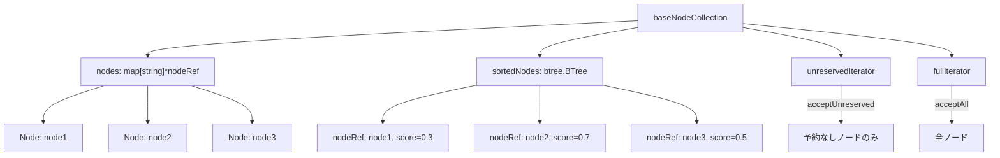

# 第6章 ノード管理

> 本章で読むソース:
>
> - [pkg/scheduler/objects/node.go L41-L93](https://github.com/apache/yunikorn-core/blob/v1.8.0/pkg/scheduler/objects/node.go#L41-L93)
> - [pkg/scheduler/objects/node_collection.go L42-L93](https://github.com/apache/yunikorn-core/blob/v1.8.0/pkg/scheduler/objects/node_collection.go#L42-L93)
> - [pkg/scheduler/objects/node_iterator.go L26-L57](https://github.com/apache/yunikorn-core/blob/v1.8.0/pkg/scheduler/objects/node_iterator.go#L26-L57)
> - [pkg/scheduler/objects/nodesorting.go L30-L87](https://github.com/apache/yunikorn-core/blob/v1.8.0/pkg/scheduler/objects/nodesorting.go#L30-L87)
> - [pkg/scheduler/policies/nodesorting_policy.go L25-L46](https://github.com/apache/yunikorn-core/blob/v1.8.0/pkg/scheduler/policies/nodesorting_policy.go#L25-L46)

## この章の狙い

ノードのデータ構造と、ノードを効率的に走査するためのコレクションとイテレータの仕組みを理解する。
BinPacking と Fair のノードソーティングポリシーが、割り当ての局所性と分散に与える影響を明らかにする。

## 前提

第5章で `Application.tryAllocate` が `tryNodes` を呼び、ノードイテレータを使って割り当て先を探すことを確認した。
本章ではノード側のデータ構造と、イテレータがノードをどのような順序で返すかを追う。

## Node 構造体

`Node` はクラスタ内の計算資源を表す。

[pkg/scheduler/objects/node.go L41-L93](https://github.com/apache/yunikorn-core/blob/v1.8.0/pkg/scheduler/objects/node.go#L41-L93)

```go
type Node struct {
	NodeID    string
	Hostname  string
	Rackname  string
	Partition string
	attributes        map[string]string
	totalResource     *resources.Resource
	occupiedResource  *resources.Resource
	allocatedResource *resources.Resource
	availableResource *resources.Resource
	allocations       map[string]*Allocation
	schedulable       bool
	reservations      map[string]*reservation
	listeners         []NodeListener
	nodeEvents        *schedEvt.NodeEvents
	locking.RWMutex
}
```

ノードは4種類のリソースを管理する。

- **totalResource**: ノードの総容量
- **occupiedResource**: Yunikorn 以外で占有されているリソース
- **allocatedResource**: Yunikorn が割り当て済みのリソース
- **availableResource**: `totalResource - allocatedResource - occupiedResource`

`schedulable` が false の場合、そのノードはスケジューリング対象から除外される。
ドレイン状態のノードはこのフラグが false になる。

## Node の生成

ノードは Shim から送られてきた `NodeInfo` から生成される。

[pkg/scheduler/objects/node.go L65-L93](https://github.com/apache/yunikorn-core/blob/v1.8.0/pkg/scheduler/objects/node.go#L65-L93)

```go
func NewNode(proto *si.NodeInfo) *Node {
	if proto == nil {
		return nil
	}
	sn := &Node{
		NodeID:            proto.NodeID,
		reservations:      make(map[string]*reservation),
		totalResource:     resources.NewResourceFromProto(proto.SchedulableResource),
		allocatedResource: resources.NewResource(),
		occupiedResource:  resources.NewResource(),
		allocations:       make(map[string]*Allocation),
		schedulable:       true,
		listeners:         make([]NodeListener, 0),
	}
	sn.nodeEvents = schedEvt.NewNodeEvents(events.GetEventSystem())
	var err error
	sn.availableResource, err = resources.SubErrorNegative(sn.totalResource, sn.occupiedResource)
	if err != nil {
		log.Log(log.SchedNode).Error("New node created with no available resources",
			zap.Error(err))
	}
	sn.initializeAttribute(proto.Attributes)
	return sn
}
```

生成直後は `allocatedResource` が0であり、`availableResource` は `totalResource` に等しい。
`initializeAttribute` で `Hostname`、`Rackname`、`Partition` を属性から抽出する。

## availableResource の更新

リソースの割り当てや解放があるたびに `availableResource` が再計算される。

[pkg/scheduler/objects/node.go L209-L222](https://github.com/apache/yunikorn-core/blob/v1.8.0/pkg/scheduler/objects/node.go#L209-L222)

```go
func (sn *Node) refreshAvailableResource() {
	sn.availableResource = sn.totalResource.Clone()
	sn.availableResource.SubFrom(sn.allocatedResource)
	sn.availableResource.SubFrom(sn.occupiedResource)
	sn.availableResource.Prune()
	if !resources.StrictlyGreaterThanOrEquals(sn.availableResource, nil) {
		log.Log(log.SchedNode).Warn("Node update triggered over allocated node",
			zap.Stringer("available", sn.availableResource),
			zap.Stringer("total", sn.totalResource),
			zap.Stringer("occupied", sn.occupiedResource),
			zap.Stringer("allocated", sn.allocatedResource))
	}
}
```

`Prune` はゼロ値のリソース種別を削除する。
負の値がある場合は警告ログを出力する。

## NodeCollection の構造

`NodeCollection` はパーティション内のノードを管理する。

[pkg/scheduler/objects/node_collection.go L42-L93](https://github.com/apache/yunikorn-core/blob/v1.8.0/pkg/scheduler/objects/node_collection.go#L42-L93)

```go
type NodeCollection interface {
	AddNode(node *Node) error
	RemoveNode(nodeID string) *Node
	GetNode(nodeID string) *Node
	GetNodeCount() int
	GetNodes() []*Node
	GetNodeIterator() NodeIterator
	GetFullNodeIterator() NodeIterator
	SetNodeSortingPolicy(policy NodeSortingPolicy)
	GetNodeSortingPolicy() NodeSortingPolicy
}

type baseNodeCollection struct {
	Partition string
	nsp         NodeSortingPolicy
	nodes       map[string]*nodeRef
	sortedNodes *btree.BTree
	unreservedIterator *treeIterator
	fullIterator       *treeIterator
	locking.RWMutex
}
```

`baseNodeCollection` は BTree（`btree.BTree`）を使ってノードをスコア順にソートする。
`nodeRef` はノードへの参照とスコアを保持する。

```go
type nodeRef struct {
	node      *Node
	nodeScore float64
}
```

BTree は次数7で生成される。これは5000ノード程度まで実験的にもっとも効率的な値である。

## NodeIterator の仕組み

`NodeIterator` はノードをソート順に走査するためのインターフェースである。

[pkg/scheduler/objects/node_iterator.go L26-L57](https://github.com/apache/yunikorn-core/blob/v1.8.0/pkg/scheduler/objects/node_iterator.go#L26-L57)

```go
type NodeIterator interface {
	ForEachNode(func(*Node) bool)
}

type treeIterator struct {
	accept  func(*Node) bool
	getTree func() *btree.BTree
}

func (ti *treeIterator) ForEachNode(f func(*Node) bool) {
	ti.getTree().Ascend(func(item btree.Item) bool {
		if ref, ok := item.(nodeRef); ok {
			node := ref.node
			if ti.accept(node) {
				return f(node)
			}
		}
		return true
	})
}
```

`treeIterator` は BTree の昇順走査を行う。
`accept` 関数でノードをフィルタリングする。

2種類のイテレータが存在する。

- **unreservedIterator**: 予約のないノードのみを返す（`acceptUnreserved`）
- **fullIterator**: すべてのノードを返す（`acceptAll`）

```go
var acceptUnreserved = func(node *Node) bool {
	return !node.IsReserved()
}

var acceptAll = func(node *Node) bool {
	return true
}
```

## NodeSortingPolicy

ノードのスコアリングは `NodeSortingPolicy` インターフェースで定義される。

[pkg/scheduler/objects/nodesorting.go L30-L87](https://github.com/apache/yunikorn-core/blob/v1.8.0/pkg/scheduler/objects/nodesorting.go#L30-L87)

```go
type NodeSortingPolicy interface {
	PolicyType() policies.SortingPolicy
	ScoreNode(node *Node) float64
	ResourceWeights() map[string]float64
}

type binPackingNodeSortingPolicy struct {
	resourceWeights map[string]float64
}

type fairnessNodeSortingPolicy struct {
	resourceWeights map[string]float64
}

func (p binPackingNodeSortingPolicy) ScoreNode(node *Node) float64 {
	return float64(1) - absResourceUsage(node, &p.resourceWeights)
}

func (p fairnessNodeSortingPolicy) ScoreNode(node *Node) float64 {
	return absResourceUsage(node, &p.resourceWeights)
}
```

- **BinPacking**: 使用率が高いノードを優先する（スコア = 1 - 使用率）
- **Fair**: 使用率が低いノードを優先する（スコア = 使用率）

`absResourceUsage` はリソース種別ごとの使用率に重みを付けて合計する。

```go
func absResourceUsage(node *Node, weights *map[string]float64) float64 {
	totalWeight := float64(0)
	usage := float64(0)
	shares := node.GetResourceUsageShares()
	for k, v := range shares {
		weight, found := (*weights)[k]
		if !found || weight == float64(0) {
			continue
		}
		if math.IsNaN(v) {
			continue
		}
		usage += v * weight
		totalWeight += weight
	}
	if totalWeight == float64(0) {
		return float64(0)
	}
	return usage / totalWeight
}
```

デフォルトの重みは `vcore` と `memory` にそれぞれ 1.0 である。

## ノードコレクションの構造図



## ノード更新時のスコア再計算

ノードのリソース使用量が変化すると、`NodeUpdated` コールバックが呼ばれる。

[pkg/scheduler/objects/node_collection.go L207-L222](https://github.com/apache/yunikorn-core/blob/v1.8.0/pkg/scheduler/objects/node_collection.go#L207-L222)

```go
func (nc *baseNodeCollection) NodeUpdated(node *Node) {
	nc.Lock()
	defer nc.Unlock()
	nref := nc.nodes[node.NodeID]
	if nref == nil {
		return
	}
	updatedScore := nc.scoreNode(node)
	if nref.nodeScore != updatedScore {
		nc.sortedNodes.Delete(*nref)
		nref.nodeScore = nc.scoreNode(node)
		nc.sortedNodes.ReplaceOrInsert(*nref)
	}
}
```

スコアが変化した場合のみ BTree から削除して再挿入する。
これにより、スコアの変化がない場合は BTree の構造が維持される。

## 最適化の工夫

ノードコレクションの最適化は BTree の選択にある。

BTree は平衡二分探索木であり、挿入も削除も検索も O(log n) で完了する。
次数7は5000ノード程度まで実験的にもっとも効率的な値として選択されている。

さらに `treeIterator` はイテレーション開始時に BTree のクローンを生成する。
これにより、イテレーション中にノードの追加や削除があっても安全に走査できる。
クローンは浅いコピーではなく構造全体のコピーであるが、BTree の特性により効率的に生成される。

`NodeUpdated` ではスコアの変化がない場合に BTree の操作をスキップする。
リソース使用量の変化がスコアの丸め誤差の範囲内であれば、不要な再挿入が発生しない。

## まとめ

ノードは `totalResource`、`occupiedResource`、`allocatedResource`、`availableResource` の4種類のリソースを管理する。
`NodeCollection` は BTree を使ってノードをスコア順に保持し、`NodeIterator` で走査する。
BinPacking は使用率の高いノードを優先し、Fair は使用率の低いノードを優先する。
スコアの変化がない場合に BTree の操作をスキップする最適化により、更新コストを抑制している。

## 関連する章

- [第3章 スケジューリングサイクル](03-scheduling-cycle.md): ノードイテレータが取得される文脈
- [第5章 アプリケーションとアロケーションリクエスト](05-application-and-allocation.md): `tryNodes` がイテレータを使う処理
- [第7章 プレイスメントルール](07-placement-rules.md): ノードの属性が配置ルールで参照される場合がある
