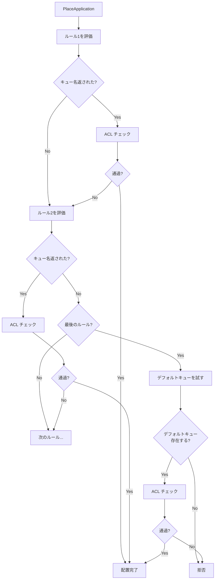

# 第7章 プレイスメントルール

> 本章で読むソース:
>
> - [pkg/scheduler/placement/placement.go L39-L101](https://github.com/apache/yunikorn-core/blob/v1.8.0/pkg/scheduler/placement/placement.go#L39-L101)
> - [pkg/scheduler/placement/placement.go L106-L217](https://github.com/apache/yunikorn-core/blob/v1.8.0/pkg/scheduler/placement/placement.go#L106-L217)
> - [pkg/scheduler/placement/rule.go L35-L56](https://github.com/apache/yunikorn-core/blob/v1.8.0/pkg/scheduler/placement/rule.go#L35-L56)
> - [pkg/scheduler/placement/fixed_rule.go L39-L146](https://github.com/apache/yunikorn-core/blob/v1.8.0/pkg/scheduler/placement/fixed_rule.go#L39-L146)
> - [pkg/scheduler/placement/user_rule.go L36-L124](https://github.com/apache/yunikorn-core/blob/v1.8.0/pkg/scheduler/placement/user_rule.go#L36-L124)
> - [pkg/scheduler/placement/tag_rule.go L39-L150](https://github.com/apache/yunikorn-core/blob/v1.8.0/pkg/scheduler/placement/tag_rule.go#L39-L150)
> - [pkg/scheduler/placement/provided_rule.go L39-L145](https://github.com/apache/yunikorn-core/blob/v1.8.0/pkg/scheduler/placement/provided_rule.go#L39-L145)
> - [pkg/scheduler/placement/recovery_rule.go L35-L68](https://github.com/apache/yunikorn-core/blob/v1.8.0/pkg/scheduler/placement/recovery_rule.go#L35-L68)

## この章の狙い

アプリケーションがどのキューに配置されるかを決定するプレイスメントルールの仕組みを理解する。
ルールチェーンの評価順序、各ルールの動作、フォールバックの仕組みを明らかにする。

## 前提

第4章と第5章で、アプリケーションがキューに所属しスケジューリングされることを確認した。
本章では、アプリケーションがどのようにキューに配置されるか、その意思決定の仕組みを追う。

## AppPlacementManager

`AppPlacementManager` はルールチェーンを管理する。

[pkg/scheduler/placement/placement.go L39-L54](https://github.com/apache/yunikorn-core/blob/v1.8.0/pkg/scheduler/placement/placement.go#L39-L54)

```go
type AppPlacementManager struct {
	rules   []rule
	queueFn func(string) *objects.Queue

	locking.RWMutex
}

func NewPlacementManager(rules []configs.PlacementRule, queueFunc func(string) *objects.Queue, silence bool) *AppPlacementManager {
	m := &AppPlacementManager{
		queueFn: queueFunc,
	}
	if err := m.initialise(rules, silence); err != nil {
		log.Log(log.Config).Error("Placement manager created without rules: not active", zap.Error(err))
	}
	return m
}
```

`rules` は設定から構築されたルールのリストである。
`queueFn` はキュー名からキューオブジェクトを取得する関数で、`PartitionContext.GetQueue` が渡される。

## rule インターフェース

すべてのプレイスメントルールは `rule` インターフェースを実装する。

[pkg/scheduler/placement/rule.go L35-L56](https://github.com/apache/yunikorn-core/blob/v1.8.0/pkg/scheduler/placement/rule.go#L35-L56)

```go
type rule interface {
	initialise(conf configs.PlacementRule) error
	placeApplication(app *objects.Application,
		queueFn func(string) *objects.Queue) (string, error)
	getName() string
	getParent() rule
	ruleDAO() *dao.RuleDAO
}
```

`placeApplication` はアプリケーションを受け取り、配置先のキュー名を返す。
キュー名が見つからない場合は空文字列を返す。

`basicRule` は全ルールが共通で持つフィールドを提供する。

```go
type basicRule struct {
	create bool
	parent rule
	filter Filter
}
```

- **create**: キューが存在しない場合に動的作成を許可するか
- **parent**: 親ルール（キュー名のプレフィックスを決定する）
- **filter**: ユーザーによるフィルタリング

## PlaceApplication の処理

`PlaceApplication` はルールを順に評価し、最初にマッチしたルールでキューを決定する。

[pkg/scheduler/placement/placement.go L106-L217](https://github.com/apache/yunikorn-core/blob/v1.8.0/pkg/scheduler/placement/placement.go#L106-L217)

```go
func (m *AppPlacementManager) PlaceApplication(app *objects.Application) error {
	m.RLock()
	defer m.RUnlock()
	var queueName string
	var err error
	var remainingRules = len(m.rules)
	for _, checkRule := range m.rules {
		remainingRules--
		queueName, err = checkRule.placeApplication(app, m.queueFn)
		if err != nil {
			app.SetQueuePath("")
			return err
		}
		if remainingRules == 0 && queueName == "" {
			queue := m.queueFn(common.DefaultPlacementQueue)
			if queue != nil {
				queueName = common.DefaultPlacementQueue
			}
		}
		if queueName == "" {
			continue
		}
		if queueName == common.RecoveryQueueFull && app.IsCreateForced() {
			break
		}
		queue := m.queueFn(queueName)
		if queue == nil {
			current := queueName
			for queue == nil {
				current = current[0:strings.LastIndex(current, configs.DOT)]
				queue = m.queueFn(current)
			}
			if !queue.CheckSubmitAccess(app.GetUser()) {
				queueName = ""
				continue
			}
		} else {
			if !queue.IsLeafQueue() {
				queueName = ""
				continue
			}
			if !queue.CheckSubmitAccess(app.GetUser()) {
				queueName = ""
				continue
			}
			if queue.IsDraining() {
				queueName = ""
				continue
			}
		}
		break
	}
	if queueName == "" {
		app.SetQueuePath("")
		return ErrorRejected
	}
	app.SetQueuePath(queueName)
	return nil
}
```

処理の流れは以下の通りである。

1. 各ルールを順に実行する
2. ルールがキュー名を返さない場合、次のルールを試す
3. 最後のルールでもマッチしない場合、デフォルトキュー（`root.default`）を試す
4. キュー名が返されたら、ACL とリーフキューであることを確認する
5. チェックに失敗した場合、次のルールを試す
6. すべてのルールが失敗した場合、アプリケーションを拒否する

## ビルトルールの追加

`buildRules` は設定からルールリストを構築し、最後に `recoveryRule` を追加する。

[pkg/scheduler/placement/placement.go L223-L247](https://github.com/apache/yunikorn-core/blob/v1.8.0/pkg/scheduler/placement/placement.go#L223-L247)

```go
func buildRules(rules []configs.PlacementRule, silence bool) ([]rule, error) {
	if len(rules) == 0 {
		rules = []configs.PlacementRule{{
			Name:   types.Provided,
			Create: false,
		}}
	}
	var newRules []rule
	for _, conf := range rules {
		buildRule, err := newRule(conf)
		if err != nil {
			return nil, err
		}
		newRules = append(newRules, buildRule)
	}
	newRules = append(newRules, &recoveryRule{})
	return newRules, nil
}
```

設定にルールがない場合、`provided` ルールがデフォルトで使用される。
`recoveryRule` は常に最後に追加され、強制提出されたアプリケーションを回復キューに配置する。

## 各ルールの動作

### fixedRule

設定で指定された固定のキュー名に配置する。

[pkg/scheduler/placement/fixed_rule.go L39-L146](https://github.com/apache/yunikorn-core/blob/v1.8.0/pkg/scheduler/placement/fixed_rule.go#L39-L146)

```go
type fixedRule struct {
	basicRule
	queue     string
	qualified bool
}
```

キュー名が `root.` で始まる場合は完全修飾名として扱い、親ルールをスキップする。
それ以外の場合は親ルールを実行してプレフィックスを決定する。

### userRule

提出ユーザーの名前をキュー名として使用する。

[pkg/scheduler/placement/user_rule.go L36-L124](https://github.com/apache/yunikorn-core/blob/v1.8.0/pkg/scheduler/placement/user_rule.go#L36-L124)

```go
type userRule struct {
	basicRule
}
```

ユーザー名のドットは `_dot_` に置換され、親ルールと結合して完全修飾名が生成される。
例えばユーザー名が `john.doe` で親ルールがない場合、`root.john_dot_doe` に配置される。

### tagRule

アプリケーションのタグの値をキュー名として使用する。

[pkg/scheduler/placement/tag_rule.go L39-L150](https://github.com/apache/yunikorn-core/blob/v1.8.0/pkg/scheduler/placement/tag_rule.go#L39-L150)

```go
type tagRule struct {
	basicRule
	tagName string
}
```

指定されたタグが存在しない場合はマッチしない。
タグの値が `root.` で始まる場合は完全修飾名として扱う。

Kubernetes の namespace をタグとして使用し、namespace ごとにキューを自動作成する用途が多い。

### providedRule

アプリケーションが提出時に指定したキュー名を使用する。

[pkg/scheduler/placement/provided_rule.go L39-L145](https://github.com/apache/yunikorn-core/blob/v1.8.0/pkg/scheduler/placement/provided_rule.go#L39-L145)

```go
type providedRule struct {
	basicRule
}
```

キュー名が指定されていない場合はマッチしない。
設定にルールがない場合のデフォルトルールである。

### recoveryRule

強制提出されたアプリケーションを回復キューに配置する。

[pkg/scheduler/placement/recovery_rule.go L35-L68](https://github.com/apache/yunikorn-core/blob/v1.8.0/pkg/scheduler/placement/recovery_rule.go#L35-L68)

```go
type recoveryRule struct {
	basicRule
}

func (rr *recoveryRule) placeApplication(app *objects.Application,
	_ func(string) *objects.Queue) (string, error) {
	if !app.IsCreateForced() {
		return "", nil
	}
	queueName := common.RecoveryQueueFull
	return queueName, nil
}
```

このルールは設定で指定できず、常にルールチェーンの最後に追加される。
`IsCreateForced` が true のアプリケーションのみをマッチさせる。

## ルールチェーンの流れ



## ルールの評価順序

ルールの評価順序は設定で指定された順である。

典型的な設定例:

1. **tagRule**（namespace タグでキューを決定）
2. **userRule**（ユーザー名でキューを決定）
3. **providedRule**（アプリケーション指定のキューを使用）
4. **recoveryRule**（暗黙的に追加、強制提出を保護）

評価は先頭から順に行われ、最初にマッチしたルールが使用される。
マッチの判定は以下の条件で失敗する。

- ルールが空文字列を返した（タグがない、ユーザー名が無効、など）
- フィルターでユーザーが除外された
- ACL チェックに失敗した
- キューがリーフキューではない
- キューがドレイン状態

## 親ルールの仕組み

ルールは親ルールを持つことができる。
親ルールはキュー名のプレフィックスを決定するために使用される。

例えば `fixedRule` でキュー名が `production`（完全修飾でない）の場合:

1. 親ルール（例えば `userRule`）を実行して `root.john` を得る
2. 結果を結合して `root.john.production` を生成する

親ルールがキュー名を返さない場合、`root` がプレフィックスとして使用される。

## 最適化の工夫

プレイスメントルールの最適化は、早期終了の連鎖にある。

`PlaceApplication` はルールがキュー名を返すと即座に評価を終了する。
マッチしたルールの ACL チェックに失敗した場合のみ、次のルールに進む。

さらに `PlaceApplication` はキューの存在確認時に、存在しないキューの場合は親キューを辿って ACL を確認する。
これにより、動的に作成されるキューでも親キューの ACL でアクセス制御できる。

`recoveryRule` は常に最後に配置されるが、`IsCreateForced` が false の場合は即座に空文字列を返す。
これにより、通常のアプリケーションでは recovery ルールの評価コストがほぼゼロである。

## まとめ

プレイスメントルールはアプリケーションをキューに配置する仕組みである。
`fixed`、`user`、`tag`、`provided` の4種類のルールと、暗黙的に追加される `recovery` ルールが存在する。
ルールは設定された順に評価され、最初にマッチしたルールで配置先が決定する。
マッチしない場合は次のルールにフォールバックし、すべて失敗した場合はデフォルトキューが試される。
早期終了と親ルールの仕組みにより、柔軟かつ効率的なキュー配置が実現されている。

## 関連する章

- [第4章 キュー階層と共有ポリシー](04-queue-hierarchy.md): アプリケーションが配置された後のキューの動作
- [第5章 アプリケーションとアロケーションリクエスト](05-application-and-allocation.md): アプリケーションがキューに追加される処理
