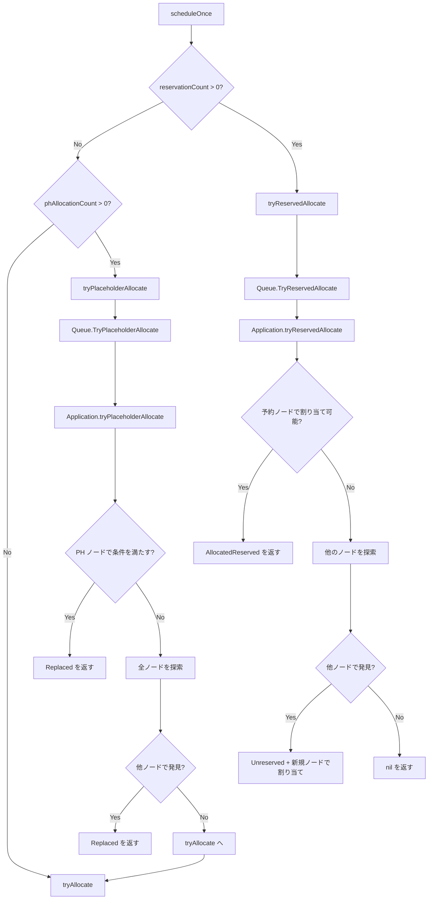

# 第8章 リザベーションとギャングスケジューリング

> 本章で読むソース
>
> - [pkg/scheduler/objects/reservation.go L27-L80](https://github.com/apache/yunikorn-core/blob/v1.8.0/pkg/scheduler/objects/reservation.go#L27-L80)
> - [pkg/scheduler/context.go L133-L157](https://github.com/apache/yunikorn-core/blob/v1.8.0/pkg/scheduler/context.go#L133-L157)
> - [pkg/scheduler/partition.go L829-L868](https://github.com/apache/yunikorn-core/blob/v1.8.0/pkg/scheduler/partition.go#L829-L868)
> - [pkg/scheduler/objects/queue.go L1654-L1776](https://github.com/apache/yunikorn-core/blob/v1.8.0/pkg/scheduler/objects/queue.go#L1654-L1776)
> - [pkg/scheduler/objects/application.go L861-L986](https://github.com/apache/yunikorn-core/blob/v1.8.0/pkg/scheduler/objects/application.go#L861-L986)
> - [pkg/scheduler/objects/application.go L1208-L1471](https://github.com/apache/yunikorn-core/blob/v1.8.0/pkg/scheduler/objects/application.go#L1208-L1471)

## この章の狙い

YuniKorn core はノードにリソースを事前に確保する「リザベーション」と、タスクグループの全メンバをまとめて確保する「ギャングスケジューリング」を提供する。本章では `reservation` 構造体、`tryReservedAllocate`、`tryPlaceholderAllocate` の3つの経路を読み、スケジューリングサイクル内でこれらがどのように優先されるかを明らかにする。

## 前提

第3章「スケジューリングサイクル」で `ClusterContext` の `scheduleOnce` が3段階の割り当てを試すことを見た。本章ではその3段階の詳細に入る。第5章「アプリケーションとアロケーションリクエスト」の `Allocation`、第6章「ノード管理」の `Node` を前提とする。

## スケジューリングサイクル内の3段階

`ClusterContext` の `scheduleOnce` は各パーティションに対し、以下の順序で割り当てを試みる。

[pkg/scheduler/context.go L133-L143](https://github.com/apache/yunikorn-core/blob/v1.8.0/pkg/scheduler/context.go#L133-L143)

```go
// try reservations first
result := psc.tryReservedAllocate()
if result == nil {
    // placeholder replacement second
    result = psc.tryPlaceholderAllocate()
    // nothing reserved that can be allocated try normal allocate
    if result == nil {
        result = psc.tryAllocate()
    }
}
```

リザベーションの解決が最も優先される。次にプレースホルダの置換を試み、最後に通常のアロケーションを処理する。この順序は、既に確保したノードのリソースを無駄にしないための設計である。

## reservation 構造体

`reservation` はノードとアプリケーションの間に作られる紐付けである。

[pkg/scheduler/objects/reservation.go L27-L36](https://github.com/apache/yunikorn-core/blob/v1.8.0/pkg/scheduler/objects/reservation.go#L27-L36)

```go
type reservation struct {
    appID    string
    nodeID   string
    allocKey string
    app   *Application
    node  *Node
    alloc *Allocation
}
```

`appID` と `nodeID` のどちらか一方だけが設定される。アプリケーション側から引いたキーは `nodeID` を持ち、ノード側から引いたキーは `appID` を持つ。この二重キーにより、アプリケーションの `reservations` マップからもノードの予約リストからも同じ `reservation` にアクセスできる。

`newReservation` は `appBased` フラグでどちらの方向のキーかを切り替える。

[pkg/scheduler/objects/reservation.go L41-L61](https://github.com/apache/yunikorn-core/blob/v1.8.0/pkg/scheduler/objects/reservation.go#L41-L61)

```go
func newReservation(node *Node, app *Application, alloc *Allocation, appBased bool) *reservation {
    // ... (nil checks)
    res := &reservation{
        allocKey: alloc.GetAllocationKey(),
        alloc:    alloc,
        app:      app,
        node:     node,
    }
    if appBased {
        res.nodeID = node.NodeID
    } else {
        res.appID = app.ApplicationID
    }
    return res
}
```

`reservation` オブジェクトは生成後にミューテーションされない。ロック不要で参照できる不変の構造体として扱われる。

## Reservation の作成と解消

`Application.Reserve` はノードとアプリケーションの両方に予約を登録する。

[pkg/scheduler/objects/application.go L861-L903](https://github.com/apache/yunikorn-core/blob/v1.8.0/pkg/scheduler/objects/application.go#L861-L903)

```go
func (sa *Application) Reserve(node *Node, ask *Allocation) error {
    // ...
    sa.Lock()
    defer sa.Unlock()
    return sa.reserveInternal(node, ask)
}

func (sa *Application) reserveInternal(node *Node, ask *Allocation) error {
    // ... (alloc existence check)
    nodeReservation := newReservation(node, sa, ask, true)
    // the alloc should not have reserved a node yet
    if err := sa.canAllocationReserve(ask); err != nil {
        return err
    }
    // check if we can reserve the node before reserving on the app
    if err := node.Reserve(sa, ask); err != nil {
        return err
    }
    sa.reservations[allocKey] = nodeReservation
    return nil
}
```

`canAllocationReserve` は3つの条件を検査する。アロケーションがすでに割り当て済みでないこと、同じキーの予約がすでに存在しないことである。1つのアロケーションは1つのノードだけを予約できる。

ノードの `Reserve` が先に成功してからアプリケーション側のマップに追加する。ノード側で失敗した場合にはアプリケーション側にゴミが残らない。

`UnReserve` は逆順に解除する。ノードの `unReserve` を先に呼び、成功してからアプリケーションの `reservations` マップから削除する。

[pkg/scheduler/objects/application.go L937-L967](https://github.com/apache/yunikorn-core/blob/v1.8.0/pkg/scheduler/objects/application.go#L937-L967)

```go
func (sa *Application) unReserveInternal(reserve *reservation) int {
    if reserve == nil {
        return 0
    }
    num := reserve.node.unReserve(reserve.alloc)
    if _, found := sa.reservations[reserve.allocKey]; found {
        if num == 0 {
            log.Log(log.SchedApplication).Info("reservation not found while removing from node, app has reservation",
                // ...
            )
        }
        delete(sa.reservations, reserve.allocKey)
        return 1
    }
    return 0
}
```

## tryReservedAllocate の処理フロー

`PartitionContext.tryReservedAllocate` はパーティション全体のリザベーションを処理する入口である。

[pkg/scheduler/partition.go L831-L845](https://github.com/apache/yunikorn-core/blob/v1.8.0/pkg/scheduler/partition.go#L831-L845)

```go
func (pc *PartitionContext) tryReservedAllocate() *objects.AllocationResult {
    if pc.getReservationCount() == 0 {
        return nil
    }
    if !resources.StrictlyGreaterThanZero(pc.root.GetPendingResource()) {
        return nil
    }
    result := pc.root.TryReservedAllocate(pc.GetNodeIterator)
    if result != nil {
        return pc.allocate(result)
    }
    return nil
}
```

予約数がゼロなら即座に抜ける。ペンディングリソースがゼロの場合も同様に早期リターンする。実際の探索は `Queue.TryReservedAllocate` が担う。

`Queue.TryReservedAllocate` はキュー階層を深さ優先で辿る。リーフキューでは予約を持つアプリケーションを列挙し、それぞれについて `Application.tryReservedAllocate` を呼ぶ。

[pkg/scheduler/objects/queue.go L1725-L1776](https://github.com/apache/yunikorn-core/blob/v1.8.0/pkg/scheduler/objects/queue.go#L1725-L1776)

```go
func (sq *Queue) TryReservedAllocate(iterator func() NodeIterator) *AllocationResult {
    if sq.IsLeafQueue() {
        reservedCopy := sq.GetReservedApps()
        if len(reservedCopy) != 0 {
            headRoom := sq.getHeadRoom()
            for appID, numRes := range reservedCopy {
                // ... (app existence check)
                result := app.tryReservedAllocate(headRoom, iterator)
                if result != nil {
                    // ...
                    return result
                }
            }
        }
    } else {
        for _, child := range sq.sortQueues() {
            result := child.TryReservedAllocate(iterator)
            if result != nil {
                return result
            }
        }
    }
    return nil
}
```

`Application.tryReservedAllocate` はまず予約されたノードに対して直接割り当てを試みる。

[pkg/scheduler/objects/application.go L1401-L1471](https://github.com/apache/yunikorn-core/blob/v1.8.0/pkg/scheduler/objects/application.go#L1401-L1471)

```go
func (sa *Application) tryReservedAllocate(headRoom *resources.Resource,
    nodeIterator func() NodeIterator) *AllocationResult {
    sa.Lock()
    defer sa.Unlock()
    userHeadroom := ugm.GetUserManager().Headroom(sa.queuePath, sa.ApplicationID, sa.user)

    for _, reserve := range sa.reservations {
        ask := sa.requests[reserve.allocKey]
        if ask == nil || ask.IsAllocated() {
            // ... (unreserve stale reservation)
            return newUnreservedAllocationResult(reserve.nodeID, unreserveAsk)
        }
        if !sa.checkHeadRooms(ask, userHeadroom, headRoom) {
            continue
        }
        // try the reserved node
        result, _ := sa.tryNode(reserve.node, ask)
        if result != nil {
            result.ResultType = AllocatedReserved
            return result
        }
    }
    // try this on all other nodes
    for _, reserve := range sa.reservations {
        alloc := reserve.alloc
        if alloc.GetRequiredNode() != "" {
            continue
        }
        iterator := nodeIterator()
        if iterator != nil {
            if !sa.checkHeadRooms(alloc, userHeadroom, headRoom) {
                continue
            }
            result := sa.tryNodesNoReserve(alloc, iterator, reserve.nodeID)
            if result != nil {
                return result
            }
        }
    }
    return nil
}
```

最初のループで予約されたノードへの割り当てを試みる。ヘッドルームチェックに失敗した場合はスキップする。ノードが必須のアロケーション（`requiredNode` あり）に対してリソースが不足していれば、`RequiredNodePreemptor` を起動してプリエンプションを試みる。

2番目のループでは、予約されたノード以外で割り当て可能なノードを探す。`tryNodesNoReserve` は予約済みのノードを除外して全ノードを走査する。他のノードで見つかった場合、結果には元の予約ノードの情報も含まれ、古い予約の解除と新しいノードでの割り当てが同時に行われる。

## Placeholder とギャングスケジューリング

ギャングスケジューリングはタスクグループという仕組みで実現される。タスクグループの全メンバが同時に確保されることを保証するため、YuniKorn は「プレースホルダ」という仮のアロケーションを先にノードに確保する。

`tryPlaceholderAllocate` はプレースホルダを実際のアロケーションに置き換える処理である。

[pkg/scheduler/partition.go L849-L868](https://github.com/apache/yunikorn-core/blob/v1.8.0/pkg/scheduler/partition.go#L849-L868)

```go
func (pc *PartitionContext) tryPlaceholderAllocate() *objects.AllocationResult {
    if pc.getPhAllocationCount() == 0 {
        return nil
    }
    if !resources.StrictlyGreaterThanZero(pc.root.GetPendingResource()) {
        return nil
    }
    result := pc.root.TryPlaceholderAllocate(pc.GetNodeIterator, pc.GetNode)
    if result != nil {
        log.Log(log.SchedPartition).Info("scheduler replace placeholder processed",
            zap.String("appID", result.Request.GetApplicationID()),
            zap.String("allocationKey", result.Request.GetAllocationKey()),
            zap.String("placeholder released allocationKey",
                result.Request.GetRelease().GetAllocationKey()))
        return result
    }
    return nil
}
```

`Queue.TryPlaceholderAllocate` も深さ優先でキュー階層を辿る。

[pkg/scheduler/objects/queue.go L1654-L1678](https://github.com/apache/yunikorn-core/blob/v1.8.0/pkg/scheduler/objects/queue.go#L1654-L1678)

```go
func (sq *Queue) TryPlaceholderAllocate(iterator func() NodeIterator,
    getnode func(string) *Node) *AllocationResult {
    if sq.IsLeafQueue() {
        for _, app := range sq.sortApplications(true) {
            result := app.tryPlaceholderAllocate(iterator, getnode)
            if result != nil {
                return result
            }
        }
    } else {
        for _, child := range sq.sortQueues() {
            result := child.TryPlaceholderAllocate(iterator, getnode)
            if result != nil {
                return result
            }
        }
    }
    return nil
}
```

`Application.tryPlaceholderAllocate` はプレースホルダと実際のリクエストの対応付けを行う。

[pkg/scheduler/objects/application.go L1208-L1301](https://github.com/apache/yunikorn-core/blob/v1.8.0/pkg/scheduler/objects/application.go#L1208-L1301)

```go
func (sa *Application) tryPlaceholderAllocate(nodeIterator func() NodeIterator,
    getNodeFn func(string) *Node) *AllocationResult {
    sa.Lock()
    defer sa.Unlock()
    if resources.IsZero(sa.allocatedPlaceholder) || sa.sortedRequests == nil {
        return nil
    }
    var phFit *Allocation
    var reqFit *Allocation
    for _, request := range sa.sortedRequests {
        if request.IsPlaceholder() || request.GetTaskGroup() == "" || request.IsAllocated() {
            continue
        }
        phAllocs := sa.getPlaceholderAllocations()
        for _, ph := range phAllocs {
            if ph.IsReleased() || ph.IsPreempted() ||
                request.GetTaskGroup() != ph.GetTaskGroup() {
                continue
            }
            delta := resources.Sub(ph.GetAllocatedResource(),
                request.GetAllocatedResource())
            if delta.HasNegativeValue() {
                // real allocation is larger than placeholder: release it
                // ...
                continue
            }
            if phFit == nil && reqFit == nil {
                phFit = ph
                reqFit = request
            }
            node := getNodeFn(ph.GetNodeID())
            if node != nil && node.preReserveConditions(request) == nil {
                _, err := sa.allocateAsk(request)
                // ...
                request.SetRelease(ph)
                ph.SetRelease(request)
                err = ph.SetReleased(true)
                // ...
                request.SetNodeID(node.NodeID)
                return newReplacedAllocationResult(node.NodeID, request)
            }
        }
    }
    // ... (try other nodes with first fit)
}
```

処理の流れは次のとおりである。

1. プレースホルダが確保済みでなければ即座に抜ける。
2. 各リクエストについて、同じタスクグループに属するプレースホルダを探す。
3. プレースホルダのリソースがリクエストより小さければ、プレースホルダを解放して次の候補を試す。
4. リソースが十分であれば、プレースホルダが確保されているノードで条件チェックを行う。
5. 条件を満たせばリクエストを割り当て、プレースホルダへの参照を `SetRelease` で双方向にリンクする。
6. プレースホルダを `SetReleased` で解放済みにマークする。

すべてのプレースホルダのノードで条件を満たせなければ、最初の適合ペア（`phFit` と `reqFit`）を使って全ノードを探索する。

## リザベーションフローの全体像



スケジューリングサイクルは常にリザベーションの解決を最初に試みる。これにより、一度確保したノードのリソースが次のサイクルで無駄になることを防ぐ。

## Queue での予約追跡

`Queue` は `reservedApps` マップで予約を持つアプリケーションを追跡する。

[pkg/scheduler/objects/queue.go L1794-L1816](https://github.com/apache/yunikorn-core/blob/v1.8.0/pkg/scheduler/objects/queue.go#L1794-L1816)

```go
func (sq *Queue) Reserve(appID string) {
    sq.Lock()
    defer sq.Unlock()
    sq.reservedApps[appID]++
}

func (sq *Queue) UnReserve(appID string, releases int) {
    sq.Lock()
    defer sq.Unlock()
    if num, ok := sq.reservedApps[appID]; ok {
        if num <= releases {
            delete(sq.reservedApps, appID)
        } else {
            sq.reservedApps[appID] -= releases
        }
    }
}
```

`Reserve` はカウンターをインクリメントし、`UnReserve` はデクリメントする。ゼロ以下になればマップから削除する。このカウンターにより `TryReservedAllocate` は予約を持たないアプリケーションを走査せずに済む。

## 最適化: 早期リターンによる探索の切り捨て

`tryReservedAllocate` と `tryPlaceholderAllocate` の双方で、処理対象が存在しなければ即座に `nil` を返す早期リターンが実装されている。`PartitionContext.tryReservedAllocate` は `getReservationCount() == 0` を最初に検査し、`tryPlaceholderAllocate` は `getPhAllocationCount() == 0` を検査する。

これらのカウンターは `PartitionContext` レベルで管理される `int` フィールドであり、`PartitionContext` のロックで保護されている。キュー階層を辿る前に処理不要を判定できる。大規模なクラスターではキュー階層の走査が最もコストがかかるため、この早期リターンがスケジューリングサイクルのレイテンシを削減する。

## まとめ

リザベーションはノードとアプリケーションの間に張られる不変の紐付けである。スケジューリングサイクルはリザベーション、プレースホルダ置換、通常割り当ての3段階を優先順に試みる。`tryReservedAllocate` は予約されたノードを優先的に試し、失敗した場合に限り他のノードを探索する。プレースホルダ置換はタスクグループの実メンバをプレースホルダのノードに直接配置し、双方向の `SetRelease` リンクで置換関係を記録する。

## 関連する章

- 第3章「スケジューリングサイクル」: 3段階の割り当ての呼び出し元
- 第5章「アプリケーションとアロケーションリクエスト」: `Allocation` と `sortedRequests` の構造
- 第6章「ノード管理」: `Node.Reserve` とノードの状態遷移
- 第9章「プリエンプション」: `RequiredNodePreemptor` によるノード必須割り当てのプリエンプション
