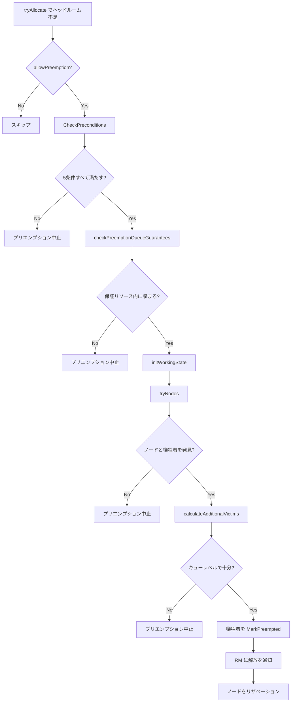

# 第9章 プリエンプション

> 本章で読むソース
>
> - [pkg/scheduler/objects/preemption.go L36-L88](https://github.com/apache/yunikorn-core/blob/v1.8.0/pkg/scheduler/objects/preemption.go#L36-L88)
> - [pkg/scheduler/objects/preemption.go L92-L240](https://github.com/apache/yunikorn-core/blob/v1.8.0/pkg/scheduler/objects/preemption.go#L92-L240)
> - [pkg/scheduler/objects/preemption.go L247-L379](https://github.com/apache/yunikorn-core/blob/v1.8.0/pkg/scheduler/objects/preemption.go#L247-L379)
> - [pkg/scheduler/objects/preemption.go L592-L718](https://github.com/apache/yunikorn-core/blob/v1.8.0/pkg/scheduler/objects/preemption.go#L592-L718)
> - [pkg/scheduler/objects/quota_preemptor.go L31-L314](https://github.com/apache/yunikorn-core/blob/v1.8.0/pkg/scheduler/objects/quota_preemptor.go#L31-L314)
> - [pkg/scheduler/objects/required_node_preemptor.go L32-L185](https://github.com/apache/yunikorn-core/blob/v1.8.0/pkg/scheduler/objects/required_node_preemptor.go#L32-L185)
> - [pkg/scheduler/policies/preemption_policy.go L26-L49](https://github.com/apache/yunikorn-core/blob/v1.8.0/pkg/scheduler/policies/preemption_policy.go#L26-L49)

## この章の狙い

YuniKorn core はキューの保証リソースが不足したときに既存のアロケーションを強制終了させるプリエンプション機構を持つ。本章では3種類のプリエンプション経路（キュー保証プリエンプション、クォータ変更プリエンプション、必須ノードプリエンプション）を読み、犠牲者の選定基準と意思決定の流れを明らかにする。

## 前提

第4章「キュー階層と共有ポリシー」の `GuaranteedResource` と `MaxResource` を前提とする。第8章「リザベーションとギャングスケジューリング」の `Reservation` も参照する。

## プリエンプションの契機

プリエンプションは `Application.tryAllocate` の中で、キューのヘッドルームがリクエストのリソースを満たさないときにトリガされる。

[pkg/scheduler/objects/application.go L1068-L1083](https://github.com/apache/yunikorn-core/blob/v1.8.0/pkg/scheduler/objects/application.go#L1068-L1083)

```go
if !headRoom.FitInMaxUndef(request.GetAllocatedResource()) {
    if allowPreemption {
        fullIterator := fullNodeIterator()
        if fullIterator != nil {
            if result, ok := sa.tryPreemption(headRoom, preemptionDelay,
                preemptAttemptsRemaining, request, fullIterator, false); ok {
                return result
            }
            request.LogAllocationFailure(common.PreemptionDoesNotHelp, true)
        }
    }
    request.LogAllocationFailure(NotEnoughQueueQuota, true)
    request.setHeadroomCheckFailed(headRoom, sa.queuePath)
    continue
}
```

`allowPreemption` フラグはパーティションの設定で制御される。ヘッドルームが足りなければ `tryPreemption` を呼び、プリエンプションが成功すればその結果を返す。

`tryPreemption` は `Preemptor` を生成して前提条件の検査とプリエンプションの実行を委ねる。

[pkg/scheduler/objects/application.go L1473-L1497](https://github.com/apache/yunikorn-core/blob/v1.8.0/pkg/scheduler/objects/application.go#L1473-L1497)

```go
func (sa *Application) tryPreemption(headRoom *resources.Resource,
    preemptionDelay time.Duration, preemptionAttemptsRemaining *int,
    ask *Allocation, iterator NodeIterator, nodesTried bool) (*AllocationResult, bool) {
    if *preemptionAttemptsRemaining == 0 {
        ask.LogAllocationFailure(common.PreemptionMaxAttemptsExhausted, true)
        return nil, false
    }
    preemptor := NewPreemptor(sa, headRoom, preemptionDelay, ask, iterator, nodesTried)
    if !preemptor.CheckPreconditions() {
        ask.LogAllocationFailure(common.PreemptionPreconditionsFailed, true)
        return nil, false
    }
    *preemptionAttemptsRemaining--
    // ...
    return preemptor.TryPreemption()
}
```

キューごとに1サイクルあたりの最大プリエンプション回数（`maxPreemptionsPerQueue`、デフォルト10）が制限されている。

## Preemptor 構造体

`Preemptor` は1つのアロケーションリクエストに対するプリエンプションの意思決定をカプセル化する。

[pkg/scheduler/objects/preemption.go L46-L61](https://github.com/apache/yunikorn-core/blob/v1.8.0/pkg/scheduler/objects/preemption.go#L46-L61)

```go
// Preemptor encapsulates the functionality required for preemption victim selection
type Preemptor struct {
    application     *Application        // application containing ask
    queue           *Queue              // queue to preempt for
    queuePath       string              // path of queue to preempt for
    headRoom        *resources.Resource // current queue headroom
    preemptionDelay time.Duration       // preemption delay
    ask             *Allocation         // ask to be preempted for
    iterator        NodeIterator        // iterator to enumerate all nodes
    nodesTried      bool                // flag indicating that scheduling has already been tried on all nodes

    // lazily-populated work structures
    allocationsByQueue map[string]*QueuePreemptionSnapshot // map of queue snapshots by queue path
    queueByAlloc       map[string]*QueuePreemptionSnapshot // map of queue snapshots by allocationKey
    allocationsByNode  map[string][]*Allocation            // map of allocation by nodeID
    nodeAvailableMap   map[string]*resources.Resource      // map of available resources by nodeID
}
```

後半の4つのフィールドは遅延初期化される。`allocationsByQueue` はキューごとの犠牲者候補のスナップショット、`queueByAlloc` はアロケーションキーからキュースナップショットへの逆引き、`allocationsByNode` はノードごとの犠牲者候補、`nodeAvailableMap` はノードごとの空きリソースである。

## 前提条件の検査

`CheckPreconditions` はプリエンプションを試みる前に5つの条件を検査する。

[pkg/scheduler/objects/preemption.go L92-L124](https://github.com/apache/yunikorn-core/blob/v1.8.0/pkg/scheduler/objects/preemption.go#L92-L124)

```go
func (p *Preemptor) CheckPreconditions() bool {
    now := time.Now()
    if !p.ask.IsAllowPreemptOther() {
        return false
    }
    if p.ask.HasTriggeredPreemption() {
        return false
    }
    if p.ask.GetRequiredNode() != "" {
        return false
    }
    if now.Before(p.ask.GetCreateTime().Add(p.preemptionDelay)) {
        return false
    }
    if now.Before(p.ask.GetPreemptCheckTime().Add(preemptAttemptFrequency)) {
        return false
    }
    p.ask.UpdatePreemptCheckTime()
    return true
}
```

1. アロケーションが他タスクのプリエンプションを許可しているか（`IsAllowPreemptOther`）。
2. すでにプリエンプションをトリガ済みでないか（`HasTriggeredPreemption`）。
3. 必須ノードが指定されていないか（必須ノードは別のアルゴリズムで処理する）。
4. プリエンプション遅延時間が経過しているか（`preemptionDelay`、デフォルト5秒）。
5. 前回のプリエンプション検査から十分時間が経過しているか（`preemptAttemptFrequency`、15秒）。

これらの条件により、不要なプリエンプションの繰り返しを防ぐ。

## キュー保証の検証

`checkPreemptionQueueGuarantees` は、犠牲者を解放することでリクエストのキューに保証リソース分の余裕を作れるかを検証する。

[pkg/scheduler/objects/preemption.go L211-L240](https://github.com/apache/yunikorn-core/blob/v1.8.0/pkg/scheduler/objects/preemption.go#L211-L240)

```go
func (p *Preemptor) checkPreemptionQueueGuarantees() bool {
    p.initQueueSnapshots()
    queues := p.duplicateQueueSnapshots()
    currentQueue, ok := queues[p.queuePath]
    if !ok {
        return false
    }
    oldRemaining := currentQueue.GetRemainingGuaranteedResource()
    if oldRemaining != nil && oldRemaining.FitInActual(p.ask.GetAllocatedResource()) {
        return true
    }
    currentQueue.AddAllocation(p.ask.GetAllocatedResource())

    for _, snapshot := range queues {
        for _, alloc := range snapshot.PotentialVictims {
            snapshot.RemoveAllocation(alloc.GetAllocatedResource())
            remaining := currentQueue.GetRemainingGuaranteedResource()
            if remaining != nil &&
                isAskQueueUnderGuaranteed(p.ask.GetAllocatedResource(), remaining) {
                return true
            }
        }
    }
    return false
}
```

まず、すでにキューに余裕がある場合は即座に成功を返す。そうでなければ、リクエストのリソースを追加した上で、各キューの犠牲者を1つずつ解放していき、保証リソース内に収まるようになるかを確認する。

## QueuePreemptionSnapshot

`QueuePreemptionSnapshot` はプリエンプションの計算中に使うキュースナップショットである。

[pkg/scheduler/objects/preemption.go L64-L74](https://github.com/apache/yunikorn-core/blob/v1.8.0/pkg/scheduler/objects/preemption.go#L64-L74)

```go
// QueuePreemptionSnapshot is used to track a snapshot of a queue for preemption
type QueuePreemptionSnapshot struct {
    Parent             *QueuePreemptionSnapshot // snapshot of parent queue
    QueuePath          string                   // fully qualified path to queue
    Leaf               bool                     // true if queue is a leaf queue
    AllocatedResource  *resources.Resource      // allocated resources
    PreemptingResource *resources.Resource      // resources currently flagged for preemption
    MaxResource        *resources.Resource      // maximum resources for this queue
    GuaranteedResource *resources.Resource      // guaranteed resources for this queue
    PotentialVictims   []*Allocation            // list of allocations which could be preempted
    AskQueue           *QueuePreemptionSnapshot // snapshot of ask or preemptor queue
}
```

`Parent` で親キューへのポインタを持ち、キュー階層を再現する。`GetRemainingGuaranteedResource` は再帰的に親の残り保証リソースと自身のそれを比較し、コンポーネントごとの最小値を返す。

[pkg/scheduler/objects/preemption.go L788-L823](https://github.com/apache/yunikorn-core/blob/v1.8.0/pkg/scheduler/objects/preemption.go#L788-L823)

```go
func (qps *QueuePreemptionSnapshot) GetRemainingGuaranteedResource() *resources.Resource {
    if qps == nil {
        return nil
    }
    parent := qps.Parent.GetRemainingGuaranteedResource()
    remainingGuaranteed := qps.GuaranteedResource
    if parent.IsEmpty() && remainingGuaranteed.IsEmpty() {
        return nil
    }
    used := resources.SubOnlyExisting(qps.AllocatedResource, qps.PreemptingResource)
    remainingGuaranteed = resources.SubOnlyExisting(remainingGuaranteed, used)
    // ... (ask queue handling)
    return resources.ComponentWiseMin(remainingGuaranteed, parent)
}
```

この再帰的な最小値の計算により、親キューの保証が子キューの保証を超えないことが保証される。

## ノードごとの犠牲者計算

`calculateVictimsByNode` は特定のノードでどのアロケーションを解放すればリクエストを配置できるかを計算する。

[pkg/scheduler/objects/preemption.go L247-L379](https://github.com/apache/yunikorn-core/blob/v1.8.0/pkg/scheduler/objects/preemption.go#L247-L379)

```go
func (p *Preemptor) calculateVictimsByNode(nodeAvailable *resources.Resource,
    potentialVictims []*Allocation) (int, []*Allocation) {
    nodeCurrentAvailable := nodeAvailable.Clone()
    if nodeCurrentAvailable.FitIn(p.ask.GetAllocatedResource()) {
        return -1, make([]*Allocation, 0)
    }
    // ... (first pass: classify into head and tail)
    // ... (second pass: confirm queue constraints)
    if index < 0 {
        return -1, nil
    }
    return index, results
}
```

処理は2パスで構成される。

**第1パス**: 各犠牲者候補について、解放しても犠牲者側のキューが保証リソースを下回らないかを確認する。保証を侵害しなければ、ノードの不足リソース（shortfall）を減らすかどうかで `head` リストと `tail` リストに分類する。`head` は shortfall を減らす候補、`tail` は減らさないが最後の手段として保持する候補である。

**第2パス**: `head` + `tail` の順で、再度キューの制約を確認しながら実際に解放するリストを構築する。リクエストがノードに収まる位置（`index`）を記録する。

この2パス構造は、第1パスで順序を確定してから第2パスで制約を再検証することで、貪欲アルゴリズムによる制約違反を防ぐ。

## 犠牲者のソートとスコアリング

犠牲者候補は `sortVictimsForPreemption` でソートされる。

[pkg/scheduler/objects/preemption.go L888-L914](https://github.com/apache/yunikorn-core/blob/v1.8.0/pkg/scheduler/objects/preemption.go#L888-L914)

```go
func sortVictimsForPreemption(allocationsByNode map[string][]*Allocation) {
    for _, allocations := range allocationsByNode {
        sort.SliceStable(allocations, func(i, j int) bool {
            leftAsk := allocations[i]
            rightAsk := allocations[j]
            if leftAsk.IsAllowPreemptSelf() && !rightAsk.IsAllowPreemptSelf() {
                return true
            }
            if rightAsk.IsAllowPreemptSelf() && !leftAsk.IsAllowPreemptSelf() {
                return false
            }
            if leftAsk.IsOriginator() && !rightAsk.IsOriginator() {
                return false
            }
            if rightAsk.IsOriginator() && !leftAsk.IsOriginator() {
                return true
            }
            return leftAsk.GetCreateTime().After(rightAsk.GetCreateTime())
        })
    }
}
```

ソートの優先順位は次のとおりである。

1. 自らプリエンプションを許可しているタスク（`IsAllowPreemptSelf`）を優先。
2. アプリケーションのオリジネータでないタスクを優先。
3. 作成時刻が新しいタスクを優先。

この順序により、プリエンプションに同意したタスクや、アプリケーションの代表タスクでないものを先に解放し、影響を最小限に抑える。

## TryPreemption の全体フロー

`TryPreemption` はプリエンプションの一連の流れを統括する。

[pkg/scheduler/objects/preemption.go L592-L718](https://github.com/apache/yunikorn-core/blob/v1.8.0/pkg/scheduler/objects/preemption.go#L592-L718)

```go
func (p *Preemptor) TryPreemption() (*AllocationResult, bool) {
    if !p.checkPreemptionQueueGuarantees() {
        p.ask.LogAllocationFailure(common.PreemptionDoesNotGuarantee, true)
        return nil, false
    }
    p.initWorkingState()
    nodeID, victims, ok := p.tryNodes()
    if !ok {
        return nil, false
    }
    extraVictims, ok := p.calculateAdditionalVictims(victims)
    if !ok {
        return nil, false
    }
    victims = append(victims, extraVictims...)
    // ... (filter final victims, mark preempted, notify RM)
    p.ask.MarkTriggeredPreemption()
    p.application.notifyRMAllocationReleased(finalVictims,
        si.TerminationType_PREEMPTED_BY_SCHEDULER,
        "preempting allocations to free up resources to run ask: "+p.ask.GetAllocationKey())
    return newReservedAllocationResult(nodeID, p.ask), true
}
```

1. `checkPreemptionQueueGuarantees` でキューレベルの実現可能性を検証。
2. `initWorkingState` でノードごとの犠牲者マップを構築。
3. `tryNodes` でプリエンプション先のノードと犠牲者を特定。
4. `calculateAdditionalVictims` でキューレベルのリソース不足を補う追加の犠牲者を探索。
5. 最終的な犠牲者を `MarkPreempted` でマークし、RM に解放を通知。
6. 選択したノードをリザベーションとして確保。

## クォータ変更プリエンプション

`QuotaPreemptionContext` はキューの `MaxResource` が縮小されたときに、新しい上限に収めるために起動する。

[pkg/scheduler/objects/quota_preemptor.go L55-L101](https://github.com/apache/yunikorn-core/blob/v1.8.0/pkg/scheduler/objects/quota_preemptor.go#L55-L101)

```go
func (qpc *QuotaPreemptionContext) tryPreemption() {
    qpc.setPreemptableResources()
    if qpc.queue.IsLeafQueue() {
        qpc.tryPreemptionInternal()
        return
    }
    leafQueues := make(map[*Queue]*resources.Resource)
    getChildQueuesPreemptableResource(qpc.queue, qpc.preemptableResource, leafQueues)
    for leaf, leafPreemptableResource := range leafQueues {
        leafQueueQCPC := NewQuotaPreemptor(leaf)
        leafQueueQCPC.preemptableResource = leafPreemptableResource
        leafQueueQCPC.tryPreemptionInternal()
    }
}
```

親キューでトリガされた場合、`getChildQueuesPreemptableResource` が各リーフキューへの配分を計算する。配分は各リーフキューの保証超過量の比率で按分される。

`tryPreemptionInternal` はフィルタ、ソート、犠牲者選択の3ステップで処理する。

[pkg/scheduler/objects/quota_preemptor.go L79-L101](https://github.com/apache/yunikorn-core/blob/v1.8.0/pkg/scheduler/objects/quota_preemptor.go#L79-L101)

```go
func (qpc *QuotaPreemptionContext) tryPreemptionInternal() {
    qpc.queue.setQuotaPreemptionState(true)
    qpc.filterAllocations()
    qpc.sortAllocations()
    qpc.preemptVictims()
    qpc.queue.setQuotaPreemptionState(false)
}
```

`filterAllocations` はプリエンプション対象から以下を除外する。

- `requiredNode` を持つアロケーション。
- すでに解放済みまたはプリエンプション済みのアロケーション。
- プリエンプション対象のリソースタイプと一致しないアロケーション。

ソートは `SortAllocations` を使い、タイプ（通常、オプトアウト、オリジネータ）、優先度、作成時刻、リソース量の順で並べる。

[pkg/scheduler/objects/preemption_utilities.go L32-L55](https://github.com/apache/yunikorn-core/blob/v1.8.0/pkg/scheduler/objects/preemption_utilities.go#L32-L55)

```go
func SortAllocations(allocations []*Allocation) {
	sort.SliceStable(allocations, func(i, j int) bool {
		l := allocations[i]
		r := allocations[j]

		// sort based on the type
		lAskType := 1         // regular pod
		if l.IsOriginator() { // driver/owner pod
			lAskType = 3
		} else if !l.IsAllowPreemptSelf() { // opted out pod
			lAskType = 2
		}
		rAskType := 1
		if r.IsOriginator() {
			rAskType = 3
		} else if !r.IsAllowPreemptSelf() {
			rAskType = 2
		}
		if lAskType < rAskType {
			return true
		}
		if lAskType > rAskType {
			return false
		}
```

## 必須ノードプリエンプション

`PreemptionContext`（`required_node_preemptor.go`）は DaemonSet のように特定ノードへの配置が必須のアロケーションのためのプリエンプションを行う。

[pkg/scheduler/objects/required_node_preemptor.go L65-L96](https://github.com/apache/yunikorn-core/blob/v1.8.0/pkg/scheduler/objects/required_node_preemptor.go#L65-L96)

```go
func (p *PreemptionContext) tryPreemption() {
	result := p.filterAllocations()
	p.sortAllocations()

	// Are there any victims/asks to preempt?
	victims := p.GetVictims()
	if len(victims) > 0 {
		log.Log(log.SchedRequiredNodePreemption).Info("Found victims for required node preemption",
			zap.String("ds allocation key", p.requiredAsk.GetAllocationKey()),
			zap.String("allocation name", p.requiredAsk.GetAllocationName()),
			zap.Int("no.of victims", len(victims)))
		for _, victim := range victims {
			err := victim.MarkPreempted()
			if err != nil {
				log.Log(log.SchedRequiredNodePreemption).Warn("allocation is already released, so not proceeding further on the daemon set preemption process",
					zap.String("applicationID", p.requiredAsk.GetApplicationID()),
					zap.String("allocationKey", victim.GetAllocationKey()))
				continue
			}
			if victimQueue := p.application.queue.GetQueueByAppID(victim.GetApplicationID()); victimQueue != nil {
				victimQueue.IncPreemptingResource(victim.GetAllocatedResource())
			} else {
				log.Log(log.SchedRequiredNodePreemption).Warn("BUG: Queue not found for daemon set preemption victim",
					zap.String("queue", p.application.queue.Name),
					zap.String("victimApplicationID", victim.GetApplicationID()),
					zap.String("victimAllocationKey", victim.GetAllocationKey()))
			}
			victim.SendPreemptedBySchedulerEvent(p.requiredAsk.GetAllocationKey(), p.requiredAsk.GetApplicationID(), p.application.queuePath)
		}
		p.requiredAsk.MarkTriggeredPreemption()
		p.application.notifyRMAllocationReleased(victims, si.TerminationType_PREEMPTED_BY_SCHEDULER,
			"preempting allocations to free up resources to run daemon set ask: "+p.requiredAsk.GetAllocationKey())
```

`filterAllocations` はノード上の全アロケーションから以下を除外する。

- `requiredNode` を持つアロケーション（DaemonSet 同士は競合しない）。
- 優先度がリクエストより高いアロケーション。
- すでにプリエンプション済みのアロケーション。
- リソースタイプが一致しないアロケーション。

`GetVictims` はソート済みの候補からリソース要求を満たす最小の集合を選ぶ。

[pkg/scheduler/objects/required_node_preemptor.go L162-L180](https://github.com/apache/yunikorn-core/blob/v1.8.0/pkg/scheduler/objects/required_node_preemptor.go#L162-L180)

```go
func (p *PreemptionContext) GetVictims() []*Allocation {
    var victims []*Allocation
    var currentResource = resources.NewResource()
    for _, allocation := range p.allocations {
        if !resources.StrictlyGreaterThanOrEquals(currentResource,
            p.requiredAsk.GetAllocatedResource()) {
            currentResource.AddTo(allocation.GetAllocatedResource())
            victims = append(victims, allocation)
        } else {
            break
        }
    }
    if len(victims) > 0 && resources.StrictlyGreaterThanOrEquals(
        resources.Add(currentResource, p.node.GetAvailableResource()),
        p.requiredAsk.GetAllocatedResource()) {
        return victims
    }
    return nil
}
```

## プリエンプションポリシー

`PreemptionPolicy` はプリエンプションの適用範囲を制御する。

[pkg/scheduler/policies/preemption_policy.go L28-L32](https://github.com/apache/yunikorn-core/blob/v1.8.0/pkg/scheduler/policies/preemption_policy.go#L28-L32)

```go
const (
	DefaultPreemptionPolicy  PreemptionPolicy = iota // preemption is allowed globally
	FencePreemptionPolicy                            // preemption is allowed only within queue subtree
	DisabledPreemptionPolicy                         // preemption is disabled
)
```

- **default**: キュー階層を跨いだプリエンプションを許可する。
- **fence**: キューのサブツリー内でのみプリエンプションを許可する。
- **disabled**: プリエンプションを無効化する。

## プリエンプションの意思決定フロー



## 最適化: バッチ分割による並列述語チェック

`checkPreemptionPredicates` はシャム（RM）への述語チェックをバッチに分割して並列実行する。

[pkg/scheduler/objects/preemption.go L424-L456](https://github.com/apache/yunikorn-core/blob/v1.8.0/pkg/scheduler/objects/preemption.go#L424-L456)

```go
batches := batchPreemptionChecks(predicateChecks, preemptCheckConcurrency)
var bestResult *predicateCheckResult = nil
for _, batch := range batches {
    var wg sync.WaitGroup
    ch := make(chan *predicateCheckResult, len(batch))
    expected := 0
    for _, args := range batch {
        wg.Add(1)
        expected++
        go preemptPredicateCheck(plugin, ch, &wg, args)
    }
    go func() {
        wg.Wait()
        close(ch)
    }()
    for result := range ch {
        if result.success {
            if bestResult == nil {
                bestResult = result
            } else if result.betterThan(bestResult, p.allocationsByNode) {
                bestResult = result
            }
        }
    }
    if bestResult.isSatisfactory(p.allocationsByNode) {
        break
    }
}
```

`preemptCheckConcurrency`（デフォルト10）ごとにゴルーチンを起動して並列に述語チェックを行う。最良の結果が十分であれば後続のバッチをスキップする。これにより、大規模クラスターでのノード数に比例する述語チェックのレイテンシを削減する。

## まとめ

YuniKorn core は3種類のプリエンプション経路を持つ。キュー保証プリエンプションはヘッドルーム不足を解決するために犠牲者を選び、クォータ変更プリエンプションは `MaxResource` の縮小に追従し、必須ノードプリエンプションは特定ノードの DaemonSet を配置する。いずれも犠牲者の選定にキューの保証リソースを尊重し、ソート順で影響の小さいタスクから解放する。

## 関連する章

- 第4章「キュー階層と共有ポリシー」: `GuaranteedResource` と `MaxResource` の定義
- 第8章「リザベーションとギャングスケジューリング」: プリエンプション後のノードリザベーション
- 第10章「ユーザー・グループリソース制限」: UGM のヘッドルームがプリエンプションに与える影響
