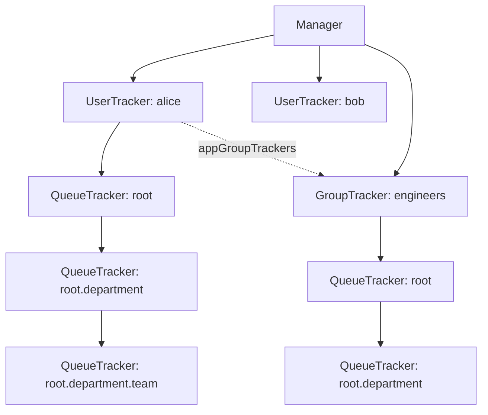

# 第10章 ユーザー・グループリソース制限

> 本章で読むソース
>
> - [pkg/scheduler/ugm/tracker.go L27-L36](https://github.com/apache/yunikorn-core/blob/v1.8.0/pkg/scheduler/ugm/tracker.go#L27-L36)
> - [pkg/scheduler/ugm/manager.go L43-L71](https://github.com/apache/yunikorn-core/blob/v1.8.0/pkg/scheduler/ugm/manager.go#L43-L71)
> - [pkg/scheduler/ugm/manager.go L82-L193](https://github.com/apache/yunikorn-core/blob/v1.8.0/pkg/scheduler/ugm/manager.go#L82-L193)
> - [pkg/scheduler/ugm/manager.go L649-L690](https://github.com/apache/yunikorn-core/blob/v1.8.0/pkg/scheduler/ugm/manager.go#L649-L690)
> - [pkg/scheduler/ugm/user_tracker.go L31-L54](https://github.com/apache/yunikorn-core/blob/v1.8.0/pkg/scheduler/ugm/user_tracker.go#L31-L54)
> - [pkg/scheduler/ugm/group_tracker.go L30-L48](https://github.com/apache/yunikorn-core/blob/v1.8.0/pkg/scheduler/ugm/group_tracker.go#L30-L48)
> - [pkg/scheduler/ugm/queue_tracker.go L34-L81](https://github.com/apache/yunikorn-core/blob/v1.8.0/pkg/scheduler/ugm/queue_tracker.go#L34-L81)
> - [pkg/scheduler/ugm/queue_tracker.go L96-L232](https://github.com/apache/yunikorn-core/blob/v1.8.0/pkg/scheduler/ugm/queue_tracker.go#L96-L232)

## この章の狙い

YuniKorn core はキューの制限とは別に、ユーザーとグループ単位でリソース使用量とアプリケーション数を制限する仕組みを持つ。この仕組みは UGM（User Group Manager）と呼ばれる。本章では `Manager`、`UserTracker`、`GroupTracker`、`QueueTracker` の4層構造を読み、リソース使用量の追跡と制限の判定がどのように行われるかを明らかにする。

## 前提

第4章「キュー階層と共有ポリシー」のキュー構造を前提とする。第5章「アプリケーションとアロケーションリクエスト」の `Application` が `user security.UserGroup` を持つことを参照する。

## Tracker インターフェース

UGM は `Tracker` インターフェースを定義する。

[pkg/scheduler/ugm/tracker.go L27-L36](https://github.com/apache/yunikorn-core/blob/v1.8.0/pkg/scheduler/ugm/tracker.go#L27-L36)

```go
// Tracker Defines a set of interfaces to track and retrieve the user group resource usage
type Tracker interface {
	GetUserResources(user security.UserGroup) *resources.Resource
	GetGroupResources(group string) *resources.Resource

	GetUsersResources() []*UserTracker
	GetGroupsResources() []*GroupTracker

	IncreaseTrackedResource(queuePath, applicationID string, usage *resources.Resource, user security.UserGroup) bool
	DecreaseTrackedResource(queuePath, applicationID string, usage *resources.Resource, user security.UserGroup, removeApp bool) bool
}
```

このインターフェースは `Manager` が実装する。スケジューラは `Manager` に対してリソース使用量の増減と参照を行う。

## Manager の構造

`Manager` は UGM のエントリポイントであり、シングルトンとして存在する。

[pkg/scheduler/ugm/manager.go L43-L71](https://github.com/apache/yunikorn-core/blob/v1.8.0/pkg/scheduler/ugm/manager.go#L43-L71)

```go
// Manager implements tracker. A User Group Manager to track the usage for both user and groups.
// Holds object of both user and group trackers
type Manager struct {
	userTrackers              map[string]*UserTracker
	groupTrackers             map[string]*GroupTracker
	userWildCardLimitsConfig  map[string]*LimitConfig            // Hold limits settings of user '*'
	groupWildCardLimitsConfig map[string]*LimitConfig            // Hold limits settings of group '*'
	configuredGroups          map[string][]string                // Hold groups for all configured queue paths.
	userLimits                map[string]map[string]*LimitConfig // Holds queue path * user limit config
	groupLimits               map[string]map[string]*LimitConfig // Holds queue path * group limit config
	events                    *ugmEvents
	locking.RWMutex
}

func GetUserManager() *Manager {
	once.Do(func() {
		m = newManager()
	})
	return m
}
```

`userTrackers` と `groupTrackers` は実行時の使用量を追跡する。`userLimits` と `groupLimits` は設定から読み込まれた制限を保持する。ワイルドカード（`*`）の制限は別途 `userWildCardLimitsConfig` と `groupWildCardLimitsConfig` で管理する。

`Manager` は `sync.Once` で初期化されるグローバルなシングルトンである。スケジューラの全パーティションで共有される。

## 3層追跡構造

UGM は3層のトラッカーでリソース使用量を追跡する。



**Manager**: 全ユーザーとグループのトラッカーを保持する。

**UserTracker**: 特定ユーザーの全キューでのリソース使用量を保持する。アプリケーションごとにどの `GroupTracker` を使うかを `appGroupTrackers` マップで管理する。

[pkg/scheduler/ugm/user_tracker.go L31-L54](https://github.com/apache/yunikorn-core/blob/v1.8.0/pkg/scheduler/ugm/user_tracker.go#L31-L54)

```go
type UserTracker struct {
    userName string
    appGroupTrackers map[string]*GroupTracker
    queueTracker     *QueueTracker
    events           *ugmEvents
    locking.RWMutex
}
```

**GroupTracker**: 特定グループの全キューでのリソース使用量を保持する。どのユーザーのどのアプリケーションがグループのリソースを使っているかを `applications` マップで追跡する。

[pkg/scheduler/ugm/group_tracker.go L30-L48](https://github.com/apache/yunikorn-core/blob/v1.8.0/pkg/scheduler/ugm/group_tracker.go#L30-L48)

```go
type GroupTracker struct {
	groupName    string            // Name of the group for which usage is being tracked upon
	applications map[string]string // Hold applications currently run by all users belong to this group
	queueTracker *QueueTracker     // Holds the actual resource usage of queue path where application run
	events       *ugmEvents

	locking.RWMutex
}
```

**QueueTracker**: キュー階層を模したツリー構造でリソース使用量と制限を保持する。

[pkg/scheduler/ugm/queue_tracker.go L34-L43](https://github.com/apache/yunikorn-core/blob/v1.8.0/pkg/scheduler/ugm/queue_tracker.go#L34-L43)

```go
type QueueTracker struct {
	queueName           string
	queuePath           string
	resourceUsage       *resources.Resource
	runningApplications map[string]bool
	maxResources        *resources.Resource
	maxRunningApps      uint64
	childQueueTrackers  map[string]*QueueTracker
	useWildCard         bool
}
```

`QueueTracker` は `UserTracker` または `GroupTracker` に1対1で紐付き、ロックは親のトラッカーに委ねる。

## リソース使用量の追跡

`IncreaseTrackedResource` はリソース使用量を増加させる入口である。

[pkg/scheduler/ugm/manager.go L82-L125](https://github.com/apache/yunikorn-core/blob/v1.8.0/pkg/scheduler/ugm/manager.go#L82-L125)

```go
func (m *Manager) IncreaseTrackedResource(queuePath, applicationID string,
    usage *resources.Resource, user security.UserGroup) {
    // ... (parameter validation)
    userTracker := m.getUserTracker(user.User)
    if !userTracker.hasGroupForApp(applicationID) {
        m.ensureGroupTrackerForApp(queuePath, applicationID, user)
    }
    userTracker.increaseTrackedResource(queuePath, applicationID, usage)
    appGroup := userTracker.getGroupForApp(applicationID)
    if appGroup == common.Empty {
        return
    }
    groupTracker := m.GetGroupTracker(appGroup)
    // ...
    groupTracker.increaseTrackedResource(queuePath, applicationID, usage,
        userTracker.userName)
}
```

ユーザーのトラッカーとグループのトラッカーの両方に使用量を加算する。グループのトラッカーが存在しない場合は `ensureGroupTrackerForApp` で解決する。

`QueueTracker.increaseTrackedResource` はキュー階層を再帰的に辿り、各レベルで使用量を加算する。

[pkg/scheduler/ugm/queue_tracker.go L106-L118](https://github.com/apache/yunikorn-core/blob/v1.8.0/pkg/scheduler/ugm/queue_tracker.go#L106-L118)

```go
	if len(hierarchy) > 1 {
		childName := hierarchy[1]
		if qt.childQueueTrackers[childName] == nil {
			qt.childQueueTrackers[childName] = newQueueTracker(qt.queuePath, childName, trackType)
		}
		qt.childQueueTrackers[childName].increaseTrackedResource(hierarchy[1:], applicationID, trackType, usage)
	}
	if qt.resourceUsage == nil {
		qt.resourceUsage = resources.NewResource()
	}
	qt.resourceUsage.AddTo(usage)
	qt.resourceUsage.Prune() // needed as we might be both adding and removing
	qt.runningApplications[applicationID] = true
```

階層の各レベルで `resourceUsage` に加算し、`runningApplications` にアプリケーションを登録する。子キューの `QueueTracker` は必要に応じて遅延生成される。

## ヘッドルームの計算

`Headroom` はアプリケーションがあとどれだけリソースを使えるかを返す。

[pkg/scheduler/ugm/manager.go L649-L668](https://github.com/apache/yunikorn-core/blob/v1.8.0/pkg/scheduler/ugm/manager.go#L649-L668)

```go
func (m *Manager) Headroom(queuePath, applicationID string,
    user security.UserGroup) *resources.Resource {
    hierarchy := strings.Split(queuePath, configs.DOT)
    userTracker := m.getUserTracker(user.User)
    userHeadroom := userTracker.headroom(hierarchy)
    if !userTracker.hasGroupForApp(applicationID) {
        m.ensureGroupTrackerForApp(queuePath, applicationID, user)
    }
    appGroup := userTracker.getGroupForApp(applicationID)
    if appGroup == common.Empty {
        return userHeadroom
    }
    groupTracker := m.GetGroupTracker(appGroup)
    if groupTracker == nil {
        return userHeadroom
    }
    groupHeadroom := groupTracker.headroom(hierarchy)
    return resources.ComponentWiseMin(userHeadroom, groupHeadroom)
}
```

ユーザーのヘッドルームとグループのヘッドルームをそれぞれ計算し、コンポーネントごとの最小値を返す。どちらか一方でも制限に達していれば、それがボトルネックになる。

`QueueTracker.headroom` はキュー階層を辿り、各レベルの `maxResources` から `resourceUsage` を引いた値の最小値を計算する。

[pkg/scheduler/ugm/queue_tracker.go L211-L232](https://github.com/apache/yunikorn-core/blob/v1.8.0/pkg/scheduler/ugm/queue_tracker.go#L211-L232)

```go
func (qt *QueueTracker) headroom(hierarchy []string,
    trackType trackingType) *resources.Resource {
    var headroom, childHeadroom *resources.Resource
    if len(hierarchy) > 1 {
        childName := hierarchy[1]
        if qt.childQueueTrackers[childName] == nil {
            qt.childQueueTrackers[childName] =
                newQueueTracker(qt.queuePath, childName, trackType)
        }
        childHeadroom = qt.childQueueTrackers[childName].headroom(
            hierarchy[1:], trackType)
    }
    if !resources.IsZero(qt.maxResources) {
        headroom = resources.SubOnlyExisting(qt.maxResources, qt.resourceUsage)
    }
    if headroom == nil {
        return childHeadroom
    }
    return resources.ComponentWiseMin(headroom, childHeadroom)
}
```

制限が設定されていないレベルではヘッドルームは `nil`（無制限）を返す。制限があるレベルでは `maxResources - resourceUsage` を計算し、子のヘッドルームとの最小値を取る。

## アプリケーション数の制限

`CanRunApp` は新しいアプリケーションを実行できるかを判定する。

[pkg/scheduler/ugm/manager.go L671-L690](https://github.com/apache/yunikorn-core/blob/v1.8.0/pkg/scheduler/ugm/manager.go#L671-L690)

```go
func (m *Manager) CanRunApp(queuePath, applicationID string,
    user security.UserGroup) bool {
    hierarchy := strings.Split(queuePath, configs.DOT)
    userTracker := m.getUserTracker(user.User)
    userCanRunApp := userTracker.canRunApp(hierarchy, applicationID)
    if !userTracker.hasGroupForApp(applicationID) {
        m.ensureGroupTrackerForApp(queuePath, applicationID, user)
    }
    appGroup := userTracker.getGroupForApp(applicationID)
    if appGroup == common.Empty {
        return userCanRunApp
    }
    groupTracker := m.GetGroupTracker(appGroup)
    if groupTracker == nil {
        return userCanRunApp
    }
    groupCanRunApp := groupTracker.canRunApp(hierarchy, applicationID)
    return userCanRunApp && groupCanRunApp
}
```

ユーザーとグループの両方の `maxRunningApps` を検査し、どちらかが制限に達していれば `false` を返す。

`QueueTracker.canRunApp` はキュー階層を辿り、各レベルで `runningApplications` の数が `maxRunningApps` を超えないかを確認する。

[pkg/scheduler/ugm/queue_tracker.go L421-L450](https://github.com/apache/yunikorn-core/blob/v1.8.0/pkg/scheduler/ugm/queue_tracker.go#L421-L450)

```go
func (qt *QueueTracker) canRunApp(hierarchy []string,
    applicationID string, trackType trackingType) bool {
    childCanRunApp := true
    if len(hierarchy) > 1 {
        childName := hierarchy[1]
        if qt.childQueueTrackers[childName] == nil {
            qt.childQueueTrackers[childName] =
                newQueueTracker(qt.queuePath, childName, trackType)
        }
        childCanRunApp = qt.childQueueTrackers[childName].canRunApp(
            hierarchy[1:], applicationID, trackType)
    }
    if !childCanRunApp {
        return false
    }
    var running int
    if existingApp := qt.runningApplications[applicationID]; existingApp {
        return true
    } else {
        running = len(qt.runningApplications) + 1
    }
    if qt.maxRunningApps != 0 && running > int(qt.maxRunningApps) {
        return false
    }
    return true
}
```

すでに `runningApplications` に登録済みのアプリケーションは追加のカウント対象にならない。新規アプリケーションの場合、現在の数に1を加えて `maxRunningApps` と比較する。

## グループの解決

ユーザーが複数のグループに属する場合、`ensureGroup` はどのグループをトラッキングに使うかを決定する。

[pkg/scheduler/ugm/manager.go L269-L305](https://github.com/apache/yunikorn-core/blob/v1.8.0/pkg/scheduler/ugm/manager.go#L269-L305)

```go
func (m *Manager) ensureGroup(user security.UserGroup, queuePath string) string {
    if len(user.Groups) == 0 {
        return common.Empty
    }
    m.RLock()
    defer m.RUnlock()
    return m.ensureGroupInternal(user.Groups, queuePath)
}

func (m *Manager) ensureGroupInternal(userGroups []string,
    queuePath string) string {
    if configGroups, ok := m.configuredGroups[queuePath]; ok {
        for _, configGroup := range configGroups {
            for _, g := range userGroups {
                if configGroup == g {
                    return configGroup
                }
            }
        }
    }
    if m.groupWildCardLimitsConfig[queuePath] != nil {
        return common.Wildcard
    }
    parentPath := getParentPath(queuePath)
    if parentPath == common.Empty {
        return common.Empty
    }
    return m.ensureGroupInternal(userGroups, parentPath)
}
```

リーフキューからルートに向かって、設定に存在するグループとユーザーのグループの交叉を探す。最初に見つかったグループを使う。設定に明示的なグループがなければワイルドカードを返し、それもなければ上位のキューパスを再帰的に探索する。

## ワイルドカード制限

設定で `*` を指定すると、すべてのユーザーまたはグループに共通の制限を適用できる。

[pkg/scheduler/ugm/manager.go L461-L471](https://github.com/apache/yunikorn-core/blob/v1.8.0/pkg/scheduler/ugm/manager.go#L461-L471)

```go
func (m *Manager) applyWildCardUserLimits(newUserWildCardLimits map[string]*LimitConfig, newUserLimits map[string]map[string]*LimitConfig) {
	m.RLock()
	defer m.RUnlock()
	for queuePath, newLimitConfig := range newUserWildCardLimits {
		for _, ut := range m.userTrackers {
			if _, ok := newUserLimits[queuePath][ut.userName]; !ok {
				ut.setLimits(queuePath, newLimitConfig.maxResources, newLimitConfig.maxApplications, true, false)
			}
		}
	}
}
```

ワイルドカード制限は明示的な制限を持たないすべての `UserTracker` に適用される。`QueueTracker` の `useWildCard` フラグは、ワイルドカード由来の制限であることを記録し、後の設定更新で明示的な制限に置き換えるべきかを判定する。

## 設定の動的更新

`UpdateConfig` はキュー設定の変更を UGM に反映する。

[pkg/scheduler/ugm/manager.go L307-L333](https://github.com/apache/yunikorn-core/blob/v1.8.0/pkg/scheduler/ugm/manager.go#L307-L333)

```go
func (m *Manager) UpdateConfig(config configs.QueueConfig, queuePath string) error {
	// ... (initialize temporary maps)
	if err := m.internalProcessConfig(config, queuePath, userLimits, groupLimits, userWildCardLimitsConfig, groupWildCardLimitsConfig, configuredGroups); err != nil {
		return err
	}
	m.clearEarlierSetLimits(userLimits, groupLimits)
	m.clearEarlierSetUserWildCardLimits(userWildCardLimitsConfig, userLimits)
	m.applyWildCardUserLimits(userWildCardLimitsConfig, userLimits)
	m.replaceLimitConfigs(userLimits, groupLimits, userWildCardLimitsConfig, groupWildCardLimitsConfig, configuredGroups)
	return nil
}
```

新しい設定を一時マップに展開してから、既存の設定と比較して不要になった制限をクリアする。その後ワイルドカードを再適用し、最後に設定を一気に置き換える。この4ステップ構造により、設定変更中でもトラッカーの一貫性が保たれる。

## QueueTracker の遅延生成と自動削除

`QueueTracker` は使用量が増加したときに必要に応じて生成され、使用量がゼロになり実行アプリケーションもなくなると削除される。

[pkg/scheduler/ugm/queue_tracker.go L141-L175](https://github.com/apache/yunikorn-core/blob/v1.8.0/pkg/scheduler/ugm/queue_tracker.go#L141-L175)

```go
	if len(hierarchy) > 1 {
		childName := hierarchy[1]
		// ...
		removeQT := qt.childQueueTrackers[childName].decreaseTrackedResource(hierarchy[1:], applicationID, usage, removeApp)
		if removeQT {
			// ...
			delete(qt.childQueueTrackers, childName)
		}
	}
	qt.resourceUsage.SubFrom(usage)
	qt.resourceUsage.Prune()
	if removeApp {
		// ...
		delete(qt.runningApplications, applicationID)
	}

	// Determine if the queue tracker should be removed
	removeQT := len(qt.childQueueTrackers) == 0 && len(qt.runningApplications) == 0 && resources.IsZero(qt.resourceUsage) &&
		qt.maxRunningApps == 0 && resources.IsZero(qt.maxResources)
```

`decreaseTrackedResource` は使用量を減らした後に、子キューも実行アプリケーションもリソース使用量も制限もすべてゼロであれば `true` を返す。親はこれを受けて `childQueueTrackers` マップからエントリを削除する。この再帰的な削除により、使われていないキューのトラッカーがメモリに残り続けることを防ぐ。

## 最適化: ロックフリーな QueueTracker

`QueueTracker` のコメントには「The QueueTracker is designed to be lock free and should remain as such」と明記されている。

[pkg/scheduler/ugm/queue_tracker.go L32-L34](https://github.com/apache/yunikorn-core/blob/v1.8.0/pkg/scheduler/ugm/queue_tracker.go#L32-L34)

```go
// The QueueTracker is designed to be lock free and should remain as such.
// Each QueueTracker object is always only linked to single UserTracker or GroupTracker. The responsibility of managing locks is delegated to those objects.
type QueueTracker struct {
```

`QueueTracker` 自体はロックを持たない。ロックは `UserTracker` と `GroupTracker` が `locking.RWMutex` で管理する。これにより、`QueueTracker` の再帰的な走査でロックのオーバーヘッドが蓄積しない。スケジューリングサイクル内で頻繁に呼び出される `headroom` や `canRunApp` は `QueueTracker` をロックなしで辿れるため、レイテンシが抑制される。

## まとめ

UGM は `Manager`、`UserTracker`、`GroupTracker`、`QueueTracker` の4層構造でリソース使用量とアプリケーション数を追跡する。`Manager` はシングルトンとして全パーティションで共有され、リソースの増減時にユーザーとグループの両方のトラッカーを更新する。ヘッドルームはユーザーとグループの最小値で計算され、どちらかが制限に達すればスケジューリングが抑制される。`QueueTracker` はロックフリーで設計され、遅延生成と自動削除でメモリ効率を維持する。

## 関連する章

- 第4章「キュー階層と共有ポリシー」: キューの `MaxResource` と `GuaranteedResource`
- 第5章「アプリケーションとアロケーションリクエスト」: `Application` のユーザー情報
- 第8章「リザベーションとギャングスケジューリング」: `tryReservedAllocate` での UGM ヘッドルーム参照
- 第9章「プリエンプション」: UGM の制限がプリエンプションのトリガになる仕組み
