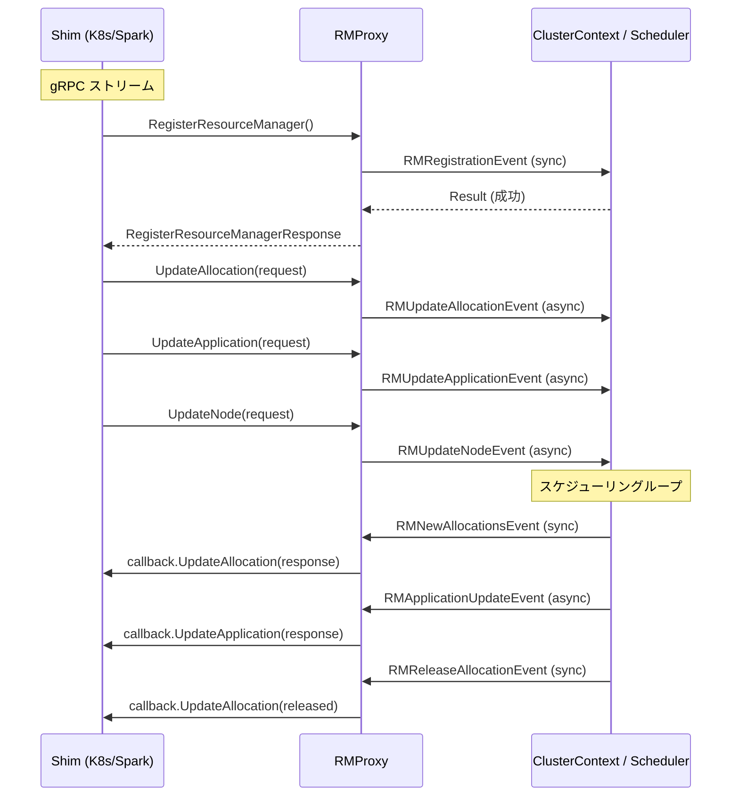

# 第11章 RMProxy と scheduler-interface

> 本章で読むソース:
>
> - [pkg/rmproxy/rmproxy.go L19-L344](https://github.com/apache/yunikorn-core/blob/v1.8.0/pkg/rmproxy/rmproxy.go#L19-L344)
> - [pkg/rmproxy/rmevent/events.go L19-L99](https://github.com/apache/yunikorn-core/blob/v1.8.0/pkg/rmproxy/rmevent/events.go#L19-L99)
> - [pkg/plugins/plugins.go L19-L68](https://github.com/apache/yunikorn-core/blob/v1.8.0/pkg/plugins/plugins.go#L19-L68)
> - [pkg/plugins/types.go L19-L31](https://github.com/apache/yunikorn-core/blob/v1.8.0/pkg/plugins/types.go#L19-L31)
> - [pkg/handler/event_handlers.go L19-L28](https://github.com/apache/yunikorn-core/blob/v1.8.0/pkg/handler/event_handlers.go#L19-L28)

## この章の狙い

YuniKorn のアーキテクチャは、スケジューラ本体（core）とリソースマネージャ（shim）がプロセス分離されている。
`RMProxy` はその境界に位置し、両者の間のイベント変換と転送を担うゲートウェイである。
本章では `RMProxy` の内部構造と、`scheduler-interface`（`si` パッケージ）で定義される gRPC 連携の仕組みを読み解く。

## 前提

- 第10章で `ClusterContext` のスケジューリングループを読んでいる。
- YuniKorn の shim（Kubernetes 用、Spark 用など）が外部プロセスとして動作し、gRPC で core と通信する。
- [Kubernetes と YuniKorn の統合](../../../spark/part09-kubernetes/27-k8s-yunikorn-integration.md) で shim 側の全体像がわかる。

## RMProxy の構造

`RMProxy` は core 側の最上位に位置し、shim から届くリクエストを内部イベントに変換してスケジューラに渡す。
同時にスケジューラからの応答を shim のコールバックインターフェース経由で返す。

[pkg/rmproxy/rmproxy.go L41-L51](https://github.com/apache/yunikorn-core/blob/v1.8.0/pkg/rmproxy/rmproxy.go#L41-L51)

```go
type RMProxy struct {
    schedulerEventHandler handler.EventHandler // read-only, no lock needed to access it
    stop                  chan struct{}

    // Internal fields
    pendingRMEvents chan interface{}

    rmIDToCallback map[string]api.ResourceManagerCallback

    locking.RWMutex
}
```

`RMProxy` は4つのフィールドを持つ。

- **`schedulerEventHandler`**: スケジューラのイベントハンドラへの参照。スケジューラへイベントを送るために使う。
- **`pendingRMEvents`**: 内部イベントキュー。バッファサイズは `1024*1024`（約100万）。
- **`rmIDToCallback`**: RM ID をキーに、shim のコールバックを保持するマップ。
- **`RWMutex`**: `rmIDToCallback` への読み書きを保護する。

## EventHandler インターフェース

`RMProxy` とスケジューラの間のイベント受け渡しは、`EventHandler` インターフェースで抽象化されている。

[pkg/handler/event_handlers.go L21-L28](https://github.com/apache/yunikorn-core/blob/v1.8.0/pkg/handler/event_handlers.go#L21-L28)

```go
type EventHandler interface {
    HandleEvent(ev interface{})
}

type EventHandlers struct {
    RMProxyEventHandler   EventHandler
    SchedulerEventHandler EventHandler
}
```

`EventHandler` は `HandleEvent` メソッドひとつだけのシンプルなインターフェースである。
`EventHandlers` 構造体は RMProxy 用とスケジューラ用の2つのハンドラを保持し、起動時に互いの参照を結びつける。
これにより RMProxy はスケジューラへ、スケジューラは RMProxy へ、それぞれイベントを送れる。

## イベントキューと非同期処理

`RMProxy` へのイベント到着は `HandleEvent` メソッドでキューに積まれる。

[pkg/rmproxy/rmproxy.go L57-L72](https://github.com/apache/yunikorn-core/blob/v1.8.0/pkg/rmproxy/rmproxy.go#L57-L72)

```go
func enqueueAndCheckFull(queue chan interface{}, ev interface{}) {
    select {
    case queue <- ev:
        log.Log(log.RMProxy).Debug("enqueue event",
            zap.Stringer("eventType", reflect.TypeOf(ev)),
            zap.Any("event", ev),
            zap.Int("currentQueueSize", len(queue)))
    default:
        log.Log(log.RMProxy).DPanic("failed to enqueue event",
            zap.Stringer("event", reflect.TypeOf(ev)))
    }
}

func (rmp *RMProxy) HandleEvent(ev interface{}) {
    enqueueAndCheckFull(rmp.pendingRMEvents, ev)
}
```

`enqueueAndCheckFull` は `select` の `default` 分岐でキュー満杯を検出する。
キューが満杯のときは `DPanic` を発するが、イベント自体は捨てる。
これはスケジューラ全体の停止を防ぐための安全弁である。
キューが詰まるほどイベントが殺到する状況で、呼び出し元をブロックしてバックプレッシャをかけると、gRPC ストリーム全体が停止する恐れがある。

## RM イベントの種別

`rmevent` パッケージは、shim と core の間でやり取りするイベントを型定義する。

[pkg/rmproxy/rmevent/events.go L26-L99](https://github.com/apache/yunikorn-core/blob/v1.8.0/pkg/rmproxy/rmevent/events.go#L26-L99)

イベントは方向によって2種類に分かれる。

**shim から core へ（入力方向）**:

- **`RMUpdateAllocationEvent`**: アロケーション（コンテナ割り当て）の追加・更新。非同期。
- **`RMUpdateApplicationEvent`**: アプリケーションの追加・削除。非同期。
- **`RMUpdateNodeEvent`**: ノードの追加・削除・更新。非同期。
- **`RMRegistrationEvent`**: RM の登録。同期的で、結果をチャネルで受け取る。
- **`RMConfigUpdateEvent`**: 設定の更新。同期的。
- **`RMPartitionsRemoveEvent`**: パーティションの削除。同期的。

**core から shim へ（出力方向）**:

- **`RMNewAllocationsEvent`**: 新規アロケーションの通知。
- **`RMApplicationUpdateEvent`**: アプリケーションの受理・拒否・更新。
- **`RMRejectedAllocationEvent`**: 拒否されたアロケーション。
- **`RMReleaseAllocationEvent`**: 解放されたアロケーション。
- **`RMNodeUpdateEvent`**: ノードの受理・拒否。

同期的イベントは `Channel chan *Result` フィールドを持ち、処理完了を呼び出し元に通知する。
非同期イベントはチャネルを持たず、結果は出力方向のイベントで後から通知される。

## イベントループ

`handleRMEvents` は `RMProxy` の心臓部で、キューからイベントを取り出して種別ごとにディスパッチする。

[pkg/rmproxy/rmproxy.go L187-L209](https://github.com/apache/yunikorn-core/blob/v1.8.0/pkg/rmproxy/rmproxy.go#L187-L209)

```go
func (rmp *RMProxy) handleRMEvents() {
    for {
        select {
        case ev := <-rmp.pendingRMEvents:
            switch v := ev.(type) {
            case *rmevent.RMNewAllocationsEvent:
                rmp.processAllocationUpdateEvent(v)
            case *rmevent.RMApplicationUpdateEvent:
                rmp.processApplicationUpdateEvent(v)
            case *rmevent.RMReleaseAllocationEvent:
                rmp.processRMReleaseAllocationEvent(v)
            case *rmevent.RMRejectedAllocationEvent:
                rmp.processRMRejectedAllocationEvent(v)
            case *rmevent.RMNodeUpdateEvent:
                rmp.processRMNodeUpdateEvent(v)
            default:
                panic(fmt.Sprintf("%s is not an acceptable type for RM event.", reflect.TypeOf(v).String()))
            }
        case <-rmp.stop:
            return
        }
    }
}
```

このループは単一の goroutine で動き、出力方向のイベントだけを処理する。
入力方向のイベント（`RMUpdateAllocationEvent` など）は `schedulerEventHandler` 経由でスケジューラに送られるため、ここでは処理しない。
`default` 分岐での `panic` は、未登録のイベント型が混入したときに即座に検出するための防御コードである。

## shim の登録とコールバック

`RegisterResourceManager` は shim が core に自身を登録するときの入口である。

[pkg/rmproxy/rmproxy.go L211-L256](https://github.com/apache/yunikorn-core/blob/v1.8.0/pkg/rmproxy/rmproxy.go#L211-L256)

```go
func (rmp *RMProxy) RegisterResourceManager(request *si.RegisterResourceManagerRequest,
    callback api.ResourceManagerCallback) (*si.RegisterResourceManagerResponse, error) {
    rmp.Lock()
    defer rmp.Unlock()
    c := make(chan *rmevent.Result)

    // If this is a re-register we need to clean up first
    if rmp.rmIDToCallback[request.RmID] != nil {
        go func() {
            rmp.schedulerEventHandler.HandleEvent(
                &rmevent.RMPartitionsRemoveEvent{
                    RmID:    request.RmID,
                    Channel: c,
                })
        }()
        result := <-c
        close(c)
        if !result.Succeeded {
            return nil, fmt.Errorf("registration of RM failed: %v", result.Reason)
        }
    }

    c = make(chan *rmevent.Result)

    // Add new RM.
    go func() {
        rmp.schedulerEventHandler.HandleEvent(
            &rmevent.RMRegistrationEvent{
                Registration: request,
                Channel:      c,
            })
    }()

    result := <-c
    if result.Succeeded {
        rmp.rmIDToCallback[request.RmID] = callback
        plugins.RegisterSchedulerPlugin(callback)
        return &si.RegisterResourceManagerResponse{}, nil
    }
    return nil, fmt.Errorf("registration of RM failed: %v", result.Reason)
}
```

登録処理は次の順で進む。

1. 再登録の場合は既存パーティションを削除する（`RMPartitionsRemoveEvent`）。
2. `RMRegistrationEvent` をスケジューラに送り、設定のロードとパーティションの生成を依頼する。
3. 成功すればコールバックを `rmIDToCallback` に保存し、`plugins.RegisterSchedulerPlugin` でプラグインとしても登録する。

`callback` は `api.ResourceManagerCallback` インターフェースを実装する。
このインターフェースは `yunikorn-scheduler-interface` ライブラリで定義され、`UpdateAllocation`、`UpdateApplication`、`UpdateNode`、`SendEvent` などのメソッドを持つ。

## プラグイン機構

`plugins` パッケージは、shim のコールバックをスケジューラプラグインとしても登録する仕組みを提供する。

[pkg/plugins/types.go L26-L31](https://github.com/apache/yunikorn-core/blob/v1.8.0/pkg/plugins/types.go#L26-L31)

```go
type SchedulerPlugins struct {
    ResourceManagerCallbackPlugin api.ResourceManagerCallback
    StateDumpPlugin               api.StateDumpPlugin

    locking.RWMutex
}
```

[pkg/plugins/plugins.go L34-L45](https://github.com/apache/yunikorn-core/blob/v1.8.0/pkg/plugins/plugins.go#L34-L45)

```go
func RegisterSchedulerPlugin(plugin interface{}) {
    plugins.Lock()
    defer plugins.Unlock()
    if rmc, ok := plugin.(api.ResourceManagerCallback); ok {
        log.Log(log.RMProxy).Info("register scheduler plugin: ResourceManagerCallback")
        plugins.ResourceManagerCallbackPlugin = rmc
    }
    if sdp, ok := plugin.(api.StateDumpPlugin); ok {
        log.Log(log.RMProxy).Info("register scheduler plugin: StateDumpPlugin")
        plugins.StateDumpPlugin = sdp
    }
}
```

`RegisterSchedulerPlugin` は型アサーションで、渡されたオブジェクトがどのプラグインインターフェースを実装するかを判定する。
`api.ResourceManagerCallback` を実装していれば `SendEvent` メソッドが使えるようになり、イベントを shim にプッシュできる。
`api.StateDumpPlugin` を実装していれば、スケジューラの内部状態をダンプして shim 側で診断に使える。

## 出力イベントの処理

スケジューラが新しいアロケーションを決定すると、`RMNewAllocationsEvent` が `RMProxy` に届く。

[pkg/rmproxy/rmproxy.go L94-L108](https://github.com/apache/yunikorn-core/blob/v1.8.0/pkg/rmproxy/rmproxy.go#L94-L108)

```go
func (rmp *RMProxy) processAllocationUpdateEvent(event *rmevent.RMNewAllocationsEvent) {
    allocationsCount := len(event.Allocations)
    if allocationsCount != 0 {
        response := &si.AllocationResponse{
            New: event.Allocations,
        }
        rmp.triggerUpdateAllocation(event.RmID, response)
        metrics.GetSchedulerMetrics().AddAllocatedContainers(len(event.Allocations))
    }
    event.Channel <- &rmevent.Result{
        Succeeded: true,
        Reason:    "no. of allocations: " + strconv.Itoa(allocationsCount),
    }
}
```

`triggerUpdateAllocation` は `rmIDToCallback` から対応するコールバックを取り出し、`UpdateAllocation` を呼ぶ。

[pkg/rmproxy/rmproxy.go L146-L155](https://github.com/apache/yunikorn-core/blob/v1.8.0/pkg/rmproxy/rmproxy.go#L146-L155)

```go
func (rmp *RMProxy) triggerUpdateAllocation(rmID string, response *si.AllocationResponse) {
    if callback := rmp.GetResourceManagerCallback(rmID); callback != nil {
        if err := callback.UpdateAllocation(response); err != nil {
            rmp.handleUpdateResponseError(rmID, err)
        }
    } else {
        log.Log(log.RMProxy).DPanic("RM is not registered",
            zap.String("rmID", rmID))
    }
}
```

コールバックの `UpdateAllocation` は gRPC ストリームを通じて shim に `AllocationResponse` を送信する。
shim はこれを受けて Kubernetes の Pod binding や Spark のタスク割り当てを実際に行う。

## 入力イベントの正規化

shim から届くリクエストはパーティション名が省略されている場合がある。
`UpdateAllocation`、`UpdateApplication`、`UpdateNode` はパーティション名を正規化してからスケジューラに送る。

[pkg/rmproxy/rmproxy.go L265-L282](https://github.com/apache/yunikorn-core/blob/v1.8.0/pkg/rmproxy/rmproxy.go#L265-L282)

```go
func (rmp *RMProxy) UpdateAllocation(request *si.AllocationRequest) error {
    if rmp.GetResourceManagerCallback(request.RmID) == nil {
        return fmt.Errorf("received AllocationRequest, but RmID=\"%s\" not registered", request.RmID)
    }
    for _, alloc := range request.Allocations {
        alloc.PartitionName = common.GetNormalizedPartitionName(alloc.PartitionName, request.RmID)
    }
    if request.Releases != nil {
        for _, rel := range request.Releases.AllocationsToRelease {
            rel.PartitionName = common.GetNormalizedPartitionName(rel.PartitionName, request.RmID)
        }
    }
    rmp.schedulerEventHandler.HandleEvent(&rmevent.RMUpdateAllocationEvent{Request: request})
    return nil
}
```

`GetNormalizedPartitionName` はパーティション名に RM ID を付加して `"[rmID]partitionName"` 形式にする。
これにより複数 RM が同一のパーティション名を使っても衝突しない。

## イベントフローの全体像

shim と core の間のイベントフローを下に示す。



入力方向（shim → core）は非同期イベントが多く、出力方向（core → shim）はコールバック経由で同期的に応答する。
この非対称性は、スケジューラの決定結果を shim に確実に届ける必要があるためである。

## 最適化: 巨大バッファによるイベント吸収

`pendingRMEvents` チャネルのバッファサイズは `1024*1024`（約100万）である。

[pkg/rmproxy/rmproxy.go L77](https://github.com/apache/yunikorn-core/blob/v1.8.0/pkg/rmproxy/rmproxy.go#L77)

```go
	pendingRMEvents:       make(chan interface{}, 1024*1024),
```

この巨大なバッファは、バースト的なイベント到着を吸収するために設計されている。
Kubernetes クラスタで数千の Pod が同時に起動すると、shim から大量の `AllocationRequest` が短時間に届く。
バッファが小さければ `enqueueAndCheckFull` の `default` 分岐が頻繁に通り、イベントが捨てられる。
100万のバッファはメモリ消費（ポインタの配列で数MB程度）と引き換えに、イベント消失のリスクを実用的なレベルまで下げている。

## まとめ

`RMProxy` は shim と core の間のゲートウェイであり、次の3つの役割を持つ。

1. **プロトコル変換**: gRPC の `si` メッセージを内部イベント型に変換し、パーティション名の正規化を行う。
2. **イベントキュー**: 100万バッファのチャネルでイベントを一旦受け止め、単一 goroutine のディスパッチャに渡す。
3. **コールバック管理**: shim のコールバックを RM ID ごとに保持し、スケジューラの決定結果を `UpdateAllocation` 等で返す。

`EventHandler` インターフェースは RMProxy とスケジューラの結合を緩め、両者が互いの実装詳細を知らなくても通信できるようにする。
プラグイン機構は `scheduler-interface` のインターフェースを再利用し、追加の依存なしにイベントプッシュと状態ダンプを可能にしている。

## 関連する章

- 第10章: ClusterContext とスケジューリングループ
- 第12章: イベントハンドリングと設定管理
- 第13章: パーティション管理
- [Kubernetes と YuniKorn の統合](../../../spark/part09-kubernetes/27-k8s-yunikorn-integration.md)
